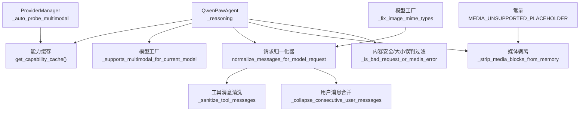
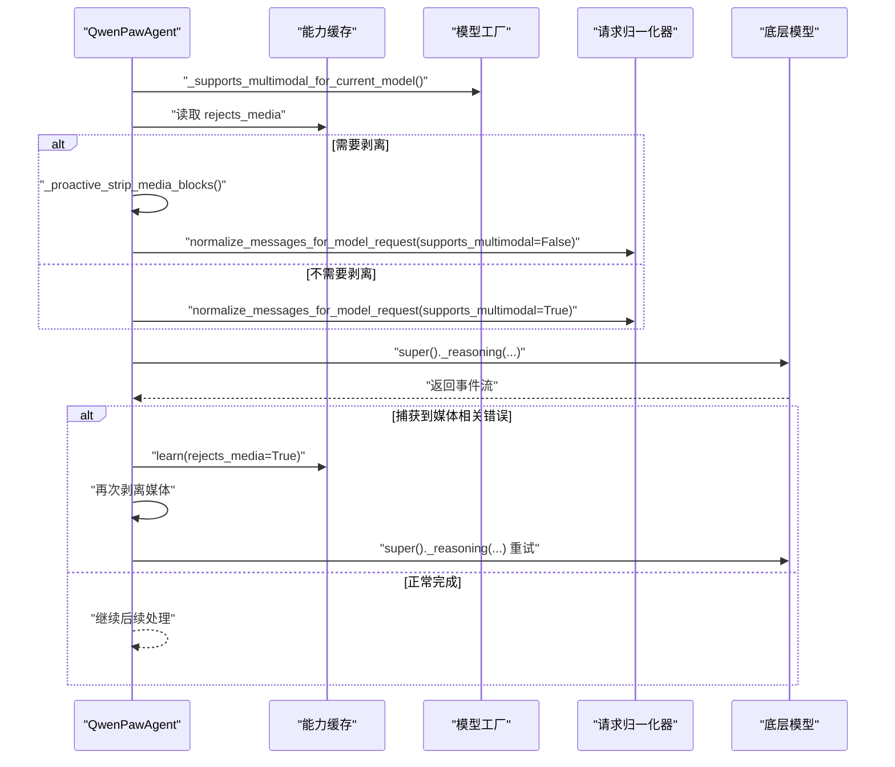
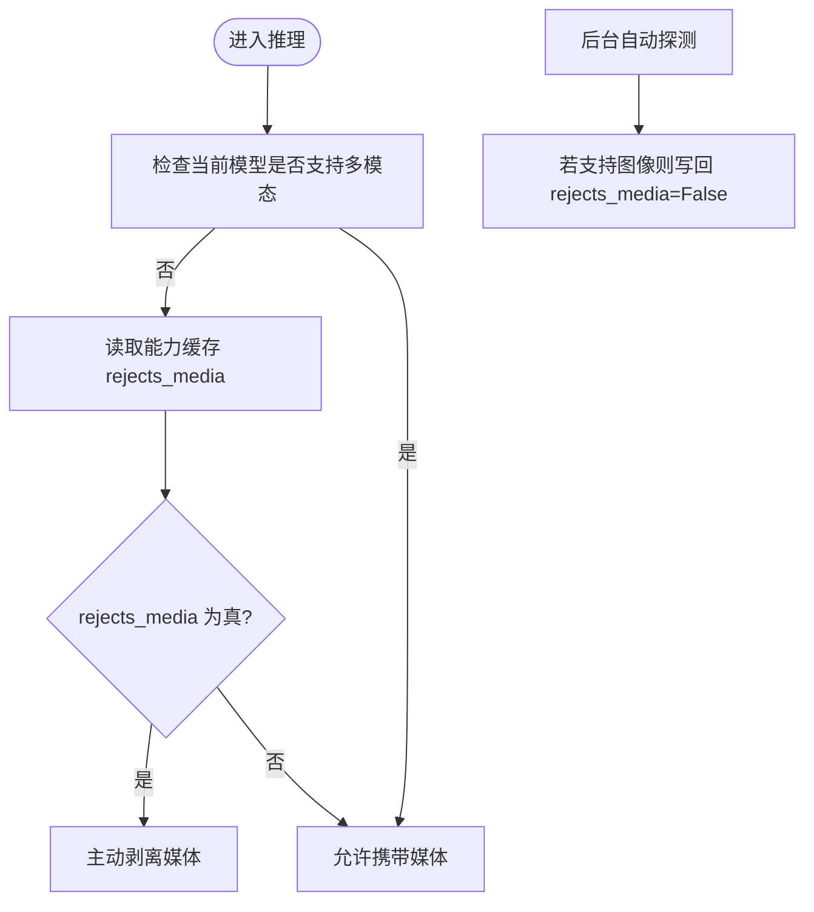
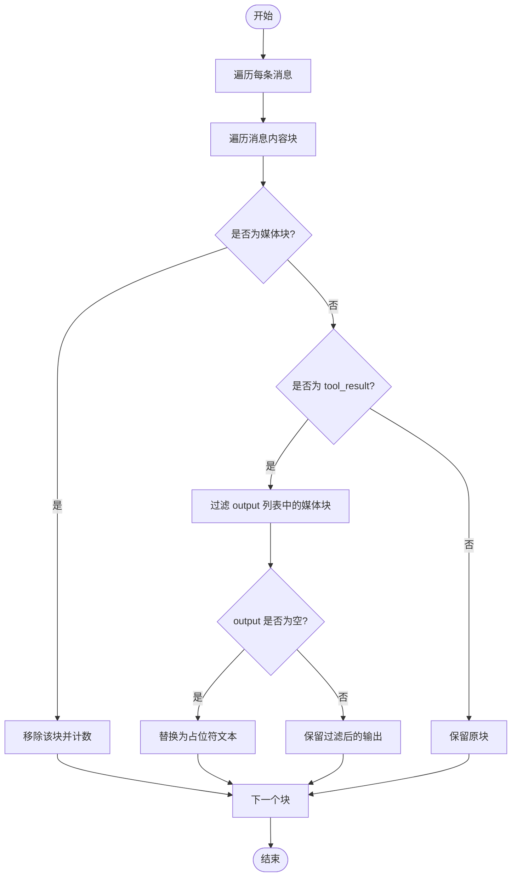
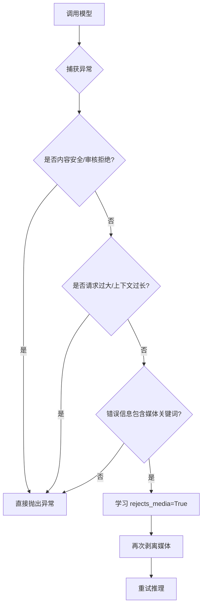
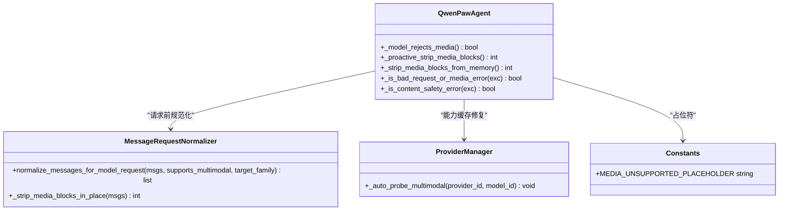

# 媒体块处理机制

<cite>
**本文引用的文件**   
- [react_agent.py](file://src/qwenpaw/agents/react_agent.py)
- [message_request_normalizer.py](file://src/qwenpaw/agents/utils/message_request_normalizer.py)
- [constant.py](file://src/qwenpaw/constant.py)
- [provider_manager.py](file://src/qwenpaw/providers/provider_manager.py)
- [model_factory.py](file://src/qwenpaw/agents/model_factory.py)
</cite>

## 目录
1. [简介](#简介)
2. [项目结构](#项目结构)
3. [核心组件](#核心组件)
4. [架构总览](#架构总览)
5. [详细组件分析](#详细组件分析)
6. [依赖关系分析](#依赖关系分析)
7. [性能考量](#性能考量)
8. [故障排查指南](#故障排查指南)
9. [结论](#结论)

## 简介
本文件系统性梳理 QwenPaw Agent 的“媒体块处理机制”，重点覆盖：
- 多模态支持检测逻辑与能力缓存（_model_rejects_media）
- 媒体块的主动剥离策略（_proactive_strip_media_blocks）
- 被动重试机制（基于错误语义识别的自动降级与重试）
- 媒体类型识别、MIME 前缀匹配与内容安全过滤
- ToolResultBlock 嵌套处理与占位符替换
- 关键流程的代码级示例路径与图示

## 项目结构
媒体块处理涉及以下关键模块：
- 智能体推理入口与媒体降级控制：QwenPawAgent._reasoning
- 请求时归一化与媒体剥离：normalize_messages_for_model_request
- 能力缓存与自动探测：ProviderManager._auto_probe_multimodal
- 常量与占位符：MEDIA_UNSUPPORTED_PLACEHOLDER
- 模型侧媒体格式修复与 MIME 修正：model_factory

图表来源
- [react_agent.py:411-515](file://src/qwenpaw/agents/react_agent.py#L411-L515)
- [message_request_normalizer.py:240-267](file://src/qwenpaw/agents/utils/message_request_normalizer.py#L240-L267)
- [provider_manager.py:1645-1675](file://src/qwenpaw/providers/provider_manager.py#L1645-L1675)
- [constant.py:404-407](file://src/qwenpaw/constant.py#L404-L407)
- [model_factory.py:588-625](file://src/qwenpaw/agents/model_factory.py#L588-L625)

章节来源
- [react_agent.py:411-515](file://src/qwenpaw/agents/react_agent.py#L411-L515)
- [message_request_normalizer.py:240-267](file://src/qwenpaw/agents/utils/message_request_normalizer.py#L240-L267)
- [provider_manager.py:1645-1675](file://src/qwenpaw/providers/provider_manager.py#L1645-L1675)
- [constant.py:404-407](file://src/qwenpaw/constant.py#L404-L407)
- [model_factory.py:588-625](file://src/qwenpaw/agents/model_factory.py#L588-L625)

## 核心组件
- QwenPawAgent._reasoning：在每次推理前判断是否需要剥离媒体，并在发生疑似媒体相关错误时进行被动重试。
- QwenPawAgent._model_rejects_media：读取能力缓存中的 rejects_media 标记，决定当前模型是否拒绝媒体。
- QwenPawAgent._proactive_strip_media_blocks：当模型不支持多模态或已学习为拒绝媒体时，提前从上下文剥离媒体块。
- normalize_messages_for_model_request：在构造请求前对消息进行深拷贝与规范化，按需剥离媒体并清理无关字段。
- ProviderManager._auto_probe_multimodal：后台探测模型的多模态能力，并修复被误写入的 rejects_media 缓存项。
- MEDIA_UNSUPPORTED_PLACEHOLDER：当所有媒体被剥离后用于填充文本占位符，避免空内容导致 API 报错。

章节来源
- [react_agent.py:384-397](file://src/qwenpaw/agents/react_agent.py#L384-L397)
- [react_agent.py:411-515](file://src/qwenpaw/agents/react_agent.py#L411-L515)
- [message_request_normalizer.py:240-267](file://src/qwenpaw/agents/utils/message_request_normalizer.py#L240-L267)
- [provider_manager.py:1645-1675](file://src/qwenpaw/providers/provider_manager.py#L1645-L1675)
- [constant.py:404-407](file://src/qwenpaw/constant.py#L404-L407)

## 架构总览
下图展示一次推理调用中媒体处理的完整时序：主动判断、可选剥离、调用模型、异常捕获与被动重试、以及能力缓存的更新。

图表来源
- [react_agent.py:448-515](file://src/qwenpaw/agents/react_agent.py#L448-L515)
- [message_request_normalizer.py:240-267](file://src/qwenpaw/agents/utils/message_request_normalizer.py#L240-L267)

## 详细组件分析

### 多模态支持检测与能力缓存
- _model_rejects_media：通过模型 key 查询能力缓存中的 rejects_media 标志，若未设置则默认不拒绝。
- _auto_probe_multimodal：后台探测模型是否支持图像等媒体；若探测成功，会强制将 rejects_media 设为 False，修复之前因非媒体原因导致的误判。

图表来源
- [react_agent.py:384-397](file://src/qwenpaw/agents/react_agent.py#L384-L397)
- [provider_manager.py:1645-1675](file://src/qwenpaw/providers/provider_manager.py#L1645-L1675)

章节来源
- [react_agent.py:384-397](file://src/qwenpaw/agents/react_agent.py#L384-L397)
- [provider_manager.py:1645-1675](file://src/qwenpaw/providers/provider_manager.py#L1645-L1675)

### 媒体块主动剥离策略
- _proactive_strip_media_blocks：当模型不支持多模态或已学习为拒绝媒体时，调用内部剥离函数从上下文中移除媒体块。
- _strip_media_blocks_from_memory：遍历上下文消息，识别并移除 image/audio/video/file 及 DataBlock（media_type 以 image/audio/video 开头）。同时处理 ToolResultBlock.output 中的嵌套媒体，若剥离后输出为空则用占位符填充。

图表来源
- [react_agent.py:745-808](file://src/qwenpaw/agents/react_agent.py#L745-L808)
- [constant.py:404-407](file://src/qwenpaw/constant.py#L404-L407)

章节来源
- [react_agent.py:391-397](file://src/qwenpaw/agents/react_agent.py#L391-L397)
- [react_agent.py:745-808](file://src/qwenpaw/agents/react_agent.py#L745-L808)
- [constant.py:404-407](file://src/qwenpaw/constant.py#L404-L407)

### 被动重试机制与错误语义识别
- _is_bad_request_or_media_error：仅当错误信息明确指向媒体相关问题时才触发降级重试。排除两类情况：
  - 内容安全/审核拒绝（如 sensitive、moderation 等），这类属于单次输入问题而非模型能力问题。
  - 请求过大/上下文长度限制等，这些并非媒体能力问题，不应污染能力缓存。
- 当判定为媒体相关错误时：
  - 记录并学习 rejects_media=True，避免后续重复尝试失败。
  - 再次剥离媒体并调用 super()._reasoning 进行重试。

图表来源
- [react_agent.py:569-612](file://src/qwenpaw/agents/react_agent.py#L569-L612)
- [react_agent.py:475-515](file://src/qwenpaw/agents/react_agent.py#L475-L515)

章节来源
- [react_agent.py:569-612](file://src/qwenpaw/agents/react_agent.py#L569-L612)
- [react_agent.py:475-515](file://src/qwenpaw/agents/react_agent.py#L475-L515)

### 媒体类型识别、MIME 前缀匹配与内容安全过滤
- 媒体块识别规则：
  - 显式类型：image、audio、video、file（字典或 Pydantic 对象均支持）。
  - DataBlock：type="data" 且 source.media_type 以 image/、audio/、video/ 开头。
- 内容安全过滤：
  - 通过 _is_content_safety_error 识别敏感词（如 new_sensitive、content policy、moderation 等），此类错误不会触发媒体降级。
- MIME 修正：
  - model_factory 中对 base64 data URL 的非标准 MIME（如 image/jpg）进行修正为 image/jpeg，避免某些网关拒收。

章节来源
- [react_agent.py:614-625](file://src/qwenpaw/agents/react_agent.py#L614-L625)
- [react_agent.py:554-568](file://src/qwenpaw/agents/react_agent.py#L554-L568)
- [model_factory.py:588-625](file://src/qwenpaw/agents/model_factory.py#L588-L625)

### ToolResultBlock 嵌套处理与占位符替换
- 在 _strip_media_blocks_from_memory 与 message_request_normalizer 中，均对 tool_result.output 列表进行递归过滤，移除其中的媒体块。
- 若过滤后 output 为空，则使用 MEDIA_UNSUPPORTED_PLACEHOLDER 作为文本占位符，确保消息结构合法且不丢失上下文可读性。
- 若整条消息的所有块都被移除，则在消息内容中插入一个文本占位块，防止出现空 content 导致 API 报错。

章节来源
- [react_agent.py:774-808](file://src/qwenpaw/agents/react_agent.py#L774-L808)
- [message_request_normalizer.py:169-195](file://src/qwenpaw/agents/utils/message_request_normalizer.py#L169-L195)
- [constant.py:404-407](file://src/qwenpaw/constant.py#L404-L407)

### 请求时媒体剥离与规范化
- normalize_messages_for_model_request：
  - 深拷贝消息，避免修改持久化历史。
  - 先执行工具消息清洗与连续 user 消息合并，再根据目标模型是否支持多模态决定是否剥离媒体。
  - 针对 Anthropic 家族，额外去除无签名的 thinking 块。
- 该路径与 Agent 层的剥离互补：前者面向请求构建，后者面向上下文维护与重试恢复。

章节来源
- [message_request_normalizer.py:240-267](file://src/qwenpaw/agents/utils/message_request_normalizer.py#L240-L267)
- [message_request_normalizer.py:139-195](file://src/qwenpaw/agents/utils/message_request_normalizer.py#L139-L195)

## 依赖关系分析
- QwenPawAgent 依赖：
  - 能力缓存 get_capability_cache：读写 rejects_media 标志。
  - 模型工厂 _supports_multimodal_for_current_model：判断当前模型是否支持多模态。
  - 请求归一化器 normalize_messages_for_model_request：在请求前裁剪媒体。
  - 常量 MEDIA_UNSUPPORTED_PLACEHOLDER：用于占位填充。
- ProviderManager 负责后台探测并修复能力缓存，避免误伤后续请求。

图表来源
- [react_agent.py:384-515](file://src/qwenpaw/agents/react_agent.py#L384-L515)
- [message_request_normalizer.py:240-267](file://src/qwenpaw/agents/utils/message_request_normalizer.py#L240-L267)
- [provider_manager.py:1645-1675](file://src/qwenpaw/providers/provider_manager.py#L1645-L1675)
- [constant.py:404-407](file://src/qwenpaw/constant.py#L404-L407)

章节来源
- [react_agent.py:384-515](file://src/qwenpaw/agents/react_agent.py#L384-L515)
- [message_request_normalizer.py:240-267](file://src/qwenpaw/agents/utils/message_request_normalizer.py#L240-L267)
- [provider_manager.py:1645-1675](file://src/qwenpaw/providers/provider_manager.py#L1645-L1675)
- [constant.py:404-407](file://src/qwenpaw/constant.py#L404-L407)

## 性能考量
- 主动剥离仅在必要时执行，避免不必要的上下文复制开销。
- 请求时规范化采用深拷贝，但只在构造请求前运行，不影响持久化历史。
- 能力缓存减少重复探测与误判带来的多次剥离与重试。
- MIME 修正与视频大小预检可避免大体积数据进入请求体，降低网络与网关压力。

[本节为通用指导，无需具体文件引用]

## 故障排查指南
- 现象：上传图像后频繁被丢弃，后续请求不再携带媒体。
  - 排查点：
    - 检查能力缓存 rejects_media 是否被误写为 True。
    - 查看后台自动探测是否成功并将 rejects_media 修复为 False。
    - 确认错误信息是否命中内容安全或大小限制，避免误判媒体问题。
- 现象：ToolResultBlock 输出为空导致 API 报错。
  - 排查点：
    - 确认剥离后是否插入了占位符文本。
    - 检查消息内容是否为空，必要时补充文本块。
- 现象：部分网关拒绝 image/jpg 等非标准 MIME。
  - 排查点：
    - 确认模型工厂的 MIME 修正逻辑是否生效。

章节来源
- [provider_manager.py:1645-1675](file://src/qwenpaw/providers/provider_manager.py#L1645-L1675)
- [react_agent.py:569-612](file://src/qwenpaw/agents/react_agent.py#L569-L612)
- [react_agent.py:745-808](file://src/qwenpaw/agents/react_agent.py#L745-L808)
- [model_factory.py:588-625](file://src/qwenpaw/agents/model_factory.py#L588-L625)

## 结论
QwenPaw 的媒体块处理机制通过“主动剥离 + 被动重试 + 能力缓存”的组合策略，在保证用户体验的同时有效应对不同模型的多模态能力差异与上游网关限制。其关键点包括：
- 精准的错误语义识别，避免将内容安全或大小限制误判为媒体能力问题。
- 对 ToolResultBlock 的嵌套媒体进行彻底过滤，并以占位符保持上下文可读性。
- 后台自动探测修复能力缓存，防止长期误伤。
- 请求时规范化与模型侧 MIME 修正，提升跨提供商兼容性。

[本节为总结，无需具体文件引用]