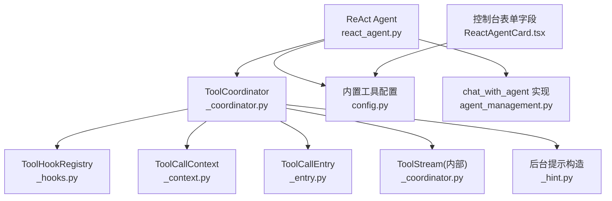
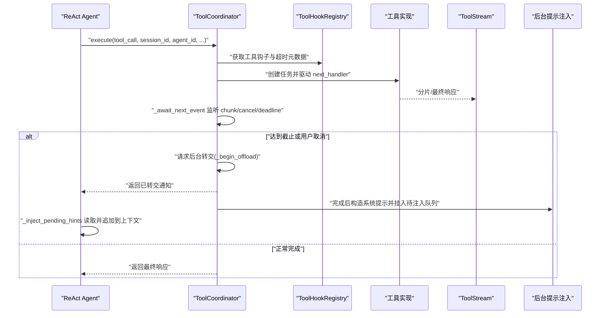
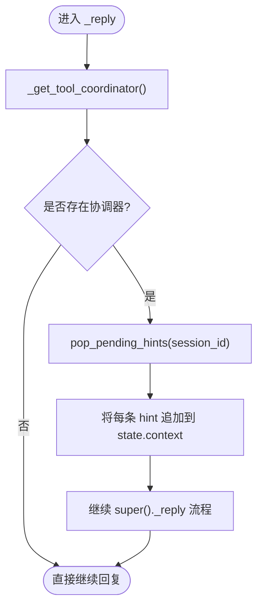
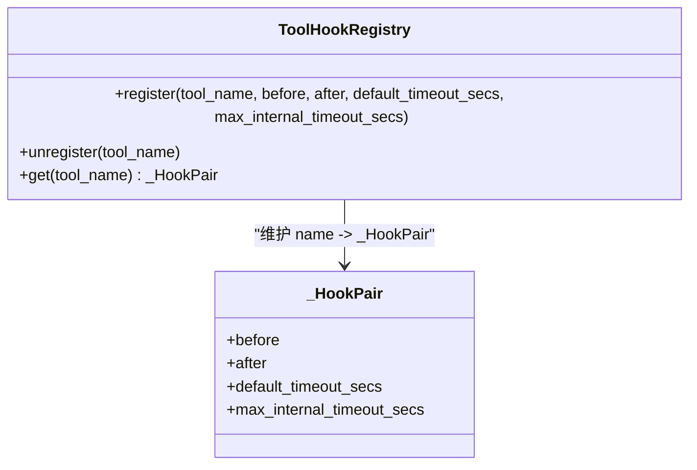
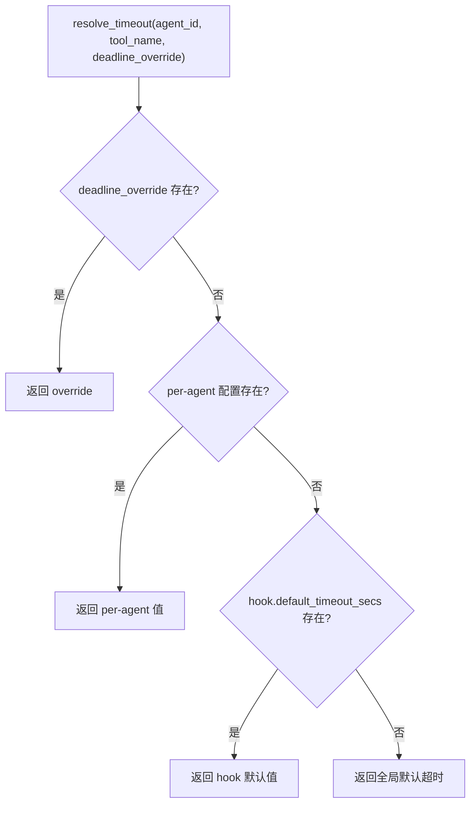
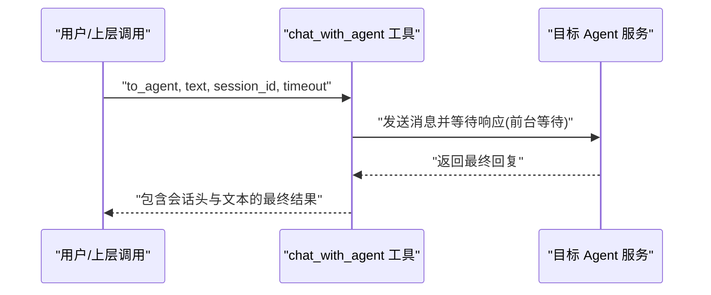
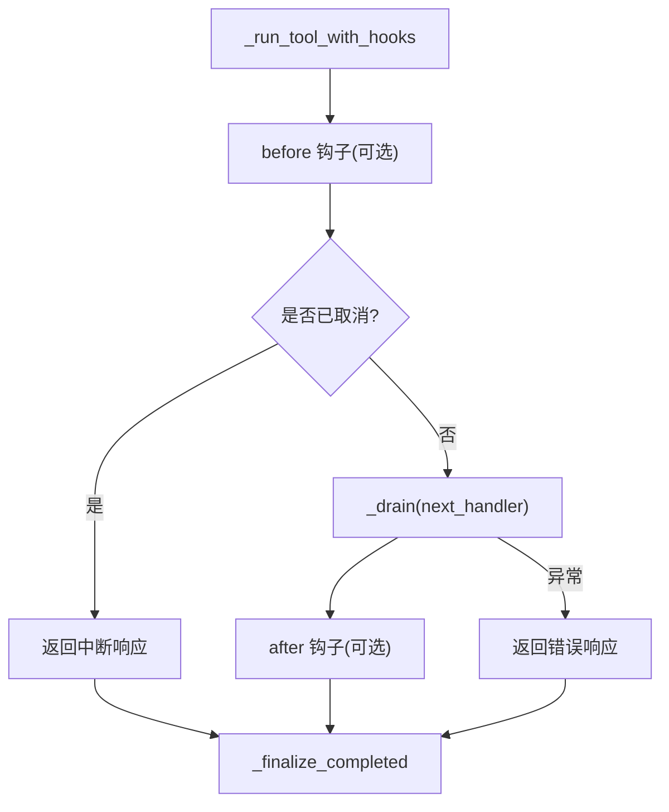
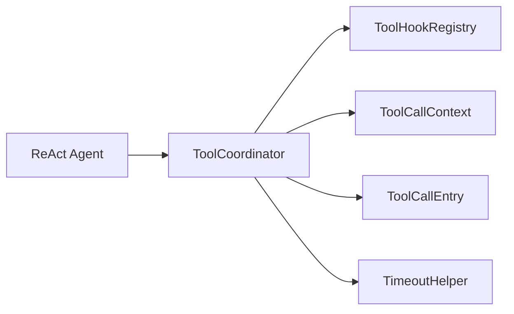

# 工具调用增强

<cite>
**本文引用的文件**
- [src/qwenpaw/agents/react_agent.py](file://src/qwenpaw/agents/react_agent.py)
- [src/qwenpaw/tool_calls/_coordinator.py](file://src/qwenpaw/tool_calls/_coordinator.py)
- [src/qwenpaw/tool_calls/_hooks.py](file://src/qwenpaw/tool_calls/_hooks.py)
- [src/qwenpaw/tool_calls/_timeout_helper.py](file://src/qwenpaw/tool_calls/_timeout_helper.py)
- [src/qwenpaw/tool_calls/_context.py](file://src/qwenpaw/tool_calls/_context.py)
- [src/qwenpaw/tool_calls/_entry.py](file://src/qwenpaw/tool_calls/_entry.py)
- [src/qwenpaw/tool_calls/_hint.py](file://src/qwenpaw/tool_calls/_hint.py)
- [src/qwenpaw/config/config.py](file://src/qwenpaw/config/config.py)
- [src/qwenpaw/agents/tools/agent_management.py](file://src/qwenpaw/agents/tools/agent_management.py)
- [console/src/pages/Agent/Config/components/ReactAgentCard.tsx](file://console/src/pages/Agent/Config/components/ReactAgentCard.tsx)
</cite>

## 目录
1. [简介](#简介)
2. [项目结构](#项目结构)
3. [核心组件](#核心组件)
4. [架构总览](#架构总览)
5. [详细组件分析](#详细组件分析)
6. [依赖关系分析](#依赖关系分析)
7. [性能与超时特性](#性能与超时特性)
8. [故障排查指南](#故障排查指南)
9. [结论](#结论)
10. [附录：配置与示例路径](#附录配置与示例路径)

## 简介
本文件聚焦 QwenPaw Agent 的“工具调用增强”能力，系统性说明以下方面：
- 工具协调器（ToolCoordinator）的集成方式与后台提示注入机制
- 工具超时管理策略：默认超时、自定义超时、Agent 级别工具超时控制
- 工具钩子系统的使用方法，包括内置工具的默认超时与最大内部超时
- 结合具体代码路径展示增强功能、超时控制与错误处理流程

## 项目结构
围绕工具调用增强的关键模块分布如下：
- 协调层：ToolCoordinator 负责所有进行中的工具调用生命周期、流式输出、取消/延期、后台转交与完成回调
- 钩子与元数据：ToolHookRegistry 维护每个工具的 before/after 钩子与超时元数据
- 上下文与状态：ToolCallContext/ToolCallEntry 提供单次调用的运行时句柄与状态
- 超时辅助：cancellable_wait/effective_timeout 为内置工具提供协作式超时
- Agent 集成：ReAct Agent 在回复前注入后台提示，并注册各工具的默认超时
- 配置与前端：全局与 Agent 级工具配置项，以及控制台 UI 对 shell 命令超时的可视化配置

**图表来源**
- [src/qwenpaw/agents/react_agent.py:627-705](file://src/qwenpaw/agents/react_agent.py#L627-L705)
- [src/qwenpaw/tool_calls/_coordinator.py:38-131](file://src/qwenpaw/tool_calls/_coordinator.py#L38-L131)
- [src/qwenpaw/tool_calls/_hooks.py:35-76](file://src/qwenpaw/tool_calls/_hooks.py#L35-L76)
- [src/qwenpaw/tool_calls/_context.py:23-56](file://src/qwenpaw/tool_calls/_context.py#L23-L56)
- [src/qwenpaw/tool_calls/_entry.py:21-32](file://src/qwenpaw/tool_calls/_entry.py#L21-L32)
- [src/qwenpaw/tool_calls/_hint.py:11-37](file://src/qwenpaw/tool_calls/_hint.py#L11-L37)
- [src/qwenpaw/config/config.py:1819-1849](file://src/qwenpaw/config/config.py#L1819-L1849)
- [src/qwenpaw/agents/tools/agent_management.py:462-497](file://src/qwenpaw/agents/tools/agent_management.py#L462-L497)
- [console/src/pages/Agent/Config/components/ReactAgentCard.tsx:84-130](file://console/src/pages/Agent/Config/components/ReactAgentCard.tsx#L84-L130)

**章节来源**
- [src/qwenpaw/agents/react_agent.py:627-705](file://src/qwenpaw/agents/react_agent.py#L627-L705)
- [src/qwenpaw/tool_calls/_coordinator.py:38-131](file://src/qwenpaw/tool_calls/_coordinator.py#L38-L131)
- [src/qwenpaw/tool_calls/_hooks.py:35-76](file://src/qwenpaw/tool_calls/_hooks.py#L35-L76)
- [src/qwenpaw/tool_calls/_context.py:23-56](file://src/qwenpaw/tool_calls/_context.py#L23-L56)
- [src/qwenpaw/tool_calls/_entry.py:21-32](file://src/qwenpaw/tool_calls/_entry.py#L21-L32)
- [src/qwenpaw/tool_calls/_hint.py:11-37](file://src/qwenpaw/tool_calls/_hint.py#L11-L37)
- [src/qwenpaw/config/config.py:1819-1849](file://src/qwenpaw/config/config.py#L1819-L1849)
- [src/qwenpaw/agents/tools/agent_management.py:462-497](file://src/qwenpaw/agents/tools/agent_management.py#L462-L497)
- [console/src/pages/Agent/Config/components/ReactAgentCard.tsx:84-130](file://console/src/pages/Agent/Config/components/ReactAgentCard.tsx#L84-L130)

## 核心组件
- ToolCoordinator：统一拥有所有进行中的工具调用，负责执行、流式事件分发、取消/延期、后台转交、完成回调与提示注入。
- ToolHookRegistry：按工具名注册 before/after 钩子与超时元数据（默认超时、最大内部超时）。
- ToolCallContext/ToolCallEntry：单次工具调用的上下文与运行态封装，包含截止时间、取消事件、结束状态等。
- 超时辅助：cancellable_wait 与 effective_timeout 为内置工具提供协作式超时与剩余时间计算。
- ReAct Agent 集成：在 _reply 前注入后台提示；在启动时注册各内置工具的默认超时与 Agent 级覆盖。

**章节来源**
- [src/qwenpaw/tool_calls/_coordinator.py:38-131](file://src/qwenpaw/tool_calls/_coordinator.py#L38-L131)
- [src/qwenpaw/tool_calls/_hooks.py:35-76](file://src/qwenpaw/tool_calls/_hooks.py#L35-L76)
- [src/qwenpaw/tool_calls/_context.py:23-56](file://src/qwenpaw/tool_calls/_context.py#L23-L56)
- [src/qwenpaw/tool_calls/_entry.py:21-32](file://src/qwenpaw/tool_calls/_entry.py#L21-L32)
- [src/qwenpaw/tool_calls/_timeout_helper.py:14-88](file://src/qwenpaw/tool_calls/_timeout_helper.py#L14-L88)
- [src/qwenpaw/agents/react_agent.py:627-705](file://src/qwenpaw/agents/react_agent.py#L627-L705)

## 架构总览
下图展示了从 Agent 发起工具调用到协调器执行、钩子介入、超时监控、后台转交与结果回注的完整链路。

**图表来源**
- [src/qwenpaw/agents/react_agent.py:635-651](file://src/qwenpaw/agents/react_agent.py#L635-L651)
- [src/qwenpaw/tool_calls/_coordinator.py:71-131](file://src/qwenpaw/tool_calls/_coordinator.py#L71-L131)
- [src/qwenpaw/tool_calls/_coordinator.py:174-222](file://src/qwenpaw/tool_calls/_coordinator.py#L174-L222)
- [src/qwenpaw/tool_calls/_coordinator.py:587-648](file://src/qwenpaw/tool_calls/_coordinator.py#L587-L648)
- [src/qwenpaw/tool_calls/_hint.py:11-37](file://src/qwenpaw/tool_calls/_hint.py#L11-L37)

## 详细组件分析

### 工具协调器集成与后台提示注入
- 集成入口：ReAct Agent 通过 _get_tool_coordinator() 从请求上下文获取 ToolCoordinator 实例，并在 _register_tool_call_hooks() 中注册各内置工具的默认超时与最大内部超时。
- 后台提示注入：在每次回复前，_reply 会调用 _inject_pending_hints()，从协调器的 pending_hints 队列弹出当前会话的提示消息并追加到 Agent 上下文，使模型感知后台工具已完成及其结果。

**图表来源**
- [src/qwenpaw/agents/react_agent.py:631-651](file://src/qwenpaw/agents/react_agent.py#L631-L651)
- [src/qwenpaw/tool_calls/_coordinator.py:345-351](file://src/qwenpaw/tool_calls/_coordinator.py#L345-L351)

**章节来源**
- [src/qwenpaw/agents/react_agent.py:631-651](file://src/qwenpaw/agents/react_agent.py#L631-L651)
- [src/qwenpaw/tool_calls/_coordinator.py:345-351](file://src/qwenpaw/tool_calls/_coordinator.py#L345-L351)

### 工具钩子系统与默认超时
- 钩子注册：ReAct Agent 在启动阶段为多个内置工具注册默认超时与最大内部超时，例如 execute_shell_command、chat_with_agent、grep_search、glob_search、ast_search、desktop_screenshot、LSP 系列、browser_use 等。
- 钩子元数据：ToolHookRegistry 支持 per-tool 的 default_timeout_secs 与 max_internal_timeout_secs，后者用于限制某些工具不可移除的内部硬上限（如浏览器协议层）。

**图表来源**
- [src/qwenpaw/tool_calls/_hooks.py:35-76](file://src/qwenpaw/tool_calls/_hooks.py#L35-L76)
- [src/qwenpaw/agents/react_agent.py:653-683](file://src/qwenpaw/agents/react_agent.py#L653-L683)

**章节来源**
- [src/qwenpaw/tool_calls/_hooks.py:35-76](file://src/qwenpaw/tool_calls/_hooks.py#L35-L76)
- [src/qwenpaw/agents/react_agent.py:653-683](file://src/qwenpaw/agents/react_agent.py#L653-L683)

### 工具超时管理与优先级
- 四级优先级解析：调用级 deadline_override > Agent 级 per-agent tool timeout > 钩子默认超时 > 全局默认超时。
- Agent 级覆盖：ReAct Agent 在 _register_tool_call_hooks() 中清空该 Agent 的工具超时缓存，再根据 Agent 配置的 builtin_tools.timeout_seconds 设置每工具超时。
- 最大内部超时保护：当 set_agent_tool_timeout 设置的值超过工具的最大内部超时时，将被拒绝。

**图表来源**
- [src/qwenpaw/tool_calls/_coordinator.py:688-706](file://src/qwenpaw/tool_calls/_coordinator.py#L688-L706)
- [src/qwenpaw/tool_calls/_coordinator.py:241-264](file://src/qwenpaw/tool_calls/_coordinator.py#L241-L264)
- [src/qwenpaw/agents/react_agent.py:685-705](file://src/qwenpaw/agents/react_agent.py#L685-L705)

**章节来源**
- [src/qwenpaw/tool_calls/_coordinator.py:688-706](file://src/qwenpaw/tool_calls/_coordinator.py#L688-L706)
- [src/qwenpaw/tool_calls/_coordinator.py:241-264](file://src/qwenpaw/tool_calls/_coordinator.py#L241-L264)
- [src/qwenpaw/agents/react_agent.py:685-705](file://src/qwenpaw/agents/react_agent.py#L685-L705)

### 内置工具超时配置与使用
- 内置工具清单与描述：config.py 定义了 chat_with_agent、submit_to_agent、check_agent_task、spawn_subagent 等内置工具的基本信息。
- chat_with_agent 参数：agent_management.py 中 chat_with_agent 工具接受 to_agent、text、session_id、timeout 等参数，其中 timeout 为前台等待超时秒数。
- Shell 命令超时：控制台 ReactAgentCard.tsx 暴露 shell_command_timeout 字段，用于配置 execute_shell_command 的默认超时。

**图表来源**
- [src/qwenpaw/config/config.py:1819-1849](file://src/qwenpaw/config/config.py#L1819-L1849)
- [src/qwenpaw/agents/tools/agent_management.py:462-497](file://src/qwenpaw/agents/tools/agent_management.py#L462-L497)
- [console/src/pages/Agent/Config/components/ReactAgentCard.tsx:84-130](file://console/src/pages/Agent/Config/components/ReactAgentCard.tsx#L84-L130)

**章节来源**
- [src/qwenpaw/config/config.py:1819-1849](file://src/qwenpaw/config/config.py#L1819-L1849)
- [src/qwenpaw/agents/tools/agent_management.py:462-497](file://src/qwenpaw/agents/tools/agent_management.py#L462-L497)
- [console/src/pages/Agent/Config/components/ReactAgentCard.tsx:84-130](file://console/src/pages/Agent/Config/components/ReactAgentCard.tsx#L84-L130)

### 错误处理与中断语义
- 工具执行异常：协调器在 _drain 中捕获异常与中断，生成对应状态的最终响应并关闭流。
- 取消与强制取消：支持 cooperative cancel 与 force cancel；shutdown 时会向所有条目发出取消信号并按 grace period 等待。
- 后台转交失败：on_offloaded 处理器异常会被记录但不影响主流程。

**图表来源**
- [src/qwenpaw/tool_calls/_coordinator.py:517-586](file://src/qwenpaw/tool_calls/_coordinator.py#L517-L586)
- [src/qwenpaw/tool_calls/_coordinator.py:464-516](file://src/qwenpaw/tool_calls/_coordinator.py#L464-L516)
- [src/qwenpaw/tool_calls/_coordinator.py:668-686](file://src/qwenpaw/tool_calls/_coordinator.py#L668-L686)

**章节来源**
- [src/qwenpaw/tool_calls/_coordinator.py:517-586](file://src/qwenpaw/tool_calls/_coordinator.py#L517-L586)
- [src/qwenpaw/tool_calls/_coordinator.py:464-516](file://src/qwenpaw/tool_calls/_coordinator.py#L464-L516)
- [src/qwenpaw/tool_calls/_coordinator.py:668-686](file://src/qwenpaw/tool_calls/_coordinator.py#L668-L686)

## 依赖关系分析
- ReAct Agent 依赖 ToolCoordinator 提供的执行、超时、取消与后台转交能力。
- ToolCoordinator 依赖 ToolHookRegistry 获取 per-tool 钩子与超时元数据。
- ToolCallContext/ToolCallEntry 作为运行时句柄贯穿整个工具调用生命周期。
- 超时辅助模块为内置工具提供协作式取消与剩余时间计算。

**图表来源**
- [src/qwenpaw/agents/react_agent.py:627-705](file://src/qwenpaw/agents/react_agent.py#L627-L705)
- [src/qwenpaw/tool_calls/_coordinator.py:38-131](file://src/qwenpaw/tool_calls/_coordinator.py#L38-L131)
- [src/qwenpaw/tool_calls/_hooks.py:35-76](file://src/qwenpaw/tool_calls/_hooks.py#L35-L76)
- [src/qwenpaw/tool_calls/_context.py:23-56](file://src/qwenpaw/tool_calls/_context.py#L23-L56)
- [src/qwenpaw/tool_calls/_entry.py:21-32](file://src/qwenpaw/tool_calls/_entry.py#L21-L32)
- [src/qwenpaw/tool_calls/_timeout_helper.py:14-88](file://src/qwenpaw/tool_calls/_timeout_helper.py#L14-L88)

**章节来源**
- [src/qwenpaw/agents/react_agent.py:627-705](file://src/qwenpaw/agents/react_agent.py#L627-L705)
- [src/qwenpaw/tool_calls/_coordinator.py:38-131](file://src/qwenpaw/tool_calls/_coordinator.py#L38-L131)
- [src/qwenpaw/tool_calls/_hooks.py:35-76](file://src/qwenpaw/tool_calls/_hooks.py#L35-L76)
- [src/qwenpaw/tool_calls/_context.py:23-56](file://src/qwenpaw/tool_calls/_context.py#L23-L56)
- [src/qwenpaw/tool_calls/_entry.py:21-32](file://src/qwenpaw/tool_calls/_entry.py#L21-L32)
- [src/qwenpaw/tool_calls/_timeout_helper.py:14-88](file://src/qwenpaw/tool_calls/_timeout_helper.py#L14-L88)

## 性能与超时特性
- 流式事件与并发：协调器使用单线程 asyncio 模型，通过事件循环与队列高效分发 chunk 与终止事件。
- 超时监控：_await_next_event 同时监听 chunk、cancel、deadline_changed 与 deadline_reached，确保及时响应外部干预。
- 后台转交：到达截止后转为后台任务，避免阻塞主对话流；完成后通过提示注入让模型感知结果。
- 最大内部超时：对具有不可移除硬上限的工具（如浏览器协议层）设置 max_internal_timeout_secs，防止越界延长。

[本节为通用性能讨论，不直接分析具体文件]

## 故障排查指南
- 工具未生效或无超时：检查 ReAct Agent 是否正确获取 tool_coordinator 并完成 hooks.register；确认 Agent 配置中 builtin_tools.timeout_seconds 是否大于 0。
- 后台提示未出现：确认 ToolCoordinator 的 pop_pending_hints 被调用且 session_id 正确；检查后台任务完成后的提示构造与注入逻辑。
- 取消无效或延迟：检查是否在工具实现中使用 cancellable_wait 或协作式取消点；必要时使用 extend_deadline 或 request_offload 进行干预。
- 超时被拒绝：若设置的 per-agent 超时超过工具 max_internal_timeout_secs，将被拒绝；需调整至允许范围内。

**章节来源**
- [src/qwenpaw/agents/react_agent.py:631-651](file://src/qwenpaw/agents/react_agent.py#L631-L651)
- [src/qwenpaw/tool_calls/_coordinator.py:241-264](file://src/qwenpaw/tool_calls/_coordinator.py#L241-L264)
- [src/qwenpaw/tool_calls/_timeout_helper.py:14-88](file://src/qwenpaw/tool_calls/_timeout_helper.py#L14-L88)
- [src/qwenpaw/tool_calls/_coordinator.py:345-351](file://src/qwenpaw/tool_calls/_coordinator.py#L345-L351)

## 结论
QwenPaw 的工具调用增强以 ToolCoordinator 为核心，结合钩子系统与多级超时策略，实现了可观测、可干预、可后台化的工具执行体验。ReAct Agent 在回复前注入后台提示，保证模型能基于最新结果继续推理。通过 Agent 级与工具级的精细配置，可在稳定性与灵活性之间取得良好平衡。

[本节为总结性内容，不直接分析具体文件]

## 附录：配置与示例路径
- 内置工具定义与描述：[src/qwenpaw/config/config.py:1819-1849](file://src/qwenpaw/config/config.py#L1819-L1849)
- chat_with_agent 工具参数与返回值说明：[src/qwenpaw/agents/tools/agent_management.py:462-497](file://src/qwenpaw/agents/tools/agent_management.py#L462-L497)
- 控制台 shell 命令超时配置项：[console/src/pages/Agent/Config/components/ReactAgentCard.tsx:84-130](file://console/src/pages/Agent/Config/components/ReactAgentCard.tsx#L84-L130)
- ReAct Agent 集成与默认超时注册：[src/qwenpaw/agents/react_agent.py:627-705](file://src/qwenpaw/agents/react_agent.py#L627-L705)
- 协调器执行与后台转交流程：[src/qwenpaw/tool_calls/_coordinator.py:71-131](file://src/qwenpaw/tool_calls/_coordinator.py#L71-L131)
- 超时辅助函数（协作式取消与剩余时间）：[src/qwenpaw/tool_calls/_timeout_helper.py:14-88](file://src/qwenpaw/tool_calls/_timeout_helper.py#L14-L88)
- 钩子注册与元数据：[src/qwenpaw/tool_calls/_hooks.py:35-76](file://src/qwenpaw/tool_calls/_hooks.py#L35-L76)
- 后台提示构造与注入：[src/qwenpaw/tool_calls/_hint.py:11-37](file://src/qwenpaw/tool_calls/_hint.py#L11-L37), [src/qwenpaw/agents/react_agent.py:635-651](file://src/qwenpaw/agents/react_agent.py#L635-L651)