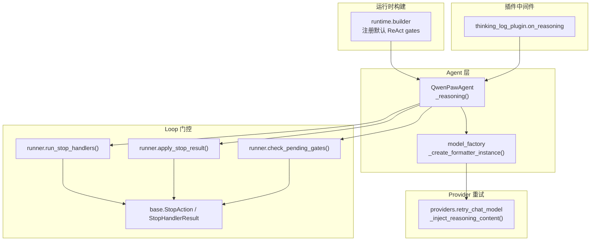
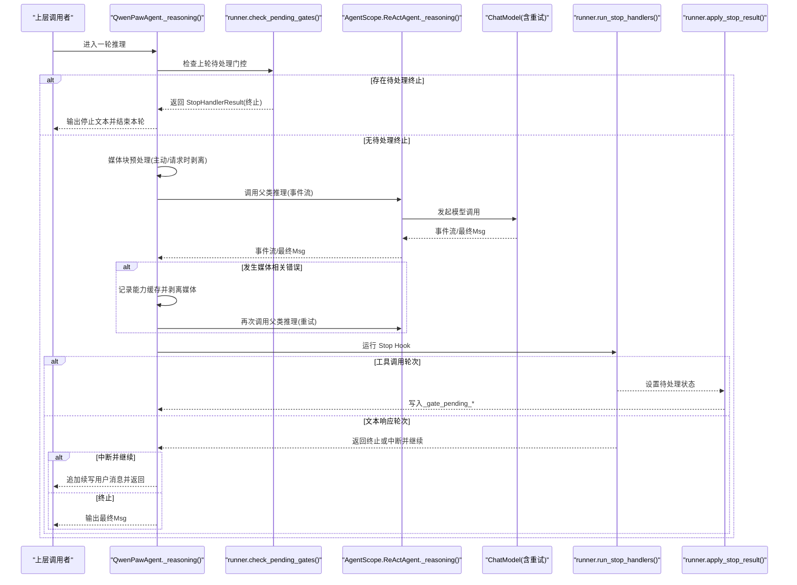
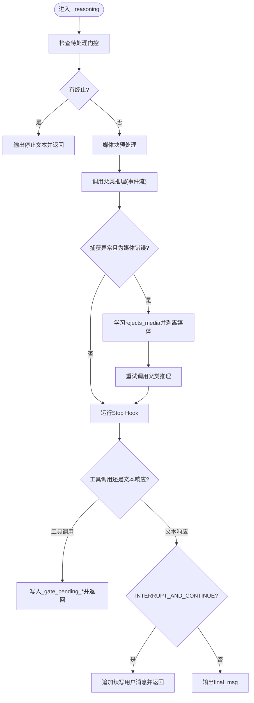
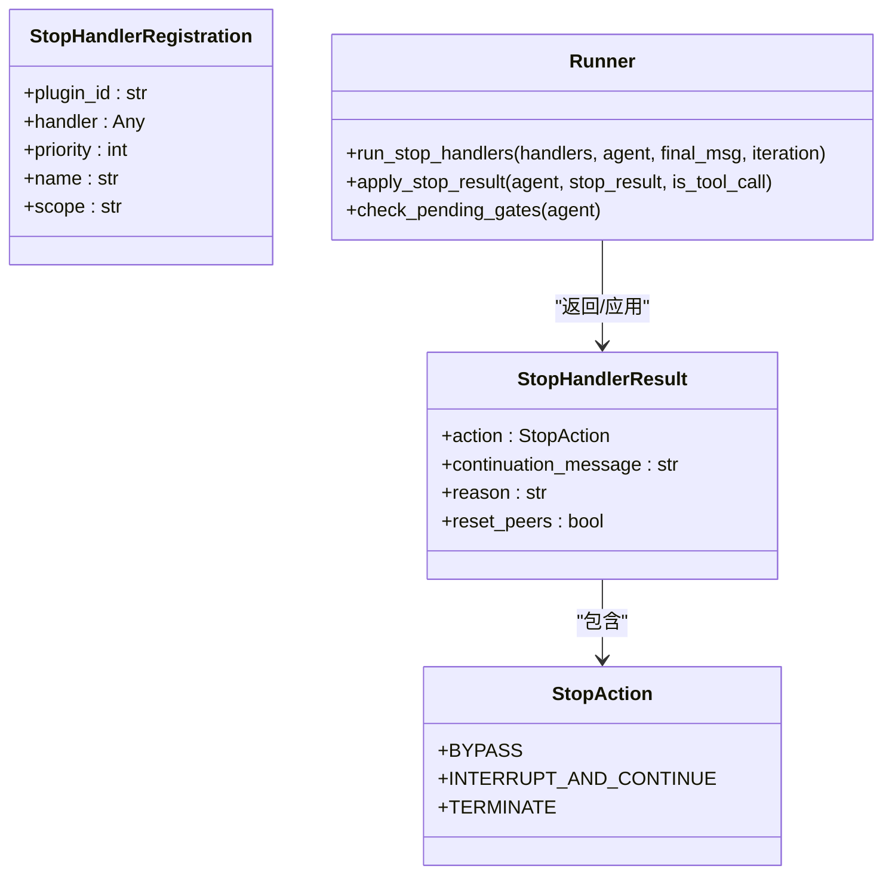
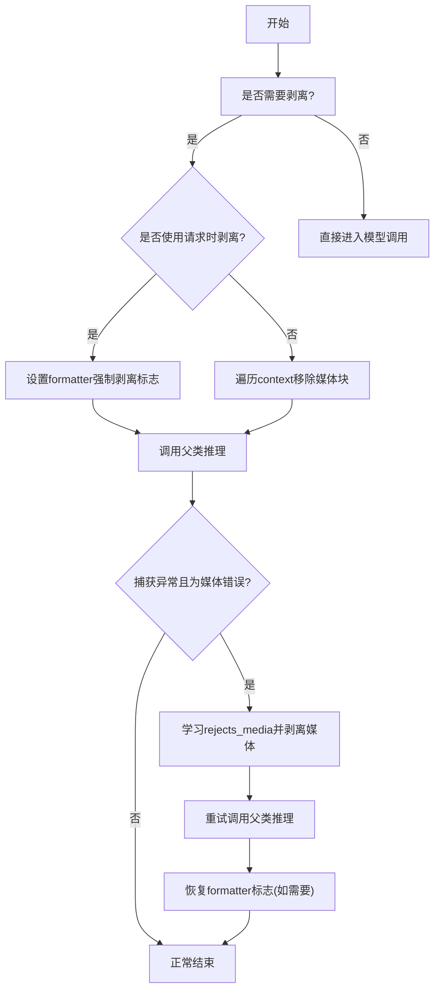
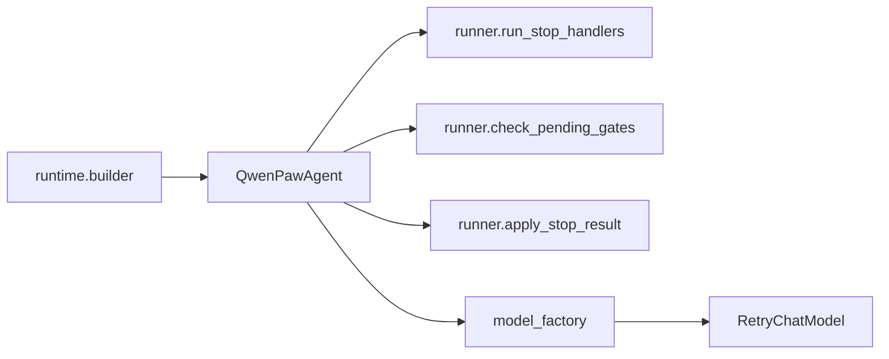

# 推理循环实现

<cite>
**本文引用的文件**   
- [react_agent.py](file://src/qwenpaw/agents/react_agent.py)
- [runner.py](file://src/qwenpaw/loop/gates/runner.py)
- [base.py](file://src/qwenpaw/loop/gates/base.py)
- [builder.py](file://src/qwenpaw/runtime/builder.py)
- [model_factory.py](file://src/qwenpaw/agents/model_factory.py)
- [retry_chat_model.py](file://src/qwenpaw/providers/retry_chat_model.py)
- [thinking_log_plugin.py](file://plugins/middleware-demo/thinking-log-middleware/thinking_log_plugin.py)
</cite>

## 目录
1. [简介](#简介)
2. [项目结构](#项目结构)
3. [核心组件](#核心组件)
4. [架构总览](#架构总览)
5. [详细组件分析](#详细组件分析)
6. [依赖关系分析](#依赖关系分析)
7. [性能考量](#性能考量)
8. [故障排查指南](#故障排查指南)
9. [结论](#结论)
10. [附录](#附录)

## 简介
本文件聚焦 QwenPaw Agent 的推理循环实现，围绕 _reasoning() 方法展开，系统阐述基于 AgentScope 2.0 ReAct 模式的推理流程、事件流处理与消息生成机制。文档覆盖以下关键主题：
- 待处理门控检查（Stop Hook 集成）
- 媒体块预处理与被动重试
- 模型调用执行与错误处理
- Stop Hook 的中断与继续控制逻辑
- 具体代码示例路径，用于定位事件处理、异常捕获与状态更新过程

## 项目结构
QwenPaw 的推理循环位于 Agent 层，结合运行时构建器注入中间件与门控，并通过插件注册 Stop Handler。下图展示与推理循环直接相关的模块关系。

图表来源
- [react_agent.py:411-551](file://src/qwenpaw/agents/react_agent.py#L411-L551)
- [runner.py:62-132](file://src/qwenpaw/loop/gates/runner.py#L62-L132)
- [runner.py:135-209](file://src/qwenpaw/loop/gates/runner.py#L135-L209)
- [base.py:15-41](file://src/qwenpaw/loop/gates/base.py#L15-L41)
- [builder.py:287-319](file://src/qwenpaw/runtime/builder.py#L287-L319)
- [model_factory.py:1271-1282](file://src/qwenpaw/agents/model_factory.py#L1271-L1282)
- [retry_chat_model.py:224-253](file://src/qwenpaw/providers/retry_chat_model.py#L224-L253)
- [thinking_log_plugin.py:26-47](file://plugins/middleware-demo/thinking-log-middleware/thinking_log_plugin.py#L26-L47)

章节来源
- [react_agent.py:411-551](file://src/qwenpaw/agents/react_agent.py#L411-L551)
- [runner.py:62-132](file://src/qwenpaw/loop/gates/runner.py#L62-L132)
- [runner.py:135-209](file://src/qwenpaw/loop/gates/runner.py#L135-L209)
- [base.py:15-41](file://src/qwenpaw/loop/gates/base.py#L15-L41)
- [builder.py:287-319](file://src/qwenpaw/runtime/builder.py#L287-L319)
- [model_factory.py:1271-1282](file://src/qwenpaw/agents/model_factory.py#L1271-L1282)
- [retry_chat_model.py:224-253](file://src/qwenpaw/providers/retry_chat_model.py#L224-L253)
- [thinking_log_plugin.py:26-47](file://plugins/middleware-demo/thinking-log-middleware/thinking_log_plugin.py#L26-L47)

## 核心组件
- QwenPawAgent._reasoning(): 重写 AgentScope 2.0 的推理入口，负责：
  - 待处理门控检查（上轮 Stop Hook 结果）
  - 媒体块预处理（主动剥离或请求时剥离）
  - 调用父类 _reasoning() 并转发事件流
  - 媒体相关错误的被动重试
  - 每轮运行 Stop Hook，决定终止或继续
- Loop Gates Runner: 提供 run_stop_handlers、apply_stop_result、check_pending_gates 等函数，解耦 Stop Hook 的执行与状态应用
- Stop Action / Result: 定义终止、中断并继续、绕过三种决策类型及携带信息
- Runtime Builder: 在 Agent 构建阶段注册默认 ReAct gates（Stop Handler），并加载会话状态
- Provider Retry Chat Model: 针对 thinking 模式缺失 reasoning_content 的错误进行自动修复与重试
- Middleware Demo: 演示 on_reasoning 钩子如何消费推理事件流

章节来源
- [react_agent.py:411-551](file://src/qwenpaw/agents/react_agent.py#L411-L551)
- [runner.py:62-132](file://src/qwenpaw/loop/gates/runner.py#L62-L132)
- [base.py:15-41](file://src/qwenpaw/loop/gates/base.py#L15-L41)
- [builder.py:287-319](file://src/qwenpaw/runtime/builder.py#L287-L319)
- [retry_chat_model.py:224-253](file://src/qwenpaw/providers/retry_chat_model.py#L224-L253)
- [thinking_log_plugin.py:26-47](file://plugins/middleware-demo/thinking-log-middleware/thinking_log_plugin.py#L26-L47)

## 架构总览
下图展示了 _reasoning() 的一次迭代中，从门控检查到模型调用、再到 Stop Hook 决策的完整时序。

图表来源
- [react_agent.py:411-551](file://src/qwenpaw/agents/react_agent.py#L411-L551)
- [runner.py:165-209](file://src/qwenpaw/loop/gates/runner.py#L165-L209)
- [runner.py:135-162](file://src/qwenpaw/loop/gates/runner.py#L135-L162)
- [runner.py:62-132](file://src/qwenpaw/loop/gates/runner.py#L62-L132)

## 详细组件分析

### QwenPawAgent._reasoning() 核心逻辑
- 待处理门控检查
  - 通过 check_pending_gates 读取上轮设置的 _gate_pending_stop/_gate_pending_continue
  - 若为终止，则构造一段停止文本事件与 Msg 并立即返回
  - 若为继续，则将 continuation_message 作为带标签的用户消息注入上下文
- 媒体块预处理
  - 根据当前模型是否支持多模态或能力缓存中的 rejects_media 标记决定是否剥离
  - 若使用请求时格式化器，则切换 formatter 的强制剥离开关；否则直接遍历 state.context 移除媒体块
- 模型调用与事件转发
  - 调用 super()._reasoning(tool_choice)，逐条转发非 Msg 事件，收集最终 Msg
- 媒体错误被动重试
  - 捕获异常后判断是否为“媒体相关”错误（排除内容安全拒绝与尺寸/上下文长度错误）
  - 若是，则在能力缓存中学习 rejects_media，并选择请求时剥离或内存中剥离后重试一次
- Stop Hook 决策
  - 每轮都运行 stop handlers，得到 StopHandlerResult
  - 工具调用轮次：将终止或继续指令延迟到下一轮（写入 _gate_pending_*）
  - 文本响应轮次：若为 INTERRUPT_AND_CONTINUE，则追加续写用户消息并返回；否则输出 final_msg

图表来源
- [react_agent.py:411-551](file://src/qwenpaw/agents/react_agent.py#L411-L551)
- [react_agent.py:569-612](file://src/qwenpaw/agents/react_agent.py#L569-L612)
- [react_agent.py:745-808](file://src/qwenpaw/agents/react_agent.py#L745-L808)

章节来源
- [react_agent.py:411-551](file://src/qwenpaw/agents/react_agent.py#L411-L551)
- [react_agent.py:569-612](file://src/qwenpaw/agents/react_agent.py#L569-L612)
- [react_agent.py:745-808](file://src/qwenpaw/agents/react_agent.py#L745-L808)

### Stop Hook 系统与门控集成
- 注册与筛选
  - 运行时 builder 在构建 Agent 时注册默认 ReAct gates（Stop Handler）
  - runner 按 scope 过滤处理器，仅执行活跃作用域内的 handler
- 执行与结果
  - run_stop_handlers 按优先级顺序执行，支持字典或 StopHandlerResult 两种返回格式
  - apply_stop_result 在工具调用轮次将终止/继续指令延迟到下一轮
  - check_pending_gates 在下一轮开始时消费待处理状态，必要时注入续写消息
- 决策类型
  - TERMINATE：立即终止
  - INTERRUPT_AND_CONTINUE：中断当前模式，注入续写提示并保持循环
  - BYPASS：跳过

图表来源
- [base.py:15-41](file://src/qwenpaw/loop/gates/base.py#L15-L41)
- [runner.py:62-132](file://src/qwenpaw/loop/gates/runner.py#L62-L132)
- [runner.py:135-209](file://src/qwenpaw/loop/gates/runner.py#L135-L209)

章节来源
- [runner.py:62-132](file://src/qwenpaw/loop/gates/runner.py#L62-L132)
- [runner.py:135-209](file://src/qwenpaw/loop/gates/runner.py#L135-L209)
- [base.py:15-41](file://src/qwenpaw/loop/gates/base.py#L15-L41)
- [builder.py:287-319](file://src/qwenpaw/runtime/builder.py#L287-L319)

### 媒体块预处理与被动重试
- 主动剥离
  - 当当前模型不支持多模态或能力缓存已学习 rejects_media，则在调用前主动从 memory 中移除媒体块
- 请求时剥离
  - 若存在 formatter，则通过设置强制剥离标志在请求时剔除媒体块，避免修改历史
- 被动重试
  - 捕获异常后，仅对“媒体相关”错误触发重试（排除内容安全拒绝与尺寸/上下文长度错误）
  - 失败后学习 rejects_media，并在下一次调用前启用剥离策略
- 内存清理
  - 遍历 state.context，移除 image/audio/video/file 等媒体块，以及 tool_result 输出中的媒体块
  - 若某消息被清空，则插入占位文本以避免 API 请求畸形

图表来源
- [react_agent.py:448-510](file://src/qwenpaw/agents/react_agent.py#L448-L510)
- [react_agent.py:569-612](file://src/qwenpaw/agents/react_agent.py#L569-L612)
- [react_agent.py:745-808](file://src/qwenpaw/agents/react_agent.py#L745-L808)

章节来源
- [react_agent.py:448-510](file://src/qwenpaw/agents/react_agent.py#L448-L510)
- [react_agent.py:569-612](file://src/qwenpaw/agents/react_agent.py#L569-L612)
- [react_agent.py:745-808](file://src/qwenpaw/agents/react_agent.py#L745-L808)

### 模型调用执行与 Provider 重试
- 模型包装
  - model_factory 将原生模型包裹 TokenRecordingModelWrapper 与 RetryChatModel，统一处理令牌统计与重试
  - 为避免嵌套重试，关闭底层模型的 max_retries，交由 RetryChatModel 管理
- Thinking 模式修复
  - providers.retry_chat_model 在检测到缺少 reasoning_content 的 400 错误时，向 assistant 消息注入 reasoning_content=" "，然后重试
- 事件流与最终消息
  - _reasoning 迭代上游事件流，将非 Msg 事件透传，最终 Msg 由 Stop Hook 决策后输出

章节来源
- [model_factory.py:1247-1268](file://src/qwenpaw/agents/model_factory.py#L1247-L1268)
- [retry_chat_model.py:224-253](file://src/qwenpaw/providers/retry_chat_model.py#L224-L253)
- [react_agent.py:467-510](file://src/qwenpaw/agents/react_agent.py#L467-L510)

### 中间件与事件处理示例
- 插件中间件 on_reasoning
  - 示例插件监听 ThinkingBlockDeltaEvent 与 TextBlockDeltaEvent，打印思考与文本增量
  - 通过 next_handler() 获取上游事件流，透传下游
- 适用场景
  - 调试/追踪推理过程
  - 实时日志输出
  - 自定义事件聚合

章节来源
- [thinking_log_plugin.py:26-47](file://plugins/middleware-demo/thinking-log-middleware/thinking_log_plugin.py#L26-L47)

## 依赖关系分析
- QwenPawAgent 依赖：
  - loop.gates.runner：Stop Hook 执行与状态应用
  - agents.model_factory：格式化器与模型包装
  - providers.retry_chat_model：thinking 模式修复与重试
  - plugins.registry：获取 Stop Handler 注册表
- 运行时构建器在 Agent 组装阶段注入：
  - ReActConfig(max_iters)
  - middlewares（包括中间件与工具结果裁剪等）
  - 默认 ReAct gates（Stop Handler）
  - 会话状态加载

图表来源
- [react_agent.py:411-551](file://src/qwenpaw/agents/react_agent.py#L411-L551)
- [runner.py:62-132](file://src/qwenpaw/loop/gates/runner.py#L62-L132)
- [model_factory.py:1247-1268](file://src/qwenpaw/agents/model_factory.py#L1247-L1268)
- [builder.py:287-319](file://src/qwenpaw/runtime/builder.py#L287-L319)

章节来源
- [react_agent.py:411-551](file://src/qwenpaw/agents/react_agent.py#L411-L551)
- [runner.py:62-132](file://src/qwenpaw/loop/gates/runner.py#L62-L132)
- [model_factory.py:1247-1268](file://src/qwenpaw/agents/model_factory.py#L1247-L1268)
- [builder.py:287-319](file://src/qwenpaw/runtime/builder.py#L287-L319)

## 性能考量
- 媒体剥离策略
  - 优先使用请求时剥离以减少历史修改开销；仅在必要时才遍历内存
- 重试与退避
  - 通过 RetryChatModel 统一管理重试与速率限制，避免多层嵌套重试
- 上下文压缩
  - compress_context 在每次推理前清理孤立 tool_result 消息，降低后续请求失败概率
- 中间件开销
  - on_reasoning 中间件应轻量，避免阻塞事件流

[本节为通用指导，不直接分析具体文件]

## 故障排查指南
- 常见错误分类
  - 内容安全拒绝：不应触发媒体剥离与能力缓存学习
  - 尺寸/上下文长度错误：不应误判为媒体不支持
  - 媒体相关错误：触发剥离与重试
- 定位步骤
  - 查看 _is_bad_request_or_media_error 的判断逻辑，确认错误是否命中媒体关键词
  - 检查能力缓存是否被污染（rejects_media 标记）
  - 确认 formatter 的强制剥离标志是否正确复位
- 参考路径
  - 错误判定与媒体剥离：[react_agent.py:569-612](file://src/qwenpaw/agents/react_agent.py#L569-L612)、[react_agent.py:745-808](file://src/qwenpaw/agents/react_agent.py#L745-L808)
  - 重试与 thinking 修复：[retry_chat_model.py:224-253](file://src/qwenpaw/providers/retry_chat_model.py#L224-L253)

章节来源
- [react_agent.py:569-612](file://src/qwenpaw/agents/react_agent.py#L569-L612)
- [react_agent.py:745-808](file://src/qwenpaw/agents/react_agent.py#L745-L808)
- [retry_chat_model.py:224-253](file://src/qwenpaw/providers/retry_chat_model.py#L224-L253)

## 结论
QwenPaw 的推理循环以 AgentScope 2.0 ReAct 为基础，通过 _reasoning() 实现了稳健的事件流处理、媒体兼容性与 Stop Hook 驱动的灵活控制。其设计强调：
- 可插拔的 Stop Hook 体系，支持终止与继续
- 智能的媒体兼容性处理，兼顾用户体验与稳定性
- Provider 层的重试与修复，提升鲁棒性
- 中间件机制便于观测与扩展

[本节为总结，不直接分析具体文件]

## 附录
- 代码示例路径（用于快速定位）
  - 推理主循环与 Stop Hook 决策：[react_agent.py:411-551](file://src/qwenpaw/agents/react_agent.py#L411-L551)
  - 媒体错误判定与内存剥离：[react_agent.py:569-612](file://src/qwenpaw/agents/react_agent.py#L569-L612)、[react_agent.py:745-808](file://src/qwenpaw/agents/react_agent.py#L745-L808)
  - Stop Hook 执行与状态应用：[runner.py:62-132](file://src/qwenpaw/loop/gates/runner.py#L62-L132)、[runner.py:135-209](file://src/qwenpaw/loop/gates/runner.py#L135-L209)
  - 运行时构建与默认 gates 注册：[builder.py:287-319](file://src/qwenpaw/runtime/builder.py#L287-L319)
  - 模型包装与重试：[model_factory.py:1247-1268](file://src/qwenpaw/agents/model_factory.py#L1247-L1268)
  - Thinking 模式修复：[retry_chat_model.py:224-253](file://src/qwenpaw/providers/retry_chat_model.py#L224-L253)
  - 中间件事件处理示例：[thinking_log_plugin.py:26-47](file://plugins/middleware-demo/thinking-log-middleware/thinking_log_plugin.py#L26-L47)