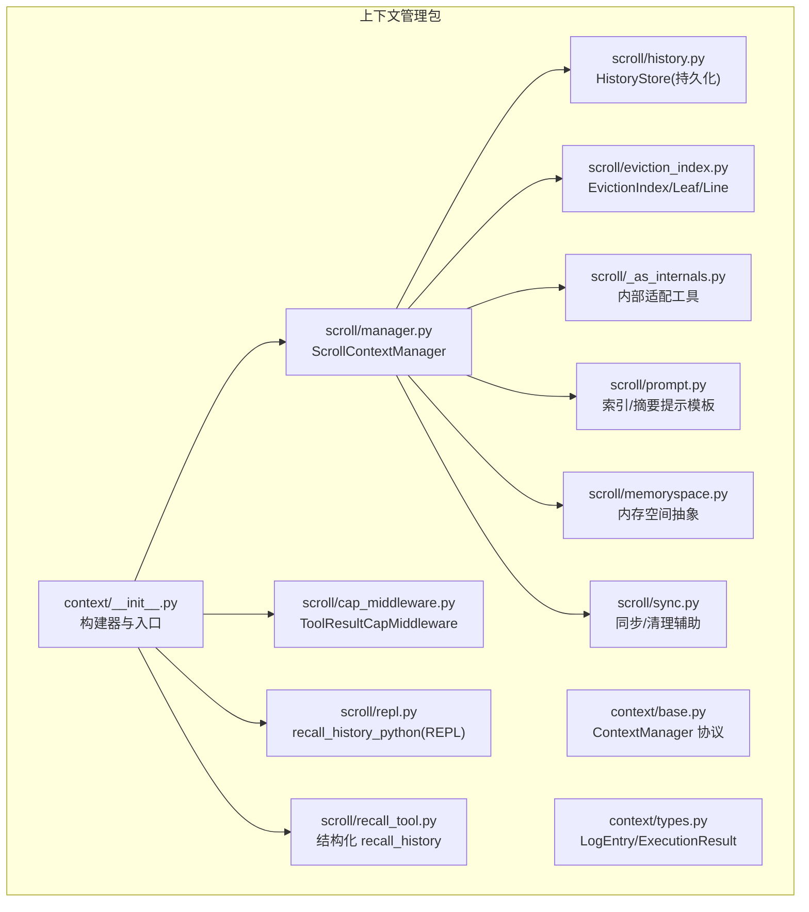
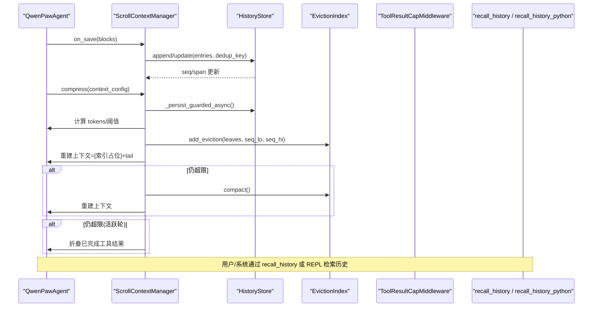
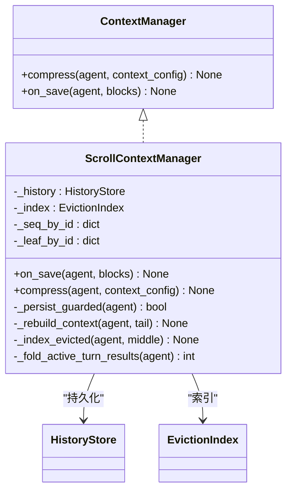
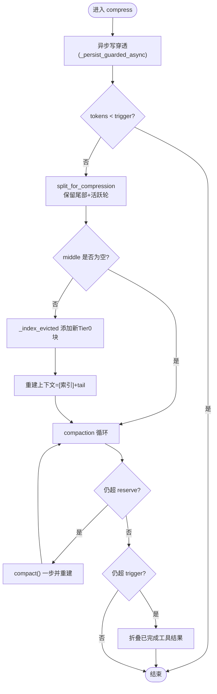
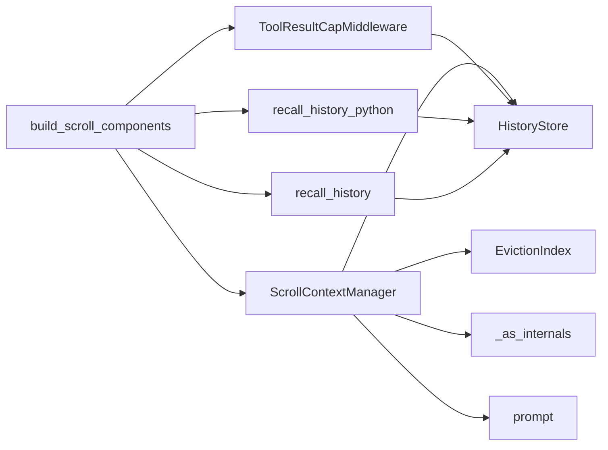

# 上下文管理机制

<cite>
**本文引用的文件**
- [src/qwenpaw/agents/context/__init__.py](file://src/qwenpaw/agents/context/__init__.py)
- [src/qwenpaw/agents/context/base.py](file://src/qwenpaw/agents/context/base.py)
- [src/qwenpaw/agents/context/types.py](file://src/qwenpaw/agents/context/types.py)
- [src/qwenpaw/agents/context/scroll/manager.py](file://src/qwenpaw/agents/context/scroll/manager.py)
- [src/qwenpaw/agents/context/scroll/history.py](file://src/qwenpaw/agents/context/scroll/history.py)
- [src/qwenpaw/agents/context/scroll/eviction_index.py](file://src/qwenpaw/agents/context/scroll/eviction_index.py)
- [src/qwenpaw/agents/context/scroll/cap_middleware.py](file://src/qwenpaw/agents/context/scroll/cap_middleware.py)
- [src/qwenpaw/agents/context/scroll/repl.py](file://src/qwenpaw/agents/context/scroll/repl.py)
- [src/qwenpaw/agents/context/scroll/recall_tool.py](file://src/qwenpaw/agents/context/scroll/recall_tool.py)
- [src/qwenpaw/agents/context/scroll/prompt.py](file://src/qwenpaw/agents/context/scroll/prompt.py)
- [src/qwenpaw/agents/context/scroll/memoryspace.py](file://src/qwenpaw/agents/context/scroll/memoryspace.py)
- [src/qwenpaw/agents/context/scroll/sync.py](file://src/qwenpaw/agents/context/scroll/sync.py)
- [src/qwenpaw/agents/context/scroll/_as_internals.py](file://src/qwenpaw/agents/context/scroll/_as_internals.py)
</cite>

## 目录
1. [简介](#简介)
2. [项目结构](#项目结构)
3. [核心组件](#核心组件)
4. [架构总览](#架构总览)
5. [详细组件分析](#详细组件分析)
6. [依赖关系分析](#依赖关系分析)
7. [性能与内存优化](#性能与内存优化)
8. [故障排查指南](#故障排查指南)
9. [结论](#结论)
10. [附录：API 与使用示例](#附录api-与使用示例)

## 简介
本技术文档聚焦 QwenPaw 的“上下文管理机制”，围绕滚动窗口（scroll）策略展开，解释其概念、作用、存储结构、序列化格式、版本兼容、大小限制与压缩策略、滚动窗口实现原理（保留与过期清理）、以及对外 API 和扩展点。该机制将对话历史、工具调用结果、系统提示和用户输入整合为可持久化、可检索、可回放的上下文视图，在保持模型可用性的同时避免上下文膨胀导致的成本与延迟问题。

## 项目结构
上下文管理位于 agents/context 包下，采用“可插拔策略”设计：默认原生 AgentScope 压缩可通过注入 ContextManager 替换；当前内置替代方案为 scroll 策略，通过配置 light_context_config.strategy="scroll" 启用。

图示来源
- [src/qwenpaw/agents/context/__init__.py:124-255](file://src/qwenpaw/agents/context/__init__.py#L124-L255)
- [src/qwenpaw/agents/context/scroll/manager.py:113-185](file://src/qwenpaw/agents/context/scroll/manager.py#L113-L185)
- [src/qwenpaw/agents/context/scroll/history.py](file://src/qwenpaw/agents/context/scroll/history.py)
- [src/qwenpaw/agents/context/scroll/eviction_index.py](file://src/qwenpaw/agents/context/scroll/eviction_index.py)
- [src/qwenpaw/agents/context/scroll/cap_middleware.py](file://src/qwenpaw/agents/context/scroll/cap_middleware.py)
- [src/qwenpaw/agents/context/scroll/repl.py](file://src/qwenpaw/agents/context/scroll/repl.py)
- [src/qwenpaw/agents/context/scroll/recall_tool.py](file://src/qwenpaw/agents/context/scroll/recall_tool.py)
- [src/qwenpaw/agents/context/scroll/prompt.py](file://src/qwenpaw/agents/context/scroll/prompt.py)
- [src/qwenpaw/agents/context/scroll/memoryspace.py](file://src/qwenpaw/agents/context/scroll/memoryspace.py)
- [src/qwenpaw/agents/context/scroll/sync.py](file://src/qwenpaw/agents/context/scroll/sync.py)
- [src/qwenpaw/agents/context/scroll/_as_internals.py](file://src/qwenpaw/agents/context/scroll/_as_internals.py)

章节来源
- [src/qwenpaw/agents/context/__init__.py:1-12](file://src/qwenpaw/agents/context/__init__.py#L1-L12)
- [src/qwenpaw/agents/context/base.py:1-36](file://src/qwenpaw/agents/context/base.py#L1-L36)

## 核心组件
- 可插拔策略接口
  - ContextManager：定义 compress 与 on_save 两个钩子，用于替换原生压缩与追加后落盘。
- Scroll 策略核心
  - ScrollContextManager：负责写穿透、驱逐、索引重建、活跃轮次折叠等。
  - HistoryStore：SQLite 持久化，维护 conversation_history 表与 WAL。
  - EvictionIndex：内存中的驱逐索引，支持分层与压缩。
  - ToolResultCapMiddleware：对工具输出进行 token 上限裁剪并全量落盘。
  - recall_history_python：沙箱 REPL，执行 Python 查询历史。
  - recall_history：进程内结构化查询入口（expand/search/recall_tool）。
- 类型与提示
  - LogEntry：单行持久化记录，包含角色、内容、元数据、工具关联、块序列等。
  - ExecutionResult：REPL 执行结果封装。
  - prompt：索引与摘要提示模板。

章节来源
- [src/qwenpaw/agents/context/base.py:19-36](file://src/qwenpaw/agents/context/base.py#L19-L36)
- [src/qwenpaw/agents/context/types.py:9-40](file://src/qwenpaw/agents/context/types.py#L9-L40)
- [src/qwenpaw/agents/context/scroll/manager.py:113-185](file://src/qwenpaw/agents/context/scroll/manager.py#L113-L185)
- [src/qwenpaw/agents/context/scroll/history.py](file://src/qwenpaw/agents/context/scroll/history.py)
- [src/qwenpaw/agents/context/scroll/eviction_index.py](file://src/qwenpaw/agents/context/scroll/eviction_index.py)
- [src/qwenpaw/agents/context/scroll/cap_middleware.py](file://src/qwenpaw/agents/context/scroll/cap_middleware.py)
- [src/qwenpaw/agents/context/scroll/repl.py](file://src/qwenpaw/agents/context/scroll/repl.py)
- [src/qwenpaw/agents/context/scroll/recall_tool.py](file://src/qwenpaw/agents/context/scroll/recall_tool.py)
- [src/qwenpaw/agents/context/scroll/prompt.py](file://src/qwenpaw/agents/context/scroll/prompt.py)

## 架构总览
滚动上下文管理的整体流程如下：
- 写入阶段：on_save 将新增消息写穿透至 HistoryStore，建立 msg.id 到 seq 区间的映射。
- 压缩阶段：compress 根据触发阈值计算是否驱逐中间段，生成驱逐索引并重建上下文；必要时对活跃轮次的已完成工具结果进行折叠。
- 检索阶段：通过 recall_history 或 recall_history_python 从历史库中按 seq 区间、tool_call_id 或关键词检索。

图示来源
- [src/qwenpaw/agents/context/scroll/manager.py:256-392](file://src/qwenpaw/agents/context/scroll/manager.py#L256-L392)
- [src/qwenpaw/agents/context/scroll/manager.py:401-506](file://src/qwenpaw/agents/context/scroll/manager.py#L401-L506)
- [src/qwenpaw/agents/context/scroll/manager.py:643-678](file://src/qwenpaw/agents/context/scroll/manager.py#L643-L678)
- [src/qwenpaw/agents/context/scroll/recall_tool.py](file://src/qwenpaw/agents/context/scroll/recall_tool.py)
- [src/qwenpaw/agents/context/scroll/repl.py](file://src/qwenpaw/agents/context/scroll/repl.py)

## 详细组件分析

### 可插拔策略接口 ContextManager
- 职责
  - compress：当上下文超过阈值时执行压缩/驱逐。
  - on_save：在消息追加后执行写穿透。
- 集成方式
  - 由构建器 build_scroll_components 返回 ScrollComponents，注入到代理生命周期中。

图示来源
- [src/qwenpaw/agents/context/base.py:19-36](file://src/qwenpaw/agents/context/base.py#L19-L36)
- [src/qwenpaw/agents/context/scroll/manager.py:113-185](file://src/qwenpaw/agents/context/scroll/manager.py#L113-L185)

章节来源
- [src/qwenpaw/agents/context/base.py:1-36](file://src/qwenpaw/agents/context/base.py#L1-L36)

### 滚动管理器 ScrollContextManager
- 关键流程
  - on_save：遍历 agent.state.context，去重并增量写入 HistoryStore，维护 msg.id→seq 区间、工具结果去重、headline 叶子节点。
  - compress：
    - 步骤1：异步写穿透确保所有 live turn 已持久化。
    - 步骤2：基于 trigger_ratio 与 model.context_size 判断是否触发。
    - 步骤3：pairing-safe split，保留尾部与活跃轮次，剔除中间段。
    - 步骤4：将中间段折叠为驱逐索引的新 Tier 0 块，重建上下文。
    - 步骤5：压力触发 compaction，逐步压缩索引直到满足 reserve_ratio。
    - 步骤6：最后手段——折叠活跃轮次已完成工具结果为 recall 指针。
- 活跃轮保护
  - 识别并保留最近真实 user 请求及其后续 assistant 尾段，避免误将活跃任务作为中间段驱逐。
- 折叠标记
  - 以固定前缀标识已折叠的工具结果，避免重复折叠。

图示来源
- [src/qwenpaw/agents/context/scroll/manager.py:256-392](file://src/qwenpaw/agents/context/scroll/manager.py#L256-L392)
- [src/qwenpaw/agents/context/scroll/manager.py:525-553](file://src/qwenpaw/agents/context/scroll/manager.py#L525-L553)
- [src/qwenpaw/agents/context/scroll/manager.py:554-616](file://src/qwenpaw/agents/context/scroll/manager.py#L554-L616)

章节来源
- [src/qwenpaw/agents/context/scroll/manager.py:186-241](file://src/qwenpaw/agents/context/scroll/manager.py#L186-L241)
- [src/qwenpaw/agents/context/scroll/manager.py:256-392](file://src/qwenpaw/agents/context/scroll/manager.py#L256-L392)
- [src/qwenpaw/agents/context/scroll/manager.py:401-506](file://src/qwenpaw/agents/context/scroll/manager.py#L401-L506)
- [src/qwenpaw/agents/context/scroll/manager.py:643-678](file://src/qwenpaw/agents/context/scroll/manager.py#L643-L678)

### 持久化层 HistoryStore
- 功能
  - 提供 append/update 操作，维护 conversation_history 表及 WAL。
  - 支持去重键（dedup_key），避免重复写入。
  - 记录写入失败状态，供上层降级处理。
- 清理
  - 启动/关闭时可按 retention 天数自动清理旧行。
- 并发
  - 连接开启 check_same_thread=False，内部锁串行访问，保证线程安全。

章节来源
- [src/qwenpaw/agents/context/scroll/history.py](file://src/qwenpaw/agents/context/scroll/history.py)

### 驱逐索引 EvictionIndex
- 结构
  - 分层索引（Tier），每层包含若干 span，span 指向 seq 区间。
  - Leaf：带 headline 的模型轮次，便于快速定位。
  - Line：无 headline 时的生成行（fallback）。
- 能力
  - add_eviction：新增一个 Tier 0 块。
  - compact：在压力下逐步压缩层级，减少索引体积。
  - render/describe：渲染为上下文占位文本或描述信息。

章节来源
- [src/qwenpaw/agents/context/scroll/eviction_index.py](file://src/qwenpaw/agents/context/scroll/eviction_index.py)
- [src/qwenpaw/agents/context/scroll/manager.py:643-678](file://src/qwenpaw/agents/context/scroll/manager.py#L643-L678)

### 工具结果裁剪 ToolResultCapMiddleware
- 目标
  - 控制单个工具结果的 token 上限，避免单次结果过大导致上下文膨胀。
- 行为
  - 在 on_acting 阶段捕获工具结果，全量写入 HistoryStore，并在上下文中保留截断后的 stub。
  - 与 manager 共享 capped_results 映射，避免重复持久化。

章节来源
- [src/qwenpaw/agents/context/scroll/cap_middleware.py](file://src/qwenpaw/agents/context/scroll/cap_middleware.py)
- [src/qwenpaw/agents/context/__init__.py:217-224](file://src/qwenpaw/agents/context/__init__.py#L217-L224)

### 检索入口 recall_history 与 recall_history_python
- recall_history（进程内）
  - 结构化 API：expand（按 seq 区间展开）、search（关键词搜索）、recall_tool（按 tool_call_id 召回）。
  - 无需沙箱，适用于 Windows 等受限环境。
- recall_history_python（沙箱 REPL）
  - 执行模型生成的 Python 代码查询历史，具备超时与隔离控制。
  - 是否允许非沙箱运行受环境变量与 per-agent 配置双重门控。

章节来源
- [src/qwenpaw/agents/context/scroll/recall_tool.py](file://src/qwenpaw/agents/context/scroll/recall_tool.py)
- [src/qwenpaw/agents/context/scroll/repl.py](file://src/qwenpaw/agents/context/scroll/repl.py)
- [src/qwenpaw/agents/context/__init__.py:225-241](file://src/qwenpaw/agents/context/__init__.py#L225-L241)

### 类型与提示
- LogEntry
  - kind：model_turn/context_msg/tool_result
  - role/name/content/metadata：基础字段
  - tool_call_id/tool_input/tool_state：工具关联
  - headline/blocks：索引与精确序列化块
- ExecutionResult
  - stdout/stderr/error：REPL 执行结果
- prompt
  - 索引提示模板，指导模型为分段生成 headline。

章节来源
- [src/qwenpaw/agents/context/types.py:9-40](file://src/qwenpaw/agents/context/types.py#L9-L40)
- [src/qwenpaw/agents/context/scroll/prompt.py](file://src/qwenpaw/agents/context/scroll/prompt.py)

## 依赖关系分析
- 构建器 build_scroll_components
  - 读取 running.light_context_config.strategy，若为 "scroll" 则懒加载并组装各组件。
  - 返回 ScrollComponents：context_manager、cap_middleware、repl_tool、recall_tool。
- 组件耦合
  - manager 依赖 history、eviction_index、_as_internals、prompt。
  - cap_middleware 与 manager 共享 capped_results 字典，避免重复持久化。
  - repl_tool 与 recall_tool 均依赖 history.db 路径与会话/代理标识。

图示来源
- [src/qwenpaw/agents/context/__init__.py:124-255](file://src/qwenpaw/agents/context/__init__.py#L124-L255)
- [src/qwenpaw/agents/context/scroll/manager.py:113-185](file://src/qwenpaw/agents/context/scroll/manager.py#L113-L185)

章节来源
- [src/qwenpaw/agents/context/__init__.py:124-255](file://src/qwenpaw/agents/context/__init__.py#L124-L255)

## 性能与内存优化
- 大小限制与阈值
  - 触发阈值：trigger_ratio × model.context_size
  - 保留预算：reserve_ratio × model.context_size
  - 活跃轮次保护：避免将最新真实用户请求及其后续助手响应驱逐出上下文。
- 压缩策略
  - 先驱逐中间段并构建索引，再在压力下逐步压缩索引层级。
  - 最后手段：折叠活跃轮次已完成工具结果为 recall 指针，保留最新结果以便即时消费。
- 内存优化
  - 索引仅保留轻量级 span 与 headline，不持有完整消息体。
  - capped_results 共享避免重复持久化与重复计数。
  - 异步写穿透：大窗口持久化走工作线程，避免阻塞事件循环。
- 磁盘与 WAL
  - SQLite WAL 模式提升并发写入性能；历史数据库存在体积告警与自动清理策略。

章节来源
- [src/qwenpaw/agents/context/scroll/manager.py:256-392](file://src/qwenpaw/agents/context/scroll/manager.py#L256-L392)
- [src/qwenpaw/agents/context/scroll/manager.py:401-506](file://src/qwenpaw/agents/context/scroll/manager.py#L401-L506)
- [src/qwenpaw/agents/context/__init__.py:94-122](file://src/qwenpaw/agents/context/__init__.py#L94-L122)

## 故障排查指南
- 滚动首次运行提示
  - 当 workspace 首次启用 scroll 且 history.db 不存在时，会记录一次性警告，说明持久化位置与回退路径。
- 数据库体积告警
  - 当 history.db 与其 -wal 合计超过阈值（默认 1 GiB）时，记录一次过程级告警，建议调整 retention 窗口。
- 写入失败降级
  - 写穿透遇到 sqlite3.Error/OSError 时记录降级状态，但不阻断聊天循环；压缩阶段在降级时不进行驱逐，避免丢失未持久化数据。
- 非沙箱 recall 门控
  - 非沙箱 recall 需同时满足环境变量与 per-agent 配置，否则默认沙箱运行或拒绝执行。

章节来源
- [src/qwenpaw/agents/context/__init__.py:76-92](file://src/qwenpaw/agents/context/__init__.py#L76-L92)
- [src/qwenpaw/agents/context/__init__.py:94-122](file://src/qwenpaw/agents/context/__init__.py#L94-L122)
- [src/qwenpaw/agents/context/scroll/manager.py:201-241](file://src/qwenpaw/agents/context/scroll/manager.py#L201-L241)
- [src/qwenpaw/agents/context/__init__.py:40-55](file://src/qwenpaw/agents/context/__init__.py#L40-L55)

## 结论
滚动上下文管理通过“写穿透 + 驱逐索引 + 按需检索”的模式，在保证模型可用性的前提下有效控制了上下文规模。其设计兼顾了安全性（沙箱与非沙箱双门控）、健壮性（写入失败降级与一轮一告警）、可扩展性（可插拔策略与结构化检索 API）。在生产环境中，建议结合 retention 策略与工具输出裁剪，平衡历史可追溯性与资源占用。

## 附录：API 与使用示例

### 启用滚动策略
- 在 agent 配置中将 running.light_context_config.strategy 设置为 "scroll"。
- 构建器会在首次运行时创建 history.db 并给出一次性提示。

章节来源
- [src/qwenpaw/agents/context/__init__.py:124-185](file://src/qwenpaw/agents/context/__init__.py#L124-L185)

### 上下文管理 API
- 结构化检索（进程内）
  - expand：按 seq 区间展开历史片段。
  - search：关键词搜索。
  - recall_tool：按 tool_call_id 召回具体工具结果。
- 沙箱 REPL（可选）
  - recall_history_python：执行 Python 脚本查询历史，支持超时与隔离。

章节来源
- [src/qwenpaw/agents/context/scroll/recall_tool.py](file://src/qwenpaw/agents/context/scroll/recall_tool.py)
- [src/qwenpaw/agents/context/scroll/repl.py](file://src/qwenpaw/agents/context/scroll/repl.py)

### 自定义上下文处理器开发指南
- 实现 ContextManager 协议
  - 实现 compress 与 on_save 方法，遵循现有语义：压缩时不破坏消息配对，追加后做持久化或外部归档。
- 注册与注入
  - 通过构建器返回自定义组件，或在代理生命周期中注入。
- 注意事项
  - 保持与 HistoryStore/EvictionIndex 一致的 seq/span 约定。
  - 考虑并发与线程安全（参考 manager 的异步写穿透与内部锁）。
  - 对异常进行降级处理，避免影响主循环。

章节来源
- [src/qwenpaw/agents/context/base.py:19-36](file://src/qwenpaw/agents/context/base.py#L19-L36)
- [src/qwenpaw/agents/context/scroll/manager.py:186-241](file://src/qwenpaw/agents/context/scroll/manager.py#L186-L241)