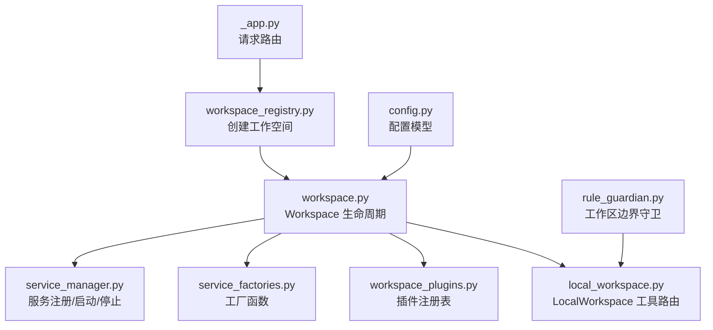
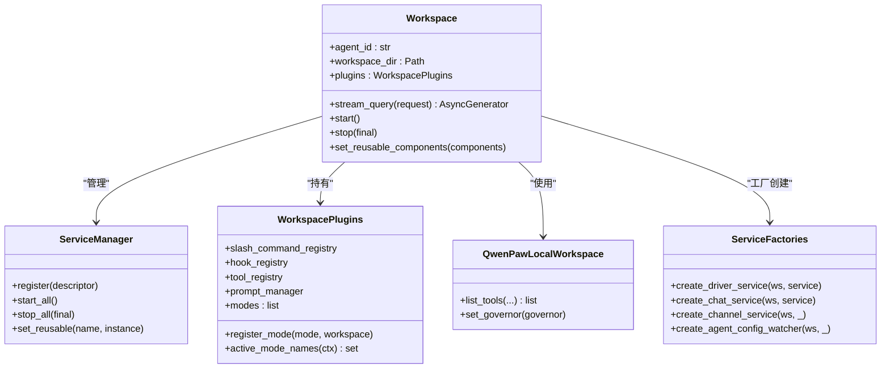
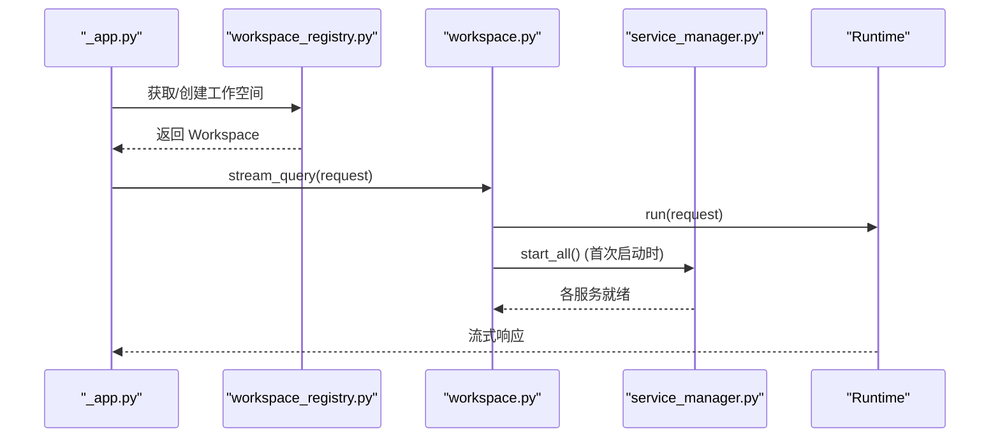
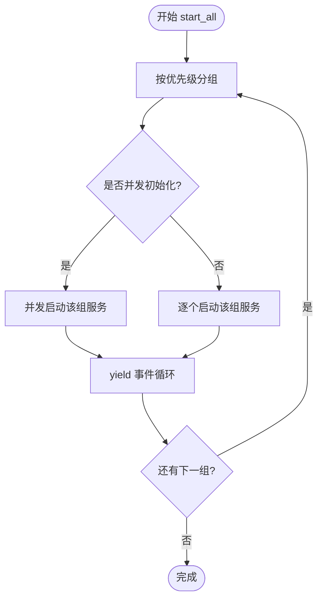
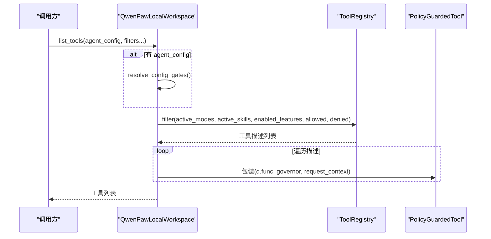
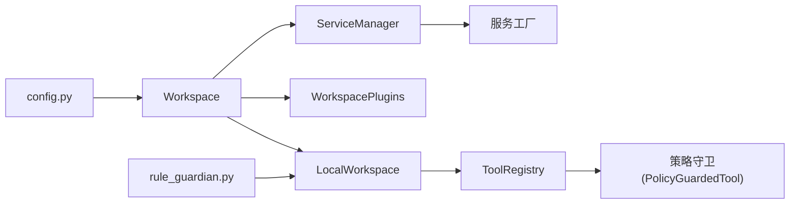
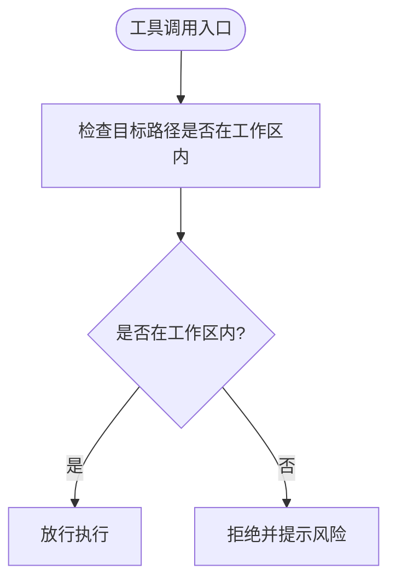

# 工作空间实例

<cite>
**本文引用的文件**
- [workspace.py](file://src/qwenpaw/app/workspace/workspace.py)
- [local_workspace.py](file://src/qwenpaw/app/workspace/local_workspace.py)
- [service_manager.py](file://src/qwenpaw/app/workspace/service_manager.py)
- [service_factories.py](file://src/qwenpaw/app/workspace/service_factories.py)
- [workspace_plugins.py](file://src/qwenpaw/app/workspace/workspace_plugins.py)
- [config.py](file://src/qwenpaw/config/config.py)
- [workspace_registry.py](file://src/qwenpaw/app/workspace_registry.py)
- [_app.py](file://src/qwenpaw/app/_app.py)
- [rule_guardian.py](file://src/qwenpaw/security/tool_guard/guardians/rule_guardian.py)
- [test_multi_agent_lifecycle.py](file://tests/integration/test_multi_agent_lifecycle.py)
</cite>

## 目录
1. [简介](#简介)
2. [项目结构](#项目结构)
3. [核心组件](#核心组件)
4. [架构总览](#架构总览)
5. [详细组件分析](#详细组件分析)
6. [依赖关系分析](#依赖关系分析)
7. [性能与并发特性](#性能与并发特性)
8. [配置参考](#配置参考)
9. [监控、日志与故障恢复](#监控日志与故障恢复)
10. [安全边界与数据隔离](#安全边界与数据隔离)
11. [故障排查指南](#故障排查指南)
12. [结论](#结论)

## 简介
本文件面向 QwenPaw 的工作空间（Workspace）实例系统，聚焦以下目标：
- 深入解释 Workspace 基类与 LocalWorkspace 实现的核心能力：文件系统隔离、环境变量管理、插件加载机制。
- 详细说明工作空间的启动流程：配置解析、依赖检查、初始化顺序。
- 记录工作空间间的数据隔离策略与安全边界设计。
- 提供工作空间配置的完整参考：路径映射、权限控制、性能调优选项。
- 说明工作空间的监控、日志记录与故障恢复机制。

## 项目结构
QwenPaw 的“工作空间”位于应用层，围绕一个独立 Agent 实例的生命周期组织相关服务与插件。关键目录与文件：
- src/qwenpaw/app/workspace/：工作空间核心实现与服务编排
- src/qwenpaw/config/config.py：Agent 与工作空间配置模型
- src/qwenpaw/app/workspace_registry.py：多工作空间注册器（创建并引导 Workspace）
- src/qwenpaw/app/_app.py：请求路由到具体工作空间
- src/qwenpaw/security/tool_guard/guardians/rule_guardian.py：工具调用时的安全守卫（工作区边界校验）

图表来源
- [workspace.py:39-138](file://src/qwenpaw/app/workspace/workspace.py#L39-L138)
- [service_manager.py:79-176](file://src/qwenpaw/app/workspace/service_manager.py#L79-L176)
- [service_factories.py:18-189](file://src/qwenpaw/app/workspace/service_factories.py#L18-L189)
- [workspace_plugins.py:31-66](file://src/qwenpaw/app/workspace/workspace_plugins.py#L31-L66)
- [local_workspace.py:28-116](file://src/qwenpaw/app/workspace/local_workspace.py#L28-L116)
- [config.py:47-132](file://src/qwenpaw/config/config.py#L47-L132)
- [rule_guardian.py:142-174](file://src/qwenpaw/security/tool_guard/guardians/rule_guardian.py#L142-L174)

章节来源
- [workspace.py:39-138](file://src/qwenpaw/app/workspace/workspace.py#L39-L138)
- [service_manager.py:79-176](file://src/qwenpaw/app/workspace/service_manager.py#L79-L176)
- [service_factories.py:18-189](file://src/qwenpaw/app/workspace/service_factories.py#L18-L189)
- [workspace_plugins.py:31-66](file://src/qwenpaw/app/workspace/workspace_plugins.py#L31-L66)
- [local_workspace.py:28-116](file://src/qwenpaw/app/workspace/local_workspace.py#L28-L116)
- [config.py:47-132](file://src/qwenpaw/config/config.py#L47-L132)
- [rule_guardian.py:142-174](file://src/qwenpaw/security/tool_guard/guardians/rule_guardian.py#L142-L174)

## 核心组件
- Workspace：单 Agent 工作空间实例，封装会话、记忆、驱动、定时任务、通道、插件等运行时组件，并通过 Runtime 处理请求。
- ServiceManager：统一管理服务生命周期（按优先级分组、并发/串行启动、可选服务容错、可复用组件热重载）。
- QwenPawLocalWorkspace：对 AgentScope LocalWorkspace 的扩展，将工具列表路由到内部 ToolRegistry，支持四维度过滤与策略守卫。
- WorkspacePlugins：每个工作空间独立的插件注册表集合（命令、钩子、工具、提示词、模式）。
- 服务工厂：集中创建 Driver、Chat、Channel、Cron、Watcher 等服务，注入工作空间上下文。

章节来源
- [workspace.py:39-138](file://src/qwenpaw/app/workspace/workspace.py#L39-L138)
- [service_manager.py:79-176](file://src/qwenpaw/app/workspace/service_manager.py#L79-L176)
- [local_workspace.py:28-116](file://src/qwenpaw/app/workspace/local_workspace.py#L28-L116)
- [workspace_plugins.py:31-66](file://src/qwenpaw/app/workspace/workspace_plugins.py#L31-L66)
- [service_factories.py:18-189](file://src/qwenpaw/app/workspace/service_factories.py#L18-L189)

## 架构总览
工作空间作为“最小运行单元”，通过声明式服务描述进行装配，按优先级和依赖关系有序启动；请求进入后由 Runtime 执行，期间读取工作空间内的插件与工具集。

图表来源
- [workspace.py:39-138](file://src/qwenpaw/app/workspace/workspace.py#L39-L138)
- [service_manager.py:79-176](file://src/qwenpaw/app/workspace/service_manager.py#L79-L176)
- [local_workspace.py:28-116](file://src/qwenpaw/app/workspace/local_workspace.py#L28-L116)
- [workspace_plugins.py:31-66](file://src/qwenpaw/app/workspace/workspace_plugins.py#L31-L66)
- [service_factories.py:18-189](file://src/qwenpaw/app/workspace/service_factories.py#L18-L189)

## 详细组件分析

### Workspace 基类
- 职责
  - 维护 agent_id 与 workspace_dir，确保目录存在。
  - 持有 per-workspace 插件注册表与 LocalWorkspace 实例。
  - 通过 ServiceManager 声明式注册所有服务（会话、记忆、驱动、聊天、通道、定时任务、配置监听器等）。
  - 暴露 stream_query 以接入 Runtime 执行请求。
  - 提供 start/stop 生命周期方法，支持可复用组件的热重载。
- 启动流程要点
  - 加载 Agent 配置。
  - 执行旧版 weixin -> wechat 数据迁移（非阻塞，失败仅告警）。
  - 按优先级启动服务组，允许并发与可选服务容错。
- 停止流程要点
  - 逆序停止服务，支持 final=false 跳过可复用服务（用于重载场景）。

图表来源
- [_app.py:95-127](file://src/qwenpaw/app/_app.py#L95-L127)
- [workspace_registry.py:24-46](file://src/qwenpaw/app/workspace_registry.py#L24-L46)
- [workspace.py:255-268](file://src/qwenpaw/app/workspace/workspace.py#L255-L268)
- [service_manager.py:176-217](file://src/qwenpaw/app/workspace/service_manager.py#L176-L217)

章节来源
- [workspace.py:39-138](file://src/qwenpaw/app/workspace/workspace.py#L39-L138)
- [workspace.py:255-268](file://src/qwenpaw/app/workspace/workspace.py#L255-L268)
- [workspace.py:459-500](file://src/qwenpaw/app/workspace/workspace.py#L459-L500)
- [workspace.py:546-566](file://src/qwenpaw/app/workspace/workspace.py#L546-L566)
- [workspace_registry.py:24-46](file://src/qwenpaw/app/workspace_registry.py#L24-L46)
- [_app.py:95-127](file://src/qwenpaw/app/_app.py#L95-L127)

### ServiceManager 与声明式服务
- 服务描述 ServiceDescriptor
  - 定义名称、构造方式、post_init/start_method/stop_method、是否可复用、是否可选、并发初始化、优先级等。
- 启动策略
  - 按优先级分组，同组内可按 concurrent_init 并行或串行启动。
  - 在组间 yield 事件循环，避免阻塞 HTTP 请求。
  - 可选服务启动失败不中断整体启动，仅记录警告并从服务字典移除。
- 可复用组件
  - 支持 set_reusable 标记从上一实例继承的服务，并在 start_all 中跳过重建。
  - stop_all(final=false) 跳过可复用服务，以便在新实例中继续复用。

图表来源
- [service_manager.py:176-217](file://src/qwenpaw/app/workspace/service_manager.py#L176-L217)
- [service_manager.py:218-261](file://src/qwenpaw/app/workspace/service_manager.py#L218-L261)
- [service_manager.py:372-463](file://src/qwenpaw/app/workspace/service_manager.py#L372-L463)

章节来源
- [service_manager.py:79-176](file://src/qwenpaw/app/workspace/service_manager.py#L79-L176)
- [service_manager.py:176-217](file://src/qwenpaw/app/workspace/service_manager.py#L176-L217)
- [service_manager.py:218-261](file://src/qwenpaw/app/workspace/service_manager.py#L218-L261)
- [service_manager.py:372-463](file://src/qwenpaw/app/workspace/service_manager.py#L372-L463)

### QwenPawLocalWorkspace 与工具路由
- 作用
  - 替换默认内置工具，将 list_tools 委托给内部 ToolRegistry。
  - 支持基于 active_modes、active_skills、enabled_features 以及 agent_config 的四维过滤。
  - 为每个工具包装 PolicyGuardedTool，结合 ResourceGovernor 做策略守卫。
- 配置门控
  - 根据 agent_config.tools.builtin_tools 计算 allowed/denied 集合，决定显式启用与禁用。

图表来源
- [local_workspace.py:28-116](file://src/qwenpaw/app/workspace/local_workspace.py#L28-L116)

章节来源
- [local_workspace.py:28-116](file://src/qwenpaw/app/workspace/local_workspace.py#L28-L116)

### 插件系统与模式
- WorkspacePlugins 聚合了每工作空间的：
  - SlashCommandRegistry：斜杠命令分发
  - HookRegistry：八阶段钩子编排
  - ToolRegistry：工具注册与过滤
  - PromptManager：提示词管理
  - modes：工作空间模式列表，支持动态激活
- register_mode 会立即执行 mode.setup(workspace)，并拒绝重复名称以避免歧义。
- active_mode_names 用于在运行时收集当前激活的模式名，供工具过滤等使用。

章节来源
- [workspace_plugins.py:31-66](file://src/qwenpaw/app/workspace/workspace_plugins.py#L31-L66)
- [workspace.py:139-241](file://src/qwenpaw/app/workspace/workspace.py#L139-L241)

### 服务工厂与依赖注入
- create_driver_service：创建 DriverManager，注册 MCP 处理器，迁移旧配置，启动外部能力运行时。
- create_chat_service：创建或复用 ChatManager，持久化到 chats.json。
- create_channel_service：若配置 channels，则创建 ChannelManager 并绑定 workspace 语言设置。
- create_agent_config_watcher：当存在 channel/cron 时创建配置监听器，触发重载。

章节来源
- [service_factories.py:18-189](file://src/qwenpaw/app/workspace/service_factories.py#L18-L189)
- [workspace.py:269-425](file://src/qwenpaw/app/workspace/workspace.py#L269-L425)

## 依赖关系分析
- 组件耦合
  - Workspace 强依赖 ServiceManager 与 WorkspacePlugins，弱依赖各服务工厂。
  - LocalWorkspace 依赖 ToolRegistry 与策略守卫。
  - 服务之间通过 ServiceManager 的 post_init 与 start_method 解耦。
- 外部依赖
  - 配置来自 config.py 的 Pydantic 模型。
  - 安全边界由 rule_guardian.py 在工作区路径上实施。

图表来源
- [workspace.py:39-138](file://src/qwenpaw/app/workspace/workspace.py#L39-L138)
- [service_manager.py:79-176](file://src/qwenpaw/app/workspace/service_manager.py#L79-L176)
- [local_workspace.py:28-116](file://src/qwenpaw/app/workspace/local_workspace.py#L28-L116)
- [config.py:47-132](file://src/qwenpaw/config/config.py#L47-L132)
- [rule_guardian.py:142-174](file://src/qwenpaw/security/tool_guard/guardians/rule_guardian.py#L142-L174)

章节来源
- [workspace.py:39-138](file://src/qwenpaw/app/workspace/workspace.py#L39-L138)
- [service_manager.py:79-176](file://src/qwenpaw/app/workspace/service_manager.py#L79-L176)
- [local_workspace.py:28-116](file://src/qwenpaw/app/workspace/local_workspace.py#L28-L116)
- [config.py:47-132](file://src/qwenpaw/config/config.py#L47-L132)
- [rule_guardian.py:142-174](file://src/qwenpaw/security/tool_guard/guardians/rule_guardian.py#L142-L174)

## 性能与并发特性
- 服务启动
  - 同优先级组内可并发初始化，减少冷启动时间。
  - 同步构造与启动方法被卸载到线程池，避免阻塞事件循环。
  - 组间主动让出事件循环，保证后台启动期间仍可响应 HTTP 请求。
- 可选服务
  - optional=True 的服务启动失败不会阻断工作空间启动，提升鲁棒性。
- 可复用组件
  - 支持跨实例复用 memory_manager、chat_manager 等，降低重启开销。

章节来源
- [service_manager.py:176-217](file://src/qwenpaw/app/workspace/service_manager.py#L176-L217)
- [service_manager.py:262-306](file://src/qwenpaw/app/workspace/service_manager.py#L262-L306)
- [service_manager.py:343-371](file://src/qwenpaw/app/workspace/service_manager.py#L343-L371)
- [workspace.py:427-458](file://src/qwenpaw/app/workspace/workspace.py#L427-L458)

## 配置参考
- Agent ID 与基础约束
  - 长度、字符集、保留字与唯一性校验。
- 通道配置
  - 多种内置通道（IMessage、Discord、DingTalk、Feishu、QQ、Telegram、Mattermost、MQTT、Console、Matrix、Voice、SIP、WeCom、XiaoYi、Yuanbao、WeChat、Slack、OneBot），均支持通用开关与媒体目录等字段。
- 内存与上下文
  - ReMeLightMemoryConfig、ADBPGMemoryConfig、ContextCompactConfig、ToolResultPruningConfig 等。
- 其他环境变量
  - 日志级别、内存压缩阈值、控制台静态目录、认证与工具守卫开关等。

章节来源
- [config.py:126-195](file://src/qwenpaw/config/config.py#L126-L195)
- [config.py:197-518](file://src/qwenpaw/config/config.py#L197-L518)
- [config.py:549-727](file://src/qwenpaw/config/config.py#L549-L727)
- [config.py:729-800](file://src/qwenpaw/config/config.py#L729-L800)

## 监控、日志与故障恢复
- 日志
  - 工作空间创建、启动、停止均有明确日志输出；服务启动耗时超过阈值会记录调试日志。
- 错误处理
  - 可选服务启动失败仅告警并忽略，不影响整体启动。
  - 停止阶段异常会被捕获并记录，尽量保证全部服务尝试停止。
- 故障恢复
  - 可复用组件支持热重载，新实例可通过 set_reusable_components 复用旧实例状态。
  - 启动失败时自动清理已部分启动的服务，避免资源泄漏。

章节来源
- [service_manager.py:218-261](file://src/qwenpaw/app/workspace/service_manager.py#L218-L261)
- [service_manager.py:372-463](file://src/qwenpaw/app/workspace/service_manager.py#L372-L463)
- [workspace.py:459-500](file://src/qwenpaw/app/workspace/workspace.py#L459-L500)
- [workspace.py:546-566](file://src/qwenpaw/app/workspace/workspace.py#L546-L566)

## 安全边界与数据隔离
- 工作空间目录隔离
  - 每个 Agent 拥有独立 workspace_dir，测试验证不同 Agent 的目录不一致。
- 文件系统访问边界
  - 工具守卫在删除等操作前校验目标路径是否位于工作区内，跨盘符或非相对路径将被判定为越界。
- 沙箱与最小权限
  - 沙箱采用“默认拒绝+白名单”模型，仅挂载工作区为可写，其余只读或不可见，设备节点最小化。

图表来源
- [rule_guardian.py:142-174](file://src/qwenpaw/security/tool_guard/guardians/rule_guardian.py#L142-L174)
- [test_multi_agent_lifecycle.py:572-616](file://tests/integration/test_multi_agent_lifecycle.py#L572-L616)

章节来源
- [rule_guardian.py:142-174](file://src/qwenpaw/security/tool_guard/guardians/rule_guardian.py#L142-L174)
- [test_multi_agent_lifecycle.py:572-616](file://tests/integration/test_multi_agent_lifecycle.py#L572-L616)

## 故障排查指南
- 工作空间无法启动
  - 检查可选服务（如 memory_manager、driver_manager）是否因依赖缺失导致启动失败，查看对应警告日志。
  - 确认 Agent 配置文件是否存在且合法，必要时回退旧版 weixin 键到 wechat。
- 工具调用越界
  - 若出现“工作区外文件”提示，请确认操作路径确实在当前 Agent 的 workspace_dir 下。
- 服务未正确启动
  - 核对服务优先级与依赖，确认 post_init/start_method 是否正确命名并可调用。
- 热重载失效
  - 确认组件是否在 descriptor 中标记 reusable，且在 start 前调用 set_reusable_components。

章节来源
- [service_manager.py:218-261](file://src/qwenpaw/app/workspace/service_manager.py#L218-L261)
- [workspace.py:459-500](file://src/qwenpaw/app/workspace/workspace.py#L459-L500)
- [rule_guardian.py:142-174](file://src/qwenpaw/security/tool_guard/guardians/rule_guardian.py#L142-L174)

## 结论
QwenPaw 的工作空间以 Workspace 为核心，借助 ServiceManager 的声明式服务编排实现了高内聚、低耦合的运行时体系。通过 LocalWorkspace 的工具路由与策略守卫，配合严格的工作区目录隔离与沙箱策略，系统在可扩展性与安全性之间取得良好平衡。同时，可复用组件与可选服务机制提升了系统的韧性与可用性，适合在生产环境中稳定运行。