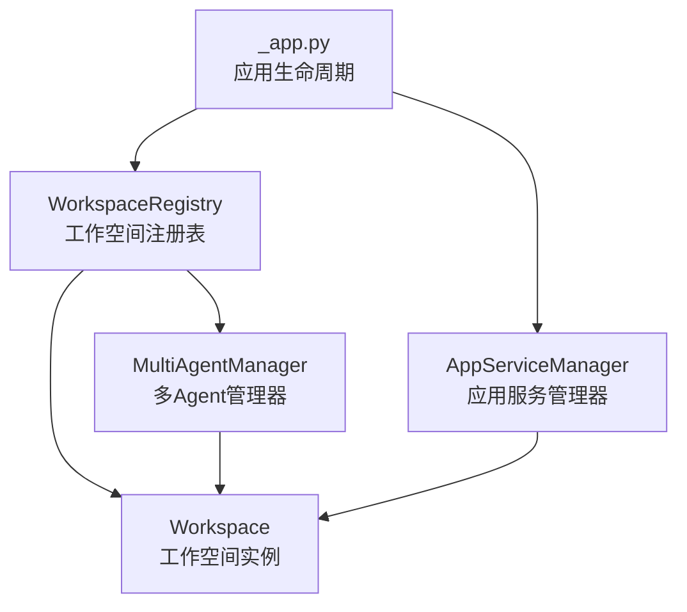
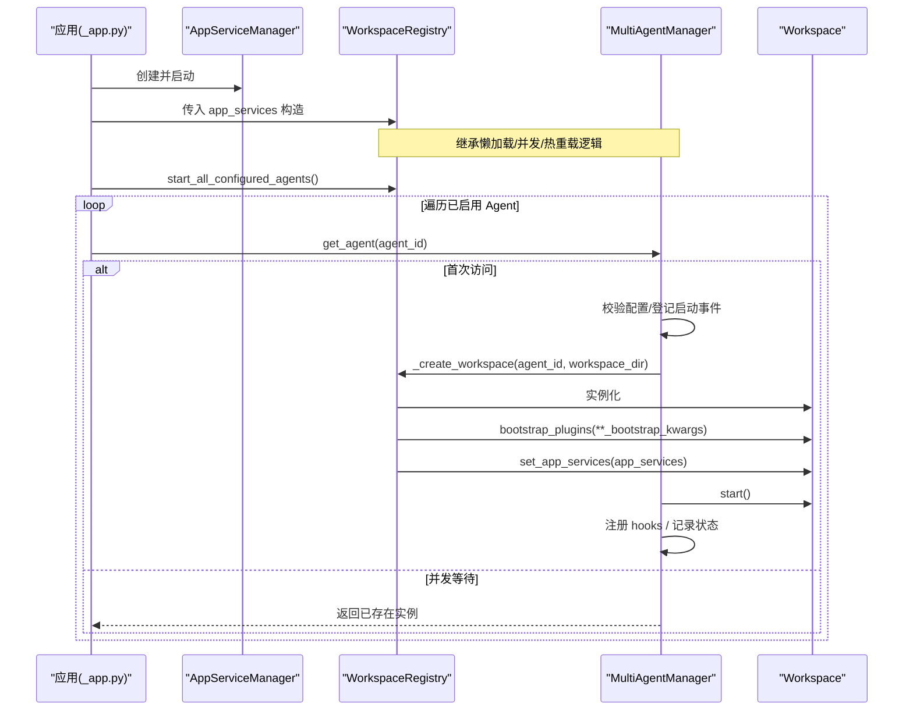
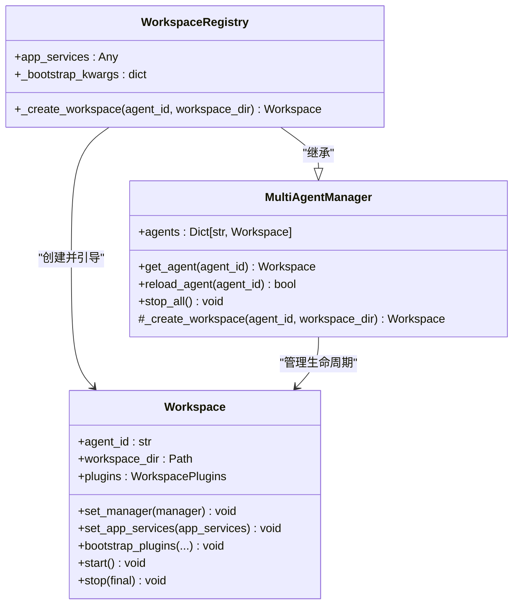
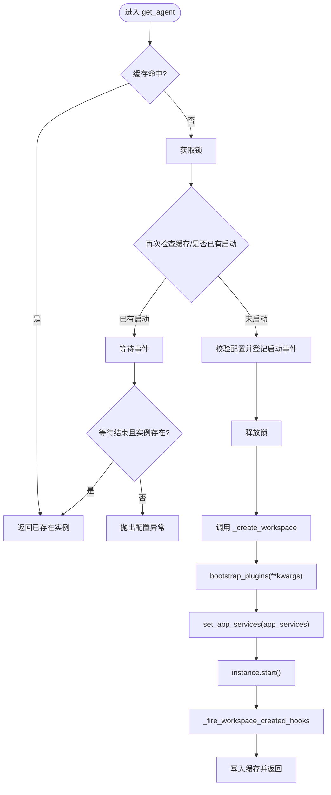
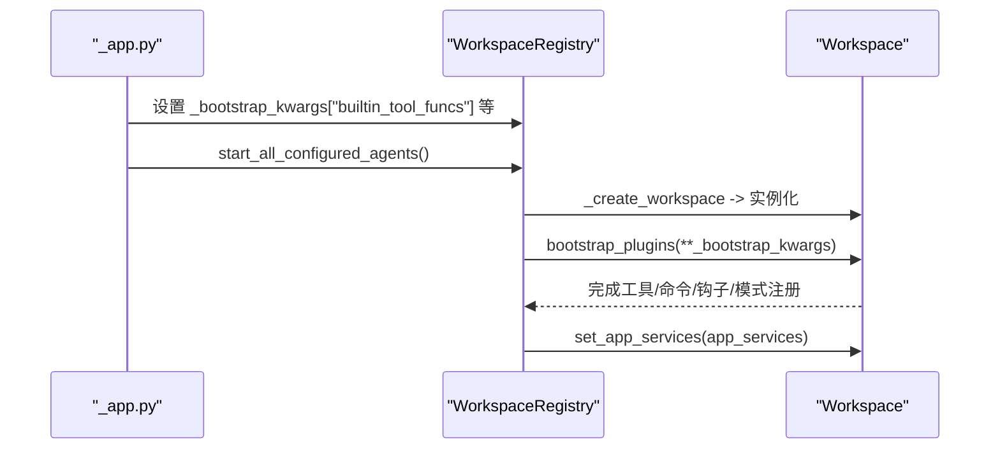
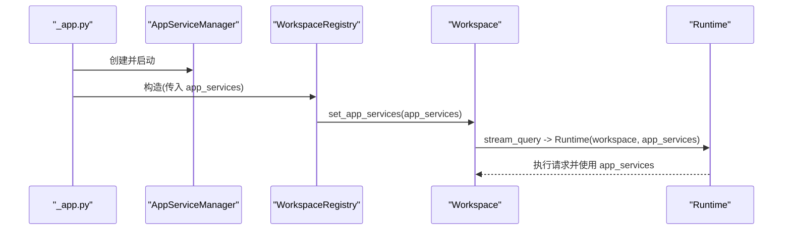
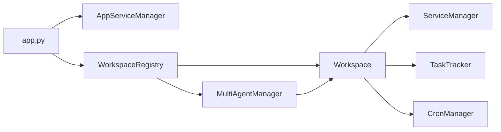

# 工作空间注册表

<cite>
**本文引用的文件**
- [workspace_registry.py](file://src/qwenpaw/app/workspace_registry.py)
- [multi_agent_manager.py](file://src/qwenpaw/app/multi_agent_manager.py)
- [workspace.py](file://src/qwenpaw/app/workspace/workspace.py)
- [_app.py](file://src/qwenpaw/app/_app.py)
</cite>

## 目录
1. [简介](#简介)
2. [项目结构](#项目结构)
3. [核心组件](#核心组件)
4. [架构总览](#架构总览)
5. [详细组件分析](#详细组件分析)
6. [依赖关系分析](#依赖关系分析)
7. [性能与并发特性](#性能与并发特性)
8. [故障排查指南](#故障排查指南)
9. [结论](#结论)
10. [附录：配置选项与使用示例](#附录配置选项与使用示例)

## 简介
本文件聚焦 QwenPaw 的“工作空间注册表系统”，围绕 WorkspaceRegistry 类的设计模式、职责边界以及与 MultiAgentManager 的继承扩展关系展开。文档将深入解释：
- 工作空间的创建流程（含懒加载、去重、并行启动）
- 引导插件注入机制（bootstrap_plugins 调用时机与参数来源）
- 应用程序服务共享策略（app_services 跨工作空间注入）
- _create_workspace 方法的实现细节（实例化、引导、设置 app_services）
- 多 Agent 环境下的资源隔离与管理策略
- 配置项与使用示例，帮助读者快速上手并正确扩展

## 项目结构
QwenPaw 后端应用通过分层组织代码，其中与工作空间注册表相关的核心文件位于 src/qwenpaw/app 目录下：
- workspace_registry.py：定义 WorkspaceRegistry，负责创建带引导和共享服务的 Workspace 实例
- multi_agent_manager.py：提供多 Agent 工作空间的生命周期管理（懒加载、热重载、并发控制）
- workspace/workspace.py：Workspace 运行时封装，包含服务注册、启动/停止、请求处理等
- _app.py：应用生命周期入口，负责初始化 AppServiceManager 与 WorkspaceRegistry，并注入内置能力

图表来源
- [_app.py:232-246](file://src/qwenpaw/app/_app.py#L232-L246)
- [workspace_registry.py:24-46](file://src/qwenpaw/app/workspace_registry.py#L24-L46)
- [multi_agent_manager.py:23-52](file://src/qwenpaw/app/multi_agent_manager.py#L23-L52)
- [workspace.py:39-90](file://src/qwenpaw/app/workspace/workspace.py#L39-L90)

章节来源
- [_app.py:232-246](file://src/qwenpaw/app/_app.py#L232-L246)
- [workspace_registry.py:24-46](file://src/qwenpaw/app/workspace_registry.py#L24-L46)
- [multi_agent_manager.py:23-52](file://src/qwenpaw/app/multi_agent_manager.py#L23-L52)
- [workspace.py:39-90](file://src/qwenpaw/app/workspace/workspace.py#L39-L90)

## 核心组件
- WorkspaceRegistry：继承自 MultiAgentManager，覆写工作空间工厂方法，在每次创建时执行引导插件注入与 app_services 注入，确保每个新工作空间具备完整能力集。
- MultiAgentManager：统一管理多个 Workspace 实例，提供懒加载、并发安全、热重载、优雅停机等能力。
- Workspace：单个 Agent 的独立运行环境，包含会话、记忆、驱动、渠道、定时任务、插件注册表等服务，并通过 ServiceManager 统一生命周期管理。

章节来源
- [workspace_registry.py:24-46](file://src/qwenpaw/app/workspace_registry.py#L24-L46)
- [multi_agent_manager.py:23-52](file://src/qwenpaw/app/multi_agent_manager.py#L23-L52)
- [workspace.py:39-90](file://src/qwenpaw/app/workspace/workspace.py#L39-L90)

## 架构总览
下图展示了从应用启动到工作空间创建的端到端流程，包括 AppServiceManager 的创建、WorkspaceRegistry 的构造、内置能力的收集与注入，以及工作空间的懒加载与启动。

图表来源
- [_app.py:232-246](file://src/qwenpaw/app/_app.py#L232-L246)
- [_app.py:304-319](file://src/qwenpaw/app/_app.py#L304-L319)
- [workspace_registry.py:24-46](file://src/qwenpaw/app/workspace_registry.py#L24-L46)
- [multi_agent_manager.py:54-158](file://src/qwenpaw/app/multi_agent_manager.py#L54-L158)
- [workspace.py:459-500](file://src/qwenpaw/app/workspace/workspace.py#L459-L500)

## 详细组件分析

### WorkspaceRegistry 设计与职责
- 设计模式
  - 模板方法模式：通过覆写 _create_workspace 定制工作空间创建流程，其余行为（懒加载、并发、热重载）由父类提供。
  - 组合与注入：持有 app_services 引用，并在创建工作空间后注入；同时维护 _bootstrap_kwargs，集中传递引导参数。
- 关键属性与方法
  - __init__：接收 app_services 与 bootstrap_plugins_kwargs，保存为实例属性。
  - _create_workspace：实例化 Workspace，按需调用 bootstrap_plugins，再注入 app_services。
- 与其他组件的关系
  - 继承 MultiAgentManager，复用其并发安全的 get_agent、reload_agent、stop_all 等方法。
  - 被 _app.py 在应用生命周期中构造并挂载至 app.state，供后续路由与插件系统访问。

图表来源
- [workspace_registry.py:24-46](file://src/qwenpaw/app/workspace_registry.py#L24-L46)
- [multi_agent_manager.py:23-52](file://src/qwenpaw/app/multi_agent_manager.py#L23-L52)
- [workspace.py:39-90](file://src/qwenpaw/app/workspace/workspace.py#L39-L90)

章节来源
- [workspace_registry.py:24-46](file://src/qwenpaw/app/workspace_registry.py#L24-L46)
- [multi_agent_manager.py:23-52](file://src/qwenpaw/app/multi_agent_manager.py#L23-L52)
- [workspace.py:39-90](file://src/qwenpaw/app/workspace/workspace.py#L39-L90)

### 工作空间创建流程与 _create_workspace 细节
- 触发点
  - 首次访问某个 agent_id 时，MultiAgentManager.get_agent 会调用 _create_workspace。
  - 热重载 reload_agent 也会调用 _create_workspace 创建新实例，随后原子替换旧实例。
- 步骤分解
  - 实例化：根据 agent_id 与 workspace_dir 创建 Workspace。
  - 引导插件：若存在 _bootstrap_kwargs，则调用 workspace.bootstrap_plugins(**kwargs)，完成工具、命令、钩子、模式等的注册。
  - 注入应用服务：若 app_services 非空，调用 workspace.set_app_services(app_services)。
  - 启动：由父类继续调用 instance.start()，完成服务初始化与就绪。
- 并发与去重
  - 同一 agent_id 的并发请求会被 pending_starts 事件协调，首个请求负责创建，其他请求等待结果。
  - 锁仅用于字典操作，不阻塞耗时的工作空间初始化，从而实现真正的并行启动。

图表来源
- [multi_agent_manager.py:54-158](file://src/qwenpaw/app/multi_agent_manager.py#L54-L158)
- [workspace_registry.py:37-46](file://src/qwenpaw/app/workspace_registry.py#L37-L46)
- [workspace.py:459-500](file://src/qwenpaw/app/workspace/workspace.py#L459-L500)

章节来源
- [multi_agent_manager.py:54-158](file://src/qwenpaw/app/multi_agent_manager.py#L54-L158)
- [workspace_registry.py:37-46](file://src/qwenpaw/app/workspace_registry.py#L37-L46)
- [workspace.py:459-500](file://src/qwenpaw/app/workspace/workspace.py#L459-L500)

### 引导插件注入机制（bootstrap_plugins）
- 作用
  - 将内置能力一次性注入到每个工作空间的插件注册表中，包括：
    - 工具函数（builtin_tool_funcs）
    - 提示贡献者（builtin_contributor_clses）
    - 模式类（builtin_mode_clses）
    - 钩子类（builtin_hook_clses）
    - 斜杠命令规范（builtin_command_specs）
    - 默认回退处理器（builtin_fallback_handler）
- 调用时机
  - 在 WorkspaceRegistry._create_workspace 中，于实例化后立即调用，确保工作空间启动前具备完整能力。
- 参数来源
  - _app.py 在应用启动阶段收集内置工具函数与命令规范，并写入 workspace_registry._bootstrap_kwargs，供后续所有工作空间复用。

图表来源
- [_app.py:304-319](file://src/qwenpaw/app/_app.py#L304-L319)
- [workspace_registry.py:37-46](file://src/qwenpaw/app/workspace_registry.py#L37-L46)
- [workspace.py:139-241](file://src/qwenpaw/app/workspace/workspace.py#L139-L241)

章节来源
- [_app.py:304-319](file://src/qwenpaw/app/_app.py#L304-L319)
- [workspace_registry.py:37-46](file://src/qwenpaw/app/workspace_registry.py#L37-L46)
- [workspace.py:139-241](file://src/qwenpaw/app/workspace/workspace.py#L139-L241)

### 应用程序服务共享策略（app_services）
- 目标
  - 将 AppServiceManager 实例注入到每个工作空间，使 Runtime 在执行请求时可访问审批协调器、工具协调器等全局能力。
- 注入路径
  - _app.py 创建 AppServiceManager 并启动，将其作为 app_services 传递给 WorkspaceRegistry。
  - WorkspaceRegistry 在 _create_workspace 中调用 workspace.set_app_services(app_services)。
  - Workspace.stream_query 在构建 Runtime 时传入 app_services，从而贯穿整个请求处理链路。

图表来源
- [_app.py:232-246](file://src/qwenpaw/app/_app.py#L232-L246)
- [workspace_registry.py:37-46](file://src/qwenpaw/app/workspace_registry.py#L37-L46)
- [workspace.py:255-267](file://src/qwenpaw/app/workspace/workspace.py#L255-L267)

章节来源
- [_app.py:232-246](file://src/qwenpaw/app/_app.py#L232-L246)
- [workspace_registry.py:37-46](file://src/qwenpaw/app/workspace_registry.py#L37-L46)
- [workspace.py:255-267](file://src/qwenpaw/app/workspace/workspace.py#L255-L267)

### 多 Agent 环境下的资源隔离与管理策略
- 资源隔离
  - 每个 Workspace 拥有独立的目录、会话存储、记忆后端、渠道、定时任务与插件注册表，避免相互干扰。
- 生命周期管理
  - 懒加载：仅在首次访问时创建并启动，降低冷启动开销。
  - 并发安全：通过 asyncio.Lock 与 Event 协调并发访问，避免重复创建。
  - 热重载：reload_agent 支持零停机切换，旧实例在后台优雅清理。
- 可扩展性
  - 通过覆写 _create_workspace 可自定义工作空间初始化流程，满足特定业务需求。

章节来源
- [multi_agent_manager.py:54-158](file://src/qwenpaw/app/multi_agent_manager.py#L54-L158)
- [multi_agent_manager.py:321-448](file://src/qwenpaw/app/multi_agent_manager.py#L321-L448)
- [workspace.py:39-90](file://src/qwenpaw/app/workspace/workspace.py#L39-L90)

## 依赖关系分析
- 直接依赖
  - WorkspaceRegistry 依赖 MultiAgentManager（继承）、Workspace（实例化）。
  - MultiAgentManager 依赖 Workspace（实例化）、配置加载工具。
  - Workspace 依赖 ServiceManager、各类服务工厂、TaskTracker、CronManager 等。
- 间接依赖
  - _app.py 依赖 AppServiceManager、PluginLoader、ProviderManager 等，负责整体装配。
- 耦合与内聚
  - WorkspaceRegistry 与 MultiAgentManager 高内聚，职责清晰；与 Workspace 低耦合，通过工厂方法解耦。
  - app_services 以注入方式传递，避免硬编码依赖。

图表来源
- [_app.py:232-246](file://src/qwenpaw/app/_app.py#L232-L246)
- [workspace_registry.py:24-46](file://src/qwenpaw/app/workspace_registry.py#L24-L46)
- [multi_agent_manager.py:23-52](file://src/qwenpaw/app/multi_agent_manager.py#L23-L52)
- [workspace.py:39-90](file://src/qwenpaw/app/workspace/workspace.py#L39-L90)

章节来源
- [_app.py:232-246](file://src/qwenpaw/app/_app.py#L232-L246)
- [workspace_registry.py:24-46](file://src/qwenpaw/app/workspace_registry.py#L24-L46)
- [multi_agent_manager.py:23-52](file://src/qwenpaw/app/multi_agent_manager.py#L23-L52)
- [workspace.py:39-90](file://src/qwenpaw/app/workspace/workspace.py#L39-L90)

## 性能与并发特性
- 懒加载与去重
  - 首次访问才创建实例，避免不必要的资源占用；并发请求通过事件协调，减少重复创建。
- 并行启动
  - 锁仅用于字典操作，工作空间初始化在锁外进行，允许多个 Agent 并行启动。
- 热重载
  - 新实例先启动成功后再原子替换旧实例，旧实例在后台优雅清理，保证服务连续性。
- 建议优化
  - 对耗时初始化（如外部依赖连接）尽量异步化，进一步缩短启动时间。
  - 合理设置可选服务的 optional 标志，提升容错与启动速度。

[本节为通用性能讨论，无需具体文件分析]

## 故障排查指南
- 常见错误
  - 配置缺失：当 agent_id 未在配置中声明时，get_agent 会抛出配置异常。
  - 启动失败：工作空间启动过程中出现异常，父类会记录日志并尝试清理。
  - 热重载失败：新实例启动失败不会替换旧实例，旧实例继续提供服务。
- 定位方法
  - 查看日志中的 “Failed to start workspace”、“Agent not found in configuration” 等关键字。
  - 确认 _bootstrap_kwargs 是否正确注入，特别是内置工具函数集合是否为空。
  - 检查 app_services 是否已成功启动并注入到工作空间。

章节来源
- [multi_agent_manager.py:94-117](file://src/qwenpaw/app/multi_agent_manager.py#L94-L117)
- [multi_agent_manager.py:150-158](file://src/qwenpaw/app/multi_agent_manager.py#L150-L158)
- [_app.py:304-319](file://src/qwenpaw/app/_app.py#L304-L319)

## 结论
WorkspaceRegistry 通过继承 MultiAgentManager 并覆写 _create_workspace，实现了“带引导与共享服务”的工作空间创建流程。配合 _app.py 的应用装配，系统在启动阶段完成 AppServiceManager 的创建与内置能力收集，随后在工作空间首次访问或热重载时完成引导插件注入与 app_services 注入。该设计在保证资源隔离的同时，提供了良好的并发性能与可扩展性，适合在多 Agent 环境下稳定运行。

[本节为总结性内容，无需具体文件分析]

## 附录：配置选项与使用示例
- 关键配置项
  - app_services：AppServiceManager 实例，用于跨工作空间共享的全局服务。
  - bootstrap_plugins_kwargs：引导参数字典，包含以下键：
    - builtin_tool_funcs：内置工具函数列表
    - builtin_contributor_clses：提示贡献者类列表
    - builtin_mode_clses：模式类列表
    - builtin_hook_clses：钩子类列表
    - builtin_command_specs：斜杠命令规范列表
    - builtin_fallback_handler：默认回退处理器
- 使用示例（概念性说明）
  - 应用启动时创建 AppServiceManager 并启动，然后构造 WorkspaceRegistry 并传入 app_services。
  - 在应用启动阶段收集内置工具函数与命令规范，写入 workspace_registry._bootstrap_kwargs。
  - 调用 start_all_configured_agents() 启动所有已启用的 Agent，或在需要时通过 get_agent(agent_id) 懒加载。
  - 在请求处理中，Workspace.stream_query 会构建 Runtime 并传入 app_services，从而在整个执行链中使用全局服务。

章节来源
- [_app.py:232-246](file://src/qwenpaw/app/_app.py#L232-L246)
- [_app.py:304-319](file://src/qwenpaw/app/_app.py#L304-L319)
- [workspace_registry.py:24-46](file://src/qwenpaw/app/workspace_registry.py#L24-L46)
- [workspace.py:255-267](file://src/qwenpaw/app/workspace/workspace.py#L255-L267)