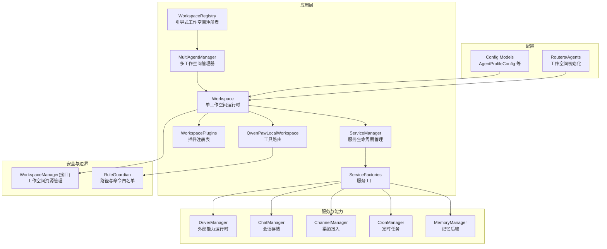
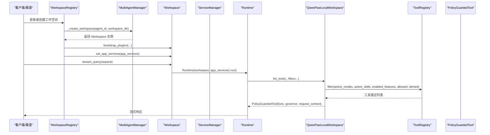
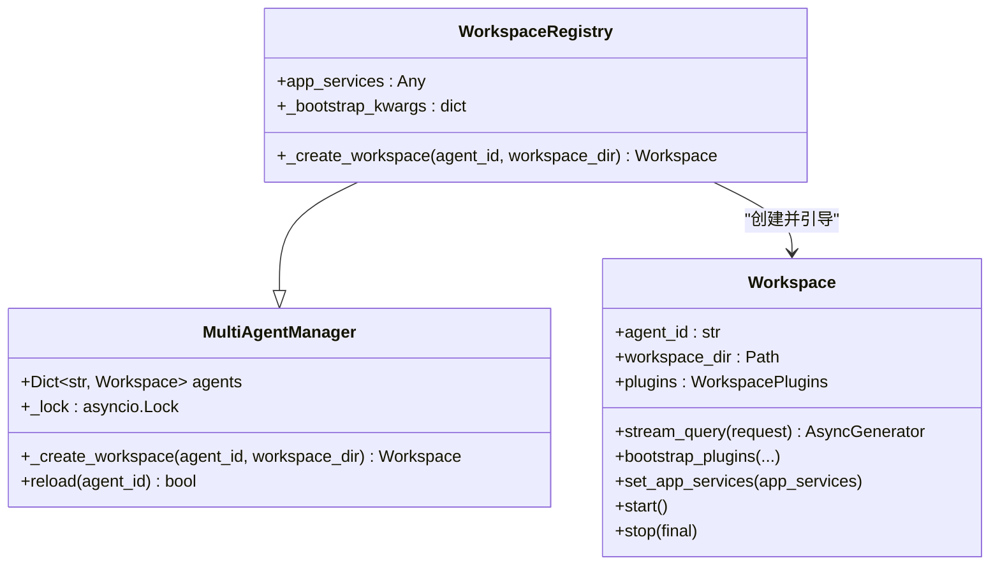
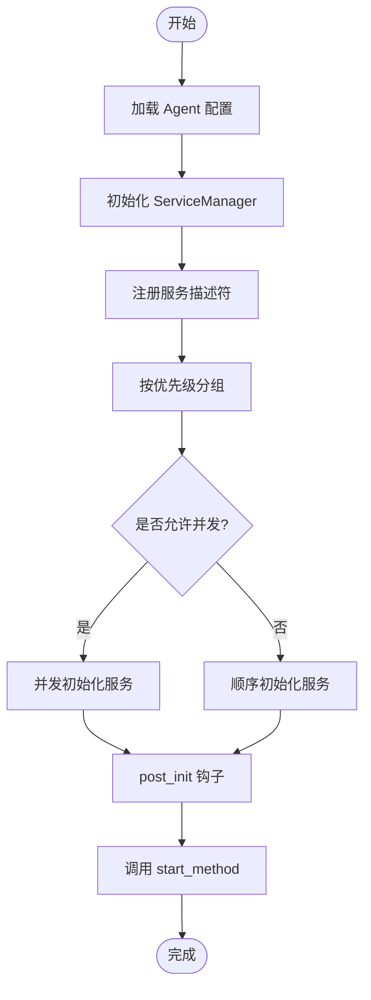
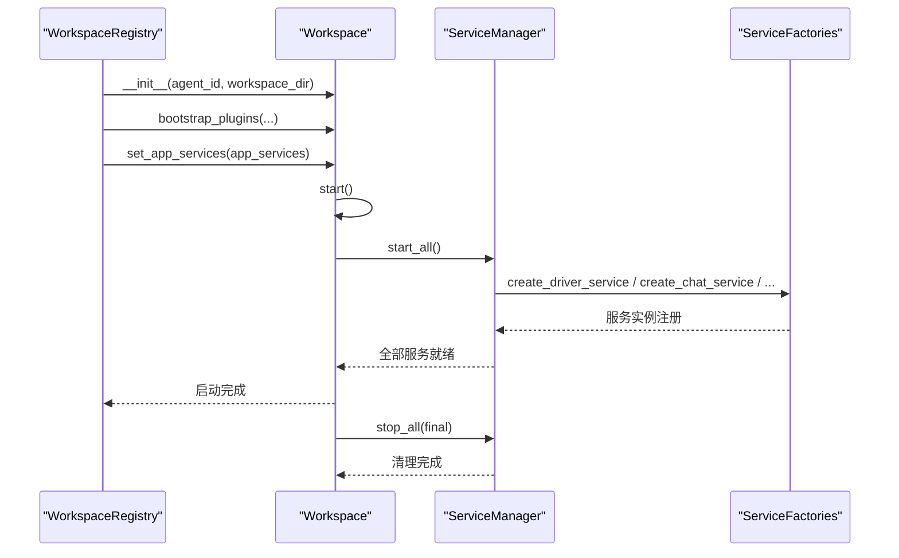
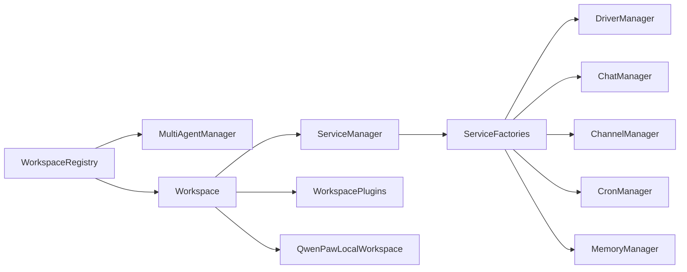

# 工作空间管理

<cite>
**本文引用的文件**
- [workspace_registry.py](file://src/qwenpaw/app/workspace_registry.py)
- [multi_agent_manager.py](file://src/qwenpaw/app/multi_agent_manager.py)
- [workspace.py](file://src/qwenpaw/app/workspace/workspace.py)
- [service_manager.py](file://src/qwenpaw/app/workspace/service_manager.py)
- [service_factories.py](file://src/qwenpaw/app/workspace/service_factories.py)
- [workspace_plugins.py](file://src/qwenpaw/app/workspace/workspace_plugins.py)
- [local_workspace.py](file://src/qwenpaw/app/workspace/local_workspace.py)
- [workspace_manager.py](file://src/qwenpaw/services/workspace_manager/workspace_manager.py)
- [config.py](file://src/qwenpaw/config/config.py)
- [agents.py](file://src/qwenpaw/app/routers/agents.py)
- [rule_guardian.py](file://src/qwenpaw/security/tool_guard/guardians/rule_guardian.py)
</cite>

## 目录
1. [简介](#简介)
2. [项目结构](#项目结构)
3. [核心组件](#核心组件)
4. [架构总览](#架构总览)
5. [详细组件分析](#详细组件分析)
6. [依赖关系分析](#依赖关系分析)
7. [性能与并发特性](#性能与并发特性)
8. [故障排查指南](#故障排查指南)
9. [结论](#结论)
10. [附录：配置规范与最佳实践](#附录配置规范与最佳实践)

## 简介
本文件为 QwenPaw 工作空间管理系统的架构文档，聚焦于 WorkspaceRegistry 的设计模式与职责、多 Agent 隔离机制、资源管理与上下文切换策略；完整记录工作空间的创建、配置、启动与销毁生命周期；说明工作空间间的通信机制与数据共享方案；详细描述文件系统隔离、环境变量管理与插件加载策略；并提供工作空间配置的 YAML/JSON 格式规范与最佳实践。

## 项目结构
工作空间管理相关代码主要分布在 app 层与 services 层：
- app/workspace：Workspace 实例、服务注册与生命周期、插件系统、本地工作区路由
- app/workspace_registry.py：基于 MultiAgentManager 的“带引导”的工作空间注册表
- services/workspace_manager：工作空间级资源边界（沙箱）接口定义
- config/config.py：全局与工作空间配置模型（agent.json 等）
- routers/agents.py：工作空间初始化与默认文件生成
- security/tool_guard：工作区边界校验与安全策略

图表来源
- [workspace_registry.py:1-50](file://src/qwenpaw/app/workspace_registry.py#L1-L50)
- [multi_agent_manager.py:1-120](file://src/qwenpaw/app/multi_agent_manager.py#L1-L120)
- [workspace.py:1-120](file://src/qwenpaw/app/workspace/workspace.py#L1-L120)
- [service_manager.py:1-120](file://src/qwenpaw/app/workspace/service_manager.py#L1-L120)
- [service_factories.py:1-120](file://src/qwenpaw/app/workspace/service_factories.py#L1-L120)
- [workspace_plugins.py:1-66](file://src/qwenpaw/app/workspace/workspace_plugins.py#L1-L66)
- [local_workspace.py:1-120](file://src/qwenpaw/app/workspace/local_workspace.py#L1-L120)
- [workspace_manager.py:1-60](file://src/qwenpaw/services/workspace_manager/workspace_manager.py#L1-L60)
- [config.py:1380-1579](file://src/qwenpaw/config/config.py#L1380-L1579)
- [agents.py:581-611](file://src/qwenpaw/app/routers/agents.py#L581-L611)

章节来源
- [workspace_registry.py:1-50](file://src/qwenpaw/app/workspace_registry.py#L1-L50)
- [multi_agent_manager.py:1-120](file://src/qwenpaw/app/multi_agent_manager.py#L1-L120)
- [workspace.py:1-120](file://src/qwenpaw/app/workspace/workspace.py#L1-L120)
- [service_manager.py:1-120](file://src/qwenpaw/app/workspace/service_manager.py#L1-L120)
- [service_factories.py:1-120](file://src/qwenpaw/app/workspace/service_factories.py#L1-L120)
- [workspace_plugins.py:1-66](file://src/qwenpaw/app/workspace/workspace_plugins.py#L1-L66)
- [local_workspace.py:1-120](file://src/qwenpaw/app/workspace/local_workspace.py#L1-L120)
- [workspace_manager.py:1-60](file://src/qwenpaw/services/workspace_manager/workspace_manager.py#L1-L60)
- [config.py:1380-1579](file://src/qwenpaw/config/config.py#L1380-L1579)
- [agents.py:581-611](file://src/qwenpaw/app/routers/agents.py#L581-L611)

## 核心组件
- WorkspaceRegistry：在 MultiAgentManager 基础上扩展，负责在工作空间创建后注入内置插件与跨工作空间 AppServices 引用，实现“引导式”实例化。
- MultiAgentManager：维护多个 Workspace 实例，提供懒加载、热重载、并行启动与线程安全的访问控制。
- Workspace：封装单个 Agent 的完整运行时，包含 ChannelManager、MemoryManager、DriverManager、CronManager、WorkspacePlugins 等，并通过 ServiceManager 统一生命周期管理。
- ServiceManager：声明式服务注册与启动/停止调度，支持优先级、并发初始化、可选服务、可复用组件迁移。
- WorkspacePlugins：每个工作空间独立的插件注册表（斜杠命令、Hook、工具、提示词、模式）。
- QwenPawLocalWorkspace：将工具列表路由到 ToolRegistry，并支持按请求上下文进行四维过滤（模式、技能、特性、配置门控）。
- WorkspaceManager（接口）：定义工作空间级资源管理契约（start/stop），用于文件系统根、Shell、I/O 等资源边界控制。

章节来源
- [workspace_registry.py:1-50](file://src/qwenpaw/app/workspace_registry.py#L1-L50)
- [multi_agent_manager.py:1-120](file://src/qwenpaw/app/multi_agent_manager.py#L1-L120)
- [workspace.py:1-120](file://src/qwenpaw/app/workspace/workspace.py#L1-L120)
- [service_manager.py:1-120](file://src/qwenpaw/app/workspace/service_manager.py#L1-L120)
- [workspace_plugins.py:1-66](file://src/qwenpaw/app/workspace/workspace_plugins.py#L1-L66)
- [local_workspace.py:1-120](file://src/qwenpaw/app/workspace/local_workspace.py#L1-L120)
- [workspace_manager.py:1-60](file://src/qwenpaw/services/workspace_manager/workspace_manager.py#L1-L60)

## 架构总览
下图展示从请求进入工作空间到执行工具的全链路流程，以及各组件之间的交互关系。

图表来源
- [workspace_registry.py:24-46](file://src/qwenpaw/app/workspace_registry.py#L24-L46)
- [multi_agent_manager.py:35-120](file://src/qwenpaw/app/multi_agent_manager.py#L35-L120)
- [workspace.py:255-267](file://src/qwenpaw/app/workspace/workspace.py#L255-L267)
- [local_workspace.py:45-85](file://src/qwenpaw/app/workspace/local_workspace.py#L45-L85)

## 详细组件分析

### WorkspaceRegistry 设计模式与职责
- 设计模式：组合 + 工厂扩展。继承 MultiAgentManager，重写创建工作空间的方法，在实例化后注入“引导参数”和“跨工作空间服务引用”。
- 职责：
  - 创建 Workspace 实例
  - 调用 bootstrap_plugins 注入内置工具、Hook、命令、模式等
  - 注入 app_services 以支持跨工作空间协调器
- 与其他组件的关系：
  - 依赖 MultiAgentManager 的懒加载、热重载、并发启动能力
  - 通过 Workspace.set_app_services 暴露给工作空间内部使用

图表来源
- [workspace_registry.py:24-46](file://src/qwenpaw/app/workspace_registry.py#L24-L46)
- [multi_agent_manager.py:23-120](file://src/qwenpaw/app/multi_agent_manager.py#L23-L120)
- [workspace.py:53-120](file://src/qwenpaw/app/workspace/workspace.py#L53-L120)

章节来源
- [workspace_registry.py:1-50](file://src/qwenpaw/app/workspace_registry.py#L1-L50)
- [multi_agent_manager.py:1-120](file://src/qwenpaw/app/multi_agent_manager.py#L1-L120)
- [workspace.py:1-120](file://src/qwenpaw/app/workspace/workspace.py#L1-L120)

### 多 Agent 隔离机制
- 进程内隔离：每个 Workspace 拥有独立的服务实例（Session、MemoryManager、DriverManager、ChannelManager、CronManager 等），通过 ServiceManager 管理。
- 文件系统隔离：每个工作空间对应独立目录（workspace_dir），所有持久化数据（sessions、chats、jobs、credentials 等）均落盘在该目录下。
- 插件隔离：WorkspacePlugins 在每个工作空间内独立注册，避免跨工作空间污染。
- 配置隔离：AgentProfileConfig 存储在各自工作空间的 agent.json 中，根配置仅保存引用（id、workspace_dir、enabled）。

章节来源
- [workspace.py:53-120](file://src/qwenpaw/app/workspace/workspace.py#L53-L120)
- [workspace_plugins.py:1-66](file://src/qwenpaw/app/workspace/workspace_plugins.py#L1-L66)
- [config.py:1380-1579](file://src/qwenpaw/config/config.py#L1380-L1579)
- [agents.py:581-611](file://src/qwenpaw/app/routers/agents.py#L581-L611)

### 资源管理与上下文切换策略
- 资源管理：
  - ServiceManager 通过 ServiceDescriptor 声明式注册服务，支持优先级、并发初始化、可选服务、可复用组件迁移。
  - 可复用组件（如 MemoryManager、ChatManager）在热重载时通过 set_reusable_components 迁移到新实例，减少重建成本。
- 上下文切换：
  - 通过 QwenPawLocalWorkspace.list_tools 的四维过滤（active_modes、active_skills、enabled_features、allowed/denied）实现请求级上下文裁剪。
  - PolicyGuardedTool 包装工具函数，结合 ResourceGovernor 对工具执行进行策略治理。

图表来源
- [service_manager.py:163-216](file://src/qwenpaw/app/workspace/service_manager.py#L163-L216)
- [service_manager.py:218-261](file://src/qwenpaw/app/workspace/service_manager.py#L218-L261)
- [service_manager.py:308-341](file://src/qwenpaw/app/workspace/service_manager.py#L308-L341)
- [service_manager.py:343-371](file://src/qwenpaw/app/workspace/service_manager.py#L343-L371)

章节来源
- [service_manager.py:1-120](file://src/qwenpaw/app/workspace/service_manager.py#L1-L120)
- [service_manager.py:163-216](file://src/qwenpaw/app/workspace/service_manager.py#L163-L216)
- [service_manager.py:218-261](file://src/qwenpaw/app/workspace/service_manager.py#L218-L261)
- [service_manager.py:308-341](file://src/qwenpaw/app/workspace/service_manager.py#L308-L341)
- [service_manager.py:343-371](file://src/qwenpaw/app/workspace/service_manager.py#L343-L371)
- [local_workspace.py:45-85](file://src/qwenpaw/app/workspace/local_workspace.py#L45-L85)

### 工作空间生命周期
- 创建：
  - WorkspaceRegistry._create_workspace 创建 Workspace 实例，随后调用 bootstrap_plugins 注入内置插件，再注入 app_services。
- 启动：
  - Workspace.start 加载 agent.json，执行历史数据迁移，然后由 ServiceManager 按优先级启动所有服务。
- 运行：
  - stream_query 委托给 Runtime.run，处理请求流。
- 销毁/热重载：
  - stop(final=True/False) 根据 final 决定是否停止可复用服务；热重载时保留可复用组件，迁移到新实例。

图表来源
- [workspace_registry.py:37-46](file://src/qwenpaw/app/workspace_registry.py#L37-L46)
- [workspace.py:459-500](file://src/qwenpaw/app/workspace/workspace.py#L459-L500)
- [service_manager.py:176-216](file://src/qwenpaw/app/workspace/service_manager.py#L176-L216)
- [service_factories.py:18-82](file://src/qwenpaw/app/workspace/service_factories.py#L18-L82)

章节来源
- [workspace_registry.py:1-50](file://src/qwenpaw/app/workspace_registry.py#L1-L50)
- [workspace.py:459-500](file://src/qwenpaw/app/workspace/workspace.py#L459-L500)
- [service_manager.py:176-216](file://src/qwenpaw/app/workspace/service_manager.py#L176-L216)
- [service_factories.py:18-82](file://src/qwenpaw/app/workspace/service_factories.py#L18-L82)

### 工作空间间通信与数据共享
- 通信机制：
  - 工作空间通过 ChannelManager 接入不同渠道（如 Web、IM 等），消息经 Workspace.stream_query 进入 Runtime 处理。
- 数据共享：
  - 跨工作空间共享由 AppServiceManager 限定在三个协调器范围内；工作空间内部不直接共享状态。
  - 可复用组件（MemoryManager、ChatManager）可在热重载时在新旧实例间迁移，但不跨工作空间共享。

章节来源
- [workspace.py:255-267](file://src/qwenpaw/app/workspace/workspace.py#L255-L267)
- [workspace.py:427-458](file://src/qwenpaw/app/workspace/workspace.py#L427-L458)
- [service_manager.py:151-161](file://src/qwenpaw/app/workspace/service_manager.py#L151-L161)

### 文件系统隔离与环境变量管理
- 文件系统隔离：
  - 每个工作空间有独立目录，所有持久化数据（sessions、chats、jobs、credentials、drivers 等）位于该目录下。
  - RuleGuardian 对路径进行规范化与边界检查，拒绝工作区外操作，防止越权访问。
- 环境变量管理：
  - 部分渠道（如 xiaoyi）支持从环境变量读取配置，但工作空间内的敏感信息建议通过 credentials.yaml 管理。
  - 路径解析支持环境变量展开与波浪号展开，相对路径会解析为工作区绝对路径。

章节来源
- [workspace.py:53-120](file://src/qwenpaw/app/workspace/workspace.py#L53-L120)
- [service_factories.py:18-82](file://src/qwenpaw/app/workspace/service_factories.py#L18-L82)
- [rule_guardian.py:104-173](file://src/qwenpaw/security/tool_guard/guardians/rule_guardian.py#L104-L173)
- [channels/xiaoyi/channel.py:395-433](file://src/qwenpaw/app/channels/xiaoyi/channel.py#L395-L433)

### 插件加载策略
- 引导阶段：
  - WorkspaceRegistry 在创建 Workspace 后立即调用 bootstrap_plugins，注入内置工具、Hook、命令、模式等。
- 运行时：
  - WorkspacePlugins 持有每工作空间的注册表，Request 级通过 active_mode_names 计算活跃模式集合，配合 ToolRegistry.filter 进行动态裁剪。
- 模式注册：
  - register_mode 确保模式名称唯一，并在注册时立即 setup(workspace)。

章节来源
- [workspace_registry.py:37-46](file://src/qwenpaw/app/workspace_registry.py#L37-L46)
- [workspace.py:139-241](file://src/qwenpaw/app/workspace/workspace.py#L139-L241)
- [workspace_plugins.py:31-66](file://src/qwenpaw/app/workspace/workspace_plugins.py#L31-L66)

## 依赖关系分析
- 组件耦合：
  - WorkspaceRegistry 依赖 MultiAgentManager 与 Workspace；Workspace 依赖 ServiceManager、WorkspacePlugins、QwenPawLocalWorkspace。
  - ServiceManager 依赖 ServiceFactories 提供的工厂函数创建具体服务。
- 外部依赖：
  - Drivers（MCP）、Channels、Cron、Memory 等作为可选或条件性服务，通过 optional 与 post_init 灵活装配。
- 潜在循环依赖：
  - 通过延迟导入与工厂函数避免强耦合；例如 create_driver_service 在启动时按需导入。

图表来源
- [workspace_registry.py:24-46](file://src/qwenpaw/app/workspace_registry.py#L24-L46)
- [workspace.py:269-425](file://src/qwenpaw/app/workspace/workspace.py#L269-L425)
- [service_manager.py:1-120](file://src/qwenpaw/app/workspace/service_manager.py#L1-L120)
- [service_factories.py:18-189](file://src/qwenpaw/app/workspace/service_factories.py#L18-L189)

章节来源
- [workspace_registry.py:1-50](file://src/qwenpaw/app/workspace_registry.py#L1-L50)
- [workspace.py:269-425](file://src/qwenpaw/app/workspace/workspace.py#L269-L425)
- [service_manager.py:1-120](file://src/qwenpaw/app/workspace/service_manager.py#L1-L120)
- [service_factories.py:18-189](file://src/qwenpaw/app/workspace/service_factories.py#L18-L189)

## 性能与并发特性
- 并行启动：
  - ServiceManager 按优先级分组，同组内允许 concurrent_init 的服务并发初始化，降低整体启动时间。
- 事件循环友好：
  - 同步构造与 start_method 通过 asyncio.to_thread 卸载到线程池，避免阻塞事件循环。
- 热重载优化：
  - 可复用组件迁移避免重复创建昂贵资源（如连接池、内存后端）。

章节来源
- [service_manager.py:176-216](file://src/qwenpaw/app/workspace/service_manager.py#L176-L216)
- [service_manager.py:262-306](file://src/qwenpaw/app/workspace/service_manager.py#L262-L306)
- [service_manager.py:343-371](file://src/qwenpaw/app/workspace/service_manager.py#L343-L371)
- [workspace.py:427-458](file://src/qwenpaw/app/workspace/workspace.py#L427-L458)

## 故障排查指南
- 启动失败：
  - 检查 ServiceManager 的 optional 服务是否因依赖缺失而跳过；查看日志中的警告信息。
- 热重载异常：
  - 确认 set_reusable_components 在 start 之前调用；检查 reload_func 是否抛出异常。
- 工具权限问题：
  - 检查 RuleGuardian 的路径规范化与边界检查逻辑，确认规则未误判工作区外路径。
- 渠道配置：
  - 若渠道未启用，ChannelManager 可能返回 None；确认 channels 配置与语言设置。

章节来源
- [service_manager.py:248-261](file://src/qwenpaw/app/workspace/service_manager.py#L248-L261)
- [workspace.py:427-458](file://src/qwenpaw/app/workspace/workspace.py#L427-L458)
- [rule_guardian.py:104-173](file://src/qwenpaw/security/tool_guard/guardians/rule_guardian.py#L104-L173)
- [service_factories.py:108-153](file://src/qwenpaw/app/workspace/service_factories.py#L108-L153)

## 结论
WorkspaceRegistry 通过继承与扩展 MultiAgentManager，实现了“引导式”工作空间实例化，结合 ServiceManager 的声明式生命周期管理，提供了高内聚、低耦合的多 Agent 工作空间体系。其并发启动、可复用组件迁移、插件系统与工具治理共同保障了系统的可扩展性与安全性。

## 附录：配置规范与最佳实践

### 工作空间配置文件（agent.json）字段规范
- 基础字段
  - id：唯一标识
  - name：可读名称
  - description：描述
  - workspace_dir：工作空间目录（参考）
  - template_id：创建模板 ID
- 运行配置
  - running：运行时配置（如 memory_manager_backend）
  - llm_routing：LLM 路由（local/cloud 双槽）
  - active_model：当前激活模型（provider_id + model）
  - language：语言（zh/en 等）
  - approval_level：工具执行安全级别（STRICT/SMART/AUTO/OFF）
  - system_prompt_files：系统提示词文件列表
  - tools：工具配置（builtin_tools 门控）
  - security：安全配置
  - acp：ACP 配置
  - plan：计划模式开关
  - coding_mode：编码模式开关与 project_dir
- 渠道与心跳
  - channels：渠道配置
  - mcp：MCP 客户端配置
  - heartbeat：心跳配置
  - last_dispatch：最近分发目标

最佳实践
- 将敏感信息放入 credentials.yaml，避免硬编码。
- 合理设置 approval_level，平衡安全与效率。
- 使用 llm_routing 的双槽配置，优先本地模型，必要时回退云端。
- 通过 tools.builtin_tools 精细控制工具可见性。
- 保持 workspace_dir 稳定，避免频繁移动导致路径失效。

章节来源
- [config.py:1380-1579](file://src/qwenpaw/config/config.py#L1380-L1579)
- [agents.py:581-611](file://src/qwenpaw/app/routers/agents.py#L581-L611)