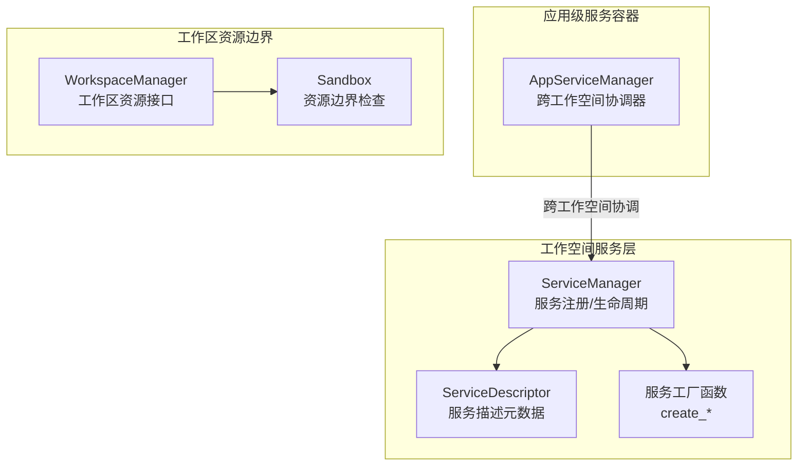
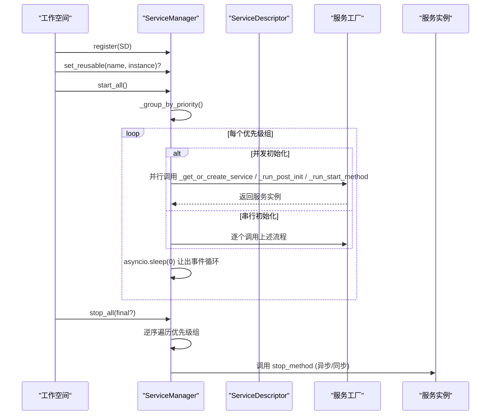
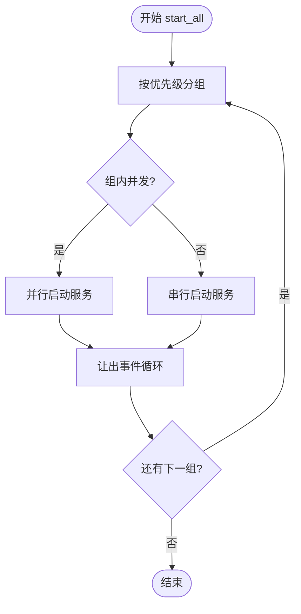
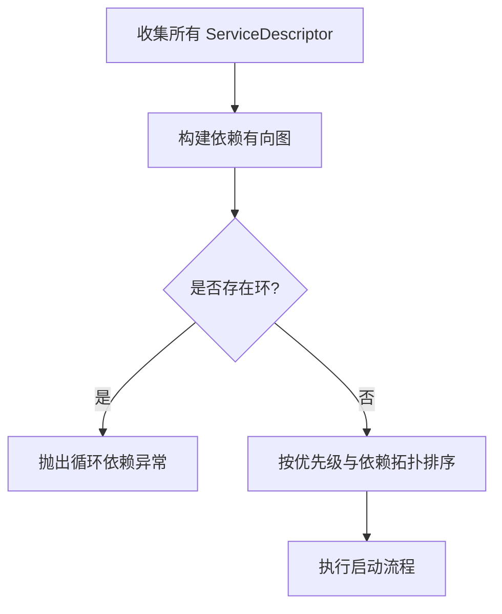

# 服务管理器

<cite>
**本文引用的文件**
- [service_manager.py](file://src/qwenpaw/app/workspace/service_manager.py)
- [service_factories.py](file://src/qwenpaw/app/workspace/service_factories.py)
- [__init__.py（workspace）](file://src/qwenpaw/app/workspace/__init__.py)
- [app_service_manager.py](file://src/qwenpaw/app/app_services/app_service_manager.py)
- [__init__.py（app_services）](file://src/qwenpaw/app/app_services/__init__.py)
- [sandbox.py](file://src/qwenpaw/services/workspace_manager/sandbox.py)
- [workspace_manager.py](file://src/qwenpaw/services/workspace_manager/workspace_manager.py)
</cite>

## 目录
1. [简介](#简介)
2. [项目结构](#项目结构)
3. [核心组件](#核心组件)
4. [架构总览](#架构总览)
5. [详细组件分析](#详细组件分析)
6. [依赖关系与循环依赖检测](#依赖关系与循环依赖检测)
7. [性能考虑](#性能考虑)
8. [故障排查指南](#故障排查指南)
9. [结论](#结论)
10. [附录：配置规范与最佳实践](#附录配置规范与最佳实践)

## 简介
本文件面向 QwenPaw 工作空间的服务管理器，聚焦 ServiceManager 类的架构设计与生命周期管理。内容涵盖服务的注册、发现、启动与销毁机制；服务工厂模式的应用（内置服务创建与自定义扩展）；服务间依赖管理与循环依赖检测策略；以及服务配置的 YAML 格式规范与最佳实践（优先级、错误处理、监控集成）。

## 项目结构
QwenPaw 在工作空间维度提供统一的服务管理能力，位于 app/workspace 子模块中。核心由以下文件组成：
- service_manager.py：定义 ServiceDescriptor 与 ServiceManager，负责服务声明、注册、生命周期编排与并发控制。
- service_factories.py：提供各内置服务的工厂函数，用于创建并初始化具体服务实例。
- __init__.py（workspace）：对外暴露 Workspace、WorkspacePlugins、ServiceManager、ServiceDescriptor。
- app_services/app_service_manager.py：跨工作空间的协调器容器，与工作空间内的 ServiceManager 职责分离。
- services/workspace_manager/*：工作区资源边界与沙箱接口（Sandbox、WorkspaceManager），与工具执行安全相关。

图表来源
- [service_manager.py:79-110](file://src/qwenpaw/app/workspace/service_manager.py#L79-L110)
- [service_factories.py:18-58](file://src/qwenpaw/app/workspace/service_factories.py#L18-L58)
- [app_service_manager.py:28-72](file://src/qwenpaw/app/app_services/app_service_manager.py#L28-L72)
- [sandbox.py:24-85](file://src/qwenpaw/services/workspace_manager/sandbox.py#L24-L85)
- [workspace_manager.py:24-60](file://src/qwenpaw/services/workspace_manager/workspace_manager.py#L24-L60)

章节来源
- [__init__.py（workspace）:1-21](file://src/qwenpaw/app/workspace/__init__.py#L1-L21)

## 核心组件
- ServiceDescriptor：声明式描述一个服务的名称、类型、构造参数、后初始化钩子、启动/停止方法名、是否可复用、依赖列表、优先级、并发初始化标志、可选性。
- ServiceManager：维护服务实例与描述符，提供注册、获取可复用服务、按优先级分组、并行/串行启动、有序停止、异常隔离等能力。
- 服务工厂函数：集中实现具体服务的创建与初始化逻辑，通过 post_init/start_method 与 ServiceManager 协作。
- AppServiceManager：跨工作空间的单一容器，持有 task_tracker、tool_coordinator、approval_coordinator，并在 FastAPI lifespan 中调用 start/stop。
- Sandbox/WorkspaceManager：工作区资源边界与沙箱接口，约束工具对路径与命令的访问，保障执行安全。

章节来源
- [service_manager.py:32-77](file://src/qwenpaw/app/workspace/service_manager.py#L32-L77)
- [service_manager.py:79-110](file://src/qwenpaw/app/workspace/service_manager.py#L79-L110)
- [service_factories.py:18-58](file://src/qwenpaw/app/workspace/service_factories.py#L18-L58)
- [app_service_manager.py:28-72](file://src/qwenpaw/app/app_services/app_service_manager.py#L28-L72)
- [sandbox.py:24-85](file://src/qwenpaw/services/workspace_manager/sandbox.py#L24-L85)
- [workspace_manager.py:24-60](file://src/qwenpaw/services/workspace_manager/workspace_manager.py#L24-L60)

## 架构总览
ServiceManager 作为工作空间内所有组件的统一入口，遵循“声明式 + 工厂”的模式：
- 声明式：通过 ServiceDescriptor 描述服务元数据与生命周期钩子。
- 工厂化：通过 create_* 函数完成复杂初始化与依赖注入。
- 生命周期：start_all 按优先级分组，组内支持并发或串行；stop_all 逆序关闭，保证依赖倒置释放。
- 可复用：支持在重载时保留某些服务实例，并通过 reload_func 进行热更新。
- 可选服务：optional=True 的服务启动失败不会中断工作空间，仅记录警告。

图表来源
- [service_manager.py:163-216](file://src/qwenpaw/app/workspace/service_manager.py#L163-L216)
- [service_manager.py:218-261](file://src/qwenpaw/app/workspace/service_manager.py#L218-L261)
- [service_manager.py:372-408](file://src/qwenpaw/app/workspace/service_manager.py#L372-L408)
- [service_factories.py:18-58](file://src/qwenpaw/app/workspace/service_factories.py#L18-L58)

## 详细组件分析

### ServiceDescriptor 与服务注册
- 字段说明
  - name：唯一标识
  - service_class：类或可调用的类解析函数
  - init_args：根据 Workspace 动态生成构造参数
  - post_init：创建后可选的后置初始化钩子（支持同步/异步）
  - start_method/stop_method：生命周期方法名
  - reusable：是否可在重载时复用
  - reload_func：复用时的热更新钩子（支持同步/异步）
  - dependencies：依赖的服务名列表
  - priority：启动优先级（数值越小越先启动，停止时逆序）
  - concurrent_init：是否允许与同优先级其他服务并发初始化
  - optional：可选服务，启动失败不中断工作空间
- 注册行为
  - 重复注册会覆盖并记录警告
  - 支持标记已存在实例为“可复用”，随后触发 reload_func

章节来源
- [service_manager.py:32-77](file://src/qwenpaw/app/workspace/service_manager.py#L32-L77)
- [service_manager.py:97-110](file://src/qwenpaw/app/workspace/service_manager.py#L97-L110)
- [service_manager.py:111-150](file://src/qwenpaw/app/workspace/service_manager.py#L111-L150)

### ServiceManager 生命周期与并发控制
- 启动流程
  - 按优先级分组，组内区分并发与串行
  - 并发服务使用 asyncio.gather 并行启动
  - 每完成一组或一个串行服务后让出事件循环，避免阻塞 HTTP 请求
- 实例创建
  - 支持 service_class 为类或返回类的可调用对象
  - init_args 通过闭包从 Workspace 动态注入
  - 同步构造函数通过线程池执行，避免阻塞事件循环
- 启动方法
  - 自动检测 start_method 是否为协程，分别 await 或线程池执行
- 停止流程
  - 逆序优先级停止，组内并发停止
  - 可复用服务在非 final 模式下跳过停止，以便转移到新实例
  - 停止异常被捕获并记录，不影响整体停止流程

图表来源
- [service_manager.py:163-216](file://src/qwenpaw/app/workspace/service_manager.py#L163-L216)
- [service_manager.py:218-261](file://src/qwenpaw/app/workspace/service_manager.py#L218-L261)
- [service_manager.py:372-408](file://src/qwenpaw/app/workspace/service_manager.py#L372-L408)

章节来源
- [service_manager.py:176-216](file://src/qwenpaw/app/workspace/service_manager.py#L176-L216)
- [service_manager.py:262-306](file://src/qwenpaw/app/workspace/service_manager.py#L262-L306)
- [service_manager.py:343-371](file://src/qwenpaw/app/workspace/service_manager.py#L343-L371)
- [service_manager.py:372-408](file://src/qwenpaw/app/workspace/service_manager.py#L372-L408)

### 服务工厂模式与内置服务
- 工厂函数职责
  - 封装复杂初始化逻辑（如驱动管理器、通道管理器、聊天管理器、配置监听器等）
  - 将创建的实例写入 ws._service_manager.services，供后续阶段使用
- 典型内置服务
  - driver_manager：外部能力运行时，注册 MCP 处理器，迁移旧配置，启动运行
  - driver_config_watcher：监听 DriverCard 手动编辑，自动刷新
  - chat_manager：聊天仓库与管理器，支持复用
  - channel_manager：通道管理器，基于配置初始化并设置语言
  - agent_config_watcher：当存在通道或定时任务时启用，统一触发重载

章节来源
- [service_factories.py:18-58](file://src/qwenpaw/app/workspace/service_factories.py#L18-L58)
- [service_factories.py:62-82](file://src/qwenpaw/app/workspace/service_factories.py#L62-L82)
- [service_factories.py:85-105](file://src/qwenpaw/app/workspace/service_factories.py#L85-L105)
- [service_factories.py:108-153](file://src/qwenpaw/app/workspace/service_factories.py#L108-L153)
- [service_factories.py:156-189](file://src/qwenpaw/app/workspace/service_factories.py#L156-L189)

### 自定义服务扩展方式
- 步骤
  - 定义 ServiceDescriptor，填写 name、service_class、init_args、post_init、start_method、stop_method、dependencies、priority、concurrent_init、optional 等
  - 编写服务工厂函数，完成实例创建与必要注册
  - 在 Workspace 初始化阶段调用 ServiceManager.register 注册描述符
  - 如需复用，通过 set_reusable 传入旧实例，并提供 reload_func 进行热更新
- 注意事项
  - 若服务依赖其他服务，请在 dependencies 中声明，并确保依赖服务具有更低优先级
  - 对于耗时构造或 I/O，建议将同步代码放入工厂函数并使用线程池（ServiceManager 已自动处理）
  - 可选服务建议设置 optional=True，避免影响工作空间整体可用性

章节来源
- [service_manager.py:32-77](file://src/qwenpaw/app/workspace/service_manager.py#L32-L77)
- [service_manager.py:111-150](file://src/qwenpaw/app/workspace/service_manager.py#L111-L150)
- [service_manager.py:262-306](file://src/qwenpaw/app/workspace/service_manager.py#L262-L306)

### 工作区资源边界与沙箱
- Sandbox：提供路径与工具白名单检查，违反边界抛出特定异常
- WorkspaceManager：工作区资源管理器接口，持有 working_dir 与 sandbox 实例，提供 start/stop 生命周期
- 与工具执行的协同：GuardedFunctionTool 在执行前调用沙箱检查，确保工具权限与安全

章节来源
- [sandbox.py:24-85](file://src/qwenpaw/services/workspace_manager/sandbox.py#L24-L85)
- [workspace_manager.py:24-60](file://src/qwenpaw/services/workspace_manager/workspace_manager.py#L24-L60)

## 依赖关系与循环依赖检测
- 当前实现
  - ServiceDescriptor 支持 dependencies 字段声明服务依赖
  - ServiceManager 未显式实现拓扑排序或循环依赖检测
  - 实际顺序由 priority 控制，依赖方应设置更高优先级数值（更晚启动）
- 风险与建议
  - 若出现循环依赖，可能导致服务无法按预期启动
  - 建议在 ServiceManager.start_all 中增加依赖图构建与环检测（例如 DFS 或 Kahn 算法），并在检测到环时抛出明确异常
  - 同时可将 dependencies 校验提前到 register 阶段，尽早发现问题

[此图为概念性流程图，不直接映射具体源码文件]

## 性能考虑
- 并发启动：同优先级且 concurrent_init=True 的服务并行启动，缩短总体启动时间
- 事件循环友好：每组启动后让出事件循环，避免阻塞 HTTP 请求
- 线程池卸载：同步构造与同步 start/stop 方法通过线程池执行，降低主循环阻塞风险
- 可复用服务：减少重建成本，配合 reload_func 实现热更新
- 日志与度量：记录服务启动耗时，便于定位慢服务

章节来源
- [service_manager.py:176-216](file://src/qwenpaw/app/workspace/service_manager.py#L176-L216)
- [service_manager.py:262-306](file://src/qwenpaw/app/workspace/service_manager.py#L262-L306)
- [service_manager.py:343-371](file://src/qwenpaw/app/workspace/service_manager.py#L343-L371)

## 故障排查指南
- 服务启动失败
  - 检查 descriptor.optional 是否为 True；否则失败会中断工作空间启动
  - 查看日志中的服务名与异常堆栈，确认依赖是否满足
- 服务未启动
  - 确认是否在 Workspace 初始化阶段调用了 register
  - 检查 priority 与 dependencies 是否正确
- 停止异常
  - stop_all 会捕获异常并继续，但会记录警告；需关注 stop_method 的实现
- 可复用服务未生效
  - 确认 set_reusable 在 start_all 之前调用
  - 检查 descriptor.reusable 与 reload_func 是否正确配置

章节来源
- [service_manager.py:218-261](file://src/qwenpaw/app/workspace/service_manager.py#L218-L261)
- [service_manager.py:372-408](file://src/qwenpaw/app/workspace/service_manager.py#L372-L408)
- [service_manager.py:409-463](file://src/qwenpaw/app/workspace/service_manager.py#L409-L463)

## 结论
ServiceManager 以声明式与服务工厂为核心，提供了灵活、可扩展的工作空间服务管理能力。通过优先级与并发控制，兼顾了启动性能与稳定性；通过可复用与可选服务，提升了系统韧性与运维体验。建议在未来版本中增强依赖图的循环检测与更细粒度的监控指标，进一步提升可观测性与健壮性。

## 附录：配置规范与最佳实践

### ServiceDescriptor 字段规范
- name：字符串，唯一标识
- service_class：类或返回类的可调用对象
- init_args：接收 Workspace 并返回字典的函数
- post_init：同步或异步函数，可返回新实例
- start_method/stop_method：字符串，方法名
- reusable：布尔值
- reload_func：同步或异步函数，用于热更新
- dependencies：字符串列表，依赖的服务名
- priority：整数，越小越先启动
- concurrent_init：布尔值，是否允许并发
- optional：布尔值，是否可选

章节来源
- [service_manager.py:32-77](file://src/qwenpaw/app/workspace/service_manager.py#L32-L77)

### 服务优先级与依赖管理
- 优先级的使用
  - 基础服务（如存储、配置）设置较低优先级
  - 上层服务（如通道、聊天）设置较高优先级
- 依赖声明
  - 在 dependencies 中列出前置服务
  - 确保依赖服务的 priority 数值更小（更早启动）
- 并发初始化
  - 无相互依赖的服务可设置 concurrent_init=True
  - 需要严格顺序的服务设置 concurrent_init=False

章节来源
- [service_manager.py:163-216](file://src/qwenpaw/app/workspace/service_manager.py#L163-L216)

### 错误处理与可选服务
- 可选服务
  - 对非关键功能设置 optional=True，避免影响主流程
- 异常隔离
  - 启动失败时记录警告并跳过该服务
  - 停止阶段异常被捕获，不影响整体停止

章节来源
- [service_manager.py:218-261](file://src/qwenpaw/app/workspace/service_manager.py#L218-L261)
- [service_manager.py:372-408](file://src/qwenpaw/app/workspace/service_manager.py#L372-L408)

### 监控集成方案
- 启动耗时
  - 记录每个服务启动耗时，超过阈值输出调试日志
- 状态上报
  - 在服务 post_init/start_method 中上报就绪状态
- 指标采集
  - 结合 TaskTracker 或外部监控系统，采集服务数量、启动时长、错误率等

章节来源
- [service_manager.py:218-261](file://src/qwenpaw/app/workspace/service_manager.py#L218-L261)
- [app_service_manager.py:28-72](file://src/qwenpaw/app/app_services/app_service_manager.py#L28-L72)

### 与沙箱和安全策略的协同
- 工具执行前检查
  - GuardedFunctionTool 在执行前调用沙箱检查，确保路径与工具白名单合规
- 资源边界
  - Sandbox.check_path/check_tool 用于限制访问范围
- 工作区资源管理
  - WorkspaceManager 持有 working_dir 与 sandbox，提供生命周期管理

章节来源
- [sandbox.py:24-85](file://src/qwenpaw/services/workspace_manager/sandbox.py#L24-L85)
- [workspace_manager.py:24-60](file://src/qwenpaw/services/workspace_manager/workspace_manager.py#L24-L60)