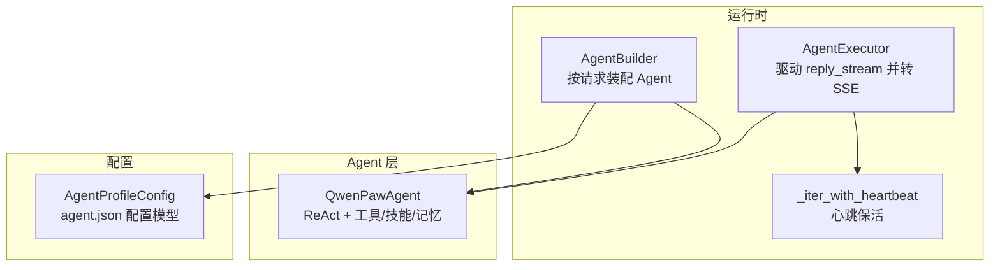
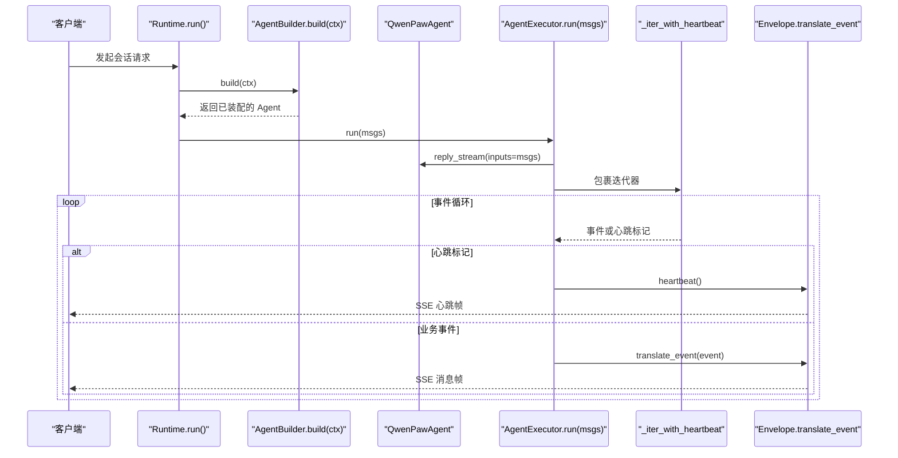
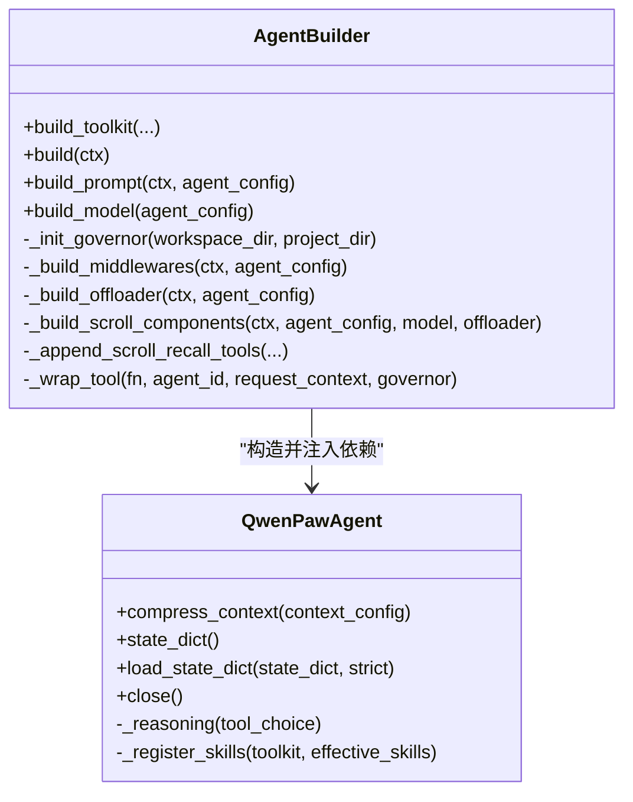
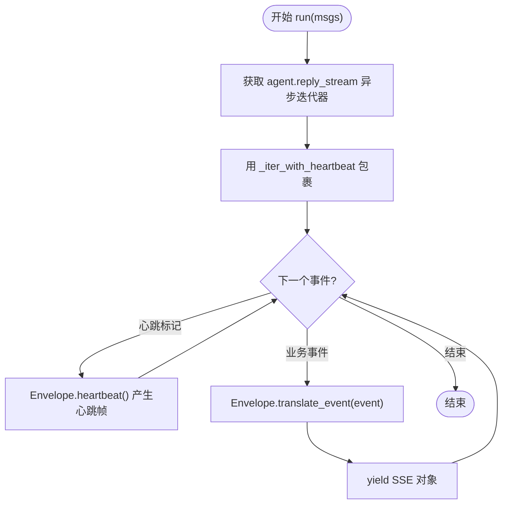
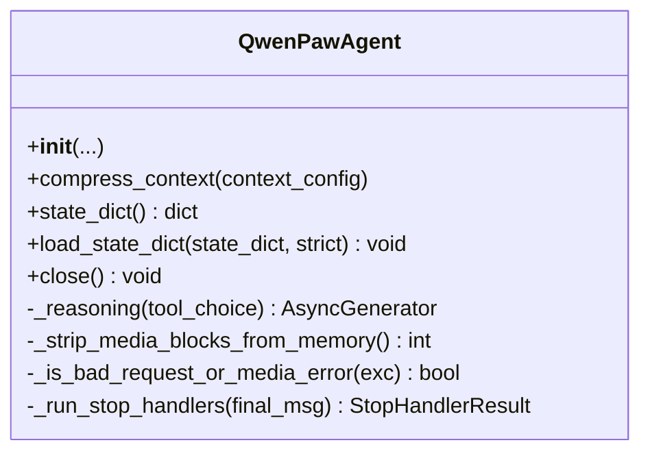
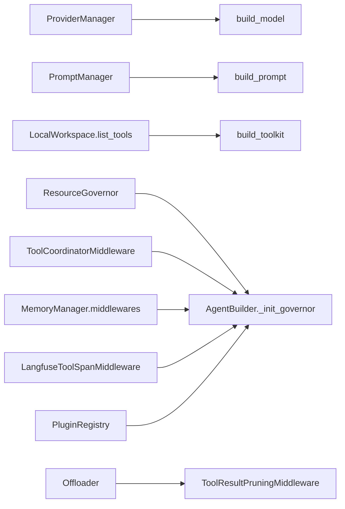

# Agent 构建与执行器

<cite>
**本文引用的文件列表**
- [src/qwenpaw/runtime/builder.py](file://src/qwenpaw/runtime/builder.py)
- [src/qwenpaw/runtime/executor.py](file://src/qwenpaw/runtime/executor.py)
- [src/qwenpaw/runtime/heartbeat.py](file://src/qwenpaw/runtime/heartbeat.py)
- [src/qwenpaw/agents/react_agent.py](file://src/qwenpaw/agents/react_agent.py)
- [src/qwenpaw/config/config.py](file://src/qwenpaw/config/config.py)
- [tests/integration/test_heartbeat.py](file://tests/integration/test_heartbeat.py)
- [tests/integration/test_multi_agent_config_isolation.py](file://tests/integration/test_multi_agent_config_isolation.py)
</cite>

## 目录
1. [简介](#简介)
2. [项目结构](#项目结构)
3. [核心组件](#核心组件)
4. [架构总览](#架构总览)
5. [详细组件分析](#详细组件分析)
6. [依赖关系分析](#依赖关系分析)
7. [性能考量](#性能考量)
8. [故障排查指南](#故障排查指南)
9. [结论](#结论)
10. [附录：扩展与集成示例](#附录扩展与集成示例)

## 简介
本技术文档聚焦于 QwenPaw 的 Agent 构建与执行子系统，围绕以下目标展开：
- 解析 AgentBuilder 的设计模式（依赖注入、配置解析、实例化流程）
- 说明 AgentExecutor 的异步执行机制（心跳包装、响应流处理、状态管理）
- 阐述 Agent 生命周期管理、资源清理与异常恢复策略
- 提供自定义 Agent 集成指南与执行性能优化建议
- 通过代码片段路径展示如何扩展构建逻辑与执行行为

## 项目结构
与 Agent 构建和执行相关的核心模块位于 runtime 与 agents 子系统中：
- runtime/builder.py：按请求组装 Agent 的构建器
- runtime/executor.py：驱动 Agent 的异步执行器
- runtime/heartbeat.py：SSE 心跳封装
- agents/react_agent.py：QwenPawAgent 主实现
- config/config.py：Agent 配置模型与工具函数
- tests/integration/*：心跳与多 Agent 隔离等集成测试用例

图表来源
- [src/qwenpaw/runtime/builder.py:125-330](file://src/qwenpaw/runtime/builder.py#L125-L330)
- [src/qwenpaw/runtime/executor.py:23-61](file://src/qwenpaw/runtime/executor.py#L23-L61)
- [src/qwenpaw/runtime/heartbeat.py:1-41](file://src/qwenpaw/runtime/heartbeat.py#L1-L41)
- [src/qwenpaw/agents/react_agent.py:47-133](file://src/qwenpaw/agents/react_agent.py#L47-L133)
- [src/qwenpaw/config/config.py:1383-1399](file://src/qwenpaw/config/config.py#L1383-L1399)

章节来源
- [src/qwenpaw/runtime/builder.py:125-330](file://src/qwenpaw/runtime/builder.py#L125-L330)
- [src/qwenpaw/runtime/executor.py:23-61](file://src/qwenpaw/runtime/executor.py#L23-L61)
- [src/qwenpaw/runtime/heartbeat.py:1-41](file://src/qwenpaw/runtime/heartbeat.py#L1-L41)
- [src/qwenpaw/agents/react_agent.py:47-133](file://src/qwenpaw/agents/react_agent.py#L47-L133)
- [src/qwenpaw/config/config.py:1383-1399](file://src/qwenpaw/config/config.py#L1383-L1399)

## 核心组件
- AgentBuilder：负责为每次请求完整装配一个 QwenPawAgent。它从工作区加载工具集、系统提示词、模型与中间件，并通过构造参数将全部依赖注入到 Agent，避免在 Agent 内部自行构建这些组件。
- QwenPawAgent：基于 ReAct 的 Agent 实现，集成工具、技能、记忆管理与上下文压缩策略；支持编码模式、媒体块自适应、停止钩子与工具调用增强。
- AgentExecutor：驱动 agent.reply_stream 的异步执行器，使用心跳包装保证长连接保活，并将事件转换为 SSE 信封对象输出。
- 心跳封装：以固定间隔检测空闲，发送心跳事件，防止因审批等待等长耗时操作导致连接断开。

章节来源
- [src/qwenpaw/runtime/builder.py:22-33](file://src/qwenpaw/runtime/builder.py#L22-L33)
- [src/qwenpaw/agents/react_agent.py:47-133](file://src/qwenpaw/agents/react_agent.py#L47-L133)
- [src/qwenpaw/runtime/executor.py:23-61](file://src/qwenpaw/runtime/executor.py#L23-L61)
- [src/qwenpaw/runtime/heartbeat.py:1-41](file://src/qwenpaw/runtime/heartbeat.py#L1-L41)

## 架构总览
下图展示了“请求到达 → 构建 Agent → 执行回复流 → 心跳保活 → SSE 输出”的整体流程。

图表来源
- [src/qwenpaw/runtime/builder.py:125-330](file://src/qwenpaw/runtime/builder.py#L125-L330)
- [src/qwenpaw/runtime/executor.py:36-61](file://src/qwenpaw/runtime/executor.py#L36-L61)
- [src/qwenpaw/runtime/heartbeat.py:11-41](file://src/qwenpaw/runtime/heartbeat.py#L11-L41)

## 详细组件分析

### AgentBuilder：依赖注入与装配流程
- 设计要点
  - 完全外部依赖注入：模型、提示词、工具包、中间件均由构建器准备后传入 Agent 构造函数。
  - 配置解析：从工作区加载 AgentProfileConfig，校验活跃模型可用性，合并请求级覆盖（如 Coding Mode 项目目录）。
  - 工具与技能：从本地工作区 list_tools 获取工具，附加编码模式工具、驱动工具、记忆工具，并按需注册 recall 工具。
  - 中间件链：按洋葱模型顺序组装（结果裁剪、工具协调、插件中间件、可观测性）。
  - 上下文策略：可选 scroll 上下文策略，结合 offloader 持久化对话与工具结果。
- 关键步骤
  - 加载 agent 配置与请求上下文，必要时启用 Coding Mode 项目目录。
  - 初始化治理层（ResourceGovernor），用于工具安全策略与沙箱能力探测。
  - 构建模型与格式化器，确保 token 计数与滚动上下文策略可用。
  - 构建 Toolkit，注册额外工具与记忆工具，注入 PolicyGuardedTool 守卫。
  - 生成系统提示词，组装中间件，设置 ReAct 最大迭代次数。
  - 创建 QwenPawAgent 实例，注册默认 ReAct gates，恢复会话状态。

图表来源
- [src/qwenpaw/runtime/builder.py:125-330](file://src/qwenpaw/runtime/builder.py#L125-L330)
- [src/qwenpaw/runtime/builder.py:872-971](file://src/qwenpaw/runtime/builder.py#L872-L971)
- [src/qwenpaw/agents/react_agent.py:47-133](file://src/qwenpaw/agents/react_agent.py#L47-L133)

章节来源
- [src/qwenpaw/runtime/builder.py:125-330](file://src/qwenpaw/runtime/builder.py#L125-L330)
- [src/qwenpaw/runtime/builder.py:872-971](file://src/qwenpaw/runtime/builder.py#L872-L971)
- [src/qwenpaw/agents/react_agent.py:47-133](file://src/qwenpaw/agents/react_agent.py#L47-L133)

### AgentExecutor：异步执行与心跳包装
- 职责
  - 驱动 agent.reply_stream 的异步迭代。
  - 使用 _iter_with_heartbeat 对事件流进行心跳包装，空闲时发送心跳事件。
  - 将每个事件委托给 Envelope.translate_event 转换为 SSE 对象并逐条产出。
- 状态管理
  - 不持有 Agent 实例，仅持有当前会话的执行上下文（由上层 HookContext 管理）。
  - 心跳周期由 HEARTBEAT_INTERVAL_SECONDS 控制，心跳事件通过 Envelope.heartbeat 生成。

图表来源
- [src/qwenpaw/runtime/executor.py:36-61](file://src/qwenpaw/runtime/executor.py#L36-L61)
- [src/qwenpaw/runtime/heartbeat.py:11-41](file://src/qwenpaw/runtime/heartbeat.py#L11-L41)

章节来源
- [src/qwenpaw/runtime/executor.py:23-61](file://src/qwenpaw/runtime/executor.py#L23-L61)
- [src/qwenpaw/runtime/heartbeat.py:1-41](file://src/qwenpaw/runtime/heartbeat.py#L1-L41)

### QwenPawAgent：生命周期、上下文与异常恢复
- 生命周期
  - 构造阶段：接收外部注入的模型、提示词、工具包、中间件、记忆管理器、offloader、上下文策略等。
  - 运行阶段：_reasoning 中处理工具调用、文本输出、停止钩子与自动继续逻辑。
  - 关闭阶段：close 中释放治理层、历史存储、过期工具结果清理。
- 上下文管理
  - compress_context 优先委托给 context_manager（如 scroll），否则回退到原生压缩。
  - state_dict/load_state_dict 支持 2.0 与 1.x 兼容迁移，并在加载后做孤儿 tool_result 清理。
- 异常恢复
  - _reasoning 捕获媒体相关错误，记录模型能力缓存并尝试剥离媒体块重试。
  - 内容安全拒绝与请求大小错误不被误判为媒体问题，避免污染能力缓存。

图表来源
- [src/qwenpaw/agents/react_agent.py:47-133](file://src/qwenpaw/agents/react_agent.py#L47-L133)
- [src/qwenpaw/agents/react_agent.py:145-184](file://src/qwenpaw/agents/react_agent.py#L145-L184)
- [src/qwenpaw/agents/react_agent.py:206-267](file://src/qwenpaw/agents/react_agent.py#L206-L267)
- [src/qwenpaw/agents/react_agent.py:288-334](file://src/qwenpaw/agents/react_agent.py#L288-L334)
- [src/qwenpaw/agents/react_agent.py:411-512](file://src/qwenpaw/agents/react_agent.py#L411-L512)
- [src/qwenpaw/agents/react_agent.py:569-612](file://src/qwenpaw/agents/react_agent.py#L569-L612)

章节来源
- [src/qwenpaw/agents/react_agent.py:47-133](file://src/qwenpaw/agents/react_agent.py#L47-L133)
- [src/qwenpaw/agents/react_agent.py:145-184](file://src/qwenpaw/agents/react_agent.py#L145-L184)
- [src/qwenpaw/agents/react_agent.py:206-267](file://src/qwenpaw/agents/react_agent.py#L206-L267)
- [src/qwenpaw/agents/react_agent.py:288-334](file://src/qwenpaw/agents/react_agent.py#L288-L334)
- [src/qwenpaw/agents/react_agent.py:411-512](file://src/qwenpaw/agents/react_agent.py#L411-L512)
- [src/qwenpaw/agents/react_agent.py:569-612](file://src/qwenpaw/agents/react_agent.py#L569-L612)

### 配置解析与生效范围
- AgentProfileConfig 描述单个 Agent 的配置项（id、name、description、workspace_dir、模板 id 等）。
- 构建器在 build 过程中加载 agent.json，校验活跃模型，合并请求级覆盖（例如 ACP 提供的 Coding Mode 项目目录）。
- 心跳配置支持全局与 Agent 作用域隔离，修改某 Agent 的心跳配置不影响全局配置。

章节来源
- [src/qwenpaw/config/config.py:1383-1399](file://src/qwenpaw/config/config.py#L1383-L1399)
- [src/qwenpaw/runtime/builder.py:147-164](file://src/qwenpaw/runtime/builder.py#L147-L164)
- [tests/integration/test_multi_agent_config_isolation.py:134-191](file://tests/integration/test_multi_agent_config_isolation.py#L134-L191)

## 依赖关系分析
- 构建期依赖
  - ProviderManager：获取活跃模型。
  - PromptManager：构建系统提示词。
  - LocalWorkspace.list_tools：按工作区与技能动态装配工具。
  - ResourceGovernor：启动治理层，提供工具安全与沙箱能力。
  - Offloader：持久化对话与工具结果，配合 ToolResultPruningMiddleware。
- 运行期依赖
  - ToolCoordinatorMiddleware：工具调用生命周期与后台结果处理。
  - MemoryManager.middlewares：记忆中间件。
  - LangfuseToolSpanMiddleware：可观测性（条件启用）。
  - PluginRegistry：插件注册的中间件与命令。

图表来源
- [src/qwenpaw/runtime/builder.py:376-393](file://src/qwenpaw/runtime/builder.py#L376-L393)
- [src/qwenpaw/runtime/builder.py:332-374](file://src/qwenpaw/runtime/builder.py#L332-L374)
- [src/qwenpaw/runtime/builder.py:36-94](file://src/qwenpaw/runtime/builder.py#L36-L94)
- [src/qwenpaw/runtime/builder.py:395-426](file://src/qwenpaw/runtime/builder.py#L395-L426)
- [src/qwenpaw/runtime/builder.py:810-870](file://src/qwenpaw/runtime/builder.py#L810-L870)
- [src/qwenpaw/runtime/builder.py:872-971](file://src/qwenpaw/runtime/builder.py#L872-L971)

章节来源
- [src/qwenpaw/runtime/builder.py:36-94](file://src/qwenpaw/runtime/builder.py#L36-L94)
- [src/qwenpaw/runtime/builder.py:332-374](file://src/qwenpaw/runtime/builder.py#L332-L374)
- [src/qwenpaw/runtime/builder.py:376-393](file://src/qwenpaw/runtime/builder.py#L376-L393)
- [src/qwenpaw/runtime/builder.py:395-426](file://src/qwenpaw/runtime/builder.py#L395-L426)
- [src/qwenpaw/runtime/builder.py:810-870](file://src/qwenpaw/runtime/builder.py#L810-L870)
- [src/qwenpaw/runtime/builder.py:872-971](file://src/qwenpaw/runtime/builder.py#L872-L971)

## 性能考量
- 模型与格式化器
  - 在构建 Toolkit 之前先构建模型与 formatter，以便滚动上下文策略能接入 token 计数。
- 中间件顺序
  - 结果裁剪在最外层，减少后续中间件处理的负载；工具协调居中；插件中间件按优先级排序。
- 上下文策略
  - 当选择 scroll 策略时，结合 offloader 持久化对话与工具结果，降低内存占用；同时保留结构化 recall_history 工具在无沙箱环境下的可用性。
- 心跳间隔
  - 默认 25 秒，适合长连接场景，避免审批等待导致的连接超时。

章节来源
- [src/qwenpaw/runtime/builder.py:221-235](file://src/qwenpaw/runtime/builder.py#L221-L235)
- [src/qwenpaw/runtime/builder.py:872-971](file://src/qwenpaw/runtime/builder.py#L872-L971)
- [src/qwenpaw/runtime/heartbeat.py:7](file://src/qwenpaw/runtime/heartbeat.py#L7)

## 故障排查指南
- 心跳配置隔离验证
  - 通过 API 读取全局心跳基线，创建 Agent 后修改其作用域心跳配置，再次读取全局心跳确认未受影响。
- 并发读写健壮性
  - 并发 GET/PUT 心跳配置不应出现 5xx，最终 GET 仍应成功且配置有效。
- 常见错误定位
  - 若 Agent 构建时报“无活跃模型”，检查 ProviderManager 的活跃模型是否配置。
  - 若工具调用被 fail-closed，检查 ResourceGovernor 是否成功启动以及平台沙箱可用性。

章节来源
- [tests/integration/test_heartbeat.py:78-194](file://tests/integration/test_heartbeat.py#L78-L194)
- [tests/integration/test_multi_agent_config_isolation.py:134-191](file://tests/integration/test_multi_agent_config_isolation.py#L134-L191)
- [src/qwenpaw/runtime/builder.py:157-164](file://src/qwenpaw/runtime/builder.py#L157-L164)
- [src/qwenpaw/runtime/builder.py:395-426](file://src/qwenpaw/runtime/builder.py#L395-L426)

## 结论
- AgentBuilder 采用严格的依赖注入与分层装配，确保 Agent 的可测试性与可扩展性。
- AgentExecutor 通过心跳包装保障长连接稳定性，并以事件驱动方式输出 SSE。
- QwenPawAgent 具备完善的上下文管理、异常恢复与生命周期清理能力，适配复杂生产环境。
- 配置体系支持全局与作用域隔离，便于多 Agent 部署与精细化控制。

## 附录：扩展与集成示例
- 扩展构建逻辑
  - 在 AgentBuilder.build 中追加自定义工具或中间件，参考：
    - [src/qwenpaw/runtime/builder.py:201-227](file://src/qwenpaw/runtime/builder.py#L201-L227)
    - [src/qwenpaw/runtime/builder.py:872-971](file://src/qwenpaw/runtime/builder.py#L872-L971)
- 扩展执行行为
  - 在 QwenPawAgent._reasoning 前后注入自定义逻辑（如统计、审计），参考：
    - [src/qwenpaw/agents/react_agent.py:411-512](file://src/qwenpaw/agents/react_agent.py#L411-L512)
- 自定义中间件
  - 通过 PluginRegistry.register_middleware 注册中间件工厂，参考：
    - [src/qwenpaw/runtime/builder.py:955-971](file://src/qwenpaw/runtime/builder.py#L955-L971)
- 自定义提示词贡献者
  - 通过 PromptManager 或插件注册 prompt section，参考：
    - [src/qwenpaw/runtime/builder.py:332-374](file://src/qwenpaw/runtime/builder.py#L332-L374)
- 自定义心跳策略
  - 调整 HEARTBEAT_INTERVAL_SECONDS 或在上层替换心跳包装逻辑，参考：
    - [src/qwenpaw/runtime/heartbeat.py:7](file://src/qwenpaw/runtime/heartbeat.py#L7)
    - [src/qwenpaw/runtime/executor.py:36-61](file://src/qwenpaw/runtime/executor.py#L36-L61)