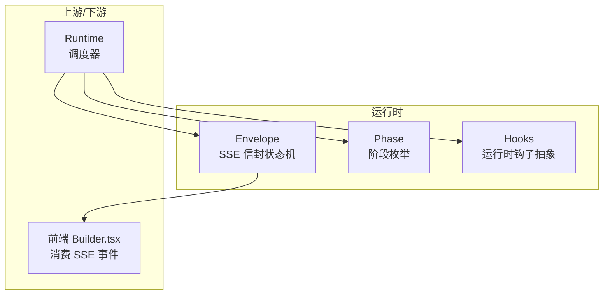
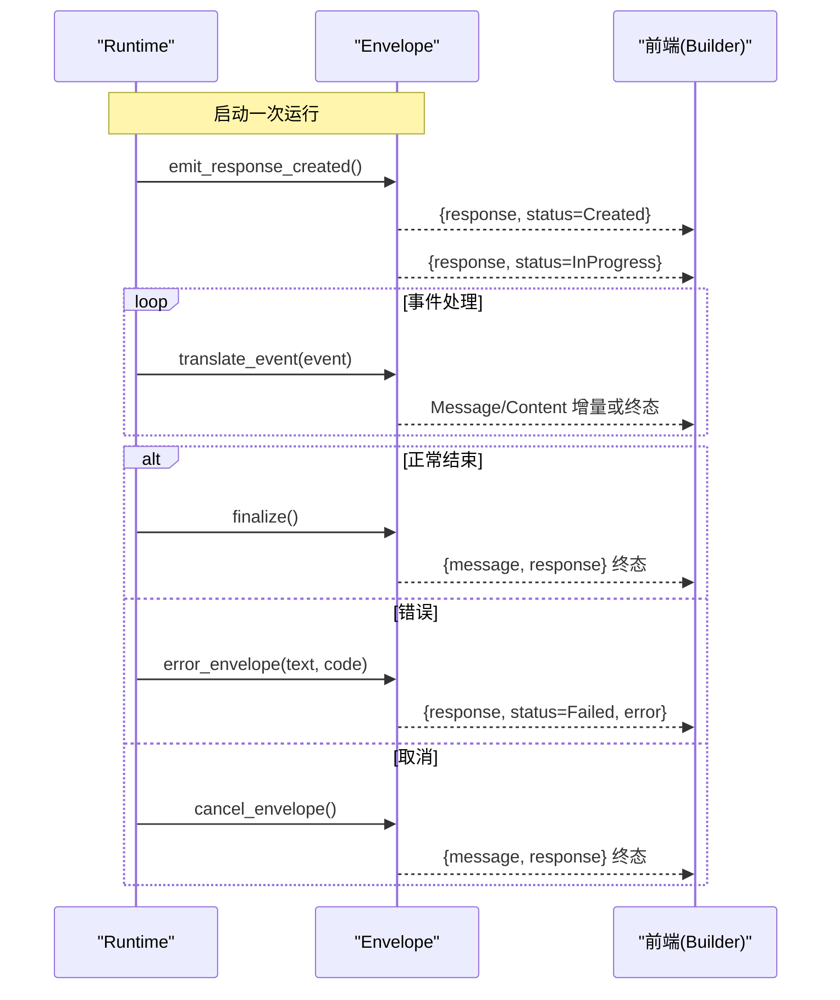
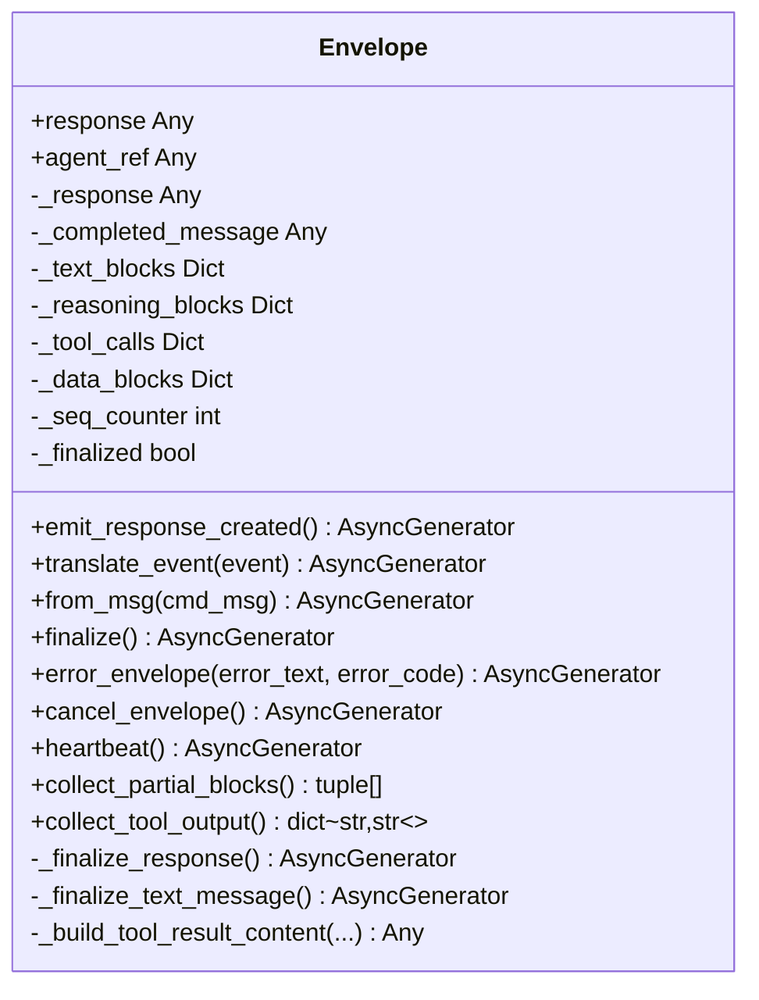
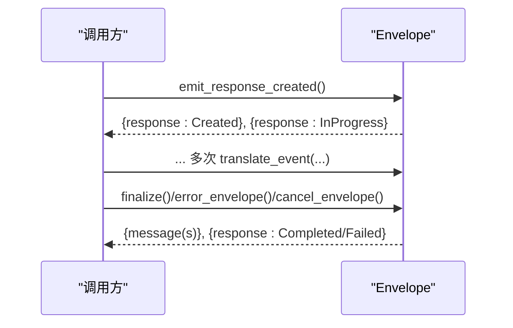
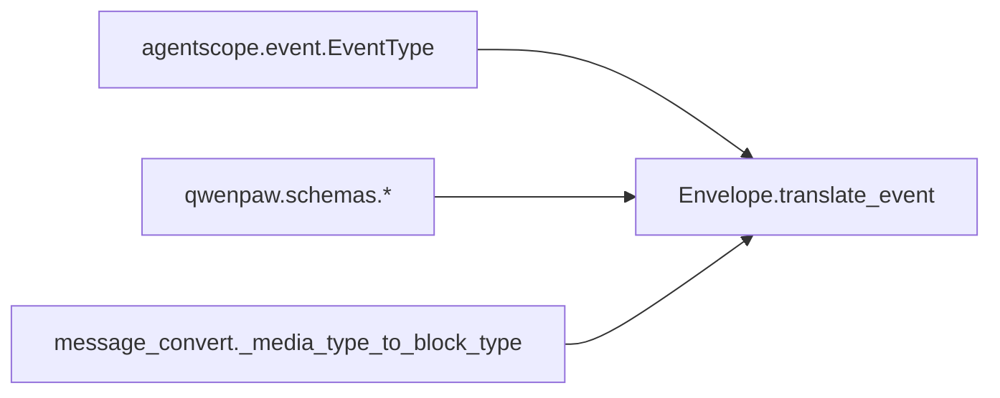

# 信封状态机

<cite>
**本文引用的文件**   
- [src/qwenpaw/runtime/envelope.py](file://src/qwenpaw/runtime/envelope.py)
- [src/qwenpaw/runtime/phases.py](file://src/qwenpaw/runtime/phases.py)
- [src/qwenpaw/runtime/hooks.py](file://src/qwenpaw/runtime/hooks.py)
</cite>

## 目录
1. [简介](#简介)
2. [项目结构](#项目结构)
3. [核心组件](#核心组件)
4. [架构总览](#架构总览)
5. [详细组件分析](#详细组件分析)
6. [依赖分析](#依赖分析)
7. [性能考虑](#性能考虑)
8. [故障排查指南](#故障排查指南)
9. [结论](#结论)
10. [附录](#附录)

## 简介
本文件围绕运行时“信封状态机”（Envelope）进行深入技术文档化，聚焦以下目标：
- 解释 Envelope 类的设计模式与 SSE 事件生成机制
- 给出状态转换图、事件序列与消息格式规范
- 记录关键方法 from_msg、emit_response_created、finalize、error_envelope、cancel_envelope 的实现逻辑与使用场景
- 说明部分响应收集、工具调用跟踪与流式数据传输机制
- 提供扩展开发指南与自定义事件类型的实现示例
- 给出性能优化建议与内存管理最佳实践

## 项目结构
Envelope 位于运行时子系统，负责将底层 agentscope 的 EventType 事件转换为前端期望的 SSE 信封协议对象。其职责包括：
- 维护单次运行（一次 Runtime.run()）的响应上下文与消息片段
- 按事件驱动组装文本块、思考块、工具调用与结果、数据块等
- 在正常结束、错误、取消等路径下完成收尾并输出最终响应

图表来源
- [src/qwenpaw/runtime/envelope.py:27-862](file://src/qwenpaw/runtime/envelope.py#L27-L862)
- [src/qwenpaw/runtime/phases.py:28-41](file://src/qwenpaw/runtime/phases.py#L28-L41)
- [src/qwenpaw/runtime/hooks.py:1-43](file://src/qwenpaw/runtime/hooks.py#L1-L43)

章节来源
- [src/qwenpaw/runtime/envelope.py:1-25](file://src/qwenpaw/runtime/envelope.py#L1-L25)
- [src/qwenpaw/runtime/phases.py:1-41](file://src/qwenpaw/runtime/phases.py#L1-L41)
- [src/qwenpaw/runtime/hooks.py:1-43](file://src/qwenpaw/runtime/hooks.py#L1-L43)

## 核心组件
- Envelope：单例对应一次运行，内部维护响应对象、当前消息、各类块缓冲与序列号，通过异步生成器产出前端可消费的序列化对象。
- Phase：定义请求生命周期中的八个固定阶段点，用于编排钩子执行顺序。
- Hooks：运行时编排层钩子抽象，支持短路、跳过代理等语义，与 Agent 中间件正交。

章节来源
- [src/qwenpaw/runtime/envelope.py:27-862](file://src/qwenpaw/runtime/envelope.py#L27-L862)
- [src/qwenpaw/runtime/phases.py:28-41](file://src/qwenpaw/runtime/phases.py#L28-L41)
- [src/qwenpaw/runtime/hooks.py:1-43](file://src/qwenpaw/runtime/hooks.py#L1-L43)

## 架构总览
Envelope 作为事件翻译器，接收 agentscope 的事件流，将其映射为前端协议对象，并在不同生命周期节点（创建、进行中、完成、失败）发出相应状态更新。

图表来源
- [src/qwenpaw/runtime/envelope.py:92-98](file://src/qwenpaw/runtime/envelope.py#L92-L98)
- [src/qwenpaw/runtime/envelope.py:138-640](file://src/qwenpaw/runtime/envelope.py#L138-L640)
- [src/qwenpaw/runtime/envelope.py:755-800](file://src/qwenpaw/runtime/envelope.py#L755-L800)
- [src/qwenpaw/runtime/envelope.py:737-749](file://src/qwenpaw/runtime/envelope.py#L737-L749)

## 详细组件分析

### Envelope 类设计模式与状态机
- 设计模式
  - 事件驱动的状态机：以 EventType 为输入，内部维护多类块状态字典，按 START/DATA/END 三阶段拼装内容。
  - 生成器模式：所有对外接口均为异步生成器，按需产出对象，降低峰值内存占用。
  - 组合与聚合：将多个内容块（文本、思考、工具调用、媒体数据）聚合到 Response.output 中。
- 状态与数据结构
  - _response：AgentResponse，包含 output、status、usage、completed_at 等
  - _completed_message：当前正在累积的 Message
  - _text_blocks/_reasoning_blocks/_tool_calls/_data_blocks：分块缓冲字典
  - _seq_counter：全局递增序列号，便于前端排序
- 关键行为
  - 首次文本/数据块出现时，若尚未开始消息，则先发送当前消息占位，再标记消息已开始
  - 工具调用开始时，若当前文本消息已有内容，则先行完成该消息并重置文本块缓冲
  - 模型调用结束时，回填 usage 到 response 和当前 message
  - 达到最大迭代次数时，构造一条警告消息并入队
  - 未知事件（如 HINT_BLOCK）安全降级为日志告警，不中断流程

图表来源
- [src/qwenpaw/runtime/envelope.py:27-862](file://src/qwenpaw/runtime/envelope.py#L27-L862)

章节来源
- [src/qwenpaw/runtime/envelope.py:36-74](file://src/qwenpaw/runtime/envelope.py#L36-L74)
- [src/qwenpaw/runtime/envelope.py:80-86](file://src/qwenpaw/runtime/envelope.py#L80-L86)
- [src/qwenpaw/runtime/envelope.py:104-130](file://src/qwenpaw/runtime/envelope.py#L104-L130)
- [src/qwenpaw/runtime/envelope.py:138-640](file://src/qwenpaw/runtime/envelope.py#L138-L640)
- [src/qwenpaw/runtime/envelope.py:645-684](file://src/qwenpaw/runtime/envelope.py#L645-L684)
- [src/qwenpaw/runtime/envelope.py:690-691](file://src/qwenpaw/runtime/envelope.py#L690-L691)
- [src/qwenpaw/runtime/envelope.py:806-858](file://src/qwenpaw/runtime/envelope.py#L806-L858)

### 事件类型与处理流程（文本/思考/工具/数据）
- 文本块（TEXT_BLOCK_START/DATA/END）
  - 首条 delta 前可能补发当前消息占位
  - 增量以 TextContent(delta=True) 推送，结束以完整文本推送并加入 message.content
- 思考块（THINKING_BLOCK_*）
  - 独立 REASONING 消息，逐段增量推送，结束后追加至 response.output
- 工具调用（TOOL_CALL_*）
  - 开始：若当前文本消息有内容，先完成该消息；随后创建 PLUGIN_CALL 消息与 DataContent(FunctionCall)
  - 增量：拼接 arguments JSON 字符串，持续推送 in_progress 的 DataContent
  - 结束：写入最终 FunctionCall，追加至 message 与 response.output
- 工具结果（TOOL_RESULT_*）
  - 开始：创建 PLUGIN_CALL_OUTPUT 消息与空输出 DataContent
  - 文本增量：累积 text_acc，构建 DataContent(FunctionCallOutput)
  - 数据增量：根据 media_type 与 block_id 合并 base64 或 url 源，构建输出块
  - 结束：合并 text 与 data blocks，设置 state，追加至 message 与 response.output
- 数据块（DATA_BLOCK_*）
  - 仅 END 时一次性推送完整 base64 数据，避免前端渲染不完整
- 模型调用结束（MODEL_CALL_END）
  - 回填 input_tokens/output_tokens 到 response 与当前 message
- 超过最大迭代（EXCEED_MAX_ITERS）
  - 构造警告消息并入队
- 提示块（HINT_BLOCK）
  - 兼容缺失版本，仅记录告警日志

```mermaid
flowchart TD
Start(["进入 translate_event"]) --> CheckType{"事件类型?"}
CheckType --> |TEXT_BLOCK_START| TextStart["初始化文本块<br/>必要时先发当前消息"]
CheckType --> |TEXT_BLOCK_DELTA| TextDelta["累积文本<br/>推送增量 TextContent"]
CheckType --> |TEXT_BLOCK_END| TextEnd["推送完整文本<br/>加入 message.content"]
CheckType --> |THINKING_BLOCK_START| ThinkStart["新建 REASONING 消息"]
CheckType --> |THINKING_BLOCK_DELTA| ThinkDelta["累积思考文本<br/>推送增量"]
CheckType --> |THINKING_BLOCK_END| ThinkEnd["完成思考消息并入队"]
CheckType --> |TOOL_CALL_START| ToolCallStart["必要时完成当前文本消息<br/>创建 PLUGIN_CALL 消息"]
CheckType --> |TOOL_CALL_DELTA| ToolCallDelta["拼接参数JSON<br/>推送增量"]
CheckType --> |TOOL_CALL_END| ToolCallEnd["写入最终FunctionCall并入队"]
CheckType --> |TOOL_RESULT_START| ToolResStart["创建 PLUGIN_CALL_OUTPUT 消息"]
CheckType --> |TOOL_RESULT_TEXT_DELTA| ToolResText["累积文本输出<br/>推送增量"]
CheckType --> |TOOL_RESULT_DATA_DELTA| ToolResData["合并数据块源<br/>推送增量"]
CheckType --> |TOOL_RESULT_END| ToolResEnd["合并输出并设置state并入队"]
CheckType --> |DATA_BLOCK_START| DataStart["初始化数据块缓冲"]
CheckType --> |DATA_BLOCK_DELTA| DataDelta["累积base64<br/>暂不推送"]
CheckType --> |DATA_BLOCK_END| DataEnd["按media_type构造媒体内容并入队"]
CheckType --> |MODEL_CALL_END| Usage["回填usage到response/message"]
CheckType --> |EXCEED_MAX_ITERS| Warn["构造警告消息并入队"]
CheckType --> |HINT_BLOCK| Hint["记录告警日志"]
TextStart --> Next
TextDelta --> Next
TextEnd --> Next
ThinkStart --> Next
ThinkDelta --> Next
ThinkEnd --> Next
ToolCallStart --> Next
ToolCallDelta --> Next
ToolCallEnd --> Next
ToolResStart --> Next
ToolResText --> Next
ToolResData --> Next
ToolResEnd --> Next
DataStart --> Next
DataDelta --> Next
DataEnd --> Next
Usage --> Next
Warn --> Next
Hint --> Next
Next(["返回"])
```

图表来源
- [src/qwenpaw/runtime/envelope.py:165-640](file://src/qwenpaw/runtime/envelope.py#L165-L640)

章节来源
- [src/qwenpaw/runtime/envelope.py:165-215](file://src/qwenpaw/runtime/envelope.py#L165-L215)
- [src/qwenpaw/runtime/envelope.py:216-291](file://src/qwenpaw/runtime/envelope.py#L216-L291)
- [src/qwenpaw/runtime/envelope.py:293-374](file://src/qwenpaw/runtime/envelope.py#L293-L374)
- [src/qwenpaw/runtime/envelope.py:375-516](file://src/qwenpaw/runtime/envelope.py#L375-L516)
- [src/qwenpaw/runtime/envelope.py:517-581](file://src/qwenpaw/runtime/envelope.py#L517-L581)
- [src/qwenpaw/runtime/envelope.py:582-640](file://src/qwenpaw/runtime/envelope.py#L582-L640)

### 生命周期方法与使用场景
- emit_response_created
  - 用途：在运行开始时快速告知前端已创建并开始处理
  - 行为：依次发送 Created 与 InProgress 状态的 response
- from_msg
  - 用途：斜杠命令等短路径直接返回已完成 Msg 的快速通道
  - 行为：构造文本内容，完成当前消息，设置 response 为 Completed，并标记 finalized
- finalize
  - 用途：正常结束时的统一收尾
  - 行为：回填未结束的文本块，完成当前消息，设置 response 为 Completed，写入 completed_at
- error_envelope
  - 用途：异常路径收尾
  - 行为：记录错误码与消息，设置 response 为 Failed，写入 error 字段
- cancel_envelope
  - 用途：用户取消或超时等中断路径
  - 行为：同 finalize，但不带错误信息
- heartbeat
  - 用途：心跳保活，周期性发送当前 response 快照

图表来源
- [src/qwenpaw/runtime/envelope.py:92-98](file://src/qwenpaw/runtime/envelope.py#L92-L98)
- [src/qwenpaw/runtime/envelope.py:697-731](file://src/qwenpaw/runtime/envelope.py#L697-L731)
- [src/qwenpaw/runtime/envelope.py:755-800](file://src/qwenpaw/runtime/envelope.py#L755-L800)
- [src/qwenpaw/runtime/envelope.py:737-749](file://src/qwenpaw/runtime/envelope.py#L737-L749)
- [src/qwenpaw/runtime/envelope.py:690-691](file://src/qwenpaw/runtime/envelope.py#L690-L691)

章节来源
- [src/qwenpaw/runtime/envelope.py:92-98](file://src/qwenpaw/runtime/envelope.py#L92-L98)
- [src/qwenpaw/runtime/envelope.py:697-731](file://src/qwenpaw/runtime/envelope.py#L697-L731)
- [src/qwenpaw/runtime/envelope.py:755-800](file://src/qwenpaw/runtime/envelope.py#L755-L800)
- [src/qwenpaw/runtime/envelope.py:737-749](file://src/qwenpaw/runtime/envelope.py#L737-L749)
- [src/qwenpaw/runtime/envelope.py:690-691](file://src/qwenpaw/runtime/envelope.py#L690-L691)

### 部分响应收集与取消保存
- collect_partial_blocks
  - 返回未完成的 thinking 与 text 文本片段，供取消后持久化
- collect_tool_output
  - 返回被中断的工具调用的部分输出文本，便于恢复或重试

章节来源
- [src/qwenpaw/runtime/envelope.py:806-849](file://src/qwenpaw/runtime/envelope.py#L806-L849)

### 运行时阶段与钩子集成
- Phase 定义了 PRE_DISPATCH、POST_DISPATCH、PRE_AGENT_BUILD、POST_AGENT_BUILD、PRE_EXECUTE、POST_RESPONSE、ON_ERROR、FINALLY 八个阶段点
- Hooks 提供 CONTINUE、SHORT_CIRCUIT、SKIP_AGENT 三种动作语义，用于在特定阶段短路或跳过代理执行
- Envelope 的 finalize/error/cancel 通常由 ON_ERROR/FINALLY 等阶段触发，确保幂等清理与一致收尾

章节来源
- [src/qwenpaw/runtime/phases.py:28-41](file://src/qwenpaw/runtime/phases.py#L28-L41)
- [src/qwenpaw/runtime/hooks.py:1-43](file://src/qwenpaw/runtime/hooks.py#L1-L43)

## 依赖分析
- 外部依赖
  - agentscope.event.EventType：事件类型常量，用于分支判断
  - qwenpaw.schemas.*：AgentResponse、Message、ContentType、DataContent、FunctionCall、FunctionCallOutput、Image/Audio/VideoContent 等
  - qwenpaw.runtime.message_convert._media_type_to_block_type：媒体类型到块类型的映射
- 耦合关系
  - Envelope 对 schemas 的强依赖体现在大量对象的构造与属性赋值
  - 对 message_convert 的弱依赖仅在 DATA_BLOCK 分支中使用
- 潜在循环依赖
  - 通过延迟 import（在方法内导入）避免模块级循环依赖

图表来源
- [src/qwenpaw/runtime/envelope.py:145-159](file://src/qwenpaw/runtime/envelope.py#L145-L159)
- [src/qwenpaw/runtime/envelope.py:18](file://src/qwenpaw/runtime/envelope.py#L18)

章节来源
- [src/qwenpaw/runtime/envelope.py:145-159](file://src/qwenpaw/runtime/envelope.py#L145-L159)
- [src/qwenpaw/runtime/envelope.py:18](file://src/qwenpaw/runtime/envelope.py#L18)

## 性能考虑
- 增量推送策略
  - 文本与思考块采用 delta 增量推送，减少前端渲染压力
  - 数据块（图片/视频/音频）仅在 END 时推送完整 base64，避免无效解码
- 内存管理
  - 工具调用参数与输出采用字符串累加，注意大参数/大数据量场景下的内存增长
  - 建议在长时间运行或高吞吐场景中对超长文本进行分段或限长策略
- 序列号与去重
  - 使用自增 sequence_number 保证顺序性，避免前端重复渲染
- 并发与异步
  - 全部对外接口为异步生成器，适合与上层协程流水线配合，避免阻塞

[本节为通用指导，无需源码引用]

## 故障排查指南
- 常见现象
  - 前端无响应：检查是否调用 emit_response_created 且收到 Created/InProgress
  - 文本闪烁或缺失：确认 TEXT_BLOCK_END 是否到达；若取消，finalize 会回填未结束文本
  - 工具调用参数为空：检查 TOOL_CALL_DELTA 是否正确拼接 arguments
  - 工具结果不完整：确认 TOOL_RESULT_DATA_DELTA 的 block_id 与 media_type 一致性
- 定位手段
  - 启用日志：关注 HINT_BLOCK 告警与可能的 AttributeError 保护路径
  - 打印 sequence_number：验证事件顺序是否符合预期
  - 使用 collect_partial_blocks/collect_tool_output：在取消路径提取未完成内容

章节来源
- [src/qwenpaw/runtime/envelope.py:626-640](file://src/qwenpaw/runtime/envelope.py#L626-L640)
- [src/qwenpaw/runtime/envelope.py:761-800](file://src/qwenpaw/runtime/envelope.py#L761-L800)
- [src/qwenpaw/runtime/envelope.py:806-849](file://src/qwenpaw/runtime/envelope.py#L806-L849)

## 结论
Envelope 以事件驱动的方式实现了稳定、可扩展的 SSE 信封状态机，覆盖文本、思考、工具调用与多媒体数据的流式传输，并提供完善的收尾与错误处理机制。结合 Phase/Hooks 的编排能力，可在运行时灵活控制执行路径，满足复杂业务需求。

[本节为总结，无需源码引用]

## 附录

### 消息格式规范（摘要）
- AgentResponse
  - object: "response"
  - id: "response_<uuid>"
  - created_at: ISO 时间戳
  - session_id: 会话标识
  - status: Created/InProgress/Completed/Failed
  - output: Message[]
  - usage: {input_tokens, output_tokens}
  - error: {code, message}（失败时）
- Message
  - object: "message"
  - type: MESSAGE/REASONING/PLUGIN_CALL/PLUGIN_CALL_OUTPUT
  - role: ASSISTANT/TOOL
  - content: Content[]
  - status: InProgress/Completed
  - metadata: 可选元数据
- Content
  - TextContent: type=TEXT, text, delta, index, msg_id
  - DataContent: type=DATA, data(FunctionCall/FunctionCallOutput), index, msg_id
  - Image/Audio/VideoContent: 对应媒体字段与索引

章节来源
- [src/qwenpaw/runtime/envelope.py:36-74](file://src/qwenpaw/runtime/envelope.py#L36-L74)
- [src/qwenpaw/runtime/envelope.py:145-159](file://src/qwenpaw/runtime/envelope.py#L145-L159)
- [src/qwenpaw/runtime/envelope.py:517-581](file://src/qwenpaw/runtime/envelope.py#L517-L581)

### 扩展开发指南与自定义事件类型
- 新增事件类型步骤
  - 在 translate_event 中添加新的 elif 分支，匹配新 EventType
  - 如需独立消息，参考 THINKING_BLOCK 的处理方式，创建新 Message 并追加至 response.output
  - 如需增量数据，遵循 delta 推送模式，并在 END 时完成最终内容
- 注意事项
  - 保持幂等：对缺失 START 的 DELTA 做防御性处理
  - 兼容性：对不存在的事件类型使用 getattr 保护，避免 AttributeError
  - 资源释放：在 finalize/_finalize_response 中回填未结束块，确保一致性

章节来源
- [src/qwenpaw/runtime/envelope.py:138-640](file://src/qwenpaw/runtime/envelope.py#L138-L640)
- [src/qwenpaw/runtime/envelope.py:761-800](file://src/qwenpaw/runtime/envelope.py#L761-L800)