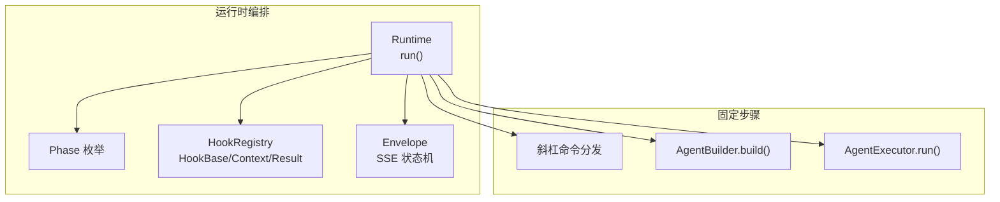
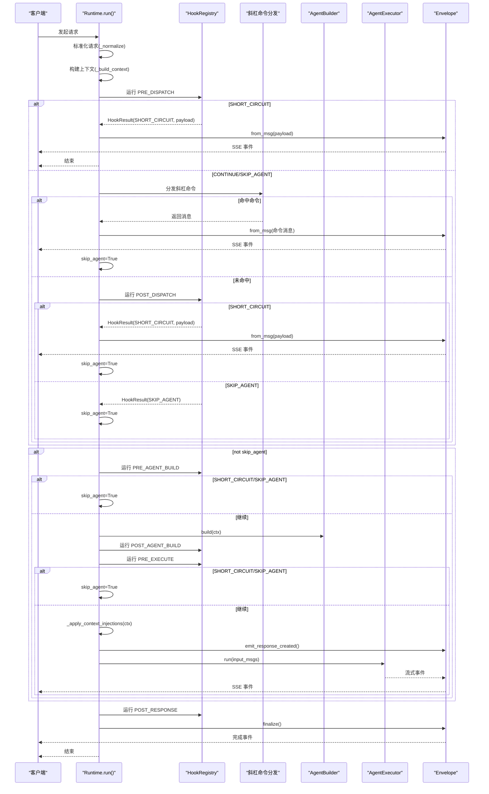
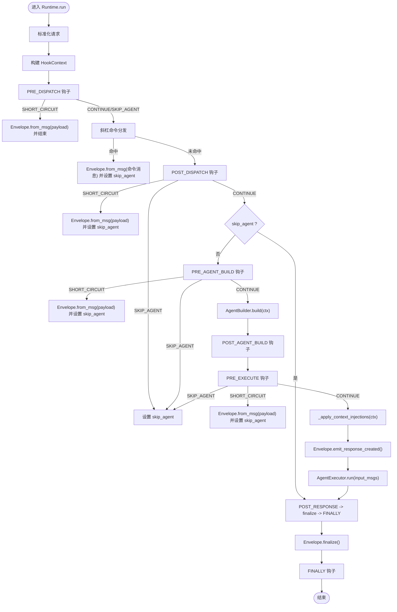
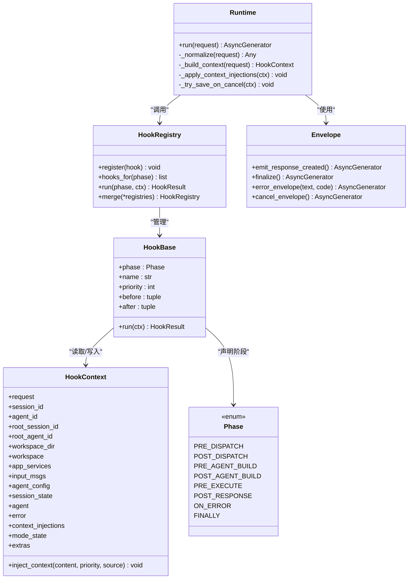

# 请求生命周期管理

<cite>
**本文引用的文件**
- [runtime.py](file://src/qwenpaw/runtime/runtime.py)
- [phases.py](file://src/qwenpaw/runtime/phases.py)
- [hooks.py](file://src/qwenpaw/runtime/hooks.py)
- [envelope.py](file://src/qwenpaw/runtime/envelope.py)
- [bootstrap_hook.py](file://src/qwenpaw/hooks/bootstrap/bootstrap_hook.py)
- [api.py](file://src/qwenpaw/plugins/api.py)
- [thinking_log_plugin.py](file://plugins/middleware-demo/thinking-log-middleware/thinking_log_plugin.py)
- [tracing_plugin.py](file://plugins/middleware-demo/tracing-middleware/tracing_plugin.py)
</cite>

## 目录
1. [简介](#简介)
2. [项目结构](#项目结构)
3. [核心组件](#核心组件)
4. [架构总览](#架构总览)
5. [详细组件分析](#详细组件分析)
6. [依赖关系分析](#依赖关系分析)
7. [性能考量](#性能考量)
8. [故障排查指南](#故障排查指南)
9. [结论](#结论)
10. [附录](#附录)

## 简介
本文件聚焦 QwenPaw 的请求生命周期管理系统，围绕 Runtime.run() 的 8 阶段处理流程展开：PRE_DISPATCH、POST_DISPATCH、PRE_AGENT_BUILD、POST_AGENT_BUILD、PRE_EXECUTE、POST_RESPONSE、ON_ERROR 与 FINALLY。文档将解释每个阶段的职责、HookAction 控制流（SHORT_CIRCUIT、SKIP_AGENT）对后续处理的影响、请求标准化过程、上下文构建机制、错误处理策略，并提供自定义中间件开发指南与最佳实践示例。

## 项目结构
QwenPaw 的请求生命周期由运行时编排层负责，关键代码位于 runtime 子包中：
- phases.py：定义 8 个固定阶段枚举
- hooks.py：定义 HookContext/HookResult/HookBase/HookRegistry 等钩子基础设施
- runtime.py：Runtime.run() 实现 8 阶段编排、请求标准化、上下文构建、错误处理与清理
- envelope.py：SSE 响应封装与状态机，用于事件发射与最终化

图表来源
- [runtime.py:49-206](file://src/qwenpaw/runtime/runtime.py#L49-L206)
- [phases.py:28-41](file://src/qwenpaw/runtime/phases.py#L28-L41)
- [hooks.py:256-312](file://src/qwenpaw/runtime/hooks.py#L256-L312)
- [envelope.py:737-765](file://src/qwenpaw/runtime/envelope.py#L737-L765)

章节来源
- [runtime.py:1-518](file://src/qwenpaw/runtime/runtime.py#L1-L518)
- [phases.py:1-42](file://src/qwenpaw/runtime/phases.py#L1-L42)
- [hooks.py:1-338](file://src/qwenpaw/runtime/hooks.py#L1-L338)
- [envelope.py:53-93](file://src/qwenpaw/runtime/envelope.py#L53-L93)

## 核心组件
- Phase 枚举：定义 8 个固定阶段点，覆盖从请求归一化到清理的全生命周期。
- Hook 体系：
  - HookContext：跨阶段共享的可变上下文，包含 request、session_id、agent_id、input_msgs、agent、error、context_injections 等字段，以及 mode_state/extras 扩展槽。
  - HookResult：封装 HookAction 与 payload（SHORT_CIRCUIT 时携带 Msg）。
  - HookBase：钩子基类，声明 phase/name/priority/before/after/run()。
  - HookRegistry：按阶段注册并拓扑排序执行钩子；支持 merge 合并多个注册表。
- Envelope：SSE 事件封装器，提供 emit_response_created()/finalize()/error_envelope()/cancel_envelope() 等方法，统一输出格式。

章节来源
- [phases.py:28-41](file://src/qwenpaw/runtime/phases.py#L28-L41)
- [hooks.py:46-138](file://src/qwenpaw/runtime/hooks.py#L46-L138)
- [hooks.py:145-312](file://src/qwenpaw/runtime/hooks.py#L145-L312)
- [envelope.py:737-765](file://src/qwenpaw/runtime/envelope.py#L737-L765)

## 架构总览
下图展示 Runtime.run() 的端到端调用链与阶段顺序，包括固定步骤与可插拔钩子的交互。

图表来源
- [runtime.py:49-206](file://src/qwenpaw/runtime/runtime.py#L49-L206)
- [hooks.py:293-312](file://src/qwenpaw/runtime/hooks.py#L293-L312)
- [envelope.py:737-765](file://src/qwenpaw/runtime/envelope.py#L737-L765)

## 详细组件分析

### Runtime.run() 八阶段流程与控制流
- 阶段顺序与职责
  - PRE_DISPATCH：请求归一化后、斜杠命令分发前。适合做鉴权、限流、快速短路。
  - POST_DISPATCH：斜杠命令未命中时执行。适合在“非命令”路径上做预处理。
  - PRE_AGENT_BUILD：会话加载、预构建准备。
  - POST_AGENT_BUILD：Agent 已构建完成，可做模式上下文注入或校验。
  - PRE_EXECUTE：执行前引导（如 bootstrap 注入、提示词刷新、环境栈压入）。
  - POST_RESPONSE：会话保存、定时任务触发写回等收尾逻辑。
  - ON_ERROR：异常捕获后的统一错误处理与取消信封。
  - FINALLY：幂等清理（关闭 MCP、重置 ContextVars 等）。
- HookAction 语义
  - CONTINUE：默认行为，继续下一个钩子/阶段。
  - SHORT_CIRCUIT：立即以 payload 生成完整 SSE 序列并结束当前阶段；仍会进入 ON_ERROR（如有）和 FINALLY。
  - SKIP_AGENT：仅跳过两个固定步骤（AgentBuilder.build 与 AgentExecutor.run），其余钩子阶段仍按序执行。
- 固定步骤
  - 斜杠命令分发：若命中则直接返回结果并设置 skip_agent。
  - Agent 构建与执行：仅在 skip_agent=False 时进行。

图表来源
- [runtime.py:49-206](file://src/qwenpaw/runtime/runtime.py#L49-L206)
- [hooks.py:293-312](file://src/qwenpaw/runtime/hooks.py#L293-L312)
- [envelope.py:737-765](file://src/qwenpaw/runtime/envelope.py#L737-L765)

章节来源
- [runtime.py:49-206](file://src/qwenpaw/runtime/runtime.py#L49-L206)
- [phases.py:28-41](file://src/qwenpaw/runtime/phases.py#L28-L41)
- [hooks.py:293-312](file://src/qwenpaw/runtime/hooks.py#L293-L312)

### 请求标准化与上下文构建
- 请求标准化
  - 将 dict 输入转换为 AgentRequest 对象。
  - 确保 session_id/user_id 存在，缺失时自动生成。
- 上下文构建
  - 解析 agent_id/root_session_id/root_agent_id 等标识。
  - 将 input 转为 input_msgs 列表。
  - 注入 workspace/app_services 等运行时依赖。
- 上下文注入
  - 收集 context_injections，按 priority 升序拼接为一条 system 角色消息，插入 input_msgs 头部，供当前轮次使用。

章节来源
- [runtime.py:442-476](file://src/qwenpaw/runtime/runtime.py#L442-L476)
- [runtime.py:478-515](file://src/qwenpaw/runtime/runtime.py#L478-L515)
- [hooks.py:73-138](file://src/qwenpaw/runtime/hooks.py#L73-L138)

### 错误处理与取消恢复
- 异常分类
  - asyncio.CancelledError/KeyboardInterrupt：触发 ON_ERROR 钩子（可能被重取消跳过），随后持久化中断状态，发送 cancel_envelope 事件，再向上抛出。
  - BaseException：记录日志，设置 ctx.error，运行 ON_ERROR，通过 error_envelope 输出错误事件，再向上抛出。
- 取消时的持久化
  - 将 Envelope 中的部分流式内容注入 agent 上下文，避免丢失。
  - 同步快照 agent.state_dict()，异步写入 session.save_session_state，并用 asyncio.shield 保护，确保即使外层被重取消也能后台完成。
- 兜底清理
  - finally 块先关闭 agent（flush 审计日志与策略），再运行 FINALLY 钩子。

章节来源
- [runtime.py:142-206](file://src/qwenpaw/runtime/runtime.py#L142-L206)
- [runtime.py:209-286](file://src/qwenpaw/runtime/runtime.py#L209-L286)
- [runtime.py:288-440](file://src/qwenpaw/runtime/runtime.py#L288-L440)
- [envelope.py:737-765](file://src/qwenpaw/runtime/envelope.py#L737-L765)

### 内置钩子示例：Bootstrap 引导
- BootstrapHook 在 PRE_EXECUTE 阶段检查工作区是否存在 BOOTSTRAP.md，若首次用户交互且未标记完成，则将引导内容前置到首个 user 消息，并创建完成标记。
- 该钩子不依赖 agent 实例，直接操作 ctx.input_msgs。

章节来源
- [bootstrap_hook.py:21-68](file://src/qwenpaw/hooks/bootstrap/bootstrap_hook.py#L21-L68)

### 插件注册与生命周期钩子
- 插件 API 提供 register_runtime_hook(hook)，将 HookBase 实例注册到所有工作区的 HookRegistry，并在后续工作区创建时自动注册。
- 可用阶段与 Phase 枚举一致。

章节来源
- [api.py:798-820](file://src/qwenpaw/plugins/api.py#L798-L820)
- [phases.py:28-41](file://src/qwenpaw/runtime/phases.py#L28-L41)

## 依赖关系分析
- 低耦合高内聚
  - Runtime 仅依赖 phases/hooks/envelope 三个子系统，固定步骤（斜杠命令分发、AgentBuilder、AgentExecutor）作为黑盒接入。
  - HookRegistry 内部维护拓扑排序缓存，避免重复计算。
- 外部依赖
  - agentscope.message/agent：用于消息与 Agent 类型。
  - 工作区与会话：Workspace.session.save_session_state 用于持久化。
- 潜在循环与约束
  - Hook 的 before/after 约束通过拓扑排序检测环，失败时抛出 HookCycleError，保证启动期快速失败。

图表来源
- [runtime.py:49-206](file://src/qwenpaw/runtime/runtime.py#L49-L206)
- [hooks.py:145-312](file://src/qwenpaw/runtime/hooks.py#L145-L312)
- [phases.py:28-41](file://src/qwenpaw/runtime/phases.py#L28-L41)
- [envelope.py:737-765](file://src/qwenpaw/runtime/envelope.py#L737-L765)

章节来源
- [hooks.py:168-253](file://src/qwenpaw/runtime/hooks.py#L168-L253)
- [hooks.py:256-312](file://src/qwenpaw/runtime/hooks.py#L256-L312)

## 性能考量
- 拓扑排序缓存：HookRegistry 对每阶段的排序结果进行缓存，注册变更才失效，降低重复开销。
- 最小 I/O：取消持久化采用同步快照 + 异步屏蔽写入，减少主流程阻塞风险。
- 事件批量：Envelope 聚合文本/思考/工具调用/数据块，减少频繁小事件带来的序列化与网络开销。
- 建议
  - 钩子尽量无副作用或轻量 IO，耗时操作放入异步任务或队列。
  - 合理使用 priority/before/after 控制执行顺序，避免不必要的重试与分支判断。

[本节为通用指导，无需源码引用]

## 故障排查指南
- 常见问题定位
  - 钩子循环依赖：HookCycleError 会在注册阶段抛出，检查 before/after 配置。
  - 短路未生效：确认 HookResult.action 是否为 SHORT_CIRCUIT，并确保 payload 为 Msg 类型。
  - 跳过 Agent 未生效：确认是否返回 SKIP_AGENT，注意它只跳过固定步骤，其他阶段仍执行。
  - 取消后前端未退出加载：确保 ON_ERROR 后发送了 cancel_envelope 事件。
- 调试技巧
  - 在 FINALLY 钩子中打印 ctx.extras 与 ctx.error，确认异常传播路径。
  - 使用 HookContext.inject_context 注入诊断信息，便于观察上下文拼装效果。
  - 借助内置演示插件（见附录）验证中间件链路是否正常。

章节来源
- [hooks.py:168-253](file://src/qwenpaw/runtime/hooks.py#L168-L253)
- [runtime.py:142-206](file://src/qwenpaw/runtime/runtime.py#L142-L206)

## 结论
Runtime.run() 通过 8 个固定阶段与 Hook 体系实现了高度可扩展的请求生命周期管理。SHORT_CIRCUIT 与 SKIP_AGENT 提供了灵活的控制流，配合 Envelope 的 SSE 状态机与健壮的错误/取消处理，既保证了稳定性，又为插件与中间件提供了丰富的扩展点。遵循本文的最佳实践，可在不影响核心流程的前提下，安全地增强系统能力。

[本节为总结性内容，无需源码引用]

## 附录

### 自定义运行时钩子开发指南
- 步骤
  - 继承 HookBase，声明 phase/name/priority/before/after。
  - 实现 run(ctx) -> HookResult，按需返回 CONTINUE/SKIP_AGENT/SHORT_CIRCUIT。
  - 通过 PluginApi.register_runtime_hook(hook) 注册到所有工作区。
- 注意事项
  - SHORT_CIRCUIT 的 payload 必须是 Msg，否则 Envelope 无法正确发射。
  - SKIP_AGENT 仅跳过构建与执行，不会阻止 POST_RESPONSE/FINALLY 执行。
  - 谨慎修改 ctx.input_msgs 与 ctx.agent，避免破坏后续阶段预期。

章节来源
- [hooks.py:145-161](file://src/qwenpaw/runtime/hooks.py#L145-L161)
- [api.py:798-820](file://src/qwenpaw/plugins/api.py#L798-L820)

### 中间件开发最佳实践与示例
- 中间件与运行时钩子的区别
  - 运行时钩子：围绕整个请求生命周期，关注阶段编排与全局上下文。
  - 中间件：包裹单个 Agent 的回复循环，关注推理/行动流的拦截与观测。
- 示例一：思维链日志中间件
  - 功能：捕获 ThinkingBlockDeltaEvent/TextBlockDeltaEvent 并打印。
  - 适用场景：调试模型推理过程。
  - 参考路径：[thinking_log_plugin.py](file://plugins/middleware-demo/thinking-log-middleware/thinking_log_plugin.py)
- 示例二：工具调用追踪中间件
  - 功能：记录工具名称、输入与耗时，写入工作区 trace.log。
  - 条件启用：当环境变量 QWENPAW_TRACE 存在时激活。
  - 参考路径：[tracing_plugin.py](file://plugins/middleware-demo/tracing-middleware/tracing_plugin.py)

章节来源
- [thinking_log_plugin.py:23-66](file://plugins/middleware-demo/thinking-log-middleware/thinking_log_plugin.py#L23-L66)
- [tracing_plugin.py:24-79](file://plugins/middleware-demo/tracing-middleware/tracing_plugin.py#L24-L79)