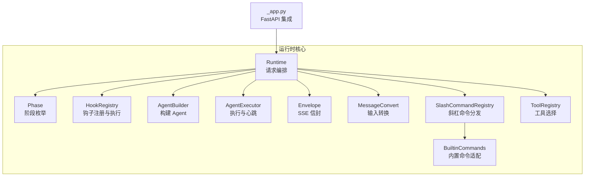
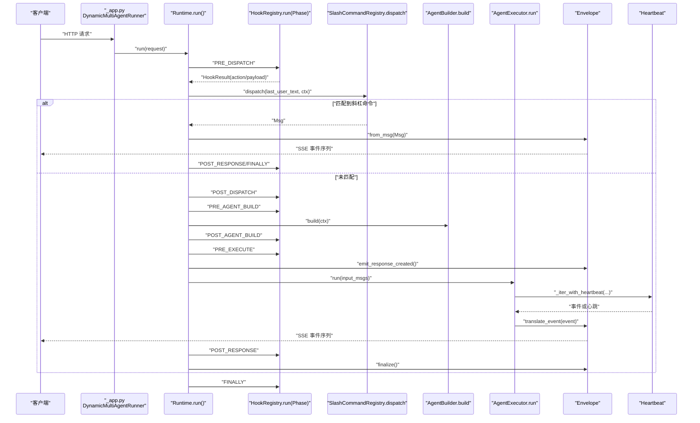
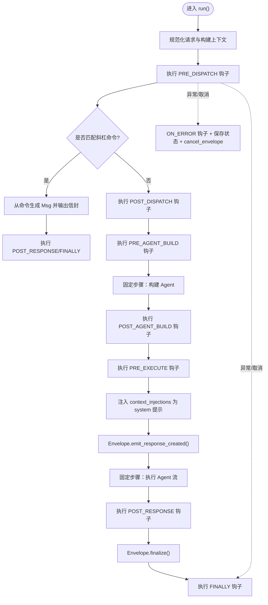
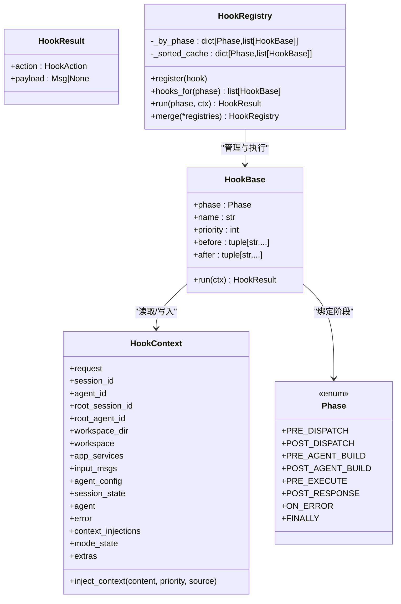
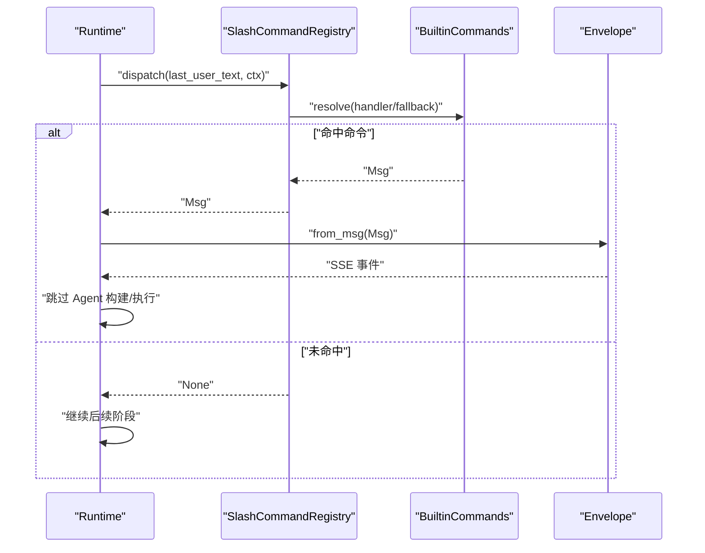
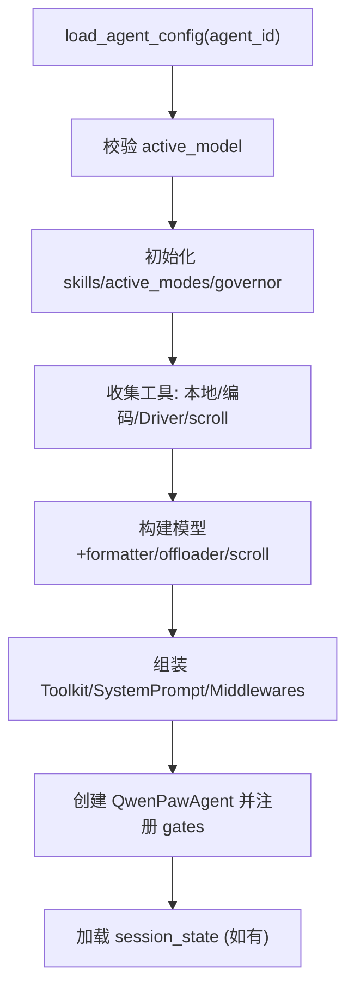
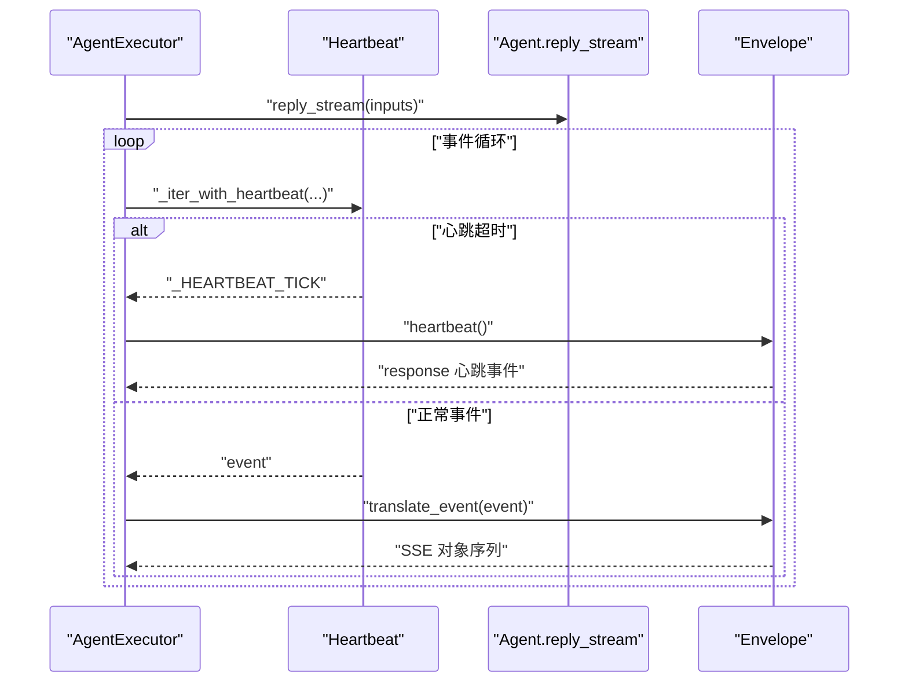
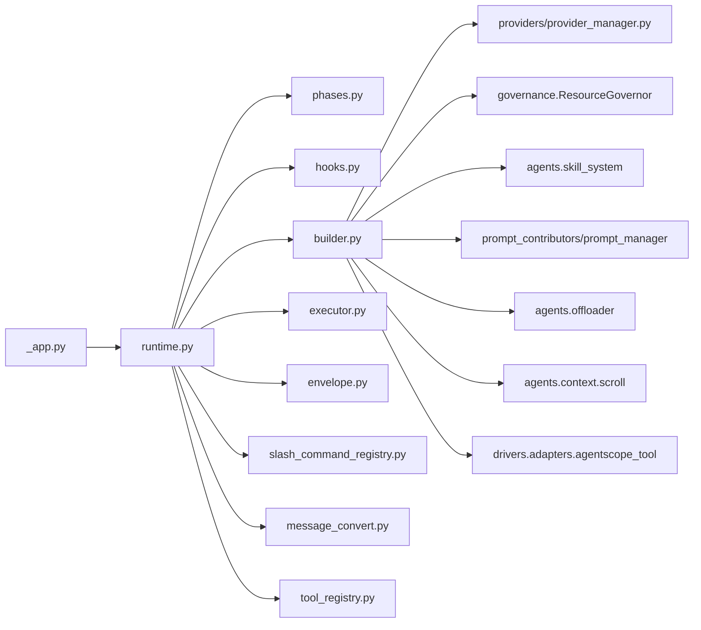

# 运行时环境

<cite>
**本文引用的文件**   
- [src/qwenpaw/runtime/__init__.py](file://src/qwenpaw/runtime/__init__.py)
- [src/qwenpaw/runtime/runtime.py](file://src/qwenpaw/runtime/runtime.py)
- [src/qwenpaw/runtime/phases.py](file://src/qwenpaw/runtime/phases.py)
- [src/qwenpaw/runtime/hooks.py](file://src/qwenpaw/runtime/hooks.py)
- [src/qwenpaw/runtime/builder.py](file://src/qwenpaw/runtime/builder.py)
- [src/qwenpaw/runtime/executor.py](file://src/qwenpaw/runtime/executor.py)
- [src/qwenpaw/runtime/envelope.py](file://src/qwenpaw/runtime/envelope.py)
- [src/qwenpaw/runtime/tool_registry.py](file://src/qwenpaw/runtime/tool_registry.py)
- [src/qwenpaw/runtime/slash_command_registry.py](file://src/qwenpaw/runtime/slash_command_registry.py)
- [src/qwenpaw/runtime/builtin_commands.py](file://src/qwenpaw/runtime/builtin_commands.py)
- [src/qwenpaw/runtime/message_convert.py](file://src/qwenpaw/runtime/message_convert.py)
- [src/qwenpaw/runtime/heartbeat.py](file://src/qwenpaw/runtime/heartbeat.py)
- [src/qwenpaw/app/_app.py](file://src/qwenpaw/app/_app.py)
</cite>

## 目录
1. [简介](#简介)
2. [项目结构](#项目结构)
3. [核心组件](#核心组件)
4. [架构总览](#架构总览)
5. [详细组件分析](#详细组件分析)
6. [依赖关系分析](#依赖关系分析)
7. [性能考量](#性能考量)
8. [故障排查指南](#故障排查指南)
9. [结论](#结论)
10. [附录：扩展点与自定义中间件开发指南](#附录：扩展点与自定义中间件开发指南)

## 简介
本技术文档聚焦 QwenPaw 的运行时环境，围绕 Runtime 类及其协作组件展开，系统性阐述请求路由机制、中间件管道处理、钩子系统（Hook）以及运行时的各个阶段（phases）。同时记录 Agent 实例管理、工具注册与依赖注入、异步任务调度、错误传播与日志记录机制，并提供扩展点与自定义中间件的实现指南。

## 项目结构
运行时模块位于 src/qwenpaw/runtime 下，核心由以下文件组成：
- runtime.py：请求编排主入口，定义 8 个生命周期阶段与异常/取消路径
- phases.py：阶段枚举定义
- hooks.py：钩子抽象、上下文、注册表与拓扑排序执行
- builder.py：按请求组装 Agent（模型、工具、提示词、中间件等）
- executor.py：驱动 Agent 流式回复并包装心跳
- envelope.py：SSE 信封状态机，将事件转换为前端协议
- tool_registry.py：工具描述符与过滤选择
- slash_command_registry.py：斜杠命令统一注册与分发
- builtin_commands.py：内置命令适配器（daemon/control/conversation/skill）
- message_convert.py：请求输入到 agentscope Msg 的转换
- heartbeat.py：异步迭代器的心跳封装

图表来源
- [src/qwenpaw/runtime/runtime.py:1-120](file://src/qwenpaw/runtime/runtime.py#L1-L120)
- [src/qwenpaw/runtime/phases.py:1-42](file://src/qwenpaw/runtime/phases.py#L1-L42)
- [src/qwenpaw/runtime/hooks.py:256-313](file://src/qwenpaw/runtime/hooks.py#L256-L313)
- [src/qwenpaw/runtime/builder.py:125-330](file://src/qwenpaw/runtime/builder.py#L125-L330)
- [src/qwenpaw/runtime/executor.py:23-61](file://src/qwenpaw/runtime/executor.py#L23-L61)
- [src/qwenpaw/runtime/envelope.py:27-100](file://src/qwenpaw/runtime/envelope.py#L27-L100)
- [src/qwenpaw/runtime/message_convert.py:63-166](file://src/qwenpaw/runtime/message_convert.py#L63-L166)
- [src/qwenpaw/runtime/slash_command_registry.py:45-133](file://src/qwenpaw/runtime/slash_command_registry.py#L45-L133)
- [src/qwenpaw/runtime/builtin_commands.py:632-654](file://src/qwenpaw/runtime/builtin_commands.py#L632-L654)
- [src/qwenpaw/runtime/tool_registry.py:47-135](file://src/qwenpaw/runtime/tool_registry.py#L47-L135)
- [src/qwenpaw/app/_app.py:127-149](file://src/qwenpaw/app/_app.py#L127-L149)

章节来源
- [src/qwenpaw/runtime/runtime.py:1-120](file://src/qwenpaw/runtime/runtime.py#L1-L120)
- [src/qwenpaw/runtime/phases.py:1-42](file://src/qwenpaw/runtime/phases.py#L1-L42)
- [src/qwenpaw/runtime/hooks.py:256-313](file://src/qwenpaw/runtime/hooks.py#L256-L313)
- [src/qwenpaw/runtime/builder.py:125-330](file://src/qwenpaw/runtime/builder.py#L125-L330)
- [src/qwenpaw/runtime/executor.py:23-61](file://src/qwenpaw/runtime/executor.py#L23-L61)
- [src/qwenpaw/runtime/envelope.py:27-100](file://src/qwenpaw/runtime/envelope.py#L27-L100)
- [src/qwenpaw/runtime/message_convert.py:63-166](file://src/qwenpaw/runtime/message_convert.py#L63-L166)
- [src/qwenpaw/runtime/slash_command_registry.py:45-133](file://src/qwenpaw/runtime/slash_command_registry.py#L45-L133)
- [src/qwenpaw/runtime/builtin_commands.py:632-654](file://src/qwenpaw/runtime/builtin_commands.py#L632-L654)
- [src/qwenpaw/runtime/tool_registry.py:47-135](file://src/qwenpaw/runtime/tool_registry.py#L47-L135)
- [src/qwenpaw/app/_app.py:127-149](file://src/qwenpaw/app/_app.py#L127-L149)

## 核心组件
- Runtime：每个工作区一个实例，负责一次请求的完整编排，包含 8 个阶段、斜杠命令分发、Agent 构建与执行、错误与取消处理、最终清理。
- Phase：定义 PRE_DISPATCH、POST_DISPATCH、PRE_AGENT_BUILD、POST_AGENT_BUILD、PRE_EXECUTE、POST_RESPONSE、ON_ERROR、FINALLY 八个阶段。
- Hook 系统：HookBase/HookContext/HookResult/HookRegistry，支持 before/after 约束与优先级拓扑排序；SHORT_CIRCUIT/SKIP_AGENT/CONTINUE 三种返回语义。
- AgentBuilder：按请求组装 Agent，包括模型、工具集、提示词、中间件、滚动上下文策略、治理层（governor）、内存管理等。
- AgentExecutor：驱动 agent.reply_stream，使用心跳包装，将事件转交给 Envelope。
- Envelope：SSE 信封状态机，维护 response/message 对象，翻译各类事件为前端协议。
- ToolRegistry：基于 ToolDescriptor 的工具选择与过滤，支持模式/技能/特性开关与默认启用策略。
- SlashCommandRegistry + BuiltinCommands：统一斜杠命令注册与分发，兼容 daemon/control/conversation/skill 四类命令。
- MessageConvert：将上层请求输入转换为 agentscope Msg，支持文本、图片、音频、视频与文件。
- Heartbeat：对异步迭代器进行心跳包装，避免长空闲导致连接断开。

章节来源
- [src/qwenpaw/runtime/runtime.py:32-206](file://src/qwenpaw/runtime/runtime.py#L32-L206)
- [src/qwenpaw/runtime/phases.py:28-42](file://src/qwenpaw/runtime/phases.py#L28-L42)
- [src/qwenpaw/runtime/hooks.py:46-138](file://src/qwenpaw/runtime/hooks.py#L46-L138)
- [src/qwenpaw/runtime/hooks.py:256-313](file://src/qwenpaw/runtime/hooks.py#L256-L313)
- [src/qwenpaw/runtime/builder.py:125-330](file://src/qwenpaw/runtime/builder.py#L125-L330)
- [src/qwenpaw/runtime/executor.py:23-61](file://src/qwenpaw/runtime/executor.py#L23-L61)
- [src/qwenpaw/runtime/envelope.py:27-100](file://src/qwenpaw/runtime/envelope.py#L27-L100)
- [src/qwenpaw/runtime/tool_registry.py:47-135](file://src/qwenpaw/runtime/tool_registry.py#L47-L135)
- [src/qwenpaw/runtime/slash_command_registry.py:45-133](file://src/qwenpaw/runtime/slash_command_registry.py#L45-L133)
- [src/qwenpaw/runtime/builtin_commands.py:632-654](file://src/qwenpaw/runtime/builtin_commands.py#L632-L654)
- [src/qwenpaw/runtime/message_convert.py:63-166](file://src/qwenpaw/runtime/message_convert.py#L63-L166)
- [src/qwenpaw/runtime/heartbeat.py:1-41](file://src/qwenpaw/runtime/heartbeat.py#L1-L41)

## 架构总览
下图展示了从 FastAPI 应用层到运行时各组件的调用链与数据流向。

图表来源
- [src/qwenpaw/app/_app.py:127-149](file://src/qwenpaw/app/_app.py#L127-L149)
- [src/qwenpaw/runtime/runtime.py:49-206](file://src/qwenpaw/runtime/runtime.py#L49-L206)
- [src/qwenpaw/runtime/hooks.py:293-313](file://src/qwenpaw/runtime/hooks.py#L293-L313)
- [src/qwenpaw/runtime/slash_command_registry.py:108-125](file://src/qwenpaw/runtime/slash_command_registry.py#L108-L125)
- [src/qwenpaw/runtime/builder.py:125-330](file://src/qwenpaw/runtime/builder.py#L125-L330)
- [src/qwenpaw/runtime/executor.py:36-61](file://src/qwenpaw/runtime/executor.py#L36-L61)
- [src/qwenpaw/runtime/envelope.py:92-100](file://src/qwenpaw/runtime/envelope.py#L92-L100)
- [src/qwenpaw/runtime/heartbeat.py:11-41](file://src/qwenpaw/runtime/heartbeat.py#L11-L41)

## 详细组件分析

### Runtime 类设计与实现
- 职责：每工作区一个实例，负责单次请求的端到端编排，输出与旧版 stream_query 一致的 SSE 信封对象。
- 关键流程：
  - 规范化请求与构建 HookContext（会话/根会话、Agent ID、输入消息等）
  - 依次执行 PRE_DISPATCH → 斜杠命令分发 → POST_DISPATCH → PRE_AGENT_BUILD → 固定步骤“构建 Agent” → POST_AGENT_BUILD → PRE_EXECUTE → 固定步骤“执行 Agent” → POST_RESPONSE → finalize
  - 异常与取消：捕获 CancelledError/KeyboardInterrupt 与 BaseException，设置 ctx.error，触发 ON_ERROR，持久化中断状态，发送 cancel/error 信封，finally 中关闭 Agent 并执行 FINALLY
  - 上下文注入：在 PRE_EXECUTE 前将 context_injections 合并为 system 提示插入 input_msgs
- 取消路径保护：使用 asyncio.shield 保存中断时的 Agent 状态，确保 I/O 不被外层重取消打断；注入部分响应与关闭悬空工具调用，保证恢复一致性

图表来源
- [src/qwenpaw/runtime/runtime.py:49-206](file://src/qwenpaw/runtime/runtime.py#L49-L206)
- [src/qwenpaw/runtime/runtime.py:209-286](file://src/qwenpaw/runtime/runtime.py#L209-L286)
- [src/qwenpaw/runtime/runtime.py:478-515](file://src/qwenpaw/runtime/runtime.py#L478-L515)

章节来源
- [src/qwenpaw/runtime/runtime.py:32-206](file://src/qwenpaw/runtime/runtime.py#L32-L206)
- [src/qwenpaw/runtime/runtime.py:209-286](file://src/qwenpaw/runtime/runtime.py#L209-L286)
- [src/qwenpaw/runtime/runtime.py:478-515](file://src/qwenpaw/runtime/runtime.py#L478-L515)

### 阶段（Phases）与钩子系统
- 阶段定义：PRE_DISPATCH、POST_DISPATCH、PRE_AGENT_BUILD、POST_AGENT_BUILD、PRE_EXECUTE、POST_RESPONSE、ON_ERROR、FINALLY
- 钩子接口：
  - HookBase：声明 phase/name/priority/before/after，实现 run(ctx)->HookResult
  - HookContext：跨阶段共享上下文，提供 inject_context 动态注入系统提示
  - HookResult：action=CONTINUE/SKIP_AGENT/SHORT_CIRCUIT，payload 用于短路输出
  - HookRegistry：按阶段注册、拓扑排序（before/after 约束）、缓存有序列表、顺序执行；遇到 SHORT_CIRCUIT 立即返回，SKIP_AGENT 标记跳过两个固定步骤
- 拓扑排序：以 name 为节点，before/after 为边，按 priority 与注册顺序稳定排序；检测到环抛出 HookCycleError

图表来源
- [src/qwenpaw/runtime/hooks.py:145-161](file://src/qwenpaw/runtime/hooks.py#L145-L161)
- [src/qwenpaw/runtime/hooks.py:73-138](file://src/qwenpaw/runtime/hooks.py#L73-L138)
- [src/qwenpaw/runtime/hooks.py:256-313](file://src/qwenpaw/runtime/hooks.py#L256-L313)
- [src/qwenpaw/runtime/phases.py:28-42](file://src/qwenpaw/runtime/phases.py#L28-L42)

章节来源
- [src/qwenpaw/runtime/phases.py:28-42](file://src/qwenpaw/runtime/phases.py#L28-L42)
- [src/qwenpaw/runtime/hooks.py:46-138](file://src/qwenpaw/runtime/hooks.py#L46-L138)
- [src/qwenpaw/runtime/hooks.py:256-313](file://src/qwenpaw/runtime/hooks.py#L256-L313)

### 请求路由与斜杠命令分发
- 路由入口：Runtime 在 PRE_DISPATCH 后提取最后一条用户文本，交由 SlashCommandRegistry.dispatch
- 命令类型：
  - daemon：重启/状态/版本/日志等
  - control：控制命令（通过 ControlContext 转发）
  - conversation：对话命令（compact/new/clear/history/plan 等），直接读写 AgentState
  - skill：回退处理器解析 /skill_name [input]，无需构建 Agent
- 结果：若命中命令，Envelope.from_msg 输出完整信封序列并跳过 Agent 构建与执行；否则继续后续阶段

图表来源
- [src/qwenpaw/runtime/runtime.py:72-89](file://src/qwenpaw/runtime/runtime.py#L72-L89)
- [src/qwenpaw/runtime/slash_command_registry.py:108-125](file://src/qwenpaw/runtime/slash_command_registry.py#L108-L125)
- [src/qwenpaw/runtime/builtin_commands.py:632-654](file://src/qwenpaw/runtime/builtin_commands.py#L632-L654)
- [src/qwenpaw/runtime/envelope.py:697-731](file://src/qwenpaw/runtime/envelope.py#L697-L731)

章节来源
- [src/qwenpaw/runtime/runtime.py:72-89](file://src/qwenpaw/runtime/runtime.py#L72-L89)
- [src/qwenpaw/runtime/slash_command_registry.py:45-133](file://src/qwenpaw/runtime/slash_command_registry.py#L45-L133)
- [src/qwenpaw/runtime/builtin_commands.py:632-654](file://src/qwenpaw/runtime/builtin_commands.py#L632-L654)
- [src/qwenpaw/runtime/envelope.py:697-731](file://src/qwenpaw/runtime/envelope.py#L697-L731)

### Agent 构建、工具注册与依赖注入
- 构建流程（AgentBuilder.build）：
  - 加载 agent_config，校验 active_model
  - 初始化 skills、active_modes、governor（资源治理层）
  - 收集工具：本地工作区工具、编码模式工具、Driver 工具、scroll 召回工具（结构化 recall_history 与可选 REPL）
  - 构建模型与 formatter、offloader、滚动上下文策略（strategy="scroll"时）
  - 组装 Toolkit、System Prompt、middlewares（含 scroll.cap_middleware）
  - 创建 QwenPawAgent，注册 ReAct gates，加载 session_state
- 工具注册与选择（ToolRegistry）：
  - 通过 @tool_descriptor 装饰器自动收集内置工具函数
  - filter(active_modes, active_skills, enabled_features, allowed, denied) 决定本次请求可用的工具集合
  - PolicyGuardedTool 包装工具调用，结合 governor 进行沙箱/审批策略
- 依赖注入：
  - request_context 注入 approval_coordinator、tool_coordinator、channel_meta、user_name 等
  - context_injections 在 PRE_EXECUTE 前注入为 system 提示，供当前轮次可见

图表来源
- [src/qwenpaw/runtime/builder.py:125-330](file://src/qwenpaw/runtime/builder.py#L125-L330)
- [src/qwenpaw/runtime/tool_registry.py:170-225](file://src/qwenpaw/runtime/tool_registry.py#L170-L225)
- [src/qwenpaw/runtime/tool_registry.py:91-135](file://src/qwenpaw/runtime/tool_registry.py#L91-L135)
- [src/qwenpaw/runtime/runtime.py:478-515](file://src/qwenpaw/runtime/runtime.py#L478-L515)

章节来源
- [src/qwenpaw/runtime/builder.py:125-330](file://src/qwenpaw/runtime/builder.py#L125-L330)
- [src/qwenpaw/runtime/tool_registry.py:47-135](file://src/qwenpaw/runtime/tool_registry.py#L47-L135)
- [src/qwenpaw/runtime/tool_registry.py:170-225](file://src/qwenpaw/runtime/tool_registry.py#L170-L225)
- [src/qwenpaw/runtime/runtime.py:478-515](file://src/qwenpaw/runtime/runtime.py#L478-L515)

### 执行与 SSE 信封
- AgentExecutor：驱动 agent.reply_stream，使用 _iter_with_heartbeat 包装，心跳间隔 25s，空闲时发送心跳事件
- Envelope：维护 response/message 状态，翻译 TEXT_BLOCK_*、THINKING_BLOCK_*、TOOL_CALL_*、DATA_BLOCK_*、MODEL_CALL_END、EXCEED_MAX_ITERS 等事件，输出前端期望的 SSE 对象；支持 from_msg/cancel_envelope/error_envelope/finalize

图表来源
- [src/qwenpaw/runtime/executor.py:36-61](file://src/qwenpaw/runtime/executor.py#L36-L61)
- [src/qwenpaw/runtime/heartbeat.py:11-41](file://src/qwenpaw/runtime/heartbeat.py#L11-L41)
- [src/qwenpaw/runtime/envelope.py:138-640](file://src/qwenpaw/runtime/envelope.py#L138-L640)

章节来源
- [src/qwenpaw/runtime/executor.py:23-61](file://src/qwenpaw/runtime/executor.py#L23-L61)
- [src/qwenpaw/runtime/heartbeat.py:1-41](file://src/qwenpaw/runtime/heartbeat.py#L1-L41)
- [src/qwenpaw/runtime/envelope.py:138-640](file://src/qwenpaw/runtime/envelope.py#L138-L640)

### 输入转换与消息格式
- message_convert._request_input_to_msgs：将上层 AgentRequest.input（1.x Message）转换为 agentscope 2.0 Msg，支持 text/image/audio/video/file，自动补齐 URL scheme 与媒体类型推断

章节来源
- [src/qwenpaw/runtime/message_convert.py:63-166](file://src/qwenpaw/runtime/message_convert.py#L63-L166)

## 依赖关系分析
- 外部集成：
  - app/_app.py 中的 DynamicMultiAgentRunner 在每个请求中创建 Runtime 实例并迭代其 run() 输出
  - providers/provider_manager 提供 active_model
  - governance.ResourceGovernor 提供工具调用治理与沙箱能力
  - agentscope.agent.ReActConfig 与 QwenPawAgent 作为执行主体
- 内部耦合：
  - Runtime 强依赖 HookRegistry、AgentBuilder、AgentExecutor、Envelope、SlashCommandRegistry
  - AgentBuilder 依赖 ProviderManager、SkillSystem、PromptManager、Offloader、Scroll 组件、Driver 工具
  - ToolRegistry 与 PolicyGuardedTool 共同完成工具选择与防护

图表来源
- [src/qwenpaw/app/_app.py:127-149](file://src/qwenpaw/app/_app.py#L127-L149)
- [src/qwenpaw/runtime/runtime.py:1-120](file://src/qwenpaw/runtime/runtime.py#L1-L120)
- [src/qwenpaw/runtime/builder.py:125-330](file://src/qwenpaw/runtime/builder.py#L125-L330)
- [src/qwenpaw/runtime/tool_registry.py:47-135](file://src/qwenpaw/runtime/tool_registry.py#L47-L135)

章节来源
- [src/qwenpaw/app/_app.py:127-149](file://src/qwenpaw/app/_app.py#L127-L149)
- [src/qwenpaw/runtime/runtime.py:1-120](file://src/qwenpaw/runtime/runtime.py#L1-L120)
- [src/qwenpaw/runtime/builder.py:125-330](file://src/qwenpaw/runtime/builder.py#L125-L330)
- [src/qwenpaw/runtime/tool_registry.py:47-135](file://src/qwenpaw/runtime/tool_registry.py#L47-L135)

## 性能考量
- 心跳机制：25 秒心跳避免长空闲连接断开，降低前端重试开销
- 拓扑排序缓存：HookRegistry 按阶段缓存有序列表，减少重复计算
- 工具选择：ToolRegistry.filter 基于集合运算快速过滤，避免不必要的工具包装
- 滚动上下文：当 strategy="scroll"时，按需启用 offloader 与回忆工具，平衡上下文长度与检索成本
- 取消路径保护：使用 asyncio.shield 确保中断保存不丢失，避免额外重试

## 故障排查指南
- 常见错误与处理：
  - 无活动模型：AgentBuilder 会抛出 RuntimeError，需在 UI 中选择模型
  - 钩子循环：HookRegistry 在拓扑排序时检测环并抛出 HookCycleError，检查 before/after 配置
  - 工具不可用：确认 ToolDescriptor 的 requires_modes/skills/features 与 allowed/denied 配置
  - 斜杠命令冲突：SlashCommandRegistry.register 禁止同名命令，检查别名与分类
- 日志定位：
  - Runtime 在异常路径记录 session_id 与错误信息
  - Builder 在构建成功/失败时记录 model/tools 数量
  - Governor 启动失败会降级为 fail-closed 并记录错误
- 取消与恢复：
  - 检查 cancel-save 日志，确认部分响应与悬空工具调用已闭合
  - 验证 session.save_session_state 是否成功持久化代理状态

章节来源
- [src/qwenpaw/runtime/runtime.py:166-206](file://src/qwenpaw/runtime/runtime.py#L166-L206)
- [src/qwenpaw/runtime/runtime.py:209-286](file://src/qwenpaw/runtime/runtime.py#L209-L286)
- [src/qwenpaw/runtime/hooks.py:248-253](file://src/qwenpaw/runtime/hooks.py#L248-L253)
- [src/qwenpaw/runtime/builder.py:156-164](file://src/qwenpaw/runtime/builder.py#L156-L164)
- [src/qwenpaw/runtime/builder.py:396-426](file://src/qwenpaw/runtime/builder.py#L396-L426)
- [src/qwenpaw/runtime/slash_command_registry.py:59-81](file://src/qwenpaw/runtime/slash_command_registry.py#L59-L81)

## 结论
QwenPaw 运行时通过清晰的八阶段编排、可扩展的钩子系统与稳定的 SSE 信封协议，实现了高内聚低耦合的请求处理流水线。AgentBuilder 将模型、工具、提示词与中间件解耦装配，ToolRegistry 与 Governance 保障工具调用的安全与可控。心跳与取消路径设计提升了鲁棒性与用户体验。整体架构便于扩展与定制，适合复杂业务场景下的多 Agent 协作与插件生态。

## 附录：扩展点与自定义中间件开发指南

### 扩展点概览
- 钩子系统（Hook）：在任意阶段插入逻辑，支持 before/after 约束与优先级
- 斜杠命令：注册 CommandSpec 或 fallback 处理器，扩展 /xxx 指令
- 工具注册：使用 @tool_descriptor 声明工具元数据，参与 ToolRegistry.filter
- 中间件工厂：插件可注册 MiddlewareFactory，按优先级组装中间件管道

### 自定义钩子示例
- 继承 HookBase，设置 phase/name/priority/before/after
- 在 run(ctx) 中读取/修改 ctx.input_msgs、ctx.context_injections、ctx.extras
- 返回 HookResult(action=CONTINUE/SKIP_AGENT/SHORT_CIRCUIT, payload=Msg|None)

章节来源
- [src/qwenpaw/runtime/hooks.py:145-161](file://src/qwenpaw/runtime/hooks.py#L145-L161)
- [src/qwenpaw/runtime/hooks.py:73-138](file://src/qwenpaw/runtime/hooks.py#L73-L138)
- [src/qwenpaw/runtime/hooks.py:256-313](file://src/qwenpaw/runtime/hooks.py#L256-L313)

### 自定义斜杠命令示例
- 定义 CommandSpec(name, handler, aliases, category, help_text, metadata)
- 通过 SlashCommandRegistry.register(spec) 注册
- 或使用 get_skill_fallback_handler 注册 /skill_name 回退处理器

章节来源
- [src/qwenpaw/runtime/slash_command_registry.py:27-82](file://src/qwenpaw/runtime/slash_command_registry.py#L27-L82)
- [src/qwenpaw/runtime/builtin_commands.py:632-654](file://src/qwenpaw/runtime/builtin_commands.py#L632-L654)

### 自定义工具示例
- 使用 @tool_descriptor(name, enabled_by_default, requires_modes, requires_skills, requires_features, requires_sandbox, async_execution, description, **metadata) 装饰函数
- 工具将被自动收集并通过 ToolRegistry.filter 选择
- 如需沙箱/审批，结合 PolicyGuardedTool 与 ResourceGovernor

章节来源
- [src/qwenpaw/runtime/tool_registry.py:170-225](file://src/qwenpaw/runtime/tool_registry.py#L170-L225)
- [src/qwenpaw/runtime/tool_registry.py:91-135](file://src/qwenpaw/runtime/tool_registry.py#L91-L135)

### 自定义中间件示例
- 插件通过 register_middleware_factory(plugin_id, factory, priority) 注册中间件工厂
- 工厂签名：factory(ctx, agent_config) -> MiddlewareBase | None
- 中间件按优先级外包裹 Agent 的 reply_stream，可在事件前后注入逻辑

章节来源
- [src/qwenpaw/plugins/registry.py:179-218](file://src/qwenpaw/plugins/registry.py#L179-L218)
- [src/qwenpaw/runtime/builder.py:277-280](file://src/qwenpaw/runtime/builder.py#L277-L280)