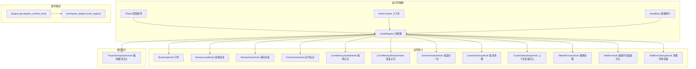
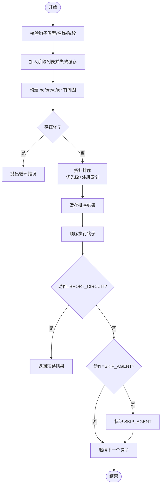
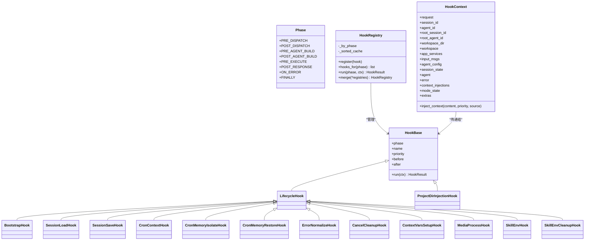
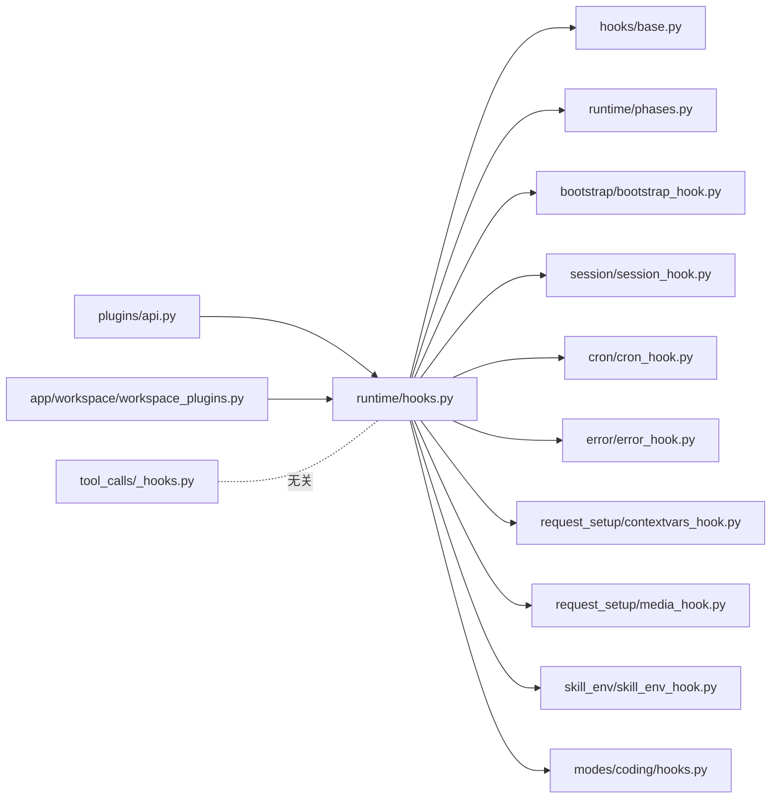

# 钩子系统架构

<cite>
**本文引用的文件**   
- [src/qwenpaw/runtime/hooks.py](file://src/qwenpaw/runtime/hooks.py)
- [src/qwenpaw/runtime/phases.py](file://src/qwenpaw/runtime/phases.py)
- [src/qwenpaw/hooks/base.py](file://src/qwenpaw/hooks/base.py)
- [src/qwenpaw/hooks/bootstrap/bootstrap_hook.py](file://src/qwenpaw/hooks/bootstrap/bootstrap_hook.py)
- [src/qwenpaw/hooks/session/session_hook.py](file://src/qwenpaw/hooks/session/session_hook.py)
- [src/qwenpaw/hooks/cron/cron_hook.py](file://src/qwenpaw/hooks/cron/cron_hook.py)
- [src/qwenpaw/hooks/error/error_hook.py](file://src/qwenpaw/hooks/error/error_hook.py)
- [src/qwenpaw/hooks/request_setup/contextvars_hook.py](file://src/qwenpaw/hooks/request_setup/contextvars_hook.py)
- [src/qwenpaw/hooks/request_setup/media_hook.py](file://src/qwenpaw/hooks/request_setup/media_hook.py)
- [src/qwenpaw/hooks/skill_env/skill_env_hook.py](file://src/qwenpaw/hooks/skill_env/skill_env_hook.py)
- [src/qwenpaw/modes/coding/hooks.py](file://src/qwenpaw/modes/coding/hooks.py)
- [src/qwenpaw/plugins/api.py](file://src/qwenpaw/plugins/api.py)
- [src/qwenpaw/app/workspace/workspace_plugins.py](file://src/qwenpaw/app/workspace/workspace_plugins.py)
- [src/qwenpaw/tool_calls/_hooks.py](file://src/qwenpaw/tool_calls/_hooks.py)
</cite>

## 目录
1. [简介](#简介)
2. [项目结构](#项目结构)
3. [核心组件](#核心组件)
4. [架构总览](#架构总览)
5. [详细组件分析](#详细组件分析)
6. [依赖关系分析](#依赖关系分析)
7. [性能考量](#性能考量)
8. [故障排查指南](#故障排查指南)
9. [结论](#结论)
10. [附录：自定义钩子开发指南](#附录自定义钩子开发指南)

## 简介
本文件面向 QwenPaw 的运行时钩子系统，系统性阐述 HookContext 的数据结构与生命周期管理、HookRegistry 的注册与调度机制，以及内置钩子的实现原理与使用场景。文档同时提供自定义钩子的接口规范、错误处理与性能建议，并给出可操作的示例路径与调试技巧，帮助开发者快速扩展系统能力。

## 项目结构
QwenPaw 的钩子系统位于运行时层（runtime）与业务钩子（hooks）两层：
- 运行时抽象：定义阶段枚举、上下文、基础钩子类与注册器
- 业务钩子：按功能域组织，如引导、会话、定时任务、错误处理、请求准备等
- 模式钩子：特定模式（如编码模式）在构建后注入模式相关上下文
- 插件集成：通过插件 API 将运行时钩子注册到工作区级注册表



图表来源
- [src/qwenpaw/runtime/phases.py:28-38](file://src/qwenpaw/runtime/phases.py#L28-L38)
- [src/qwenpaw/runtime/hooks.py:73-137](file://src/qwenpaw/runtime/hooks.py#L73-L137)
- [src/qwenpaw/runtime/hooks.py:145-161](file://src/qwenpaw/runtime/hooks.py#L145-L161)
- [src/qwenpaw/runtime/hooks.py:256-327](file://src/qwenpaw/runtime/hooks.py#L256-L327)
- [src/qwenpaw/hooks/bootstrap/bootstrap_hook.py:21-27](file://src/qwenpaw/hooks/bootstrap/bootstrap_hook.py#L21-L27)
- [src/qwenpaw/hooks/session/session_hook.py:34-40](file://src/qwenpaw/hooks/session/session_hook.py#L34-L40)
- [src/qwenpaw/hooks/session/session_hook.py:73-78](file://src/qwenpaw/hooks/session/session_hook.py#L73-L78)
- [src/qwenpaw/hooks/cron/cron_hook.py:27-33](file://src/qwenpaw/hooks/cron/cron_hook.py#L27-L33)
- [src/qwenpaw/hooks/cron/cron_hook.py:41-55](file://src/qwenpaw/hooks/cron/cron_hook.py#L41-L55)
- [src/qwenpaw/hooks/cron/cron_hook.py:83-93](file://src/qwenpaw/hooks/cron/cron_hook.py#L83-L93)
- [src/qwenpaw/hooks/error/error_hook.py:18-24](file://src/qwenpaw/hooks/error/error_hook.py#L18-L24)
- [src/qwenpaw/hooks/error/error_hook.py:76-82](file://src/qwenpaw/hooks/error/error_hook.py#L76-L82)
- [src/qwenpaw/hooks/request_setup/contextvars_hook.py:19-25](file://src/qwenpaw/hooks/request_setup/contextvars_hook.py#L19-L25)
- [src/qwenpaw/hooks/request_setup/media_hook.py:20-26](file://src/qwenpaw/hooks/request_setup/media_hook.py#L20-L26)
- [src/qwenpaw/hooks/skill_env/skill_env_hook.py:21-27](file://src/qwenpaw/hooks/skill_env/skill_env_hook.py#L21-L27)
- [src/qwenpaw/hooks/skill_env/skill_env_hook.py:44-50](file://src/qwenpaw/hooks/skill_env/skill_env_hook.py#L44-L50)
- [src/qwenpaw/modes/coding/hooks.py:11-17](file://src/qwenpaw/modes/coding/hooks.py#L11-L17)
- [src/qwenpaw/plugins/api.py:798-820](file://src/qwenpaw/plugins/api.py#L798-L820)
- [src/qwenpaw/app/workspace/workspace_plugins.py:38-38](file://src/qwenpaw/app/workspace/workspace_plugins.py#L38-L38)

章节来源
- [src/qwenpaw/runtime/phases.py:1-42](file://src/qwenpaw/runtime/phases.py#L1-L42)
- [src/qwenpaw/runtime/hooks.py:1-338](file://src/qwenpaw/runtime/hooks.py#L1-L338)
- [src/qwenpaw/hooks/base.py:1-27](file://src/qwenpaw/hooks/base.py#L1-L27)
- [src/qwenpaw/plugins/api.py:798-820](file://src/qwenpaw/plugins/api.py#L798-L820)
- [src/qwenpaw/app/workspace/workspace_plugins.py:38-38](file://src/qwenpaw/app/workspace/workspace_plugins.py#L38-L38)

## 核心组件
- Phase 阶段枚举：定义一次 Runtime.run() 调用周围的八个固定阶段点，覆盖从请求预处理到最终清理的全生命周期。
- HookContext 上下文：每个请求级别的上下文对象，包含身份标识、容器引用、每请求可变状态、上下文注入集合以及两个“逃生舱”字典 mode_state 和 extras，用于跨钩子传递短期数据或按模式隔离的状态。
- HookBase 基础钩子：声明 phase、name、priority 及 before/after 约束；实现 run(ctx) 返回 HookResult。
- HookRegistry 注册器：按阶段维护钩子列表，支持拓扑排序与优先级断言，缓存排序结果并在每次注册时失效对应阶段的缓存；run(phase, ctx) 顺序执行钩子，支持短路、跳过 Agent 步骤等行为语义。

章节来源
- [src/qwenpaw/runtime/phases.py:28-38](file://src/qwenpaw/runtime/phases.py#L28-L38)
- [src/qwenpaw/runtime/hooks.py:73-137](file://src/qwenpaw/runtime/hooks.py#L73-L137)
- [src/qwenpaw/runtime/hooks.py:145-161](file://src/qwenpaw/runtime/hooks.py#L145-L161)
- [src/qwenpaw/runtime/hooks.py:256-327](file://src/qwenpaw/runtime/hooks.py#L256-L327)

## 架构总览
下图展示一次典型请求的钩子执行流程，包括阶段划分、关键钩子参与点以及异常处理路径。

```mermaid
sequenceDiagram
participant Client as "客户端"
participant Runtime as "Runtime"
participant Reg as "HookRegistry"
participant Ctx as "HookContext"
participant H1 as "ContextVarsSetupHook"
participant H2 as "SessionLoadHook"
participant H3 as "BootstrapHook"
participant H4 as "MediaProcessHook"
participant H5 as "SkillEnvHook"
participant Agent as "Agent"
participant H6 as "SessionSaveHook"
participant H7 as "ErrorNormalizeHook"
participant H8 as "CancelCleanupHook"
participant H9 as "SkillEnvCleanupHook"
Client->>Runtime : 发起请求
Runtime->>Reg : run(PRE_DISPATCH, Ctx)
Reg->>H1 : run(Ctx)
Note over H1 : 注入 ContextVar工作区、会话、用户等
Runtime->>Reg : run(PRE_AGENT_BUILD, Ctx)
Reg->>H2 : run(Ctx)
Note over H2 : 加载持久化会话状态到 ctx.session_state
Runtime->>Reg : run(PRE_EXECUTE, Ctx)
Reg->>H3 : run(Ctx)
Reg->>H4 : run(Ctx)
Reg->>H5 : run(Ctx)
Note over H3,H4,H5 : 注入引导、处理媒体、推入技能环境变量
Runtime->>Agent : 构建并执行
Agent-->>Runtime : 响应完成
Runtime->>Reg : run(POST_RESPONSE, Ctx)
Reg->>H6 : run(Ctx)
Note over H6 : 保存会话状态
alt 发生异常
Runtime->>Reg : run(ON_ERROR, Ctx)
Reg->>H7 : run(Ctx)
Reg->>H8 : run(Ctx)
end
Runtime->>Reg : run(FINALLY, Ctx)
Reg->>H9 : run(Ctx)
Note over H9 : 弹出并清理技能环境变量
```

图表来源
- [src/qwenpaw/runtime/phases.py:28-38](file://src/qwenpaw/runtime/phases.py#L28-L38)
- [src/qwenpaw/runtime/hooks.py:293-312](file://src/qwenpaw/runtime/hooks.py#L293-L312)
- [src/qwenpaw/hooks/request_setup/contextvars_hook.py:19-25](file://src/qwenpaw/hooks/request_setup/contextvars_hook.py#L19-L25)
- [src/qwenpaw/hooks/session/session_hook.py:34-40](file://src/qwenpaw/hooks/session/session_hook.py#L34-L40)
- [src/qwenpaw/hooks/bootstrap/bootstrap_hook.py:21-27](file://src/qwenpaw/hooks/bootstrap/bootstrap_hook.py#L21-L27)
- [src/qwenpaw/hooks/request_setup/media_hook.py:20-26](file://src/qwenpaw/hooks/request_setup/media_hook.py#L20-L26)
- [src/qwenpaw/hooks/skill_env/skill_env_hook.py:21-27](file://src/qwenpaw/hooks/skill_env/skill_env_hook.py#L21-L27)
- [src/qwenpaw/hooks/session/session_hook.py:73-78](file://src/qwenpaw/hooks/session/session_hook.py#L73-L78)
- [src/qwenpaw/hooks/error/error_hook.py:18-24](file://src/qwenpaw/hooks/error/error_hook.py#L18-L24)
- [src/qwenpaw/hooks/error/error_hook.py:76-82](file://src/qwenpaw/hooks/error/error_hook.py#L76-L82)
- [src/qwenpaw/hooks/skill_env/skill_env_hook.py:44-50](file://src/qwenpaw/hooks/skill_env/skill_env_hook.py#L44-L50)

## 详细组件分析

### HookContext 数据结构设计与生命周期管理
- 身份与容器
  - request、session_id、agent_id、root_session_id、root_agent_id、workspace_dir：标识当前请求与工作区
  - workspace、app_services：只读容器引用，供钩子读取外部服务
- 每请求可变状态
  - input_msgs、agent_config、session_state、agent、error：贯穿多个阶段填充与消费
- 上下文注入
  - context_injections：收集动态注入内容，由运行时组装为系统提示
- 逃生舱
  - mode_state：按模式名隔离的私有状态
  - extras：短生命周期键值对，适合成对钩子间通信（例如 FINALLY 中释放资源）

生命周期要点
- PRE_DISPATCH：ContextVarsSetupHook 设置全局上下文变量
- PRE_AGENT_BUILD：SessionLoadHook 加载会话状态
- PRE_EXECUTE：BootstrapHook、MediaProcessHook、SkillEnvHook 等准备执行环境
- POST_RESPONSE：SessionSaveHook 持久化状态
- ON_ERROR：ErrorNormalizeHook、CancelCleanupHook 统一错误处理与清理
- FINALLY：SkillEnvCleanupHook 确保资源回收

章节来源
- [src/qwenpaw/runtime/hooks.py:73-137](file://src/qwenpaw/runtime/hooks.py#L73-L137)
- [src/qwenpaw/hooks/request_setup/contextvars_hook.py:19-25](file://src/qwenpaw/hooks/request_setup/contextvars_hook.py#L19-L25)
- [src/qwenpaw/hooks/session/session_hook.py:34-40](file://src/qwenpaw/hooks/session/session_hook.py#L34-L40)
- [src/qwenpaw/hooks/bootstrap/bootstrap_hook.py:21-27](file://src/qwenpaw/hooks/bootstrap/bootstrap_hook.py#L21-L27)
- [src/qwenpaw/hooks/request_setup/media_hook.py:20-26](file://src/qwenpaw/hooks/request_setup/media_hook.py#L20-L26)
- [src/qwenpaw/hooks/skill_env/skill_env_hook.py:21-27](file://src/qwenpaw/hooks/skill_env/skill_env_hook.py#L21-L27)
- [src/qwenpaw/hooks/session/session_hook.py:73-78](file://src/qwenpaw/hooks/session/session_hook.py#L73-L78)
- [src/qwenpaw/hooks/error/error_hook.py:18-24](file://src/qwenpaw/hooks/error/error_hook.py#L18-L24)
- [src/qwenpaw/hooks/error/error_hook.py:76-82](file://src/qwenpaw/hooks/error/error_hook.py#L76-L82)
- [src/qwenpaw/hooks/skill_env/skill_env_hook.py:44-50](file://src/qwenpaw/hooks/skill_env/skill_env_hook.py#L44-L50)

### HookRegistry 注册机制、优先级与调度算法
- 注册校验
  - 类型检查：仅接受 HookBase 实例
  - 名称与阶段：必须非空 name 且 phase 属于 Phase 枚举
- 拓扑排序
  - 基于 before/after 约束构建有向图，检测环并抛出循环错误
  - 平局打破策略：优先 priority 升序，其次注册索引升序，保证确定性
- 执行调度
  - hooks_for(phase) 返回已排序的钩子列表，带缓存
  - run(phase, ctx) 顺序执行，支持 SHORT_CIRCUIT 立即停止阶段、SKIP_AGENT 标记跳过 Agent 固定步骤



图表来源
- [src/qwenpaw/runtime/hooks.py:256-327](file://src/qwenpaw/runtime/hooks.py#L256-L327)
- [src/qwenpaw/runtime/hooks.py:168-253](file://src/qwenpaw/runtime/hooks.py#L168-L253)

章节来源
- [src/qwenpaw/runtime/hooks.py:256-327](file://src/qwenpaw/runtime/hooks.py#L256-L327)
- [src/qwenpaw/runtime/hooks.py:168-253](file://src/qwenpaw/runtime/hooks.py#L168-L253)

### 内置钩子类型与实现原理

#### BootstrapHook（引导钩子）
- 阶段：PRE_EXECUTE
- 行为：在工作区存在 BOOTSTRAP.md 且首次交互时，将引导文本注入首个用户消息；若为 cron 来源则跳过
- 适用场景：为新用户提供一次性引导说明，提升首问体验

章节来源
- [src/qwenpaw/hooks/bootstrap/bootstrap_hook.py:21-27](file://src/qwenpaw/hooks/bootstrap/bootstrap_hook.py#L21-L27)
- [src/qwenpaw/hooks/bootstrap/bootstrap_hook.py:28-68](file://src/qwenpaw/hooks/bootstrap/bootstrap_hook.py#L28-L68)

#### SessionHook（会话钩子）
- SessionLoadHook（PRE_AGENT_BUILD）：加载持久化会话状态到 ctx.session_state，供后续构建注入
- SessionSaveHook（POST_RESPONSE）：将 agent.state_dict() 持久化回存储
- 适用场景：跨请求保持 Agent 内部状态，支持会话恢复与增量更新

章节来源
- [src/qwenpaw/hooks/session/session_hook.py:34-40](file://src/qwenpaw/hooks/session/session_hook.py#L34-L40)
- [src/qwenpaw/hooks/session/session_hook.py:41-70](file://src/qwenpaw/hooks/session/session_hook.py#L41-L70)
- [src/qwenpaw/hooks/session/session_hook.py:73-78](file://src/qwenpaw/hooks/session/session_hook.py#L73-L78)
- [src/qwenpaw/hooks/session/session_hook.py:80-103](file://src/qwenpaw/hooks/session/session_hook.py#L80-L103)

#### CronHook（定时任务钩子）
- CronContextHook（PRE_DISPATCH）：标记 cron 来源请求（ctx.extras["is_cron"]=True）
- CronMemoryIsolateHook（PRE_EXECUTE）：快照并清空 agent 上下文，使 cron 执行无历史干扰
- CronMemoryRestoreHook（POST_RESPONSE）：恢复历史上下文并追加本次新消息，确保持久会话累积完整对话
- 适用场景：周期性任务需要独立上下文但保留长期对话记录

章节来源
- [src/qwenpaw/hooks/cron/cron_hook.py:27-33](file://src/qwenpaw/hooks/cron/cron_hook.py#L27-L33)
- [src/qwenpaw/hooks/cron/cron_hook.py:41-55](file://src/qwenpaw/hooks/cron/cron_hook.py#L41-L55)
- [src/qwenpaw/hooks/cron/cron_hook.py:56-80](file://src/qwenpaw/hooks/cron/cron_hook.py#L56-L80)
- [src/qwenpaw/hooks/cron/cron_hook.py:83-93](file://src/qwenpaw/hooks/cron/cron_hook.py#L83-L93)
- [src/qwenpaw/hooks/cron/cron_hook.py:95-126](file://src/qwenpaw/hooks/cron/cron_hook.py#L95-L126)

#### ErrorHook（错误处理钩子）
- ErrorNormalizeHook（ON_ERROR）：将模型异常转换为可读信息，写入错误转储并记录到 ctx.extras
- CancelCleanupHook（ON_ERROR）：取消待审批项并中断 Agent，处理异步取消与键盘中断
- 适用场景：统一错误输出、诊断信息与资源清理

章节来源
- [src/qwenpaw/hooks/error/error_hook.py:18-24](file://src/qwenpaw/hooks/error/error_hook.py#L18-L24)
- [src/qwenpaw/hooks/error/error_hook.py:25-73](file://src/qwenpaw/hooks/error/error_hook.py#L25-L73)
- [src/qwenpaw/hooks/error/error_hook.py:76-82](file://src/qwenpaw/hooks/error/error_hook.py#L76-L82)
- [src/qwenpaw/hooks/error/error_hook.py:83-117](file://src/qwenpaw/hooks/error/error_hook.py#L83-L117)

#### 请求准备与环境钩子
- ContextVarsSetupHook（PRE_DISPATCH）：注入工作区、会话、用户、渠道等上下文变量，供工具链读取
- MediaProcessHook（PRE_EXECUTE）：下载远程媒体并改写为本地 URL，确保 Agent 可见
- SkillEnvHook（PRE_EXECUTE）/SkillEnvCleanupHook（FINALLY）：成对应用技能声明的环境变量覆盖，确保隔离与回收

章节来源
- [src/qwenpaw/hooks/request_setup/contextvars_hook.py:19-25](file://src/qwenpaw/hooks/request_setup/contextvars_hook.py#L19-L25)
- [src/qwenpaw/hooks/request_setup/contextvars_hook.py:26-75](file://src/qwenpaw/hooks/request_setup/contextvars_hook.py#L26-L75)
- [src/qwenpaw/hooks/request_setup/media_hook.py:20-26](file://src/qwenpaw/hooks/request_setup/media_hook.py#L20-L26)
- [src/qwenpaw/hooks/request_setup/media_hook.py:27-41](file://src/qwenpaw/hooks/request_setup/media_hook.py#L27-L41)
- [src/qwenpaw/hooks/skill_env/skill_env_hook.py:21-27](file://src/qwenpaw/hooks/skill_env/skill_env_hook.py#L21-L27)
- [src/qwenpaw/hooks/skill_env/skill_env_hook.py:28-41](file://src/qwenpaw/hooks/skill_env/skill_env_hook.py#L28-L41)
- [src/qwenpaw/hooks/skill_env/skill_env_hook.py:44-50](file://src/qwenpaw/hooks/skill_env/skill_env_hook.py#L44-L50)
- [src/qwenpaw/hooks/skill_env/skill_env_hook.py:51-58](file://src/qwenpaw/hooks/skill_env/skill_env_hook.py#L51-L58)

#### 模式钩子（以编码模式为例）
- ProjectDirInjectionHook（POST_AGENT_BUILD）：将 project_dir 注入 ctx.mode_state["coding"]，供后续逻辑使用
- 适用场景：模式专属上下文注入，避免污染全局状态

章节来源
- [src/qwenpaw/modes/coding/hooks.py:11-17](file://src/qwenpaw/modes/coding/hooks.py#L11-L17)
- [src/qwenpaw/modes/coding/hooks.py:18-32](file://src/qwenpaw/modes/coding/hooks.py#L18-L32)

### 类关系图（代码级）


图表来源
- [src/qwenpaw/runtime/phases.py:28-38](file://src/qwenpaw/runtime/phases.py#L28-L38)
- [src/qwenpaw/runtime/hooks.py:73-137](file://src/qwenpaw/runtime/hooks.py#L73-L137)
- [src/qwenpaw/runtime/hooks.py:145-161](file://src/qwenpaw/runtime/hooks.py#L145-L161)
- [src/qwenpaw/runtime/hooks.py:256-327](file://src/qwenpaw/runtime/hooks.py#L256-L327)
- [src/qwenpaw/hooks/base.py:22-26](file://src/qwenpaw/hooks/base.py#L22-L26)
- [src/qwenpaw/hooks/bootstrap/bootstrap_hook.py:21-27](file://src/qwenpaw/hooks/bootstrap/bootstrap_hook.py#L21-L27)
- [src/qwenpaw/hooks/session/session_hook.py:34-40](file://src/qwenpaw/hooks/session/session_hook.py#L34-L40)
- [src/qwenpaw/hooks/session/session_hook.py:73-78](file://src/qwenpaw/hooks/session/session_hook.py#L73-L78)
- [src/qwenpaw/hooks/cron/cron_hook.py:27-33](file://src/qwenpaw/hooks/cron/cron_hook.py#L27-L33)
- [src/qwenpaw/hooks/cron/cron_hook.py:41-55](file://src/qwenpaw/hooks/cron/cron_hook.py#L41-L55)
- [src/qwenpaw/hooks/cron/cron_hook.py:83-93](file://src/qwenpaw/hooks/cron/cron_hook.py#L83-L93)
- [src/qwenpaw/hooks/error/error_hook.py:18-24](file://src/qwenpaw/hooks/error/error_hook.py#L18-L24)
- [src/qwenpaw/hooks/error/error_hook.py:76-82](file://src/qwenpaw/hooks/error/error_hook.py#L76-L82)
- [src/qwenpaw/hooks/request_setup/contextvars_hook.py:19-25](file://src/qwenpaw/hooks/request_setup/contextvars_hook.py#L19-L25)
- [src/qwenpaw/hooks/request_setup/media_hook.py:20-26](file://src/qwenpaw/hooks/request_setup/media_hook.py#L20-L26)
- [src/qwenpaw/hooks/skill_env/skill_env_hook.py:21-27](file://src/qwenpaw/hooks/skill_env/skill_env_hook.py#L21-L27)
- [src/qwenpaw/hooks/skill_env/skill_env_hook.py:44-50](file://src/qwenpaw/hooks/skill_env/skill_env_hook.py#L44-L50)
- [src/qwenpaw/modes/coding/hooks.py:11-17](file://src/qwenpaw/modes/coding/hooks.py#L11-L17)

## 依赖关系分析
- 模块耦合
  - runtime/hooks.py 为核心，被各业务钩子与模式钩子依赖
  - hooks/base.py 提供 LifecycleHook 基类，简化跨模式钩子编写
  - plugins/api.py 暴露 register_runtime_hook，将钩子注册到工作区级 HookRegistry
  - app/workspace/workspace_plugins.py 持有 hook_registry 引用，作为注册目标
- 外部依赖
  - tool_calls/_hooks.py 提供 ToolHookRegistry，与运行时 HookRegistry 职责不同，分别针对工具调用前后钩子
- 潜在循环
  - 钩子间的 before/after 约束需避免形成环，否则在拓扑排序阶段抛出循环错误



图表来源
- [src/qwenpaw/runtime/hooks.py:1-338](file://src/qwenpaw/runtime/hooks.py#L1-L338)
- [src/qwenpaw/hooks/base.py:1-27](file://src/qwenpaw/hooks/base.py#L1-L27)
- [src/qwenpaw/runtime/phases.py:1-42](file://src/qwenpaw/runtime/phases.py#L1-L42)
- [src/qwenpaw/hooks/bootstrap/bootstrap_hook.py:1-72](file://src/qwenpaw/hooks/bootstrap/bootstrap_hook.py#L1-L72)
- [src/qwenpaw/hooks/session/session_hook.py:1-107](file://src/qwenpaw/hooks/session/session_hook.py#L1-L107)
- [src/qwenpaw/hooks/cron/cron_hook.py:1-135](file://src/qwenpaw/hooks/cron/cron_hook.py#L1-L135)
- [src/qwenpaw/hooks/error/error_hook.py:1-121](file://src/qwenpaw/hooks/error/error_hook.py#L1-L121)
- [src/qwenpaw/hooks/request_setup/contextvars_hook.py:1-79](file://src/qwenpaw/hooks/request_setup/contextvars_hook.py#L1-L79)
- [src/qwenpaw/hooks/request_setup/media_hook.py:1-45](file://src/qwenpaw/hooks/request_setup/media_hook.py#L1-L45)
- [src/qwenpaw/hooks/skill_env/skill_env_hook.py:1-62](file://src/qwenpaw/hooks/skill_env/skill_env_hook.py#L1-L62)
- [src/qwenpaw/modes/coding/hooks.py:1-35](file://src/qwenpaw/modes/coding/hooks.py#L1-L35)
- [src/qwenpaw/plugins/api.py:798-820](file://src/qwenpaw/plugins/api.py#L798-L820)
- [src/qwenpaw/app/workspace/workspace_plugins.py:38-38](file://src/qwenpaw/app/workspace/workspace_plugins.py#L38-L38)
- [src/qwenpaw/tool_calls/_hooks.py:35-75](file://src/qwenpaw/tool_calls/_hooks.py#L35-L75)

章节来源
- [src/qwenpaw/runtime/hooks.py:1-338](file://src/qwenpaw/runtime/hooks.py#L1-L338)
- [src/qwenpaw/plugins/api.py:798-820](file://src/qwenpaw/plugins/api.py#L798-L820)
- [src/qwenpaw/app/workspace/workspace_plugins.py:38-38](file://src/qwenpaw/app/workspace/workspace_plugins.py#L38-L38)
- [src/qwenpaw/tool_calls/_hooks.py:35-75](file://src/qwenpaw/tool_calls/_hooks.py#L35-L75)

## 性能考量
- 拓扑排序缓存：按阶段缓存排序结果，仅在注册时失效对应阶段缓存，降低重复计算开销
- 钩子执行短路：SHORT_CIRCUIT 可提前终止阶段执行，减少不必要的处理
- 轻量上下文传递：优先使用 ctx.extras 进行短生命周期数据共享，避免大对象复制
- 错误处理幂等：ON_ERROR 与 FINALLY 钩子应保证幂等与健壮性，防止二次失败影响主流程
- 资源清理：成对钩子（如 SkillEnvHook/CleanupHook）确保资源及时释放，避免泄漏

[本节为通用指导，不直接分析具体文件]

## 故障排查指南
- 钩子未执行
  - 检查是否注册到正确阶段与命名空间
  - 确认插件 API 是否正确调用 register_runtime_hook
- 执行顺序不符合预期
  - 审查 before/after 约束是否存在冲突或未注册的名称
  - 检查 priority 设置是否合理
- 循环依赖错误
  - 拓扑排序检测到环会抛出循环错误，需调整约束或移除冗余依赖
- 上下文缺失
  - 确认 ContextVarsSetupHook 是否在 PRE_DISPATCH 成功注入
  - 检查 ctx.extras 与 ctx.mode_state 的使用位置与键名
- 错误未捕获
  - 确认 ON_ERROR 钩子链是否生效，查看错误归一化与转储输出

章节来源
- [src/qwenpaw/runtime/hooks.py:168-253](file://src/qwenpaw/runtime/hooks.py#L168-L253)
- [src/qwenpaw/runtime/hooks.py:293-312](file://src/qwenpaw/runtime/hooks.py#L293-L312)
- [src/qwenpaw/hooks/error/error_hook.py:25-73](file://src/qwenpaw/hooks/error/error_hook.py#L25-L73)
- [src/qwenpaw/hooks/request_setup/contextvars_hook.py:26-75](file://src/qwenpaw/hooks/request_setup/contextvars_hook.py#L26-L75)

## 结论
QwenPaw 钩子系统通过清晰的阶段划分、稳定的上下文契约与灵活的注册调度机制，实现了横切关注点的解耦与可扩展性。开发者可在不侵入核心流程的前提下，按需增强引导、会话、定时任务、错误处理与环境准备等能力。遵循接口规范与最佳实践，可有效保障系统的稳定性与性能。

[本节为总结，不直接分析具体文件]

## 附录：自定义钩子开发指南

### 钩子接口规范
- 继承基类
  - 使用 LifecycleHook 表示跨模式始终执行的钩子
  - 如需模式门控，可使用 ModeGatedHook（参考编码模式钩子）
- 必要属性
  - phase：指定运行阶段（来自 Phase 枚举）
  - name：唯一名称，用于排序与调试
  - priority：可选，数值越小越先执行（断点时使用）
  - before/after：可选，声明与其他钩子的相对顺序
- 方法实现
  - async def run(self, ctx: HookContext) -> HookResult：实现钩子逻辑，返回 HookResult

章节来源
- [src/qwenpaw/hooks/base.py:22-26](file://src/qwenpaw/hooks/base.py#L22-L26)
- [src/qwenpaw/runtime/hooks.py:145-161](file://src/qwenpaw/runtime/hooks.py#L145-L161)
- [src/qwenpaw/modes/coding/hooks.py:11-17](file://src/qwenpaw/modes/coding/hooks.py#L11-L17)

### 错误处理与健壮性
- 在钩子内捕获异常并记录日志，避免影响其他钩子
- 使用 ctx.extras 传递临时状态，注意在 FINALLY 中清理
- 对于外部 I/O（如磁盘、网络），设置超时与重试策略

章节来源
- [src/qwenpaw/runtime/hooks.py:293-312](file://src/qwenpaw/runtime/hooks.py#L293-L312)
- [src/qwenpaw/hooks/skill_env/skill_env_hook.py:51-58](file://src/qwenpaw/hooks/skill_env/skill_env_hook.py#L51-L58)

### 性能考虑
- 避免在高频阶段执行重计算或阻塞操作
- 合理使用优先级与短路语义，减少不必要执行
- 复用已有上下文字段，避免重复解析配置

章节来源
- [src/qwenpaw/runtime/hooks.py:284-291](file://src/qwenpaw/runtime/hooks.py#L284-L291)
- [src/qwenpaw/runtime/hooks.py:293-312](file://src/qwenpaw/runtime/hooks.py#L293-L312)

### 完整的钩子开发示例（路径指引）
- 创建自定义钩子类
  - 参考路径：[src/qwenpaw/hooks/bootstrap/bootstrap_hook.py:21-27](file://src/qwenpaw/hooks/bootstrap/bootstrap_hook.py#L21-L27)
- 注册运行时钩子
  - 插件 API：[src/qwenpaw/plugins/api.py:798-820](file://src/qwenpaw/plugins/api.py#L798-L820)
  - 工作区注册表：[src/qwenpaw/app/workspace/workspace_plugins.py:38-38](file://src/qwenpaw/app/workspace/workspace_plugins.py#L38-L38)
- 调试技巧
  - 打印 ctx.extras 与 ctx.mode_state 内容，验证状态传递
  - 观察日志输出，定位异常与警告
  - 使用 before/after 与 priority 微调执行顺序

章节来源
- [src/qwenpaw/hooks/bootstrap/bootstrap_hook.py:21-27](file://src/qwenpaw/hooks/bootstrap/bootstrap_hook.py#L21-L27)
- [src/qwenpaw/plugins/api.py:798-820](file://src/qwenpaw/plugins/api.py#L798-L820)
- [src/qwenpaw/app/workspace/workspace_plugins.py:38-38](file://src/qwenpaw/app/workspace/workspace_plugins.py#L38-L38)