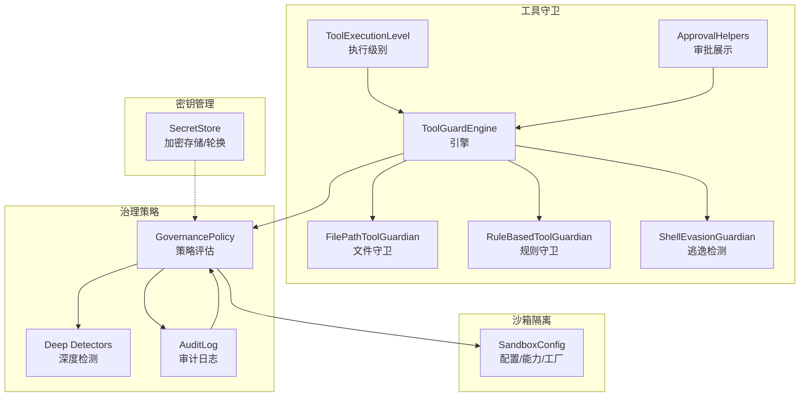
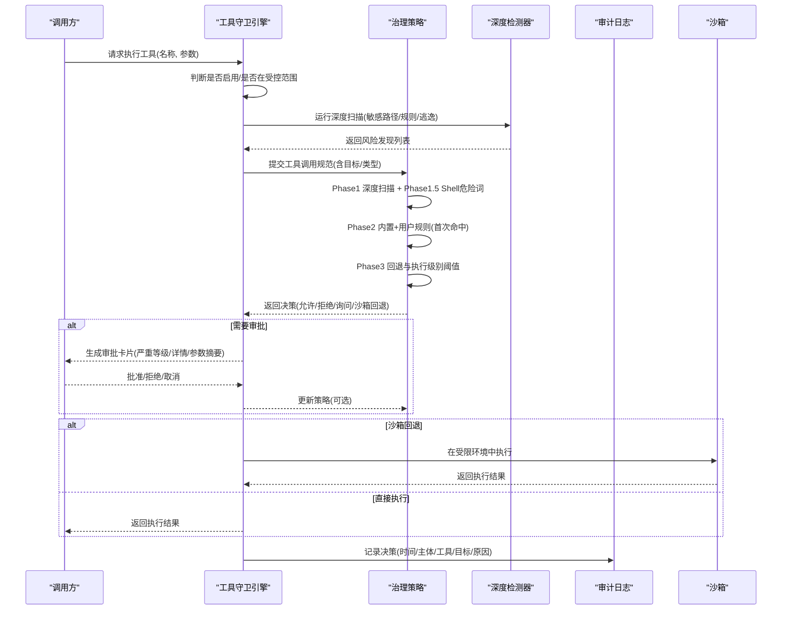
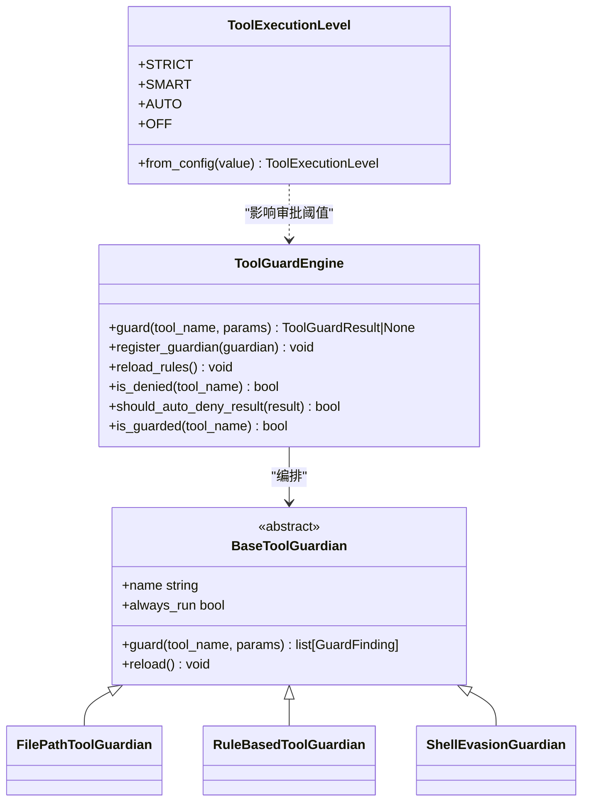
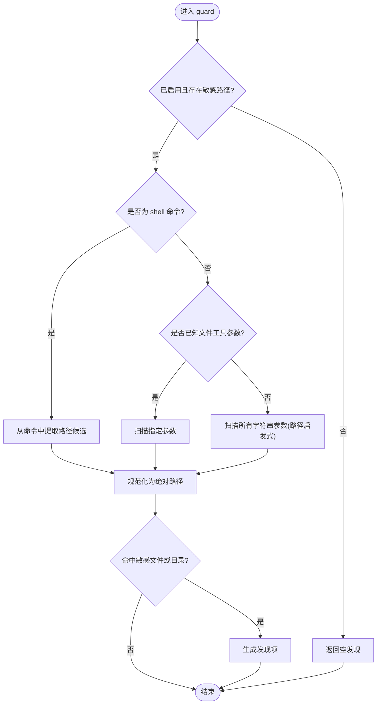
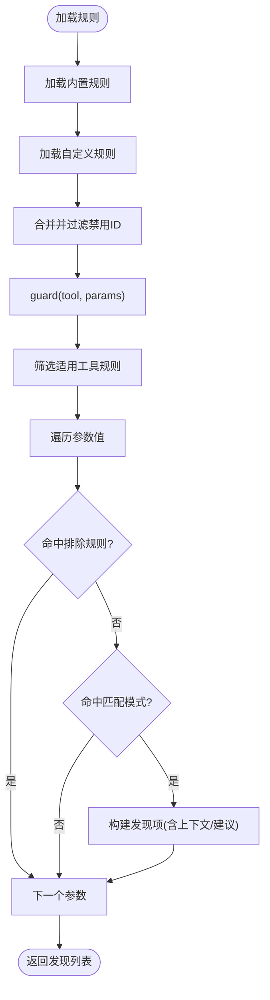
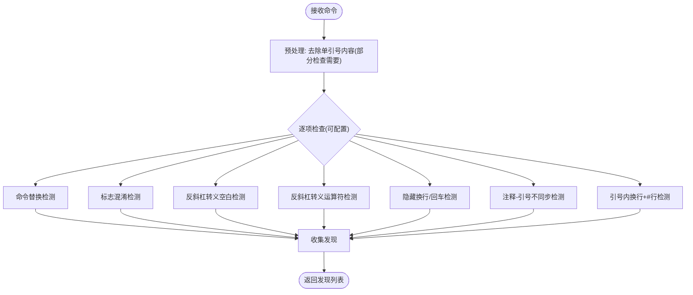
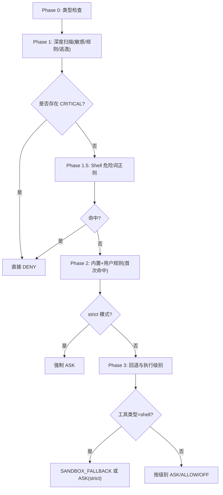
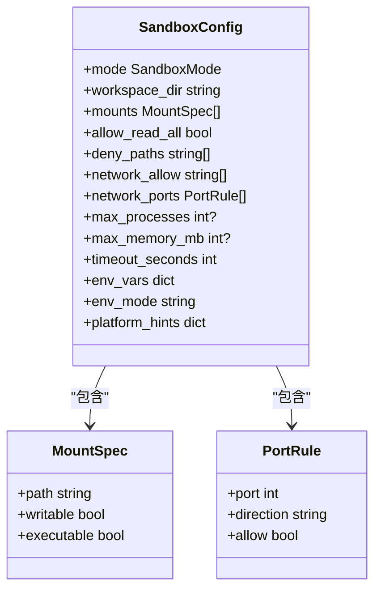
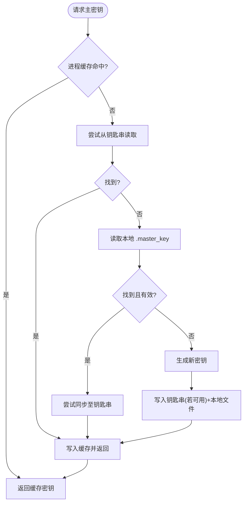
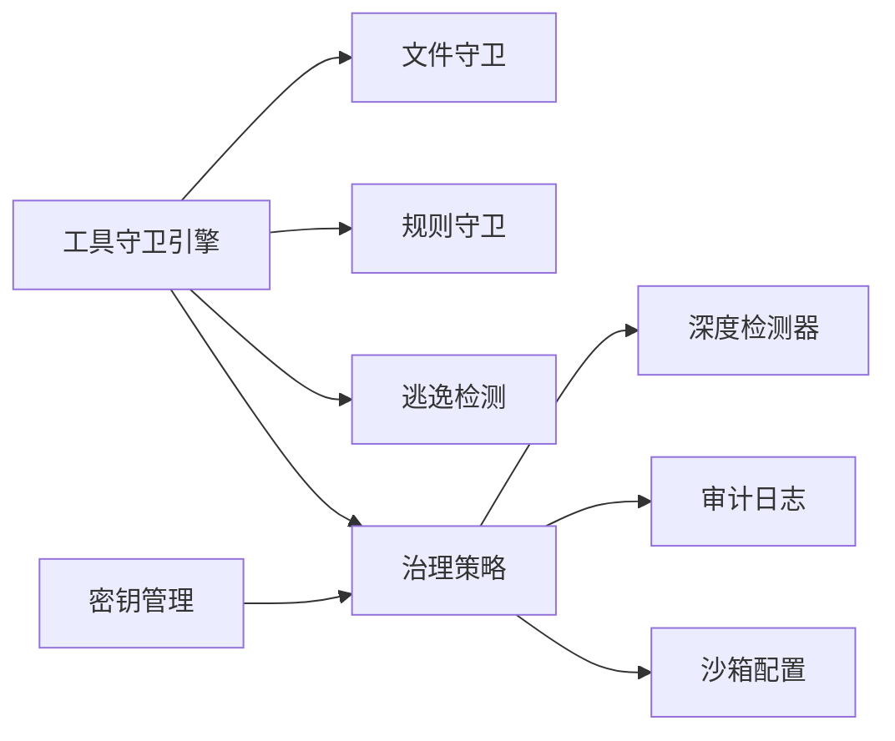

# 安全架构设计

<cite>
**本文引用的文件**   
- [engine.py](file://src/qwenpaw/security/tool_guard/engine.py)
- [execution_level.py](file://src/qwenpaw/security/tool_guard/execution_level.py)
- [approval.py](file://src/qwenpaw/security/tool_guard/approval.py)
- [file_guardian.py](file://src/qwenpaw/security/tool_guard/guardians/file_guardian.py)
- [rule_guardian.py](file://src/qwenpaw/security/tool_guard/guardians/rule_guardian.py)
- [shell_evasion_guardian.py](file://src/qwenpaw/security/tool_guard/guardians/shell_evasion_guardian.py)
- [policy.py](file://src/qwenpaw/governance/policy.py)
- [detectors.py](file://src/qwenpaw/governance/detectors.py)
- [audit.py](file://src/qwenpaw/governance/audit.py)
- [secret_store.py](file://src/qwenpaw/security/secret_store.py)
- [config.py](file://src/qwenpaw/sandbox/config.py)
</cite>

## 目录
1. [引言](#引言)
2. [项目结构](#项目结构)
3. [核心组件](#核心组件)
4. [架构总览](#架构总览)
5. [详细组件分析](#详细组件分析)
6. [依赖关系分析](#依赖关系分析)
7. [性能考虑](#性能考虑)
8. [故障排查指南](#故障排查指南)
9. [结论](#结论)
10. [附录：配置与最佳实践](#附录配置与最佳实践)

## 引言
本文件面向 QwenPaw 的安全架构，系统性阐述多层安全防护体系的设计理念与实现要点，包括：
- 沙箱隔离：跨平台能力探测、模式选择与执行约束。
- 工具守卫：规则匹配、执行级别控制与审批流程。
- 文件守卫：敏感路径识别与拦截。
- 治理策略框架：策略定义、评估引擎与执行监控。
- 密钥管理：加密存储、访问控制与轮换机制。
- 安全审计与合规性检查：决策记录、查询与清理。
- 安全配置指南与威胁防护最佳实践。

## 项目结构
QwenPaw 的安全相关代码主要分布在以下模块：
- 工具守卫与安全检测：security/tool_guard（引擎、守卫者、执行级别、审批）
- 治理策略与审计：governance（策略、检测器、审计日志）
- 沙箱隔离：sandbox（配置、能力探测、工厂）
- 密钥管理：security/secret_store

图表来源
- [engine.py:1-269](file://src/qwenpaw/security/tool_guard/engine.py#L1-L269)
- [file_guardian.py:1-501](file://src/qwenpaw/security/tool_guard/guardians/file_guardian.py#L1-L501)
- [rule_guardian.py:1-780](file://src/qwenpaw/security/tool_guard/guardians/rule_guardian.py#L1-L780)
- [shell_evasion_guardian.py:1-593](file://src/qwenpaw/security/tool_guard/guardians/shell_evasion_guardian.py#L1-L593)
- [execution_level.py:1-80](file://src/qwenpaw/security/tool_guard/execution_level.py#L1-L80)
- [approval.py:1-115](file://src/qwenpaw/security/tool_guard/approval.py#L1-L115)
- [policy.py:1-800](file://src/qwenpaw/governance/policy.py#L1-L800)
- [detectors.py:1-764](file://src/qwenpaw/governance/detectors.py#L1-L764)
- [audit.py:1-381](file://src/qwenpaw/governance/audit.py#L1-L381)
- [config.py:1-499](file://src/qwenpaw/sandbox/config.py#L1-L499)
- [secret_store.py:1-467](file://src/qwenpaw/security/secret_store.py#L1-L467)

章节来源
- [engine.py:1-269](file://src/qwenpaw/security/tool_guard/engine.py#L1-L269)
- [policy.py:1-800](file://src/qwenpaw/governance/policy.py#L1-L800)
- [config.py:1-499](file://src/qwenpaw/sandbox/config.py#L1-L499)

## 核心组件
- 工具守卫引擎：统一编排多个守卫者，聚合风险发现并支持自动拒绝、范围控制与热重载。
- 执行级别：提供 strict/smart/auto/off 四种策略，决定是否需要人工审批或自动放行。
- 审批辅助：将风险发现格式化为用户可读的审批卡片内容。
- 文件守卫：基于路径归一化与敏感目录/文件集合，拦截对敏感资源的访问。
- 规则守卫：加载 YAML 签名规则，进行正则匹配与上下文提示，增强 rm 等高危命令的工作区外检测。
- 逃逸检测：针对 shell 注入、转义、引号混淆、换行隐藏等多类绕过技术进行检测。
- 治理策略：两阶段评估（内置+用户规则），结合 Phase 1 深度扫描结果与执行级别阈值，输出最终决策。
- 审计日志：SQLite 持久化记录每次策略评估结果，支持分页查询与自动清理。
- 沙箱配置：跨平台能力探测与工厂创建，为 shell 等高风险操作提供隔离执行环境。
- 密钥管理：Fernet 对称加密，主密钥优先存于系统钥匙串，回退到本地文件，支持热重载与字段级加解密。

章节来源
- [engine.py:1-269](file://src/qwenpaw/security/tool_guard/engine.py#L1-L269)
- [execution_level.py:1-80](file://src/qwenpaw/security/tool_guard/execution_level.py#L1-L80)
- [approval.py:1-115](file://src/qwenpaw/security/tool_guard/approval.py#L1-L115)
- [file_guardian.py:1-501](file://src/qwenpaw/security/tool_guard/guardians/file_guardian.py#L1-L501)
- [rule_guardian.py:1-780](file://src/qwenpaw/security/tool_guard/guardians/rule_guardian.py#L1-L780)
- [shell_evasion_guardian.py:1-593](file://src/qwenpaw/security/tool_guard/guardians/shell_evasion_guardian.py#L1-L593)
- [policy.py:1-800](file://src/qwenpaw/governance/policy.py#L1-L800)
- [audit.py:1-381](file://src/qwenpaw/governance/audit.py#L1-L381)
- [config.py:1-499](file://src/qwenpaw/sandbox/config.py#L1-L499)
- [secret_store.py:1-467](file://src/qwenpaw/security/secret_store.py#L1-L467)

## 架构总览
下图展示了从“工具调用”到“策略评估、守卫检测、审批与沙箱执行”的端到端流程。

图表来源
- [engine.py:1-269](file://src/qwenpaw/security/tool_guard/engine.py#L1-L269)
- [policy.py:1-800](file://src/qwenpaw/governance/policy.py#L1-L800)
- [detectors.py:1-764](file://src/qwenpaw/governance/detectors.py#L1-L764)
- [audit.py:1-381](file://src/qwenpaw/governance/audit.py#L1-L381)
- [config.py:1-499](file://src/qwenpaw/sandbox/config.py#L1-L499)

## 详细组件分析

### 工具守卫引擎与执行级别
- 引擎职责
  - 维护默认守卫者集合（文件守卫、规则守卫、逃逸检测）。
  - 根据配置与环境变量决定是否启用守卫、是否仅对特定工具生效。
  - 聚合各守卫者的发现，支持“自动拒绝规则集”和“受控工具集”。
  - 提供热重载接口以动态刷新规则与工具集。
- 执行级别
  - strict：所有工具均需审批；smart：按严重等级阈值触发审批；auto：仅受控工具需审批；off：完全禁用。
- 审批展示
  - 将发现项格式化为简洁摘要与富文本通知，便于渠道审批。

图表来源
- [engine.py:1-269](file://src/qwenpaw/security/tool_guard/engine.py#L1-L269)
- [execution_level.py:1-80](file://src/qwenpaw/security/tool_guard/execution_level.py#L1-L80)
- [approval.py:1-115](file://src/qwenpaw/security/tool_guard/approval.py#L1-L115)
- [file_guardian.py:1-501](file://src/qwenpaw/security/tool_guard/guardians/file_guardian.py#L1-L501)
- [rule_guardian.py:1-780](file://src/qwenpaw/security/tool_guard/guardians/rule_guardian.py#L1-L780)
- [shell_evasion_guardian.py:1-593](file://src/qwenpaw/security/tool_guard/guardians/shell_evasion_guardian.py#L1-L593)

章节来源
- [engine.py:1-269](file://src/qwenpaw/security/tool_guard/engine.py#L1-L269)
- [execution_level.py:1-80](file://src/qwenpaw/security/tool_guard/execution_level.py#L1-L80)
- [approval.py:1-115](file://src/qwenpaw/security/tool_guard/approval.py#L1-L115)

### 文件守卫（敏感路径拦截）
- 工作原理
  - 解析工具参数中的路径候选（支持 POSIX/Windows 风格、重定向符号、引号处理）。
  - 将路径规范化为绝对路径，并与敏感文件/目录集合进行前缀匹配。
  - 对 shell 命令进行分词与重定向提取，避免通过管道/重定向绕过。
- 关键特性
  - 兼容历史与当前秘密目录名，确保默认保护生效。
  - 支持运行时重载敏感路径与开关状态。
  - 产出结构化发现项，包含匹配值、建议修复与元数据。

图表来源
- [file_guardian.py:1-501](file://src/qwenpaw/security/tool_guard/guardians/file_guardian.py#L1-L501)

章节来源
- [file_guardian.py:1-501](file://src/qwenpaw/security/tool_guard/guardians/file_guardian.py#L1-L501)

### 规则守卫（YAML 签名匹配）
- 工作原理
  - 从默认目录与配置中加载规则，合并后过滤被禁用的规则 ID。
  - 对每个适用工具的参数值进行正则匹配，支持排除规则与上下文片段。
  - 针对 rm 命令增强：解析多子命令、转义与间接调用，提取目标并校验是否位于工作区外，给出额外风险提示。
- 关键特性
  - 规则可热重载，支持自定义规则与禁用集。
  - 对高危场景提供中文/英文双语提示与 UI 元数据，辅助审批决策。

图表来源
- [rule_guardian.py:1-780](file://src/qwenpaw/security/tool_guard/guardians/rule_guardian.py#L1-L780)

章节来源
- [rule_guardian.py:1-780](file://src/qwenpaw/security/tool_guard/guardians/rule_guardian.py#L1-L780)

### 逃逸检测（Shell 混淆与绕过）
- 检测维度
  - 命令替换（$(), ``, ${}, =(), <(), >() 等）
  - ANSI-C/区域设置引号与空引号伪装标志
  - 反斜杠转义空白与运算符
  - 隐藏换行/回车与注释-引号不同步
  - 引号内换行后紧跟 # 行的参数隐藏
- 特点
  - 逐字符跟踪引号状态，区分单双引号与转义。
  - 支持按配置逐项启用/禁用，降低误报与开销。

图表来源
- [shell_evasion_guardian.py:1-593](file://src/qwenpaw/security/tool_guard/guardians/shell_evasion_guardian.py#L1-L593)

章节来源
- [shell_evasion_guardian.py:1-593](file://src/qwenpaw/security/tool_guard/guardians/shell_evasion_guardian.py#L1-L593)

### 治理策略框架（定义、评估与监控）
- 策略定义
  - 内置规则：资源保护（如 .env/.ssh/.aws/.kube 等）、高危命令 DENY。
  - 用户规则：由审批产生并可持久化，支持通配符与 glob 匹配。
  - 占位符：WORKSPACE_DIR/CODING_PROJECT_DIR 在保存时保持可移植性。
- 评估流程（v2.0）
  - Phase 0：工具注册表类型检查（未知→DENY，内部→ALLOW）。
  - Phase 1：深度扫描（敏感路径/危险模式/逃逸检测），CRITICAL 立即 DENY。
  - Phase 1.5：Shell 危险关键词正则补充（sudo、rm -rf /、fork bomb 等）。
  - Phase 2：内置+用户规则首次命中（strict 模式下 ALLOW→ASK）。
  - Phase 3：回退与执行级别阈值（shell→SANDBOX_FALLBACK，其他→按级别 ASK/ALLOW）。
- 执行监控
  - 审计日志：每条决策写入 SQLite，支持分页查询与自动清理。

图表来源
- [policy.py:1-800](file://src/qwenpaw/governance/policy.py#L1-L800)
- [detectors.py:1-764](file://src/qwenpaw/governance/detectors.py#L1-L764)
- [audit.py:1-381](file://src/qwenpaw/governance/audit.py#L1-L381)

章节来源
- [policy.py:1-800](file://src/qwenpaw/governance/policy.py#L1-L800)
- [detectors.py:1-764](file://src/qwenpaw/governance/detectors.py#L1-L764)
- [audit.py:1-381](file://src/qwenpaw/governance/audit.py#L1-L381)

### 沙箱隔离（跨平台能力与执行约束）
- 能力探测
  - Linux：优先 bubblewrap，其次 Landlock；macOS：seatbelt；Windows：AppContainer。
- 配置模型
  - 挂载点读写/可执行控制、网络域名/端口白名单、进程/内存限制、超时与环境注入策略。
- 工厂模式
  - 根据配置模式创建具体后端实例，未支持时降级为 NONE。

图表来源
- [config.py:1-499](file://src/qwenpaw/sandbox/config.py#L1-L499)

章节来源
- [config.py:1-499](file://src/qwenpaw/sandbox/config.py#L1-L499)

### 密钥管理系统（加密存储、访问控制与轮换）
- 主密钥获取顺序
  - 进程缓存 → 系统钥匙串（keyring）→ 本地文件（SECRET_DIR/.master_key，权限 0600）→ 生成新密钥并回写。
- 环境变量与兼容性
  - 支持显式覆盖 keyring account；容器/无头环境跳过 keyring 以避免阻塞。
- 加解密与迁移
  - Fernet 对称加密，密文带 ENC: 前缀；读取失败时透传明文以保证降级可用。
  - 提供字典字段批量加解密接口，支持备份恢复后的热重载。

图表来源
- [secret_store.py:1-467](file://src/qwenpaw/security/secret_store.py#L1-L467)

章节来源
- [secret_store.py:1-467](file://src/qwenpaw/security/secret_store.py#L1-L467)

## 依赖关系分析
- 组件耦合
  - 工具守卫引擎依赖三个守卫者，并通过 utils 解析受控/拒绝工具集与自动拒绝规则。
  - 治理策略在 Phase 1 复用深度检测器（与守卫者逻辑同源但无状态），在 Phase 2 使用规则匹配，在 Phase 3 依据执行级别回退。
  - 审计日志独立于策略与守卫，仅消费决策结果。
  - 沙箱配置与策略评估解耦，仅在 SANDBOX_FALLBACK 路径被调用。
  - 密钥管理为上层配置/认证提供透明加解密能力，不直接参与策略判定。
- 外部依赖
  - YAML 规则加载、wcmatch 通配匹配、keyring 系统钥匙串、cryptography Fernet、sqlite3 审计存储。

图表来源
- [engine.py:1-269](file://src/qwenpaw/security/tool_guard/engine.py#L1-L269)
- [policy.py:1-800](file://src/qwenpaw/governance/policy.py#L1-L800)
- [detectors.py:1-764](file://src/qwenpaw/governance/detectors.py#L1-L764)
- [audit.py:1-381](file://src/qwenpaw/governance/audit.py#L1-L381)
- [config.py:1-499](file://src/qwenpaw/sandbox/config.py#L1-L499)
- [secret_store.py:1-467](file://src/qwenpaw/security/secret_store.py#L1-L467)

章节来源
- [engine.py:1-269](file://src/qwenpaw/security/tool_guard/engine.py#L1-L269)
- [policy.py:1-800](file://src/qwenpaw/governance/policy.py#L1-L800)
- [detectors.py:1-764](file://src/qwenpaw/governance/detectors.py#L1-L764)
- [audit.py:1-381](file://src/qwenpaw/governance/audit.py#L1-L381)
- [config.py:1-499](file://src/qwenpaw/sandbox/config.py#L1-L499)
- [secret_store.py:1-467](file://src/qwenpaw/security/secret_store.py#L1-L467)

## 性能考虑
- 规则与正则
  - 规则守卫与深度检测器均预编译正则，并对规则内容进行缓存键化，避免重复编译。
- 路径解析
  - 文件守卫对路径进行一次性规范化与前缀匹配，减少 I/O 与系统调用。
- 异步与并发
  - 审计日志采用 WAL 模式与线程锁，避免阻塞事件循环过久；必要时可迁移至异步 IO。
- 沙箱能力探测
  - 启动时一次性探测，避免运行时反复检测带来的开销。

[本节为通用指导，无需列出具体文件来源]

## 故障排查指南
- 工具守卫未生效
  - 检查全局开关与环境变量；确认受控工具集与自动拒绝规则是否正确加载。
- 误报过多
  - 调整执行级别为 smart/auto；在规则守卫中增加 exclude_patterns；按需关闭逃逸检测项。
- 审批卡片信息不全
  - 确认发现项的 description/remediation 字段是否填充；检查参数序列化长度截断策略。
- 审计记录缺失
  - 检查 SQLite 文件位置与权限；查看异常日志；确认记录函数未被静默吞错。
- 沙箱不可用
  - 查看能力探测结果；在 Linux 上安装 bubblewrap 或升级内核以启用 Landlock；Windows 确认 AppContainer API 可用。
- 密钥无法解密
  - 检查钥匙串可用性；确认本地 .master_key 文件权限与完整性；必要时调用热重载接口重新同步。

章节来源
- [engine.py:1-269](file://src/qwenpaw/security/tool_guard/engine.py#L1-L269)
- [rule_guardian.py:1-780](file://src/qwenpaw/security/tool_guard/guardians/rule_guardian.py#L1-L780)
- [audit.py:1-381](file://src/qwenpaw/governance/audit.py#L1-L381)
- [config.py:1-499](file://src/qwenpaw/sandbox/config.py#L1-L499)
- [secret_store.py:1-467](file://src/qwenpaw/security/secret_store.py#L1-L467)

## 结论
QwenPaw 的安全架构通过“工具守卫 + 治理策略 + 沙箱隔离 + 审计与密钥管理”的多层协同，实现了从参数级检测到策略级决策再到执行级隔离的闭环防护。其优势在于：
- 可扩展：守卫者与规则均可热重载与扩展。
- 可解释：审批卡片与审计日志提供充分的可观测性。
- 可落地：跨平台沙箱与密钥管理兼顾安全性与可用性。

[本节为总结，无需列出具体文件来源]

## 附录：配置与最佳实践
- 执行级别建议
  - 生产环境推荐 smart；高安全要求场景使用 strict；开发测试可使用 auto 或 off（谨慎）。
- 规则与敏感路径
  - 定期审查与精简规则，避免过度宽松；将敏感目录纳入 sensitive_paths 与 deny_paths。
- 逃逸检测
  - 默认开启关键项；在 CI/自动化流水线中逐步放开以减少误报。
- 沙箱策略
  - 最小权限原则：只挂载必要目录为可写；严格限制网络与端口；设置合理的超时与资源上限。
- 密钥管理
  - 优先使用系统钥匙串；在容器/无头环境明确禁用 keyring 并提供安全的替代方案；定期轮换主密钥并验证解密链路。
- 审计与合规
  - 保留足够时间的审计记录；定期导出与分析高风险决策；结合策略变更进行合规基线比对。

[本节为通用指导，无需列出具体文件来源]