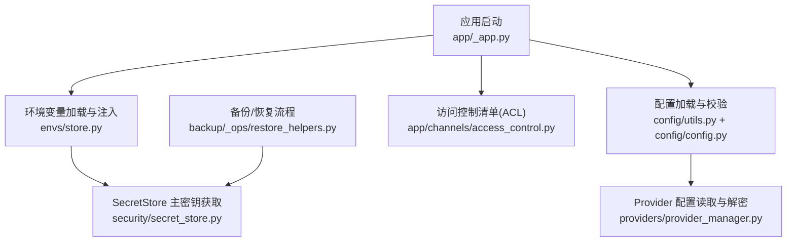
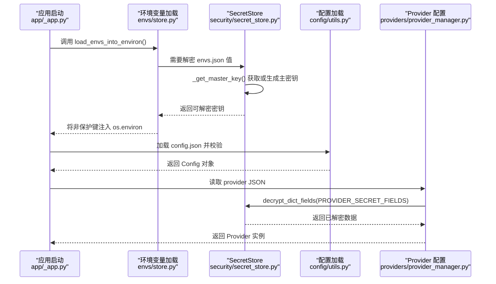
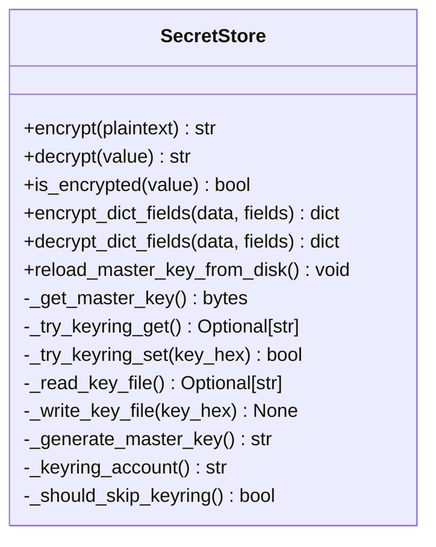
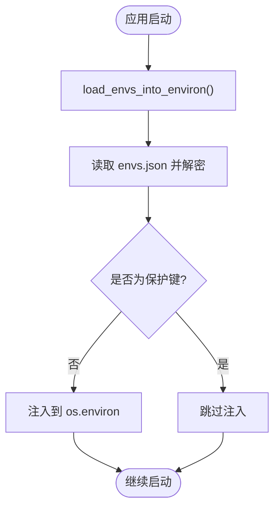
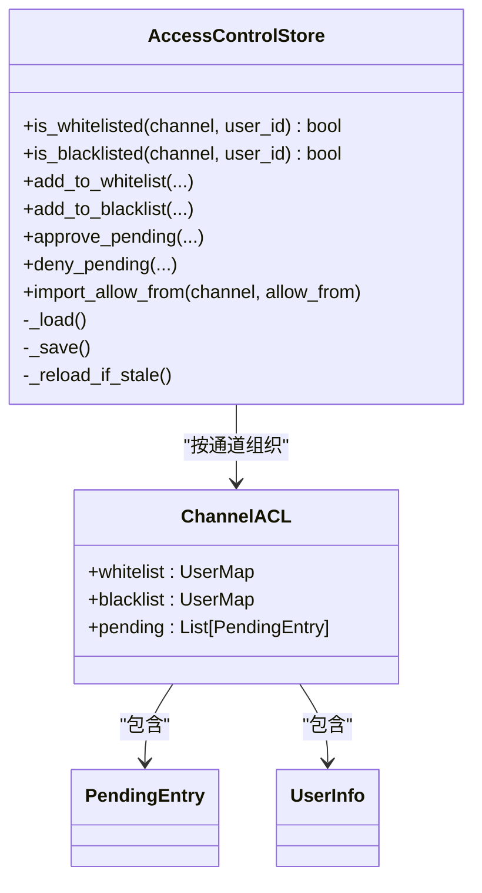
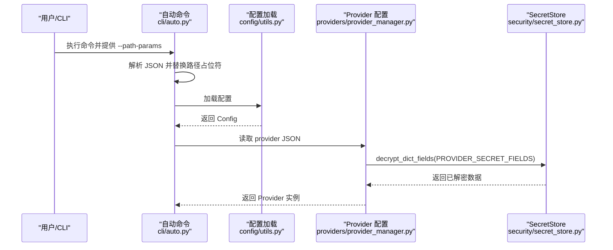
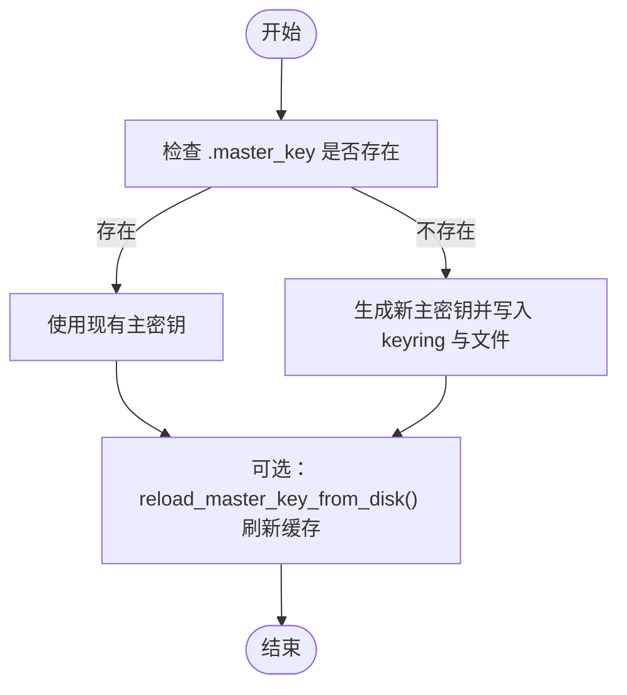
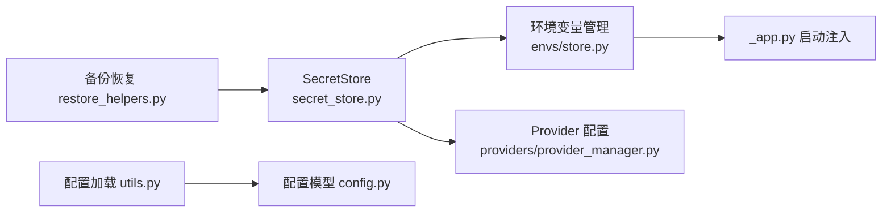

# 密钥管理系统

<cite>
**本文引用的文件列表**
- [secret_store.py](file://src/qwenpaw/security/secret_store.py)
- [store.py](file://src/qwenpaw/envs/store.py)
- [access_control.py](file://src/qwenpaw/app/channels/access_control.py)
- [config.py](file://src/qwenpaw/config/config.py)
- [utils.py](file://src/qwenpaw/config/utils.py)
- [_app.py](file://src/qwenpaw/app/_app.py)
- [provider_manager.py](file://src/qwenpaw/providers/provider_manager.py)
- [restore_helpers.py](file://src/qwenpaw/backup/_ops/restore_helpers.py)
- [test_secret_store.py](file://tests/unit/security/test_secret_store.py)
</cite>

## 目录
1. [简介](#简介)
2. [项目结构](#项目结构)
3. [核心组件](#核心组件)
4. [架构总览](#架构总览)
5. [详细组件分析](#详细组件分析)
6. [依赖关系分析](#依赖关系分析)
7. [性能与可用性考虑](#性能与可用性考虑)
8. [故障排查指南](#故障排查指南)
9. [结论](#结论)
10. [附录：最佳实践与示例](#附录最佳实践与示例)

## 简介
本文件面向 QwenPaw 的“密钥管理系统”，围绕 SecretStore 的设计原理、加密存储机制、访问控制与权限验证、环境变量安全管理（注入、敏感信息过滤、动态更新）、密钥轮换与版本管理、配置文件加密处理与占位符替换，以及审计日志与最佳实践进行系统化说明。文档同时提供实际使用示例路径，帮助在插件和工具中安全地访问敏感配置。

## 项目结构
密钥管理相关代码主要分布在以下模块：
- 加密与主密钥管理：security/secret_store.py
- 环境变量持久化与注入：envs/store.py
- 通道级访问控制：app/channels/access_control.py
- 配置加载与校验：config/config.py、config/utils.py
- 应用启动时环境注入入口：app/_app.py
- Provider 配置中的敏感字段加解密：providers/provider_manager.py
- 备份恢复时的主密钥冲突处理：backup/_ops/restore_helpers.py

图表来源
- [_app.py:71-73](file://src/qwenpaw/app/_app.py#L71-L73)
- [store.py:242-269](file://src/qwenpaw/envs/store.py#L242-L269)
- [secret_store.py:287-321](file://src/qwenpaw/security/secret_store.py#L287-L321)
- [utils.py:616-654](file://src/qwenpaw/config/utils.py#L616-L654)
- [config.py:1-120](file://src/qwenpaw/config/config.py#L1-L120)
- [provider_manager.py:1933-1964](file://src/qwenpaw/providers/provider_manager.py#L1933-L1964)
- [restore_helpers.py:145-149](file://src/qwenpaw/backup/_ops/restore_helpers.py#L145-L149)

章节来源
- [_app.py:71-73](file://src/qwenpaw/app/_app.py#L71-L73)
- [store.py:242-269](file://src/qwenpaw/envs/store.py#L242-L269)
- [secret_store.py:287-321](file://src/qwenpaw/security/secret_store.py#L287-L321)
- [utils.py:616-654](file://src/qwenpaw/config/utils.py#L616-L654)
- [config.py:1-120](file://src/qwenpaw/config/config.py#L1-L120)
- [provider_manager.py:1933-1964](file://src/qwenpaw/providers/provider_manager.py#L1933-L1964)
- [restore_helpers.py:145-149](file://src/qwenpaw/backup/_ops/restore_helpers.py#L145-L149)

## 核心组件
- SecretStore（加密存储层）
  - 负责主密钥获取与缓存、Fernet 加解密、字典字段批量加解密、进程内缓存失效与 keyring 同步。
- 环境变量管理（envs/store.py）
  - 负责 envs.json 的加密持久化、进程 os.environ 的动态注入、保护键隔离、迁移与回写。
- 访问控制清单（ACL）
  - 按通道维护白名单、黑名单与待审批队列，支持持久化与并发安全。
- 配置加载与校验
  - 负责 JSON 容错解析、Pydantic 模型校验、工作区路径归一化与历史兼容迁移。
- Provider 配置敏感字段处理
  - 读取 provider JSON 时对指定字段透明解密，并在发现明文时自动迁移为密文。
- 备份恢复与主密钥冲突处理
  - 在恢复过程中检测并处理主密钥不一致，必要时保留本地关键策略。

章节来源
- [secret_store.py:1-467](file://src/qwenpaw/security/secret_store.py#L1-L467)
- [store.py:1-270](file://src/qwenpaw/envs/store.py#L1-L270)
- [access_control.py:1-547](file://src/qwenpaw/app/channels/access_control.py#L1-L547)
- [utils.py:578-654](file://src/qwenpaw/config/utils.py#L578-L654)
- [provider_manager.py:1933-1964](file://src/qwenpaw/providers/provider_manager.py#L1933-L1964)
- [restore_helpers.py:145-149](file://src/qwenpaw/backup/_ops/restore_helpers.py#L145-L149)

## 架构总览
下图展示了从应用启动到密钥与环境变量加载、配置解析与 Provider 敏感字段处理的整体流程。

图表来源
- [_app.py:71-73](file://src/qwenpaw/app/_app.py#L71-L73)
- [store.py:242-269](file://src/qwenpaw/envs/store.py#L242-L269)
- [secret_store.py:287-321](file://src/qwenpaw/security/secret_store.py#L287-L321)
- [utils.py:616-654](file://src/qwenpaw/config/utils.py#L616-L654)
- [provider_manager.py:1933-1964](file://src/qwenpaw/providers/provider_manager.py#L1933-L1964)

## 详细组件分析

### SecretStore 设计与实现
- 主密钥来源与优先级
  - 优先尝试系统 keyring（带超时保护），失败则回退到 SECRET_DIR/.master_key 文件；若均不存在则生成新密钥并写入 keyring 与文件。
  - 通过双检锁保证多线程并发下仅生成一次主密钥。
- Keyring 账户隔离
  - 支持显式覆盖 KEYRING_ACCOUNT；未重定位安装沿用历史账户名；重定位安装基于 SECRET_DIR 派生稳定账户名，避免不同安装互相覆盖。
- 加解密接口
  - encrypt/decrypt 对字符串进行 Fernet 加解密，密文以 ENC: 前缀标识；is_encrypted 用于判断是否密文。
  - encrypt_dict_fields/decrypt_dict_fields 针对字典中的敏感字段批量处理。
- 进程内缓存与刷新
  - 主密钥与 Fernet 实例进程内缓存；提供 reload_master_key_from_disk 在备份恢复后清理缓存并同步 keyring。

图表来源
- [secret_store.py:287-321](file://src/qwenpaw/security/secret_store.py#L287-L321)
- [secret_store.py:346-379](file://src/qwenpaw/security/secret_store.py#L346-L379)
- [secret_store.py:436-466](file://src/qwenpaw/security/secret_store.py#L436-L466)
- [secret_store.py:382-423](file://src/qwenpaw/security/secret_store.py#L382-L423)
- [secret_store.py:43-82](file://src/qwenpaw/security/secret_store.py#L43-L82)
- [secret_store.py:93-130](file://src/qwenpaw/security/secret_store.py#L93-L130)

章节来源
- [secret_store.py:1-467](file://src/qwenpaw/security/secret_store.py#L1-L467)
- [test_secret_store.py:1-48](file://tests/unit/security/test_secret_store.py#L1-L48)
- [test_secret_store.py:155-195](file://tests/unit/security/test_secret_store.py#L155-L195)

### 环境变量安全管理（注入、敏感信息过滤、动态更新）
- 持久化与加密
  - envs.json 位于 SECRET_DIR，所有值在写入时自动加密；读取时透明解密；若检测到明文值会回写为密文完成迁移。
- 注入策略
  - 启动时调用 load_envs_into_environ 将非保护键注入 os.environ；保护键（如 QWENPAW_WORKING_DIR、QWENPAW_SECRET_DIR）不注入，避免被覆盖。
  - 注入时遵循“现有进程/系统环境变量优先”的原则，确保运行时显式设置不被覆盖。
- 动态更新
  - save_envs/set_env_var/delete_env_var 在修改后同步到 os.environ，保持运行期一致性。
- 迁移与兼容性
  - 首次运行会将旧位置 envs.json 迁移至 SECRET_DIR，并对权限做最佳努力设置。

图表来源
- [store.py:242-269](file://src/qwenpaw/envs/store.py#L242-L269)
- [store.py:142-180](file://src/qwenpaw/envs/store.py#L142-L180)
- [store.py:198-220](file://src/qwenpaw/envs/store.py#L198-L220)
- [store.py:56-82](file://src/qwenpaw/envs/store.py#L56-L82)

章节来源
- [store.py:1-270](file://src/qwenpaw/envs/store.py#L1-L270)
- [_app.py:71-73](file://src/qwenpaw/app/_app.py#L71-L73)

### 访问控制列表与权限验证
- 数据结构
  - AccessControlStore 按通道维护 whitelist/blacklist/pending 三张表，支持备注与用户名等元数据。
- 并发与持久化
  - 线程安全读写，支持 mtime 热重载；保存为 JSON 文件，默认位于 WORKING_DIR/access_control.json。
- 权限判定
  - 典型判定顺序：黑名单优先于白名单；pending 用户需经审批进入白名单或黑名单。
- 迁移与导入
  - 支持从 channels.allow_from 一次性导入到对应通道的白名单。

图表来源
- [access_control.py:157-547](file://src/qwenpaw/app/channels/access_control.py#L157-L547)
- [access_control.py:23-94](file://src/qwenpaw/app/channels/access_control.py#L23-L94)

章节来源
- [access_control.py:1-547](file://src/qwenpaw/app/channels/access_control.py#L1-L547)
- [test_access_control.py:132-224](file://tests/unit/app/channels/test_access_control.py#L132-L224)

### 配置文件的加密处理与占位符替换
- 配置文件加载
  - config/utils.py 负责 JSON 容错解析、Pydantic 模型校验、工作区路径归一化与历史兼容迁移。
  - config/config.py 定义各类配置模型（包括通道、心跳、内存等）。
- 占位符替换
  - 在 CLI 自动命令中支持 path_params 占位符替换（例如 {job_id}），用于构造 API 路径。
- 敏感字段处理
  - Provider 配置中的敏感字段（如 api_key）在读取时由 SecretStore 透明解密；若发现明文则自动迁移为密文并重写磁盘。

图表来源
- [auto.py:70-113](file://src/qwenpaw/cli/auto.py#L70-L113)
- [utils.py:578-654](file://src/qwenpaw/config/utils.py#L578-L654)
- [provider_manager.py:1933-1964](file://src/qwenpaw/providers/provider_manager.py#L1933-L1964)
- [secret_store.py:436-466](file://src/qwenpaw/security/secret_store.py#L436-L466)

章节来源
- [utils.py:578-654](file://src/qwenpaw/config/utils.py#L578-L654)
- [config.py:1-120](file://src/qwenpaw/config/config.py#L1-L120)
- [auto.py:70-113](file://src/qwenpaw/cli/auto.py#L70-L113)
- [provider_manager.py:1933-1964](file://src/qwenpaw/providers/provider_manager.py#L1933-L1964)

### 密钥轮换机制、版本管理与回滚支持
- 主密钥轮换
  - 当前实现未提供自动轮换策略；主密钥一旦生成即长期有效。可通过手动替换 .master_key 并调用 reload_master_key_from_disk 触发进程内缓存失效与 keyring 同步。
- 版本管理
  - 无显式的多版本主密钥管理；建议通过外部备份与恢复流程管理密钥版本。
- 回滚支持
  - 备份恢复流程在检测到主密钥不一致时会进行冲突处理（例如保留本地关键策略），从而降低误覆盖风险。

图表来源
- [secret_store.py:287-321](file://src/qwenpaw/security/secret_store.py#L287-L321)
- [secret_store.py:382-423](file://src/qwenpaw/security/secret_store.py#L382-L423)
- [restore_helpers.py:145-149](file://src/qwenpaw/backup/_ops/restore_helpers.py#L145-L149)

章节来源
- [secret_store.py:287-321](file://src/qwenpaw/security/secret_store.py#L287-L321)
- [secret_store.py:382-423](file://src/qwenpaw/security/secret_store.py#L382-L423)
- [restore_helpers.py:145-149](file://src/qwenpaw/backup/_ops/restore_helpers.py#L145-L149)

## 依赖关系分析
- SecretStore 依赖
  - 系统 keyring（可选，受环境变量与平台检测影响）
  - cryptography.Fernet（对称加密）
  - secrets（随机数生成）
  - 文件系统（SECRET_DIR/.master_key）
- 环境变量管理依赖
  - SecretStore（用于 envs.json 值的加解密）
  - 文件系统（SECRET_DIR/envs.json）
- 配置加载依赖
  - Pydantic（模型校验）
  - json_repair（JSON 容错）
- Provider 配置依赖
  - SecretStore（敏感字段解密）
- 备份恢复依赖
  - SecretStore（主密钥冲突处理与缓存刷新）

图表来源
- [secret_store.py:1-467](file://src/qwenpaw/security/secret_store.py#L1-L467)
- [store.py:1-270](file://src/qwenpaw/envs/store.py#L1-L270)
- [provider_manager.py:1933-1964](file://src/qwenpaw/providers/provider_manager.py#L1933-L1964)
- [utils.py:578-654](file://src/qwenpaw/config/utils.py#L578-L654)
- [config.py:1-120](file://src/qwenpaw/config/config.py#L1-L120)
- [restore_helpers.py:145-149](file://src/qwenpaw/backup/_ops/restore_helpers.py#L145-L149)

章节来源
- [secret_store.py:1-467](file://src/qwenpaw/security/secret_store.py#L1-L467)
- [store.py:1-270](file://src/qwenpaw/envs/store.py#L1-L270)
- [provider_manager.py:1933-1964](file://src/qwenpaw/providers/provider_manager.py#L1933-L1964)
- [utils.py:578-654](file://src/qwenpaw/config/utils.py#L578-L654)
- [config.py:1-120](file://src/qwenpaw/config/config.py#L1-L120)
- [restore_helpers.py:145-149](file://src/qwenpaw/backup/_ops/restore_helpers.py#L145-L149)

## 性能与可用性考虑
- 主密钥与 Fernet 缓存
  - 进程内缓存避免重复 I/O 与解密开销；双检锁保障并发安全。
- Keyring 超时保护
  - 通过 daemon 线程与超时机制避免在无桌面环境的系统中阻塞。
- 配置加载缓存
  - 基于 mtime 的配置缓存减少频繁磁盘读取。
- 环境变量注入
  - 仅在变更时同步到 os.environ，避免不必要的覆盖。

章节来源
- [secret_store.py:89-90](file://src/qwenpaw/security/secret_store.py#L89-L90)
- [secret_store.py:136-165](file://src/qwenpaw/security/secret_store.py#L136-L165)
- [utils.py:616-654](file://src/qwenpaw/config/utils.py#L616-L654)
- [store.py:198-220](file://src/qwenpaw/envs/store.py#L198-L220)

## 故障排查指南
- 无法解密 envs.json 或 Provider 配置
  - 检查主密钥是否一致；确认 keyring 可用或回退到文件模式；必要时调用 reload_master_key_from_disk 刷新缓存。
- 环境变量未生效
  - 确认未被保护键覆盖；检查 save_envs 是否成功写入并同步到 os.environ。
- 配置加载失败
  - 查看 config/utils.py 的容错与备份逻辑；修复 JSON 语法或移除无效字段后重试。
- 备份恢复后密钥不一致
  - 参考 restore_helpers.py 的主密钥冲突处理；必要时保留本地关键策略并重新加载。

章节来源
- [secret_store.py:382-423](file://src/qwenpaw/security/secret_store.py#L382-L423)
- [store.py:142-180](file://src/qwenpaw/envs/store.py#L142-L180)
- [utils.py:578-654](file://src/qwenpaw/config/utils.py#L578-L654)
- [restore_helpers.py:145-149](file://src/qwenpaw/backup/_ops/restore_helpers.py#L145-L149)

## 结论
QwenPaw 的密钥管理系统以 SecretStore 为核心，结合环境变量持久化、配置加载与 Provider 敏感字段处理，形成端到端的安全链路。系统在 keyring 不可用时具备稳健的回退策略，并通过进程内缓存与超时保护提升可用性与性能。ACL 提供了细粒度的通道级访问控制。尽管当前未内置自动密钥轮换，但通过备份恢复与缓存刷新机制可实现可控的密钥管理与回滚。

## 附录：最佳实践与示例

- 密钥生成规范
  - 使用 SecretStore 自动生成 32 字节随机主密钥；避免手动编辑 .master_key。
  - 在容器或 CI 环境中禁用 keyring 并依赖文件模式。
- 存储位置建议
  - 将 SECRET_DIR 置于受限权限目录；确保 .master_key 与 envs.json 的文件权限为 0o600。
- 审计日志记录
  - 关注 SecretStore 与 envs/store.py 的警告日志（如解密失败、迁移失败、权限错误），以便及时发现问题。
- 插件与工具中安全访问敏感配置
  - 通过环境变量访问：在插件中使用 os.getenv 读取已注入的非保护键。
  - 通过 Provider 配置访问：使用 providers/provider_manager.py 提供的读取接口，敏感字段会被自动解密。
  - 通过 SecretStore 直接访问：如需自定义加解密，使用 encrypt/decrypt/is_encrypted 与 encrypt_dict_fields/decrypt_dict_fields。
- 占位符替换与安全传输
  - 在 CLI 命令中使用 --path-params 传入 JSON 参数进行路径占位符替换；对外传输敏感数据应使用 HTTPS 与鉴权头。

章节来源
- [secret_store.py:346-379](file://src/qwenpaw/security/secret_store.py#L346-L379)
- [store.py:198-220](file://src/qwenpaw/envs/store.py#L198-L220)
- [provider_manager.py:1933-1964](file://src/qwenpaw/providers/provider_manager.py#L1933-L1964)
- [auto.py:70-113](file://src/qwenpaw/cli/auto.py#L70-L113)