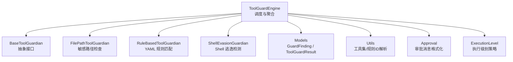
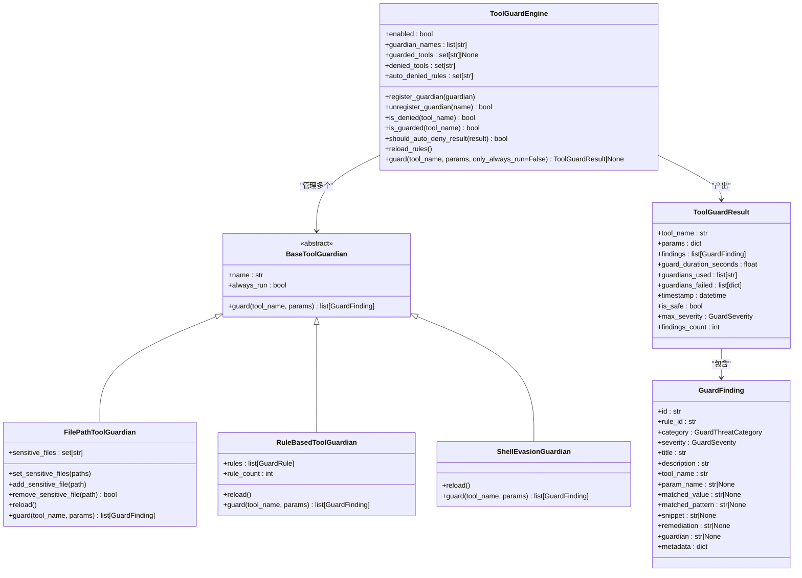
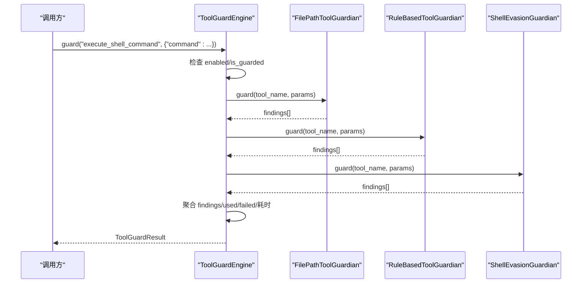
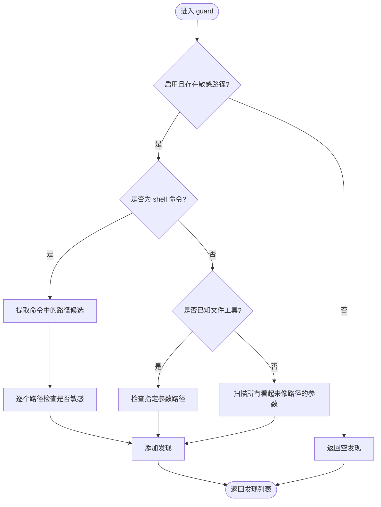
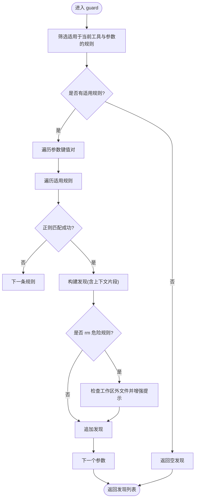
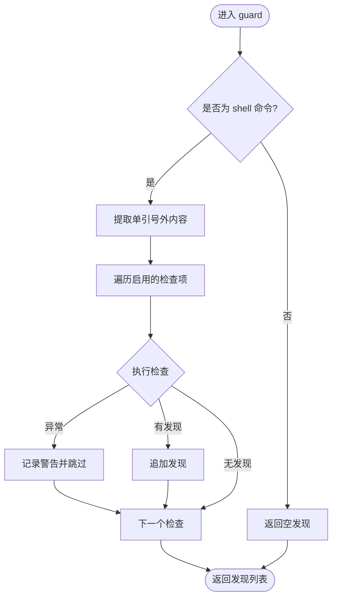
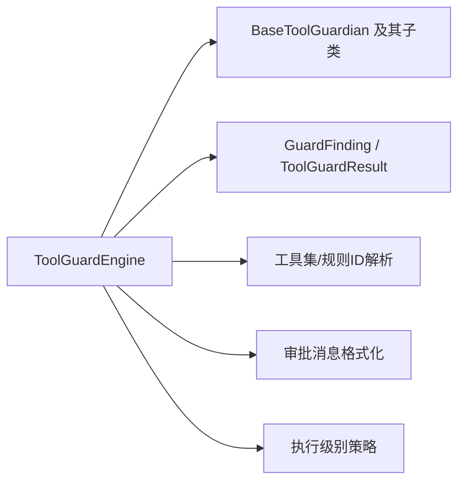
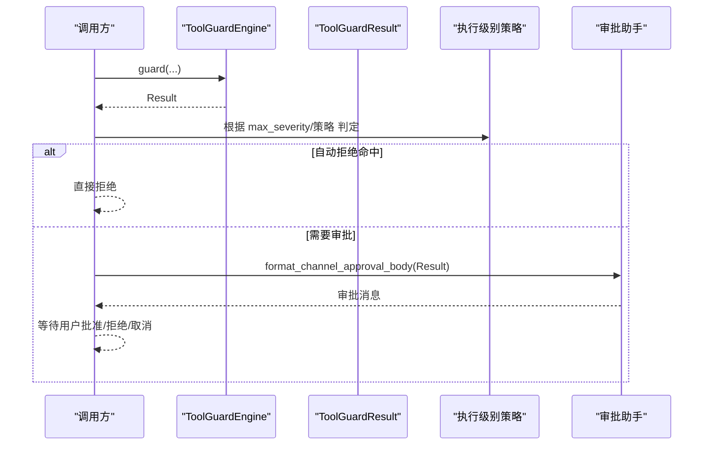

# 工具守卫系统

<cite>
**本文引用的文件列表**
- [engine.py](file://src/qwenpaw/security/tool_guard/engine.py)
- [guardians/__init__.py](file://src/qwenpaw/security/tool_guard/guardians/__init__.py)
- [file_guardian.py](file://src/qwenpaw/security/tool_guard/guardians/file_guardian.py)
- [rule_guardian.py](file://src/qwenpaw/security/tool_guard/guardians/rule_guardian.py)
- [shell_evasion_guardian.py](file://src/qwenpaw/security/tool_guard/guardians/shell_evasion_guardian.py)
- [models.py](file://src/qwenpaw/security/tool_guard/models.py)
- [approval.py](file://src/qwenpaw/security/tool_guard/approval.py)
- [execution_level.py](file://src/qwenpaw/security/tool_guard/execution_level.py)
- [utils.py](file://src/qwenpaw/security/tool_guard/utils.py)
</cite>

## 目录
1. [简介](#简介)
2. [项目结构](#项目结构)
3. [核心组件](#核心组件)
4. [架构总览](#架构总览)
5. [详细组件分析](#详细组件分析)
6. [依赖关系分析](#依赖关系分析)
7. [性能与执行级别控制](#性能与执行级别控制)
8. [审批流程与结果聚合](#审批流程与结果聚合)
9. [自定义守卫器开发指南](#自定义守卫器开发指南)
10. [故障排查](#故障排查)
11. [结论](#结论)

## 简介
本文件面向 QwenPaw 的工具守卫系统，系统性阐述 ToolGuardEngine 的工作原理、守卫器注册机制、规则匹配引擎与执行级别控制；详解内置守卫器 FilePathToolGuardian、RuleBasedToolGuardian、ShellEvasionGuardian 的实现要点；记录工具调用审批流程（自动拒绝、手动审批触发、结果聚合）；并提供自定义守卫器的接口规范、规则定义格式与配置选项说明，辅以实际代码示例路径以展示如何检测和阻止危险操作。

## 项目结构
工具守卫子系统位于 security/tool_guard 目录下，围绕“引擎 + 守卫器 + 模型 + 审批 + 执行级别”的清晰分层组织：
- 引擎层：ToolGuardEngine 负责调度所有已注册的守卫器，汇总结果并暴露开关、作用域与自动拒绝策略等能力。
- 守卫器层：BaseToolGuardian 抽象基类，具体实现包括文件路径守卫、规则匹配守卫、Shell 逃逸检测守卫。
- 数据模型：GuardFinding、ToolGuardResult 等结构化对象贯穿全链路。
- 审批辅助：ApprovalDecision、ApprovalScope 及格式化输出，用于将风险发现转化为可操作的审批消息。
- 执行级别：ToolExecutionLevel 提供 STRICT/SMART/AUTO/OFF 多种策略。
- 工具集解析：resolve_guarded_tools、resolve_denied_tools、resolve_auto_denied_rules 从环境变量或配置中解析守卫范围与拒绝策略。

图表来源
- [engine.py:54-269](file://src/qwenpaw/security/tool_guard/engine.py#L54-L269)
- [guardians/__init__.py:17-61](file://src/qwenpaw/security/tool_guard/guardians/__init__.py#L17-L61)
- [file_guardian.py:301-500](file://src/qwenpaw/security/tool_guard/guardians/file_guardian.py#L301-L500)
- [rule_guardian.py:581-779](file://src/qwenpaw/security/tool_guard/guardians/rule_guardian.py#L581-L779)
- [shell_evasion_guardian.py:539-592](file://src/qwenpaw/security/tool_guard/guardians/shell_evasion_guardian.py#L539-L592)
- [models.py:60-185](file://src/qwenpaw/security/tool_guard/models.py#L60-L185)
- [utils.py:64-156](file://src/qwenpaw/security/tool_guard/utils.py#L64-L156)
- [approval.py:13-115](file://src/qwenpaw/security/tool_guard/approval.py#L13-L115)
- [execution_level.py:15-80](file://src/qwenpaw/security/tool_guard/execution_level.py#L15-L80)

章节来源
- [engine.py:54-269](file://src/qwenpaw/security/tool_guard/engine.py#L54-L269)
- [guardians/__init__.py:17-61](file://src/qwenpaw/security/tool_guard/guardians/__init__.py#L17-L61)
- [file_guardian.py:301-500](file://src/qwenpaw/security/tool_guard/guardians/file_guardian.py#L301-L500)
- [rule_guardian.py:581-779](file://src/qwenpaw/security/tool_guard/guardians/rule_guardian.py#L581-L779)
- [shell_evasion_guardian.py:539-592](file://src/qwenpaw/security/tool_guard/guardians/shell_evasion_guardian.py#L539-L592)
- [models.py:60-185](file://src/qwenpaw/security/tool_guard/models.py#L60-L185)
- [utils.py:64-156](file://src/qwenpaw/security/tool_guard/utils.py#L64-L156)
- [approval.py:13-115](file://src/qwenpaw/security/tool_guard/approval.py#L13-L115)
- [execution_level.py:15-80](file://src/qwenpaw/security/tool_guard/execution_level.py#L15-L80)

## 核心组件
- ToolGuardEngine：守卫编排器，维护守卫器集合、守卫范围、无条件拒绝工具集、自动拒绝规则集，并在 guard() 中顺序执行守卫器，聚合 GuardFinding 到 ToolGuardResult。
- BaseToolGuardian：抽象基类，要求实现 guard(tool_name, params) -> list[GuardFinding]，支持 always_run 标记以在受限范围内仍强制运行。
- 内置守卫器：
  - FilePathToolGuardian：基于敏感文件/目录白名单/黑名单进行路径级拦截，对 shell 命令参数做路径提取与规范化。
  - RuleBasedToolGuardian：加载 YAML 规则与配置自定义规则，按工具名与参数名过滤后对字符串化参数值进行正则匹配，增强 rm 命令工作区外文件提示。
  - ShellEvasionGuardian：针对 execute_shell_command 的引号感知逃逸与混淆检测，包含命令替换、标志位混淆、反斜杠转义、换行隐藏、注释-引号失配等。
- 数据模型：GuardFinding 描述单次发现，ToolGuardResult 聚合一次调用的全部发现、耗时、使用的守卫器等。
- 审批辅助：ApprovalDecision/ApprovalScope 与格式化函数，便于将风险发现转换为渠道通知与用户审批动作。
- 执行级别：ToolExecutionLevel 提供 STRICT/SMART/AUTO/OFF 四种策略，决定何时需要人工审批。
- 工具集解析：resolve_guarded_tools/denied_tools/auto_denied_rules 从构造参数、环境变量、配置文件解析守卫范围与拒绝策略。

章节来源
- [engine.py:54-269](file://src/qwenpaw/security/tool_guard/engine.py#L54-L269)
- [guardians/__init__.py:17-61](file://src/qwenpaw/security/tool_guard/guardians/__init__.py#L17-L61)
- [file_guardian.py:301-500](file://src/qwenpaw/security/tool_guard/guardians/file_guardian.py#L301-L500)
- [rule_guardian.py:581-779](file://src/qwenpaw/security/tool_guard/guardians/rule_guardian.py#L581-L779)
- [shell_evasion_guardian.py:539-592](file://src/qwenpaw/security/tool_guard/guardians/shell_evasion_guardian.py#L539-L592)
- [models.py:60-185](file://src/qwenpaw/security/tool_guard/models.py#L60-L185)
- [approval.py:13-115](file://src/qwenpaw/security/tool_guard/approval.py#L13-L115)
- [execution_level.py:15-80](file://src/qwenpaw/security/tool_guard/execution_level.py#L15-L80)
- [utils.py:64-156](file://src/qwenpaw/security/tool_guard/utils.py#L64-L156)

## 架构总览
ToolGuardEngine 作为入口，初始化时根据是否传入自定义守卫器选择默认守卫器集合（文件路径、规则匹配、Shell 逃逸），并从配置与环境变量解析守卫范围、无条件拒绝工具集与自动拒绝规则集。每次工具调用前，调用 guard() 遍历守卫器，收集 GuardFinding，最终返回 ToolGuardResult。上层可根据 is_safe、max_severity、should_auto_deny_result 以及执行级别策略决定是否放行、进入审批流或直接拒绝。

图表来源
- [engine.py:54-269](file://src/qwenpaw/security/tool_guard/engine.py#L54-L269)
- [guardians/__init__.py:17-61](file://src/qwenpaw/security/tool_guard/guardians/__init__.py#L17-L61)
- [file_guardian.py:301-500](file://src/qwenpaw/security/tool_guard/guardians/file_guardian.py#L301-L500)
- [rule_guardian.py:581-779](file://src/qwenpaw/security/tool_guard/guardians/rule_guardian.py#L581-L779)
- [shell_evasion_guardian.py:539-592](file://src/qwenpaw/security/tool_guard/guardians/shell_evasion_guardian.py#L539-L592)
- [models.py:60-185](file://src/qwenpaw/security/tool_guard/models.py#L60-L185)

## 详细组件分析

### ToolGuardEngine 工作原理
- 守卫器注册机制
  - 构造时可传入自定义守卫器列表；否则使用默认集合（文件路径、规则匹配、Shell 逃逸）。
  - 运行时可通过 register_guardian/unregister_guardian 动态增删守卫器。
- 规则匹配引擎
  - 通过 reload_rules() 触发各守卫器的 reload()（若实现），并刷新 guarded_tools/denied_tools/auto_denied_rules。
  - should_auto_deny_result() 判断是否存在命中 auto_denied_rules 的发现，从而直接拒绝。
- 执行级别控制
  - enabled 属性受环境变量 QWENPAW_TOOL_GUARD_ENABLED 或配置项 security.tool_guard.enabled 控制。
  - is_guarded() 依据 guarded_tools 判定是否在守卫范围内；only_always_run=True 时仅执行 always_run=True 的守卫器。
- 核心流程
  - guard() 创建 ToolGuardResult，遍历守卫器执行 guard()，捕获异常并记录失败信息，统计耗时。

图表来源
- [engine.py:200-257](file://src/qwenpaw/security/tool_guard/engine.py#L200-L257)
- [file_guardian.py:449-500](file://src/qwenpaw/security/tool_guard/guardians/file_guardian.py#L449-L500)
- [rule_guardian.py:630-779](file://src/qwenpaw/security/tool_guard/guardians/rule_guardian.py#L630-L779)
- [shell_evasion_guardian.py:555-592](file://src/qwenpaw/security/tool_guard/guardians/shell_evasion_guardian.py#L555-L592)

章节来源
- [engine.py:54-269](file://src/qwenpaw/security/tool_guard/engine.py#L54-L269)

### FilePathToolGuardian（文件路径安全检查）
- 功能要点
  - 支持敏感文件与敏感目录集合，区分精确文件与目录前缀匹配。
  - 对 shell 命令参数中的路径进行提取（考虑重定向、引号、Windows/POSIX 兼容）。
  - 对所有工具的字符串参数进行启发式路径识别扫描。
- 关键逻辑
  - _normalize_path/_looks_like_path_token/_extract_paths_from_shell_command 完成路径候选抽取与标准化。
  - _is_sensitive 对绝对路径进行精确或目录前缀匹配。
  - guard() 分支处理：shell 命令专用路径提取、已知文件工具特定参数、其他工具全参扫描。
- 典型用例
  - 阻止访问 .qwenpaw.secret 目录或其子路径。
  - 阻止读取/写入敏感配置文件。

图表来源
- [file_guardian.py:449-500](file://src/qwenpaw/security/tool_guard/guardians/file_guardian.py#L449-L500)
- [file_guardian.py:246-298](file://src/qwenpaw/security/tool_guard/guardians/file_guardian.py#L246-L298)
- [file_guardian.py:125-144](file://src/qwenpaw/security/tool_guard/guardians/file_guardian.py#L125-L144)

章节来源
- [file_guardian.py:301-500](file://src/qwenpaw/security/tool_guard/guardians/file_guardian.py#L301-L500)

### RuleBasedToolGuardian（规则基守卫器）
- 功能要点
  - 从内置 rules 目录与配置 custom_rules 加载规则，支持 disabled_rules 禁用。
  - 按 tool/params 过滤适用规则，对参数值进行正则匹配，生成 GuardFinding。
  - 针对 rm 命令增强：检测目标是否在工作区外，附加中文/英文提示与 UI 元数据。
- 规则定义格式（YAML）
  - id、tools/params、category、severity、patterns、exclude_patterns、description、remediation。
- 关键逻辑
  - load_rules_from_directory/load_rules_from_yaml 加载规则。
  - GuardRule.applies_to_tool/applies_to_param/match 进行匹配。
  - _check_rm_targets_outside_workspace 解析 rm 目标并判断是否越界。

图表来源
- [rule_guardian.py:630-779](file://src/qwenpaw/security/tool_guard/guardians/rule_guardian.py#L630-L779)
- [rule_guardian.py:454-532](file://src/qwenpaw/security/tool_guard/guardians/rule_guardian.py#L454-L532)
- [rule_guardian.py:313-345](file://src/qwenpaw/security/tool_guard/guardians/rule_guardian.py#L313-L345)

章节来源
- [rule_guardian.py:581-779](file://src/qwenpaw/security/tool_guard/guardians/rule_guardian.py#L581-L779)

### ShellEvasionGuardian（Shell 逃逸检测）
- 功能要点
  - 仅对 execute_shell_command 生效。
  - 检测命令替换、标志位混淆、反斜杠转义空白/运算符、隐藏换行、注释-引号失配、引号内换行+下一行注释等。
  - 支持按 check_name 维度启用/禁用检查项。
- 关键逻辑
  - _QuoteState 跟踪引号状态，避免误判。
  - 预计算单引号外内容供部分检查使用。
  - 逐项检查，异常被捕获并记录日志，不影响整体流程。

图表来源
- [shell_evasion_guardian.py:555-592](file://src/qwenpaw/security/tool_guard/guardians/shell_evasion_guardian.py#L555-L592)
- [shell_evasion_guardian.py:61-106](file://src/qwenpaw/security/tool_guard/guardians/shell_evasion_guardian.py#L61-L106)

章节来源
- [shell_evasion_guardian.py:539-592](file://src/qwenpaw/security/tool_guard/guardians/shell_evasion_guardian.py#L539-L592)

## 依赖关系分析
- 引擎依赖守卫器抽象与具体实现，依赖 models 产出结果，依赖 utils 解析工具集与规则 ID，依赖 approval 与 execution_level 进行决策与展示。
- 守卫器之间相互独立，通过统一接口与模型交互，耦合度低、内聚度高。
- 外部依赖主要为配置加载与常量（如工作区、密钥目录），在异常情况下具备降级与默认行为。

图表来源
- [engine.py:54-269](file://src/qwenpaw/security/tool_guard/engine.py#L54-L269)
- [utils.py:64-156](file://src/qwenpaw/security/tool_guard/utils.py#L64-L156)
- [approval.py:13-115](file://src/qwenpaw/security/tool_guard/approval.py#L13-L115)
- [execution_level.py:15-80](file://src/qwenpaw/security/tool_guard/execution_level.py#L15-L80)

章节来源
- [engine.py:54-269](file://src/qwenpaw/security/tool_guard/engine.py#L54-L269)
- [utils.py:64-156](file://src/qwenpaw/security/tool_guard/utils.py#L64-L156)
- [approval.py:13-115](file://src/qwenpaw/security/tool_guard/approval.py#L13-L115)
- [execution_level.py:15-80](file://src/qwenpaw/security/tool_guard/execution_level.py#L15-L80)

## 性能与执行级别控制
- 性能特性
  - 守卫器执行顺序固定，异常隔离，单个守卫器失败不影响整体。
  - 规则匹配采用预编译正则，减少重复开销。
  - 文件路径检查对 shell 命令进行一次性路径提取与去重，降低重复扫描成本。
- 执行级别控制
  - ToolExecutionLevel.STRICT：所有工具均需审批。
  - ToolExecutionLevel.SMART：低风险自动放行，中等及以上需审批。
  - ToolExecutionLevel.AUTO：仅守卫范围内的工具需审批（向后兼容）。
  - ToolExecutionLevel.OFF：完全关闭守卫。
  - 结合 should_auto_deny_result 与 denied_tools 可实现强拒绝策略。

章节来源
- [execution_level.py:15-80](file://src/qwenpaw/security/tool_guard/execution_level.py#L15-L80)
- [engine.py:177-188](file://src/qwenpaw/security/tool_guard/engine.py#L177-L188)
- [utils.py:99-156](file://src/qwenpaw/security/tool_guard/utils.py#L99-L156)

## 审批流程与结果聚合
- 结果聚合
  - ToolGuardResult 聚合 findings、guardians_used、guardians_failed、耗时与时间戳，并提供 is_safe、max_severity、findings_count 等便捷属性。
- 自动拒绝
  - should_auto_deny_result 判断是否存在命中 auto_denied_rules 的发现，若为真则无需进入审批流直接拒绝。
- 手动审批触发
  - 当未命中自动拒绝且风险达到阈值（由执行级别策略决定）时，使用 format_channel_approval_body/format_findings_summary 生成审批消息，引导用户批准/拒绝/取消/列出。
- 决策范围
  - ApprovalDecision 表示批准/拒绝/超时；ApprovalScope 表示批准记忆范围（精确/相似）。

图表来源
- [models.py:103-185](file://src/qwenpaw/security/tool_guard/models.py#L103-L185)
- [engine.py:177-188](file://src/qwenpaw/security/tool_guard/engine.py#L177-L188)
- [approval.py:32-115](file://src/qwenpaw/security/tool_guard/approval.py#L32-L115)
- [execution_level.py:15-80](file://src/qwenpaw/security/tool_guard/execution_level.py#L15-L80)

章节来源
- [models.py:103-185](file://src/qwenpaw/security/tool_guard/models.py#L103-L185)
- [approval.py:32-115](file://src/qwenpaw/security/tool_guard/approval.py#L32-L115)
- [engine.py:177-188](file://src/qwenpaw/security/tool_guard/engine.py#L177-L188)
- [execution_level.py:15-80](file://src/qwenpaw/security/tool_guard/execution_level.py#L15-L80)

## 自定义守卫器开发指南
- 接口规范
  - 继承 BaseToolGuardian，实现 guard(tool_name, params) -> list[GuardFinding]。
  - 可选实现 reload() 以支持热重载。
  - 通过 always_run 控制是否在所有场景下都执行（例如路径检查）。
- 规则定义格式（YAML）
  - 字段：id、tools/params、category、severity、patterns、exclude_patterns、description、remediation。
  - tools/params 可为字符串或列表，空表示匹配所有工具/参数。
- 配置选项
  - 守卫范围：QWENPAW_TOOL_GUARD_TOOLS 或 config.security.tool_guard.guarded_tools。
  - 无条件拒绝工具：QWENPAW_TOOL_GUARD_DENIED_TOOLS 或 config.security.tool_guard.denied_tools。
  - 自动拒绝规则：QWENPAW_TOOL_GUARD_AUTO_DENIED_RULES 或 config.security.tool_guard.auto_denied_rules。
  - 文件守卫：config.security.file_guard.enabled 与 sensitive_files。
  - Shell 逃逸检查：config.security.tool_guard.shell_evasion_checks 字典，键为检查名，值为布尔。
- 示例路径（不展示代码内容）
  - 自定义守卫器类与注册：参考 [engine.py:116-125](file://src/qwenpaw/security/tool_guard/engine.py#L116-L125)。
  - 规则加载与匹配：参考 [rule_guardian.py:454-532](file://src/qwenpaw/security/tool_guard/guardians/rule_guardian.py#L454-L532)、[rule_guardian.py:630-779](file://src/qwenpaw/security/tool_guard/guardians/rule_guardian.py#L630-L779)。
  - 文件路径检查与敏感目录：参考 [file_guardian.py:301-500](file://src/qwenpaw/security/tool_guard/guardians/file_guardian.py#L301-L500)。
  - Shell 逃逸检测：参考 [shell_evasion_guardian.py:539-592](file://src/qwenpaw/security/tool_guard/guardians/shell_evasion_guardian.py#L539-L592)。

章节来源
- [guardians/__init__.py:17-61](file://src/qwenpaw/security/tool_guard/guardians/__init__.py#L17-L61)
- [engine.py:116-125](file://src/qwenpaw/security/tool_guard/engine.py#L116-L125)
- [rule_guardian.py:454-532](file://src/qwenpaw/security/tool_guard/guardians/rule_guardian.py#L454-L532)
- [rule_guardian.py:630-779](file://src/qwenpaw/security/tool_guard/guardians/rule_guardian.py#L630-L779)
- [file_guardian.py:301-500](file://src/qwenpaw/security/tool_guard/guardians/file_guardian.py#L301-L500)
- [shell_evasion_guardian.py:539-592](file://src/qwenpaw/security/tool_guard/guardians/shell_evasion_guardian.py#L539-L592)

## 故障排查
- 常见现象与建议
  - 守卫器初始化失败：默认守卫器初始化异常会被捕获并记录警告，不会中断引擎启动。建议检查配置与权限。
  - 规则加载失败：YAML 语法错误或规则字段缺失会被跳过并记录警告。建议校验规则格式。
  - Shell 逃逸检查异常：单项检查异常被捕获并记录，不影响其他检查。建议逐步启用检查项定位问题。
  - 路径解析不一致：注意 Windows/POSIX 差异与相对路径解析，确保工作区设置正确。
- 定位方法
  - 查看日志中的 [TOOL GUARD] 摘要与详细条目，关注 max_severity 与 duration。
  - 使用 guardian_names 与 guardians_failed 确认哪些守卫器参与与失败。
  - 通过 reload_rules() 重新加载规则与工具集，验证配置变更生效。

章节来源
- [engine.py:85-110](file://src/qwenpaw/security/tool_guard/engine.py#L85-L110)
- [rule_guardian.py:454-532](file://src/qwenpaw/security/tool_guard/guardians/rule_guardian.py#L454-L532)
- [shell_evasion_guardian.py:576-588](file://src/qwenpaw/security/tool_guard/guardians/shell_evasion_guardian.py#L576-L588)
- [utils.py:159-194](file://src/qwenpaw/security/tool_guard/utils.py#L159-L194)

## 结论
QwenPaw 工具守卫系统以 ToolGuardEngine 为核心，通过可扩展的 BaseToolGuardian 接口与多类型内置守卫器，实现对工具调用的前置安全审查。其灵活的规则体系、严格的自动拒绝策略与友好的审批消息，配合执行级别控制，能够在安全性与可用性之间取得良好平衡。开发者可按接口规范快速扩展自定义守卫器，并通过 YAML 规则与配置项精细调整保护策略。