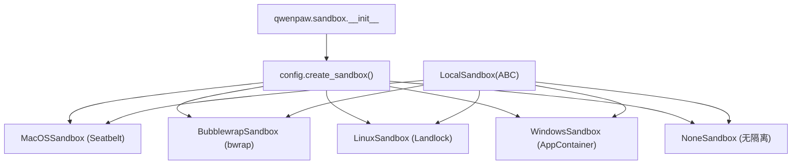
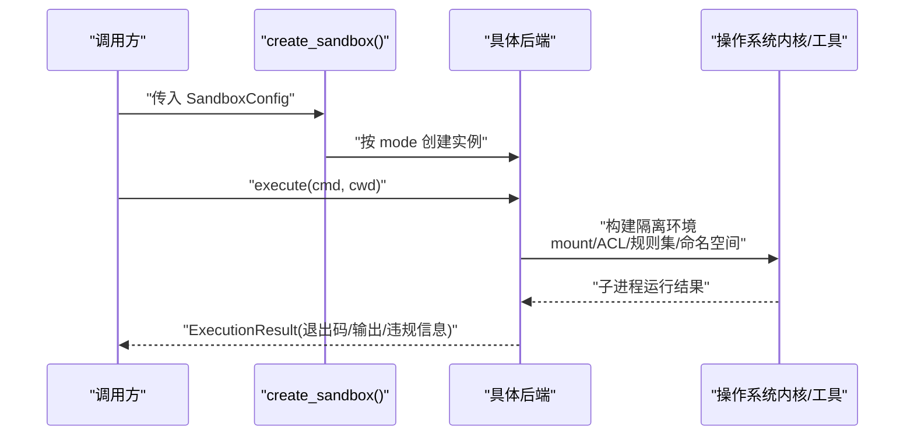
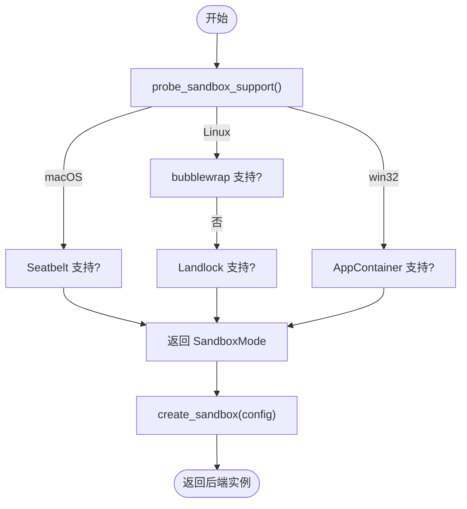
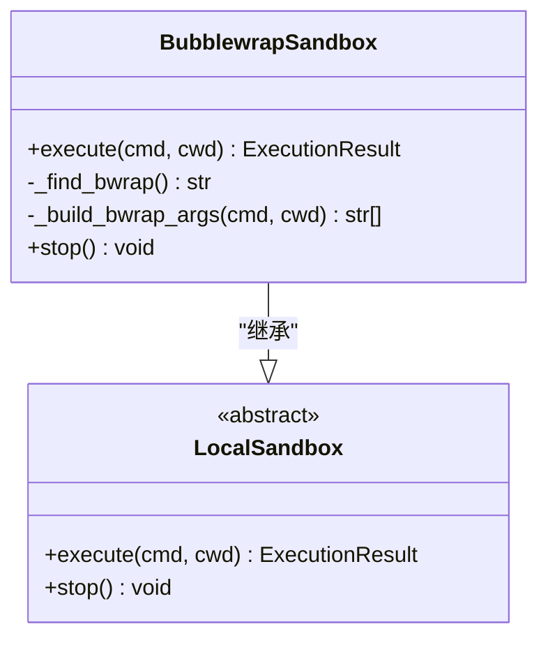
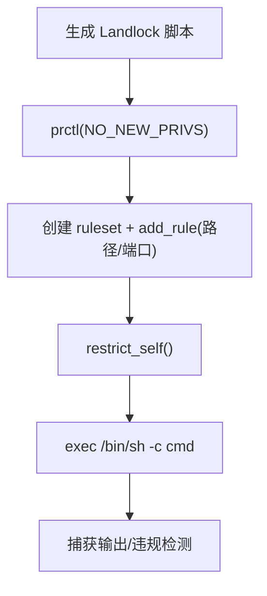
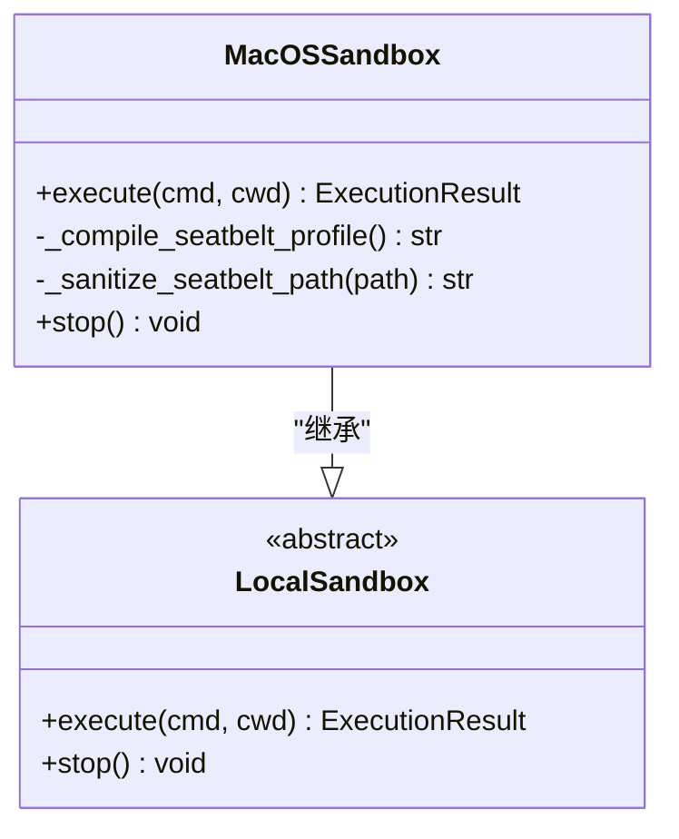
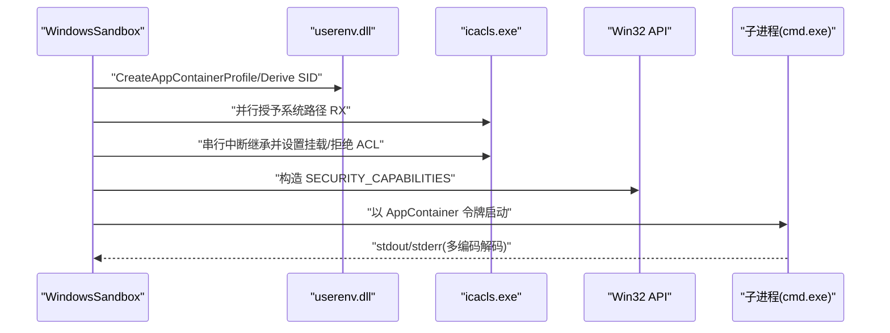
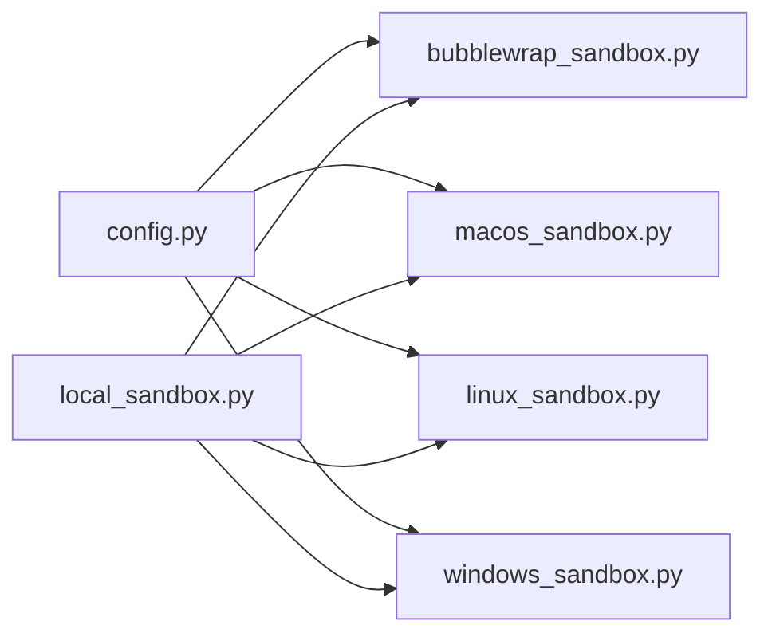

# 沙箱隔离机制

<cite>
**本文引用的文件**   
- [src/qwenpaw/sandbox/__init__.py](file://src/qwenpaw/sandbox/__init__.py)
- [src/qwenpaw/sandbox/config.py](file://src/qwenpaw/sandbox/config.py)
- [src/qwenpaw/sandbox/local_sandbox.py](file://src/qwenpaw/sandbox/local_sandbox.py)
- [src/qwenpaw/sandbox/bubblewrap_sandbox.py](file://src/qwenpaw/sandbox/bubblewrap_sandbox.py)
- [src/qwenpaw/sandbox/macos_sandbox.py](file://src/qwenpaw/sandbox/macos_sandbox.py)
- [src/qwenpaw/sandbox/linux_sandbox.py](file://src/qwenpaw/sandbox/linux_sandbox.py)
- [src/qwenpaw/sandbox/windows_sandbox.py](file://src/qwenpaw/sandbox/windows_sandbox.py)
- [src/qwenpaw/config/config.py](file://src/qwenpaw/config/config.py)
</cite>

## 目录
1. [简介](#简介)
2. [项目结构](#项目结构)
3. [核心组件](#核心组件)
4. [架构总览](#架构总览)
5. [详细组件分析](#详细组件分析)
6. [依赖关系分析](#依赖关系分析)
7. [性能与调优建议](#性能与调优建议)
8. [故障排除指南](#故障排除指南)
9. [结论](#结论)

## 简介
本文件面向 QwenPaw 的沙箱隔离机制，系统性梳理跨平台实现、配置模型、进程隔离与安全执行保障。重点覆盖：
- Linux 平台的 bubblewrap 沙箱与 Landlock 回退方案
- macOS 平台的 Seatbelt（sandbox-exec）原生沙箱
- Windows 平台的 AppContainer 容器化隔离
- 沙箱配置系统：资源限制、文件系统访问控制、网络隔离策略
- 进程隔离机制：用户权限降级、系统调用拦截、资源配额管理现状与局限
- 技能执行环境的安全保障：代码执行沙箱、内存保护、安全启动流程
- 配置指南与性能调优建议：不同平台最佳实践与常见问题排查

## 项目结构
QwenPaw 的沙箱子系统位于 src/qwenpaw/sandbox 包内，采用“统一抽象 + 多后端”的架构：
- 抽象基类与无隔离模式：local_sandbox.py
- 配置与能力探测、工厂方法：config.py
- 平台后端：bubblewrap_sandbox.py（Linux）、macos_sandbox.py（macOS）、linux_sandbox.py（Linux Landlock）、windows_sandbox.py（Windows）
- 对外导出与入口：__init__.py

图表来源
- [src/qwenpaw/sandbox/__init__.py:1-63](file://src/qwenpaw/sandbox/__init__.py#L1-L63)
- [src/qwenpaw/sandbox/config.py:467-499](file://src/qwenpaw/sandbox/config.py#L467-L499)
- [src/qwenpaw/sandbox/local_sandbox.py:32-64](file://src/qwenpaw/sandbox/local_sandbox.py#L32-L64)

章节来源
- [src/qwenpaw/sandbox/__init__.py:1-63](file://src/qwenpaw/sandbox/__init__.py#L1-L63)
- [src/qwenpaw/sandbox/config.py:1-499](file://src/qwenpaw/sandbox/config.py#L1-L499)
- [src/qwenpaw/sandbox/local_sandbox.py:1-134](file://src/qwenpaw/sandbox/local_sandbox.py#L1-L134)

## 核心组件
- SandboxConfig：统一的沙箱约束描述，包含模式选择、工作区、挂载点、读写策略、敏感路径拒绝、网络策略、超时与环境变量注入等。
- 平台能力探测：在启动时自动探测当前平台可用的沙箱后端，并返回能力结果。
- 工厂 create_sandbox：根据 SandboxConfig.mode 分发到具体后端实例。
- LocalSandbox：抽象基类，定义 execute/stop 生命周期；NoneSandbox 为无隔离直通模式。

关键要点
- 默认“白名单+拒绝列表”模型：未声明即拒绝；deny_paths 优先级最高。
- 网络与资源限制字段存在但部分后端尚未强制实施（见“当前局限”）。

章节来源
- [src/qwenpaw/sandbox/config.py:80-156](file://src/qwenpaw/sandbox/config.py#L80-L156)
- [src/qwenpaw/sandbox/config.py:424-459](file://src/qwenpaw/sandbox/config.py#L424-L459)
- [src/qwenpaw/sandbox/config.py:467-499](file://src/qwenpaw/sandbox/config.py#L467-L499)
- [src/qwenpaw/sandbox/local_sandbox.py:32-64](file://src/qwenpaw/sandbox/local_sandbox.py#L32-L64)

## 架构总览
下图展示从上层决策到具体后端执行的总体流程，以及各平台后端的职责边界。

图表来源
- [src/qwenpaw/sandbox/config.py:467-499](file://src/qwenpaw/sandbox/config.py#L467-L499)
- [src/qwenpaw/sandbox/local_sandbox.py:43-64](file://src/qwenpaw/sandbox/local_sandbox.py#L43-L64)

## 详细组件分析

### 配置系统与能力探测
- SandboxMode：seatbelt、bubblewrap、landlock、appcontainer、none
- MountSpec/PortRule/SandboxCapability：描述挂载、端口规则与能力探测结果
- probe_sandbox_support/detect_platform_mode：按平台优先顺序探测可用后端
- create_sandbox：将 SandboxConfig 映射到具体后端

图表来源
- [src/qwenpaw/sandbox/config.py:424-459](file://src/qwenpaw/sandbox/config.py#L424-L459)
- [src/qwenpaw/sandbox/config.py:467-499](file://src/qwenpaw/sandbox/config.py#L467-L499)

章节来源
- [src/qwenpaw/sandbox/config.py:40-156](file://src/qwenpaw/sandbox/config.py#L40-L156)
- [src/qwenpaw/sandbox/config.py:424-499](file://src/qwenpaw/sandbox/config.py#L424-L499)

### Linux：bubblewrap 沙箱（首选）
- 基于 bwrap 构建 mount/user/pid 命名空间，最小化 /dev，隐藏 deny_paths，提供 PID 隔离
- 通过 --ro-bind/--bind/--tmpfs 组合实现“只读/可写/不可见”的文件视图
- 执行命令以 /bin/sh -c 方式运行，避免 SHELL 注入风险
- 错误检测：stderr 中匹配常见拒绝关键字判定为沙箱违规

图表来源
- [src/qwenpaw/sandbox/bubblewrap_sandbox.py:52-177](file://src/qwenpaw/sandbox/bubblewrap_sandbox.py#L52-L177)
- [src/qwenpaw/sandbox/local_sandbox.py:32-64](file://src/qwenpaw/sandbox/local_sandbox.py#L32-L64)

章节来源
- [src/qwenpaw/sandbox/bubblewrap_sandbox.py:1-273](file://src/qwenpaw/sandbox/bubblewrap_sandbox.py#L1-L273)

### Linux：Landlock 沙箱（回退）
- 使用 Landlock LSM（内核 5.13+），通过 prctl(PR_SET_NO_NEW_PRIVS)+syscall 创建规则集并 restrict_self
- 支持 ABI v4 的网络端口级控制（connect/bind），域名过滤不支持
- 生成临时 Python 脚本在子进程中应用规则并 exec 目标命令，严格清理临时文件

图表来源
- [src/qwenpaw/sandbox/linux_sandbox.py:280-619](file://src/qwenpaw/sandbox/linux_sandbox.py#L280-L619)
- [src/qwenpaw/sandbox/linux_sandbox.py:673-795](file://src/qwenpaw/sandbox/linux_sandbox.py#L673-L795)

章节来源
- [src/qwenpaw/sandbox/linux_sandbox.py:1-795](file://src/qwenpaw/sandbox/linux_sandbox.py#L1-L795)

### macOS：Seatbelt（sandbox-exec）
- 动态编译 S-expression 策略，允许系统基础路径与设备节点，按 mounts 控制读写，deny_paths 显式拒绝
- 网络策略：当前版本对域名过滤不生效，仅能全开或全关
- 违规检测：针对 sandbox-exec 诊断输出进行正则匹配

图表来源
- [src/qwenpaw/sandbox/macos_sandbox.py:53-248](file://src/qwenpaw/sandbox/macos_sandbox.py#L53-L248)
- [src/qwenpaw/sandbox/local_sandbox.py:32-64](file://src/qwenpaw/sandbox/local_sandbox.py#L32-L64)

章节来源
- [src/qwenpaw/sandbox/macos_sandbox.py:1-329](file://src/qwenpaw/sandbox/macos_sandbox.py#L1-L329)

### Windows：AppContainer 容器化隔离
- 通过 userenv.dll 创建/复用 AppContainer 配置文件，结合 icacls.exe 设置 ACL（并行全局授权 + 串行深度排序的继承中断与精确授权/拒绝）
- 使用 NTFS junction 提升工作区遍历体验；通过 PROC_THREAD_ATTRIBUTE_SECURITY_CAPABILITIES 附加安全令牌启动子进程
- 网络能力：二进制开关（全部允许或全部禁止），域名过滤不支持
- 编码处理：OEM/ANSI/UTF-16LE 自适应解码管道输出

图表来源
- [src/qwenpaw/sandbox/windows_sandbox.py:122-234](file://src/qwenpaw/sandbox/windows_sandbox.py#L122-L234)
- [src/qwenpaw/sandbox/windows_sandbox.py:302-517](file://src/qwenpaw/sandbox/windows_sandbox.py#L302-L517)
- [src/qwenpaw/sandbox/windows_sandbox.py:589-619](file://src/qwenpaw/sandbox/windows_sandbox.py#L589-L619)
- [src/qwenpaw/sandbox/windows_sandbox.py:694-729](file://src/qwenpaw/sandbox/windows_sandbox.py#L694-L729)

章节来源
- [src/qwenpaw/sandbox/windows_sandbox.py:1-800](file://src/qwenpaw/sandbox/windows_sandbox.py#L1-L800)

### 抽象基类与无隔离模式
- LocalSandbox：定义 execute/stop 生命周期与异步上下文协议
- NoneSandbox：直接执行 shell 命令，用于可信场景或资源工具

章节来源
- [src/qwenpaw/sandbox/local_sandbox.py:32-134](file://src/qwenpaw/sandbox/local_sandbox.py#L32-L134)

## 依赖关系分析
- 模块耦合
  - config.py 作为入口与能力探测中心，集中了枚举、数据类与工厂函数
  - 各平台后端均依赖 config 中的数据结构，并通过 LocalSandbox 抽象保持一致接口
- 外部依赖
  - Linux：bwrap、Landlock LSM（内核 5.13+，ABI v4 可选）
  - macOS：sandbox-exec
  - Windows：userenv.dll、advapi32、kernel32、icacls.exe
- 潜在循环依赖
  - 当前设计通过延迟 import 与工厂模式避免循环依赖

图表来源
- [src/qwenpaw/sandbox/config.py:467-499](file://src/qwenpaw/sandbox/config.py#L467-L499)
- [src/qwenpaw/sandbox/local_sandbox.py:32-64](file://src/qwenpaw/sandbox/local_sandbox.py#L32-L64)

章节来源
- [src/qwenpaw/sandbox/config.py:467-499](file://src/qwenpaw/sandbox/config.py#L467-L499)
- [src/qwenpaw/sandbox/local_sandbox.py:32-64](file://src/qwenpaw/sandbox/local_sandbox.py#L32-L64)

## 性能与调优建议
- Linux
  - 优先使用 bubblewrap，具备命名空间与最小 /dev，减少系统调用开销
  - 若需内核级细粒度控制且无需命名空间，可使用 Landlock；注意 ABI v4 才支持端口级网络控制
  - 合理设置 allow_read_all 与 mounts，避免过多只读绑定带来的 mount 开销
- macOS
  - 尽量精简 Seatbelt 策略，减少不必要的 allow/deny 条目
  - 避免频繁重建策略，必要时缓存 profile 文本
- Windows
  - 利用并行阶段设置全局 RX 授权，减少 icacls 调用次数
  - 对大量挂载/拒绝路径，按深度排序串行处理，避免重复继承中断
  - 复用 AppContainer 配置文件，避免重复创建开销
- 通用
  - 合理设置 timeout_seconds，防止长时间任务阻塞
  - 谨慎使用 env_vars，仅在 allowlist 模式下传递必要变量

[本节为通用指导，不直接分析具体文件]

## 故障排除指南
- 能力探测失败
  - Linux：确认 bwrap 安装与用户命名空间可用；否则回退至 Landlock
  - macOS：确保 PATH 中存在 sandbox-exec
  - Windows：检查 Windows 版本与 icacls.exe 可用性
- 执行超时
  - 调整 timeout_seconds；检查子进程是否被 SIGKILL 终止
- 违规误报/漏报
  - 检查 stderr 违规检测正则是否匹配目标平台输出
- 网络与资源限制
  - 当前版本网络隔离与资源限制（max_processes/max_memory_mb）在各后端大多未强制实施，属已知局限

章节来源
- [src/qwenpaw/sandbox/config.py:424-459](file://src/qwenpaw/sandbox/config.py#L424-L459)
- [src/qwenpaw/sandbox/bubblewrap_sandbox.py:179-273](file://src/qwenpaw/sandbox/bubblewrap_sandbox.py#L179-L273)
- [src/qwenpaw/sandbox/macos_sandbox.py:250-329](file://src/qwenpaw/sandbox/macos_sandbox.py#L250-L329)
- [src/qwenpaw/sandbox/linux_sandbox.py:673-795](file://src/qwenpaw/sandbox/linux_sandbox.py#L673-L795)
- [src/qwenpaw/sandbox/windows_sandbox.py:302-517](file://src/qwenpaw/sandbox/windows_sandbox.py#L302-L517)

## 结论
QwenPaw 的沙箱子系统以统一配置与工厂模式为核心，针对不同平台选用最合适的隔离机制：Linux 优先 bubblewrap，回退 Landlock；macOS 使用 Seatbelt；Windows 使用 AppContainer。当前版本在文件系统访问控制方面较为完善，网络与资源限制仍在逐步完善中。建议在部署时依据平台特性启用相应后端，并结合治理策略与文件守卫形成纵深防御体系。

[本节为总结性内容，不直接分析具体文件]