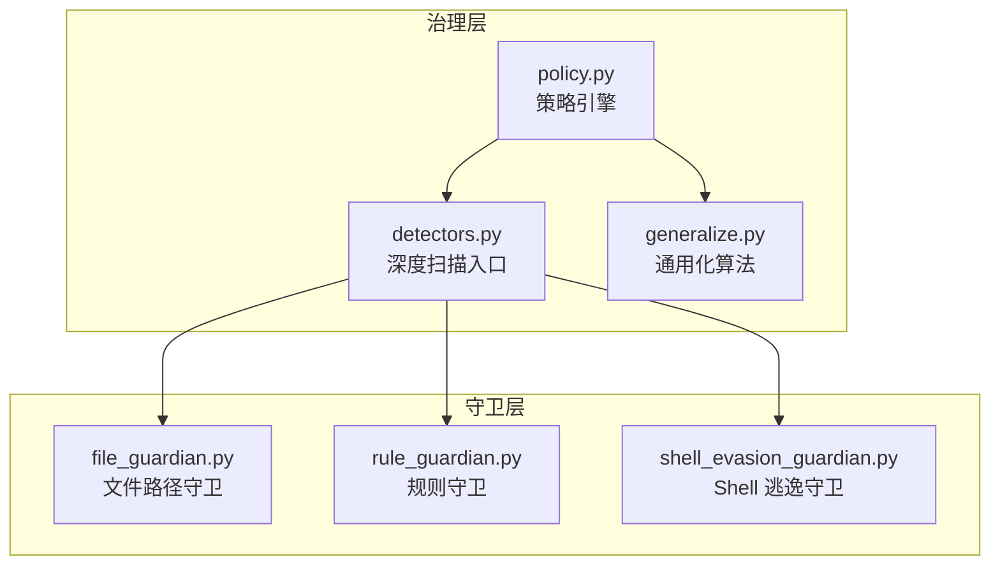
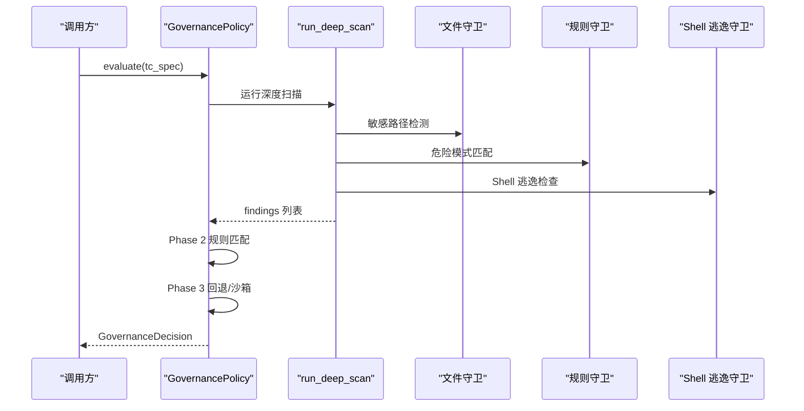
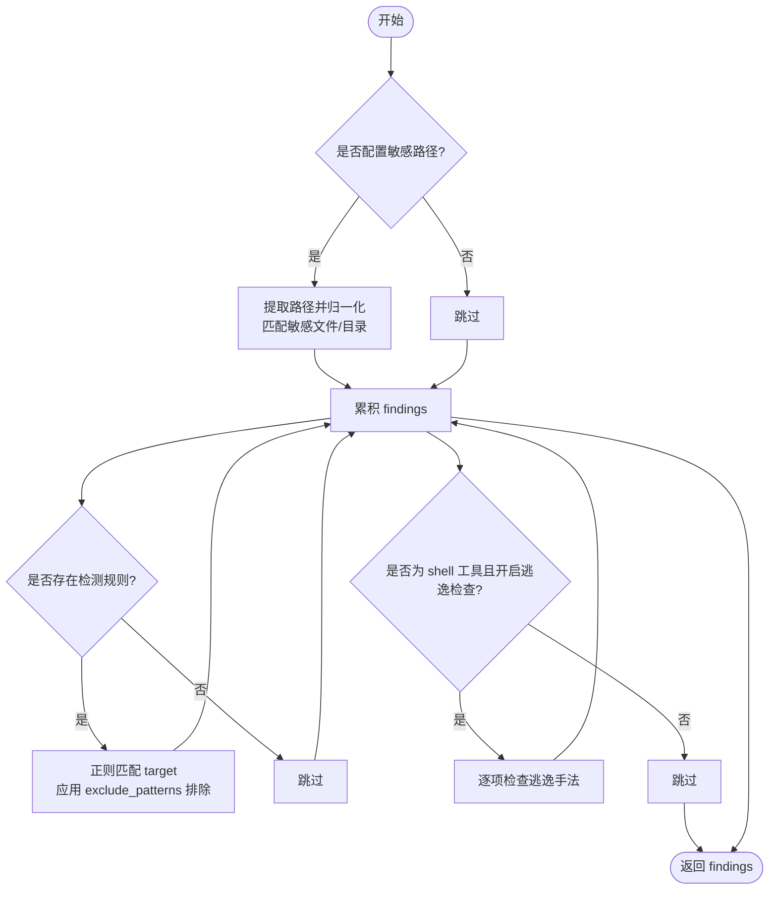
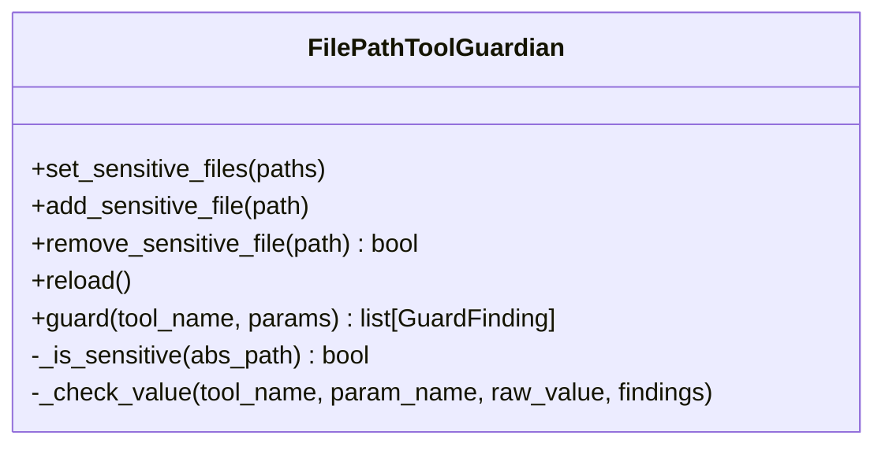
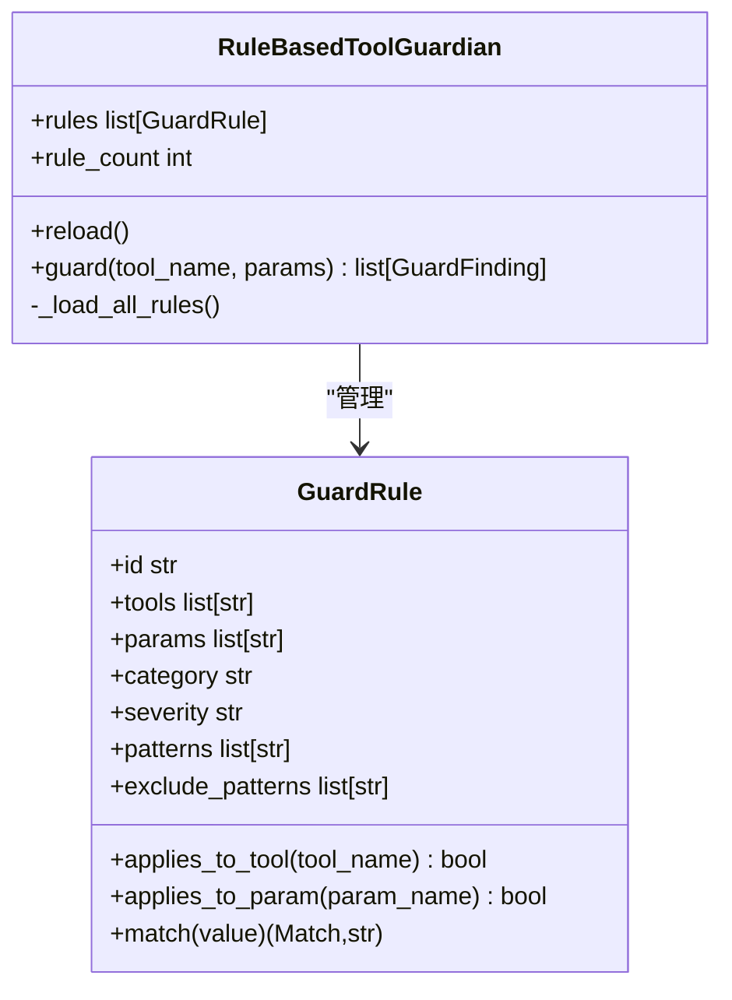
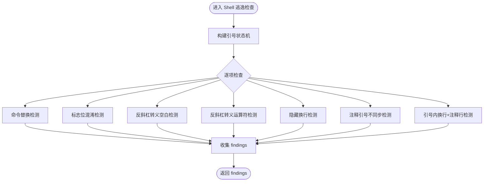
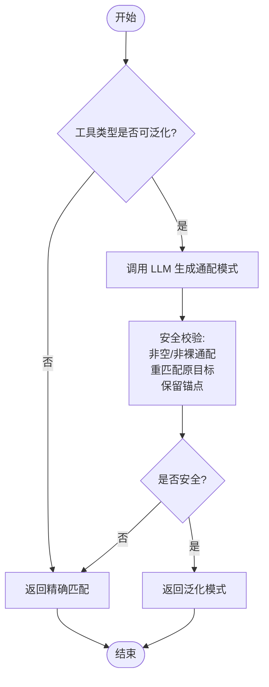
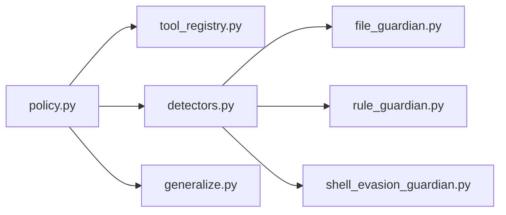

# 安全检测器

<cite>
**本文引用的文件**   
- [src/qwenpaw/governance/policy.py](file://src/qwenpaw/governance/policy.py)
- [src/qwenpaw/governance/detectors.py](file://src/qwenpaw/governance/detectors.py)
- [src/qwenpaw/security/tool_guard/guardians/file_guardian.py](file://src/qwenpaw/security/tool_guard/guardians/file_guardian.py)
- [src/qwenpaw/security/tool_guard/guardians/rule_guardian.py](file://src/qwenpaw/security/tool_guard/guardians/rule_guardian.py)
- [src/qwenpaw/security/tool_guard/guardians/shell_evasion_guardian.py](file://src/qwenpaw/security/tool_guard/guardians/shell_evasion_guardian.py)
- [src/qwenpaw/governance/generalize.py](file://src/qwenpaw/governance/generalize.py)
</cite>

## 目录
1. [简介](#简介)
2. [项目结构](#项目结构)
3. [核心组件](#核心组件)
4. [架构总览](#架构总览)
5. [详细组件分析](#详细组件分析)
6. [依赖关系分析](#依赖关系分析)
7. [性能考虑](#性能考虑)
8. [故障排查指南](#故障排查指南)
9. [结论](#结论)
10. [附录](#附录)

## 简介
本文件面向 QwenPaw 的安全检测器系统，重点阐述“深度安全扫描（Deep Security Scan）”的实现原理与落地细节，包括：
- 敏感路径检测、命令注入检测、Shell 逃逸检查
- DetectionRuleConfig 配置结构与匹配策略
- 威胁检测器的具体实现：文件守卫、规则守卫、Shell 逃逸防护
- 通用化（Generalization）算法在用户批准时的智能泛化机制
- 检测规则配置示例与自定义检测器开发指南
- 误报处理与性能调优建议

## 项目结构
安全检测相关代码主要分布在治理层（governance）与安全工具守卫（security.tool_guard.guardians）两个层次：
- 治理层负责策略评估流程、三阶段决策（深度扫描 → 规则匹配 → 回退），以及通用化逻辑
- 守卫层提供三类可插拔的检测器：文件路径守卫、基于 YAML/配置的规则守卫、Shell 逃逸检测守卫

**图表来源** 
- [src/qwenpaw/governance/policy.py:607-757](file://src/qwenpaw/governance/policy.py#L607-L757)
- [src/qwenpaw/governance/detectors.py:56-112](file://src/qwenpaw/governance/detectors.py#L56-L112)
- [src/qwenpaw/security/tool_guard/guardians/file_guardian.py:301-501](file://src/qwenpaw/security/tool_guard/guardians/file_guardian.py#L301-L501)
- [src/qwenpaw/security/tool_guard/guardians/rule_guardian.py:581-780](file://src/qwenpaw/security/tool_guard/guardians/rule_guardian.py#L581-L780)
- [src/qwenpaw/security/tool_guard/guardians/shell_evasion_guardian.py:539-593](file://src/qwenpaw/security/tool_guard/guardians/shell_evasion_guardian.py#L539-L593)
- [src/qwenpaw/governance/generalize.py:307-422](file://src/qwenpaw/governance/generalize.py#L307-L422)

**章节来源**
- [src/qwenpaw/governance/policy.py:607-757](file://src/qwenpaw/governance/policy.py#L607-L757)
- [src/qwenpaw/governance/detectors.py:56-112](file://src/qwenpaw/governance/detectors.py#L56-L112)

## 核心组件
- GovernancePolicy：策略引擎，定义三阶段评估流程（Phase 1 深度扫描、Phase 2 规则匹配、Phase 3 回退），并集成 Shell 危险关键词检测
- DetectionRuleConfig：检测规则配置数据类，支持工具类型过滤、参数匹配、严重性级别、分类标签、正则模式与排除模式
- 深度扫描入口 run_deep_scan：聚合三类检测器结果（敏感路径、危险模式、Shell 逃逸）
- 文件守卫 FilePathToolGuardian：解析目标路径，拦截对敏感文件或目录的访问
- 规则守卫 RuleBasedToolGuardian：加载 YAML/配置规则，按工具与参数进行正则匹配
- Shell 逃逸守卫 ShellEvasionGuardian：识别命令替换、标志位混淆、反斜杠转义、换行隐藏等逃逸手法
- 通用化 generalize_rule_match：在用户批准时，调用 LLM 生成保守的通配模式，并对结果做严格校验

**章节来源**
- [src/qwenpaw/governance/policy.py:534-575](file://src/qwenpaw/governance/policy.py#L534-L575)
- [src/qwenpaw/governance/detectors.py:56-112](file://src/qwenpaw/governance/detectors.py#L56-L112)
- [src/qwenpaw/security/tool_guard/guardians/file_guardian.py:301-501](file://src/qwenpaw/security/tool_guard/guardians/file_guardian.py#L301-L501)
- [src/qwenpaw/security/tool_guard/guardians/rule_guardian.py:581-780](file://src/qwenpaw/security/tool_guard/guardians/rule_guardian.py#L581-L780)
- [src/qwenpaw/security/tool_guard/guardians/shell_evasion_guardian.py:539-593](file://src/qwenpaw/security/tool_guard/guardians/shell_evasion_guardian.py#L539-L593)
- [src/qwenpaw/governance/generalize.py:307-422](file://src/qwenpaw/governance/generalize.py#L307-L422)

## 架构总览
QwenPaw 的安全检测采用“先深扫、再规则、后回退”的分层策略。深度扫描阶段通过纯函数式检测器快速积累发现；规则阶段由内置与用户规则共同决定放行或询问；最后根据执行级别阈值决定是否沙箱化或放行。

**图表来源** 
- [src/qwenpaw/governance/policy.py:607-757](file://src/qwenpaw/governance/policy.py#L607-L757)
- [src/qwenpaw/governance/detectors.py:56-112](file://src/qwenpaw/governance/detectors.py#L56-L112)
- [src/qwenpaw/security/tool_guard/guardians/file_guardian.py:449-501](file://src/qwenpaw/security/tool_guard/guardians/file_guardian.py#L449-L501)
- [src/qwenpaw/security/tool_guard/guardians/rule_guardian.py:630-780](file://src/qwenpaw/security/tool_guard/guardians/rule_guardian.py#L630-L780)
- [src/qwenpaw/security/tool_guard/guardians/shell_evasion_guardian.py:555-593](file://src/qwenpaw/security/tool_guard/guardians/shell_evasion_guardian.py#L555-L593)

## 详细组件分析

### 深度安全扫描（Deep Security Scan）
- 入口函数 run_deep_scan 接收工具名、目标、工具类型及配置，依次触发三类检测器并汇总 GuardFinding
- 敏感路径检测：从 shell 命令中提取候选路径，归一化为绝对路径并与敏感文件/目录集合比对
- 危险模式检测：将 target 字符串与 DetectionRuleConfig 中的 patterns/exclude_patterns 进行正则匹配，命中即产出发现
- Shell 逃逸检测：仅对 shell 类型工具启用，逐项检查命令替换、标志位混淆、反斜杠转义、换行隐藏、注释引号不同步等

**图表来源** 
- [src/qwenpaw/governance/detectors.py:56-112](file://src/qwenpaw/governance/detectors.py#L56-L112)
- [src/qwenpaw/governance/detectors.py:198-291](file://src/qwenpaw/governance/detectors.py#L198-L291)
- [src/qwenpaw/governance/detectors.py:346-414](file://src/qwenpaw/governance/detectors.py#L346-L414)
- [src/qwenpaw/governance/detectors.py:737-764](file://src/qwenpaw/governance/detectors.py#L737-L764)

**章节来源**
- [src/qwenpaw/governance/detectors.py:56-112](file://src/qwenpaw/governance/detectors.py#L56-L112)
- [src/qwenpaw/governance/detectors.py:198-291](file://src/qwenpaw/governance/detectors.py#L198-L291)
- [src/qwenpaw/governance/detectors.py:346-414](file://src/qwenpaw/governance/detectors.py#L346-L414)
- [src/qwenpaw/governance/detectors.py:737-764](file://src/qwenpaw/governance/detectors.py#L737-L764)

### DetectionRuleConfig 配置结构
- id：规则唯一标识
- tools：适用工具名称列表（空表示全部工具）
- params：适用参数名列表（空表示全部参数）
- category：威胁分类标签（如 command_injection、code_execution 等）
- severity：严重性级别（CRITICAL/HIGH/MEDIUM/LOW/INFO）
- patterns：匹配的正则表达式列表
- exclude_patterns：排除的正则表达式列表（优先于 patterns）
- description/remediation：描述与建议修复措施

该配置被用于规则守卫与深度扫描的规则匹配分支，确保对特定工具与参数的细粒度控制。

**章节来源**
- [src/qwenpaw/governance/policy.py:534-547](file://src/qwenpaw/governance/policy.py#L534-L547)
- [src/qwenpaw/security/tool_guard/guardians/rule_guardian.py:353-447](file://src/qwenpaw/security/tool_guard/guardians/rule_guardian.py#L353-L447)

### 文件守卫（FilePathToolGuardian）
- 支持 POSIX 与 Windows 风格路径识别与归一化
- 自动合并默认敏感目录（兼容历史命名），支持动态增删敏感路径
- 针对 shell 命令使用 shlex 分词并结合重定向操作符解析真实路径
- 对已知文件工具直接检查指定参数，对其他工具扫描所有看起来像路径的参数

**图表来源** 
- [src/qwenpaw/security/tool_guard/guardians/file_guardian.py:301-501](file://src/qwenpaw/security/tool_guard/guardians/file_guardian.py#L301-L501)

**章节来源**
- [src/qwenpaw/security/tool_guard/guardians/file_guardian.py:301-501](file://src/qwenpaw/security/tool_guard/guardians/file_guardian.py#L301-L501)

### 规则守卫（RuleBasedToolGuardian）
- 从 YAML 与配置中加载规则，支持禁用规则 ID 与额外规则注入
- 对每个参数值转换为字符串后进行正则匹配，支持上下文片段与 rm 命令工作区外文件提示增强
- 预编译正则缓存，避免重复编译开销

**图表来源** 
- [src/qwenpaw/security/tool_guard/guardians/rule_guardian.py:353-447](file://src/qwenpaw/security/tool_guard/guardians/rule_guardian.py#L353-L447)
- [src/qwenpaw/security/tool_guard/guardians/rule_guardian.py:581-780](file://src/qwenpaw/security/tool_guard/guardians/rule_guardian.py#L581-L780)

**章节来源**
- [src/qwenpaw/security/tool_guard/guardians/rule_guardian.py:353-447](file://src/qwenpaw/security/tool_guard/guardians/rule_guardian.py#L353-L447)
- [src/qwenpaw/security/tool_guard/guardians/rule_guardian.py:581-780](file://src/qwenpaw/security/tool_guard/guardians/rule_guardian.py#L581-L780)

### Shell 逃逸防护（ShellEvasionGuardian）
- 逐字符跟踪引号状态，避免误判单引号内的内容
- 检测命令替换（$(), ``, ${}, =(), <(), >() 等）、ANSI-C/本地化引号、反斜杠转义空白与运算符、隐藏换行、注释引号不同步、引号内换行后跟 # 行等
- 每项检查可独立开关，便于按需启用

**图表来源** 
- [src/qwenpaw/security/tool_guard/guardians/shell_evasion_guardian.py:539-593](file://src/qwenpaw/security/tool_guard/guardians/shell_evasion_guardian.py#L539-L593)
- [src/qwenpaw/security/tool_guard/guardians/shell_evasion_guardian.py:115-454](file://src/qwenpaw/security/tool_guard/guardians/shell_evasion_guardian.py#L115-L454)

**章节来源**
- [src/qwenpaw/security/tool_guard/guardians/shell_evasion_guardian.py:539-593](file://src/qwenpaw/security/tool_guard/guardians/shell_evasion_guardian.py#L539-L593)
- [src/qwenpaw/security/tool_guard/guardians/shell_evasion_guardian.py:115-454](file://src/qwenpaw/security/tool_guard/guardians/shell_evasion_guardian.py#L115-L454)

### 通用化算法（Generalization）
- 仅在 shell 与 file 类型工具上尝试泛化，其他类型保持精确匹配
- 调用 LLM 生成保守通配模式，随后进行三重安全校验：
  1) 非空且非裸通配（禁止 * 或 /** 作为整体）
  2) 必须能重新匹配原始目标（保证已批准调用仍被覆盖）
  3) 保留锚点（shell 命令首 token 不变；文件路径父目录边界不变）
- 对破坏性/提权命令（rm、sudo、chmod 等）拒绝泛化
- 超时或异常均回退为精确匹配，确保批准记录始终有效

**图表来源** 
- [src/qwenpaw/governance/generalize.py:307-422](file://src/qwenpaw/governance/generalize.py#L307-L422)
- [src/qwenpaw/governance/generalize.py:117-169](file://src/qwenpaw/governance/generalize.py#L117-L169)

**章节来源**
- [src/qwenpaw/governance/generalize.py:307-422](file://src/qwenpaw/governance/generalize.py#L307-L422)
- [src/qwenpaw/governance/generalize.py:117-169](file://src/qwenpaw/governance/generalize.py#L117-L169)

## 依赖关系分析
- GovernancePolicy 依赖 ToolRegistry 获取工具类型，并在 evaluate 中串联深度扫描、规则匹配与回退逻辑
- 深度扫描模块 detectors 以纯函数形式调用三类守卫的核心逻辑，避免全局状态耦合
- 规则守卫依赖 YAML 与配置加载，支持运行时重载
- Shell 逃逸守卫依赖配置项 per-check 开关，便于灰度启用

**图表来源** 
- [src/qwenpaw/governance/policy.py:607-757](file://src/qwenpaw/governance/policy.py#L607-L757)
- [src/qwenpaw/governance/detectors.py:56-112](file://src/qwenpaw/governance/detectors.py#L56-L112)

**章节来源**
- [src/qwenpaw/governance/policy.py:607-757](file://src/qwenpaw/governance/policy.py#L607-L757)
- [src/qwenpaw/governance/detectors.py:56-112](file://src/qwenpaw/governance/detectors.py#L56-L112)

## 性能考虑
- 正则预编译与缓存：规则守卫与深度扫描中对 patterns/exclude_patterns 进行预编译并按内容键缓存，避免重复编译
- 短路策略：深度扫描在 CRITICAL 发现时立即 DENY，减少后续规则匹配开销
- 选择性启用：Shell 逃逸检查可按需开关，降低不必要的计算
- 路径归一化优化：文件守卫对路径进行一次性归一化与去重，提升匹配效率

**章节来源**
- [src/qwenpaw/governance/detectors.py:306-344](file://src/qwenpaw/governance/detectors.py#L306-L344)
- [src/qwenpaw/security/tool_guard/guardians/rule_guardian.py:397-417](file://src/qwenpaw/security/tool_guard/guardians/rule_guardian.py#L397-L417)
- [src/qwenpaw/security/tool_guard/guardians/file_guardian.py:323-340](file://src/qwenpaw/security/tool_guard/guardians/file_guardian.py#L323-L340)

## 故障排查指南
- 深度扫描失败容错：当 _deep_security_scan 抛出异常时记录警告并继续执行，不中断策略评估
- 规则加载失败：YAML 或配置加载异常会记录警告并跳过无效规则，不影响系统启动
- Shell 逃逸检查异常：单项检查失败记录警告并继续，避免个别检查影响整体检测
- 误报定位：查看 GuardFinding 的 snippet、matched_pattern、metadata 字段，结合规则与路径归一化结果定位问题

**章节来源**
- [src/qwenpaw/governance/policy.py:731-757](file://src/qwenpaw/governance/policy.py#L731-L757)
- [src/qwenpaw/security/tool_guard/guardians/rule_guardian.py:454-486](file://src/qwenpaw/security/tool_guard/guardians/rule_guardian.py#L454-L486)
- [src/qwenpaw/security/tool_guard/guardians/shell_evasion_guardian.py:576-593](file://src/qwenpaw/security/tool_guard/guardians/shell_evasion_guardian.py#L576-L593)

## 结论
QwenPaw 的安全检测器通过“深度扫描 + 规则匹配 + 回退阈值”的分层设计，在保证安全性的同时兼顾可用性与性能。DetectionRuleConfig 提供了灵活的规则表达，三类守卫覆盖了文件访问、命令注入与 Shell 逃逸等关键风险面。通用化算法在用户批准后智能放宽匹配范围，显著减少重复审批成本。配合完善的错误处理与性能优化，该系统可在生产环境中稳定运行。

## 附录

### 检测规则配置示例（概念性说明）
- 工具类型过滤：仅对 execute_shell_command 生效
- 参数匹配：仅对 command 参数进行匹配
- 严重性级别：HIGH
- 分类标签：command_injection
- 匹配模式：包含管道到 shell 的危险组合
- 排除模式：忽略注释行

以上字段对应 DetectionRuleConfig 的 tools、params、severity、category、patterns、exclude_patterns 等属性。

**章节来源**
- [src/qwenpaw/governance/policy.py:534-547](file://src/qwenpaw/governance/policy.py#L534-L547)
- [src/qwenpaw/security/tool_guard/guardians/rule_guardian.py:353-447](file://src/qwenpaw/security/tool_guard/guardians/rule_guardian.py#L353-L447)

### 自定义检测器开发指南（概念性说明）
- 新增检测器应遵循无状态函数接口，接收 tool_name、target、tool_type 与配置参数
- 输出 GuardFinding 对象，包含 id、rule_id、category、severity、title、description、tool_name、param_name、matched_value、matched_pattern、snippet、remediation、detector、metadata
- 在 run_deep_scan 中注册新检测器，并确保异常捕获与日志记录
- 若涉及路径或正则，注意预编译与缓存策略，避免性能退化

**章节来源**
- [src/qwenpaw/governance/detectors.py:56-112](file://src/qwenpaw/governance/detectors.py#L56-L112)
- [src/qwenpaw/governance/detectors.py:31-49](file://src/qwenpaw/governance/detectors.py#L31-L49)