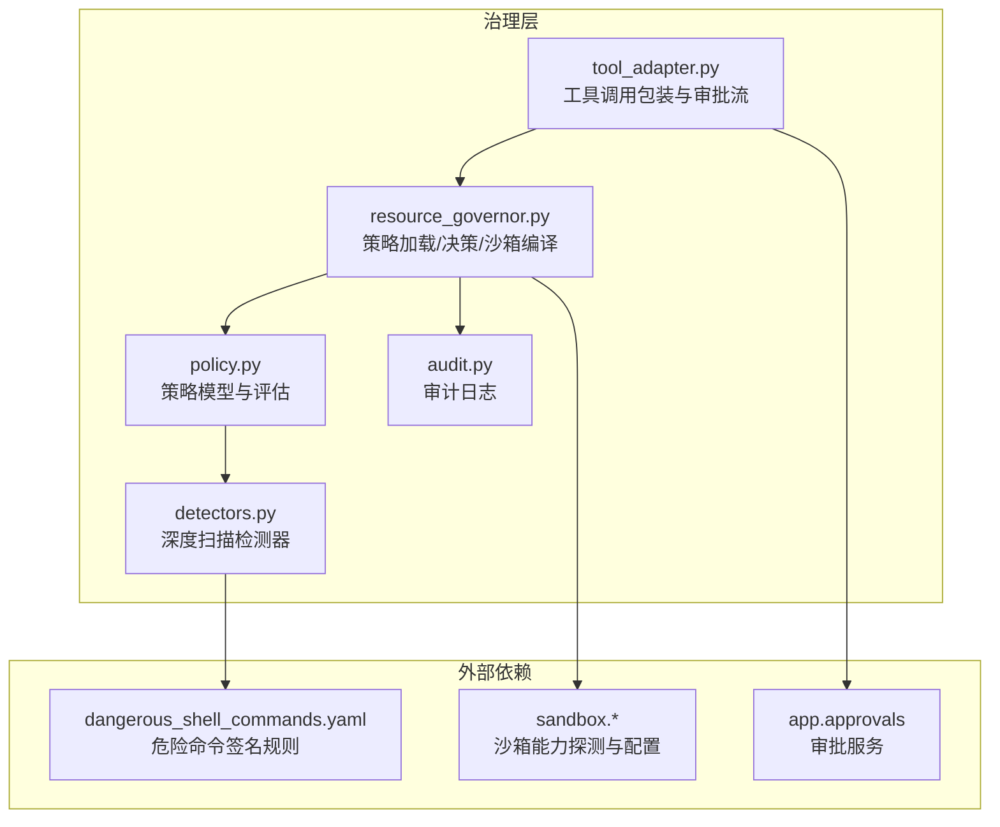
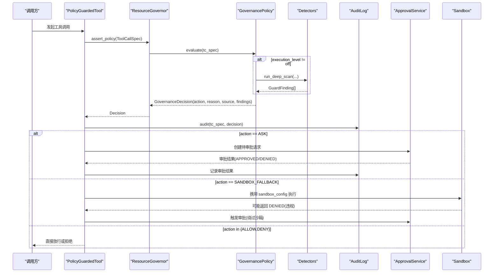
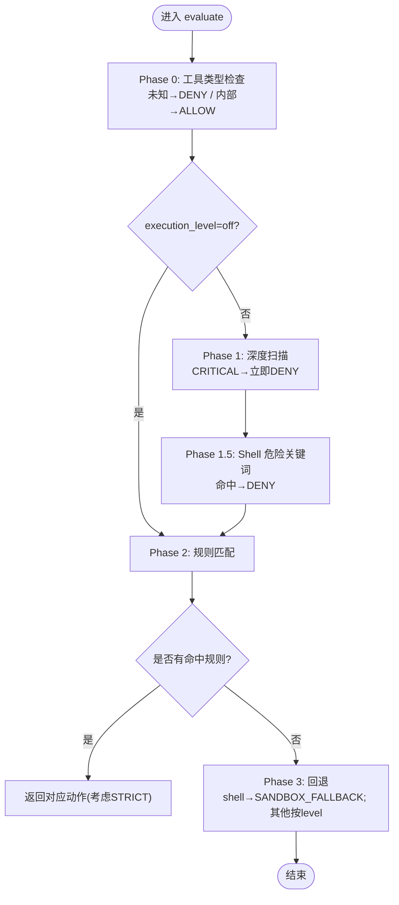
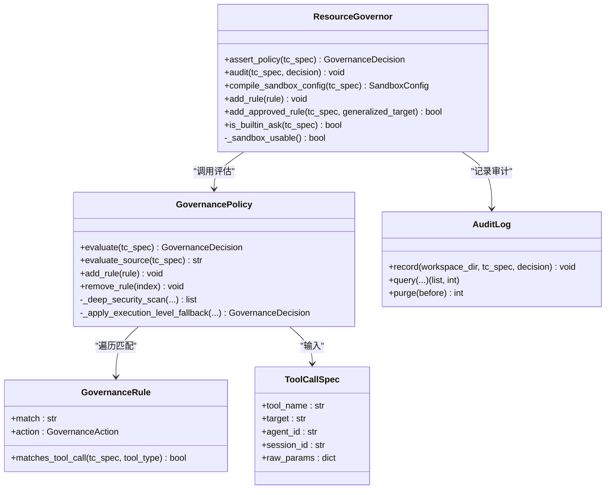
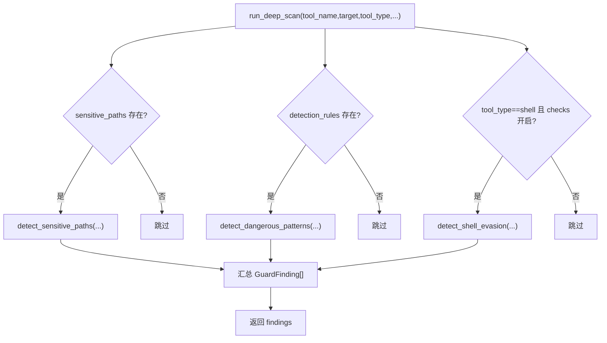
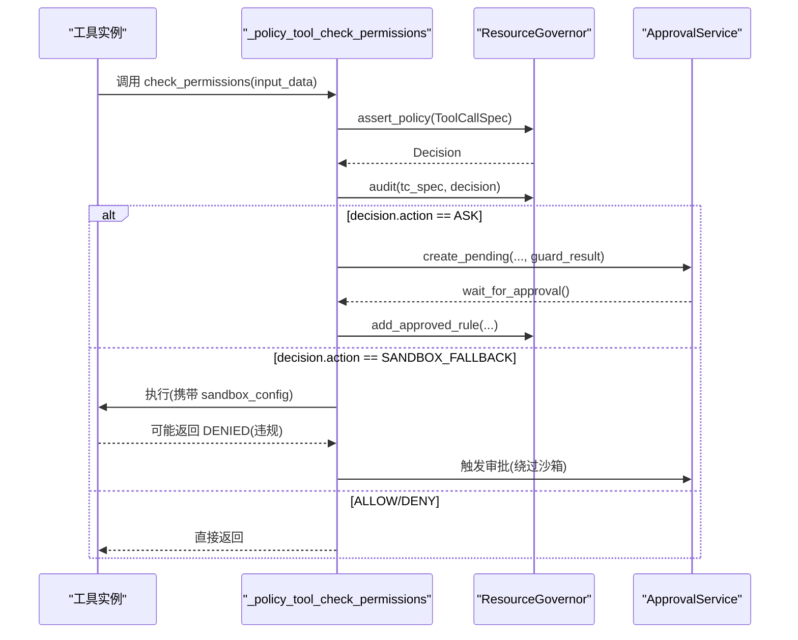
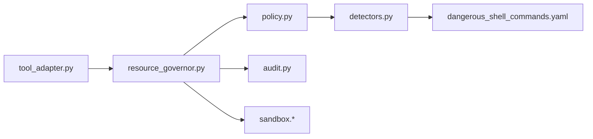

# 治理策略框架

<cite>
**本文引用的文件**   
- [src/qwenpaw/governance/__init__.py](file://src/qwenpaw/governance/__init__.py)
- [src/qwenpaw/governance/policy.py](file://src/qwenpaw/governance/policy.py)
- [src/qwenpaw/governance/resource_governor.py](file://src/qwenpaw/governance/resource_governor.py)
- [src/qwenpaw/governance/detectors.py](file://src/qwenpaw/governance/detectors.py)
- [src/qwenpaw/governance/audit.py](file://src/qwenpaw/governance/audit.py)
- [src/qwenpaw/governance/tool_adapter.py](file://src/qwenpaw/governance/tool_adapter.py)
- [src/qwenpaw/security/tool_guard/rules/dangerous_shell_commands.yaml](file://src/qwenpaw/security/tool_guard/rules/dangerous_shell_commands.yaml)
</cite>

## 目录
1. [简介](#简介)
2. [项目结构](#项目结构)
3. [核心组件](#核心组件)
4. [架构总览](#架构总览)
5. [详细组件分析](#详细组件分析)
6. [依赖关系分析](#依赖关系分析)
7. [性能与可扩展性](#性能与可扩展性)
8. [故障排查指南](#故障排查指南)
9. [结论](#结论)
10. [附录：策略配置示例与最佳实践](#附录策略配置示例与最佳实践)

## 简介
本文件面向 QwenPaw 的“治理策略框架”，系统性阐述策略定义语言、评估引擎流程、资源治理器（ResourceGovernor）实现、威胁检测器（Detectors）能力，以及审计与沙箱集成。文档同时提供企业级安全策略部署与合规检查的最佳实践建议，帮助读者快速理解并落地使用。

## 项目结构
治理相关代码集中在 governance 模块，并与安全规则、沙箱、审批服务、审计日志等子系统协作。

图示来源
- [src/qwenpaw/governance/policy.py:534-800](file://src/qwenpaw/governance/policy.py#L534-L800)
- [src/qwenpaw/governance/resource_governor.py:42-166](file://src/qwenpaw/governance/resource_governor.py#L42-L166)
- [src/qwenpaw/governance/detectors.py:56-112](file://src/qwenpaw/governance/detectors.py#L56-L112)
- [src/qwenpaw/governance/audit.py:90-158](file://src/qwenpaw/governance/audit.py#L90-L158)
- [src/qwenpaw/governance/tool_adapter.py:108-141](file://src/qwenpaw/governance/tool_adapter.py#L108-L141)
- [src/qwenpaw/security/tool_guard/rules/dangerous_shell_commands.yaml:1-30](file://src/qwenpaw/security/tool_guard/rules/dangerous_shell_commands.yaml#L1-L30)

章节来源
- [src/qwenpaw/governance/__init__.py:1-21](file://src/qwenpaw/governance/__init__.py#L1-L21)

## 核心组件
- 策略模型与规则语法
  - GovernanceRule：匹配表达式 match="ToolName(pattern)"，支持 glob 与通配；action 支持 ALLOW/DENY/ASK/SANDBOX_FALLBACK；grantee/session_id/duration 控制授权主体与会话范围。
  - GovernancePolicy：内置规则（builtin_rules，不可被 YAML 覆盖）+ 用户规则（user_rules，可动态增删），三阶段评估（Phase 1 深度扫描 → Phase 1.5 Shell 危险关键词 → Phase 2 规则命中 → Phase 3 回退）。
  - ToolCallSpec：一次工具调用的上下文（工具名、目标、agent_id、session_id、原始参数）。
- 资源治理器 ResourceGovernor
  - 负责策略加载/持久化、决策执行、审计记录、沙箱配置编译、动态规则添加。
- 威胁检测器 Detectors
  - 敏感路径检测、正则模式检测、Shell 逃逸/混淆检测，产出 GuardFinding 列表供上层决策。
- 审计日志 AuditLog
  - SQLite 单文件存储，支持分页查询、自动清理、VACUUM 回收空间。
- 工具适配器 PolicyGuardedTool
  - 在工具调用前后注入策略评估、审批交互、沙箱重试与违规上报。

章节来源
- [src/qwenpaw/governance/policy.py:36-187](file://src/qwenpaw/governance/policy.py#L36-L187)
- [src/qwenpaw/governance/policy.py:534-800](file://src/qwenpaw/governance/policy.py#L534-L800)
- [src/qwenpaw/governance/resource_governor.py:42-166](file://src/qwenpaw/governance/resource_governor.py#L42-L166)
- [src/qwenpaw/governance/detectors.py:31-112](file://src/qwenpaw/governance/detectors.py#L31-L112)
- [src/qwenpaw/governance/audit.py:90-158](file://src/qwenpaw/governance/audit.py#L90-L158)
- [src/qwenpaw/governance/tool_adapter.py:108-141](file://src/qwenpaw/governance/tool_adapter.py#L108-L141)

## 架构总览
下图展示从工具调用到策略评估、检测、决策、审计与沙箱执行的完整链路。

图示来源
- [src/qwenpaw/governance/tool_adapter.py:222-336](file://src/qwenpaw/governance/tool_adapter.py#L222-L336)
- [src/qwenpaw/governance/resource_governor.py:196-271](file://src/qwenpaw/governance/resource_governor.py#L196-L271)
- [src/qwenpaw/governance/policy.py:607-730](file://src/qwenpaw/governance/policy.py#L607-L730)
- [src/qwenpaw/governance/detectors.py:56-112](file://src/qwenpaw/governance/detectors.py#L56-L112)
- [src/qwenpaw/governance/audit.py:187-244](file://src/qwenpaw/governance/audit.py#L187-L244)

## 详细组件分析

### 策略定义语言与设计模式
- 规则语法
  - match 格式："工具名(目标模式)"，如 "Bash(git *)"、"*(.ssh/**)"、"Read(WORKSPACE_DIR/**)"。
  - 匹配算法：优先按工具类型选择 wcmatch globmatch 或 fnmatch；对 "*" 工具 + shell 场景支持子串匹配以捕获敏感路径出现在命令中的情况。
  - 作用域：grantee 指定代理主体，duration 支持 session/permanent，session_id 绑定会话。
- 动作语义
  - 显式资源类工具：ALLOW 直接执行；DENY 拒绝；ASK 需人工批准。
  - Bash 类工具：ALLOW 在沙箱中预授权执行；DENY 拒绝；ASK 批准后在沙箱执行。
- 默认规则
  - builtin_rules：系统级保护（敏感路径 ASK、高危命令 DENY），由代码维护，不可被 YAML 覆盖。
  - user_rules：冷启动时填充默认集，支持迁移合并与去重，保存时还原占位符以保持可移植性。
- 执行级别（execution_level）
  - off/auto/smart/strict：影响 Phase 1 是否跳过、无命中时的回退策略与 STRICT 强制审批行为。

图示来源
- [src/qwenpaw/governance/policy.py:607-730](file://src/qwenpaw/governance/policy.py#L607-L730)

章节来源
- [src/qwenpaw/governance/policy.py:89-187](file://src/qwenpaw/governance/policy.py#L89-L187)
- [src/qwenpaw/governance/policy.py:253-259](file://src/qwenpaw/governance/policy.py#L253-L259)
- [src/qwenpaw/governance/policy.py:392-526](file://src/qwenpaw/governance/policy.py#L392-L526)
- [src/qwenpaw/governance/policy.py:992-1106](file://src/qwenpaw/governance/policy.py#L992-L1106)
- [src/qwenpaw/governance/policy.py:1109-1166](file://src/qwenpaw/governance/policy.py#L1109-L1166)

### 策略评估引擎工作流程
- 入口：ResourceGovernor.assert_policy(tc_spec)
- 步骤：
  1) 调用 GovernancePolicy.evaluate(tc_spec) 得到决策。
  2) 若为 SANDBOX_FALLBACK 且沙箱不可用，降级为 ALLOW（保留 Phase 0-2 保护）。
  3) 若为 SANDBOX_FALLBACK，则编译 SandboxConfig 并附加到决策。
  4) 输出日志用于观测。
- 决策来源标注：source 字段标识来自 builtin_rules/user_rules/fallback/sensitive_paths/detection_rules/shell_evasion_checks/shell_danger_keywords/sandbox。

图示来源
- [src/qwenpaw/governance/resource_governor.py:42-166](file://src/qwenpaw/governance/resource_governor.py#L42-L166)
- [src/qwenpaw/governance/policy.py:534-800](file://src/qwenpaw/governance/policy.py#L534-L800)
- [src/qwenpaw/governance/audit.py:90-158](file://src/qwenpaw/governance/audit.py#L90-L158)

章节来源
- [src/qwenpaw/governance/resource_governor.py:196-271](file://src/qwenpaw/governance/resource_governor.py#L196-L271)
- [src/qwenpaw/governance/policy.py:842-863](file://src/qwenpaw/governance/policy.py#L842-L863)

### 资源治理器（ResourceGovernor）实现要点
- 生命周期
  - start：创建策略目录、加载策略、持久化、探测沙箱能力。
  - stop：持久化策略变更、关闭审计日志连接并 VACUUM。
- 决策与沙箱
  - SANDBOX_FALLBACK 在平台不支持或全局开关关闭时降级为 ALLOW（不提示用户）。
  - compile_sandbox_config 基于 user_rules 推导挂载点（读/写）、deny_paths、网络策略、超时与环境变量黑名单。
- 动态规则
  - add_rule 追加至 user_rules 头部（优先级最高），并持久化。
  - add_approved_rule 根据用户审批生成会话级或永久规则，避免重复累积。
  - is_builtin_ask 判断 ASK 是否来自内置规则，决定是否记录新规则。

章节来源
- [src/qwenpaw/governance/resource_governor.py:136-191](file://src/qwenpaw/governance/resource_governor.py#L136-L191)
- [src/qwenpaw/governance/resource_governor.py:300-379](file://src/qwenpaw/governance/resource_governor.py#L300-L379)
- [src/qwenpaw/governance/resource_governor.py:412-493](file://src/qwenpaw/governance/resource_governor.py#L412-L493)

### 威胁检测器（Detectors）功能
- 敏感路径检测
  - 将 sensitive_paths 解析为文件或目录前缀，针对 shell 命令提取候选路径进行匹配。
- 正则模式检测
  - 基于 detection_rules 的 patterns/exclude_patterns 进行匹配，带缓存提升性能。
- Shell 逃逸/混淆检测
  - 命令替换、ANSI-C/本地化引号、反斜杠转义空白/操作符、换行/注释不同步、引号内换行等。
- 与危险命令规则联动
  - dangerous_shell_commands.yaml 提供丰富的危险命令签名，作为 detection_rules 的数据源之一。

图示来源
- [src/qwenpaw/governance/detectors.py:56-112](file://src/qwenpaw/governance/detectors.py#L56-L112)
- [src/qwenpaw/governance/detectors.py:198-290](file://src/qwenpaw/governance/detectors.py#L198-L290)
- [src/qwenpaw/governance/detectors.py:346-413](file://src/qwenpaw/governance/detectors.py#L346-L413)
- [src/qwenpaw/governance/detectors.py:737-763](file://src/qwenpaw/governance/detectors.py#L737-L763)
- [src/qwenpaw/security/tool_guard/rules/dangerous_shell_commands.yaml:1-30](file://src/qwenpaw/security/tool_guard/rules/dangerous_shell_commands.yaml#L1-L30)

章节来源
- [src/qwenpaw/governance/detectors.py:198-290](file://src/qwenpaw/governance/detectors.py#L198-L290)
- [src/qwenpaw/governance/detectors.py:346-413](file://src/qwenpaw/governance/detectors.py#L346-L413)
- [src/qwenpaw/governance/detectors.py:737-763](file://src/qwenpaw/governance/detectors.py#L737-L763)
- [src/qwenpaw/security/tool_guard/rules/dangerous_shell_commands.yaml:1-321](file://src/qwenpaw/security/tool_guard/rules/dangerous_shell_commands.yaml#L1-L321)

### 工具适配与审批流程（PolicyGuardedTool）
- 权限检查
  - 构建 ToolCallSpec，调用 ResourceGovernor.assert_policy 与 audit。
  - 处理 OFF 模式：仍为需要沙箱的工具准备 sandbox_config，但不向用户提问。
- 执行与重试
  - 若沙箱执行返回违规（state=DENIED），触发审批；用户允许后移除沙箱重试。
- 审批交互
  - 复用 ApprovalService，构造 ToolGuardResult 并附带 deep-scan findings 摘要。
  - 用户批准后可写入会话级或精确规则，避免重复询问。

图示来源
- [src/qwenpaw/governance/tool_adapter.py:222-336](file://src/qwenpaw/governance/tool_adapter.py#L222-L336)
- [src/qwenpaw/governance/tool_adapter.py:338-471](file://src/qwenpaw/governance/tool_adapter.py#L338-L471)
- [src/qwenpaw/governance/tool_adapter.py:479-719](file://src/qwenpaw/governance/tool_adapter.py#L479-L719)

章节来源
- [src/qwenpaw/governance/tool_adapter.py:108-141](file://src/qwenpaw/governance/tool_adapter.py#L108-L141)
- [src/qwenpaw/governance/tool_adapter.py:222-336](file://src/qwenpaw/governance/tool_adapter.py#L222-L336)
- [src/qwenpaw/governance/tool_adapter.py:338-471](file://src/qwenpaw/governance/tool_adapter.py#L338-L471)
- [src/qwenpaw/governance/tool_adapter.py:479-719](file://src/qwenpaw/governance/tool_adapter.py#L479-L719)

## 依赖关系分析
- 组件耦合
  - ResourceGovernor 聚合 GovernancePolicy、AuditLog、Sandbox 能力探测与配置。
  - GovernancePolicy 依赖 detectors 进行深度扫描，依赖 ToolRegistry 获取工具类型。
  - PolicyGuardedTool 依赖 ResourceGovernor 与 ApprovalService，形成“策略—审批—执行”闭环。
- 外部依赖
  - 危险命令规则 YAML 作为 detection_rules 数据源。
  - 沙箱后端通过 detect_platform_mode 与 probe_sandbox_support 决定可用性与模式。

图示来源
- [src/qwenpaw/governance/tool_adapter.py:222-336](file://src/qwenpaw/governance/tool_adapter.py#L222-L336)
- [src/qwenpaw/governance/resource_governor.py:136-191](file://src/qwenpaw/governance/resource_governor.py#L136-L191)
- [src/qwenpaw/governance/policy.py:731-757](file://src/qwenpaw/governance/policy.py#L731-L757)
- [src/qwenpaw/governance/detectors.py:56-112](file://src/qwenpaw/governance/detectors.py#L56-L112)
- [src/qwenpaw/security/tool_guard/rules/dangerous_shell_commands.yaml:1-30](file://src/qwenpaw/security/tool_guard/rules/dangerous_shell_commands.yaml#L1-L30)

章节来源
- [src/qwenpaw/governance/policy.py:731-757](file://src/qwenpaw/governance/policy.py#L731-L757)
- [src/qwenpaw/governance/resource_governor.py:136-191](file://src/qwenpaw/governance/resource_governor.py#L136-L191)

## 性能与可扩展性
- 规则匹配优化
  - 使用 wcmatch globmatch 与 fnmatch 组合，减少不必要的字符串处理。
  - 新增规则插入 user_rules 头部，提高常见规则的命中率。
- 检测器性能
  - 正则规则编译缓存 _COMPILED_CACHE，避免重复编译。
  - 仅当配置启用时运行相应检测项，降低开销。
- 审计写入
  - WAL 模式与线程锁保证并发安全；超过阈值自动删除最旧记录，延迟 VACUUM 避免阻塞。
- 可扩展点
  - 新增 detection_rules 即可扩展检测面；builtin_rules 保持系统级安全基线不变。
  - 可通过 execution_level 在不同环境灵活切换严格度。

[本节为通用指导，无需列出具体文件来源]

## 故障排查指南
- 常见问题
  - 沙箱不可用：start 时会记录警告，SANDBOX_FALLBACK 会降级为 ALLOW；检查平台支持与全局开关。
  - 策略未生效：确认 policy.yaml 是否存在、版本是否为 v2.0、占位符是否已正确替换。
  - 审批卡住：检查 ApprovalService 是否可用、超时设置是否合理。
  - 审计缺失：确认 AuditLog 初始化成功、磁盘空间充足、WAL 模式正常。
- 定位手段
  - 查看治理决策日志（包含 tool/target/action/source/sandbox/reason）。
  - 查询审计日志，过滤 workspace/agent/tool/decision/time 范围。
  - 检查 detection_rules 与 sensitive_paths 配置是否正确。

章节来源
- [src/qwenpaw/governance/resource_governor.py:136-191](file://src/qwenpaw/governance/resource_governor.py#L136-L191)
- [src/qwenpaw/governance/audit.py:187-244](file://src/qwenpaw/governance/audit.py#L187-L244)
- [src/qwenpaw/governance/audit.py:245-318](file://src/qwenpaw/governance/audit.py#L245-L318)

## 结论
QwenPaw 治理策略框架通过“内置保护 + 用户规则 + 深度扫描 + 沙箱隔离 + 审计追踪”的多层机制，在保证安全的前提下兼顾可用性。其清晰的策略语言、灵活的执行级别与可扩展的检测器体系，使其适用于从个人开发到企业级合规的多场景需求。

[本节为总结，无需列出具体文件来源]

## 附录：策略配置示例与最佳实践
- 策略文件位置与命名
  - 工作区独立策略目录：governance/<workspace_basename>_<hash>/policy.yaml
- 关键配置项
  - version: 2.0
  - execution_level: off/auto/smart/strict
  - audit_level: all/write_only/none（当前实现始终记录所有决策）
  - env_blacklist: 环境变量黑名单（沙箱注入空值）
  - sensitive_paths: 敏感路径前缀列表
  - shell_evasion_checks: 各逃逸检测开关
  - detection_rules: 正则检测规则集合
  - user_rules: 用户自定义规则（match/action/grantee/duration/session_id）
- 示例片段（说明性，非代码内容）
  - 允许工作区内读写：
    - user_rules:
      - match: "Write(WORKSPACE_DIR/**)"
        action: allow
        reason: "工作区内写入"
  - 禁止访问 SSH 私钥：
    - user_rules:
      - match: "*(**/.ssh/**)"
        action: ask
        reason: "SSH 密钥目录"
  - 限制浏览器访问恶意站点：
    - user_rules:
      - match: "Browser(*evil.com*)"
        action: deny
        reason: "屏蔽恶意站点"
- 企业级部署建议
  - 默认采用 smart 或 strict 级别，结合审批服务实现最小权限原则。
  - 定期更新 detection_rules 与 sensitive_paths，纳入合规基线。
  - 对高敏操作（sudo、格式化、重启等）保持 CRITICAL/HIGH 级别并阻断。
  - 审计日志集中收集与分析，建立告警与回溯流程。
- 合规性检查清单
  - 是否启用敏感路径与危险命令检测
  - 是否限制 sudo/格式化/重启等高危命令
  - 是否对 shell 逃逸/混淆进行检测
  - 是否对审批与审计进行留存与审查
  - 是否定期清理审计数据并归档

[本节为概念性指导，无需列出具体文件来源]