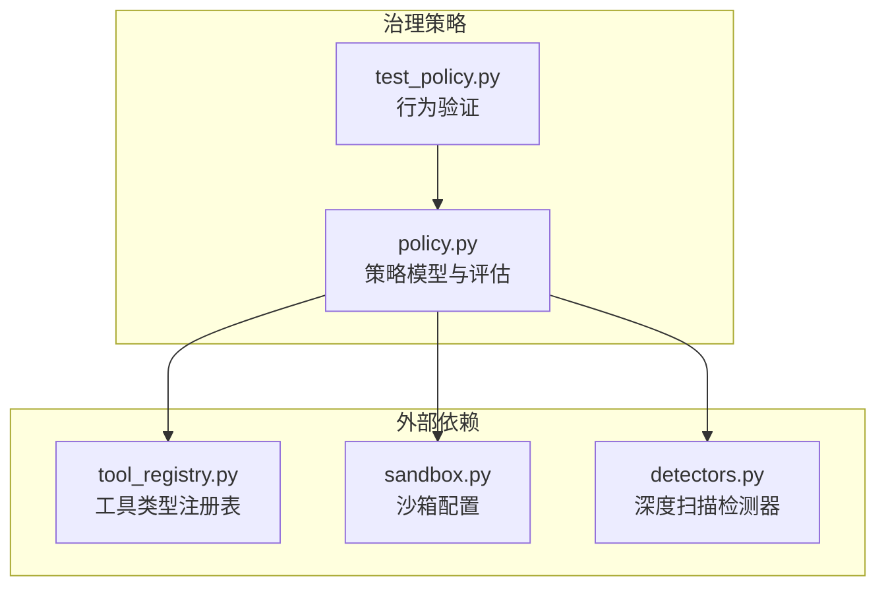
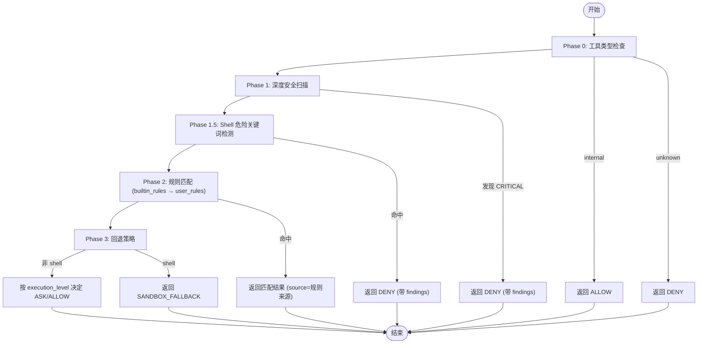
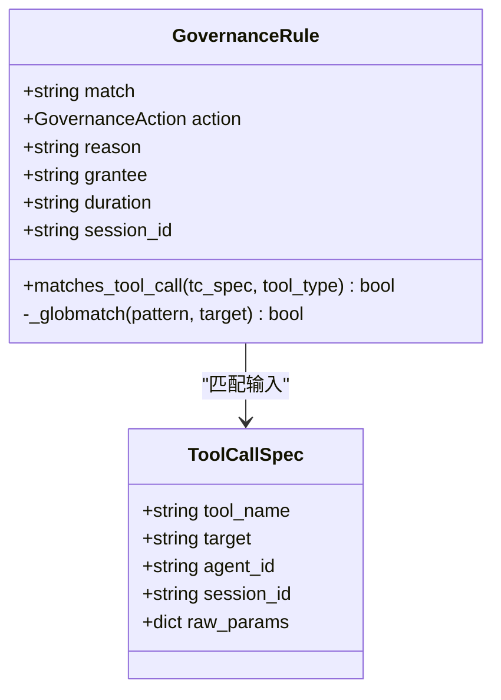
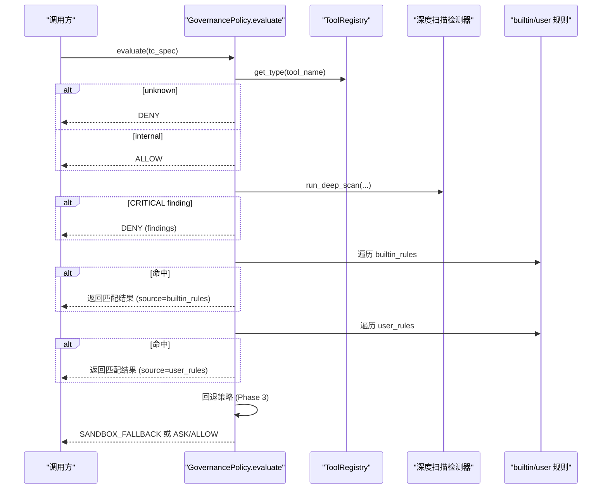
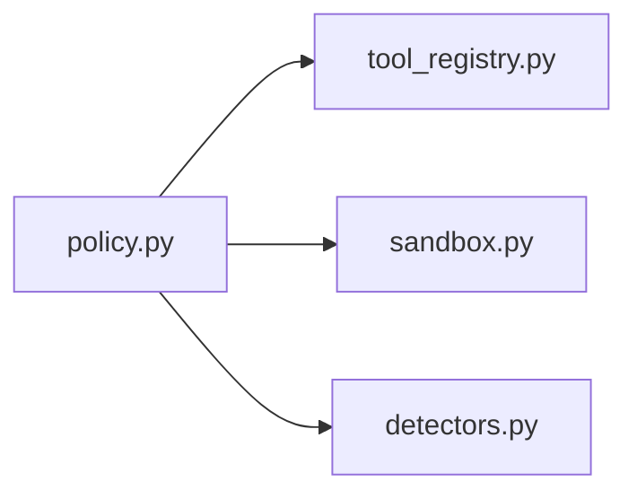

# 策略定义语言

<cite>
**本文引用的文件**
- [src/qwenpaw/governance/policy.py](file://src/qwenpaw/governance/policy.py)
- [tests/unit/governance/test_policy.py](file://tests/unit/governance/test_policy.py)
</cite>

## 目录
1. [简介](#简介)
2. [项目结构](#项目结构)
3. [核心组件](#核心组件)
4. [架构总览](#架构总览)
5. [详细组件分析](#详细组件分析)
6. [依赖关系分析](#依赖关系分析)
7. [性能考量](#性能考量)
8. [故障排查指南](#故障排查指南)
9. [结论](#结论)
10. [附录](#附录)

## 简介
本文件为 QwenPaw 治理策略定义语言的权威文档，聚焦于 GovernanceRule 数据类与 GovernanceAction 枚举的设计语义、匹配语法（ToolName(pattern)）、glob 模式匹配规则与通配符使用、规则优先级与 first-match-wins 评估逻辑、内置规则与用户自定义规则的加载与迁移机制，以及 grantee、duration、session_id 等高级属性的使用方法。文末提供完整的策略配置示例与代码级参考路径，帮助读者快速上手并安全地管理策略。

## 项目结构
QwenPaw 的治理策略核心位于 governance 模块，其中 policy.py 实现了策略模型、默认规则、加载/持久化与评估流程；单元测试覆盖关键行为与边界条件。

图表来源
- [src/qwenpaw/governance/policy.py:1-1418](file://src/qwenpaw/governance/policy.py#L1-L1418)
- [tests/unit/governance/test_policy.py:1-859](file://tests/unit/governance/test_policy.py#L1-L859)

章节来源
- [src/qwenpaw/governance/policy.py:1-1418](file://src/qwenpaw/governance/policy.py#L1-L1418)
- [tests/unit/governance/test_policy.py:1-859](file://tests/unit/governance/test_policy.py#L1-L859)

## 核心组件
- GovernanceAction：策略动作枚举，包含 ALLOW、DENY、ASK、SANDBOX_FALLBACK。
- GovernanceRule：统一策略规则，match 字段采用 ToolName(pattern) 格式，支持 glob 与 fnmatch 混合匹配，具备 grantee/duration/session_id 等高级属性。
- GovernancePolicy：策略容器，维护 builtin_rules 与 user_rules 两层规则集，实现三阶段评估与 first-match-wins 决策。
- DEFAULT_BUILTIN_RULES / DEFAULT_USER_RULES：系统内置保护规则与冷启动默认用户规则。
- load_governance_policy / save_governance_policy：策略加载与持久化，含占位符替换与迁移合并。

章节来源
- [src/qwenpaw/governance/policy.py:35-42](file://src/qwenpaw/governance/policy.py#L35-L42)
- [src/qwenpaw/governance/policy.py:89-186](file://src/qwenpaw/governance/policy.py#L89-L186)
- [src/qwenpaw/governance/policy.py:550-800](file://src/qwenpaw/governance/policy.py#L550-L800)
- [src/qwenpaw/governance/policy.py:253-259](file://src/qwenpaw/governance/policy.py#L253-L259)
- [src/qwenpaw/governance/policy.py:392-526](file://src/qwenpaw/governance/policy.py#L392-L526)
- [src/qwenpaw/governance/policy.py:992-1106](file://src/qwenpaw/governance/policy.py#L992-L1106)
- [src/qwenpaw/governance/policy.py:1109-1166](file://src/qwenpaw/governance/policy.py#L1109-L1166)

## 架构总览
策略引擎采用“三阶段 + 两层规则”的架构：
- Phase 0：工具类型检查（未知→DENY，内部→ALLOW）
- Phase 1：深度安全扫描（敏感路径、命令注入、Shell 逃逸等），CRITICAL 直接 DENY
- Phase 1.5：Shell 危险关键词正则检测（补充 fnmatch 无法覆盖的命令变体）
- Phase 2：builtin_rules → user_rules 顺序匹配，first-match-wins
- Phase 3：无命中时的回退策略（shell→SANDBOX_FALLBACK；非 shell 按 execution_level 决定 ASK/ALLOW）

图表来源
- [src/qwenpaw/governance/policy.py:607-730](file://src/qwenpaw/governance/policy.py#L607-L730)
- [src/qwenpaw/governance/policy.py:731-841](file://src/qwenpaw/governance/policy.py#L731-L841)

章节来源
- [src/qwenpaw/governance/policy.py:607-841](file://src/qwenpaw/governance/policy.py#L607-L841)

## 详细组件分析

### GovernanceAction 语义与差异
- ALLOW：允许执行。对显式资源型工具直接执行；对 Bash 类型工具在预授权情况下进入沙箱执行。
- DENY：拒绝执行。
- ASK：需要人工审批，批准后按工具类型决定是否走沙箱。
- SANDBOX_FALLBACK：仅用于 Bash 类型工具在无规则命中时的兜底，强制进入沙箱执行。

章节来源
- [src/qwenpaw/governance/policy.py:35-42](file://src/qwenpaw/governance/policy.py#L35-L42)
- [src/qwenpaw/governance/policy.py:106-115](file://src/qwenpaw/governance/policy.py#L106-L115)
- [src/qwenpaw/governance/policy.py:714-729](file://src/qwenpaw/governance/policy.py#L714-L729)

### GovernanceRule 设计要点
- match 字段语法：ToolName(pattern)
  - ToolName 可为具体工具名或 "*"（匹配所有工具）。
  - pattern 针对工具的 target 参数进行匹配。
- 匹配算法：
  - 当 rule_tool 为 "*" 或工具类型为 file 时，使用 wcmatch 的 glob 匹配（支持 GLOBSTAR、BRACE、NEGATE、SPLIT、DOTGLOB）。
  - 其他情况使用 fnmatch 进行模式匹配。
  - 对于 "*" 规则且工具类型为 shell 的情况，额外考虑子串匹配以捕获如 “cat .env” 这类命令中的敏感路径片段。
- 高级属性：
  - grantee：授权主体，支持 "*" 表示全部。
  - duration：作用域，支持 "permanent" 与 "session"。
  - session_id：当 duration="session" 时需绑定会话 ID，未携带或不匹配的请求不会命中该规则（fail-closed）。

图表来源
- [src/qwenpaw/governance/policy.py:89-186](file://src/qwenpaw/governance/policy.py#L89-L186)
- [src/qwenpaw/governance/policy.py:63-87](file://src/qwenpaw/governance/policy.py#L63-L87)

章节来源
- [src/qwenpaw/governance/policy.py:89-186](file://src/qwenpaw/governance/policy.py#L89-L186)

### 模式匹配语法与通配符
- ToolName(pattern) 解析：
  - 通过解析第一个 "(" 与最后一个 ")" 提取工具名与模式，支持模式中包含 ")" 的场景。
- Glob 匹配（wcmatch）：
  - 启用 GLOBSTAR、BRACE、NEGATE、SPLIT、DOTGLOB 标志。
  - 支持 "**" 跨层级匹配；同时提供目录自匹配增强（pattern 以 "/**" 结尾时，目标等于目录本身也视为匹配）。
- fnmatch 匹配：
  - 在非 "*" 规则或非 file 类型时使用，适用于简单通配符场景。
- 典型用法示例（以路径引用代替代码内容）：
  - 匹配任意工具访问 .ssh 目录：*(**/.ssh/**)
  - 匹配特定工具读取工作区文件：Read(WORKSPACE_DIR/**)
  - 匹配 Bash 中 git 相关命令：Bash(git *)

章节来源
- [src/qwenpaw/governance/policy.py:920-935](file://src/qwenpaw/governance/policy.py#L920-L935)
- [src/qwenpaw/governance/policy.py:124-141](file://src/qwenpaw/governance/policy.py#L124-L141)
- [src/qwenpaw/governance/policy.py:143-186](file://src/qwenpaw/governance/policy.py#L143-L186)

### 规则优先级与 first-match-wins
- 两层规则顺序：
  - 先遍历 builtin_rules，再遍历 user_rules，首个命中的规则决定决策（first-match-wins）。
- 新增规则优先级：
  - add_rule 将新规则插入到 user_rules 头部，确保最新批准/拒绝优先生效。
- STRICT 模式影响：
  - 若命中 ALLOW 且处于 strict 模式，则升级为 ASK，要求人工审批。
- 测试覆盖的关键点：
  - 内置 ASK 规则优先于用户 DENY 规则（例如 ~/.ssh 访问仍触发 ASK）。
  - 新增 DENY 可覆盖早期 ALLOW（如 Browser(**) → ALLOW 被后续 DENY 覆盖）。

章节来源
- [src/qwenpaw/governance/policy.py:667-711](file://src/qwenpaw/governance/policy.py#L667-L711)
- [src/qwenpaw/governance/policy.py:869-904](file://src/qwenpaw/governance/policy.py#L869-L904)
- [tests/unit/governance/test_policy.py:792-804](file://tests/unit/governance/test_policy.py#L792-L804)
- [tests/unit/governance/test_policy.py:812-824](file://tests/unit/governance/test_policy.py#L812-L824)

### 内置规则（builtin_rules）与用户规则（user_rules）
- 内置规则（不可由 YAML 覆盖）：
  - 资源保护 ASK 规则：*.env、.ssh、.aws、.gnupg、.kube、.netrc、.npmrc、.pypirc 等。
  - LLM 提供商/AI 助手配置文件 ASK 规则：.anthropic、.openai、.codex、.gemini、.claude、.cursor、.copilot、.codeium、.opencode 等。
  - Shell rc/history 与 PowerShell profile/history ASK 规则。
  - 高危命令 DENY 规则：rm -rf /、sudo、gh repo delete、gh api -X DELETE 等。
  - 注意：即使存在用户 DENY，内置 ASK 仍优先触发（见测试用例）。
- 默认用户规则（冷启动）：
  - 只读文件工具全局 ALLOW：Read(**)、Grep(**)、Glob(**)、ViewImage(**)、ViewVideo(**)、SendFileToUser(**)。
  - 工作区内读写操作 ALLOW：Read/Write/Edit/Append/Grep/Glob/ViewImage/ViewVideo/SendFileToUser(Deprecated DesktopScreenshot) 在 WORKSPACE_DIR/** 下。
  - 浏览器与网络工具 ALLOW：Browser(**)、WebSearch(**)、WebFetch(**)。
  - 临时目录 ALLOW：*(/tmp/**)。
  - 编码模式项目目录 ALLOW：*(CODING_PROJECT_DIR/**)。
  - GitHub CLI操作 ALLOW：Bash(gh)、Bash(gh *)。
- 迁移与合并：
  - 加载时若 user_rules 为空，则直接使用 DEFAULT_USER_RULES。
  - 若非空，则合并缺失的默认用户规则，但已记录 applied_migrations 的规则不会被重复添加（尊重用户删除意图）。
  - 保存时将实际路径还原为占位符（WORKSPACE_DIR/CODING_PROJECT_DIR），保持策略可移植性。

章节来源
- [src/qwenpaw/governance/policy.py:196-259](file://src/qwenpaw/governance/policy.py#L196-L259)
- [src/qwenpaw/governance/policy.py:392-526](file://src/qwenpaw/governance/policy.py#L392-L526)
- [src/qwenpaw/governance/policy.py:1023-1036](file://src/qwenpaw/governance/policy.py#L1023-L1036)
- [src/qwenpaw/governance/policy.py:1049-1063](file://src/qwenpaw/governance/policy.py#L1049-L1063)
- [src/qwenpaw/governance/policy.py:1128-1133](file://src/qwenpaw/governance/policy.py#L1128-L1133)
- [tests/unit/governance/test_policy.py:279-333](file://tests/unit/governance/test_policy.py#L279-L333)
- [tests/unit/governance/test_policy.py:335-387](file://tests/unit/governance/test_policy.py#L335-L387)

### 高级属性：grantee、duration、session_id
- grantee：限定规则适用的代理主体，"*" 表示全部。
- duration：
  - "permanent"：永久有效。
  - "session"：仅在当前会话内有效。
- session_id：
  - 当 duration="session" 时，必须与请求的 session_id 完全一致才会命中；否则不匹配（fail-closed）。

章节来源
- [src/qwenpaw/governance/policy.py:117-122](file://src/qwenpaw/governance/policy.py#L117-L122)
- [src/qwenpaw/governance/policy.py:162-173](file://src/qwenpaw/governance/policy.py#L162-L173)

### 策略配置示例（以路径引用代替代码内容）
- 创建默认策略并写入文件：
  - 参考路径：[src/qwenpaw/governance/policy.py:1201-1221](file://src/qwenpaw/governance/policy.py#L1201-L1221)
- 从磁盘加载策略（支持 v1.0/v2.0）：
  - 参考路径：[src/qwenpaw/governance/policy.py:992-1106](file://src/qwenpaw/governance/policy.py#L992-L1106)
- 保存策略（还原占位符，避免污染内存）：
  - 参考路径：[src/qwenpaw/governance/policy.py:1109-1166](file://src/qwenpaw/governance/policy.py#L1109-L1166)
- 动态添加/移除用户规则：
  - 参考路径：[src/qwenpaw/governance/policy.py:869-913](file://src/qwenpaw/governance/policy.py#L869-L913)
- 常见规则定义（路径引用）：
  - 内置 ASK/DENY 规则集合：[src/qwenpaw/governance/policy.py:196-259](file://src/qwenpaw/governance/policy.py#L196-L259)
  - 默认用户规则集合：[src/qwenpaw/governance/policy.py:392-526](file://src/qwenpaw/governance/policy.py#L392-L526)

章节来源
- [src/qwenpaw/governance/policy.py:992-1166](file://src/qwenpaw/governance/policy.py#L992-L1166)
- [src/qwenpaw/governance/policy.py:1201-1221](file://src/qwenpaw/governance/policy.py#L1201-L1221)
- [src/qwenpaw/governance/policy.py:869-913](file://src/qwenpaw/governance/policy.py#L869-L913)
- [src/qwenpaw/governance/policy.py:196-259](file://src/qwenpaw/governance/policy.py#L196-L259)
- [src/qwenpaw/governance/policy.py:392-526](file://src/qwenpaw/governance/policy.py#L392-L526)

### 评估流程时序图（调用链）

图表来源
- [src/qwenpaw/governance/policy.py:607-730](file://src/qwenpaw/governance/policy.py#L607-L730)
- [src/qwenpaw/governance/policy.py:731-841](file://src/qwenpaw/governance/policy.py#L731-L841)

章节来源
- [src/qwenpaw/governance/policy.py:607-841](file://src/qwenpaw/governance/policy.py#L607-L841)

## 依赖关系分析
- 工具类型注册表（ToolRegistry）：用于判断工具类型（unknown/internal/file/shell 等），影响匹配与回退策略。
- 沙箱配置（SandboxConfig）：用于 SANDBOX_FALLBACK 场景下的沙箱参数。
- 深度扫描检测器（detectors）：Phase 1 的安全检测，产出 GuardFinding 列表，影响最终决策。

图表来源
- [src/qwenpaw/governance/policy.py:26-28](file://src/qwenpaw/governance/policy.py#L26-L28)
- [src/qwenpaw/governance/policy.py:731-757](file://src/qwenpaw/governance/policy.py#L731-L757)

章节来源
- [src/qwenpaw/governance/policy.py:26-28](file://src/qwenpaw/governance/policy.py#L26-L28)
- [src/qwenpaw/governance/policy.py:731-757](file://src/qwenpaw/governance/policy.py#L731-L757)

## 性能考量
- 线性扫描：evaluate 对 builtin_rules 与 user_rules 进行顺序匹配，时间复杂度 O(N)。当前通过去重与 dedup 控制增长，但长期运行可能累积规则数量。
- 优化建议：
  - 限制 user_rules 最大数量（如 1024），结合 LRU/TTL 淘汰策略。
  - 对高频匹配的路径前缀建立索引或哈希表，减少全量扫描。
  - 将高优先级规则前置（add_rule 已实现），降低平均匹配成本。

章节来源
- [src/qwenpaw/governance/policy.py:869-904](file://src/qwenpaw/governance/policy.py#L869-L904)

## 故障排查指南
- 问题：保存后内存规则被污染（出现字面量 WORKSPACE_DIR）
  - 现象：首次 add_rule → save 后，内存规则中出现 literal "WORKSPACE_DIR/**"，导致 evaluate 不再匹配真实路径，降级为 ASK。
  - 原因：save 过程中对 live 规则对象进行了原地修改。
  - 修复：save 应操作副本并在输出前还原占位符，避免污染内存。
  - 参考路径：[tests/unit/governance/test_policy.py:82-116](file://tests/unit/governance/test_policy.py#L82-L116)
- 问题：新建默认规则未自动合并
  - 现象：新增 DEFAULT_USER_RULES 条目后，旧策略未获得新规则。
  - 修复：load 时根据 applied_migrations 与等价规则检测进行合并。
  - 参考路径：[tests/unit/governance/test_policy.py:279-333](file://tests/unit/governance/test_policy.py#L279-L333)
- 问题：WebSearch/WebFetch 未被默认允许
  - 现象：旧策略未包含 WebSearch/WebFetch 默认规则。
  - 修复：加载时自动合并并持久化。
  - 参考路径：[tests/unit/governance/test_policy.py:335-387](file://tests/unit/governance/test_policy.py#L335-L387)
- 问题：Bash 命令无规则命中
  - 现象：返回 SANDBOX_FALLBACK。
  - 期望：符合预期，进入沙箱执行。
  - 参考路径：[tests/unit/governance/test_policy.py:678-682](file://tests/unit/governance/test_policy.py#L678-L682)
- 问题：未知工具调用
  - 现象：返回 DENY。
  - 期望：符合预期。
  - 参考路径：[tests/unit/governance/test_policy.py:684-688](file://tests/unit/governance/test_policy.py#L684-L688)

章节来源
- [tests/unit/governance/test_policy.py:82-116](file://tests/unit/governance/test_policy.py#L82-L116)
- [tests/unit/governance/test_policy.py:279-333](file://tests/unit/governance/test_policy.py#L279-L333)
- [tests/unit/governance/test_policy.py:335-387](file://tests/unit/governance/test_policy.py#L335-L387)
- [tests/unit/governance/test_policy.py:678-688](file://tests/unit/governance/test_policy.py#L678-L688)

## 结论
QwenPaw 的策略定义语言以简洁的 ToolName(pattern) 语法为核心，结合强大的 glob/fnmatch 匹配能力与严格的优先级与回退策略，提供了灵活而安全的治理框架。通过内置规则保障系统级安全基线，用户规则提供细粒度控制，配合占位符与迁移机制确保策略的可移植性与演进友好性。建议在大规模部署中关注规则数量与匹配性能，并结合审计日志持续优化策略。

## 附录
- 常用匹配模式速查（路径引用）：
  - 资源保护 ASK：*(**/.env*)、*(**/.ssh/**)、*(**/*.pem)*、*(**/*.key)*、*(**/.aws/**)、*(**/.gnupg/**)、*(**/.kube/**)、*(**/.netrc)*、*(**/.npmrc)*、*(**/.pypirc)*
  - LLM 配置 ASK：*(**/.anthropic/**)、*(**/.config/anthropic/**)、*(**/.openai/**)、*(**/.config/openai/**)、*(**/.codex/**)、*(**/.gemini/**)、*(**/.config/gemini/**)、*(**/.claude/**)、*(**/.cursor/**)、*(**/.copilot/**)、*(**/.codeium/**)、*(**/.opencode/**)
  - Shell rc/history ASK：*(**/.bashrc)*、*(**/.zshrc)*、*(**/.profile)*、*(**/.bash_profile)*、*(**/.bash_history)*、*(**/.zsh_history)*、*(**/Microsoft.PowerShell_profile.ps1)*、*(**/ConsoleHost_history.txt)*
  - 高危命令 DENY：Bash(rm * -rf *//*)、Bash(sudo *)、Bash(gh repo delete *)、Bash(gh api -X DELETE *)
  - 默认用户规则：Read(**)/Grep(**)/Glob(**)/ViewImage(**)/ViewVideo(**)/SendFileToUser(**)、Read/Write/Edit/Append/Grep/Glob/ViewImage/ViewVideo/SendFileToUser(Deprecated DesktopScreenshot) 在 WORKSPACE_DIR/**、Browser(**)、WebSearch(**)、WebFetch(**)、*(/tmp/**)、*(CODING_PROJECT_DIR/**)、Bash(gh)、Bash(gh *)

章节来源
- [src/qwenpaw/governance/policy.py:196-259](file://src/qwenpaw/governance/policy.py#L196-L259)
- [src/qwenpaw/governance/policy.py:392-526](file://src/qwenpaw/governance/policy.py#L392-L526)