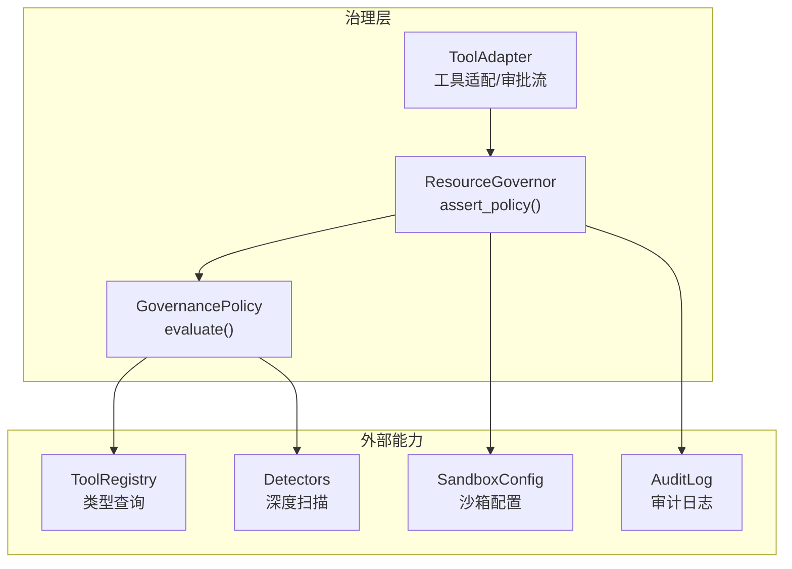
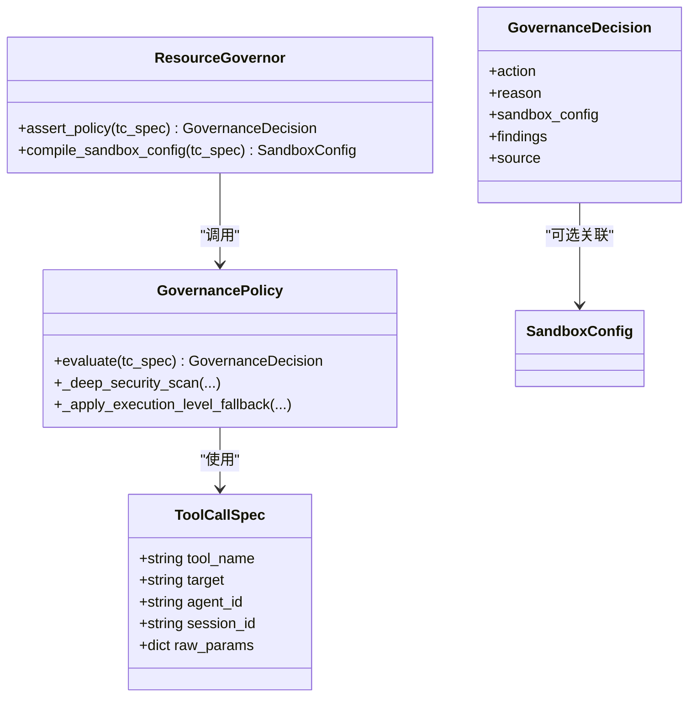
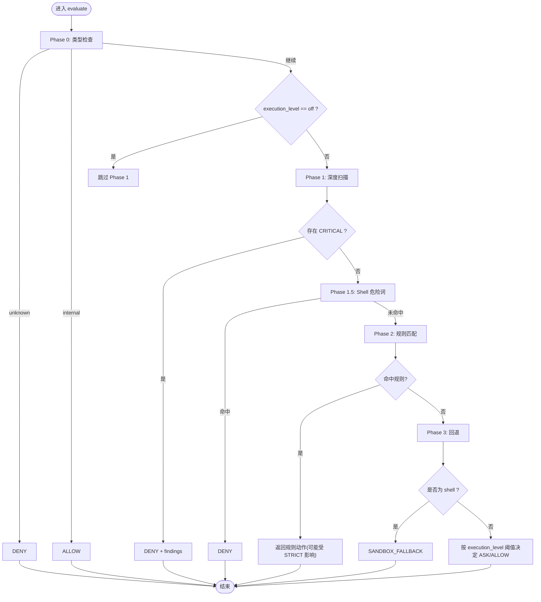
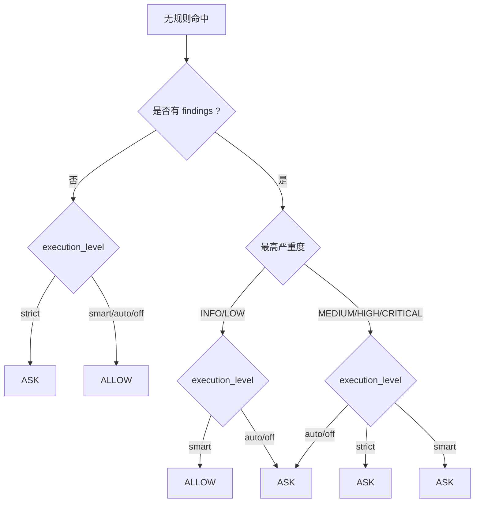
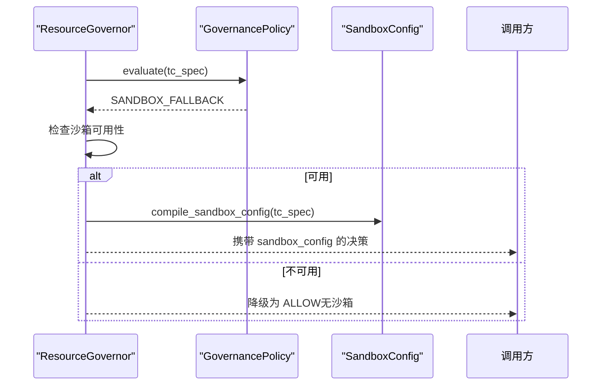
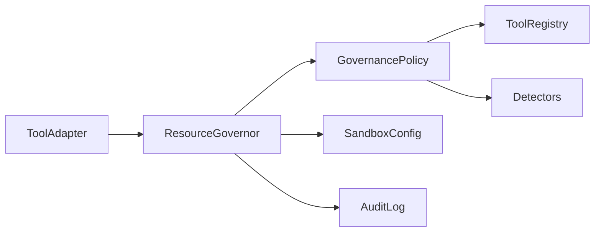

# 策略评估引擎

<cite>
**本文引用的文件**   
- [policy.py](file://src/qwenpaw/governance/policy.py)
- [resource_governor.py](file://src/qwenpaw/governance/resource_governor.py)
- [tool_adapter.py](file://src/qwenpaw/governance/tool_adapter.py)
- [config.py](file://src/qwenpaw/config/config.py)
</cite>

## 目录
1. [简介](#简介)
2. [项目结构](#项目结构)
3. [核心组件](#核心组件)
4. [架构总览](#架构总览)
5. [详细组件分析](#详细组件分析)
6. [依赖关系分析](#依赖关系分析)
7. [性能考虑](#性能考虑)
8. [故障排查指南](#故障排查指南)
9. [结论](#结论)

## 简介
本文件为 QwenPaw 的策略评估引擎提供架构文档，聚焦三阶段（含 Phase 0）评估流程、ToolCallSpec 与 GovernanceDecision 的数据模型、执行级别 execution_level 的语义差异，以及回退处理与沙箱配置编译。文档同时给出流程图与决策树，帮助读者理解不同场景下的处理逻辑与优化点。

## 项目结构
策略评估引擎位于 governance 模块中，核心由策略定义与加载、规则匹配、深度安全扫描、回退与执行级别阈值控制组成；资源治理器负责将策略评估结果落地为可执行的沙箱配置或审批动作，并记录审计日志。



图表来源
- [policy.py:607-730](file://src/qwenpaw/governance/policy.py#L607-L730)
- [resource_governor.py:196-271](file://src/qwenpaw/governance/resource_governor.py#L196-L271)
- [tool_adapter.py:266-309](file://src/qwenpaw/governance/tool_adapter.py#L266-L309)

章节来源
- [policy.py:1-120](file://src/qwenpaw/governance/policy.py#L1-L120)
- [resource_governor.py:1-120](file://src/qwenpaw/governance/resource_governor.py#L1-L120)

## 核心组件
- ToolCallSpec：描述一次工具调用的上下文，包含工具名、目标路径/命令、Agent ID、会话 ID 与原始参数。
- GovernanceDecision：表达策略评估的最终决策，包括动作、原因、可选的沙箱配置与安全发现列表，以及决策来源。
- GovernancePolicy：策略主体，维护内置规则与用户规则，实现 evaluate() 三阶段（含 Phase 0）评估流程。
- ResourceGovernor：策略评估的执行入口，负责沙箱可用性判断、SANDBOX_FALLBACK 降级、沙箱配置编译与审计记录。
- ToolAdapter：在工具调用链路中接入治理层，支持开发模式 bypass 与 SANDBOX_FALLBACK 分支处理。

章节来源
- [policy.py:44-86](file://src/qwenpaw/governance/policy.py#L44-L86)
- [policy.py:550-606](file://src/qwenpaw/governance/policy.py#L550-L606)
- [resource_governor.py:42-120](file://src/qwenpaw/governance/resource_governor.py#L42-L120)
- [tool_adapter.py:37-56](file://src/qwenpaw/governance/tool_adapter.py#L37-L56)

## 架构总览
策略评估引擎采用“先类型检查、再深度扫描、后规则匹配、最后回退”的分层流水线，结合 execution_level 控制严格程度与是否跳过深度扫描。

```mermaid
sequenceDiagram
participant Caller as "调用方"
participant Adapter as "ToolAdapter"
participant Governor as "ResourceGovernor"
participant Policy as "GovernancePolicy"
participant Registry as "ToolRegistry"
participant Detectors as "Detectors"
participant Sandbox as "SandboxConfig"
Caller->>Adapter : 发起工具调用
alt 开发模式 execution_level=off
Adapter-->>Caller : 直接放行(绕过治理)
else 正常模式
Adapter->>Governor : assert_policy(tc_spec)
Governor->>Policy : evaluate(tc_spec)
Policy->>Registry : get_type(tool_name)
alt unknown → DENY; internal → ALLOW
Policy-->>Governor : 返回决策
else 继续
Policy->>Detectors : _deep_security_scan(...)
Detectors-->>Policy : findings
alt CRITICAL → DENY
Policy-->>Governor : DENY + findings
else 继续
Policy->>Policy : Phase 2 规则匹配(builtin/user)
alt 命中规则
Policy-->>Governor : ALLOW/DENY/ASK
else 未命中
Policy->>Policy : Phase 3 回退(execution_level)
alt shell → SANDBOX_FALLBACK
Policy-->>Governor : SANDBOX_FALLBACK
else 其他 → ASK/ALLOW
Policy-->>Governor : ASK/ALLOW
end
end
end
end
Governor->>Governor : 若 SANDBOX_FALLBACK 且不可用 → 降级为 ALLOW
Governor->>Sandbox : compile_sandbox_config()
Governor-->>Adapter : 返回最终决策
Adapter-->>Caller : 执行/审批/拒绝
end
```

图表来源
- [policy.py:607-730](file://src/qwenpaw/governance/policy.py#L607-L730)
- [resource_governor.py:196-271](file://src/qwenpaw/governance/resource_governor.py#L196-L271)
- [tool_adapter.py:266-309](file://src/qwenpaw/governance/tool_adapter.py#L266-L309)

## 详细组件分析

### 数据模型：ToolCallSpec 与 GovernanceDecision
- ToolCallSpec
  - 字段：工具名称、目标路径/命令、Agent ID、会话 ID、原始参数。
  - 作用：贯穿评估全链路的上下文载体，用于规则匹配、审计与审批卡片展示。
- GovernanceDecision
  - 字段：动作（allow/deny/ask/sandbox_fallback）、原因、沙箱配置、安全发现列表、决策来源。
  - 作用：统一表达策略评估结果，驱动上层执行、审批或沙箱隔离。



图表来源
- [policy.py:44-86](file://src/qwenpaw/governance/policy.py#L44-L86)
- [policy.py:550-606](file://src/qwenpaw/governance/policy.py#L550-L606)
- [resource_governor.py:300-379](file://src/qwenpaw/governance/resource_governor.py#L300-L379)

章节来源
- [policy.py:44-86](file://src/qwenpaw/governance/policy.py#L44-L86)
- [resource_governor.py:300-379](file://src/qwenpaw/governance/resource_governor.py#L300-L379)

### 三阶段评估流程（Phase 0/1/1.5/2/3）
- Phase 0：工具类型检查
  - 未知工具 → DENY
  - 内部工具 → ALLOW
- Phase 1：深度安全扫描
  - 累积 findings；出现 CRITICAL → 立即 DENY
  - execution_level=off 时跳过此阶段
- Phase 1.5：Shell 危险关键词检测
  - 针对 shell 工具的正则兜底，命中则 DENY
- Phase 2：规则匹配（first-match-wins）
  - 先匹配 builtin_rules，再匹配 user_rules
  - STRICT 模式下，所有 ALLOW 会被提升为 ASK
- Phase 3：回退与执行级别阈值
  - shell 无命中 → SANDBOX_FALLBACK
  - 非 shell 无命中 → 根据 execution_level 决定 ASK/ALLOW



图表来源
- [policy.py:607-730](file://src/qwenpaw/governance/policy.py#L607-L730)
- [policy.py:759-840](file://src/qwenpaw/governance/policy.py#L759-L840)

章节来源
- [policy.py:607-730](file://src/qwenpaw/governance/policy.py#L607-L730)
- [policy.py:759-840](file://src/qwenpaw/governance/policy.py#L759-L840)

### 执行级别（execution_level）的影响
- off：跳过 Phase 1 深度扫描，直接进入 Phase 2；在 ToolAdapter 中可作为开发模式直通。
- auto：默认行为之一，无 findings 且无规则命中时允许；有 findings 时通常 ASK。
- smart：更智能的阈值控制，低严重度 findings 允许，中等及以上 ASK；无 findings 且无规则命中时允许。
- strict：最严格，所有工具调用均需审批（ALLOW 被提升为 ASK），shell 也需审批。



图表来源
- [policy.py:759-840](file://src/qwenpaw/governance/policy.py#L759-L840)
- [policy.py:668-711](file://src/qwenpaw/governance/policy.py#L668-L711)

章节来源
- [policy.py:668-711](file://src/qwenpaw/governance/policy.py#L668-L711)
- [policy.py:759-840](file://src/qwenpaw/governance/policy.py#L759-L840)

### 回退处理与沙箱配置
- SANDBOX_FALLBACK：当 shell 工具未被任何规则命中时触发。
- 沙箱可用性降级：若平台不支持或全局开关关闭，SANDBOX_FALLBACK 会降级为 ALLOW（不运行在沙箱内）。
- 沙箱配置编译：基于用户规则中的读写工具与路径，生成 SandboxConfig（挂载、禁止路径、环境变量黑名单等）。



图表来源
- [resource_governor.py:196-271](file://src/qwenpaw/governance/resource_governor.py#L196-L271)
- [resource_governor.py:300-379](file://src/qwenpaw/governance/resource_governor.py#L300-L379)

章节来源
- [resource_governor.py:196-271](file://src/qwenpaw/governance/resource_governor.py#L196-L271)
- [resource_governor.py:300-379](file://src/qwenpaw/governance/resource_governor.py#L300-L379)

### 工具适配与开发模式
- ToolAdapter 在 execution_level=off 时可作为开发模式直通，绕过治理层。
- 对 SANDBOX_FALLBACK 分支进行特殊处理，避免在非沙箱环境误执行。

章节来源
- [tool_adapter.py:37-56](file://src/qwenpaw/governance/tool_adapter.py#L37-L56)
- [tool_adapter.py:266-309](file://src/qwenpaw/governance/tool_adapter.py#L266-L309)

## 依赖关系分析
- GovernancePolicy 依赖 ToolRegistry 获取工具类型，依赖 Detectors 执行深度扫描。
- ResourceGovernor 组合策略评估、沙箱配置编译与审计记录。
- ToolAdapter 在工具调用链路中接入治理层，并根据 execution_level 决定是否 bypass。



图表来源
- [policy.py:607-730](file://src/qwenpaw/governance/policy.py#L607-L730)
- [resource_governor.py:196-271](file://src/qwenpaw/governance/resource_governor.py#L196-L271)
- [tool_adapter.py:266-309](file://src/qwenpaw/governance/tool_adapter.py#L266-L309)

章节来源
- [policy.py:607-730](file://src/qwenpaw/governance/policy.py#L607-L730)
- [resource_governor.py:196-271](file://src/qwenpaw/governance/resource_governor.py#L196-L271)
- [tool_adapter.py:266-309](file://src/qwenpaw/governance/tool_adapter.py#L266-L309)

## 性能考虑
- 规则匹配顺序：builtin_rules 在前，user_rules 在后，first-match-wins 减少后续匹配成本。
- 用户规则去重与插入头部：新增规则优先生效，避免重复累积导致线性扫描增长。
- 深度扫描异常容错：扫描失败不影响主流程，仅记录警告并继续。
- 沙箱配置编译：从用户规则提取路径映射，避免不必要的通配符解析。

章节来源
- [policy.py:869-904](file://src/qwenpaw/governance/policy.py#L869-L904)
- [policy.py:731-758](file://src/qwenpaw/governance/policy.py#L731-L758)
- [resource_governor.py:300-379](file://src/qwenpaw/governance/resource_governor.py#L300-L379)

## 故障排查指南
- 沙箱不可用导致 SANDBOX_FALLBACK 降级为 ALLOW：检查平台支持与全局开关 security.sandbox_enabled。
- 开发模式 bypass：确认 execution_level 是否为 off，避免在生产环境误开启。
- 规则未命中导致频繁 ASK：检查 user_rules 是否覆盖常见路径，必要时添加显式 ALLOW 规则。
- 审计日志缺失：确认 ResourceGovernor.audit 是否在调用方正确记录。

章节来源
- [resource_governor.py:106-134](file://src/qwenpaw/governance/resource_governor.py#L106-L134)
- [config.py:867-889](file://src/qwenpaw/config/config.py#L867-L889)
- [resource_governor.py:277-294](file://src/qwenpaw/governance/resource_governor.py#L277-L294)

## 结论
QwenPaw 的策略评估引擎通过清晰的四阶段（含 Phase 0）流水线与灵活的 execution_level 控制，实现了从快速类型检查到深度安全扫描、再到规则匹配与回退处理的完整闭环。配合沙箱配置编译与审计记录，既保证了安全性，又兼顾了易用性与可扩展性。建议在部署中合理设置 execution_level 与用户规则，确保在安全与效率之间取得平衡。