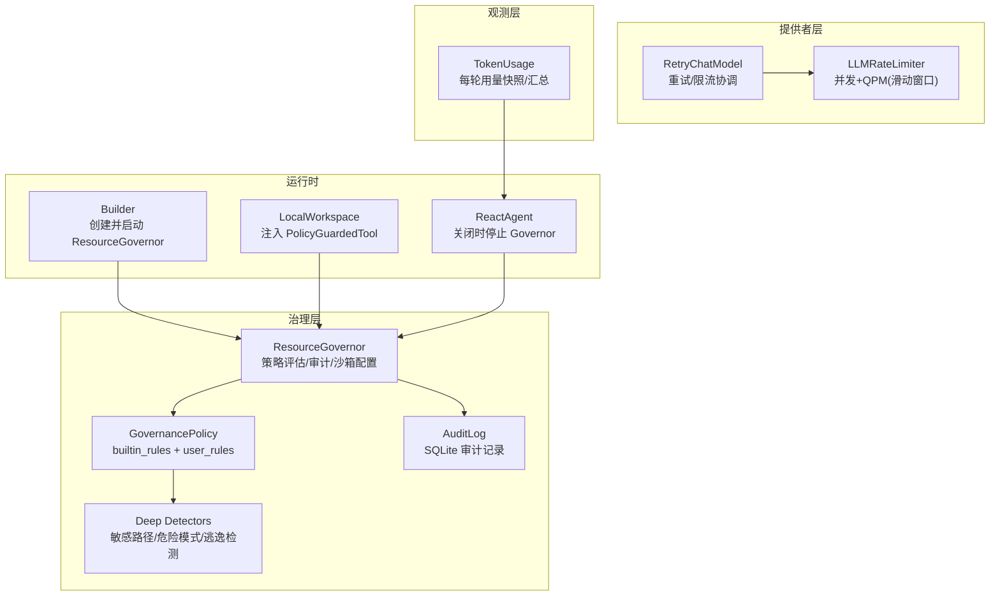
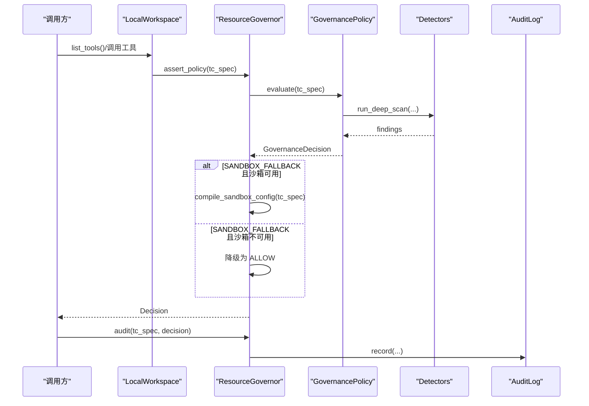
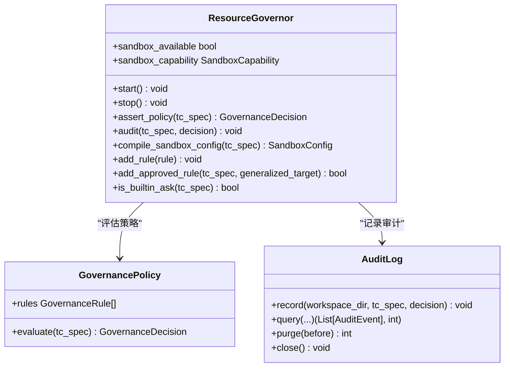
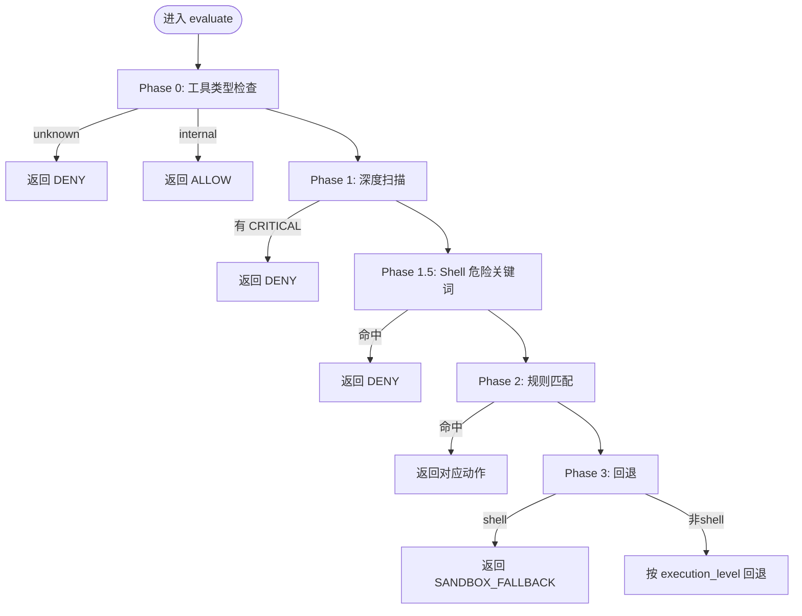
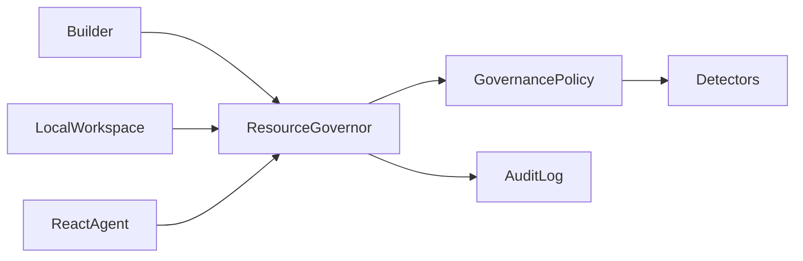
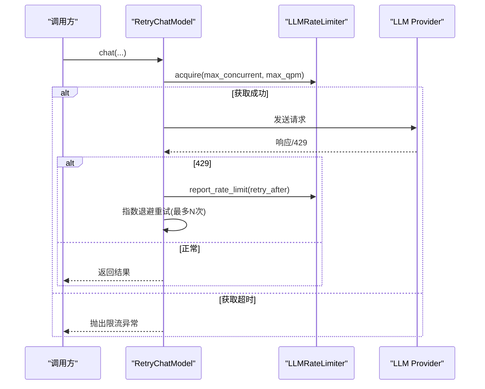

# 资源治理器

<cite>
**本文引用的文件列表**
- [resource_governor.py](file://src/qwenpaw/governance/resource_governor.py)
- [policy.py](file://src/qwenpaw/governance/policy.py)
- [detectors.py](file://src/qwenpaw/governance/detectors.py)
- [audit.py](file://src/qwenpaw/governance/audit.py)
- [builder.py](file://src/qwenpaw/runtime/builder.py)
- [local_workspace.py](file://src/qwenpaw/app/workspace/local_workspace.py)
- [react_agent.py](file://src/qwenpaw/agents/react_agent.py)
- [config.py](file://src/qwenpaw/config/config.py)
- [constant.py](file://src/qwenpaw/constant.py)
- [retry_chat_model.py](file://src/qwenpaw/providers/retry_chat_model.py)
- [rate_limiter.py](file://src/qwenpaw/providers/rate_limiter.py)
- [turn_usage.py](file://src/qwenpaw/token_usage/turn_usage.py)
- [test_console_metadata.py](file://tests/integration/test_console_metadata.py)
- [security.en.md](file://website/public/docs/security.en.md)
</cite>

## 目录
1. [简介](#简介)
2. [项目结构](#项目结构)
3. [核心组件](#核心组件)
4. [架构总览](#架构总览)
5. [详细组件分析](#详细组件分析)
6. [依赖关系分析](#依赖关系分析)
7. [性能与限流](#性能与限流)
8. [成本监控与预算控制](#成本监控与预算控制)
9. [高可用与故障恢复](#高可用与故障恢复)
10. [沙箱集成与权限隔离](#沙箱集成与权限隔离)
11. [配置示例与指标采集](#配置示例与指标采集)
12. [故障排查指南](#故障排查指南)
13. [结论](#结论)

## 简介
本文件为 QwenPaw 的“资源治理器”提供架构文档，聚焦 ResourceGovernor 的职责、生命周期管理、策略加载与规则评估、决策协调、审计记录、以及沙箱配置编译。同时说明系统内与限流、令牌桶/滑动窗口、成本监控（API 调用统计、token 使用追踪、预算控制）等相关机制的实现位置与协作方式，并提供高可用设计与故障恢复建议、沙箱集成与权限隔离说明，以及资源配置示例和监控指标采集方法。

## 项目结构
资源治理相关代码主要位于 governance 包中，并由运行时构建器在 Agent 启动时初始化；策略引擎由 policy 模块实现，检测器由 detectors 模块提供；审计日志由 audit 模块持久化；限流与重试逻辑位于 providers 层；token 用量统计在 token_usage 模块；安全与沙箱能力在 website 文档中有详细说明。

图表来源
- [resource_governor.py:1-510](file://src/qwenpaw/governance/resource_governor.py#L1-L510)
- [policy.py:1-800](file://src/qwenpaw/governance/policy.py#L1-L800)
- [detectors.py:1-764](file://src/qwenpaw/governance/detectors.py#L1-L764)
- [audit.py:1-381](file://src/qwenpaw/governance/audit.py#L1-L381)
- [builder.py:396-432](file://src/qwenpaw/runtime/builder.py#L396-L432)
- [local_workspace.py:28-68](file://src/qwenpaw/app/workspace/local_workspace.py#L28-L68)
- [react_agent.py:288-319](file://src/qwenpaw/agents/react_agent.py#L288-L319)
- [retry_chat_model.py:26-403](file://src/qwenpaw/providers/retry_chat_model.py#L26-L403)
- [turn_usage.py:1-101](file://src/qwenpaw/token_usage/turn_usage.py#L1-L101)

章节来源
- [resource_governor.py:1-510](file://src/qwenpaw/governance/resource_governor.py#L1-L510)
- [policy.py:1-800](file://src/qwenpaw/governance/policy.py#L1-L800)
- [detectors.py:1-764](file://src/qwenpaw/governance/detectors.py#L1-L764)
- [audit.py:1-381](file://src/qwenpaw/governance/audit.py#L1-L381)
- [builder.py:396-432](file://src/qwenpaw/runtime/builder.py#L396-L432)
- [local_workspace.py:28-68](file://src/qwenpaw/app/workspace/local_workspace.py#L28-L68)
- [react_agent.py:288-319](file://src/qwenpaw/agents/react_agent.py#L288-L319)
- [retry_chat_model.py:26-403](file://src/qwenpaw/providers/retry_chat_model.py#L26-L403)
- [turn_usage.py:1-101](file://src/qwenpaw/token_usage/turn_usage.py#L1-L101)

## 核心组件
- ResourceGovernor：策略评估入口、审计记录、动态规则追加、沙箱配置编译。
- GovernancePolicy：双轨策略（内置规则 + 用户规则），三阶段评估（深度扫描、规则匹配、回退）。
- Deep Detectors：敏感路径、危险模式、Shell 逃逸检测。
- AuditLog：全局单例 SQLite 审计表，支持分页查询与自动清理。
- Builder：在 Agent 启动时创建并启动 ResourceGovernor，失败时 fail-closed。
- LocalWorkspace：将 PolicyGuardedTool 注入工具列表，使工具调用受治理约束。
- ReactAgent：在关闭时调用 governor.stop() 释放审计数据库句柄。

章节来源
- [resource_governor.py:42-510](file://src/qwenpaw/governance/resource_governor.py#L42-L510)
- [policy.py:534-800](file://src/qwenpaw/governance/policy.py#L534-L800)
- [detectors.py:56-113](file://src/qwenpaw/governance/detectors.py#L56-L113)
- [audit.py:90-381](file://src/qwenpaw/governance/audit.py#L90-L381)
- [builder.py:396-432](file://src/qwenpaw/runtime/builder.py#L396-L432)
- [local_workspace.py:28-68](file://src/qwenpaw/app/workspace/local_workspace.py#L28-L68)
- [react_agent.py:288-319](file://src/qwenpaw/agents/react_agent.py#L288-L319)

## 架构总览
ResourceGovernor 作为治理中心，负责：
- 启动时加载策略到内存并持久化默认迁移后的策略文件。
- 对每次工具调用进行策略评估，产出 ALLOW/DENY/ASK/SANDBOX_FALLBACK 决策。
- 当 SANDBOX_FALLBACK 且沙箱不可用时降级为 ALLOW（保留 Phase 0-2 保护）。
- 根据策略编译 SandboxConfig（挂载点、deny_paths、网络允许、超时、环境变量黑名单等）。
- 通过 AuditLog 记录决策用于合规与排障。

图表来源
- [resource_governor.py:196-271](file://src/qwenpaw/governance/resource_governor.py#L196-L271)
- [policy.py:607-730](file://src/qwenpaw/governance/policy.py#L607-L730)
- [detectors.py:56-113](file://src/qwenpaw/governance/detectors.py#L56-L113)
- [audit.py:187-244](file://src/qwenpaw/governance/audit.py#L187-L244)

## 详细组件分析

### ResourceGovernor 类职责与生命周期
- 职责
  - 策略评估：assert_policy → GovernanceDecision
  - 审计记录：audit → AuditLog.record
  - 沙箱配置编译：compile_sandbox_config → SandboxConfig
  - 动态规则追加：add_rule / add_approved_rule
- 生命周期
  - start：创建策略目录、加载策略、保存默认迁移结果、探测沙箱能力
  - stop：持久化策略变更、关闭审计日志连接（触发 VACUUM）
  - sandbox_available/sandbox_capability：暴露平台能力检测结果
  - _sandbox_usable：结合平台支持与全局开关决定是否可走沙箱

图表来源
- [resource_governor.py:42-510](file://src/qwenpaw/governance/resource_governor.py#L42-L510)
- [policy.py:534-800](file://src/qwenpaw/governance/policy.py#L534-L800)
- [audit.py:90-381](file://src/qwenpaw/governance/audit.py#L90-L381)

章节来源
- [resource_governor.py:136-191](file://src/qwenpaw/governance/resource_governor.py#L136-L191)
- [resource_governor.py:196-271](file://src/qwenpaw/governance/resource_governor.py#L196-L271)
- [resource_governor.py:300-380](file://src/qwenpaw/governance/resource_governor.py#L300-L380)
- [resource_governor.py:412-493](file://src/qwenpaw/governance/resource_governor.py#L412-L493)

### 策略加载与规则管理
- 策略文件存储于工作区外的治理目录，按工作区哈希隔离，避免多工作区共享策略。
- 内置规则（敏感文件访问 ASK、高危命令 DENY）与用户规则（会话级或永久）合并评估。
- 首次启动会保存默认迁移后的策略，确保后续一致性。
- 用户批准后可动态追加规则，并持久化。

章节来源
- [resource_governor.py:56-87](file://src/qwenpaw/governance/resource_governor.py#L56-L87)
- [resource_governor.py:136-166](file://src/qwenpaw/governance/resource_governor.py#L136-L166)
- [policy.py:253-527](file://src/qwenpaw/governance/policy.py#L253-L527)
- [resource_governor.py:412-478](file://src/qwenpaw/governance/resource_governor.py#L412-L478)

### 决策协调与执行路径
- 三阶段评估：
  - Phase 0：工具类型检查（未知→DENY，内部→ALLOW）
  - Phase 1：深度扫描（敏感路径、危险模式、Shell 逃逸），CRITICAL→DENY
  - Phase 1.5：Shell 危险关键词正则补充
  - Phase 2：内置规则 + 用户规则（首次命中）
  - Phase 3：回退（shell→SANDBOX_FALLBACK，其他→根据 execution_level 回退）
- SANDBOX_FALLBACK 且沙箱不可用时降级为 ALLOW（保留前置保护）。

图表来源
- [policy.py:607-730](file://src/qwenpaw/governance/policy.py#L607-L730)
- [policy.py:731-800](file://src/qwenpaw/governance/policy.py#L731-L800)

章节来源
- [policy.py:607-730](file://src/qwenpaw/governance/policy.py#L607-L730)
- [policy.py:731-800](file://src/qwenpaw/governance/policy.py#L731-L800)

### 审计记录与查询
- 全局单例 AuditLog，WAL 模式，线程锁保护写入。
- 记录 5W：who(agent_id)、what(tool_name+target)、when(ts)、outcome(decision)、why(reason)。
- 支持分页查询与自动清理（超过阈值删除最旧记录）。

章节来源
- [audit.py:90-381](file://src/qwenpaw/governance/audit.py#L90-L381)

### 与运行时集成
- Builder 在 Agent 启动时创建并启动 ResourceGovernor，异常时 fail-closed。
- LocalWorkspace 注入 PolicyGuardedTool，使工具调用受治理约束。
- ReactAgent 关闭时调用 governor.stop() 释放审计句柄。

章节来源
- [builder.py:396-432](file://src/qwenpaw/runtime/builder.py#L396-L432)
- [local_workspace.py:28-68](file://src/qwenpaw/app/workspace/local_workspace.py#L28-L68)
- [react_agent.py:288-319](file://src/qwenpaw/agents/react_agent.py#L288-L319)

## 依赖关系分析
- ResourceGovernor 依赖：
  - GovernancePolicy（策略评估）
  - Detectors（深度扫描）
  - AuditLog（审计持久化）
  - Sandbox 能力探测与配置编译
- 运行时依赖：
  - Builder 负责生命周期
  - LocalWorkspace 注入治理包装
  - ReactAgent 负责优雅关闭

图表来源
- [resource_governor.py:1-510](file://src/qwenpaw/governance/resource_governor.py#L1-L510)
- [policy.py:1-800](file://src/qwenpaw/governance/policy.py#L1-L800)
- [detectors.py:1-764](file://src/qwenpaw/governance/detectors.py#L1-L764)
- [audit.py:1-381](file://src/qwenpaw/governance/audit.py#L1-L381)
- [builder.py:396-432](file://src/qwenpaw/runtime/builder.py#L396-L432)
- [local_workspace.py:28-68](file://src/qwenpaw/app/workspace/local_workspace.py#L28-L68)
- [react_agent.py:288-319](file://src/qwenpaw/agents/react_agent.py#L288-L319)

章节来源
- [resource_governor.py:1-510](file://src/qwenpaw/governance/resource_governor.py#L1-L510)
- [policy.py:1-800](file://src/qwenpaw/governance/policy.py#L1-L800)
- [detectors.py:1-764](file://src/qwenpaw/governance/detectors.py#L1-L764)
- [audit.py:1-381](file://src/qwenpaw/governance/audit.py#L1-L381)
- [builder.py:396-432](file://src/qwenpaw/runtime/builder.py#L396-L432)
- [local_workspace.py:28-68](file://src/qwenpaw/app/workspace/local_workspace.py#L28-L68)
- [react_agent.py:288-319](file://src/qwenpaw/agents/react_agent.py#L288-L319)

## 性能与限流
- LLM 并发控制：通过全局 LLMRateLimiter 限制最大并发请求数。
- 滑动窗口限流：基于 60 秒滑动窗口限制每分钟查询数（QPM），超出则等待。
- 429 处理：收到 429 后设置全局暂停时间，并叠加随机抖动避免惊群效应。
- 获取超时：acquire_timeout 控制等待上限，超时直接抛出限流异常。

图表来源
- [retry_chat_model.py:26-403](file://src/qwenpaw/providers/retry_chat_model.py#L26-L403)
- [constant.py:314-355](file://src/qwenpaw/constant.py#L314-L355)
- [config.py:1183-1228](file://src/qwenpaw/config/config.py#L1183-L1228)

章节来源
- [retry_chat_model.py:26-403](file://src/qwenpaw/providers/retry_chat_model.py#L26-L403)
- [constant.py:314-355](file://src/qwenpaw/constant.py#L314-L355)
- [config.py:1183-1228](file://src/qwenpaw/config/config.py#L1183-L1228)

## 成本监控与预算控制
- Token 使用追踪：
  - 每轮上下文用量快照：从 AgentState 估算当前上下文 token 占用与最近助手消息 token 量。
  - TUI 状态栏展示 compact 格式的 token 计数。
- API 调用统计：
  - 集成测试验证 /api/token-usage 与 /api/token-usage/details 的返回结构稳定。
- 预算控制：
  - 当前仓库未实现统一的 token 预算硬限制；可通过外部监控系统聚合 /api/token-usage 数据并结合业务阈值告警。

章节来源
- [turn_usage.py:1-101](file://src/qwenpaw/token_usage/turn_usage.py#L1-L101)
- [test_console_metadata.py:58-92](file://tests/integration/test_console_metadata.py#L58-L92)

## 高可用与故障恢复
- 治理层容错：
  - Builder 启动 ResourceGovernor 失败时 fail-closed，保证安全优先。
  - AuditLog 写入异常不会中断策略决策，仅记录错误日志。
  - 审计库采用 WAL 模式，减少写阻塞；关闭时执行 VACUUM 回收空间。
- 限流与重试：
  - 429 场景下统一暂停与抖动，避免雪崩；超长 Retry-After 直接上抛，避免无效重试。
- 备份恢复：
  - 恢复编排独立于核心逻辑，后台预加载代理，单个失败不影响其余代理重启。

章节来源
- [builder.py:396-432](file://src/qwenpaw/runtime/builder.py#L396-L432)
- [audit.py:171-186](file://src/qwenpaw/governance/audit.py#L171-L186)
- [retry_chat_model.py:373-403](file://src/qwenpaw/providers/retry_chat_model.py#L373-L403)
- [backup/orchestration.py:1-43](file://src/qwenpaw/backup/orchestration.py#L1-L43)

## 沙箱集成与权限隔离
- 平台后端：macOS Seatbelt、Linux Bubblewrap/Landlock、Windows AppContainer、None。
- 隔离模型：deny-default 白名单，仅显式声明的 mounts 可写；deny_paths 强制拒绝；最小 /dev；PID 隔离（Bubblewrap）。
- 当前限制：
  - 网络隔离未实现，所有沙箱进程具备完整网络访问。
  - 资源限制字段存在但未强制执行。
  - Windows AppContainer 需要管理员权限进行初始 ACL 设置。

章节来源
- [security.en.md:364-460](file://website/public/docs/security.en.md#L364-L460)

## 配置示例与指标采集
- 关键配置项（节选）：
  - llm_max_concurrent：最大并发 LLM 调用
  - llm_max_qpm：每分钟查询数（滑动窗口，0=禁用）
  - llm_rate_limit_pause：429 后的全局暂停秒数
  - llm_rate_limit_jitter：抖动范围秒数
  - llm_acquire_timeout：获取限流槽位的最大等待秒数
  - shell_command_timeout：Shell 命令默认超时秒数
- 指标采集：
  - /api/token-usage：返回 total_prompt_tokens、total_completion_tokens、total_calls、by_date 等字段
  - /api/token-usage/details：返回按日期的明细数组（prompt_tokens、completion_tokens、call_count）

章节来源
- [config.py:1183-1228](file://src/qwenpaw/config/config.py#L1183-L1228)
- [test_console_metadata.py:58-92](file://tests/integration/test_console_metadata.py#L58-L92)

## 故障排查指南
- 治理层无法启动：
  - 现象：Builder 记录“Failed to start governance; tool calls will be fail-closed”。
  - 排查：确认工作区目录存在、策略目录可写、依赖可用。
- 审计写入失败：
  - 现象：AuditLog.record 捕获 sqlite3.Error 并记录日志。
  - 排查：检查磁盘空间、权限、WAL 模式是否正常。
- 限流频繁触发：
  - 现象：大量 429 或 acquire timeout。
  - 排查：调整 llm_max_concurrent、llm_max_qpm、llm_rate_limit_pause/jitter；关注上游提供商配额。
- 沙箱不可用：
  - 现象：sandbox_available=false，SANDBOX_FALLBACK 降级为 ALLOW。
  - 排查：确认平台后端二进制与内核特性满足要求。

章节来源
- [builder.py:396-432](file://src/qwenpaw/runtime/builder.py#L396-L432)
- [audit.py:236-244](file://src/qwenpaw/governance/audit.py#L236-L244)
- [retry_chat_model.py:373-403](file://src/qwenpaw/providers/retry_chat_model.py#L373-L403)
- [resource_governor.py:158-166](file://src/qwenpaw/governance/resource_governor.py#L158-L166)

## 结论
QwenPaw 的资源治理器以 ResourceGovernor 为核心，结合双轨策略与深度检测，形成“先防护、再授权、后隔离”的多层治理体系。配合全局限流与重试、审计持久化与自动清理、以及跨平台的沙箱隔离，实现了在灵活性与安全性之间的平衡。当前版本尚未实现统一的 token 预算硬限制与网络隔离，但提供了完善的观测接口与可扩展点，便于在生产环境中按需增强。