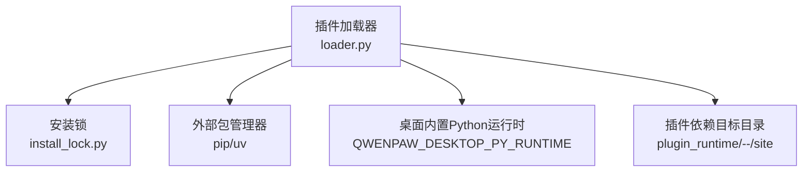
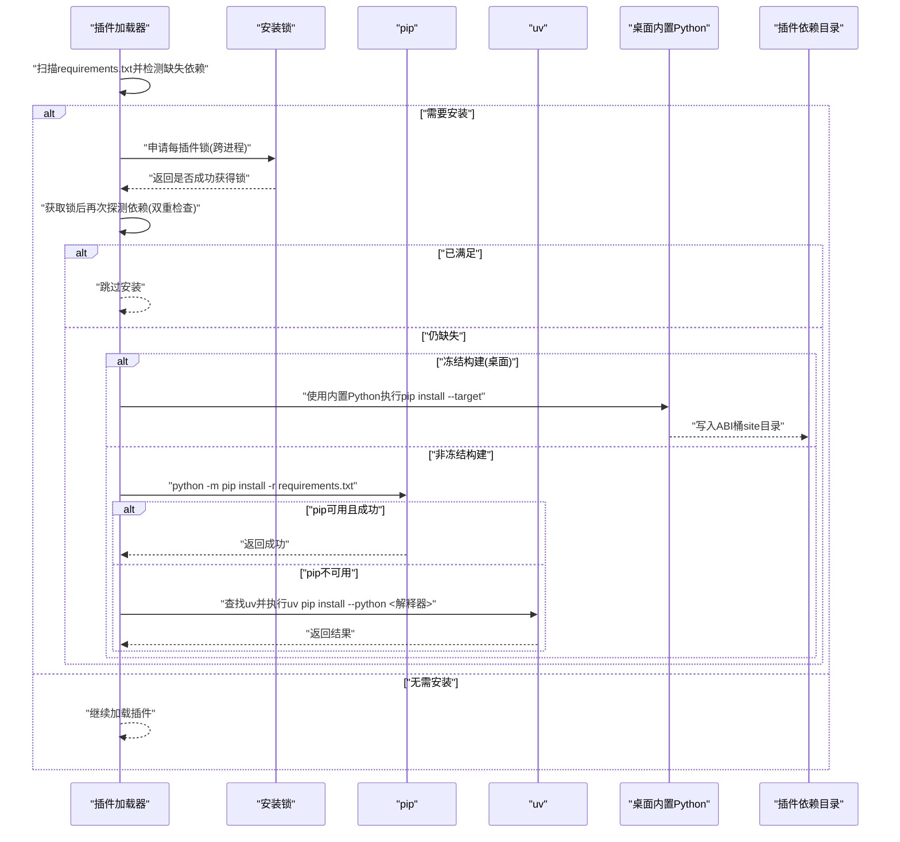
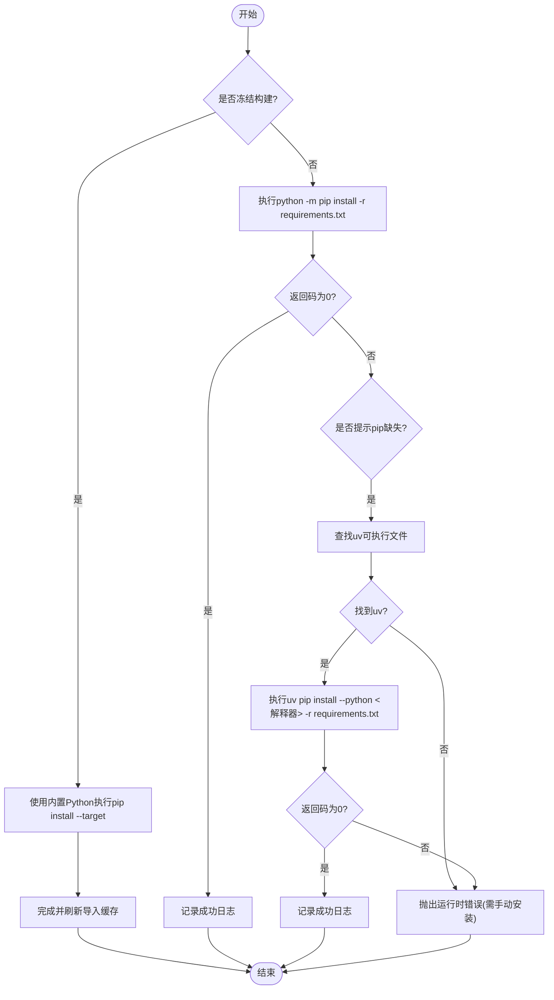
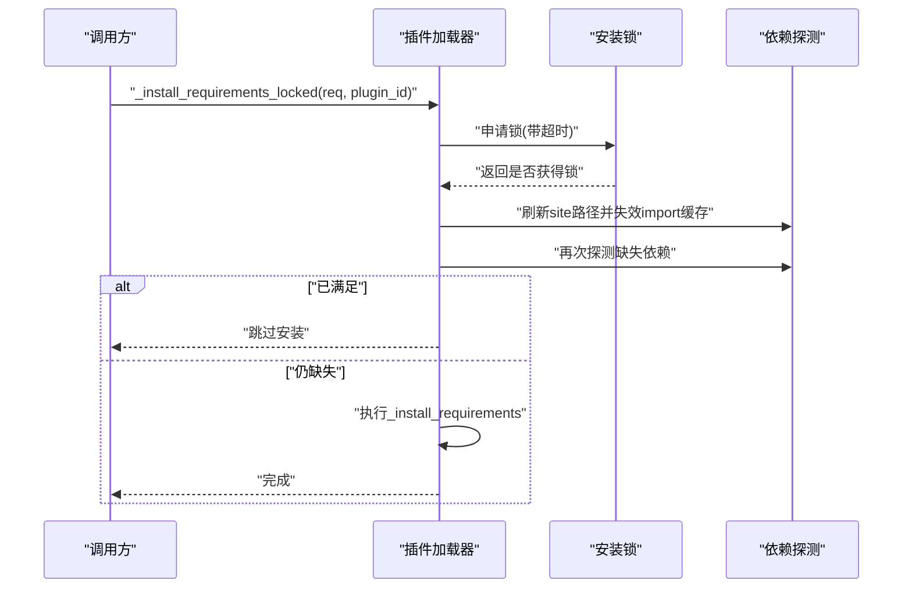
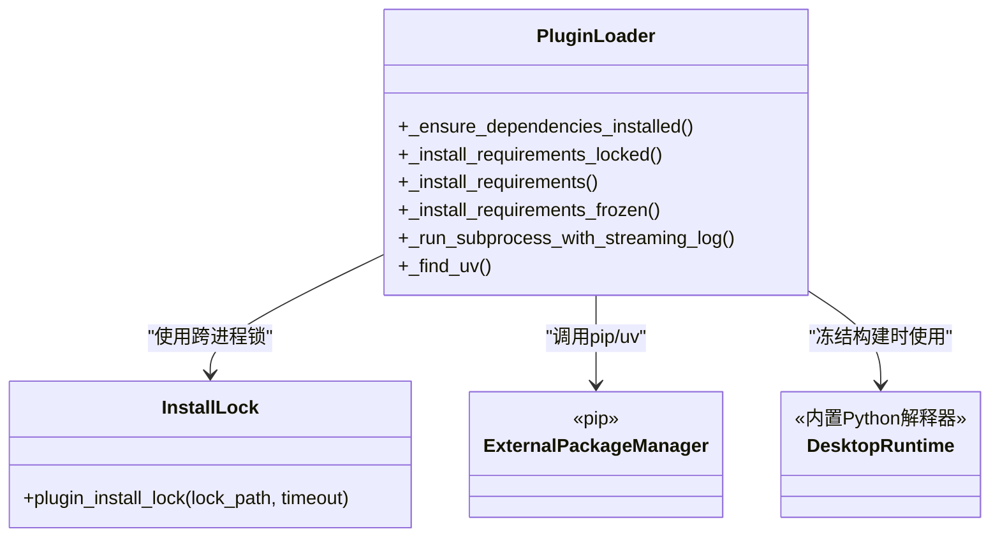

# 依赖安装机制

<cite>
**本文引用的文件**
- [src/qwenpaw/plugins/loader.py](file://src/qwenpaw/plugins/loader.py)
- [src/qwenpaw/plugins/install_lock.py](file://src/qwenpaw/plugins/install_lock.py)
</cite>

## 目录
1. [简介](#简介)
2. [项目结构](#项目结构)
3. [核心组件](#核心组件)
4. [架构总览](#架构总览)
5. [详细组件分析](#详细组件分析)
6. [依赖关系分析](#依赖关系分析)
7. [性能与并发特性](#性能与并发特性)
8. [故障排查指南](#故障排查指南)
9. [结论](#结论)

## 简介
本文件聚焦于插件依赖安装机制，系统性说明以下要点：
- _install_requirements 方法的安装策略：pip 优先、uv 回退、超时处理与错误恢复。
- _install_requirements_locked 方法的并发控制：基于跨进程文件锁的串行化与双重检查模式。
- 桌面应用（冻结构建）下的特殊处理：使用内置 Python 运行时将依赖安装到用户可写目录。
- 日志记录与调试信息收集：子进程输出实时流式记录、关键路径的日志级别与定位方法。

## 项目结构
依赖安装相关代码集中在插件加载器与安装锁模块中：
- 插件加载器负责发现插件、检测缺失依赖、选择包管理器并执行安装。
- 安装锁提供跨进程互斥，避免同一插件被多个进程同时安装导致资源浪费或元数据损坏。

图表来源
- [src/qwenpaw/plugins/loader.py:270-334](file://src/qwenpaw/plugins/loader.py#L270-L334)
- [src/qwenpaw/plugins/install_lock.py:82-154](file://src/qwenpaw/plugins/install_lock.py#L82-L154)

章节来源
- [src/qwenpaw/plugins/loader.py:270-334](file://src/qwenpaw/plugins/loader.py#L270-L334)
- [src/qwenpaw/plugins/install_lock.py:82-154](file://src/qwenpaw/plugins/install_lock.py#L82-L154)

## 核心组件
- 依赖检测与安装入口
  - 异步入口：在加载插件前检测 requirements.txt 中的未满足依赖，并通过线程池调用阻塞安装逻辑，避免阻塞事件循环。
  - 同步安装：根据运行环境选择 pip 或 uv，或在冻结环境下走专用流程。
- 并发控制
  - 每插件一个跨进程文件锁，确保同一插件的安装串行化；获取锁后再次探测依赖状态，避免重复安装。
- 桌面应用特殊处理
  - 冻结构建下通过环境变量注入的独立 Python 解释器执行 pip install --target，将依赖安装到用户可写的 ABI 桶目录，避免直接调用后端二进制导致崩溃循环。

章节来源
- [src/qwenpaw/plugins/loader.py:270-334](file://src/qwenpaw/plugins/loader.py#L270-L334)
- [src/qwenpaw/plugins/loader.py:721-834](file://src/qwenpaw/plugins/loader.py#L721-L834)
- [src/qwenpaw/plugins/loader.py:836-892](file://src/qwenpaw/plugins/loader.py#L836-L892)
- [src/qwenpaw/plugins/install_lock.py:82-154](file://src/qwenpaw/plugins/install_lock.py#L82-L154)

## 架构总览
下图展示了从“检测到缺失依赖”到“完成安装”的关键流程，包括并发锁、包管理器选择与桌面环境分支。

图表来源
- [src/qwenpaw/plugins/loader.py:270-334](file://src/qwenpaw/plugins/loader.py#L270-L334)
- [src/qwenpaw/plugins/loader.py:721-834](file://src/qwenpaw/plugins/loader.py#L721-L834)
- [src/qwenpaw/plugins/loader.py:836-892](file://src/qwenpaw/plugins/loader.py#L836-L892)
- [src/qwenpaw/plugins/install_lock.py:82-154](file://src/qwenpaw/plugins/install_lock.py#L82-L154)

## 详细组件分析

### 安装策略：_install_requirements
- 环境判断
  - 若处于冻结构建（桌面打包），则进入专用安装流程，使用内置 Python 解释器并将依赖安装到用户可写的 site 目录。
  - 否则尝试以当前解释器执行 pip。
- 包管理器选择
  - 首选 python -m pip install -r requirements.txt。
  - 若 pip 不可用（例如由脚本安装器创建的 uv-managed venv），自动回退到 uv pip install --python <当前解释器> -r requirements.txt。
  - 若两者均不可用，抛出运行时错误并提示手动安装。
- 超时与错误恢复
  - 所有外部命令执行均设置固定超时（秒级），超时后终止子进程并抛出运行时错误。
  - 对 pip 失败进行诊断：若错误消息包含“pip 缺失”，则触发 uv 回退；否则直接报错。
  - 安装成功后记录日志，便于追踪。

图表来源
- [src/qwenpaw/plugins/loader.py:721-834](file://src/qwenpaw/plugins/loader.py#L721-L834)
- [src/qwenpaw/plugins/loader.py:836-892](file://src/qwenpaw/plugins/loader.py#L836-L892)

章节来源
- [src/qwenpaw/plugins/loader.py:721-834](file://src/qwenpaw/plugins/loader.py#L721-L834)
- [src/qwenpaw/plugins/loader.py:836-892](file://src/qwenpaw/plugins/loader.py#L836-L892)

### 并发控制：_install_requirements_locked
- 跨进程锁
  - 每个插件对应一个锁文件路径，按插件 ID 生成安全文件名，避免不同插件互相阻塞。
  - 底层使用操作系统级别的独占锁（fcntl/msvcrt），即使进程异常退出也能自动释放。
- 双重检查模式
  - 获取锁后先刷新插件 site 目录到 sys.path，并失效 import 缓存，再重新探测依赖。
  - 若其他进程已在等待期间完成安装，则直接跳过，避免重复安装风暴。
- 超时与降级
  - 等待锁时具备超时上限；若超时仍未获得锁，会记录警告并继续无锁执行，保证不会永久阻塞安装。

图表来源
- [src/qwenpaw/plugins/loader.py:306-334](file://src/qwenpaw/plugins/loader.py#L306-L334)
- [src/qwenpaw/plugins/install_lock.py:82-154](file://src/qwenpaw/plugins/install_lock.py#L82-L154)

章节来源
- [src/qwenpaw/plugins/loader.py:306-334](file://src/qwenpaw/plugins/loader.py#L306-L334)
- [src/qwenpaw/plugins/install_lock.py:82-154](file://src/qwenpaw/plugins/install_lock.py#L82-L154)

### 桌面应用特殊处理：冻结构建下的依赖安装
- 运行环境差异
  - 冻结构建中 sys.executable 指向后端二进制，直接调用会导致重启并崩溃循环。因此必须使用独立的 Python 解释器。
- 内置 Python 运行时
  - 通过环境变量 QWENPAW_DESKTOP_PY_RUNTIME 指定内置解释器路径，不存在则抛出运行时错误，提示重装桌面版或手动安装依赖。
- 安装目标目录
  - 使用 ABI 桶化的用户可写目录（按 Python 版本、操作系统、架构组合），避免污染系统环境，提升隔离性与可移植性。
- 安装后处理
  - 安装完成后失效导入缓存，确保后续 import 能正确解析新安装的包。

章节来源
- [src/qwenpaw/plugins/loader.py:836-892](file://src/qwenpaw/plugins/loader.py#L836-L892)

### 日志记录与调试信息收集
- 子进程输出实时流式记录
  - 所有外部命令执行均通过统一方法启动子进程，并以线程读取 stdout，逐行输出到 debug 级别日志，便于问题定位。
- 关键路径日志
  - 安装开始、选择包管理器、回退原因、成功/失败、超时等关键节点均有 info/debug 日志。
- 调试建议
  - 开启 debug 日志查看具体安装命令与输出。
  - 关注“pip 缺失”、“uv 未找到”、“超时”等关键词快速定位问题。
  - 在桌面环境中确认 QWENPAW_DESKTOP_PY_RUNTIME 环境变量是否正确配置。

章节来源
- [src/qwenpaw/plugins/loader.py:672-719](file://src/qwenpaw/plugins/loader.py#L672-L719)
- [src/qwenpaw/plugins/loader.py:721-834](file://src/qwenpaw/plugins/loader.py#L721-L834)
- [src/qwenpaw/plugins/loader.py:836-892](file://src/qwenpaw/plugins/loader.py#L836-L892)

## 依赖关系分析
- 组件耦合
  - 插件加载器依赖安装锁模块实现跨进程串行化。
  - 插件加载器依赖外部包管理器（pip/uv）和可选的桌面内置 Python 运行时。
- 外部依赖
  - pip：标准库模块，通常随 Python 环境提供。
  - uv：外部工具，支持多平台常见安装位置搜索。
  - 操作系统锁：Unix 使用 fcntl.flock，Windows 使用 msvcrt.locking。
- 潜在风险
  - 若 PATH 中找不到 uv，且 pip 不可用，安装将失败。
  - 桌面环境缺少内置 Python 运行时将导致安装失败。

图表来源
- [src/qwenpaw/plugins/loader.py:270-334](file://src/qwenpaw/plugins/loader.py#L270-L334)
- [src/qwenpaw/plugins/install_lock.py:82-154](file://src/qwenpaw/plugins/install_lock.py#L82-L154)

章节来源
- [src/qwenpaw/plugins/loader.py:270-334](file://src/qwenpaw/plugins/loader.py#L270-L334)
- [src/qwenpaw/plugins/install_lock.py:82-154](file://src/qwenpaw/plugins/install_lock.py#L82-L154)

## 性能与并发特性
- 并发安全
  - 通过跨进程锁串行化同一插件的安装，避免重复下载与 .dist-info 损坏导致的重测与重试风暴。
- 内存与资源占用
  - 双重检查减少不必要的安装，降低内存峰值与网络开销。
- 超时保护
  - 统一的安装超时限制防止长时间挂起，保障整体稳定性。
- 事件循环友好
  - 安装逻辑在后台线程执行，不阻塞主事件循环。

[本节为通用指导，不直接分析具体文件]

## 故障排查指南
- 常见问题
  - pip 缺失：在非标准环境中可能未安装 pip，系统将自动回退到 uv；若 uv 也未找到，需手动安装依赖。
  - uv 未找到：检查 PATH 或常见安装路径（如 ~/.local/bin、~/.cargo/bin、Windows 的 Programs 目录）。
  - 桌面环境安装失败：确认 QWENPAW_DESKTOP_PY_RUNTIME 指向有效的内置 Python 解释器。
  - 安装超时：检查网络状况与镜像源配置；必要时增大超时或离线预装依赖。
- 日志定位
  - 打开 debug 日志，搜索“Installing dependencies for plugin”、“pip not available; retrying with uv”、“Timed out after ... waiting for plugin install lock”等关键字。
  - 查看子进程输出的逐行日志，定位具体失败步骤与错误信息。

章节来源
- [src/qwenpaw/plugins/loader.py:721-834](file://src/qwenpaw/plugins/loader.py#L721-L834)
- [src/qwenpaw/plugins/install_lock.py:142-149](file://src/qwenpaw/plugins/install_lock.py#L142-L149)

## 结论
该依赖安装机制通过“pip 优先、uv 回退”的策略适配多种运行环境，并在桌面冻结构建下采用专用流程确保稳定与安全。跨进程锁与双重检查有效避免了并发安装带来的资源浪费与元数据损坏。完善的日志与调试手段有助于快速定位问题。建议在部署与运维中关注 uv 可用性、桌面内置 Python 运行时配置以及网络与镜像源稳定性。