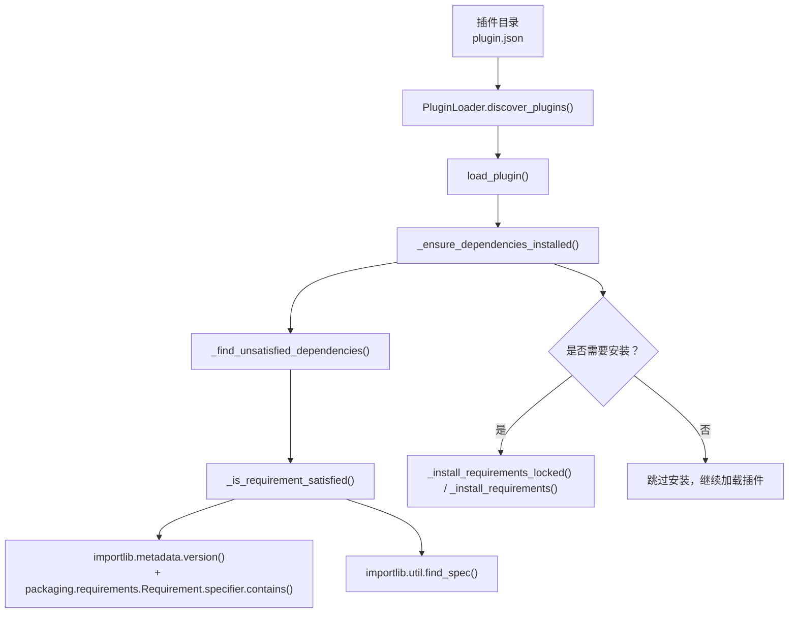
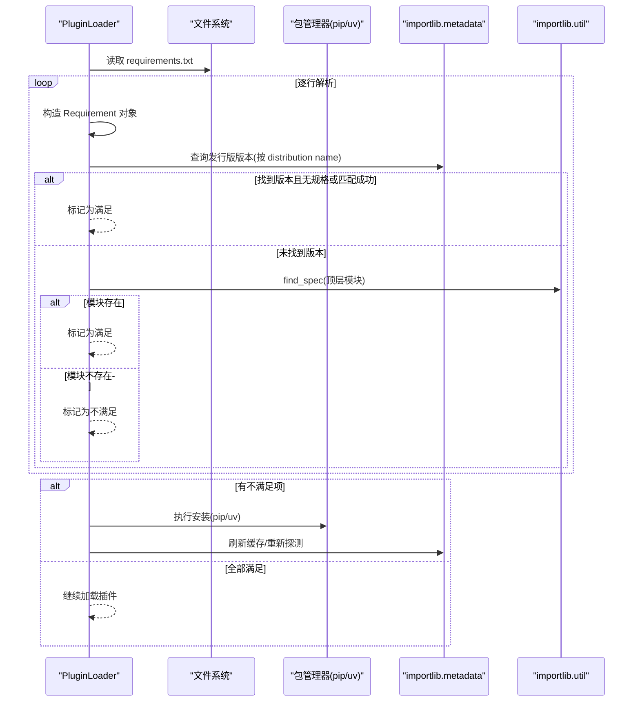
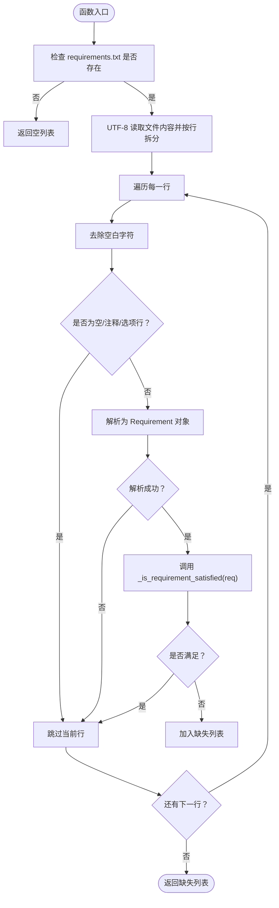
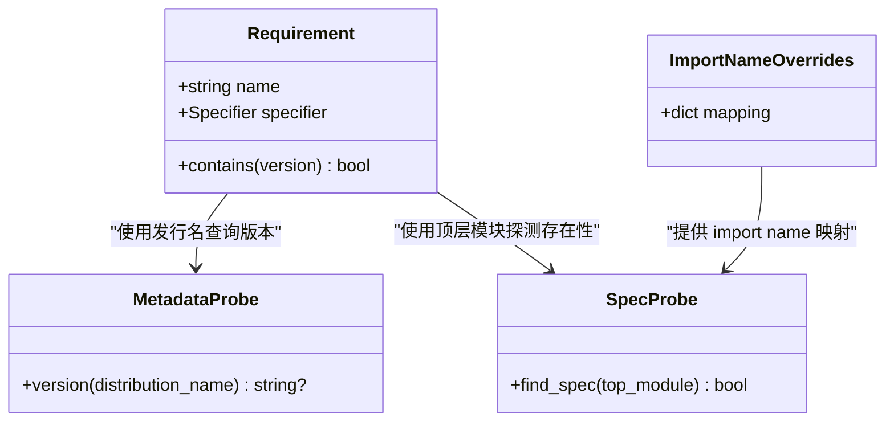
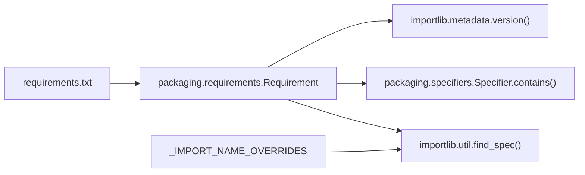

# 依赖解析与检查

<cite>
**本文引用的文件**
- [src/qwenpaw/plugins/loader.py](file://src/qwenpaw/plugins/loader.py)
</cite>

## 目录
1. [简介](#简介)
2. [项目结构](#项目结构)
3. [核心组件](#核心组件)
4. [架构总览](#架构总览)
5. [详细组件分析](#详细组件分析)
6. [依赖关系分析](#依赖关系分析)
7. [性能考虑](#性能考虑)
8. [故障排查指南](#故障排查指南)
9. [结论](#结论)

## 简介
本文件聚焦于插件系统的依赖解析与检查机制，重点围绕以下目标展开：
- 深入解释 _find_unsatisfied_dependencies 方法的实现细节，包括 requirements.txt 解析、Requirement 对象创建与版本规格匹配。
- 详细说明 _is_requirement_satisfied 方法的双重探测策略：importlib.metadata 与 importlib.util.find_spec 的使用场景与取舍。
- 记录依赖名称映射机制，处理 distribution name 与 import name 的差异（例如 pillow -> PIL）。
- 提供依赖检查的性能优化技巧与常见问题诊断方法。

## 项目结构
该功能位于插件加载器模块中，负责在加载插件前扫描并安装缺失的 Python 依赖。关键路径如下：
- 插件清单发现与加载流程入口：PluginLoader
- 依赖检测与安装：_find_unsatisfied_dependencies、_is_requirement_satisfied、_install_requirements* 系列方法
- 名称映射表：_IMPORT_NAME_OVERRIDES

图表来源
- [src/qwenpaw/plugins/loader.py:132-172](file://src/qwenpaw/plugins/loader.py#L132-L172)
- [src/qwenpaw/plugins/loader.py:514-607](file://src/qwenpaw/plugins/loader.py#L514-L607)
- [src/qwenpaw/plugins/loader.py:270-334](file://src/qwenpaw/plugins/loader.py#L270-L334)
- [src/qwenpaw/plugins/loader.py:248-268](file://src/qwenpaw/plugins/loader.py#L248-L268)
- [src/qwenpaw/plugins/loader.py:208-246](file://src/qwenpaw/plugins/loader.py#L208-L246)

章节来源
- [src/qwenpaw/plugins/loader.py:119-172](file://src/qwenpaw/plugins/loader.py#L119-L172)
- [src/qwenpaw/plugins/loader.py:514-607](file://src/qwenpaw/plugins/loader.py#L514-L607)

## 核心组件
- PluginLoader._find_unsatisfied_dependencies(requirements_file): 读取插件目录下的 requirements.txt，逐行解析为 Requirement 对象，调用 _is_requirement_satisfied 判定是否满足；返回不满足的行列表。
- PluginLoader._is_requirement_satisfied(req): 双重探测策略
  - 元数据探测：通过 importlib.metadata.version 获取已安装包的发行名版本，结合 packaging.requirements.Requirement.specifier.contains 进行版本匹配。
  - 导入探测：当元数据不可用时（如冻结桌面构建缺少 .dist-info），使用 importlib.util.find_spec 对顶层模块进行存在性探测，避免误报缺失。
- 名称映射表 _IMPORT_NAME_OVERRIDES: 维护 distribution name 到 import name 的常见差异映射，确保 find_spec 能正确定位顶层模块。

章节来源
- [src/qwenpaw/plugins/loader.py:248-268](file://src/qwenpaw/plugins/loader.py#L248-L268)
- [src/qwenpaw/plugins/loader.py:208-246](file://src/qwenpaw/plugins/loader.py#L208-L246)
- [src/qwenpaw/plugins/loader.py:28-37](file://src/qwenpaw/plugins/loader.py#L28-L37)

## 架构总览
依赖检查的整体流程如下：
- 在加载插件之前，先执行依赖检查与安装。
- 若检测到缺失或不兼容的依赖，则进入安装流程；否则直接加载插件。
- 安装过程支持 pip 与 uv 两种后端，并在冻结桌面环境中使用独立的 Python 运行时将依赖安装到用户可写的 site 目录。

图表来源
- [src/qwenpaw/plugins/loader.py:248-268](file://src/qwenpaw/plugins/loader.py#L248-L268)
- [src/qwenpaw/plugins/loader.py:208-246](file://src/qwenpaw/plugins/loader.py#L208-L246)
- [src/qwenpaw/plugins/loader.py:721-834](file://src/qwenpaw/plugins/loader.py#L721-L834)
- [src/qwenpaw/plugins/loader.py:836-892](file://src/qwenpaw/plugins/loader.py#L836-L892)

## 详细组件分析

### _find_unsatisfied_dependencies 方法详解
- 输入：requirements_file（Path）
- 行为：
  - 若文件不存在，直接返回空列表。
  - 以 UTF-8 编码读取文件内容，逐行处理：
    - 忽略空行、注释行（以 # 开头）、选项行（以 - 开头）。
    - 尝试将每行解析为 packaging.requirements.Requirement 对象；解析失败则跳过该行。
    - 调用 _is_requirement_satisfied 判断是否满足；若不满足，将该行加入缺失列表。
- 输出：缺失或不满足的版本要求的原始行列表。

关键点
- 仅基于 requirements.txt 文本进行解析，不做网络请求或索引查询。
- 对异常行采取“静默跳过”策略，保证鲁棒性。
- 最终结果用于后续决定是否触发安装流程。

章节来源
- [src/qwenpaw/plugins/loader.py:248-268](file://src/qwenpaw/plugins/loader.py#L248-L268)

#### 流程图：_find_unsatisfied_dependencies

图表来源
- [src/qwenpaw/plugins/loader.py:248-268](file://src/qwenpaw/plugins/loader.py#L248-L268)

### _is_requirement_satisfied 方法详解（双重探测策略）
- 输入：packaging.requirements.Requirement 实例
- 行为：
  - 第一步：元数据探测
    - 使用 importlib.metadata.version 根据 distribution name 查询已安装版本。
    - 若未找到发行版，installed 为 None，进入第二步。
    - 若找到版本：
      - 若无版本规格（specifier），直接返回 True。
      - 若有规格，使用 req.specifier.contains(installed) 进行匹配；若匹配异常，保守返回 True。
  - 第二步：导入探测
    - 将 distribution name 规范化为小写并将下划线替换为连字符。
    - 通过 _IMPORT_NAME_OVERRIDES 查找对应的 import name；若未命中，则将连字符替换为下划线作为默认 import name。
    - 取 import name 的首段（top-level module），使用 importlib.util.find_spec 探测其是否存在。
    - 若探测成功返回 True，捕获 ImportError/ValueError 时返回 False。
- 设计动机：
  - 元数据探测适用于通过 pip install --target 安装的依赖，保留 .dist-info，能准确校验版本规格。
  - 导入探测覆盖冻结桌面构建中可能被剥离 .dist-info 的内置依赖，避免误报缺失。

章节来源
- [src/qwenpaw/plugins/loader.py:208-246](file://src/qwenpaw/plugins/loader.py#L208-L246)

#### 类图：相关数据结构与依赖

图表来源
- [src/qwenpaw/plugins/loader.py:208-246](file://src/qwenpaw/plugins/loader.py#L208-L246)
- [src/qwenpaw/plugins/loader.py:28-37](file://src/qwenpaw/plugins/loader.py#L28-L37)

### 依赖名称映射机制
- 目的：解决 distribution name 与 import name 不一致导致的 find_spec 误判问题。
- 实现：
  - 定义 _IMPORT_NAME_OVERRIDES 字典，包含常见映射，例如 pillow -> PIL、pyyaml -> yaml、beautifulsoup4 -> bs4、python-dateutil -> dateutil、opencv-python -> cv2、scikit-learn -> sklearn、protobuf -> google.protobuf。
  - 在 find_spec 前，先将 distribution name 标准化（小写、下划线转连字符），再查表获取 import name；若未命中，则用连字符转下划线的默认规则。
  - 取 import name 的首段作为 find_spec 的 top-level 模块名进行探测。

章节来源
- [src/qwenpaw/plugins/loader.py:28-37](file://src/qwenpaw/plugins/loader.py#L28-L37)
- [src/qwenpaw/plugins/loader.py:236-246](file://src/qwenpaw/plugins/loader.py#L236-L246)

### 依赖安装流程（与检查联动）
- 当 _find_unsatisfied_dependencies 返回非空列表时，进入安装流程：
  - 在冻结桌面环境，使用独立 Python 运行时将依赖安装到用户可写的 site 目录（--target）。
  - 在非冻结环境，优先使用 python -m pip；若 pip 不可用，则回退到 uv pip install。
  - 安装完成后刷新 importlib 缓存，并再次探测以避免重复安装。

章节来源
- [src/qwenpaw/plugins/loader.py:270-334](file://src/qwenpaw/plugins/loader.py#L270-L334)
- [src/qwenpaw/plugins/loader.py:721-834](file://src/qwenpaw/plugins/loader.py#L721-L834)
- [src/qwenpaw/plugins/loader.py:836-892](file://src/qwenpaw/plugins/loader.py#L836-L892)

## 依赖关系分析
- 外部依赖：
  - importlib.metadata：用于查询已安装包的发行名与版本信息。
  - packaging.requirements：用于解析 requirements.txt 行并生成 Requirement 对象，以及进行版本规格匹配。
  - importlib.util：用于 find_spec 探测顶层模块是否存在。
- 内部依赖：
  - _IMPORT_NAME_OVERRIDES：名称映射表，影响 find_spec 的探测准确性。
  - 安装流程中的子进程调用（pip/uv），受超时与错误码控制。

图表来源
- [src/qwenpaw/plugins/loader.py:208-246](file://src/qwenpaw/plugins/loader.py#L208-L246)
- [src/qwenpaw/plugins/loader.py:28-37](file://src/qwenpaw/plugins/loader.py#L28-L37)

章节来源
- [src/qwenpaw/plugins/loader.py:208-246](file://src/qwenpaw/plugins/loader.py#L208-L246)
- [src/qwenpaw/plugins/loader.py:28-37](file://src/qwenpaw/plugins/loader.py#L28-L37)

## 性能考虑
- 元数据优先：优先使用 importlib.metadata 进行版本探测与匹配，避免不必要的导入探测，减少 IO 与系统调用开销。
- 短路逻辑：当元数据可用且无版本规格时，直接返回满足，避免进一步探测。
- 异常容错：版本匹配异常时保守返回满足，防止因规格解析问题导致频繁重装。
- 缓存刷新：在安装后调用 importlib.invalidate_caches，确保下一次探测能读到最新状态，避免重复安装风暴。
- 并发锁：安装流程使用 per-plugin 的互斥锁，避免多进程并发安装同一插件导致的资源竞争与内存耗尽。

[本节为通用性能建议，不直接分析具体文件]

## 故障排查指南
- 现象：插件启动时报依赖缺失或版本不兼容
  - 检查 requirements.txt 格式是否正确，排除无效行与语法错误。
  - 查看日志中列出的不满足依赖项，确认 distribution name 与 import name 是否一致；必要时在 _IMPORT_NAME_OVERRIDES 中添加映射。
- 现象：冻结桌面环境下误报缺失
  - 导入探测会兜底 find_spec，若仍报错，检查顶层模块是否存在或被打包剥离。
- 现象：安装超时或失败
  - 确认网络连通性与镜像源配置；在冻结环境检查 QWENPAW_DESKTOP_PY_RUNTIME 环境变量是否指向正确的 Python 运行时。
  - 若 pip 不可用，确保 uv 已安装并可被找到；否则手动执行 pip install -r requirements.txt。
- 现象：重复安装或安装风暴
  - 确认并发锁是否生效；检查是否有多个进程同时安装同一插件。
  - 安装完成后观察 importlib 缓存是否刷新，避免旧缓存导致重复探测。

章节来源
- [src/qwenpaw/plugins/loader.py:270-334](file://src/qwenpaw/plugins/loader.py#L270-L334)
- [src/qwenpaw/plugins/loader.py:721-834](file://src/qwenpaw/plugins/loader.py#L721-L834)
- [src/qwenpaw/plugins/loader.py:836-892](file://src/qwenpaw/plugins/loader.py#L836-L892)

## 结论
该依赖解析与检查机制通过“元数据探测 + 导入探测”的双重策略，兼顾了常规环境与冻结桌面环境的差异，有效避免了误报与漏报。配合名称映射表与严格的版本规格匹配，确保了依赖检查的准确性与鲁棒性。安装流程采用并发锁与缓存刷新策略，提升了稳定性与性能。建议在扩展新依赖时同步更新名称映射表，并在 requirements.txt 中明确版本规格以获得最佳兼容性。