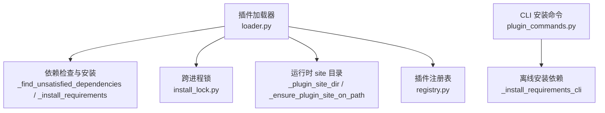
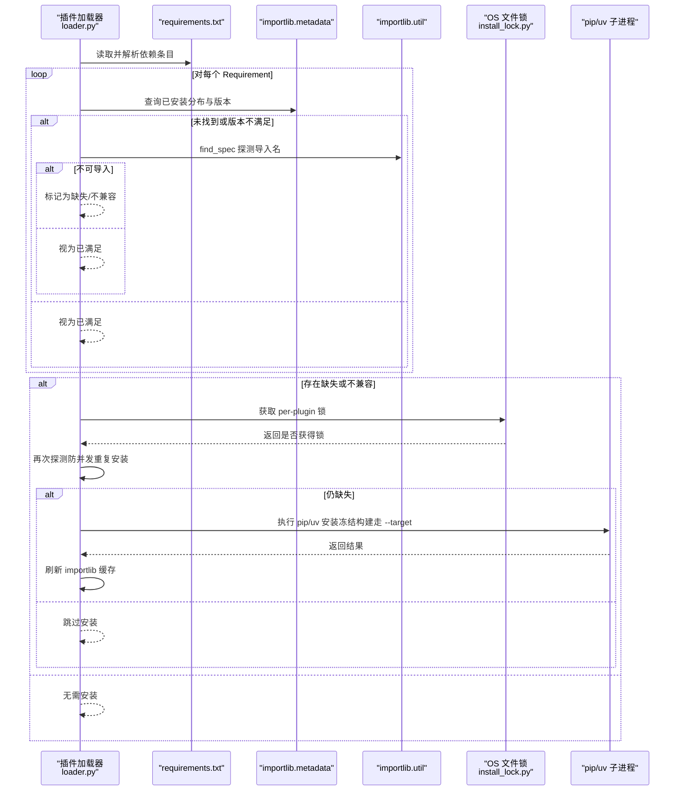
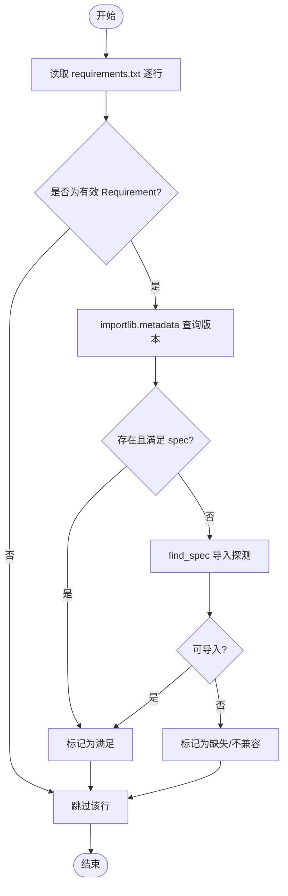
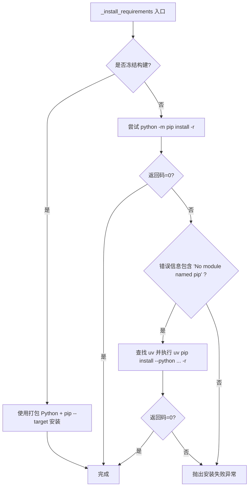
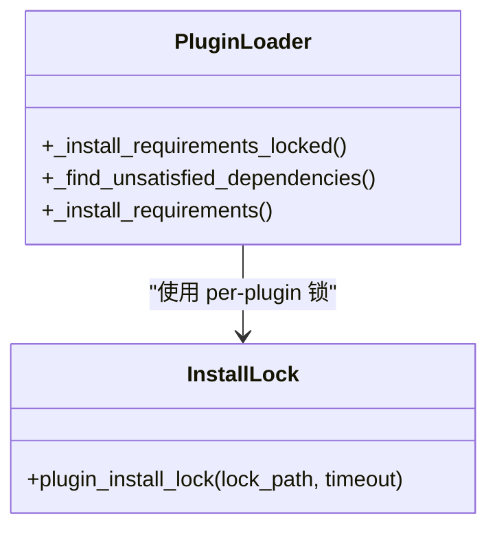
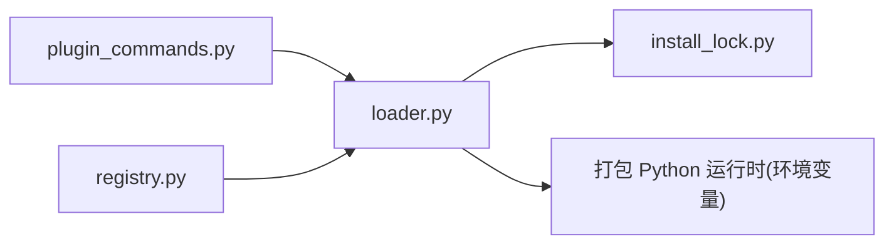

# 插件依赖管理

<cite>
**本文引用的文件**
- [loader.py](file://src/qwenpaw/plugins/loader.py)
- [install_lock.py](file://src/qwenpaw/plugins/install_lock.py)
- [plugin_commands.py](file://src/qwenpaw/cli/plugin_commands.py)
- [registry.py](file://src/qwenpaw/plugins/registry.py)
</cite>

## 目录
1. [简介](#简介)
2. [项目结构](#项目结构)
3. [核心组件](#核心组件)
4. [架构总览](#架构总览)
5. [详细组件分析](#详细组件分析)
6. [依赖关系分析](#依赖关系分析)
7. [性能考虑](#性能考虑)
8. [故障排除指南](#故障排除指南)
9. [结论](#结论)

## 简介
本文件面向 QwenPaw 的“插件依赖管理系统”，聚焦以下目标：
- requirements.txt 解析与依赖检查机制（版本兼容性与缺失检测）
- 依赖安装策略（pip 与 uv 的选择逻辑、并发控制与锁机制）
- 依赖隔离方案（site-packages 目录管理与 Python 环境隔离）
- 依赖缓存机制（避免重复安装、提升启动性能）
- 依赖冲突解决策略与故障排除指南

## 项目结构
与插件依赖管理直接相关的代码集中在 plugins 子模块与 CLI 命令中：
- src/qwenpaw/plugins/loader.py：插件加载、依赖发现与安装主流程
- src/qwenpaw/plugins/install_lock.py：跨进程安装锁实现
- src/qwenpaw/cli/plugin_commands.py：离线安装时的依赖安装入口（CLI）
- src/qwenpaw/plugins/registry.py：插件注册中心（卸载时清理工具等副作用）

图表来源
- [loader.py:248-334](file://src/qwenpaw/plugins/loader.py#L248-L334)
- [install_lock.py:82-155](file://src/qwenpaw/plugins/install_lock.py#L82-L155)
- [plugin_commands.py:221-306](file://src/qwenpaw/cli/plugin_commands.py#L221-L306)
- [registry.py:29-52](file://src/qwenpaw/plugins/registry.py#L29-L52)

章节来源
- [loader.py:51-116](file://src/qwenpaw/plugins/loader.py#L51-L116)
- [loader.py:248-334](file://src/qwenpaw/plugins/loader.py#L248-L334)
- [install_lock.py:82-155](file://src/qwenpaw/plugins/install_lock.py#L82-L155)
- [plugin_commands.py:221-306](file://src/qwenpaw/cli/plugin_commands.py#L221-L306)
- [registry.py:29-52](file://src/qwenpaw/plugins/registry.py#L29-L52)

## 核心组件
- 依赖发现与校验
  - 解析 requirements.txt，过滤注释与包含行，使用 packaging.requirements.Requirement 解析条目
  - 通过 importlib.metadata 与 importlib.util.find_spec 双重探测，确保在 --target 安装与冻结构建下均能正确识别已安装包及版本范围
- 依赖安装
  - 优先使用 python -m pip；若当前解释器无 pip（如 uv-managed venv），回退到 uv pip install
  - 桌面冻结构建使用打包的独立 Python 执行 pip install --target 到用户可写的 ABI-bucketed site 目录
- 并发与锁
  - 基于 OS 级文件锁（fcntl/msvcrt）实现 per-plugin 的跨进程互斥，避免同一插件被多个进程同时安装导致 OOM 或元数据损坏
  - 加锁后二次探测，避免重复安装风暴
- 隔离与缓存
  - 冻结构建将依赖安装到按 Python 版本与平台机器类型分桶的 site 目录，并通过 sys.path/site.addsitedir 暴露给运行期
  - 安装前后刷新 importlib 缓存，避免旧状态干扰

章节来源
- [loader.py:209-268](file://src/qwenpaw/plugins/loader.py#L209-L268)
- [loader.py:721-834](file://src/qwenpaw/plugins/loader.py#L721-L834)
- [loader.py:836-892](file://src/qwenpaw/plugins/loader.py#L836-L892)
- [loader.py:93-116](file://src/qwenpaw/plugins/loader.py#L93-L116)
- [install_lock.py:82-155](file://src/qwenpaw/plugins/install_lock.py#L82-L155)

## 架构总览
下图展示了从“插件加载”到“依赖检查与安装”的关键调用链，以及锁与隔离路径。

图表来源
- [loader.py:248-334](file://src/qwenpaw/plugins/loader.py#L248-L334)
- [loader.py:721-834](file://src/qwenpaw/plugins/loader.py#L721-L834)
- [loader.py:836-892](file://src/qwenpaw/plugins/loader.py#L836-L892)
- [install_lock.py:82-155](file://src/qwenpaw/plugins/install_lock.py#L82-L155)

## 详细组件分析

### 依赖解析与兼容性验证
- 解析规则
  - 忽略空行、注释（#）与包含指令（-）
  - 使用 packaging.requirements.Requirement 解析每条依赖
- 兼容性判定
  - 先通过 importlib.metadata 获取已安装包的发行版名称与版本，再依据 spec 判断是否满足
  - 若 metadata 不可用（例如冻结构建剥离 .dist-info），则回退到 importlib.util.find_spec 以导入名探测是否存在
  - 处理常见 dist-name 与 import-name 不一致的情况（如 pillow/PIL、pyyaml/yaml 等）

图表来源
- [loader.py:248-268](file://src/qwenpaw/plugins/loader.py#L248-L268)
- [loader.py:209-247](file://src/qwenpaw/plugins/loader.py#L209-L247)

章节来源
- [loader.py:209-268](file://src/qwenpaw/plugins/loader.py#L209-L268)

### 依赖安装策略（pip 与 uv 选择）
- 非冻结构建
  - 首选 python -m pip install -r requirements.txt
  - 若报错提示缺少 pip，自动回退到 uv pip install --python <sys.executable> -r requirements.txt
- 冻结构建（桌面应用）
  - 使用打包的独立 Python（环境变量注入的路径）执行 pip install --target <ABI-bucketed site> -r requirements.txt
  - 安装完成后刷新 importlib 缓存，并将 site 目录加入 sys.path，使后续导入可见

图表来源
- [loader.py:721-834](file://src/qwenpaw/plugins/loader.py#L721-L834)
- [loader.py:836-892](file://src/qwenpaw/plugins/loader.py#L836-L892)

章节来源
- [loader.py:721-834](file://src/qwenpaw/plugins/loader.py#L721-L834)
- [loader.py:836-892](file://src/qwenpaw/plugins/loader.py#L836-L892)

### 并发安装控制与锁机制
- 每插件一个锁文件路径，基于 OS 级独占锁（fcntl/msvcrt）实现
- 等待超时后仍允许继续安装（避免死锁），但会记录告警
- 加锁后二次探测，避免“重新安装风暴”

图表来源
- [loader.py:306-334](file://src/qwenpaw/plugins/loader.py#L306-L334)
- [install_lock.py:82-155](file://src/qwenpaw/plugins/install_lock.py#L82-L155)

章节来源
- [install_lock.py:82-155](file://src/qwenpaw/plugins/install_lock.py#L82-L155)
- [loader.py:306-334](file://src/qwenpaw/plugins/loader.py#L306-L334)

### 依赖隔离方案（site-packages 与环境隔离）
- 冻结构建下的隔离
  - 计算 ABI-bucketed 目录：py{major}.{minor}-{system}-{machine}/site
  - 将该目录加入 sys.path 并通过 site.addsitedir 暴露，保证子进程也能看到
  - 通过环境变量 QWENPAW_PLUGIN_SITE 暴露该目录，供插件内派生 Python 进程复用
- 非冻结构建
  - 依赖安装到当前环境的 site-packages，无需额外隔离

章节来源
- [loader.py:51-66](file://src/qwenpaw/plugins/loader.py#L51-L66)
- [loader.py:93-116](file://src/qwenpaw/plugins/loader.py#L93-L116)

### 依赖缓存机制
- 双重探测减少误判：metadata 权威 + import_spec 兜底
- 安装前后刷新 importlib 缓存，避免旧状态影响
- 加锁后二次探测，避免重复安装导致的内存与 IO 浪费

章节来源
- [loader.py:209-247](file://src/qwenpaw/plugins/loader.py#L209-L247)
- [loader.py:322-334](file://src/qwenpaw/plugins/loader.py#L322-L334)
- [loader.py:887-892](file://src/qwenpaw/plugins/loader.py#L887-L892)

### CLI 离线安装（当应用未运行时）
- 离线安装流程：复制插件 → 校验结构 → 安装依赖
- 依赖安装同样遵循“pip 优先，uv 回退”的策略，失败时清理目标目录并输出错误

章节来源
- [plugin_commands.py:221-306](file://src/qwenpaw/cli/plugin_commands.py#L221-L306)

## 依赖关系分析
- loader.py 依赖 install_lock.py 提供的跨进程锁
- loader.py 在冻结构建下依赖外部打包的 Python 运行时（由环境变量注入）
- CLI plugin_commands.py 提供离线安装入口，内部也实现了类似的 pip/uv 选择逻辑
- registry.py 负责插件生命周期钩子与 HTTP 路由挂载，卸载时会清理工具注册等副作用

图表来源
- [loader.py:306-334](file://src/qwenpaw/plugins/loader.py#L306-L334)
- [plugin_commands.py:221-306](file://src/qwenpaw/cli/plugin_commands.py#L221-L306)
- [registry.py:29-52](file://src/qwenpaw/plugins/registry.py#L29-L52)

章节来源
- [loader.py:306-334](file://src/qwenpaw/plugins/loader.py#L306-L334)
- [plugin_commands.py:221-306](file://src/qwenpaw/cli/plugin_commands.py#L221-L306)
- [registry.py:29-52](file://src/qwenpaw/plugins/registry.py#L29-L52)

## 性能考虑
- 并发安全：per-plugin 锁避免多进程同时安装同一插件导致的 OOM 与元数据损坏
- 快速路径：首次探测命中即跳过安装，减少不必要的网络与磁盘 IO
- 冻结构建优化：--target 安装到独立 site 目录，避免污染宿主环境，缩短后续导入时间
- 日志流式输出：安装过程实时打印进度，便于定位慢依赖

[本节为通用指导，不涉及具体文件分析]

## 故障排除指南
- 安装超时
  - 现象：依赖安装超过 300 秒触发超时异常
  - 排查：检查网络、镜像源、依赖大小；必要时手动执行安装命令
- pip 不可用
  - 现象：当前解释器无 pip，自动回退 uv；若 uv 也未找到，需手动安装依赖
  - 处理：安装 uv 或 pip，或在当前环境中提供 pip
- 锁定争用
  - 现象：等待锁超时但仍继续安装（不会永久阻塞）
  - 处理：确认是否有残留进程占用锁；必要时清理锁文件所在目录
- 冻结构建无法安装
  - 现象：提示打包 Python 运行时不可用
  - 处理：检查环境变量是否正确注入；或手动安装依赖
- 卸载后残留
  - 现象：卸载后仍有工具或模块残留
  - 处理：确认卸载钩子执行；必要时重启进程以清理 sys.modules 与 sys.path

章节来源
- [loader.py:721-834](file://src/qwenpaw/plugins/loader.py#L721-L834)
- [loader.py:836-892](file://src/qwenpaw/plugins/loader.py#L836-L892)
- [install_lock.py:82-155](file://src/qwenpaw/plugins/install_lock.py#L82-L155)

## 结论
QwenPaw 的插件依赖管理以“安全、稳定、可观测”为核心设计目标：
- 通过双重探测与严格版本匹配，确保依赖可用且兼容
- 以 pip 为主、uv 为辅的安装策略适配多种环境
- 借助 per-plugin 的跨进程锁与二次探测，避免并发安装风暴
- 在冻结构建下采用 ABI-bucketed site 隔离，保障环境干净与可移植性
- 结合缓存与流式日志，提升性能与可诊断性

[本节为总结性内容，不涉及具体文件分析]