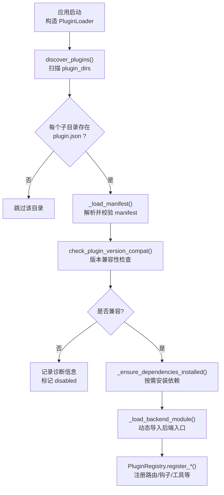
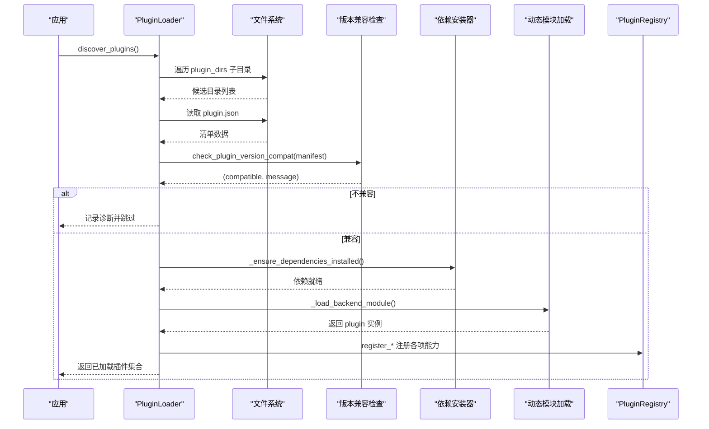
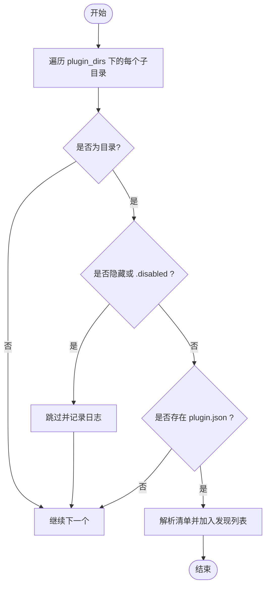
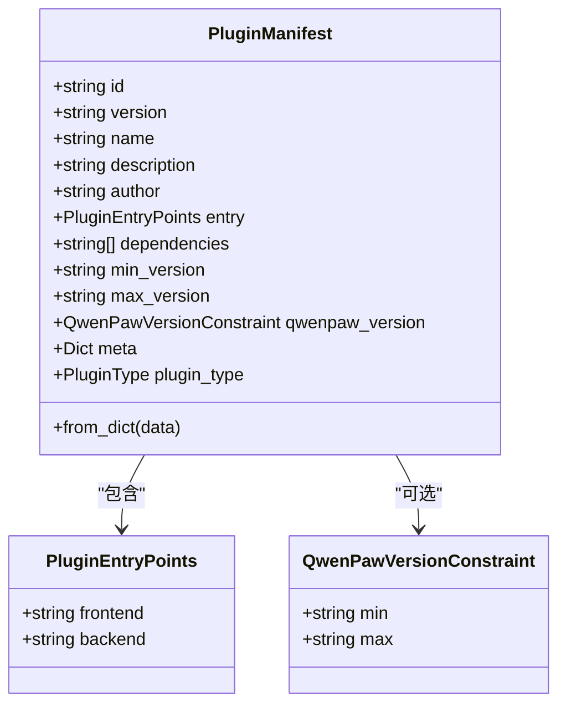
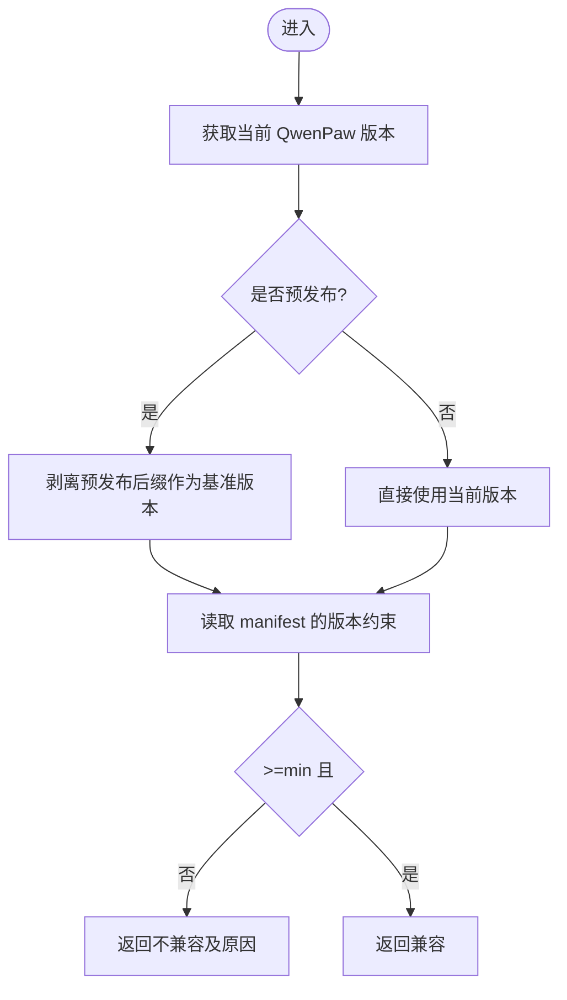
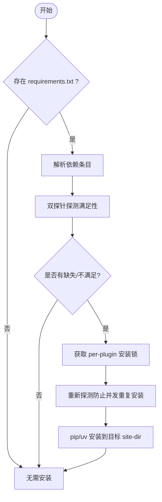
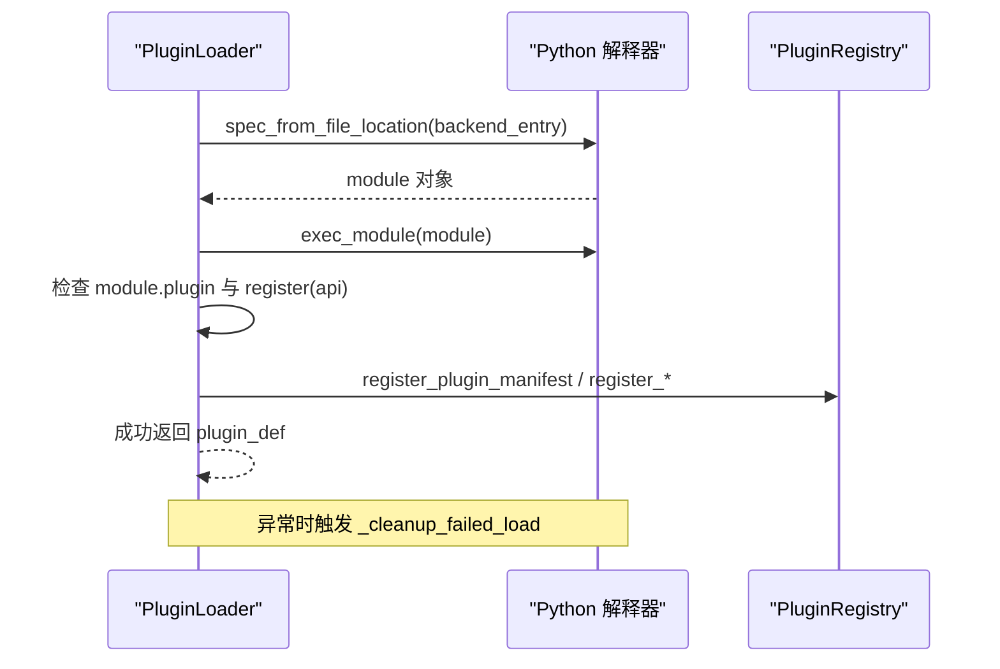
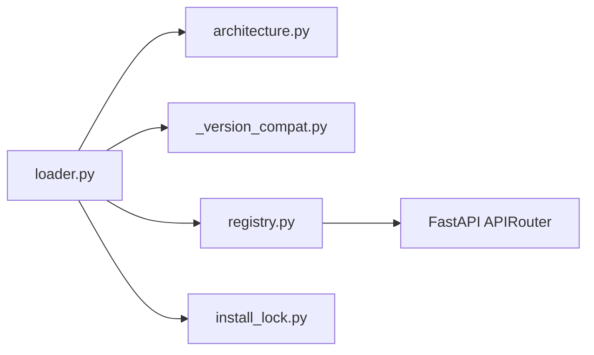

# 插件发现机制

<cite>
**本文引用的文件**   
- [loader.py](file://src/qwenpaw/plugins/loader.py)
- [registry.py](file://src/qwenpaw/plugins/registry.py)
- [architecture.py](file://src/qwenpaw/plugins/architecture.py)
- [_version_compat.py](file://src/qwenpaw/_version_compat.py)
- [validation.py](file://src/qwenpaw/plugins/validation.py)
- [plugin.json（示例：channel/azure_bot）](file://plugins/channel/azure_bot/plugin.json)
- [plugin.json（示例：tool/gpt-image2）](file://plugins/tool/gpt-image2/plugin.json)
</cite>

## 目录
1. [简介](#简介)
2. [项目结构](#项目结构)
3. [核心组件](#核心组件)
4. [架构总览](#架构总览)
5. [详细组件分析](#详细组件分析)
6. [依赖关系分析](#依赖关系分析)
7. [性能考虑](#性能考虑)
8. [故障排查指南](#故障排查指南)
9. [结论](#结论)
10. [附录](#附录)

## 简介
本文件系统性阐述 QwenPaw 的插件发现与加载机制，覆盖以下关键主题：
- 插件目录扫描算法：如何遍历 plugin_dirs、识别有效插件目录、处理隐藏与禁用插件。
- manifest.json 解析流程：字段校验、版本兼容性检查、依赖关系分析。
- 性能优化策略：缓存机制与增量扫描思路。
- 插件目录组织规范最佳实践：命名约定、文件结构与配置示例。

## 项目结构
QwenPaw 插件子系统位于 src/qwenpaw/plugins 下，核心由“发现-验证-加载-注册”四阶段组成；manifest 定义在 architecture.py，版本兼容在 _version_compat.py，安装与依赖管理在 loader.py，运行时注册在 registry.py，CLI 校验工具在 validation.py。

图表来源
- [loader.py:132-172](file://src/qwenpaw/plugins/loader.py#L132-L172)
- [loader.py:174-189](file://src/qwenpaw/plugins/loader.py#L174-L189)
- [loader.py:192-206](file://src/qwenpaw/plugins/loader.py#L192-L206)
- [loader.py:270-304](file://src/qwenpaw/plugins/loader.py#L270-L304)
- [loader.py:376-458](file://src/qwenpaw/plugins/loader.py#L376-L458)
- [registry.py:220-292](file://src/qwenpaw/plugins/registry.py#L220-L292)

章节来源
- [loader.py:119-172](file://src/qwenpaw/plugins/loader.py#L119-L172)
- [architecture.py:114-210](file://src/qwenpaw/plugins/architecture.py#L114-L210)
- [_version_compat.py:33-66](file://src/qwenpaw/_version_compat.py#L33-L66)
- [registry.py:220-292](file://src/qwenpaw/plugins/registry.py#L220-L292)

## 核心组件
- PluginLoader：负责插件发现、清单解析、依赖安装、模块动态加载与生命周期清理。
- PluginManifest：基于 Pydantic 的清单模型，提供字段规范化、类型推断与向后兼容。
- PluginRegistry：集中式注册表，维护 Provider、Hook、HTTP Router、Channel、PromptSection 等。
- 版本兼容检查：基于 packaging.version 的区间比较，支持 min/max 或推导 max。
- 依赖安装：requirements.txt 解析、双探针满足性检测、uv/pip 回退、进程锁防并发风暴。
- 模块校验：validation.validate_plugin_module 用于 CLI 预检，模拟真实加载语义。

章节来源
- [loader.py:119-172](file://src/qwenpaw/plugins/loader.py#L119-L172)
- [loader.py:248-304](file://src/qwenpaw/plugins/loader.py#L248-L304)
- [loader.py:376-458](file://src/qwenpaw/plugins/loader.py#L376-L458)
- [architecture.py:114-210](file://src/qwenpaw/plugins/architecture.py#L114-L210)
- [_version_compat.py:33-66](file://src/qwenpaw/_version_compat.py#L33-L66)
- [validation.py:15-78](file://src/qwenpaw/plugins/validation.py#L15-L78)

## 架构总览
下图展示从“扫描目录”到“注册能力”的端到端流程，以及关键分支（隐藏/禁用、版本不兼容、依赖缺失、入口缺失）。

图表来源
- [loader.py:132-172](file://src/qwenpaw/plugins/loader.py#L132-L172)
- [loader.py:192-206](file://src/qwenpaw/plugins/loader.py#L192-L206)
- [loader.py:270-304](file://src/qwenpaw/plugins/loader.py#L270-L304)
- [loader.py:376-458](file://src/qwenpaw/plugins/loader.py#L376-L458)
- [registry.py:220-292](file://src/qwenpaw/plugins/registry.py#L220-L292)

## 详细组件分析

### 目录扫描与过滤
- 遍历规则：对每个 plugin_dir 调用 iterdir()，仅处理 is_dir() 的子项。
- 隐藏与禁用：_is_disabled_plugin_dir(path) 排除以 "." 开头或以 ".disabled" 结尾的目录。
- 有效性判定：子目录必须包含 plugin.json，否则跳过。
- 日志与容错：目录不存在、清单解析失败均记录日志，不影响其他插件。

图表来源
- [loader.py:132-172](file://src/qwenpaw/plugins/loader.py#L132-L172)
- [loader.py:81-90](file://src/qwenpaw/plugins/loader.py#L81-L90)

章节来源
- [loader.py:132-172](file://src/qwenpaw/plugins/loader.py#L132-L172)
- [loader.py:81-90](file://src/qwenpaw/plugins/loader.py#L81-L90)

### manifest.json 解析与校验
- 模型定义：PluginManifest 使用 Pydantic，支持 extra="ignore" 以忽略未知字段。
- 文本国际化兼容：name/description/author 可为映射对象，自动取首个非空值。
- 入口点兼容：支持 legacy entry_point 合并为 entry.backend。
- 类型推断：若未显式 type，则根据 meta 与 entry 推断（tools/provider/hook/command/channel/frontend/general）。
- 版本约束：qwenpaw_version.min/max 或旧版 min_version/max_version。

图表来源
- [architecture.py:114-210](file://src/qwenpaw/plugins/architecture.py#L114-L210)
- [architecture.py:41-48](file://src/qwenpaw/plugins/architecture.py#L41-L48)
- [architecture.py:100-112](file://src/qwenpaw/plugins/architecture.py#L100-L112)

章节来源
- [architecture.py:114-210](file://src/qwenpaw/plugins/architecture.py#L114-L210)
- [architecture.py:41-48](file://src/qwenpaw/plugins/architecture.py#L41-L48)
- [architecture.py:100-112](file://src/qwenpaw/plugins/architecture.py#L100-L112)

### 版本兼容性检查
- 语义：左闭右开区间 >=min, <max。
- 缺省推导：当 max 缺失时，按 min 的 minor+1 推导上界。
- 预发布兼容：当前版本为 pre-release 时，按基础版本参与比较，便于开发者加载目标未来版本的插件。

图表来源
- [_version_compat.py:33-66](file://src/qwenpaw/_version_compat.py#L33-L66)

章节来源
- [_version_compat.py:33-66](file://src/qwenpaw/_version_compat.py#L33-L66)

### 依赖分析与安装
- requirements.txt 解析：逐行解析 Requirement，忽略注释与空行。
- 满足性探测：
  - importlib.metadata：权威探测已安装包及其版本范围匹配。
  - find_spec：兜底探测冻结桌面构建中可能缺少 .dist-info 的包。
- 安装路径与环境：
  - 普通环境：python -m pip install -r requirements.txt。
  - uv 回退：若 pip 不可用，尝试 uv pip install。
  - 冻结桌面：通过内置 Python 运行时安装至用户可写 site-dir。
- 并发安全：按 plugin_id 生成锁文件，避免多进程重复安装导致内存耗尽。

图表来源
- [loader.py:248-304](file://src/qwenpaw/plugins/loader.py#L248-L304)
- [loader.py:306-334](file://src/qwenpaw/plugins/loader.py#L306-L334)
- [loader.py:721-800](file://src/qwenpaw/plugins/loader.py#L721-L800)

章节来源
- [loader.py:248-304](file://src/qwenpaw/plugins/loader.py#L248-L304)
- [loader.py:306-334](file://src/qwenpaw/plugins/loader.py#L306-L334)
- [loader.py:721-800](file://src/qwenpaw/plugins/loader.py#L721-L800)

### 后端模块加载与注册
- 动态导入：spec_from_file_location 指定 module_name 与搜索路径，确保相对导入可用。
- 接口契约：模块需导出 plugin 对象，并提供 register(api) 方法（可异步）。
- 元数据注入：将 manifest 关键信息封装为 dict 传入 PluginApi，并写入 Registry。
- 错误恢复：加载失败时执行 _cleanup_failed_load，清理 sys.modules、sys.path 与注册表。

图表来源
- [loader.py:376-458](file://src/qwenpaw/plugins/loader.py#L376-L458)
- [loader.py:460-513](file://src/qwenpaw/plugins/loader.py#L460-L513)
- [registry.py:220-292](file://src/qwenpaw/plugins/registry.py#L220-L292)

章节来源
- [loader.py:376-458](file://src/qwenpaw/plugins/loader.py#L376-L458)
- [loader.py:460-513](file://src/qwenpaw/plugins/loader.py#L460-L513)
- [registry.py:220-292](file://src/qwenpaw/plugins/registry.py#L220-L292)

### 清单字段与示例
- 关键字段：id、version、type、entry.backend、dependencies、qwenpaw_version（或 min_version/max_version）、meta。
- 示例一（channel）：声明 Azure Bot Service 渠道，依赖 aiohttp、PyJWT、msal，限定 QwenPaw 版本区间。
- 示例二（tool）：声明两个工具，并在 meta.tools 中描述 UI 配置字段、图标与帮助信息。

章节来源
- [plugin.json（示例：channel/azure_bot）](file://plugins/channel/azure_bot/plugin.json)
- [plugin.json（示例：tool/gpt-image2）](file://plugins/tool/gpt-image2/plugin.json)

## 依赖关系分析
- 组件耦合：
  - loader.py 依赖 architecture.py（清单模型）、_version_compat.py（版本检查）、install_lock（并发控制）、registry.py（注册）。
  - registry.py 依赖 FastAPI APIRouter 进行 HTTP 路由挂载。
- 外部依赖：
  - packaging.version：版本比较。
  - importlib.metadata / importlib.util：包元数据与动态导入。
  - subprocess：调用 pip/uv。
- 潜在循环：未发现直接循环依赖；loader 与 registry 单向依赖。

图表来源
- [loader.py:119-172](file://src/qwenpaw/plugins/loader.py#L119-L172)
- [registry.py:220-292](file://src/qwenpaw/plugins/registry.py#L220-L292)

章节来源
- [loader.py:119-172](file://src/qwenpaw/plugins/loader.py#L119-L172)
- [registry.py:220-292](file://src/qwenpaw/plugins/registry.py#L220-L292)

## 性能考虑
- 缓存机制
  - 依赖满足性缓存：importlib.metadata 与 find_spec 组合减少误判与重复安装。
  - 安装锁：按 plugin_id 加锁，避免多进程并发安装导致的资源争用与内存峰值。
  - 模块卸载清理：失败加载后清理 sys.modules/sys.path，避免后续污染。
- 增量扫描建议（实现层面可扩展）
  - 基于 plugin.json 的 mtime 与 requirements.txt 的 mtime 做增量判断，仅重扫变更目录。
  - 对已加载插件建立索引，二次加载时跳过已存在 id 的插件。
  - 依赖安装结果持久化（如记录已安装包的哈希），下次启动快速比对。
- 运行期开销
  - 动态导入仅在需要时执行；前端-only 插件可跳过后端加载。
  - HTTP 路由注册前插到 SPA catch-all 之前，避免额外匹配成本。

[本节为通用指导，不直接分析具体文件]

## 故障排查指南
- 常见错误与定位
  - 清单无效或缺少必填字段：查看 loader._load_manifest 抛出的 JSON/校验异常。
  - 版本不兼容：检查 _version_compat.check_plugin_version_compat 返回的诊断信息。
  - 依赖安装失败：确认 pip/uv 可用性、网络与超时；查看 _run_subprocess_with_streaming_log 输出。
  - 入口文件缺失：_validate_entry_points 会抛出 FileNotFoundError 并提示缺失路径。
  - 模块加载失败：_cleanup_failed_load 会清理残留状态，避免影响其他插件。
- 调试建议
  - 启用 DEBUG 日志级别，观察扫描、解析、安装与加载各阶段输出。
  - 使用 CLI 校验命令（参考 validation.validate_plugin_module）在部署前预检。
  - 检查 plugin_runtime 目录中的安装锁与 site-dir，确认并发与 ABI 桶隔离。

章节来源
- [loader.py:174-189](file://src/qwenpaw/plugins/loader.py#L174-L189)
- [loader.py:192-206](file://src/qwenpaw/plugins/loader.py#L192-L206)
- [loader.py:336-374](file://src/qwenpaw/plugins/loader.py#L336-L374)
- [loader.py:460-513](file://src/qwenpaw/plugins/loader.py#L460-L513)
- [validation.py:15-78](file://src/qwenpaw/plugins/validation.py#L15-L78)

## 结论
QwenPaw 的插件发现机制以“严格校验 + 健壮容错 + 并发安全”为核心设计原则：
- 通过严格的清单模型与版本区间检查保障生态一致性。
- 通过双探针依赖探测与安装锁提升稳定性与性能。
- 通过动态导入与注册表解耦扩展能力边界。
建议在插件开发中遵循本文的组织规范与配置示例，以获得最佳兼容性与用户体验。

[本节为总结性内容，不直接分析具体文件]

## 附录

### 插件目录组织规范（最佳实践）
- 命名约定
  - 插件目录名建议使用小写字母、数字与短横线，避免以 "." 开头或使用 ".disabled" 后缀。
  - 插件 id 应与目录名一致或保持唯一稳定标识。
- 文件结构
  - 根目录放置 plugin.json。
  - 后端入口文件（entry.backend）置于插件根目录或子目录，并确保相对导入路径正确。
  - 如需第三方依赖，提供 requirements.txt 并明确版本范围。
- 清单配置要点
  - 显式声明 type（tool/channel/provider/hook/command/frontend/general）。
  - 使用 qwenpaw_version.min/max 精确限定兼容区间；必要时保留 min_version/max_version 兼容旧格式。
  - 对于工具类插件，在 meta.tools 中提供名称、描述、图标与 config_fields，便于控制台渲染。
- 示例参考
  - channel/azure_bot/plugin.json：渠道型插件的最小必要字段与依赖声明。
  - tool/gpt-image2/plugin.json：工具型插件的 meta.tools 配置示例。

章节来源
- [plugin.json（示例：channel/azure_bot）](file://plugins/channel/azure_bot/plugin.json)
- [plugin.json（示例：tool/gpt-image2）](file://plugins/tool/gpt-image2/plugin.json)