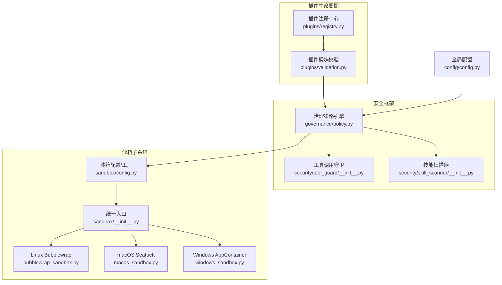
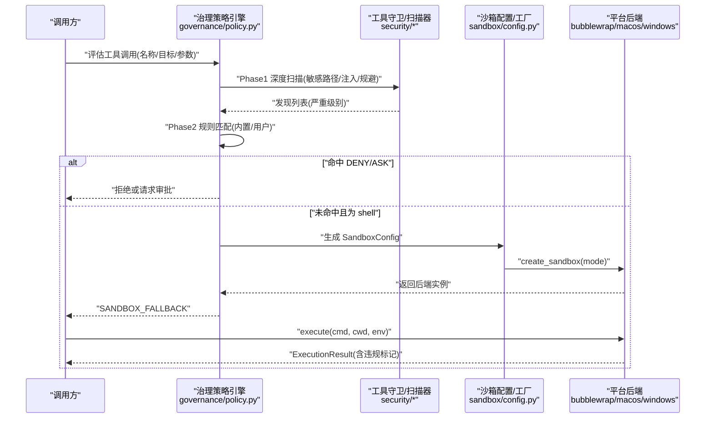
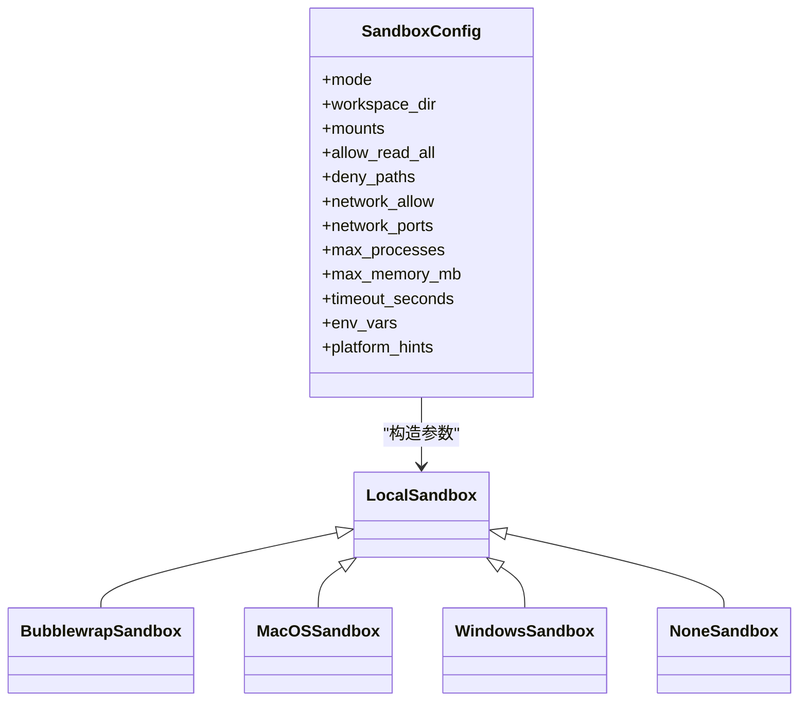
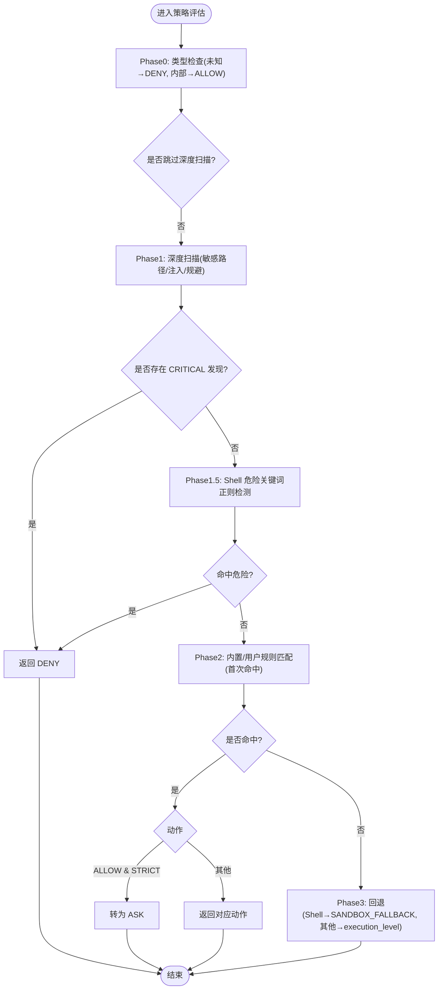
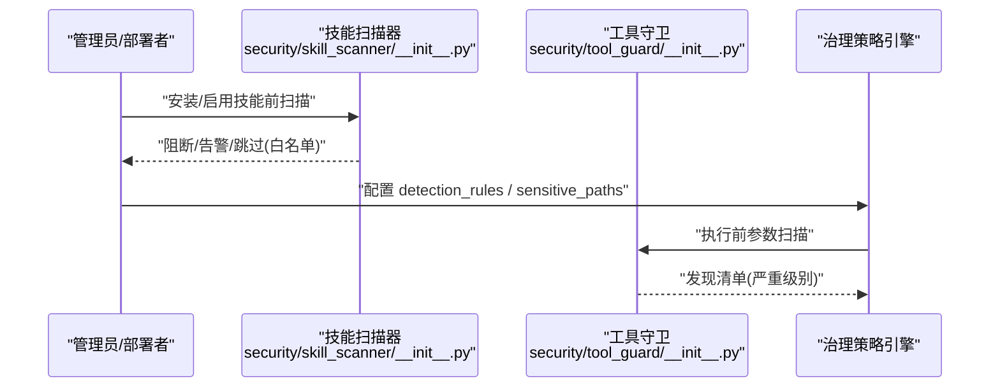
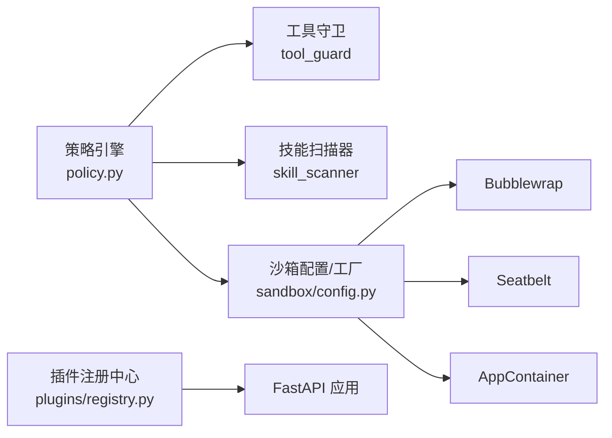

# 插件安全模型

<cite>
**本文引用的文件**   
- [sandbox/__init__.py](file://src/qwenpaw/sandbox/__init__.py)
- [sandbox/config.py](file://src/qwenpaw/sandbox/config.py)
- [sandbox/bubblewrap_sandbox.py](file://src/qwenpaw/sandbox/bubblewrap_sandbox.py)
- [sandbox/macos_sandbox.py](file://src/qwenpaw/sandbox/macos_sandbox.py)
- [sandbox/windows_sandbox.py](file://src/qwenpaw/sandbox/windows_sandbox.py)
- [security/tool_guard/__init__.py](file://src/qwenpaw/security/tool_guard/__init__.py)
- [security/skill_scanner/__init__.py](file://src/qwenpaw/security/skill_scanner/__init__.py)
- [governance/policy.py](file://src/qwenpaw/governance/policy.py)
- [config/config.py](file://src/qwenpaw/config/config.py)
- [plugins/registry.py](file://src/qwenpaw/plugins/registry.py)
- [plugins/validation.py](file://src/qwenpaw/plugins/validation.py)
</cite>

## 目录
1. [引言](#引言)
2. [项目结构](#项目结构)
3. [核心组件](#核心组件)
4. [架构总览](#架构总览)
5. [详细组件分析](#详细组件分析)
6. [依赖关系分析](#依赖关系分析)
7. [性能与可扩展性](#性能与可扩展性)
8. [故障排查指南](#故障排查指南)
9. [结论](#结论)
10. [附录：配置与风险评估](#附录配置与风险评估)

## 引言
本文件面向 QwenPaw 的“插件安全模型”，系统性阐述插件在加载、注册、运行时的隔离与防护机制，重点覆盖：
- 沙箱隔离：文件系统访问限制、网络控制现状与局限、系统调用防护
- 权限模型：基于角色/来源的最小权限原则实现（策略引擎）
- 恶意代码检测：静态扫描与运行时守卫
- 完整性与签名验证：当前仓库中的能力边界与建议
- 安全配置项与风险评估实践

## 项目结构
围绕插件安全的相关模块主要分布在以下路径：
- 沙箱子系统：src/qwenpaw/sandbox/*
- 安全框架：src/qwenpaw/security/*（工具调用守卫、技能扫描器）
- 治理策略：src/qwenpaw/governance/policy.py
- 全局配置：src/qwenpaw/config/config.py
- 插件注册与校验：src/qwenpaw/plugins/registry.py, src/qwenpaw/plugins/validation.py

图表来源
- [plugins/registry.py:129-327](file://src/qwenpaw/plugins/registry.py#L129-L327)
- [plugins/validation.py:15-78](file://src/qwenpaw/plugins/validation.py#L15-L78)
- [security/tool_guard/__init__.py:1-59](file://src/qwenpaw/security/tool_guard/__init__.py#L1-L59)
- [security/skill_scanner/__init__.py:1-120](file://src/qwenpaw/security/skill_scanner/__init__.py#L1-L120)
- [governance/policy.py:530-800](file://src/qwenpaw/governance/policy.py#L530-L800)
- [sandbox/config.py:40-157](file://src/qwenpaw/sandbox/config.py#L40-L157)
- [sandbox/__init__.py:1-63](file://src/qwenpaw/sandbox/__init__.py#L1-L63)
- [sandbox/bubblewrap_sandbox.py:52-177](file://src/qwenpaw/sandbox/bubblewrap_sandbox.py#L52-L177)
- [sandbox/macos_sandbox.py:53-248](file://src/qwenpaw/sandbox/macos_sandbox.py#L53-L248)
- [sandbox/windows_sandbox.py:1-120](file://src/qwenpaw/sandbox/windows_sandbox.py#L1-L120)
- [config/config.py:2073-2106](file://src/qwenpaw/config/config.py#L2073-L2106)

章节来源
- [plugins/registry.py:129-327](file://src/qwenpaw/plugins/registry.py#L129-L327)
- [plugins/validation.py:15-78](file://src/qwenpaw/plugins/validation.py#L15-L78)
- [security/tool_guard/__init__.py:1-59](file://src/qwenpaw/security/tool_guard/__init__.py#L1-L59)
- [security/skill_scanner/__init__.py:1-120](file://src/qwenpaw/security/skill_scanner/__init__.py#L1-L120)
- [governance/policy.py:530-800](file://src/qwenpaw/governance/policy.py#L530-L800)
- [sandbox/config.py:40-157](file://src/qwenpaw/sandbox/config.py#L40-L157)
- [sandbox/__init__.py:1-63](file://src/qwenpaw/sandbox/__init__.py#L1-L63)
- [sandbox/bubblewrap_sandbox.py:52-177](file://src/qwenpaw/sandbox/bubblewrap_sandbox.py#L52-L177)
- [sandbox/macos_sandbox.py:53-248](file://src/qwenpaw/sandbox/macos_sandbox.py#L53-L248)
- [sandbox/windows_sandbox.py:1-120](file://src/qwenpaw/sandbox/windows_sandbox.py#L1-L120)
- [config/config.py:2073-2106](file://src/qwenpaw/config/config.py#L2073-L2106)

## 核心组件
- 沙箱子系统
  - 统一入口与模式枚举：提供跨平台后端选择与能力探测
  - 配置模型：工作区、挂载点、读写/执行控制、敏感路径拒绝、网络白名单、资源限制、超时与环境注入
  - 平台后端：Linux Bubblewrap、macOS Seatbelt、Windows AppContainer、Landlock（回退）、None（无隔离）
- 安全框架
  - 工具调用守卫：在工具执行前对参数进行规则匹配与威胁分类
  - 技能扫描器：在安装/启用前对技能包进行静态扫描与阻断/告警
- 治理策略引擎
  - 两阶段规则：内置规则 + 用户规则；支持 ASK/DENY/ALLOW/SANDBOX_FALLBACK
  - 深度扫描：敏感路径、命令注入、规避技巧等检测
  - 默认沙箱拒绝路径与环境变量黑名单
- 插件注册与校验
  - 注册中心：HTTP 路由、钩子、渠道、提示词片段等集中管理
  - 模块校验：按运行期语义动态导入并检查导出契约

章节来源
- [sandbox/__init__.py:1-63](file://src/qwenpaw/sandbox/__init__.py#L1-L63)
- [sandbox/config.py:40-157](file://src/qwenpaw/sandbox/config.py#L40-L157)
- [sandbox/bubblewrap_sandbox.py:52-177](file://src/qwenpaw/sandbox/bubblewrap_sandbox.py#L52-L177)
- [sandbox/macos_sandbox.py:53-248](file://src/qwenpaw/sandbox/macos_sandbox.py#L53-L248)
- [sandbox/windows_sandbox.py:1-120](file://src/qwenpaw/sandbox/windows_sandbox.py#L1-L120)
- [security/tool_guard/__init__.py:1-59](file://src/qwenpaw/security/tool_guard/__init__.py#L1-L59)
- [security/skill_scanner/__init__.py:1-120](file://src/qwenpaw/security/skill_scanner/__init__.py#L1-L120)
- [governance/policy.py:530-800](file://src/qwenpaw/governance/policy.py#L530-L800)
- [plugins/registry.py:129-327](file://src/qwenpaw/plugins/registry.py#L129-L327)
- [plugins/validation.py:15-78](file://src/qwenpaw/plugins/validation.py#L15-L78)

## 架构总览
下图展示一次“高风险 Shell 工具调用”从策略评估到沙箱执行的端到端流程。

图表来源
- [governance/policy.py:607-730](file://src/qwenpaw/governance/policy.py#L607-L730)
- [sandbox/config.py:467-499](file://src/qwenpaw/sandbox/config.py#L467-L499)
- [sandbox/bubblewrap_sandbox.py:179-257](file://src/qwenpaw/sandbox/bubblewrap_sandbox.py#L179-L257)
- [sandbox/macos_sandbox.py:250-329](file://src/qwenpaw/sandbox/macos_sandbox.py#L250-L329)
- [sandbox/windows_sandbox.py:1-120](file://src/qwenpaw/sandbox/windows_sandbox.py#L1-L120)

## 详细组件分析

### 沙箱隔离机制
- 设计要点
  - 默认拒绝的白名单模型：仅显式声明的路径可访问；敏感路径通过 deny_paths 屏蔽
  - 最小 /dev：仅暴露必要设备节点
  - PID 隔离（Bubblewrap）：进程不可见宿主 PID
  - 超时控制：超过阈值强制终止
- 平台差异
  - Linux Bubblewrap：命名空间+挂载视图，deny_paths 对目录完全不可见，文件以 /dev/null 绑定呈现为空
  - macOS Seatbelt：内核级策略，网络域过滤在当前版本不强制（全开或全关）
  - Windows AppContainer：ACL 控制，系统目录受保护但默认允许读取执行；网络能力为二进制开关
  - Landlock：内核 LSM 回退方案（Linux）
  - None：无隔离直通
- 网络控制现状
  - 当前版本未实现网络命名空间隔离；所有沙箱进程具备完整网络访问能力
  - network_allow 字段存在但为“尽力而为”（需代理层配合），端口级控制在部分后端可用

图表来源
- [sandbox/config.py:80-157](file://src/qwenpaw/sandbox/config.py#L80-L157)
- [sandbox/bubblewrap_sandbox.py:52-177](file://src/qwenpaw/sandbox/bubblewrap_sandbox.py#L52-L177)
- [sandbox/macos_sandbox.py:53-248](file://src/qwenpaw/sandbox/macos_sandbox.py#L53-L248)
- [sandbox/windows_sandbox.py:1-120](file://src/qwenpaw/sandbox/windows_sandbox.py#L1-L120)

章节来源
- [sandbox/config.py:40-157](file://src/qwenpaw/sandbox/config.py#L40-L157)
- [sandbox/bubblewrap_sandbox.py:52-177](file://src/qwenpaw/sandbox/bubblewrap_sandbox.py#L52-L177)
- [sandbox/macos_sandbox.py:53-248](file://src/qwenpaw/sandbox/macos_sandbox.py#L53-L248)
- [sandbox/windows_sandbox.py:1-120](file://src/qwenpaw/sandbox/windows_sandbox.py#L1-L120)

### 权限模型（最小权限与来源感知）
- 策略引擎
  - 两阶段规则：内置规则（安全基线）+ 用户规则（可编辑）
  - 动作：ALLOW / DENY / ASK / SANDBOX_FALLBACK
  - 优先级：先内置后用户，首次匹配生效；严格模式下 ALLOW 升级为 ASK
- 来源感知
  - 支持主体（user/session/channel）与来源（source_type/source_value/subject_type/subject_value）组合匹配
  - 当未命中任何规则时，shell 工具走 SANDBOX_FALLBACK，其他工具根据 execution_level 决定 ASK 或 ALLOW
- 默认拒绝路径与环境变量黑名单
  - 内置大量敏感路径（SSH/AWS/GPG/K8s/浏览器凭据等）
  - 环境变量黑名单防止泄露密钥

图表来源
- [governance/policy.py:607-730](file://src/qwenpaw/governance/policy.py#L607-L730)
- [governance/policy.py:330-380](file://src/qwenpaw/governance/policy.py#L330-L380)

章节来源
- [governance/policy.py:530-800](file://src/qwenpaw/governance/policy.py#L530-L800)
- [governance/policy.py:330-380](file://src/qwenpaw/governance/policy.py#L330-L380)

### 恶意代码检测（静态分析与运行时监控）
- 静态分析（安装/启用前）
  - 技能扫描器：基于规则的模式匹配，支持 block/warn/off 模式，记录阻断历史并可白名单放行
- 运行时守卫（执行前）
  - 工具调用守卫：对工具参数进行规则匹配与威胁分类，输出发现清单供策略决策使用

图表来源
- [security/skill_scanner/__init__.py:397-487](file://src/qwenpaw/security/skill_scanner/__init__.py#L397-L487)
- [security/tool_guard/__init__.py:1-59](file://src/qwenpaw/security/tool_guard/__init__.py#L1-L59)
- [governance/policy.py:731-758](file://src/qwenpaw/governance/policy.py#L731-L758)

章节来源
- [security/skill_scanner/__init__.py:1-120](file://src/qwenpaw/security/skill_scanner/__init__.py#L1-L120)
- [security/tool_guard/__init__.py:1-59](file://src/qwenpaw/security/tool_guard/__init__.py#L1-L59)
- [governance/policy.py:731-758](file://src/qwenpaw/governance/policy.py#L731-L758)

### 插件签名验证与完整性检查
- 当前仓库中未发现插件签名验证与数字签名的实现细节
- 现有保障手段
  - 插件模块校验：按运行期语义动态导入并检查导出契约，避免无效/损坏模块
  - 策略与沙箱：对插件暴露的工具调用进行强约束与隔离
- 建议（非仓库内实现）
  - 引入签名校验（如插件包附带签名与公钥，安装时验证）
  - 增加哈希白名单与变更审计，确保插件内容未被篡改

章节来源
- [plugins/validation.py:15-78](file://src/qwenpaw/plugins/validation.py#L15-L78)

### 插件注册与 HTTP 路由安全
- 注册中心负责将插件贡献的 APIRouter 插入到主应用路由表中，并确保在控制台 SPA 捕获路由之前匹配
- 路由前缀唯一性校验与重复注册保护，避免冲突与越权暴露

章节来源
- [plugins/registry.py:129-327](file://src/qwenpaw/plugins/registry.py#L129-L327)

## 依赖关系分析
- 组件耦合
  - 策略引擎依赖工具守卫与扫描器的发现结果，驱动最终决策
  - 策略引擎在需要时生成沙箱配置，由工厂创建具体后端
  - 插件注册中心与策略引擎解耦，但可通过中间件/钩子接入安全逻辑
- 外部依赖
  - Linux: bubblewrap、Landlock LSM
  - macOS: sandbox-exec (Seatbelt)
  - Windows: AppContainer + icacls ACL

图表来源
- [governance/policy.py:607-730](file://src/qwenpaw/governance/policy.py#L607-L730)
- [sandbox/config.py:467-499](file://src/qwenpaw/sandbox/config.py#L467-L499)
- [plugins/registry.py:220-296](file://src/qwenpaw/plugins/registry.py#L220-L296)

章节来源
- [governance/policy.py:607-730](file://src/qwenpaw/governance/policy.py#L607-L730)
- [sandbox/config.py:467-499](file://src/qwenpaw/sandbox/config.py#L467-L499)
- [plugins/registry.py:220-296](file://src/qwenpaw/plugins/registry.py#L220-L296)

## 性能与可扩展性
- 策略评估
  - 首次匹配即返回，避免全量遍历；严格模式仅在 ALLOW 上升级为 ASK
- 沙箱执行
  - 异步子进程与超时控制，避免长时间占用
  - 平台能力探测在启动时完成，减少运行时开销
- 扩展点
  - 新增守护器/分析器接口已抽象，便于接入 LLM 判定或语义分析
  - 策略规则支持 YAML 自定义，灵活适配业务场景

[本节为通用指导，无需源码引用]

## 故障排查指南
- 沙箱相关
  - macOS Seatbelt 语法错误：检查 profile 生成与路径转义
  - Linux Bubblewrap 不可用：确认 bwrap 安装与用户/挂载命名空间可用
  - Windows AppContainer 权限不足：确认 icacls 与管理员权限；注意系统目录受 WRP 保护
- 策略相关
  - 严格模式导致频繁审批：调整 execution_level 或细化规则
  - 未命中规则导致直接执行：检查内置/用户规则与默认回退逻辑
- 扫描相关
  - 扫描超时：调大 timeout 或优化规则集
  - 误报/漏报：更新 detection_rules 与 sensitive_paths

章节来源
- [sandbox/macos_sandbox.py:250-329](file://src/qwenpaw/sandbox/macos_sandbox.py#L250-L329)
- [sandbox/bubblewrap_sandbox.py:179-257](file://src/qwenpaw/sandbox/bubblewrap_sandbox.py#L179-L257)
- [sandbox/windows_sandbox.py:1-120](file://src/qwenpaw/sandbox/windows_sandbox.py#L1-L120)
- [governance/policy.py:607-730](file://src/qwenpaw/governance/policy.py#L607-L730)
- [security/skill_scanner/__init__.py:397-487](file://src/qwenpaw/security/skill_scanner/__init__.py#L397-L487)

## 结论
QwenPaw 的插件安全模型以“策略先行、沙箱兜底”为核心：
- 策略引擎在工具调用前进行深度扫描与规则匹配，必要时触发审批或沙箱执行
- 沙箱提供跨平台的文件系统与系统调用隔离，当前网络隔离尚未实现
- 静态扫描与运行时守卫共同构成恶意代码检测体系
- 插件注册与模块校验保障基本可用性，签名与完整性验证建议作为后续增强

[本节为总结，无需源码引用]

## 附录：配置与风险评估

### 关键配置项
- 全局安全开关
  - security.sandbox_enabled：是否开启治理沙箱执行（默认关闭）
- 信任代理与免认证主机
  - security.allow_no_auth_hosts：允许免认证的客户端 IP 列表
  - security.trusted_proxies：反向代理可信 IP/CIDR 列表（禁止包含 0.0.0.0/0 等）
- 沙箱配置（由策略引擎自动编译）
  - mode/workspace_dir/mounts/deny_paths/allow_read_all/network_allow/network_ports/max_processes/max_memory_mb/timeout_seconds/env_vars/platform_hints

章节来源
- [config/config.py:2073-2106](file://src/qwenpaw/config/config.py#L2073-L2106)
- [sandbox/config.py:80-157](file://src/qwenpaw/sandbox/config.py#L80-L157)

### 风险评估指南
- 风险维度
  - 数据泄露：敏感路径访问、环境变量泄露
  - 命令注入/提权：危险命令、sudo、格式化磁盘等
  - 资源滥用：进程/内存超限（当前未强制）
  - 网络滥用：域名/端口控制（当前为尽力而为）
- 缓解措施
  - 启用严格模式或精细化规则，结合审批流
  - 启用沙箱并合理设置 mounts/deny_paths
  - 定期更新 detection_rules 与 sensitive_paths
  - 审计日志与阻断历史记录用于复盘与改进

[本节为通用指导，无需源码引用]