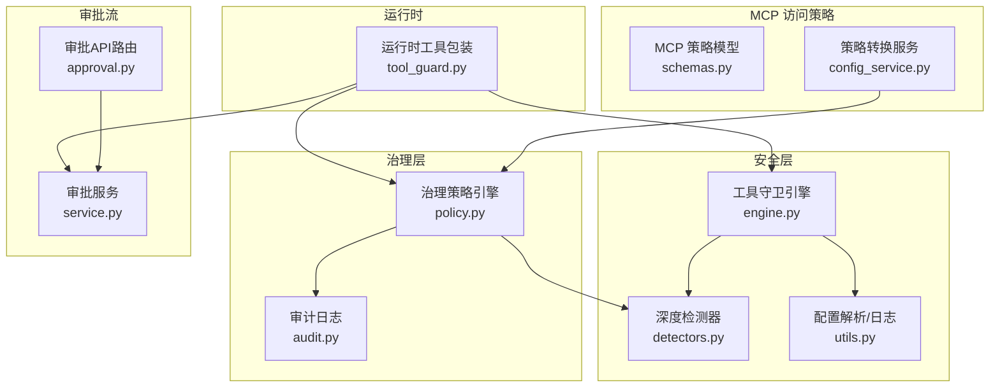
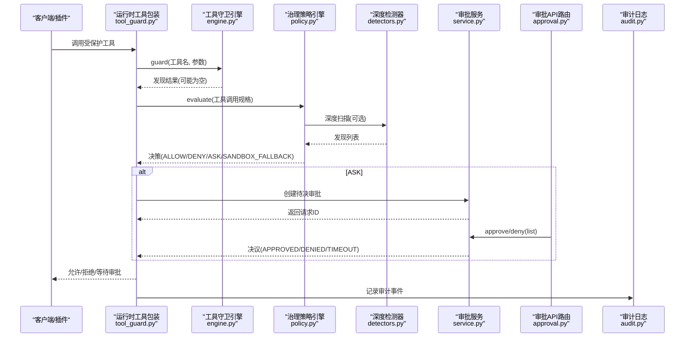
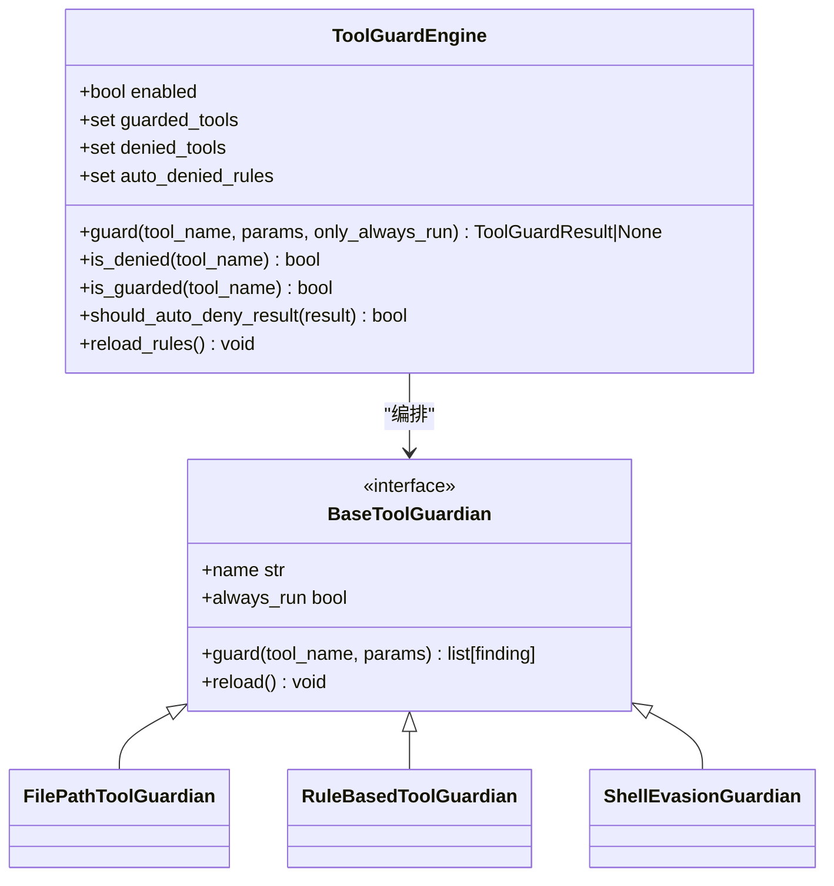
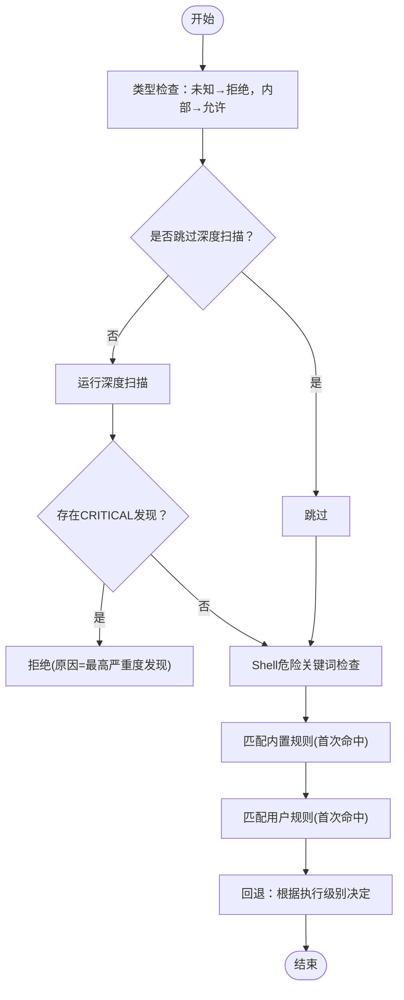
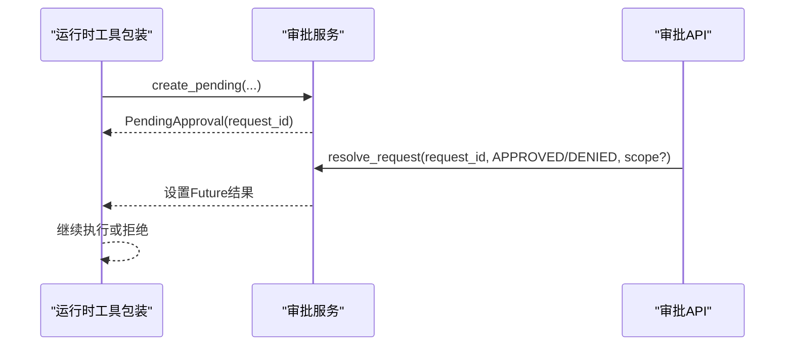
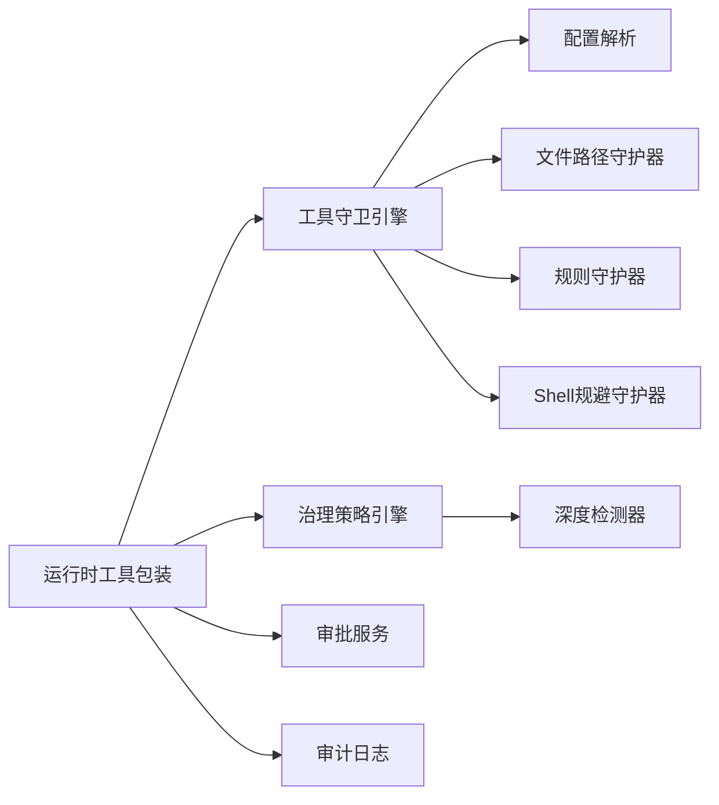

# 插件权限控制

<cite>
**本文引用的文件**   
- [src/qwenpaw/runtime/tool_guard.py](file://src/qwenpaw/runtime/tool_guard.py)
- [src/qwenpaw/security/tool_guard/engine.py](file://src/qwenpaw/security/tool_guard/engine.py)
- [src/qwenpaw/governance/policy.py](file://src/qwenpaw/governance/policy.py)
- [src/qwenpaw/governance/detectors.py](file://src/qwenpaw/governance/detectors.py)
- [src/qwenpaw/app/approvals/service.py](file://src/qwenpaw/app/approvals/service.py)
- [src/qwenpaw/app/routers/approval.py](file://src/qwenpaw/app/routers/approval.py)
- [src/qwenpaw/governance/audit.py](file://src/qwenpaw/governance/audit.py)
- [src/qwenpaw/security/tool_guard/utils.py](file://src/qwenpaw/security/tool_guard/utils.py)
- [src/qwenpaw/app/mcp/schemas.py](file://src/qwenpaw/app/mcp/schemas.py)
- [src/qwenpaw/app/mcp/config_service.py](file://src/qwenpaw/app/mcp/config_service.py)
- [website/public/docs/security.en.md](file://website/public/docs/security.en.md)
</cite>

## 目录
1. [简介](#简介)
2. [项目结构](#项目结构)
3. [核心组件](#核心组件)
4. [架构总览](#架构总览)
5. [详细组件分析](#详细组件分析)
6. [依赖关系分析](#依赖关系分析)
7. [性能考量](#性能考量)
8. [故障排查指南](#故障排查指南)
9. [结论](#结论)
10. [附录](#附录)

## 简介
本文件面向“插件权限控制系统”，系统性阐述基于角色的访问控制（RBAC）在插件系统中的实现方式，以及工具守卫引擎的工作原理、策略配置与动态更新机制、审批流程与审计日志。文档覆盖：
- 角色定义、权限分配与访问决策
- 工具守卫引擎的规则匹配、执行级别控制与审批流程
- YAML 策略文件的结构与动态更新
- 权限审计与日志记录方案

## 项目结构
围绕权限控制的代码主要分布在以下模块：
- 运行时工具包装与调用入口：runtime/tool_guard.py
- 工具守卫引擎与守护器编排：security/tool_guard/engine.py
- 治理策略与规则引擎：governance/policy.py、governance/detectors.py
- 审批服务与API：app/approvals/service.py、app/routers/approval.py
- 审计日志：governance/audit.py
- 工具守卫配置解析：security/tool_guard/utils.py
- MCP 访问策略模型与转换：app/mcp/schemas.py、app/mcp/config_service.py
- 用户文档参考：website/public/docs/security.en.md

图表来源
- [src/qwenpaw/runtime/tool_guard.py:1-415](file://src/qwenpaw/runtime/tool_guard.py#L1-L415)
- [src/qwenpaw/security/tool_guard/engine.py:1-269](file://src/qwenpaw/security/tool_guard/engine.py#L1-L269)
- [src/qwenpaw/governance/detectors.py:1-764](file://src/qwenpaw/governance/detectors.py#L1-L764)
- [src/qwenpaw/security/tool_guard/utils.py:1-194](file://src/qwenpaw/security/tool_guard/utils.py#L1-L194)
- [src/qwenpaw/governance/policy.py:1-1418](file://src/qwenpaw/governance/policy.py#L1-L1418)
- [src/qwenpaw/governance/audit.py:1-381](file://src/qwenpaw/governance/audit.py#L1-L381)
- [src/qwenpaw/app/approvals/service.py:1-564](file://src/qwenpaw/app/approvals/service.py#L1-L564)
- [src/qwenpaw/app/routers/approval.py:1-265](file://src/qwenpaw/app/routers/approval.py#L1-L265)
- [src/qwenpaw/app/mcp/schemas.py:166-273](file://src/qwenpaw/app/mcp/schemas.py#L166-L273)
- [src/qwenpaw/app/mcp/config_service.py:452-611](file://src/qwenpaw/app/mcp/config_service.py#L452-L611)

章节来源
- [src/qwenpaw/runtime/tool_guard.py:1-415](file://src/qwenpaw/runtime/tool_guard.py#L1-L415)
- [src/qwenpaw/security/tool_guard/engine.py:1-269](file://src/qwenpaw/security/tool_guard/engine.py#L1-L269)
- [src/qwenpaw/governance/policy.py:1-1418](file://src/qwenpaw/governance/policy.py#L1-L1418)
- [src/qwenpaw/governance/detectors.py:1-764](file://src/qwenpaw/governance/detectors.py#L1-L764)
- [src/qwenpaw/app/approvals/service.py:1-564](file://src/qwenpaw/app/approvals/service.py#L1-L564)
- [src/qwenpaw/app/routers/approval.py:1-265](file://src/qwenpaw/app/routers/approval.py#L1-L265)
- [src/qwenpaw/governance/audit.py:1-381](file://src/qwenpaw/governance/audit.py#L1-L381)
- [src/qwenpaw/security/tool_guard/utils.py:1-194](file://src/qwenpaw/security/tool_guard/utils.py#L1-L194)
- [src/qwenpaw/app/mcp/schemas.py:166-273](file://src/qwenpaw/app/mcp/schemas.py#L166-L273)
- [src/qwenpaw/app/mcp/config_service.py:452-611](file://src/qwenpaw/app/mcp/config_service.py#L452-L611)
- [website/public/docs/security.en.md:690-798](file://website/public/docs/security.en.md#L690-L798)

## 核心组件
- 运行时工具包装 GuardedFunctionTool：将每个工具调用接入守卫与审批流程，支持会话级执行级别覆盖与代理拒绝提示。
- 工具守卫引擎 ToolGuardEngine：编排多个守护器（路径、规则、Shell 规避），聚合发现并支持自动拒绝规则集。
- 治理策略引擎 GovernancePolicy：两阶段策略（内置规则 + 用户规则）+ 三阶段评估（深度扫描、规则匹配、回退阈值）。
- 深度检测器 Detectors：敏感路径、危险模式、Shell 规避三类检测，产出结构化发现。
- 审批服务 ApprovalService：集中管理待决审批、超时清理、跨会话路由与范围选择（精确/相似）。
- 审批API路由 /approval/*：提供批准、拒绝、列表等接口，校验根会话归属。
- 审计日志 AuditLog：SQLite 持久化，支持分页查询与自动清理。
- MCP 访问策略：控制台友好的策略模型与到驱动策略的转换，支持默认效果与按源/主体/工具的覆盖。

章节来源
- [src/qwenpaw/runtime/tool_guard.py:1-415](file://src/qwenpaw/runtime/tool_guard.py#L1-L415)
- [src/qwenpaw/security/tool_guard/engine.py:1-269](file://src/qwenpaw/security/tool_guard/engine.py#L1-L269)
- [src/qwenpaw/governance/policy.py:1-1418](file://src/qwenpaw/governance/policy.py#L1-L1418)
- [src/qwenpaw/governance/detectors.py:1-764](file://src/qwenpaw/governance/detectors.py#L1-L764)
- [src/qwenpaw/app/approvals/service.py:1-564](file://src/qwenpaw/app/approvals/service.py#L1-L564)
- [src/qwenpaw/app/routers/approval.py:1-265](file://src/qwenpaw/app/routers/approval.py#L1-L265)
- [src/qwenpaw/governance/audit.py:1-381](file://src/qwenpaw/governance/audit.py#L1-L381)
- [src/qwenpaw/app/mcp/schemas.py:166-273](file://src/qwenpaw/app/mcp/schemas.py#L166-L273)
- [src/qwenpaw/app/mcp/config_service.py:452-611](file://src/qwenpaw/app/mcp/config_service.py#L452-L611)

## 架构总览
下图展示一次工具调用的完整权限决策链路：从运行时包装到守卫引擎、治理策略、审批服务与审计日志。

图表来源
- [src/qwenpaw/runtime/tool_guard.py:130-415](file://src/qwenpaw/runtime/tool_guard.py#L130-L415)
- [src/qwenpaw/security/tool_guard/engine.py:200-258](file://src/qwenpaw/security/tool_guard/engine.py#L200-L258)
- [src/qwenpaw/governance/policy.py:607-841](file://src/qwenpaw/governance/policy.py#L607-L841)
- [src/qwenpaw/governance/detectors.py:56-113](file://src/qwenpaw/governance/detectors.py#L56-L113)
- [src/qwenpaw/app/approvals/service.py:122-294](file://src/qwenpaw/app/approvals/service.py#L122-L294)
- [src/qwenpaw/app/routers/approval.py:60-208](file://src/qwenpaw/app/routers/approval.py#L60-L208)
- [src/qwenpaw/governance/audit.py:187-244](file://src/qwenpaw/governance/audit.py#L187-L244)

## 详细组件分析

### 工具守卫引擎与守护器
- 职责：根据配置决定对哪些工具进行守卫；运行各守护器（文件路径、规则、Shell 规避）；汇总发现；支持自动拒绝规则集。
- 关键能力：
  - 启用开关与环境/配置优先级
  - 守护器注册/卸载与只读属性暴露
  - 仅 always_run 守护器的选择性执行
  - 自动拒绝规则命中即直接拒绝

图表来源
- [src/qwenpaw/security/tool_guard/engine.py:54-269](file://src/qwenpaw/security/tool_guard/engine.py#L54-L269)

章节来源
- [src/qwenpaw/security/tool_guard/engine.py:1-269](file://src/qwenpaw/security/tool_guard/engine.py#L1-L269)
- [src/qwenpaw/security/tool_guard/utils.py:64-156](file://src/qwenpaw/security/tool_guard/utils.py#L64-L156)

### 治理策略引擎（两阶段策略 + 三阶段评估）
- 两阶段策略：
  - 内置规则（builtin_rules）：系统级保护，不可被 YAML 覆盖
  - 用户规则（user_rules）：由审批或控制台生成，可动态增删
- 三阶段评估：
  - Phase 1：深度安全扫描（敏感路径、危险模式、Shell 规避）
  - Phase 1.5：Shell 危险关键词正则检查
  - Phase 2：内置规则 + 用户规则首次匹配优先
  - Phase 3：回退逻辑结合执行级别（OFF/AUTO/SMART/STRICT）
- 执行级别影响：
  - STRICT：所有工具均需审批（即使匹配 ALLOW）
  - SMART：低严重度发现自动放行，中等及以上需审批
  - AUTO/OFF：无发现则放行，有发现则审批

图表来源
- [src/qwenpaw/governance/policy.py:607-841](file://src/qwenpaw/governance/policy.py#L607-L841)
- [src/qwenpaw/governance/detectors.py:56-113](file://src/qwenpaw/governance/detectors.py#L56-L113)

章节来源
- [src/qwenpaw/governance/policy.py:1-1418](file://src/qwenpaw/governance/policy.py#L1-L1418)
- [src/qwenpaw/governance/detectors.py:1-764](file://src/qwenpaw/governance/detectors.py#L1-L764)

### 审批服务与API
- 审批服务：
  - 维护内存中的待决审批队列，支持按会话/根会话/代理维度查询
  - 通过 Future 阻塞等待用户响应，支持超时与批量取消
  - 支持“精确”和“相似”两种授权范围，用于后续规则泛化
- 审批API：
  - POST /approval/approve：批准并携带 scope（exact/similar）
  - POST /approval/deny：拒绝并可附带原因
  - GET /approval/list：列出待决项，支持按根会话过滤

图表来源
- [src/qwenpaw/app/approvals/service.py:122-294](file://src/qwenpaw/app/approvals/service.py#L122-L294)
- [src/qwenpaw/app/routers/approval.py:60-208](file://src/qwenpaw/app/routers/approval.py#L60-L208)

章节来源
- [src/qwenpaw/app/approvals/service.py:1-564](file://src/qwenpaw/app/approvals/service.py#L1-L564)
- [src/qwenpaw/app/routers/approval.py:1-265](file://src/qwenpaw/app/routers/approval.py#L1-L265)

### 审计日志
- 使用 SQLite 单文件存储，WAL 模式提升并发写入性能
- 记录五要素：谁、什么、何时、结果、为什么
- 支持分页查询与自动清理（达到阈值后删除最旧记录）

章节来源
- [src/qwenpaw/governance/audit.py:1-381](file://src/qwenpaw/governance/audit.py#L1-L381)

### MCP 访问策略（控制台友好模型与转换）
- 模型：
  - default_effect：客户端级默认效果
  - client_overrides：客户端级源/主体覆盖
  - tool_defaults：工具级默认效果
  - tool_overrides：源/主体/工具三级覆盖
- 转换：
  - 将控制台策略转换为驱动策略（含未管理规则保留计数）

章节来源
- [src/qwenpaw/app/mcp/schemas.py:166-273](file://src/qwenpaw/app/mcp/schemas.py#L166-L273)
- [src/qwenpaw/app/mcp/config_service.py:452-611](file://src/qwenpaw/app/mcp/config_service.py#L452-L611)

## 依赖关系分析
- 运行时工具包装依赖：
  - 工具守卫引擎（获取发现、自动拒绝判断）
  - 治理策略引擎（最终决策）
  - 审批服务（阻塞等待用户决策）
  - 审计日志（记录决策）
- 治理策略引擎依赖：
  - 深度检测器（Phase 1）
  - 工具注册表（类型判定）
- 工具守卫引擎依赖：
  - 配置解析（守卫/拒绝/自动拒绝规则集合）
  - 守护器实例（文件路径、规则、Shell 规避）

图表来源
- [src/qwenpaw/runtime/tool_guard.py:130-415](file://src/qwenpaw/runtime/tool_guard.py#L130-L415)
- [src/qwenpaw/security/tool_guard/engine.py:54-269](file://src/qwenpaw/security/tool_guard/engine.py#L54-L269)
- [src/qwenpaw/governance/policy.py:607-841](file://src/qwenpaw/governance/policy.py#L607-L841)
- [src/qwenpaw/governance/detectors.py:56-113](file://src/qwenpaw/governance/detectors.py#L56-L113)
- [src/qwenpaw/security/tool_guard/utils.py:64-156](file://src/qwenpaw/security/tool_guard/utils.py#L64-L156)

章节来源
- [src/qwenpaw/runtime/tool_guard.py:1-415](file://src/qwenpaw/runtime/tool_guard.py#L1-L415)
- [src/qwenpaw/security/tool_guard/engine.py:1-269](file://src/qwenpaw/security/tool_guard/engine.py#L1-L269)
- [src/qwenpaw/governance/policy.py:1-1418](file://src/qwenpaw/governance/policy.py#L1-L1418)
- [src/qwenpaw/governance/detectors.py:1-764](file://src/qwenpaw/governance/detectors.py#L1-L764)
- [src/qwenpaw/security/tool_guard/utils.py:1-194](file://src/qwenpaw/security/tool_guard/utils.py#L1-L194)

## 性能考量
- 守卫引擎：
  - 守护器异常隔离，单个守护器失败不影响整体
  - 仅 always_run 守护器在受限场景下执行，降低开销
- 治理策略：
  - 首次匹配优先，避免全量扫描
  - 内置规则与用户规则分离，减少误配风险
- 审计日志：
  - WAL 模式与批量清理，避免长时间阻塞
- 建议：
  - 合理设置 execution_level，避免过度审批造成延迟
  - 精简 detection_rules 与 sensitive_paths，减少正则匹配成本

## 故障排查指南
- 工具被永久拒绝：
  - 检查 denied_tools 与 auto_denied_rules 配置
  - 查看工具守卫引擎的 should_auto_deny_result 判定
- 审批未生效或找不到：
  - 确认 request_id 与 root_session_id 一致
  - 检查审批服务中是否存在对应 pending 记录
- 策略不生效：
  - 确认 policy.yaml 版本与字段正确性
  - 注意 builtin_rules 不可被 YAML 覆盖
- 审计数据缺失：
  - 检查审计日志数据库路径与权限
  - 关注自动清理阈值与 VACUUM 时机

章节来源
- [src/qwenpaw/security/tool_guard/engine.py:173-188](file://src/qwenpaw/security/tool_guard/engine.py#L173-L188)
- [src/qwenpaw/app/routers/approval.py:82-104](file://src/qwenpaw/app/routers/approval.py#L82-L104)
- [src/qwenpaw/governance/policy.py:1023-1036](file://src/qwenpaw/governance/policy.py#L1023-L1036)
- [src/qwenpaw/governance/audit.py:355-381](file://src/qwenpaw/governance/audit.py#L355-L381)

## 结论
本权限控制系统以“运行时包装 + 守卫引擎 + 治理策略 + 审批服务 + 审计日志”的分层架构，实现了细粒度、可扩展且可观测的插件权限控制。通过两阶段策略与三阶段评估，兼顾安全性与可用性；通过控制台友好的 MCP 访问策略与动态更新机制，提升了运维效率；通过结构化审计与日志，为合规与排障提供了坚实基础。

## 附录

### 执行级别（approval_level）说明
- STRICT：所有工具调用均需人工审批
- SMART：低风险自动放行，高风险需审批
- AUTO：仅触发规则时要求审批（默认）
- OFF：关闭工具守卫

章节来源
- [website/public/docs/security.en.md:165-188](file://website/public/docs/security.en.md#L165-L188)

### 策略文件（policy.yaml）要点
- 支持 v1.0 与 v2.0 格式
- builtin_rules 始终来自代码，忽略 YAML 中的同名键
- user_rules 支持 match/action/grantee/duration/session_id 等字段
- v2.0 新增 execution_level、sensitive_paths、shell_evasion_checks、detection_rules
- 支持 WORKSPACE_DIR/CODING_PROJECT_DIR 占位符替换与还原

章节来源
- [src/qwenpaw/governance/policy.py:992-1106](file://src/qwenpaw/governance/policy.py#L992-L1106)
- [src/qwenpaw/governance/policy.py:1109-1166](file://src/qwenpaw/governance/policy.py#L1109-L1166)
- [src/qwenpaw/governance/policy.py:1276-1319](file://src/qwenpaw/governance/policy.py#L1276-L1319)

### MCP 访问策略（控制台）
- 默认效果与工具级默认效果
- 客户端级与工具级覆盖（源/主体）
- 保存后立即生效，无需重启

章节来源
- [website/public/docs/security.en.md:799-846](file://website/public/docs/security.en.md#L799-L846)
- [src/qwenpaw/app/mcp/schemas.py:236-259](file://src/qwenpaw/app/mcp/schemas.py#L236-L259)
- [src/qwenpaw/app/mcp/config_service.py:452-488](file://src/qwenpaw/app/mcp/config_service.py#L452-L488)