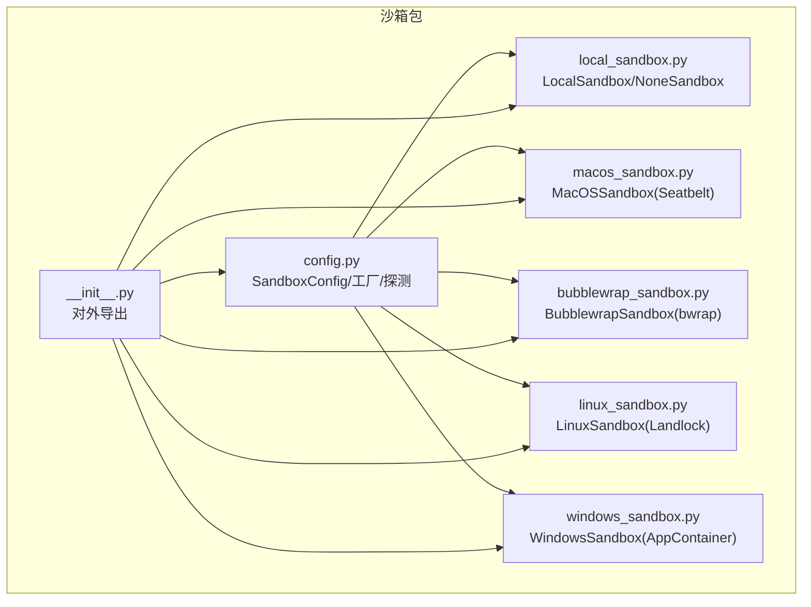
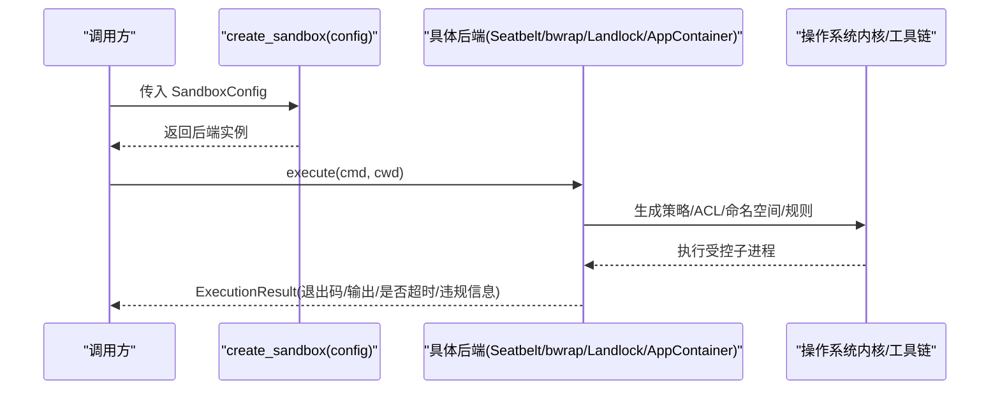
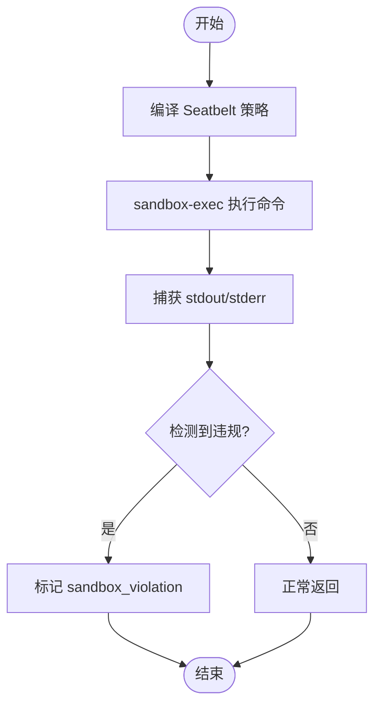
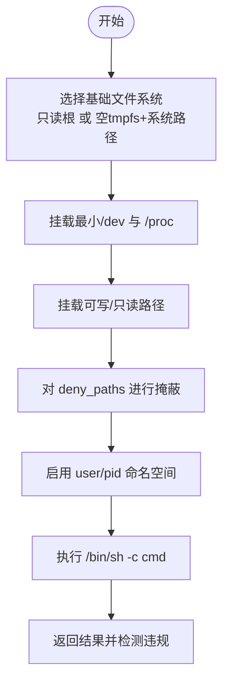
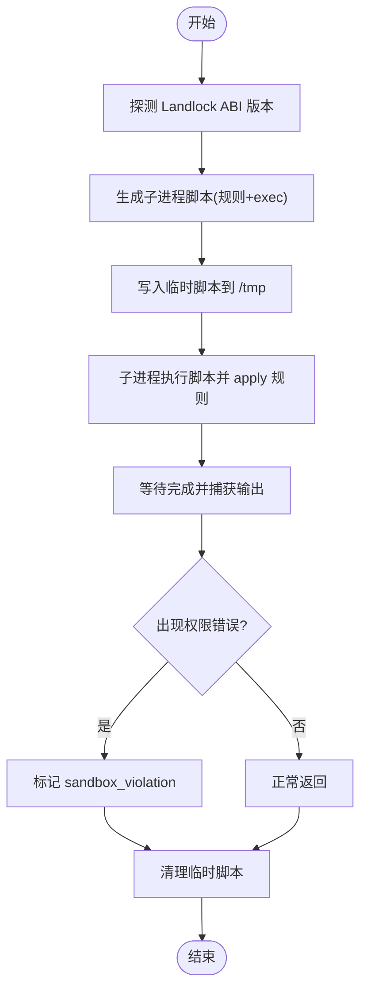
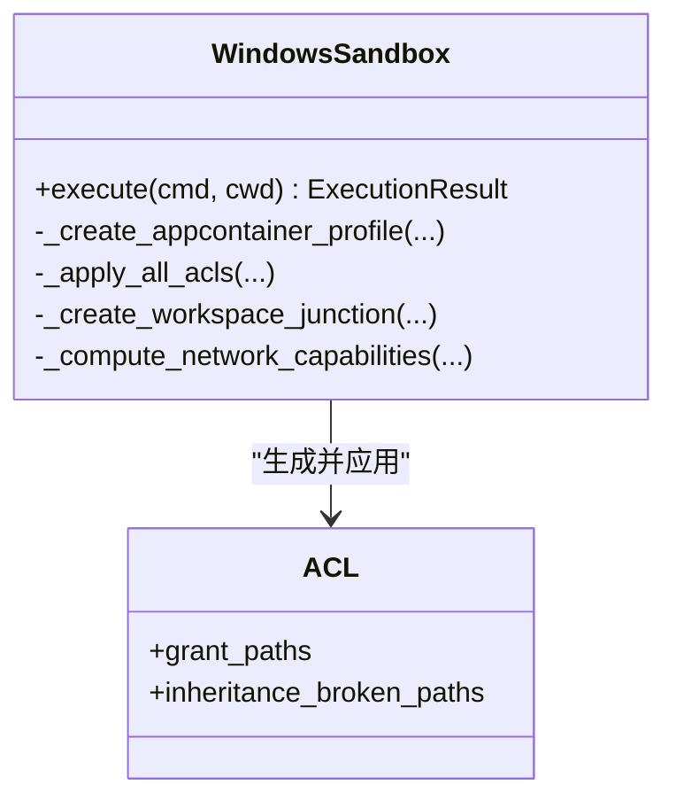
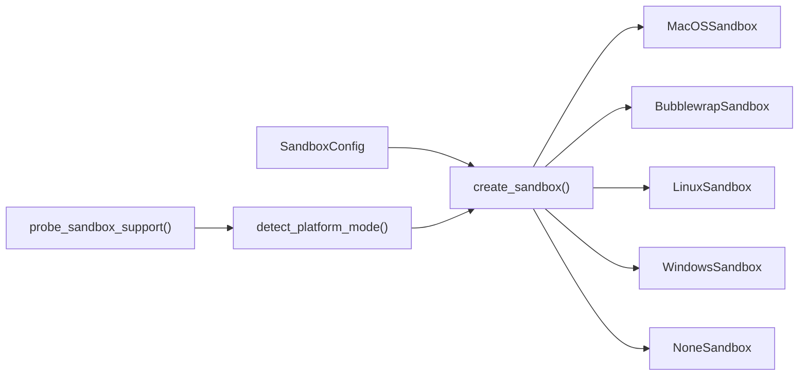

# 插件沙箱隔离

<cite>
**本文引用的文件**   
- [sandbox/__init__.py](file://src/qwenpaw/sandbox/__init__.py)
- [sandbox/config.py](file://src/qwenpaw/sandbox/config.py)
- [sandbox/local_sandbox.py](file://src/qwenpaw/sandbox/local_sandbox.py)
- [sandbox/macos_sandbox.py](file://src/qwenpaw/sandbox/macos_sandbox.py)
- [sandbox/bubblewrap_sandbox.py](file://src/qwenpaw/sandbox/bubblewrap_sandbox.py)
- [sandbox/linux_sandbox.py](file://src/qwenpaw/sandbox/linux_sandbox.py)
- [sandbox/windows_sandbox.py](file://src/qwenpaw/sandbox/windows_sandbox.py)
- [config/config.py](file://src/qwenpaw/config/config.py)
- [website/public/docs/security.en.md](file://website/public/docs/security.en.md)
</cite>

## 目录
1. [简介](#简介)
2. [项目结构](#项目结构)
3. [核心组件](#核心组件)
4. [架构总览](#架构总览)
5. [详细组件分析](#详细组件分析)
6. [依赖关系分析](#依赖关系分析)
7. [性能与资源限制](#性能与资源限制)
8. [故障排查指南](#故障排查指南)
9. [结论](#结论)
10. [附录：配置项速查](#附录配置项速查)

## 简介
本文件系统性阐述 QwenPaw 的“插件沙箱隔离”机制，覆盖以下目标：
- 解释插件运行环境的隔离策略：文件系统沙箱、网络访问控制、系统资源限制。
- 详细说明 sandbox 配置的作用域与权限边界：只读/可写挂载、受限网络、CPU/内存限制等。
- 记录不同平台下的实现差异：Linux（bubblewrap 优先、Landlock 回退）、macOS（Seatbelt）、Windows（AppContainer）。
- 提供最佳实践与性能调优建议，帮助在安全与可用性之间取得平衡。

## 项目结构
沙箱子系统位于 src/qwenpaw/sandbox 包内，采用“统一抽象 + 多后端实现”的分层设计：
- 抽象基类与无隔离模式：local_sandbox.py
- 平台后端：macos_sandbox.py、windows_sandbox.py、linux_sandbox.py、bubblewrap_sandbox.py
- 配置与工厂：config.py（定义 SandboxConfig、探测能力、创建实例）
- 对外导出入口：__init__.py

图表来源
- [sandbox/config.py:1-499](file://src/qwenpaw/sandbox/config.py#L1-L499)
- [sandbox/local_sandbox.py:1-134](file://src/qwenpaw/sandbox/local_sandbox.py#L1-L134)
- [sandbox/macos_sandbox.py:1-329](file://src/qwenpaw/sandbox/macos_sandbox.py#L1-L329)
- [sandbox/bubblewrap_sandbox.py:1-273](file://src/qwenpaw/sandbox/bubblewrap_sandbox.py#L1-L273)
- [sandbox/linux_sandbox.py:1-795](file://src/qwenpaw/sandbox/linux_sandbox.py#L1-L795)
- [sandbox/windows_sandbox.py:1-800](file://src/qwenpaw/sandbox/windows_sandbox.py#L1-L800)
- [sandbox/__init__.py:1-63](file://src/qwenpaw/sandbox/__init__.py#L1-L63)

章节来源
- [sandbox/__init__.py:1-63](file://src/qwenpaw/sandbox/__init__.py#L1-L63)
- [sandbox/config.py:1-499](file://src/qwenpaw/sandbox/config.py#L1-L499)

## 核心组件
- SandboxConfig：统一的约束描述，包括模式、工作区、挂载、读写策略、敏感路径拒绝、网络策略、资源限制、超时与环境变量注入等。
- LocalSandbox：抽象基类，定义 execute/cleanup 生命周期；NoneSandbox 为无隔离直通模式。
- 平台后端：
  - MacOSSandbox：基于 Seatbelt（sandbox-exec），生成 S-expression 策略并执行。
  - BubblewrapSandbox：基于 bwrap 构建 mount/user/pid 命名空间，提供强隔离的文件视图。
  - LinuxSandbox：基于 Landlock LSM（内核 5.13+），通过子进程应用规则后 exec 命令。
  - WindowsSandbox：基于 AppContainer + icacls ACL 管理，必要时使用 NTFS 硬链接以限定工作目录。
- 工厂与探测：create_sandbox 根据 SandboxMode 选择具体后端；probe_sandbox_support/detect_platform_mode 用于启动时能力探测与自动选择。

章节来源
- [sandbox/config.py:80-156](file://src/qwenpaw/sandbox/config.py#L80-L156)
- [sandbox/local_sandbox.py:32-64](file://src/qwenpaw/sandbox/local_sandbox.py#L32-L64)
- [sandbox/macos_sandbox.py:53-63](file://src/qwenpaw/sandbox/macos_sandbox.py#L53-L63)
- [sandbox/bubblewrap_sandbox.py:52-63](file://src/qwenpaw/sandbox/bubblewrap_sandbox.py#L52-L63)
- [sandbox/linux_sandbox.py:627-640](file://src/qwenpaw/sandbox/linux_sandbox.py#L627-L640)
- [sandbox/windows_sandbox.py:1-21](file://src/qwenpaw/sandbox/windows_sandbox.py#L1-L21)
- [sandbox/config.py:424-499](file://src/qwenpaw/sandbox/config.py#L424-L499)

## 架构总览
沙箱处于治理决策与实际执行之间，遵循“默认拒绝、白名单放行”的原则。启动时自动探测可用后端，运行时按 SandboxConfig 编译策略并执行命令，捕获输出并检测违规。

图表来源
- [sandbox/config.py:467-499](file://src/qwenpaw/sandbox/config.py#L467-L499)
- [sandbox/macos_sandbox.py:250-329](file://src/qwenpaw/sandbox/macos_sandbox.py#L250-L329)
- [sandbox/bubblewrap_sandbox.py:179-273](file://src/qwenpaw/sandbox/bubblewrap_sandbox.py#L179-L273)
- [sandbox/linux_sandbox.py:673-795](file://src/qwenpaw/sandbox/linux_sandbox.py#L673-L795)
- [sandbox/windows_sandbox.py:1-21](file://src/qwenpaw/sandbox/windows_sandbox.py#L1-L21)

## 详细组件分析

### 配置模型与作用域
- 模式 SandboxMode：seatbelt、bubblewrap、landlock、appcontainer、none。
- 工作区 workspace_dir：始终作为可写根目录。
- 挂载 mounts：MountSpec(path, writable, executable)，支持只读/可写与可执行控制。
- 读取策略 allow_read_all：true 表示“全局可读（黑名单模式）”，false 表示“仅允许声明的挂载（白名单模式）”。
- 拒绝路径 deny_paths：高优先级阻断，跨后端均生效。
- 网络 network_allow/network_ports：当前多为“尽力而为”，部分后端不支持域名级过滤或端口级过滤。
- 资源限制 max_processes/max_memory_mb：配置存在，但当前各后端未强制实施（日志告警忽略）。
- 执行控制 timeout_seconds/env_vars/env_mode：超时、环境变量注入与合并策略。
- 平台透传 platform_hints：管理员专用逃逸口，谨慎使用。

章节来源
- [sandbox/config.py:40-156](file://src/qwenpaw/sandbox/config.py#L40-L156)
- [website/public/docs/security.en.md:409-422](file://website/public/docs/security.en.md#L409-L422)

### macOS Seatbelt 后端
- 策略生成：将 SandboxConfig 编译为 Seatbelt .sb 策略字符串，包含系统路径只读、设备节点最小化、网络策略、写入白名单、禁止执行特定路径等。
- 执行流程：sandbox-exec -p '<profile>' /bin/bash -c '<cmd>'，捕获输出并检测违规。
- 限制说明：不支持 max_processes/max_memory_mb 与端口级网络过滤；域名级过滤为“尽力而为”。

图表来源
- [sandbox/macos_sandbox.py:89-248](file://src/qwenpaw/sandbox/macos_sandbox.py#L89-L248)
- [sandbox/macos_sandbox.py:250-329](file://src/qwenpaw/sandbox/macos_sandbox.py#L250-L329)

章节来源
- [sandbox/macos_sandbox.py:53-63](file://src/qwenpaw/sandbox/macos_sandbox.py#L53-L63)
- [sandbox/macos_sandbox.py:89-248](file://src/qwenpaw/sandbox/macos_sandbox.py#L89-L248)
- [sandbox/macos_sandbox.py:250-329](file://src/qwenpaw/sandbox/macos_sandbox.py#L250-L329)

### Linux bubblewrap 后端（首选）
- 命名空间与视图：通过 --ro-bind/--tmpfs/--dev/--proc 等构造最小化 /dev、PID 隔离、用户命名空间映射。
- 文件策略：allow_read_all=true 时整体只读挂载根；false 时从空 tmpfs 起步并显式挂载必要系统路径与只读挂载；deny_paths 通过 --tmpfs 隐藏或绑定 /dev/null 使文件为空。
- 执行流程：bwrap ... -- /bin/sh -c '<cmd>'，捕获输出并检测违规。
- 限制说明：当前不隔离网络（计划中）；单文件 deny 表现为空文件而非不存在。

图表来源
- [sandbox/bubblewrap_sandbox.py:79-177](file://src/qwenpaw/sandbox/bubblewrap_sandbox.py#L79-L177)
- [sandbox/bubblewrap_sandbox.py:179-273](file://src/qwenpaw/sandbox/bubblewrap_sandbox.py#L179-L273)

章节来源
- [sandbox/bubblewrap_sandbox.py:52-63](file://src/qwenpaw/sandbox/bubblewrap_sandbox.py#L52-L63)
- [sandbox/bubblewrap_sandbox.py:79-177](file://src/qwenpaw/sandbox/bubblewrap_sandbox.py#L79-L177)
- [sandbox/bubblewrap_sandbox.py:179-273](file://src/qwenpaw/sandbox/bubblewrap_sandbox.py#L179-L273)

### Linux Landlock 后端（回退）
- 内核能力：要求 5.13+，通过 LSM 列表与 ABI 版本探测；ABI v4 支持端口级网络控制。
- 规则生成：子进程脚本设置 PR_SET_NO_NEW_PRIVS → create_ruleset → add_path_rule/add_net_port_rule → restrict_self → exec。
- 文件策略：系统路径只读+可执行，/tmp 可写；allow_read_all=true 且存在 deny_paths 时采用“选择性枚举 HOME 子目录”的策略以避免授予根导致 deny_paths 失效。
- 网络策略：若未开启网络则处理所有网络但不添加任何规则（全部拒绝）；否则全开；域名级不可用，端口级需 ABI v4。

图表来源
- [sandbox/linux_sandbox.py:280-619](file://src/qwenpaw/sandbox/linux_sandbox.py#L280-L619)
- [sandbox/linux_sandbox.py:673-795](file://src/qwenpaw/sandbox/linux_sandbox.py#L673-L795)

章节来源
- [sandbox/linux_sandbox.py:627-640](file://src/qwenpaw/sandbox/linux_sandbox.py#L627-L640)
- [sandbox/linux_sandbox.py:280-619](file://src/qwenpaw/sandbox/linux_sandbox.py#L280-L619)
- [sandbox/linux_sandbox.py:673-795](file://src/qwenpaw/sandbox/linux_sandbox.py#L673-L795)

### Windows AppContainer 后端
- 能力探测：Windows 10+、icacls.exe 可用、CreateAppContainerProfile API 存在。
- 配置文件：通过 userenv.dll 创建/复用 AppContainer 配置，计算网络能力（二进制开关）。
- ACL 管理：分阶段并行/串行设置 ACL，确保继承断开与精确授权；必要时创建 NTFS 硬链接以限定工作目录遍历。
- 执行流程：以 AppContainer 令牌启动 cmd.exe /c <command>，解码 OEM/ANSI/UTF-16LE 输出并检测违规。

图表来源
- [sandbox/windows_sandbox.py:122-268](file://src/qwenpaw/sandbox/windows_sandbox.py#L122-L268)
- [sandbox/windows_sandbox.py:401-517](file://src/qwenpaw/sandbox/windows_sandbox.py#L401-L517)
- [sandbox/windows_sandbox.py:525-581](file://src/qwenpaw/sandbox/windows_sandbox.py#L525-L581)
- [sandbox/windows_sandbox.py:589-619](file://src/qwenpaw/sandbox/windows_sandbox.py#L589-L619)

章节来源
- [sandbox/windows_sandbox.py:1-21](file://src/qwenpaw/sandbox/windows_sandbox.py#L1-L21)
- [sandbox/windows_sandbox.py:122-268](file://src/qwenpaw/sandbox/windows_sandbox.py#L122-L268)
- [sandbox/windows_sandbox.py:401-517](file://src/qwenpaw/sandbox/windows_sandbox.py#L401-L517)
- [sandbox/windows_sandbox.py:525-581](file://src/qwenpaw/sandbox/windows_sandbox.py#L525-L581)
- [sandbox/windows_sandbox.py:589-619](file://src/qwenpaw/sandbox/windows_sandbox.py#L589-L619)

### 无隔离模式（NoneSandbox）
- 用途：可信场景或资源工具直通执行。
- 行为：直接以 asyncio.subprocess 执行 shell 命令，继承环境并按 env_vars 覆盖，支持超时与异常处理。

章节来源
- [sandbox/local_sandbox.py:71-134](file://src/qwenpaw/sandbox/local_sandbox.py#L71-L134)

## 依赖关系分析
- 工厂与后端映射：create_sandbox 依据 SandboxMode 动态导入并返回对应后端实例。
- 能力探测：probe_sandbox_support 按平台顺序探测 seatbelt/bwrap/landlock/appcontainer，返回 SandboxCapability。
- 配置开关：全局 sandbox_enabled 控制治理层是否对无匹配规则的 Shell 工具走 SANDBOX_FALLBACK。

图表来源
- [sandbox/config.py:424-499](file://src/qwenpaw/sandbox/config.py#L424-L499)
- [sandbox/__init__.py:28-62](file://src/qwenpaw/sandbox/__init__.py#L28-L62)

章节来源
- [sandbox/config.py:424-499](file://src/qwenpaw/sandbox/config.py#L424-L499)
- [sandbox/__init__.py:28-62](file://src/qwenpaw/sandbox/__init__.py#L28-L62)
- [config/config.py:2078-2088](file://src/qwenpaw/config/config.py#L2078-L2088)

## 性能与资源限制
- 当前状态：max_processes 与 max_memory_mb 字段存在于 SandboxConfig，但各后端均未强制实施（会记录警告日志）。
- 影响面：在高并发或长耗时任务下，可能出现进程数膨胀或内存增长；建议在业务侧配合外部限流与监控。
- 优化建议：
  - 合理设置 timeout_seconds，避免长时间阻塞。
  - 减少不必要的只读挂载范围，降低 bwrap 初始化开销。
  - 在 Linux 上优先使用 bubblewrap（命名空间隔离更彻底），Landlock 作为回退。
  - macOS 下避免过多 Seatbelt 规则条目，保持策略简洁。
  - Windows 下尽量避免频繁重建 AppContainer 配置，利用缓存的 SID 与 ACL 提升性能。

[本节为通用指导，无需源码引用]

## 故障排查指南
- macOS：sandbox-exec 报告语法错误或权限问题
  - 检查 sandbox-exec 是否在 PATH，确认策略编译无误。
  - 关注 stderr 中的 “deny(...)”、“Operation not permitted” 等关键词。
- Linux：bwrap 不可用或命名空间失败
  - 安装 bubblewrap 并确保用户/进程命名空间可用；查看 bwrap 探针失败原因。
  - deny_paths 文件被映射为 /dev/null 属预期行为。
- Linux：Landlock 不可用或 ABI 过低
  - 确认内核版本≥5.13 且 LSM 包含 landlock；ABI v4 才支持端口级网络控制。
- Windows：icacls 权限不足或系统目录无法修改
  - 某些系统目录受 WRP 保护属预期；Windows 10+ 已默认授予 AppContainer 读取执行权限。
  - 需要写入 Program Files 等位置时，建议使用可写挂载指向用户目录。
- 验证沙箱是否生效
  - 在治理日志中查找 “action=sandbox_fallback sandbox=bubblewrap/...”，确认实际使用的后端。

章节来源
- [website/public/docs/security.en.md:449-507](file://website/public/docs/security.en.md#L449-L507)
- [sandbox/bubblewrap_sandbox.py:179-273](file://src/qwenpaw/sandbox/bubblewrap_sandbox.py#L179-L273)
- [sandbox/linux_sandbox.py:673-795](file://src/qwenpaw/sandbox/linux_sandbox.py#L673-L795)
- [sandbox/macos_sandbox.py:250-329](file://src/qwenpaw/sandbox/macos_sandbox.py#L250-L329)
- [sandbox/windows_sandbox.py:401-517](file://src/qwenpaw/sandbox/windows_sandbox.py#L401-L517)

## 结论
QwenPaw 的沙箱子系统通过统一配置与多后端实现，在不同平台上提供了从“弱隔离（None）”到“强隔离（bwrap/Seatbelt/AppContainer/Landlock）”的弹性选择。当前版本在文件系统隔离方面较为完善，网络与资源限制仍在演进中。建议在生产环境中优先启用 bubblewrap（Linux）或 Seatbelt（macOS），并结合 deny_paths 与最小挂载原则，以获得更强的安全性与可控性。

[本节为总结性内容，无需源码引用]

## 附录：配置项速查
- mode：自动探测或手动指定（seatbelt/bubblewrap/landlock/appcontainer/none）
- workspace_dir：主工作目录（总是可写）
- mounts：路径挂载清单（writable/executable）
- allow_read_all：全局可读（黑名单模式）或仅允许声明路径（白名单模式）
- deny_paths：敏感路径拒绝（最高优先级）
- network_allow：域名白名单（当前多为“尽力而为”）
- network_ports：端口级控制（Linux Landlock ABI v4）
- max_processes/max_memory_mb：配置项存在，当前未强制实施
- timeout_seconds：执行超时
- env_vars/env_mode：环境变量注入与合并策略
- platform_hints：管理员透传参数（谨慎使用）

章节来源
- [sandbox/config.py:80-156](file://src/qwenpaw/sandbox/config.py#L80-L156)
- [website/public/docs/security.en.md:409-422](file://website/public/docs/security.en.md#L409-L422)