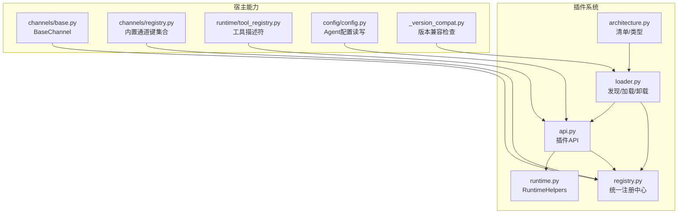
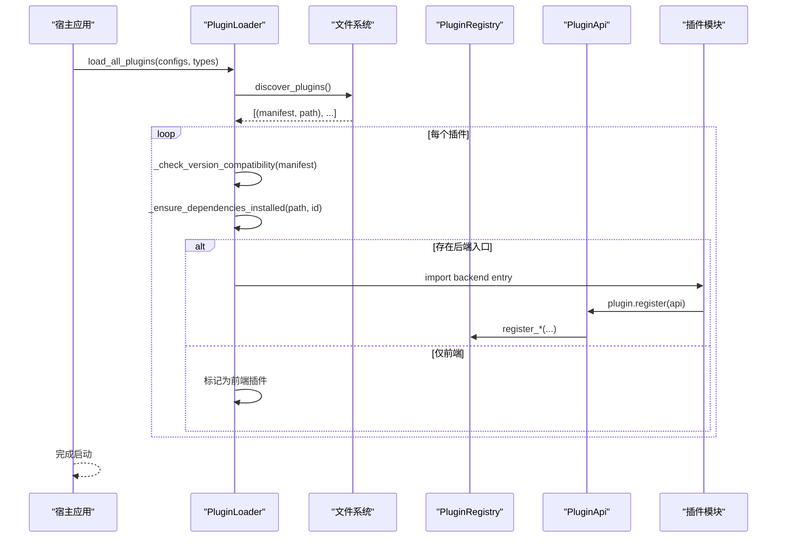
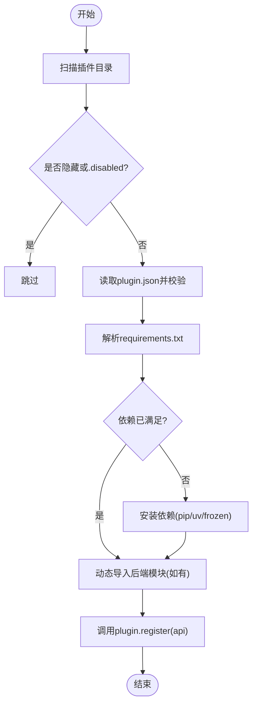
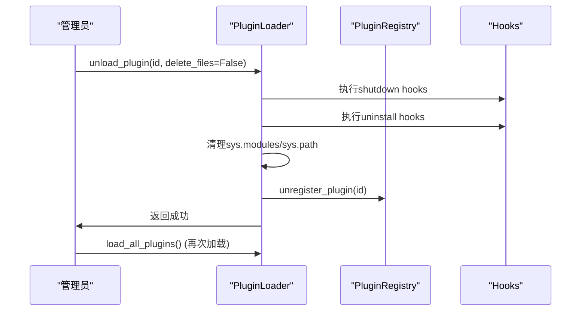
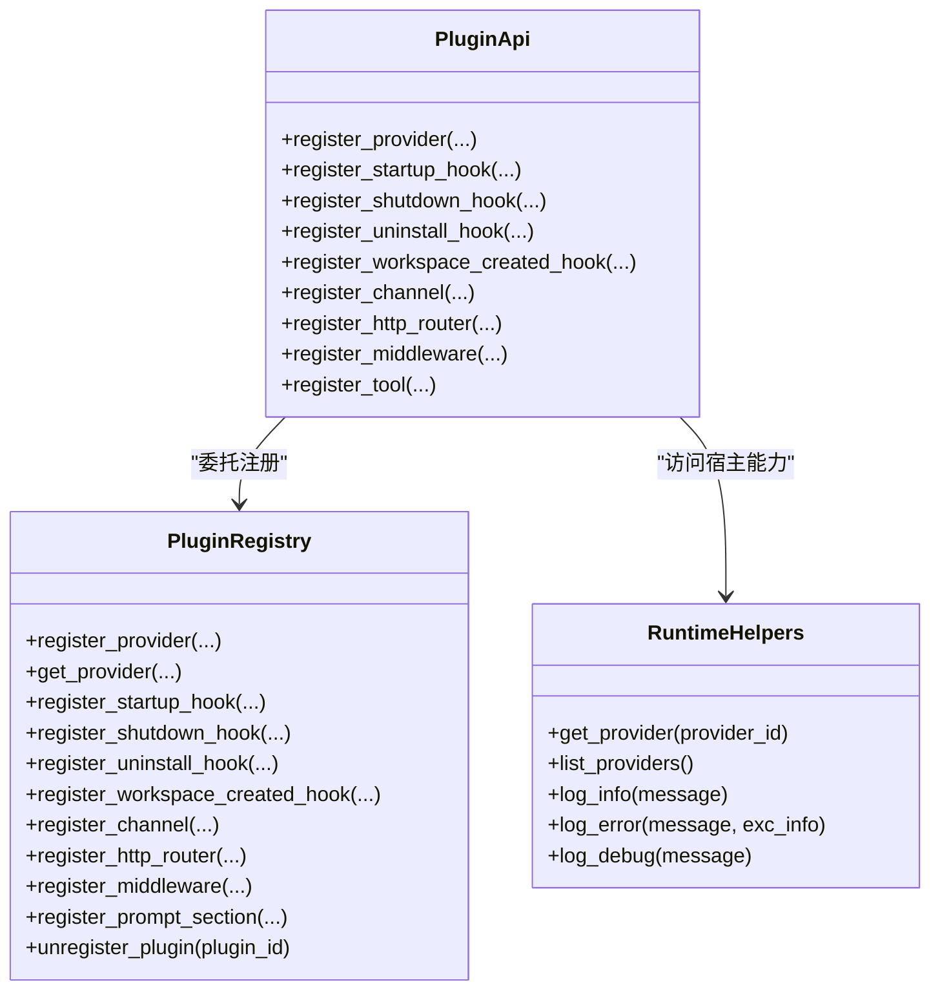
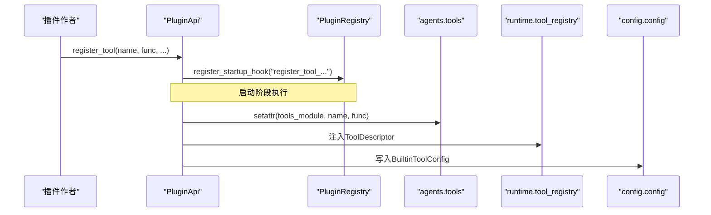
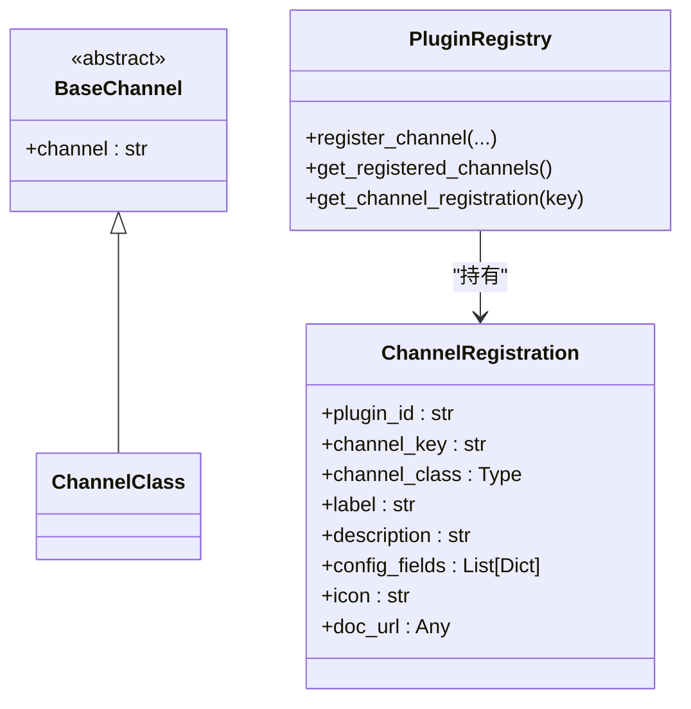
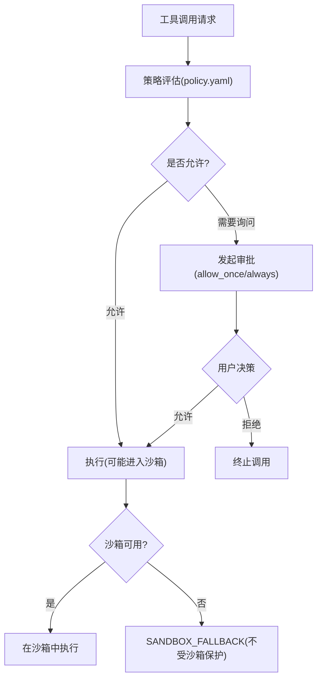
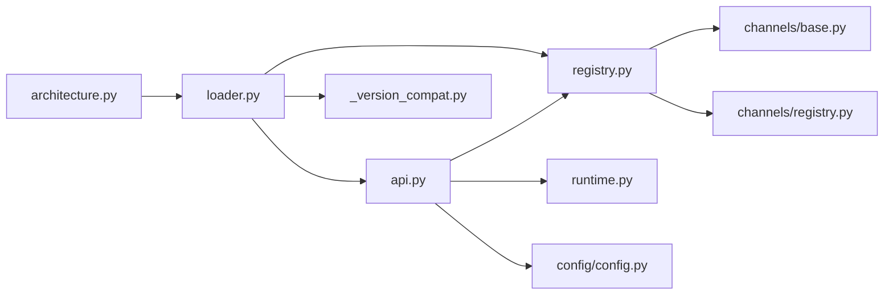

# 插件架构设计

<cite>
**本文引用的文件列表**   
- [src/qwenpaw/plugins/__init__.py](file://src/qwenpaw/plugins/__init__.py)
- [src/qwenpaw/plugins/architecture.py](file://src/qwenpaw/plugins/architecture.py)
- [src/qwenpaw/plugins/registry.py](file://src/qwenpaw/plugins/registry.py)
- [src/qwenpaw/plugins/loader.py](file://src/qwenpaw/plugins/loader.py)
- [src/qwenpaw/plugins/api.py](file://src/qwenpaw/plugins/api.py)
- [src/qwenpaw/plugins/runtime.py](file://src/qwenpaw/plugins/runtime.py)
- [src/qwenpaw/app/channels/base.py](file://src/qwenpaw/app/channels/base.py)
- [src/qwenpaw/app/channels/registry.py](file://src/qwenpaw/app/channels/registry.py)
- [src/qwenpaw/runtime/tool_registry.py](file://src/qwenpaw/runtime/tool_registry.py)
- [src/qwenpaw/config/config.py](file://src/qwenpaw/config/config.py)
- [src/qwenpaw/_version_compat.py](file://src/qwenpaw/_version_compat.py)
- [src/qwenpaw/governance/resource_governor.py](file://src/qwenpaw/governance/resource_governor.py)
- [src/qwenpaw/sandbox/local_sandbox.py](file://src/qwenpaw/sandbox/local_sandbox.py)
- [src/qwenpaw/security/tool_guard/approval.py](file://src/qwenpaw/security/tool_guard/approval.py)
- [src/qwenpaw/drivers/constants.py](file://src/qwenpaw/drivers/constants.py)
</cite>

## 目录
1. [引言](#引言)
2. [项目结构](#项目结构)
3. [核心组件](#核心组件)
4. [架构总览](#架构总览)
5. [详细组件分析](#详细组件分析)
6. [依赖关系分析](#依赖关系分析)
7. [性能与可扩展性](#性能与可扩展性)
8. [故障排查指南](#故障排查指南)
9. [结论](#结论)
10. [附录：插件类型与扩展点规范](#附录插件类型与扩展点规范)

## 引言
本文件面向 QwenPaw 的插件系统，系统性阐述其设计理念、注册机制、生命周期管理、沙箱与安全模型，并给出 Channel、Provider、Tool、Middleware 四类插件的接口规范与最佳实践。文档同时覆盖插件发现、依赖解析、动态加载、热重载（卸载后重新加载）以及版本兼容性管理，帮助开发者构建安全、可维护且高性能的插件生态。

## 项目结构
QwenPaw 插件系统位于 src/qwenpaw/plugins 下，围绕“清单定义 + 加载器 + 注册表 + 运行时 API”四层组织：
- 清单与类型：architecture.py 定义 PluginManifest、PluginRecord、PluginType 等元数据与类型枚举
- 加载器：loader.py 负责扫描、校验、安装依赖、动态导入、卸载清理
- 注册表：registry.py 集中管理 Provider、Hook、Channel、HTTP Router、Prompt Section、Middleware 等注册项
- 运行时 API：api.py 提供 register_tool/register_channel/register_provider/register_middleware 等开发期 API
- 运行时辅助：runtime.py 暴露 RuntimeHelpers（如 provider_manager 访问）

图表来源
- [src/qwenpaw/plugins/architecture.py:1-221](file://src/qwenpaw/plugins/architecture.py#L1-L221)
- [src/qwenpaw/plugins/loader.py:120-640](file://src/qwenpaw/plugins/loader.py#L120-L640)
- [src/qwenpaw/plugins/registry.py:129-300](file://src/qwenpaw/plugins/registry.py#L129-L300)
- [src/qwenpaw/plugins/api.py:172-700](file://src/qwenpaw/plugins/api.py#L172-L700)
- [src/qwenpaw/plugins/runtime.py:10-68](file://src/qwenpaw/plugins/runtime.py#L10-L68)
- [src/qwenpaw/app/channels/base.py](file://src/qwenpaw/app/channels/base.py)
- [src/qwenpaw/app/channels/registry.py](file://src/qwenpaw/app/channels/registry.py)
- [src/qwenpaw/runtime/tool_registry.py](file://src/qwenpaw/runtime/tool_registry.py)
- [src/qwenpaw/config/config.py](file://src/qwenpaw/config/config.py)
- [src/qwenpaw/_version_compat.py](file://src/qwenpaw/_version_compat.py)

章节来源
- [src/qwenpaw/plugins/__init__.py:1-17](file://src/qwenpaw/plugins/__init__.py#L1-L17)
- [src/qwenpaw/plugins/architecture.py:1-221](file://src/qwenpaw/plugins/architecture.py#L1-L221)
- [src/qwenpaw/plugins/loader.py:120-640](file://src/qwenpaw/plugins/loader.py#L120-L640)
- [src/qwenpaw/plugins/registry.py:129-300](file://src/qwenpaw/plugins/registry.py#L129-L300)
- [src/qwenpaw/plugins/api.py:172-700](file://src/qwenpaw/plugins/api.py#L172-L700)
- [src/qwenpaw/plugins/runtime.py:10-68](file://src/qwenpaw/plugins/runtime.py#L10-L68)

## 核心组件
- 清单与类型
  - PluginManifest：描述插件 id、version、entry、dependencies、qwenpaw_version 约束、meta 等；支持本地化字段与旧版兼容推断
  - PluginRecord：运行期记录，包含 manifest、source_path、enabled、instance、diagnostics
  - PluginType：tool/provider/hook/command/channel/frontend/general
- 加载器 PluginLoader
  - discover_plugins：遍历 plugin_dirs，读取 plugin.json，过滤隐藏或 .disabled 目录
  - load_all_plugins/load_plugin：按类型过滤、版本兼容检查、依赖安装、动态导入、注册
  - unload_plugin：执行 shutdown/uninstall hooks，清理 sys.modules/sys.path/registry/tools
- 注册表 PluginRegistry
  - 单例，集中管理 providers、hooks、channels、http routers、prompt sections、middleware、manifests
  - 提供注册/查询/批量移除接口，保证唯一性与顺序（优先级）
- 插件 API PluginApi
  - 面向插件作者的注册入口：register_tool/register_channel/register_provider/register_middleware/register_http_router 等
  - 通过启动钩子延迟注入，确保宿主上下文就绪
- 运行时辅助 RuntimeHelpers
  - 提供 provider_manager 访问、日志打印等能力

章节来源
- [src/qwenpaw/plugins/architecture.py:12-221](file://src/qwenpaw/plugins/architecture.py#L12-L221)
- [src/qwenpaw/plugins/loader.py:120-640](file://src/qwenpaw/plugins/loader.py#L120-L640)
- [src/qwenpaw/plugins/registry.py:129-300](file://src/qwenpaw/plugins/registry.py#L129-L300)
- [src/qwenpaw/plugins/api.py:172-700](file://src/qwenpaw/plugins/api.py#L172-L700)
- [src/qwenpaw/plugins/runtime.py:10-68](file://src/qwenpaw/plugins/runtime.py#L10-L68)

## 架构总览
插件系统采用“声明式清单 + 动态加载 + 集中注册 + 延迟注入”的架构模式：
- 声明式清单：plugin.json 由 Manifest 校验，向后兼容旧格式
- 动态加载：importlib.util.spec_from_file_location 动态导入模块，隔离命名空间
- 集中注册：所有能力在 PluginRegistry 中登记，避免散乱全局状态
- 延迟注入：工具、命令、模式等通过启动钩子在宿主初始化完成后注册

图表来源
- [src/qwenpaw/plugins/loader.py:609-640](file://src/qwenpaw/plugins/loader.py#L609-L640)
- [src/qwenpaw/plugins/loader.py:514-608](file://src/qwenpaw/plugins/loader.py#L514-L608)
- [src/qwenpaw/plugins/api.py:172-700](file://src/qwenpaw/plugins/api.py#L172-L700)
- [src/qwenpaw/plugins/registry.py:129-300](file://src/qwenpaw/plugins/registry.py#L129-L300)

## 详细组件分析

### 插件清单与类型体系
- 清单字段
  - id/version/name/description/author：基础信息
  - entry.backend/entry.frontend：前后端入口路径
  - dependencies：插件间依赖（字符串数组）
  - qwenpaw_version.min/max：宿主版本兼容范围（左闭右开），兼容旧 min_version/max_version
  - meta：插件自定义元数据（例如工具名、渠道信息等）
  - type：显式指定类型，缺失时根据 meta/entry 推断
- 类型枚举
  - tool：注册一个或多个工具函数
  - provider：注册自定义 LLM Provider
  - hook：应用启动/关闭钩子
  - command：注册 /slash 控制命令
  - channel：注册消息通道
  - frontend：打包前端 JS 资源
  - general：兜底类型

章节来源
- [src/qwenpaw/plugins/architecture.py:12-221](file://src/qwenpaw/plugins/architecture.py#L12-L221)

### 插件发现与依赖解析
- 发现规则
  - 遍历 plugin_dirs，忽略隐藏目录和以 .disabled 结尾的目录
  - 要求存在 plugin.json，否则跳过
- 依赖解析与安装
  - 读取 requirements.txt，使用 metadata + import 双探针判断是否满足
  - 优先 pip，若不可用则回退 uv；桌面冻结环境使用独立 Python 安装到用户可写 site-dir
  - 并发保护：基于 per-plugin 的文件锁防止重复安装风暴
- 版本兼容
  - 调用 _version_compat.check_plugin_version_compat，不兼容则记录诊断并禁用

图表来源
- [src/qwenpaw/plugins/loader.py:132-173](file://src/qwenpaw/plugins/loader.py#L132-L173)
- [src/qwenpaw/plugins/loader.py:248-335](file://src/qwenpaw/plugins/loader.py#L248-L335)
- [src/qwenpaw/plugins/loader.py:721-893](file://src/qwenpaw/plugins/loader.py#L721-L893)
- [src/qwenpaw/plugins/loader.py:192-207](file://src/qwenpaw/plugins/loader.py#L192-L207)

章节来源
- [src/qwenpaw/plugins/loader.py:132-173](file://src/qwenpaw/plugins/loader.py#L132-L173)
- [src/qwenpaw/plugins/loader.py:248-335](file://src/qwenpaw/plugins/loader.py#L248-L335)
- [src/qwenpaw/plugins/loader.py:721-893](file://src/qwenpaw/plugins/loader.py#L721-L893)
- [src/qwenpaw/plugins/loader.py:192-207](file://src/qwenpaw/plugins/loader.py#L192-L207)

### 生命周期管理与热重载
- 生命周期钩子
  - startup/shutdown/uninstall/workspace_created：均支持优先级排序
  - 卸载流程：先执行 shutdown hooks，再执行 uninstall hooks，随后清理 sys.modules/sys.path/registry/tools
- 热重载
  - 通过 unload_plugin 实现“卸载—清理—再加载”的热更新路径
  - 失败加载自动回滚：清理 registry、sys.modules、sys.path，避免污染后续加载

图表来源
- [src/qwenpaw/plugins/loader.py:975-1096](file://src/qwenpaw/plugins/loader.py#L975-L1096)
- [src/qwenpaw/plugins/registry.py:934-992](file://src/qwenpaw/plugins/registry.py#L934-L992)

章节来源
- [src/qwenpaw/plugins/loader.py:975-1096](file://src/qwenpaw/plugins/loader.py#L975-L1096)
- [src/qwenpaw/plugins/registry.py:934-992](file://src/qwenpaw/plugins/registry.py#L934-L992)

### 插件注册表工作原理
- 单例注册表
  - 统一管理 providers、hooks、channels、http routers、prompt sections、middleware、manifests
  - 提供 get/set 与批量移除接口，保证唯一性与顺序
- HTTP 路由挂载
  - 将插件 APIRouter 插入到控制台 SPA catch-all 之前，确保 /api/* 正确匹配
  - 支持 OpenAPI tags 自动生成
- 工具配置持久化
  - 通过 config/config.py 读写 Agent 配置中的 tools.builtin_tools，支持运行时获取/设置

图表来源
- [src/qwenpaw/plugins/registry.py:129-300](file://src/qwenpaw/plugins/registry.py#L129-L300)
- [src/qwenpaw/plugins/api.py:172-700](file://src/qwenpaw/plugins/api.py#L172-L700)
- [src/qwenpaw/plugins/runtime.py:10-68](file://src/qwenpaw/plugins/runtime.py#L10-L68)

章节来源
- [src/qwenpaw/plugins/registry.py:129-300](file://src/qwenpaw/plugins/registry.py#L129-L300)
- [src/qwenpaw/plugins/api.py:172-700](file://src/qwenpaw/plugins/api.py#L172-L700)
- [src/qwenpaw/plugins/runtime.py:10-68](file://src/qwenpaw/plugins/runtime.py#L10-L68)

### 插件类型与扩展点规范

#### Tool 插件
- 注册方式
  - 使用 api.register_tool(tool_name, tool_func, description, icon, enabled)
  - 内部通过启动钩子将工具注入 qwenpaw.agents.tools 模块与运行时 ToolRegistry
  - 自动写入 Agent 配置 tools.builtin_tools，便于 UI 展示与开关
- 运行时访问配置
  - 工具函数内可通过 get_tool_config(tool_name) 获取当前 Agent 的配置

图表来源
- [src/qwenpaw/plugins/api.py:614-698](file://src/qwenpaw/plugins/api.py#L614-L698)
- [src/qwenpaw/plugins/api.py:54-166](file://src/qwenpaw/plugins/api.py#L54-L166)
- [src/qwenpaw/runtime/tool_registry.py](file://src/qwenpaw/runtime/tool_registry.py)
- [src/qwenpaw/config/config.py](file://src/qwenpaw/config/config.py)

章节来源
- [src/qwenpaw/plugins/api.py:614-698](file://src/qwenpaw/plugins/api.py#L614-L698)
- [src/qwenpaw/plugins/api.py:54-166](file://src/qwenpaw/plugins/api.py#L54-L166)
- [src/qwenpaw/runtime/tool_registry.py](file://src/qwenpaw/runtime/tool_registry.py)
- [src/qwenpaw/config/config.py](file://src/qwenpaw/config/config.py)

#### Provider 插件
- 注册方式
  - api.register_provider(provider_id, provider_class, label, base_url, **metadata)
  - 注册到注册表，供 RuntimeHelpers.get_provider 与宿主 ProviderManager 使用
- 元数据合并
  - 将插件 manifest.meta 合并进 provider metadata，便于 UI 展示与策略判定

章节来源
- [src/qwenpaw/plugins/api.py:205-250](file://src/qwenpaw/plugins/api.py#L205-L250)
- [src/qwenpaw/plugins/registry.py:328-386](file://src/qwenpaw/plugins/registry.py#L328-L386)
- [src/qwenpaw/plugins/runtime.py:21-42](file://src/qwenpaw/plugins/runtime.py#L21-L42)

#### Channel 插件
- 注册方式
  - api.register_channel(channel_class, label, description, config_fields, icon, doc_url)
  - channel_class 必须继承 BaseChannel 并提供 channel 类属性作为唯一键
  - 注册表校验 config_fields 结构，禁止覆盖内置通道键
- 前端表单
  - config_fields 用于生成前端配置表单（text/password/number/switch/select）

图表来源
- [src/qwenpaw/plugins/registry.py:749-854](file://src/qwenpaw/plugins/registry.py#L749-L854)
- [src/qwenpaw/app/channels/base.py](file://src/qwenpaw/app/channels/base.py)
- [src/qwenpaw/app/channels/registry.py](file://src/qwenpaw/app/channels/registry.py)

章节来源
- [src/qwenpaw/plugins/registry.py:749-854](file://src/qwenpaw/plugins/registry.py#L749-L854)
- [src/qwenpaw/app/channels/base.py](file://src/qwenpaw/app/channels/base.py)
- [src/qwenpaw/app/channels/registry.py](file://src/qwenpaw/app/channels/registry.py)

#### Middleware 插件
- 注册方式
  - api.register_middleware(middleware_factory, priority=100)
  - 工厂签名 factory(ctx, agent_config) -> MiddlewareBase | None
  - 注册表按优先级排序，形成洋葱模型调用链

章节来源
- [src/qwenpaw/plugins/api.py:448-481](file://src/qwenpaw/plugins/api.py#L448-L481)
- [src/qwenpaw/plugins/registry.py:171-207](file://src/qwenpaw/plugins/registry.py#L171-L207)

### 插件间通信与数据共享
- 通过宿主服务与注册表
  - 插件通过 PluginApi 访问注册表与 RuntimeHelpers，间接使用宿主提供的 ProviderManager、WorkspaceManager 等
- 工具配置共享
  - 通过 config/config.py 读写 Agent 配置中的 tools.builtin_tools，实现跨插件的工具配置共享
- HTTP 路由
  - 插件可将 FastAPI APIRouter 挂载到 /api/<prefix>，与其他插件或服务进行 REST 通信

章节来源
- [src/qwenpaw/plugins/api.py:394-423](file://src/qwenpaw/plugins/api.py#L394-L423)
- [src/qwenpaw/plugins/registry.py:220-296](file://src/qwenpaw/plugins/registry.py#L220-L296)
- [src/qwenpaw/config/config.py](file://src/qwenpaw/config/config.py)

### 安全模型与沙箱隔离
- 权限与策略
  - 驱动常量定义 allow/ask/deny 效果，结合策略评估对工具调用进行管控
- 沙箱能力
  - ResourceGovernor 在可用时启用沙箱（如 bubblewrap），不可用时降级为 SANDBOX_FALLBACK（允许但不受沙箱保护）
- 审批桥接
  - 针对敏感操作（如 shell 执行）触发审批流程，支持一次性/永久放行
- 恶意代码检测
  - 通过治理策略与默认规则集限制危险行为（如 WebSearch/WebFetch 的白名单迁移）

图表来源
- [src/qwenpaw/drivers/constants.py:16-25](file://src/qwenpaw/drivers/constants.py#L16-L25)
- [src/qwenpaw/governance/resource_governor.py](file://src/qwenpaw/governance/resource_governor.py)
- [src/qwenpaw/sandbox/local_sandbox.py](file://src/qwenpaw/sandbox/local_sandbox.py)
- [src/qwenpaw/security/tool_guard/approval.py](file://src/qwenpaw/security/tool_guard/approval.py)

章节来源
- [src/qwenpaw/drivers/constants.py:16-25](file://src/qwenpaw/drivers/constants.py#L16-L25)
- [src/qwenpaw/governance/resource_governor.py](file://src/qwenpaw/governance/resource_governor.py)
- [src/qwenpaw/sandbox/local_sandbox.py](file://src/qwenpaw/sandbox/local_sandbox.py)
- [src/qwenpaw/security/tool_guard/approval.py](file://src/qwenpaw/security/tool_guard/approval.py)

## 依赖关系分析
- 组件耦合
  - loader 强依赖 architecture（清单）、registry（注册）、api（插件API）、_version_compat（版本兼容）
  - api 依赖 registry 与 runtime helpers，并通过 config/config 持久化工具配置
  - registry 依赖 channels/base 与 channels/registry（内置键集合）进行校验
- 外部依赖
  - FastAPI APIRouter 用于 HTTP 路由挂载
  - importlib.metadata/packaging.requirements 用于依赖探测与版本解析
  - subprocess 用于 pip/uv 安装

图表来源
- [src/qwenpaw/plugins/loader.py:120-640](file://src/qwenpaw/plugins/loader.py#L120-L640)
- [src/qwenpaw/plugins/api.py:172-700](file://src/qwenpaw/plugins/api.py#L172-L700)
- [src/qwenpaw/plugins/registry.py:129-300](file://src/qwenpaw/plugins/registry.py#L129-L300)
- [src/qwenpaw/plugins/architecture.py:1-221](file://src/qwenpaw/plugins/architecture.py#L1-221)
- [src/qwenpaw/plugins/runtime.py:10-68](file://src/qwenpaw/plugins/runtime.py#L10-L68)
- [src/qwenpaw/config/config.py](file://src/qwenpaw/config/config.py)
- [src/qwenpaw/app/channels/base.py](file://src/qwenpaw/app/channels/base.py)
- [src/qwenpaw/app/channels/registry.py](file://src/qwenpaw/app/channels/registry.py)
- [src/qwenpaw/_version_compat.py](file://src/qwenpaw/_version_compat.py)

章节来源
- [src/qwenpaw/plugins/loader.py:120-640](file://src/qwenpaw/plugins/loader.py#L120-L640)
- [src/qwenpaw/plugins/api.py:172-700](file://src/qwenpaw/plugins/api.py#L172-L700)
- [src/qwenpaw/plugins/registry.py:129-300](file://src/qwenpaw/plugins/registry.py#L129-L300)

## 性能与可扩展性
- 依赖安装优化
  - 双探针（metadata + import）避免误报缺失，减少不必要的安装
  - 并发安装串行化（per-plugin 锁）避免内存耗尽
- 动态导入与清理
  - 失败加载自动回滚，避免污染后续加载
  - 卸载时清理 sys.modules/sys.path，支持热重载
- 路由挂载优化
  - 将插件路由插入到 SPA catch-all 之前，避免额外匹配开销
- 建议
  - 插件尽量声明最小依赖集，按需引入
  - 工具函数避免阻塞主事件循环，必要时异步化
  - 合理设置 middleware 优先级，减少不必要包装

章节来源
- [src/qwenpaw/plugins/loader.py:208-247](file://src/qwenpaw/plugins/loader.py#L208-L247)
- [src/qwenpaw/plugins/loader.py:306-335](file://src/qwenpaw/plugins/loader.py#L306-L335)
- [src/qwenpaw/plugins/loader.py:460-513](file://src/qwenpaw/plugins/loader.py#L460-L513)
- [src/qwenpaw/plugins/registry.py:29-52](file://src/qwenpaw/plugins/registry.py#L29-L52)

## 故障排查指南
- 插件未加载
  - 检查 plugin.json 是否存在且有效；确认未被 .disabled 或隐藏
  - 查看诊断信息 diagnostics 字段
- 依赖安装失败
  - 确认网络与镜像源；检查 pip/uv 可用性；查看超时与错误输出
- 工具未出现在 UI
  - 确认 register_tool 已执行；检查 Agent 配置中 tools.builtin_tools 是否创建
- 路由冲突
  - 检查 prefix 是否重复；确认注册前 FastAPI app 已配置
- 卸载后残留
  - 确认 unload_plugin 执行了 cleanup；必要时重启进程彻底释放

章节来源
- [src/qwenpaw/plugins/loader.py:132-173](file://src/qwenpaw/plugins/loader.py#L132-L173)
- [src/qwenpaw/plugins/loader.py:721-893](file://src/qwenpaw/plugins/loader.py#L721-L893)
- [src/qwenpaw/plugins/api.py:614-698](file://src/qwenpaw/plugins/api.py#L614-L698)
- [src/qwenpaw/plugins/registry.py:220-296](file://src/qwenpaw/plugins/registry.py#L220-L296)
- [src/qwenpaw/plugins/loader.py:975-1096](file://src/qwenpaw/plugins/loader.py#L975-L1096)

## 结论
QwenPaw 插件系统通过清晰的清单定义、严格的依赖解析、完善的生命周期管理与集中注册机制，实现了高内聚、低耦合的可插拔架构。配合沙箱与策略引擎，系统在扩展性的同时兼顾安全性与稳定性。遵循本文档的类型规范与最佳实践，可快速构建高质量插件，提升平台能力边界。

## 附录：插件类型与扩展点规范
- Tool
  - 入口：api.register_tool
  - 注入目标：qwenpaw.agents.tools 与 runtime.tool_registry
  - 配置：config/config.py 的 tools.builtin_tools
- Provider
  - 入口：api.register_provider
  - 访问：RuntimeHelpers.get_provider
- Channel
  - 入口：api.register_channel
  - 基类：app.channels.base.BaseChannel
  - 校验：app.channels.registry.BUILTIN_CHANNEL_KEYS
- Middleware
  - 入口：api.register_middleware
  - 工厂签名：factory(ctx, agent_config) -> MiddlewareBase | None
- Hook
  - 入口：register_startup_hook/register_shutdown_hook/register_uninstall_hook/register_workspace_created_hook
  - 优先级：数值越小越先执行
- HTTP 路由
  - 入口：register_http_router(prefix="/xxx", tags=[...])
  - 挂载位置：/api + prefix，插入到 SPA catch-all 之前

章节来源
- [src/qwenpaw/plugins/api.py:172-700](file://src/qwenpaw/plugins/api.py#L172-L700)
- [src/qwenpaw/plugins/registry.py:171-207](file://src/qwenpaw/plugins/registry.py#L171-L207)
- [src/qwenpaw/plugins/registry.py:220-296](file://src/qwenpaw/plugins/registry.py#L220-L296)
- [src/qwenpaw/app/channels/base.py](file://src/qwenpaw/app/channels/base.py)
- [src/qwenpaw/app/channels/registry.py](file://src/qwenpaw/app/channels/registry.py)
- [src/qwenpaw/runtime/tool_registry.py](file://src/qwenpaw/runtime/tool_registry.py)
- [src/qwenpaw/config/config.py](file://src/qwenpaw/config/config.py)