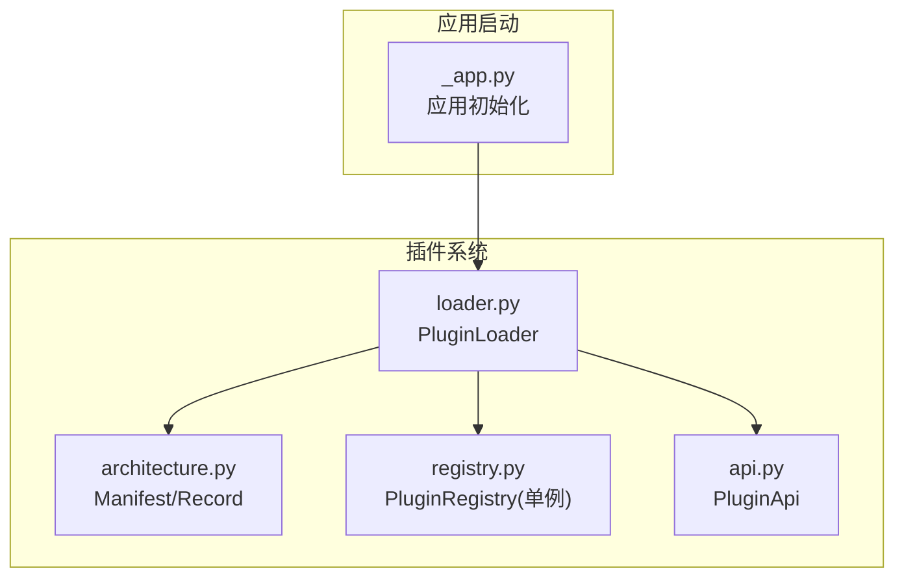
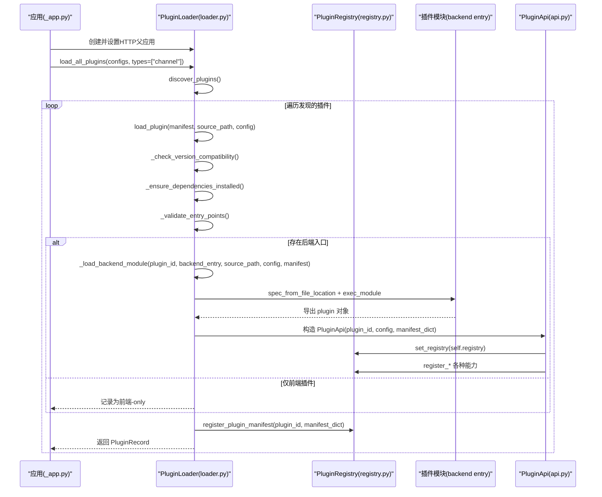
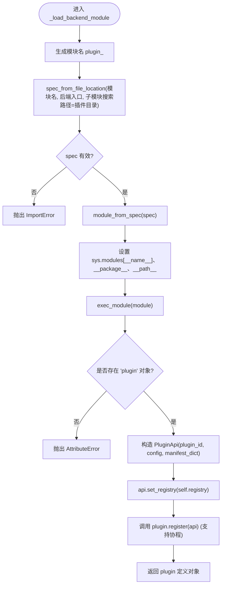
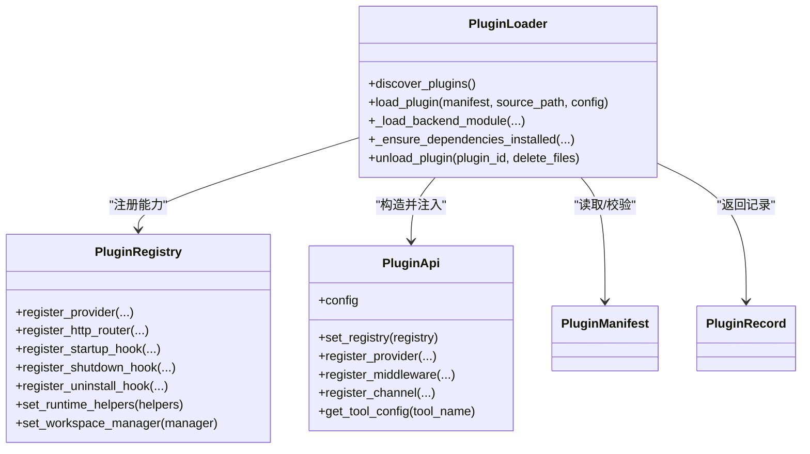

# 插件加载流程

<cite>
**本文引用的文件**   
- [loader.py](file://src/qwenpaw/plugins/loader.py)
- [architecture.py](file://src/qwenpaw/plugins/architecture.py)
- [registry.py](file://src/qwenpaw/plugins/registry.py)
- [api.py](file://src/qwenpaw/plugins/api.py)
- [_app.py](file://src/qwenpaw/app/_app.py)
</cite>

## 目录
1. [简介](#简介)
2. [项目结构](#项目结构)
3. [核心组件](#核心组件)
4. [架构总览](#架构总览)
5. [详细组件分析](#详细组件分析)
6. [依赖关系分析](#依赖关系分析)
7. [性能考量](#性能考量)
8. [故障诊断与常见问题](#故障诊断与常见问题)
9. [结论](#结论)
10. [附录](#附录)

## 简介
本文聚焦于 QwenPaw 后端插件系统的加载流程，重点解析以下关键问题：
- load_plugin 方法的完整实现逻辑：版本兼容性检查、依赖安装、入口点校验、动态模块导入、注册与实例化。
- _load_backend_module 方法如何处理 Python 模块的动态加载：包括使用 importlib.util.spec_from_file_location 创建模块规范、命名空间管理（sys.modules、__package__、__path__）、以及执行模块并提取 plugin 对象。
- 插件配置注入机制：如何将运行时配置从应用层传递到插件实例，并在插件 API 中暴露。
- 插件加载失败的诊断方法与常见问题的解决方案：涵盖依赖缺失、入口点错误、模块未导出必要对象、并发安装冲突等场景。

## 项目结构
插件系统位于 src/qwenpaw/plugins 目录下，核心文件如下：
- loader.py：插件发现、依赖安装、动态加载与生命周期管理。
- architecture.py：插件清单模型、类型定义与记录结构。
- registry.py：插件能力注册中心（单例），提供 Provider、Hook、HTTP 路由、Channel、工具等注册接口。
- api.py：面向插件开发者的 API 封装，用于在插件中注册能力。
- _app.py：应用启动阶段初始化 PluginLoader 并分阶段加载插件。

图表来源
- [loader.py:119-131](file://src/qwenpaw/plugins/loader.py#L119-L131)
- [architecture.py:114-221](file://src/qwenpaw/plugins/architecture.py#L114-L221)
- [registry.py:129-170](file://src/qwenpaw/plugins/registry.py#L129-L170)
- [api.py:172-204](file://src/qwenpaw/plugins/api.py#L172-L204)
- [_app.py:513-550](file://src/qwenpaw/app/_app.py#L513-L550)

章节来源
- [loader.py:119-131](file://src/qwenpaw/plugins/loader.py#L119-L131)
- [architecture.py:114-221](file://src/qwenpaw/plugins/architecture.py#L114-L221)
- [registry.py:129-170](file://src/qwenpaw/plugins/registry.py#L129-L170)
- [api.py:172-204](file://src/qwenpaw/plugins/api.py#L172-L204)
- [_app.py:513-550](file://src/qwenpaw/app/_app.py#L513-L550)

## 核心组件
- PluginLoader：负责插件发现、依赖安装、动态加载、卸载与清理。
- PluginManifest / PluginRecord：描述插件元数据与已加载状态。
- PluginRegistry：集中式注册中心，维护所有插件能力（Provider、Hook、HTTP 路由、Channel、工具等）。
- PluginApi：插件开发者使用的 API，通过它完成能力注册与配置访问。

章节来源
- [loader.py:119-131](file://src/qwenpaw/plugins/loader.py#L119-L131)
- [architecture.py:114-221](file://src/qwenpaw/plugins/architecture.py#L114-L221)
- [registry.py:129-170](file://src/qwenpaw/plugins/registry.py#L129-L170)
- [api.py:172-204](file://src/qwenpaw/plugins/api.py#L172-L204)

## 架构总览
插件加载的整体时序如下：
- 应用启动时创建 PluginLoader，设置 HTTP 父应用，读取全局配置中的 plugins 配置块。
- 第一阶段优先加载 channel 类型插件，确保通道可用后再启动工作区与 Agent。
- 第二阶段加载其余插件；若某插件已在内存中，则跳过重复加载。
- 每个插件的加载流程包含：版本兼容检查、依赖安装、入口点验证、动态模块导入、注册与实例化。

图表来源
- [_app.py:513-550](file://src/qwenpaw/app/_app.py#L513-L550)
- [loader.py:514-607](file://src/qwenpaw/plugins/loader.py#L514-L607)
- [loader.py:376-458](file://src/qwenpaw/plugins/loader.py#L376-L458)
- [api.py:172-204](file://src/qwenpaw/plugins/api.py#L172-L204)
- [registry.py:129-170](file://src/qwenpaw/plugins/registry.py#L129-L170)

## 详细组件分析

### load_plugin 方法实现逻辑
- 幂等性保护：若插件 ID 已加载，直接返回已有记录，避免重复加载。
- 版本兼容性检查：基于清单中的 qwenpaw_version 或 min/max_version 字段进行范围匹配，不兼容则标记 disabled 并记录诊断信息。
- 依赖安装：扫描 requirements.txt，检测缺失或不满足版本的依赖，必要时调用安装器（支持 pip 与 uv 回退）并加进程锁防止并发安装风暴。
- 入口点验证：根据 manifest.entry.backend 与 manifest.entry.frontend 计算实际路径，校验至少有一个入口文件存在。
- 动态加载后端模块：若存在后端入口，则调用 _load_backend_module 完成模块导入与注册；否则作为纯前端插件处理。
- 构建记录：将 manifest、source_path、enabled 标志与实例（若有）写入 PluginRecord，并缓存到内部字典。

章节来源
- [loader.py:514-607](file://src/qwenpaw/plugins/loader.py#L514-L607)
- [loader.py:191-206](file://src/qwenpaw/plugins/loader.py#L191-L206)
- [loader.py:270-334](file://src/qwenpaw/plugins/loader.py#L270-L334)
- [loader.py:336-374](file://src/qwenpaw/plugins/loader.py#L336-L374)

### _load_backend_module 动态模块加载与命名空间管理
- 模块名生成：将插件 ID 转换为合法的 Python 模块名（替换连字符为下划线），形成唯一命名空间前缀。
- 模块规范创建：使用 importlib.util.spec_from_file_location 指定模块名与后端入口文件路径，并将插件目录加入 submodule_search_locations，以便相对导入。
- 模块实例化与命名空间设置：
  - 将模块放入 sys.modules，设置 __package__ 与 __path__，使模块能正确解析包内相对导入。
  - 执行模块代码（exec_module），等待其副作用（如注册钩子、路由、工具等）。
- 契约校验：要求模块必须导出名为 plugin 的对象，且该对象需实现 register(api) 方法（支持协程）。
- 配置注入：构造 PluginApi 时传入当前插件的配置字典与清单信息，随后将 Registry 引用注入到 API，供插件在 register 中调用注册接口。
- 失败清理：若导入或注册过程中抛出异常，调用 _cleanup_failed_load 清理已注册的条目、sys.modules 中与插件相关的条目以及可能插入的 sys.path 项，保证后续重试或卸载不受污染。

图表来源
- [loader.py:376-458](file://src/qwenpaw/plugins/loader.py#L376-L458)
- [loader.py:460-513](file://src/qwenpaw/plugins/loader.py#L460-L513)

章节来源
- [loader.py:376-458](file://src/qwenpaw/plugins/loader.py#L376-L458)
- [loader.py:460-513](file://src/qwenpaw/plugins/loader.py#L460-L513)

### 插件配置注入机制
- 配置来源：应用启动时从全局配置文件中读取 plugins 配置块，按插件 ID 映射到具体配置字典。
- 传递路径：
  - _app.py 中读取配置后，调用 load_all_plugins(configs=plugin_configs)。
  - load_all_plugins 遍历发现的插件，对每个插件调用 load_plugin(manifest, source_path, config)，config 来自 configs[manifest.id]。
  - load_plugin 在存在后端入口时调用 _load_backend_module(..., config, ...)。
  - _load_backend_module 构造 PluginApi(plugin_id, config, manifest_dict)，并将 Registry 引用注入到 API。
- 插件侧访问：
  - 插件在 register(api) 中可通过 api.config 获取自身配置。
  - 工具函数可通过 get_tool_config(tool_name) 在当前 Agent 上下文中读取工具级配置。

章节来源
- [_app.py:513-550](file://src/qwenpaw/app/_app.py#L513-L550)
- [loader.py:609-639](file://src/qwenpaw/plugins/loader.py#L609-L639)
- [loader.py:514-607](file://src/qwenpaw/plugins/loader.py#L514-L607)
- [loader.py:376-458](file://src/qwenpaw/plugins/loader.py#L376-L458)
- [api.py:172-204](file://src/qwenpaw/plugins/api.py#L172-L204)
- [api.py:11-46](file://src/qwenpaw/plugins/api.py#L11-L46)

### 依赖检查与安装流程
- 依赖探测：
  - 读取插件目录下的 requirements.txt，逐行解析 Requirement。
  - 双重探测策略：
    - 通过 importlib.metadata 查询已安装包及其版本，判断是否满足版本约束。
    - 对于冻结桌面构建中缺少 .dist-info 的包，回退到 importlib.util.find_spec 探测可导入性。
- 安装执行：
  - 非冻结环境：优先使用 python -m pip install -r requirements.txt；若 pip 不可用，自动查找并回退到 uv pip install。
  - 冻结桌面环境：使用内置的独立 CPython 解释器，以 --target 方式安装到用户可写的 site 目录，并将其加入 sys.path 与 importlib 缓存。
- 并发安全：
  - 使用 per-plugin 的文件锁（install_lock）串行化同一插件的安装过程，避免多进程并发安装导致资源耗尽。
  - 获得锁后再次探测依赖，若已被其他进程安装则跳过安装。

章节来源
- [loader.py:208-268](file://src/qwenpaw/plugins/loader.py#L208-L268)
- [loader.py:270-334](file://src/qwenpaw/plugins/loader.py#L270-L334)
- [loader.py:721-834](file://src/qwenpaw/plugins/loader.py#L721-L834)
- [loader.py:836-892](file://src/qwenpaw/plugins/loader.py#L836-L892)

### 入口点验证与前后端分离加载
- 入口点声明：manifest.entry.backend 与 manifest.entry.frontend 分别指向后端与前端入口文件。
- 验证规则：
  - 至少声明一个入口点，否则抛出 FileNotFoundError。
  - 若声明了入口但对应文件不存在，同样抛出 FileNotFoundError。
- 加载策略：
  - 若无后端入口，则作为“前端-only”插件记录，不进行 Python 模块导入。
  - 若存在后端入口，则执行动态导入与注册流程。

章节来源
- [loader.py:336-374](file://src/qwenpaw/plugins/loader.py#L336-L374)
- [loader.py:560-597](file://src/qwenpaw/plugins/loader.py#L560-L597)

### 卸载与清理
- 触发时机：显式调用 unload_plugin 或在安装/热重载路径中需要重置状态。
- 清理内容：
  - 执行插件注册的 shutdown 与 uninstall 钩子。
  - 清理 sys.modules 中与插件命名空间相关的所有模块，以及通过 __file__ 定位到的残留模块。
  - 移除插件目录在 sys.path 中的插入项。
  - 从注册中心注销插件能力，并从 agents.tools 中移除该插件注册的工具。
  - 可选删除磁盘上的插件目录。

章节来源
- [loader.py:975-1096](file://src/qwenpaw/plugins/loader.py#L975-L1096)
- [loader.py:1098-1146](file://src/qwenpaw/plugins/loader.py#L1098-L1146)

## 依赖关系分析
- 组件耦合：
  - PluginLoader 强依赖 architecture（清单与记录）、registry（注册中心）、api（插件 API）。
  - PluginRegistry 作为单例被多个组件共享，承担解耦与扩展点职责。
  - 应用层通过 _app.py 控制加载阶段与顺序，避免循环依赖。
- 外部依赖：
  - importlib 系列用于动态模块加载与依赖探测。
  - packaging.requirements 用于解析 requirements.txt。
  - subprocess 用于调用 pip/uv 安装器。
  - 文件系统与平台信息用于 site 目录与 ABI 桶选择。

图表来源
- [loader.py:119-131](file://src/qwenpaw/plugins/loader.py#L119-L131)
- [registry.py:129-170](file://src/qwenpaw/plugins/registry.py#L129-L170)
- [api.py:172-204](file://src/qwenpaw/plugins/api.py#L172-L204)
- [architecture.py:114-221](file://src/qwenpaw/plugins/architecture.py#L114-L221)

章节来源
- [loader.py:119-131](file://src/qwenpaw/plugins/loader.py#L119-L131)
- [registry.py:129-170](file://src/qwenpaw/plugins/registry.py#L129-L170)
- [api.py:172-204](file://src/qwenpaw/plugins/api.py#L172-L204)
- [architecture.py:114-221](file://src/qwenpaw/plugins/architecture.py#L114-L221)

## 性能考量
- 依赖安装并行与锁：
  - 使用 asyncio.to_thread 将阻塞的 pip/uv 安装移出事件循环，避免阻塞主线程。
  - 通过 per-plugin 文件锁串行化同一插件的安装，避免并发导致的内存峰值与重复安装。
- 导入缓存失效：
  - 在安装完成后调用 importlib.invalidate_caches，确保后续 import 能发现新安装的包。
- 站点目录隔离：
  - 冻结桌面构建中将插件依赖安装到用户可写 site 目录，并通过 addsitedir 与 sys.path.insert 暴露给解释器，避免影响宿主环境。
- 加载阶段优化：
  - 分阶段加载（先 channel，再其余插件），减少启动时的竞争与不确定性。

章节来源
- [loader.py:270-334](file://src/qwenpaw/plugins/loader.py#L270-L334)
- [loader.py:721-834](file://src/qwenpaw/plugins/loader.py#L721-L834)
- [loader.py:836-892](file://src/qwenpaw/plugins/loader.py#L836-L892)
- [_app.py:513-550](file://src/qwenpaw/app/_app.py#L513-L550)

## 故障诊断与常见问题
- 插件未声明入口点或入口文件缺失：
  - 现象：加载时报 FileNotFoundError，提示未声明 entry.backend 或 entry.frontend，或文件不存在。
  - 排查：检查 plugin.json 的 entry 字段与实际文件路径是否一致。
  - 参考：入口点验证逻辑。
- 插件模块未导出必要对象：
  - 现象：AttributeError，提示模块必须导出 plugin 对象或未实现 register(api)。
  - 排查：确认后端入口文件导出了 plugin 对象，且实现了 register(api) 方法（可为协程）。
  - 参考：动态模块加载契约校验。
- 依赖安装失败或超时：
  - 现象：RuntimeError 提示安装失败或超时；或提示 pip 不可用且未找到 uv。
  - 排查：
    - 检查网络与镜像源。
    - 在非冻结环境中确认 pip 可用；在冻结桌面环境中确认内置 Python 运行时路径可用。
    - 手动运行安装命令查看输出日志。
  - 参考：依赖探测与安装流程。
- 并发安装风暴：
  - 现象：多次启动或并行安装导致内存耗尽。
  - 排查：确认 per-plugin 锁生效；观察日志中“dependencies already satisfied by a concurrent installer; skipping pip install”。
  - 参考：安装锁与二次探测逻辑。
- 插件版本不兼容：
  - 现象：插件被标记为 disabled，并附带诊断信息。
  - 排查：核对 manifest 中的 qwenpaw_version 或 min/max_version 与当前宿主版本范围。
  - 参考：版本兼容性检查。
- 卸载后残留状态：
  - 现象：重新安装或热重载后仍出现旧行为。
  - 排查：确认卸载流程清理了 sys.modules、sys.path 与注册中心条目；必要时重启进程。
  - 参考：卸载与清理逻辑。

章节来源
- [loader.py:336-374](file://src/qwenpaw/plugins/loader.py#L336-L374)
- [loader.py:376-458](file://src/qwenpaw/plugins/loader.py#L376-L458)
- [loader.py:721-834](file://src/qwenpaw/plugins/loader.py#L721-L834)
- [loader.py:270-334](file://src/qwenpaw/plugins/loader.py#L270-L334)
- [loader.py:191-206](file://src/qwenpaw/plugins/loader.py#L191-L206)
- [loader.py:975-1096](file://src/qwenpaw/plugins/loader.py#L975-L1096)

## 结论
QwenPaw 的插件加载流程围绕 PluginLoader 展开，结合 Manifest 校验、依赖安装、入口点验证与动态模块导入，实现了灵活而安全的插件生态。通过 PluginRegistry 与 PluginApi 的解耦设计，插件可在运行时注册各类能力，同时保持宿主环境的稳定。配置注入机制使得插件能够按需获取运行时参数，提升可配置性与可维护性。完善的失败清理与并发控制进一步增强了系统的健壮性。

## 附录
- 插件清单关键字段建议：
  - id、version、entry.backend/front、qwenpaw_version（或 min/max_version）、meta（工具/渠道/命令等元数据）。
- 插件开发最佳实践：
  - 在 register(api) 中完成所有注册操作，避免模块级副作用。
  - 使用 api.config 获取插件配置，使用 get_tool_config 获取工具级配置。
  - 合理声明 dependencies，并在 requirements.txt 中固定版本范围，降低安装失败概率。
  - 实现 uninstall 钩子，清理一次性资源（如临时文件、注册表项）。