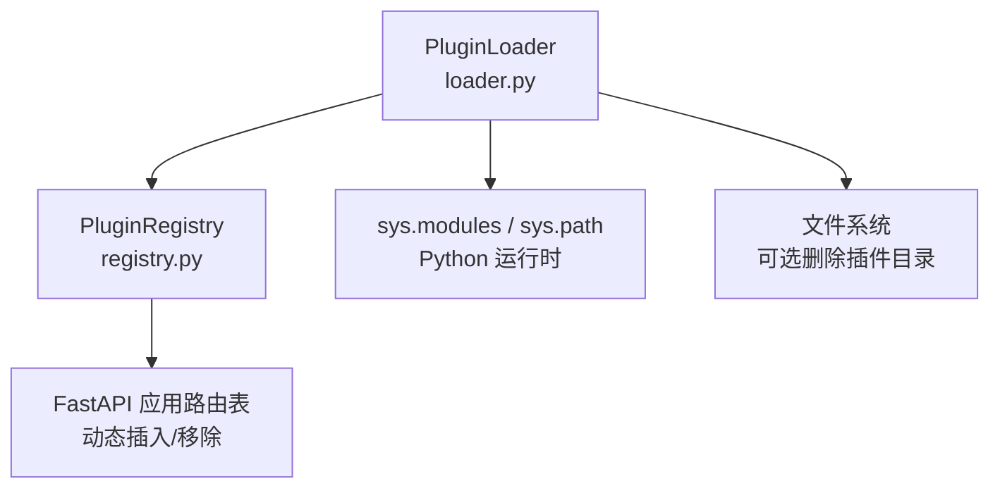
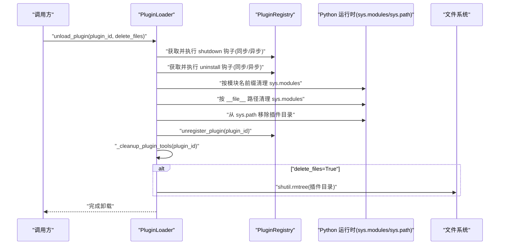
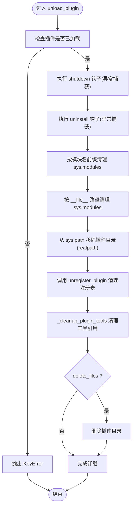
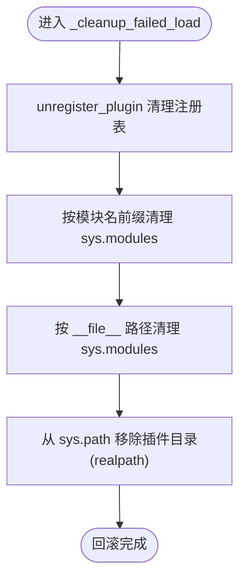
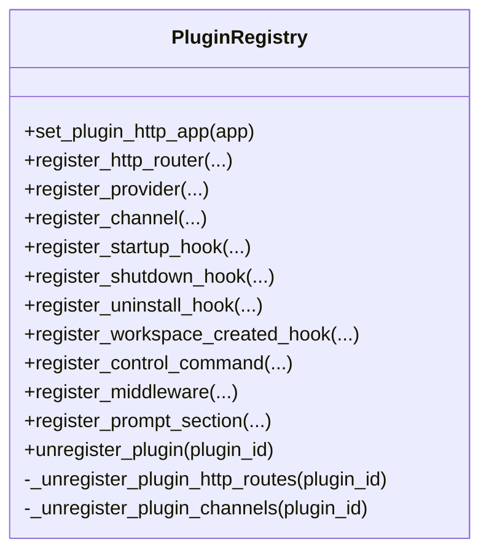
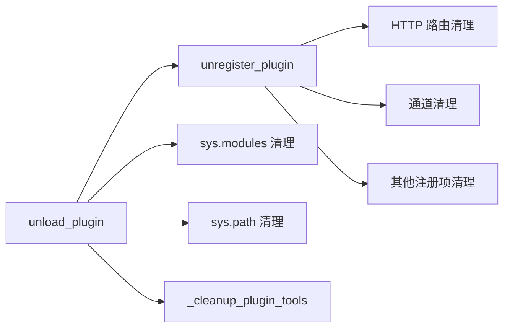

# 插件卸载机制

<cite>
**本文引用的文件**   
- [loader.py](file://src/qwenpaw/plugins/loader.py)
- [registry.py](file://src/qwenpaw/plugins/registry.py)
</cite>

## 目录
1. [简介](#简介)
2. [项目结构](#项目结构)
3. [核心组件](#核心组件)
4. [架构总览](#架构总览)
5. [详细组件分析](#详细组件分析)
6. [依赖关系分析](#依赖关系分析)
7. [性能与资源考量](#性能与资源考量)
8. [故障排查指南](#故障排查指南)
9. [结论](#结论)

## 简介
本文件聚焦于插件卸载机制，系统性说明 unload_plugin 方法如何实现安全的插件卸载，包括：
- 清理注册表条目（HTTP 路由、通道、提供者、钩子、中间件、提示段等）
- 移除 sys.modules 引用（按模块名前缀与 __file__ 路径双重扫描）
- 恢复 sys.path（移除插件目录以避免污染后续导入）
- 执行 shutdown 与 uninstall 钩子以释放外部资源
- 回滚加载失败时的残留状态（_cleanup_failed_load）
- 异常处理与安全保障措施

## 项目结构
与插件卸载直接相关的代码位于 plugins 包中：
- loader.py：插件生命周期管理（发现、安装、加载、卸载），包含 unload_plugin 与 _cleanup_failed_load
- registry.py：插件注册中心，提供注册/反注册能力，维护 HTTP 路由、通道、提供者、钩子等

图表来源
- [loader.py:974-1096](file://src/qwenpaw/plugins/loader.py#L974-L1096)
- [registry.py:298-327](file://src/qwenpaw/plugins/registry.py#L298-L327)
- [registry.py:878-897](file://src/qwenpaw/plugins/registry.py#L878-L897)
- [registry.py:934-992](file://src/qwenpaw/plugins/registry.py#L934-L992)

章节来源
- [loader.py:974-1096](file://src/qwenpaw/plugins/loader.py#L974-L1096)
- [registry.py:298-327](file://src/qwenpaw/plugins/registry.py#L298-L327)
- [registry.py:878-897](file://src/qwenpaw/plugins/registry.py#L878-L897)
- [registry.py:934-992](file://src/qwenpaw/plugins/registry.py#L934-L992)

## 核心组件
- PluginLoader
  - 负责插件的加载与卸载。unload_plugin 是卸载入口；_cleanup_failed_load 用于加载失败的回滚。
- PluginRegistry
  - 集中管理插件注册项，包括 HTTP 路由、通道、提供者、钩子、中间件、提示段等。unregister_plugin 负责批量清理。

章节来源
- [loader.py:974-1096](file://src/qwenpaw/plugins/loader.py#L974-L1096)
- [registry.py:934-992](file://src/qwenpaw/plugins/registry.py#L934-L992)

## 架构总览
下图展示了卸载流程中的关键步骤与交互：

图表来源
- [loader.py:974-1096](file://src/qwenpaw/plugins/loader.py#L974-L1096)
- [registry.py:934-992](file://src/qwenpaw/plugins/registry.py#L934-L992)

## 详细组件分析

### unload_plugin 安全卸载流程
unload_plugin 的执行顺序与职责如下：
- 校验插件是否已加载，未加载则抛出 KeyError
- 执行该插件注册的 shutdown 钩子（支持同步/异步），异常被捕获并记录日志，不中断后续清理
- 执行该插件注册的 uninstall 钩子（支持同步/异步），异常被捕获并记录日志，不中断后续清理
- 清理 sys.modules：
  - 按模块名前缀（plugin_<id>.*）清理
  - 按 __file__ 路径前缀清理，覆盖插件内部将自身目录加入 sys.path 后以裸名导入的子模块
- 清理 sys.path：移除插件目录（使用 realpath 比较，避免符号链接或不同拼写导致的遗漏）
- 清理注册表：调用 unregister_plugin 清除所有与该插件相关的注册项
- 清理 agents.tools：通过 _cleanup_plugin_tools 移除该插件在 qwenpaw.agents.tools 暴露的工具名称
- 可选删除磁盘文件：当 delete_files=True 时，递归删除插件目录
- 记录卸载成功日志

图表来源
- [loader.py:974-1096](file://src/qwenpaw/plugins/loader.py#L974-L1096)

章节来源
- [loader.py:974-1096](file://src/qwenpaw/plugins/loader.py#L974-L1096)

### _cleanup_failed_load 加载失败回滚逻辑
当插件加载过程中发生异常时，_cleanup_failed_load 会进行“镜像式”回滚，确保不会留下任何孤儿状态：
- 清理注册表：调用 unregister_plugin 移除 manifest、providers、hooks、middleware、routes、channels、prompt sections 等
- 清理 sys.modules：
  - 按模块名前缀（plugin_<id>.*）清理
  - 按 __file__ 路径前缀清理，防止裸名导入的残留
- 清理 sys.path：移除插件目录（realpath 比较）

注意：该方法明确标注非线程安全，因为对 sys.modules 和 sys.path 的修改未加锁。由于加载过程是串行的，这在实际使用中是可接受的。

图表来源
- [loader.py:460-513](file://src/qwenpaw/plugins/loader.py#L460-L513)

章节来源
- [loader.py:460-513](file://src/qwenpaw/plugins/loader.py#L460-L513)

### 注册表清理细节（unregister_plugin）
unregister_plugin 负责一次性清理某插件的所有内存注册项：
- 清理 HTTP 路由：从 FastAPI 应用的路由表中移除该插件挂载的路由，并更新 OpenAPI schema 缓存
- 清理通道：移除该插件注册的 channel_key -> ChannelRegistration 映射
- 清理 manifest、providers、hooks（startup/shutdown/uninstall/workspace_created）、control commands、middleware、prompt sections 及其名称集合
- 记录清理日志

图表来源
- [registry.py:298-327](file://src/qwenpaw/plugins/registry.py#L298-L327)
- [registry.py:878-897](file://src/qwenpaw/plugins/registry.py#L878-L897)
- [registry.py:934-992](file://src/qwenpaw/plugins/registry.py#L934-L992)

章节来源
- [registry.py:298-327](file://src/qwenpaw/plugins/registry.py#L298-L327)
- [registry.py:878-897](file://src/qwenpaw/plugins/registry.py#L878-L897)
- [registry.py:934-992](file://src/qwenpaw/plugins/registry.py#L934-L992)

### 工具清理（_cleanup_plugin_tools）
卸载时会清理 qwenpaw.agents.tools 模块中该插件暴露的工具名称：
- 读取插件 manifest.meta 中的 tool_name 或 tools 列表
- 从模块属性与 __all__ 中移除对应名称
- 若清理失败仅记录警告，不影响整体卸载流程

章节来源
- [loader.py:1098-1146](file://src/qwenpaw/plugins/loader.py#L1098-L1146)

## 依赖关系分析
- unload_plugin 依赖：
  - PluginRegistry：执行钩子、清理注册表
  - Python 运行时：操作 sys.modules 与 sys.path
  - 文件系统：可选删除插件目录
- 注册表清理依赖：
  - FastAPI 应用实例：动态插入/移除路由
  - 其他注册项容器：channels、providers、hooks、middleware、prompt sections 等

图表来源
- [loader.py:974-1096](file://src/qwenpaw/plugins/loader.py#L974-L1096)
- [registry.py:298-327](file://src/qwenpaw/plugins/registry.py#L298-L327)
- [registry.py:878-897](file://src/qwenpaw/plugins/registry.py#L878-L897)
- [registry.py:934-992](file://src/qwenpaw/plugins/registry.py#L934-L992)

章节来源
- [loader.py:974-1096](file://src/qwenpaw/plugins/loader.py#L974-L1096)
- [registry.py:298-327](file://src/qwenpaw/plugins/registry.py#L298-L327)
- [registry.py:878-897](file://src/qwenpaw/plugins/registry.py#L878-L897)
- [registry.py:934-992](file://src/qwenpaw/plugins/registry.py#L934-L992)

## 性能与资源考量
- 钩子执行：shutdown 与 uninstall 钩子可能为异步，需等待其完成；异常被捕获并记录，避免阻塞卸载主流程
- sys.modules 与 sys.path 清理：采用前缀匹配与路径匹配，时间复杂度与当前模块数量线性相关；使用 realpath 比较避免符号链接带来的重复或遗漏
- HTTP 路由清理：直接从 FastAPI 路由列表中移除，并重置 openapi_schema 缓存，保证 API 文档一致性
- 工具清理：直接操作模块属性与 __all__，开销较小
- 磁盘删除：仅在显式请求时执行，避免不必要的 I/O

[本节为通用指导，无需具体文件分析]

## 故障排查指南
- 卸载未生效或仍可见路由/通道
  - 确认是否调用了 unregister_plugin 且返回正常
  - 检查 FastAPI 路由表是否已被正确移除，OpenAPI 缓存是否已失效
  - 验证 sys.modules 与 sys.path 是否已清理（特别是裸名导入的模块）
- 卸载钩子报错导致部分清理未完成
  - 查看日志中关于 shutdown/uninstall 钩子的错误信息
  - 钩子异常会被捕获并记录，但不会中断后续清理；建议修复钩子实现以确保资源完全释放
- 再次安装后出现旧代码残留
  - 确认卸载阶段是否清除了 sys.modules 中按 __file__ 路径匹配的模块
  - 确认 sys.path 中是否移除了插件目录
- 工具仍然可用
  - 检查 _cleanup_plugin_tools 是否成功从 qwenpaw.agents.tools 移除对应名称
  - 确认 manifest.meta 中的工具命名格式是否正确（单工具或多工具）

章节来源
- [loader.py:974-1096](file://src/qwenpaw/plugins/loader.py#L974-L1096)
- [registry.py:298-327](file://src/qwenpaw/plugins/registry.py#L298-L327)
- [registry.py:878-897](file://src/qwenpaw/plugins/registry.py#L878-L897)
- [registry.py:934-992](file://src/qwenpaw/plugins/registry.py#L934-L992)
- [loader.py:1098-1146](file://src/qwenpaw/plugins/loader.py#L1098-L1146)

## 结论
unload_plugin 通过有序执行钩子、彻底清理 Python 运行时状态（sys.modules、sys.path）、以及全面撤销注册表条目，实现了安全的插件卸载。_cleanup_failed_load 提供了加载失败时的镜像回滚，确保系统状态的一致性。异常处理策略保证了即使钩子或清理步骤出错，也不会影响整体卸载流程的健壮性。对于需要释放的外部资源（如文件句柄、网络连接、内存资源），应通过插件侧的 shutdown/uninstall 钩子进行显式释放，并由宿主端统一编排与监控。