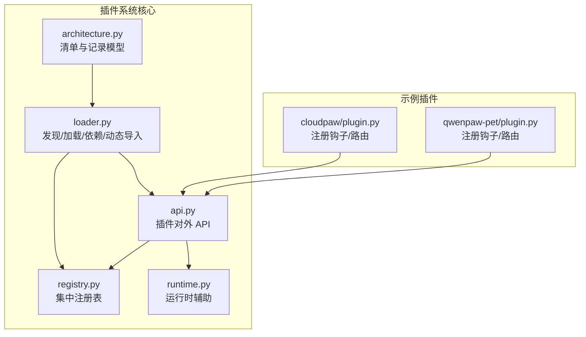
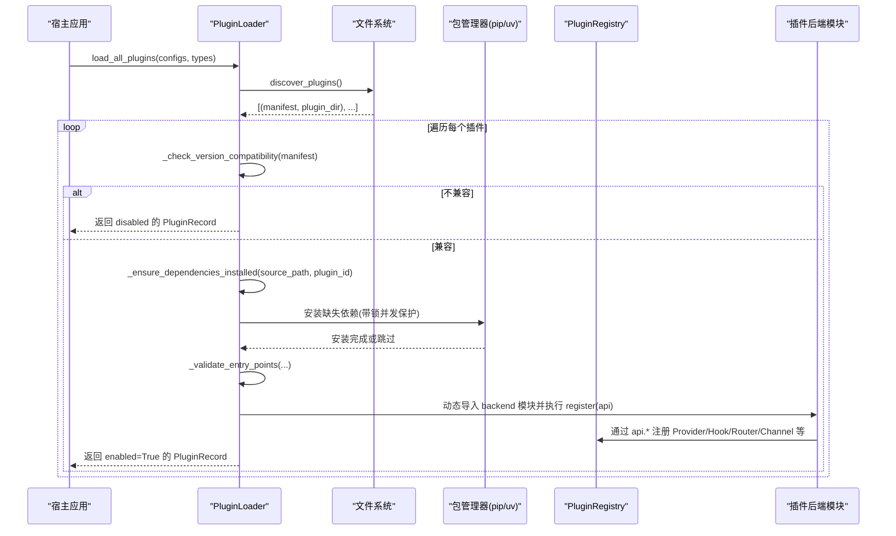
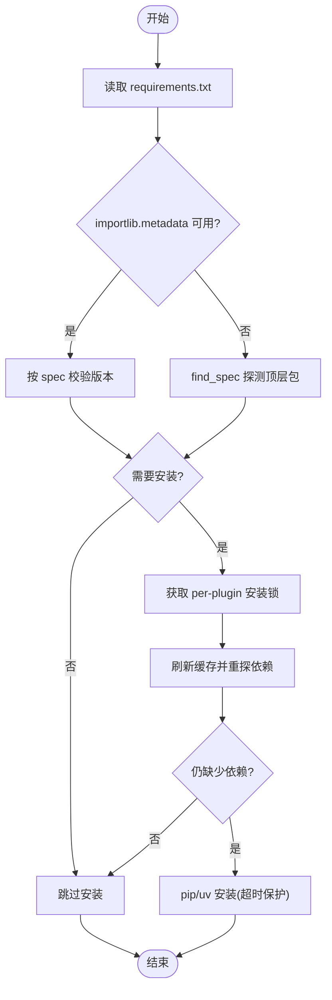
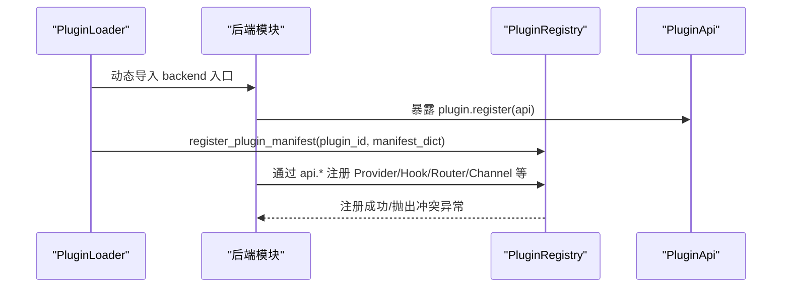
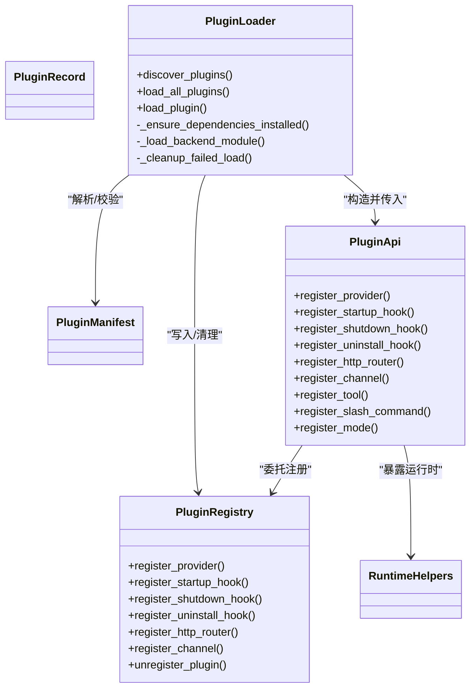

# 插件生命周期管理

<cite>
**本文引用的文件**   
- [src/qwenpaw/plugins/__init__.py](file://src/qwenpaw/plugins/__init__.py)
- [src/qwenpaw/plugins/architecture.py](file://src/qwenpaw/plugins/architecture.py)
- [src/qwenpaw/plugins/loader.py](file://src/qwenpaw/plugins/loader.py)
- [src/qwenpaw/plugins/registry.py](file://src/qwenpaw/plugins/registry.py)
- [src/qwenpaw/plugins/api.py](file://src/qwenpaw/plugins/api.py)
- [src/qwenpaw/plugins/runtime.py](file://src/qwenpaw/plugins/runtime.py)
- [plugins/bundle/cloudpaw/plugin.py](file://plugins/bundle/cloudpaw/plugin.py)
- [plugins/bundle/qwenpaw-pet/plugin.py](file://plugins/bundle/qwenpaw-pet/plugin.py)
</cite>

## 目录
1. [简介](#简介)
2. [项目结构](#项目结构)
3. [核心组件](#核心组件)
4. [架构总览](#架构总览)
5. [详细组件分析](#详细组件分析)
6. [依赖关系分析](#依赖关系分析)
7. [性能与稳定性考量](#性能与稳定性考量)
8. [故障排查指南](#故障排查指南)
9. [结论](#结论)
10. [附录：钩子使用指南与最佳实践](#附录：钩子使用指南与最佳实践)

## 简介
本文件面向 QwenPaw 的插件系统，系统化阐述插件从发现、加载、初始化到卸载的全生命周期流程，重点覆盖以下方面：
- 初始化阶段：清单解析、版本兼容检查、依赖安装与校验、入口点验证。
- 动态导入与注册：后端模块的动态加载、API 对象注入、注册表集中管理。
- 状态管理：enabled/disabled 状态的判定与转换逻辑（含“禁用目录”机制）。
- 热重载与安全更新：如何在不影响系统稳定性的前提下安全替换已加载插件。
- 错误处理与回滚：加载失败时的清理策略与资源回收。
- 生命周期钩子：启动、关闭、卸载、工作区创建等钩子的使用方式与最佳实践。

## 项目结构
QwenPaw 插件系统的核心位于 src/qwenpaw/plugins 目录，围绕“清单模型 + 加载器 + 注册表 + API”四层组织；bundle 下的示例插件展示了真实用法。

图表来源
- [src/qwenpaw/plugins/architecture.py:114-221](file://src/qwenpaw/plugins/architecture.py#L114-L221)
- [src/qwenpaw/plugins/loader.py:119-639](file://src/qwenpaw/plugins/loader.py#L119-L639)
- [src/qwenpaw/plugins/registry.py:129-327](file://src/qwenpaw/plugins/registry.py#L129-L327)
- [src/qwenpaw/plugins/api.py:172-482](file://src/qwenpaw/plugins/api.py#L172-L482)
- [src/qwenpaw/plugins/runtime.py:10-68](file://src/qwenpaw/plugins/runtime.py#L10-L68)
- [plugins/bundle/cloudpaw/plugin.py:500-581](file://plugins/bundle/cloudpaw/plugin.py#L500-L581)
- [plugins/bundle/qwenpaw-pet/plugin.py:80-172](file://plugins/bundle/qwenpaw-pet/plugin.py#L80-L172)

章节来源
- [src/qwenpaw/plugins/__init__.py:1-17](file://src/qwenpaw/plugins/__init__.py#L1-L17)

## 核心组件
- 清单与记录模型（PluginManifest、PluginRecord）
  - 负责描述插件元数据、入口点、依赖、兼容性约束以及加载后的运行记录。
- 插件加载器（PluginLoader）
  - 负责扫描插件目录、解析清单、版本兼容检查、依赖安装、动态导入后端模块、调用 register(api) 完成注册。
- 插件注册表（PluginRegistry）
  - 单例式集中管理所有注册项：Provider、Hook、HTTP 路由、Channel、控制命令、中间件、提示词片段等。
- 插件 API（PluginApi）
  - 插件开发者使用的统一接口，内部委托给注册表执行具体注册动作。
- 运行时辅助（RuntimeHelpers）
  - 为插件提供日志、Provider 访问等运行时能力。

章节来源
- [src/qwenpaw/plugins/architecture.py:114-221](file://src/qwenpaw/plugins/architecture.py#L114-L221)
- [src/qwenpaw/plugins/loader.py:119-639](file://src/qwenpaw/plugins/loader.py#L119-L639)
- [src/qwenpaw/plugins/registry.py:129-327](file://src/qwenpaw/plugins/registry.py#L129-L327)
- [src/qwenpaw/plugins/api.py:172-482](file://src/qwenpaw/plugins/api.py#L172-L482)
- [src/qwenpaw/plugins/runtime.py:10-68](file://src/qwenpaw/plugins/runtime.py#L10-L68)

## 架构总览
下图展示插件从发现到加载的关键时序，包括依赖安装、动态导入、注册表注册与异常回滚路径。

图表来源
- [src/qwenpaw/plugins/loader.py:609-639](file://src/qwenpaw/plugins/loader.py#L609-L639)
- [src/qwenpaw/plugins/loader.py:514-607](file://src/qwenpaw/plugins/loader.py#L514-L607)
- [src/qwenpaw/plugins/loader.py:270-334](file://src/qwenpaw/plugins/loader.py#L270-L334)
- [src/qwenpaw/plugins/loader.py:376-458](file://src/qwenpaw/plugins/loader.py#L376-L458)
- [src/qwenpaw/plugins/registry.py:220-292](file://src/qwenpaw/plugins/registry.py#L220-L292)

## 详细组件分析

### 插件清单与类型推断
- 清单字段支持国际化文本、遗留 entry_point 合并、type 缺失时基于 meta 自动推断。
- 版本约束采用左闭右开区间语义，兼容新旧字段组合。

章节来源
- [src/qwenpaw/plugins/architecture.py:114-221](file://src/qwenpaw/plugins/architecture.py#L114-L221)

### 插件发现与禁用机制
- 扫描指定目录，忽略隐藏目录与以 .disabled 结尾的目录，从而将插件置为“禁用”。
- 仅当存在 plugin.json 且可解析时才视为有效插件。

章节来源
- [src/qwenpaw/plugins/loader.py:132-172](file://src/qwenpaw/plugins/loader.py#L132-L172)
- [src/qwenpaw/plugins/loader.py:81-90](file://src/qwenpaw/plugins/loader.py#L81-L90)

### 版本兼容性与依赖安装
- 版本兼容：根据 manifest 中的 qwenpaw_version 或 min/max_version 判断是否允许加载。
- 依赖安装：
  - 读取 requirements.txt，结合 importlib.metadata 与 find_spec 双重探测，避免误报。
  - 在冻结桌面构建中，将插件 site-dir 加入 sys.path，并使用打包内嵌 Python 安装。
  - 使用 per-plugin 进程级锁防止重复安装风暴。
  - 优先 python -m pip，若不可用则回退 uv pip install。

图表来源
- [src/qwenpaw/plugins/loader.py:208-268](file://src/qwenpaw/plugins/loader.py#L208-L268)
- [src/qwenpaw/plugins/loader.py:270-334](file://src/qwenpaw/plugins/loader.py#L270-L334)
- [src/qwenpaw/plugins/loader.py:721-800](file://src/qwenpaw/plugins/loader.py#L721-L800)

章节来源
- [src/qwenpaw/plugins/loader.py:191-206](file://src/qwenpaw/plugins/loader.py#L191-L206)
- [src/qwenpaw/plugins/loader.py:208-268](file://src/qwenpaw/plugins/loader.py#L208-L268)
- [src/qwenpaw/plugins/loader.py:270-334](file://src/qwenpaw/plugins/loader.py#L270-L334)
- [src/qwenpaw/plugins/loader.py:721-800](file://src/qwenpaw/plugins/loader.py#L721-L800)

### 动态导入与注册流程
- 动态导入：通过 importlib.util.spec_from_file_location 加载后端入口模块，设置 __path__ 使其相对插件目录解析。
- 要求模块导出 plugin 对象并实现 register(api)。
- 在加载期间向注册表写入 manifest，随后由插件通过 api.* 完成各类注册。

图表来源
- [src/qwenpaw/plugins/loader.py:376-458](file://src/qwenpaw/plugins/loader.py#L376-L458)
- [src/qwenpaw/plugins/registry.py:220-292](file://src/qwenpaw/plugins/registry.py#L220-L292)

章节来源
- [src/qwenpaw/plugins/loader.py:376-458](file://src/qwenpaw/plugins/loader.py#L376-L458)

### 注册表与 HTTP 路由挂载
- 注册表维护 Provider、Hook、Channel、控制命令、中间件、提示词片段等。
- HTTP 路由挂载：
  - 需先 set_plugin_http_app 绑定 FastAPI 实例。
  - 插件通过 api.register_http_router(prefix="/xxx") 注册路由。
  - 内部确保插件路由插入到控制台 SPA catch-all 之前，并重置 OpenAPI 缓存。

章节来源
- [src/qwenpaw/plugins/registry.py:209-292](file://src/qwenpaw/plugins/registry.py#L209-L292)
- [src/qwenpaw/plugins/api.py:394-424](file://src/qwenpaw/plugins/api.py#L394-L424)

### 状态管理与启用/禁用
- 兼容性问题：load_plugin 会标记 enabled=False 并附带诊断信息。
- 目录禁用：以 .disabled 后缀命名的插件目录会被发现阶段直接跳过。
- 已加载插件去重：同一 plugin_id 多次加载会直接返回已有记录。

章节来源
- [src/qwenpaw/plugins/loader.py:514-555](file://src/qwenpaw/plugins/loader.py#L514-L555)
- [src/qwenpaw/plugins/loader.py:535-539](file://src/qwenpaw/plugins/loader.py#L535-L539)
- [src/qwenpaw/plugins/loader.py:81-90](file://src/qwenpaw/plugins/loader.py#L81-L90)

### 错误处理与回滚
- 加载失败清理：
  - 注销注册表条目（manifest、providers、hooks、channels、routes 等）。
  - 清理 sys.modules（按模块名前缀与 __file__ 路径）。
  - 移除 sys.path 中插件目录。
- 依赖安装失败：
  - 超时保护与回退策略（pip -> uv），失败时抛出明确异常。

章节来源
- [src/qwenpaw/plugins/loader.py:460-513](file://src/qwenpaw/plugins/loader.py#L460-L513)
- [src/qwenpaw/plugins/loader.py:721-800](file://src/qwenpaw/plugins/loader.py#L721-L800)
- [src/qwenpaw/plugins/registry.py:934-992](file://src/qwenpaw/plugins/registry.py#L934-L992)

### 热重载与安全更新
- 当前加载器未提供显式的 unload_plugin 方法；但提供了 unregister_plugin 用于清理注册表，以及 _cleanup_failed_load 用于失败回滚。
- 建议的热重载方案（概念性指导）：
  - 步骤一：触发卸载前钩子（uninstall hooks），释放外部资源。
  - 步骤二：调用注册表的 unregister_plugin 清理内存注册项。
  - 步骤三：清理 sys.modules 与 sys.path（复用 _cleanup_failed_load 的逻辑）。
  - 步骤四：重新发现并加载新版本插件。
  - 注意：该过程非线程安全，应在串行上下文中执行，避免并发修改全局状态。

章节来源
- [src/qwenpaw/plugins/registry.py:934-992](file://src/qwenpaw/plugins/registry.py#L934-L992)
- [src/qwenpaw/plugins/loader.py:460-513](file://src/qwenpaw/plugins/loader.py#L460-L513)

### 示例插件的生命周期集成
- CloudPaw 插件：在 register 中挂载路由、注册启动/关闭钩子，并在启动钩子中完成环境初始化、技能安装、内置代理注册、工具与提示词钩子装配、ACP 自动审批、任务模式钩子、A2A 客户端管理等。
- QwenPaw Pet 插件：注册启动/关闭钩子与 HTTP 路由，启动时修补 Runner/ApprovalService 并向桌面端发送事件，关闭时停止桌面进程并恢复补丁。

章节来源
- [plugins/bundle/cloudpaw/plugin.py:500-581](file://plugins/bundle/cloudpaw/plugin.py#L500-L581)
- [plugins/bundle/qwenpaw-pet/plugin.py:80-172](file://plugins/bundle/qwenpaw-pet/plugin.py#L80-L172)

## 依赖关系分析
- 组件耦合
  - loader 强依赖 architecture（清单模型）、registry（注册表）、api（插件 API）。
  - registry 作为单例被 api 与 loader 共同消费，承担高内聚的注册职责。
  - runtime 提供轻量运行时能力，供 api 暴露给插件。
- 外部依赖
  - 包管理器（pip/uv）用于依赖安装。
  - FastAPI 用于 HTTP 路由挂载。
  - importlib 用于动态模块加载。

图表来源
- [src/qwenpaw/plugins/architecture.py:114-221](file://src/qwenpaw/plugins/architecture.py#L114-L221)
- [src/qwenpaw/plugins/loader.py:119-639](file://src/qwenpaw/plugins/loader.py#L119-L639)
- [src/qwenpaw/plugins/registry.py:129-327](file://src/qwenpaw/plugins/registry.py#L129-L327)
- [src/qwenpaw/plugins/api.py:172-482](file://src/qwenpaw/plugins/api.py#L172-L482)
- [src/qwenpaw/plugins/runtime.py:10-68](file://src/qwenpaw/plugins/runtime.py#L10-L68)

章节来源
- [src/qwenpaw/plugins/__init__.py:1-17](file://src/qwenpaw/plugins/__init__.py#L1-L17)

## 性能与稳定性考量
- 依赖安装
  - 双探针（metadata + import_spec）降低误判导致的重复安装。
  - per-plugin 安装锁避免多进程并发安装导致内存耗尽。
  - 超时保护与流式日志便于定位网络/源问题。
- 动态导入
  - 仅在必要时将插件目录加入 sys.path，失败时立即回滚，避免污染全局命名空间。
- HTTP 路由
  - 路由插入顺序保证插件路径优先于控制台 SPA catch-all，避免被吞掉。
  - 注册后主动清空 OpenAPI 缓存，保障文档一致性。

[本节为通用性能讨论，无需列出具体文件来源]

## 故障排查指南
- 插件未被加载
  - 检查目录名是否以 .disabled 结尾或被识别为隐藏目录。
  - 确认 plugin.json 是否存在且可解析。
- 依赖安装失败
  - 查看安装日志输出（包含 pip/uv 命令与超时信息）。
  - 确认当前环境是否有 pip，若无则安装 uv 并确保 PATH 正确。
- 路由不可达
  - 确认已在应用启动时设置 FastAPI 实例到注册表。
  - 检查 prefix 是否合法且不与其他插件冲突。
- 加载异常
  - 关注 _cleanup_failed_load 的回滚日志，确认注册表与 sys.modules/sys.path 是否被清理。

章节来源
- [src/qwenpaw/plugins/loader.py:81-90](file://src/qwenpaw/plugins/loader.py#L81-L90)
- [src/qwenpaw/plugins/loader.py:270-334](file://src/qwenpaw/plugins/loader.py#L270-L334)
- [src/qwenpaw/plugins/loader.py:721-800](file://src/qwenpaw/plugins/loader.py#L721-L800)
- [src/qwenpaw/plugins/registry.py:209-292](file://src/qwenpaw/plugins/registry.py#L209-L292)
- [src/qwenpaw/plugins/loader.py:460-513](file://src/qwenpaw/plugins/loader.py#L460-L513)

## 结论
QwenPaw 插件系统通过“清单驱动 + 动态导入 + 集中注册表”的架构实现了可扩展、可观测、可回滚的插件生态。其关键优势在于：
- 严格的清单校验与版本兼容检查，提升整体健壮性。
- 完善的依赖安装与并发保护，避免资源争用与内存压力。
- 统一的注册表与 API，简化插件开发并保证一致行为。
- 清晰的错误回滚与日志，便于快速定位与修复问题。

[本节为总结性内容，无需列出具体文件来源]

## 附录：钩子使用指南与最佳实践
- 启动钩子（startup）
  - 用途：初始化 SDK、注册工具/命令/模式、准备资源。
  - 优先级：数值越小越早执行。
- 关闭钩子（shutdown）
  - 用途：释放连接、持久化状态、通知外部系统。
- 卸载钩子（uninstall）
  - 用途：一次性清理（如删除工作区技能、撤销 monkey-patch）。
  - 触发时机：仅在显式卸载插件时执行。
- 工作区创建钩子（workspace_created）
  - 用途：为新工作区预置配置、注册命令/模式等。
- 最佳实践
  - 幂等设计：钩子应可重复调用而不产生副作用。
  - 异常隔离：钩子内部捕获异常并记录日志，避免影响其他插件。
  - 异步友好：支持协程回调，避免阻塞事件循环。
  - 资源清理：在 shutdown/uninstall 中成对释放资源。

章节来源
- [src/qwenpaw/plugins/api.py:250-392](file://src/qwenpaw/plugins/api.py#L250-L392)
- [src/qwenpaw/plugins/registry.py:471-628](file://src/qwenpaw/plugins/registry.py#L471-L628)
- [plugins/bundle/cloudpaw/plugin.py:510-521](file://plugins/bundle/cloudpaw/plugin.py#L510-L521)
- [plugins/bundle/qwenpaw-pet/plugin.py:83-97](file://plugins/bundle/qwenpaw-pet/plugin.py#L83-L97)