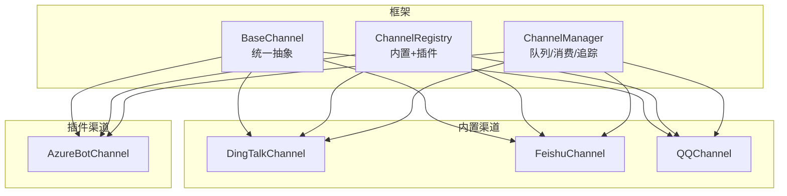
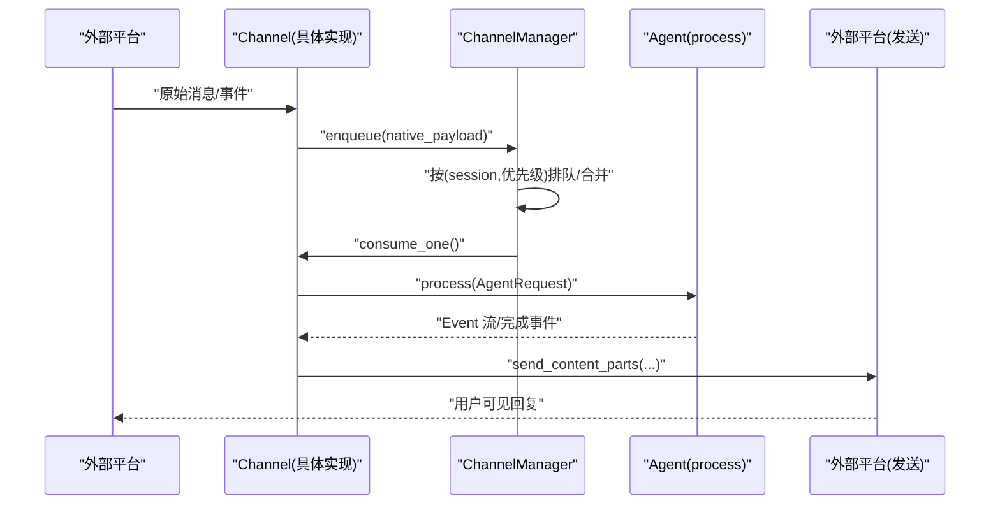
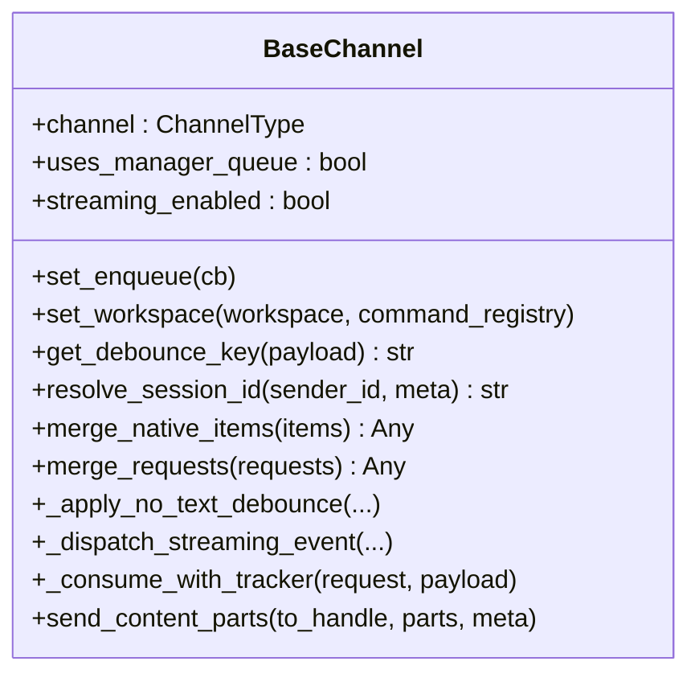
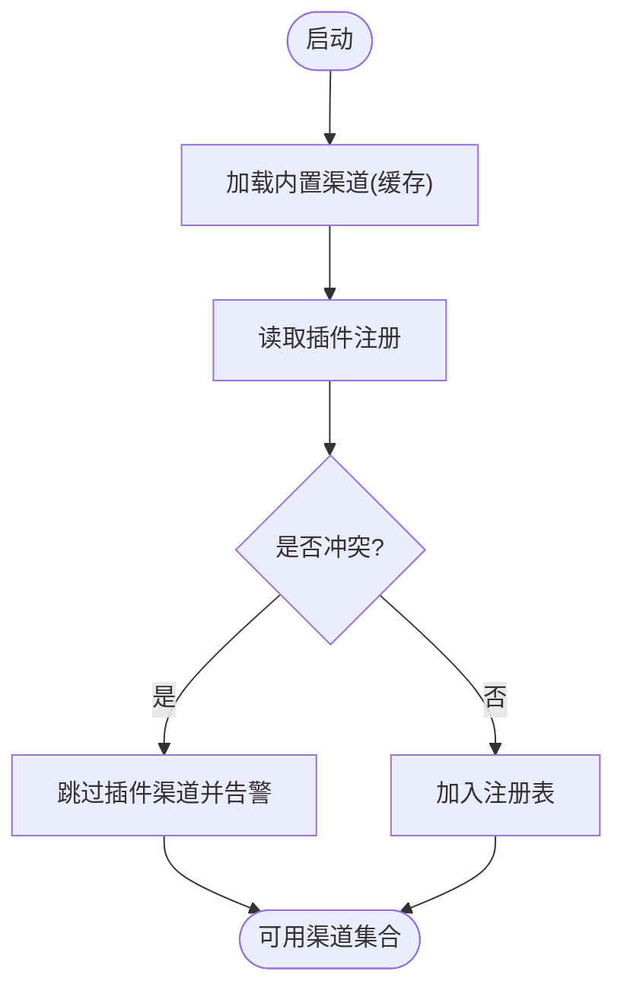
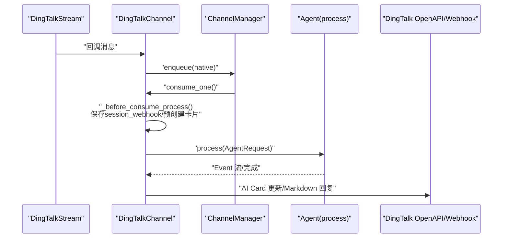
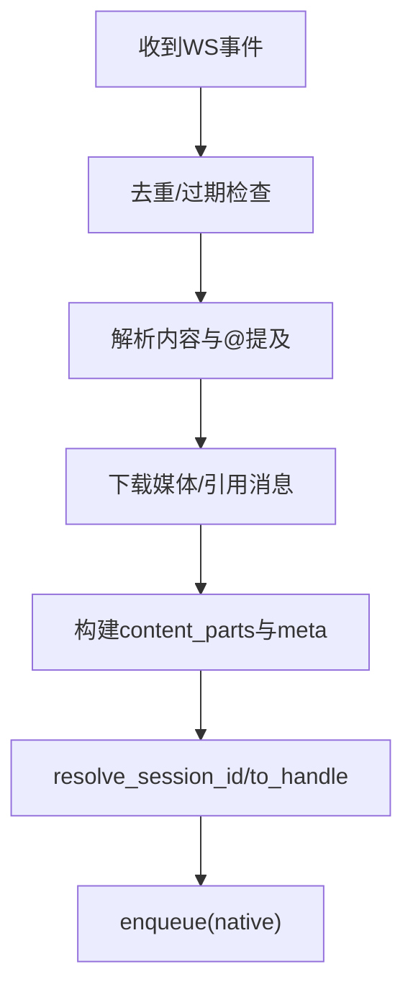
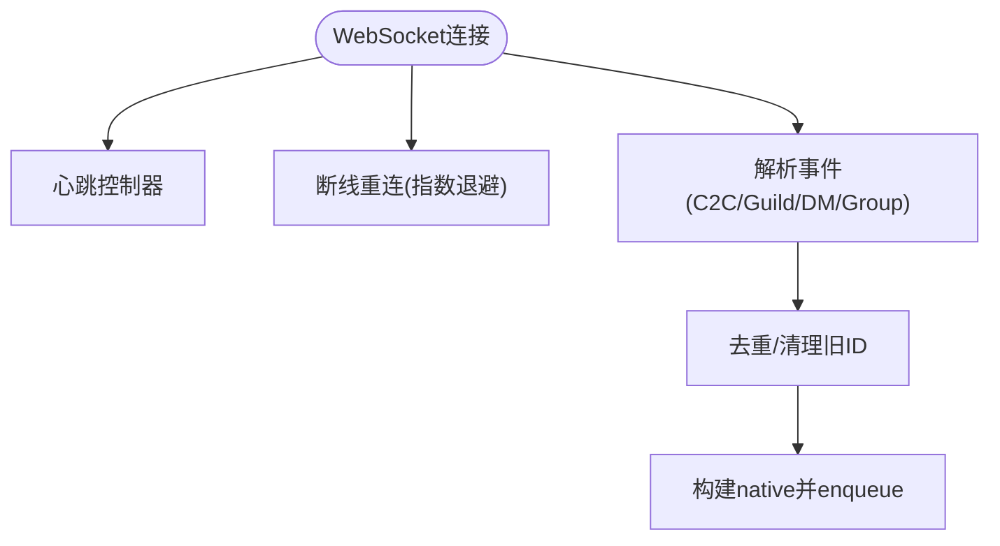
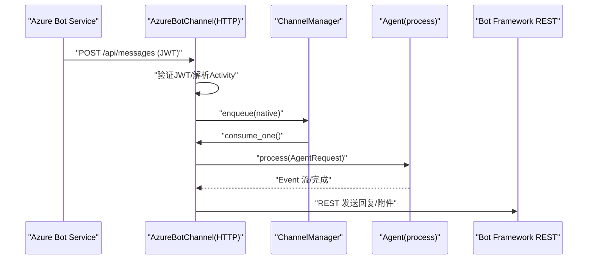
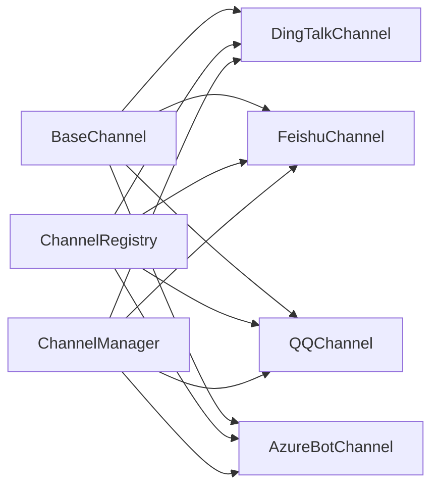

# Channel 插件

<cite>
**本文引用的文件**
- [base.py](file://src/qwenpaw/app/channels/base.py)
- [registry.py](file://src/qwenpaw/app/channels/registry.py)
- [manager.py](file://src/qwenpaw/app/channels/manager.py)
- [dingtalk/channel.py](file://src/qwenpaw/app/channels/dingtalk/channel.py)
- [feishu/channel.py](file://src/qwenpaw/app/channels/feishu/channel.py)
- [qq/channel.py](file://src/qwenpaw/app/channels/qq/channel.py)
- [plugins/api.py](file://src/qwenpaw/plugins/api.py)
- [plugins/registry.py](file://src/qwenpaw/plugins/registry.py)
- [azure_bot/plugin.py](file://plugins/channel/azure_bot/plugin.py)
- [azure_bot/channel.py](file://plugins/channel/azure_bot/channel.py)
</cite>

## 目录
1. [简介](#简介)
2. [项目结构](#项目结构)
3. [核心组件](#核心组件)
4. [架构总览](#架构总览)
5. [详细组件分析](#详细组件分析)
6. [依赖关系分析](#依赖关系分析)
7. [性能考量](#性能考量)
8. [故障排查指南](#故障排查指南)
9. [结论](#结论)
10. [附录](#附录)

## 简介
Channel 插件体系用于扩展新的消息渠道支持，使 QwenPaw 能够接入多种外部平台（如钉钉、飞书、QQ、Azure Bot 等）。其设计围绕统一的 BaseChannel 抽象，屏蔽各渠道差异，提供一致的消息接收、发送与处理生命周期；同时通过注册机制将内置与插件渠道统一纳入系统。

## 项目结构
- 框架层
  - 基类与生命周期：BaseChannel 定义通用能力（去抖、流式分发、访问控制、渲染策略等）
  - 注册表：内置渠道发现与插件渠道注册
  - 管理器：队列、消费循环、任务追踪与统一调度
- 具体渠道实现
  - 钉钉、飞书、QQ 等内置渠道
  - Azure Bot 作为示例的插件渠道
- 插件接口
  - 插件 API 暴露 register_channel 等方法，供插件向框架注册自定义渠道

图表来源
- [base.py:80-179](file://src/qwenpaw/app/channels/base.py#L80-L179)
- [registry.py:18-135](file://src/qwenpaw/app/channels/registry.py#L18-L135)
- [manager.py:1-36](file://src/qwenpaw/app/channels/manager.py#L1-L36)
- [dingtalk/channel.py:107-186](file://src/qwenpaw/app/channels/dingtalk/channel.py#L107-L186)
- [feishu/channel.py:196-270](file://src/qwenpaw/app/channels/feishu/channel.py#L196-L270)
- [qq/channel.py:644-713](file://src/qwenpaw/app/channels/qq/channel.py#L644-L713)
- [azure_bot/channel.py:45-188](file://plugins/channel/azure_bot/channel.py#L45-L188)

章节来源
- [base.py:80-179](file://src/qwenpaw/app/channels/base.py#L80-L179)
- [registry.py:18-135](file://src/qwenpaw/app/channels/registry.py#L18-L135)
- [manager.py:1-36](file://src/qwenpaw/app/channels/manager.py#L1-L36)

## 核心组件
- BaseChannel
  - 职责：统一消息生命周期（接收→入队→消费→发送）、内容渲染、去抖合并、流式事件分发、访问控制、会话路由键生成等
  - 关键能力
    - 去抖与合并：按 session 或时间窗口合并无文本内容，避免碎片化
    - 流式分发：on_streaming_start/delta/end 钩子，支持“思考”与“消息”两类流
    - 访问控制：白名单/黑名单/待审批，支持 DM/群组独立开关
    - 路由键：get_debounce_key/resolve_session_id 决定队列与会话隔离
    - 渲染风格：MessageRenderer 控制工具细节、过滤思考等
- ChannelRegistry
  - 职责：加载内置渠道、聚合插件注册的渠道、冲突检测与缓存
- ChannelManager
  - 职责：为每个 channel 维护队列与消费者循环，调用 consume_one()，并集成 TaskTracker 进行任务级取消与并发控制

章节来源
- [base.py:80-179](file://src/qwenpaw/app/channels/base.py#L80-L179)
- [base.py:180-338](file://src/qwenpaw/app/channels/base.py#L180-L338)
- [base.py:529-585](file://src/qwenpaw/app/channels/base.py#L529-L585)
- [registry.py:46-135](file://src/qwenpaw/app/channels/registry.py#L46-L135)
- [manager.py:1-36](file://src/qwenpaw/app/channels/manager.py#L1-L36)

## 架构总览
下图展示从外部平台到 Agent 处理再到回复的全链路流程，以及 BaseChannel 在其中的角色。

图表来源
- [manager.py:1-36](file://src/qwenpaw/app/channels/manager.py#L1-L36)
- [base.py:529-585](file://src/qwenpaw/app/channels/base.py#L529-L585)
- [dingtalk/channel.py:107-186](file://src/qwenpaw/app/channels/dingtalk/channel.py#L107-L186)
- [feishu/channel.py:196-270](file://src/qwenpaw/app/channels/feishu/channel.py#L196-L270)
- [qq/channel.py:644-713](file://src/qwenpaw/app/channels/qq/channel.py#L644-L713)

## 详细组件分析

### BaseChannel 基类与生命周期
- 生命周期要点
  - 接收：子类解析平台原生消息为 native payload（包含 content_parts、meta、sender/session 信息）
  - 入队：通过 set_enqueue 回调交由 Manager 统一排队
  - 消费：Manager 调用 consume_one()，内部可能触发 _consume_with_tracker 以关联任务追踪
  - 处理：调用 process(AgentRequest)，得到 Event 流
  - 发送：根据渲染策略与流式钩子，调用 send_content_parts 将结果发回平台
- 关键方法
  - get_debounce_key / resolve_session_id：决定去抖与队列路由
  - merge_native_items / merge_requests：同会话多消息合并
  - _apply_no_text_debounce：无文本内容延迟合并，音频优先
  - _dispatch_streaming_event / on_streaming_*：流式分发
  - _access_control_gate：访问控制拦截与提示
  - set_enqueue / set_workspace：与框架对接

图表来源
- [base.py:80-179](file://src/qwenpaw/app/channels/base.py#L80-L179)
- [base.py:180-338](file://src/qwenpaw/app/channels/base.py#L180-L338)
- [base.py:529-585](file://src/qwenpaw/app/channels/base.py#L529-L585)

章节来源
- [base.py:80-179](file://src/qwenpaw/app/channels/base.py#L80-L179)
- [base.py:180-338](file://src/qwenpaw/app/channels/base.py#L180-L338)
- [base.py:529-585](file://src/qwenpaw/app/channels/base.py#L529-L585)

### 注册与发现（内置与插件）
- 内置渠道：由 registry 模块扫描并缓存，失败时仅记录日志（非必需渠道）
- 插件渠道：通过 PluginRegistry.register_channel 注册，禁止覆盖内置 key，类型校验严格
- 获取最终可用渠道集合：get_channel_registry 合并内置与插件

图表来源
- [registry.py:46-135](file://src/qwenpaw/app/channels/registry.py#L46-L135)
- [plugins/registry.py:749-854](file://src/qwenpaw/plugins/registry.py#L749-L854)

章节来源
- [registry.py:46-135](file://src/qwenpaw/app/channels/registry.py#L46-L135)
- [plugins/registry.py:749-854](file://src/qwenpaw/plugins/registry.py#L749-L854)

### 钉钉 Channel 实现要点
- 特点
  - 使用 Stream 长连接接收，ACK 后立即异步处理
  - 支持 Markdown 与 AI Card 两种模式；Card 模式可启用流式更新
  - 会话 Webhook 持久化，支持主动推送与定时任务
  - 消息去重、表情反应、错误恢复
- 配置项（节选）
  - enabled/client_id/client_secret/bot_prefix/message_type/cron_message_type/card_template_id/card_template_key/robot_code/media_dir/streaming_enabled/access_control_dm/access_control_group/require_mention 等
- 关键路径
  - from_env/from_config 构造实例
  - build_agent_request_from_native 构建请求
  - to_handle_from_target/_route_from_handle 路由到存储的 session_webhook
  - _before_consume_process/_on_consume_error 预处理与错误反馈

图表来源
- [dingtalk/channel.py:107-186](file://src/qwenpaw/app/channels/dingtalk/channel.py#L107-L186)
- [dingtalk/channel.py:364-418](file://src/qwenpaw/app/channels/dingtalk/channel.py#L364-L418)
- [dingtalk/channel.py:430-496](file://src/qwenpaw/app/channels/dingtalk/channel.py#L430-L496)
- [dingtalk/channel.py:535-552](file://src/qwenpaw/app/channels/dingtalk/channel.py#L535-L552)

章节来源
- [dingtalk/channel.py:107-186](file://src/qwenpaw/app/channels/dingtalk/channel.py#L107-L186)
- [dingtalk/channel.py:364-418](file://src/qwenpaw/app/channels/dingtalk/channel.py#L364-L418)
- [dingtalk/channel.py:430-496](file://src/qwenpaw/app/channels/dingtalk/channel.py#L430-L496)
- [dingtalk/channel.py:535-552](file://src/qwenpaw/app/channels/dingtalk/channel.py#L535-L552)

### 飞书 Channel 实现要点
- 特点
  - WebSocket 长连接接收，Open API 发送
  - 群聊/私聊会话 ID 规则不同，支持 @提及 识别
  - 交互式卡片处理、昵称缓存、时钟偏移校正
- 配置项（节选）
  - enabled/app_id/app_secret/bot_prefix/encrypt_key/verification_token/domain/streaming_enabled/share_session_in_group/access_control_dm/access_control_group 等
- 关键路径
  - from_env/from_config 构造实例
  - resolve_session_id/to_handle_from_target/_route_from_handle 会话与发送目标解析
  - _on_message_sync/_on_message 去重、解析、下载媒体、入队

图表来源
- [feishu/channel.py:196-270](file://src/qwenpaw/app/channels/feishu/channel.py#L196-L270)
- [feishu/channel.py:385-443](file://src/qwenpaw/app/channels/feishu/channel.py#L385-L443)
- [feishu/channel.py:619-668](file://src/qwenpaw/app/channels/feishu/channel.py#L619-L668)

章节来源
- [feishu/channel.py:196-270](file://src/qwenpaw/app/channels/feishu/channel.py#L196-L270)
- [feishu/channel.py:385-443](file://src/qwenpaw/app/channels/feishu/channel.py#L385-L443)
- [feishu/channel.py:619-668](file://src/qwenpaw/app/channels/feishu/channel.py#L619-L668)

### QQ Channel 实现要点
- 特点
  - WebSocket 接收，HTTP API 发送
  - 心跳控制器、断线重连退避、快速断开保护
  - 富媒体上传/发送、URL 清洗与降级策略
- 配置项（节选）
  - enabled/app_id/client_secret/markdown_enabled/media_dir/max_reconnect_attempts/ack_message/access_control_dm/access_control_group 等
- 关键路径
  - from_env/from_config 构造实例
  - _get_access_token_sync/_get_access_token_async 令牌管理
  - 消息事件规范映射、去重、入队

图表来源
- [qq/channel.py:644-713](file://src/qwenpaw/app/channels/qq/channel.py#L644-L713)
- [qq/channel.py:714-795](file://src/qwenpaw/app/channels/qq/channel.py#L714-L795)
- [qq/channel.py:150-198](file://src/qwenpaw/app/channels/qq/channel.py#L150-L198)

章节来源
- [qq/channel.py:644-713](file://src/qwenpaw/app/channels/qq/channel.py#L644-L713)
- [qq/channel.py:714-795](file://src/qwenpaw/app/channels/qq/channel.py#L714-L795)
- [qq/channel.py:150-198](file://src/qwenpaw/app/channels/qq/channel.py#L150-L198)

### Azure Bot 插件渠道示例
- 插件注册
  - 通过 plugins/api.py 的 register_channel 暴露 label、description、config_fields、icon、doc_url 等元数据
  - 插件入口 plugin.py 中调用 api.register_channel(channel_class=..., ...)
- 渠道实现
  - 独立 aiohttp HTTP 服务接收 Activity，JWT 鉴权后解析消息并 enqueue
  - 支持附件下载、语音识别、群组上下文共享、健康检查与自动重启
- 配置项（节选）
  - app_id/app_password/tenant_id/http_host/http_port/bot_prefix/media_dir/streaming_enabled/access_control_dm/access_control_group/require_mention 等

图表来源
- [azure_bot/plugin.py:14-308](file://plugins/channel/azure_bot/plugin.py#L14-L308)
- [azure_bot/channel.py:45-188](file://plugins/channel/azure_bot/channel.py#L45-L188)
- [azure_bot/channel.py:336-391](file://plugins/channel/azure_bot/channel.py#L336-L391)
- [azure_bot/channel.py:497-557](file://plugins/channel/azure_bot/channel.py#L497-L557)

章节来源
- [plugins/api.py:498-520](file://src/qwenpaw/plugins/api.py#L498-L520)
- [plugins/registry.py:749-854](file://src/qwenpaw/plugins/registry.py#L749-L854)
- [azure_bot/plugin.py:14-308](file://plugins/channel/azure_bot/plugin.py#L14-L308)
- [azure_bot/channel.py:45-188](file://plugins/channel/azure_bot/channel.py#L45-L188)
- [azure_bot/channel.py:336-391](file://plugins/channel/azure_bot/channel.py#L336-L391)
- [azure_bot/channel.py:497-557](file://plugins/channel/azure_bot/channel.py#L497-L557)

## 依赖关系分析
- 耦合与内聚
  - BaseChannel 高内聚地封装了通用逻辑，具体渠道低耦合地实现平台适配
  - Registry 解耦了渠道发现与实现，Manager 解耦了调度与业务处理
- 外部依赖
  - 钉钉：dingtalk_stream、alibabacloud_dingtalk_* SDK
  - 飞书：lark_oapi（含 WS 客户端）
  - QQ：aiohttp、平台 WebSocket/HTTP API
  - Azure Bot：aiohttp、MSAL/JWT 校验
- 潜在环依赖
  - 通过注册表与回调（enqueue）避免直接强耦合

图表来源
- [base.py:80-179](file://src/qwenpaw/app/channels/base.py#L80-L179)
- [registry.py:46-135](file://src/qwenpaw/app/channels/registry.py#L46-L135)
- [manager.py:1-36](file://src/qwenpaw/app/channels/manager.py#L1-L36)
- [dingtalk/channel.py:107-186](file://src/qwenpaw/app/channels/dingtalk/channel.py#L107-L186)
- [feishu/channel.py:196-270](file://src/qwenpaw/app/channels/feishu/channel.py#L196-L270)
- [qq/channel.py:644-713](file://src/qwenpaw/app/channels/qq/channel.py#L644-L713)
- [azure_bot/channel.py:45-188](file://plugins/channel/azure_bot/channel.py#L45-L188)

章节来源
- [registry.py:46-135](file://src/qwenpaw/app/channels/registry.py#L46-L135)
- [manager.py:1-36](file://src/qwenpaw/app/channels/manager.py#L1-L36)

## 性能考量
- 去抖与合并
  - 无文本内容缓冲合并，减少频繁小消息；音频优先立即处理
  - 同一会话的多条请求合并，降低重复处理开销
- 流式优化
  - 最小间隔与超时保护，避免高频 flush 导致下游压力
  - 分片（index 变化）自动拆分流式框，提升可读性
- 队列与并发
  - 基于 (channel, session, priority) 的队列，避免跨会话干扰
  - TaskTracker 保证单会话串行执行，支持 /stop 取消
- 网络与重试
  - 飞书：时钟偏移校正、静默连接检测、过期消息丢弃
  - QQ：指数退避重连、快速断开保护、URL 清洗与降级
  - 钉钉：Webhook 失效清理与 Open API 回退

[本节为通用指导，不直接分析具体文件]

## 故障排查指南
- 常见症状与定位
  - 无法接收消息：检查渠道是否启用、凭据是否正确、端口占用（Azure Bot）
  - 消息未送达：查看 session_webhook 是否过期（钉钉），或 receive_id 是否缺失（飞书）
  - 重复消息：确认去重逻辑（msg_id/chat_id）是否生效
  - 流式卡顿：调整 _STREAM_DELTA_MIN_INTERVAL_S 与 flush 超时
- 诊断建议
  - 开启 debug 日志，关注 enqueue/consume/send 关键节点
  - 使用 doctor_connectivity_notes 做连通性自检（可覆写）
  - 对访问控制场景，检查白名单/黑名单/待审批状态

章节来源
- [dingtalk/channel.py:643-676](file://src/qwenpaw/app/channels/dingtalk/channel.py#L643-L676)
- [feishu/channel.py:495-550](file://src/qwenpaw/app/channels/feishu/channel.py#L495-L550)
- [qq/channel.py:150-198](file://src/qwenpaw/app/channels/qq/channel.py#L150-L198)
- [azure_bot/channel.py:448-491](file://plugins/channel/azure_bot/channel.py#L448-L491)

## 结论
Channel 插件体系通过 BaseChannel 抽象与统一注册/调度机制，实现了多渠道接入的高内聚与低耦合。开发者只需聚焦平台适配与消息转换，即可快速扩展新渠道。结合去抖、流式、访问控制与健壮的重连/降级策略，可在复杂生产环境中稳定运行。

[本节为总结，不直接分析具体文件]

## 附录

### Channel 插件开发指南
- 步骤概览
  1) 新建 Channel 类继承 BaseChannel，实现必要方法（如 from_env/from_config、build_agent_request_from_native、to_handle_from_target 等）
  2) 在插件入口中通过 api.register_channel 注册，提供 label、description、config_fields、icon、doc_url
  3) 在 __init__ 中初始化连接、线程/事件循环、中间态存储（如 webhook/receive_id）
  4) 实现消息接收与入队逻辑，必要时覆写 merge_native_items/get_debounce_key
  5) 实现发送逻辑（send_content_parts），遵循 BaseChannel 的渲染与流式约定
- 消息格式转换
  - 将平台原生消息转换为 content_parts（Text/Image/Audio/File/Video/Refusal）
  - 填充 meta（is_group、conversation_id、message_id 等），便于去重与路由
- 错误处理
  - 捕获网络/鉴权异常，返回友好提示；必要时走降级策略（如 Markdown→纯文本）
  - 对不可恢复错误，清理无效会话句柄（如钉钉 session_webhook）
- 性能优化
  - 合理设置 _STREAM_DELTA_MIN_INTERVAL_S 与 flush 超时
  - 使用本地缓存（token/nickname/webhook）减少远程调用
  - 批量/合并发送，避免频繁 IO

章节来源
- [plugins/api.py:498-520](file://src/qwenpaw/plugins/api.py#L498-L520)
- [plugins/registry.py:749-854](file://src/qwenpaw/plugins/registry.py#L749-L854)
- [base.py:180-338](file://src/qwenpaw/app/channels/base.py#L180-L338)
- [dingtalk/channel.py:535-552](file://src/qwenpaw/app/channels/dingtalk/channel.py#L535-L552)
- [feishu/channel.py:466-494](file://src/qwenpaw/app/channels/feishu/channel.py#L466-L494)
- [qq/channel.py:216-283](file://src/qwenpaw/app/channels/qq/channel.py#L216-L283)