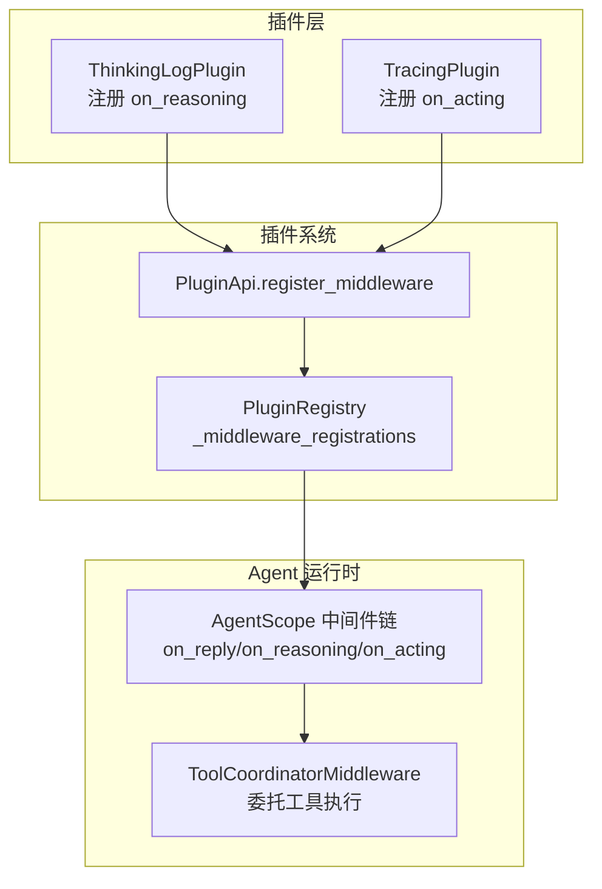
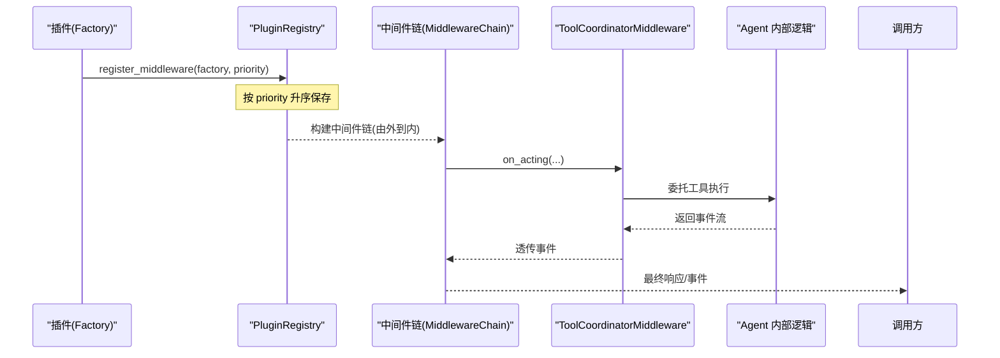
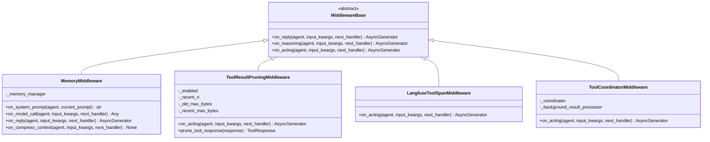
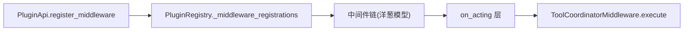

# Middleware 插件

<cite>
**本文引用的文件**
- [src/qwenpaw/agents/middlewares.py](file://src/qwenpaw/agents/middlewares.py)
- [src/qwenpaw/plugins/api.py](file://src/qwenpaw/plugins/api.py)
- [src/qwenpaw/plugins/registry.py](file://src/qwenpaw/plugins/registry.py)
- [plugins/middleware-demo/thinking-log-middleware/thinking_log_plugin.py](file://plugins/middleware-demo/thinking-log-middleware/thinking_log_plugin.py)
- [plugins/middleware-demo/tracing-middleware/tracing_plugin.py](file://plugins/middleware-demo/tracing-middleware/tracing_plugin.py)
- [plugins/middleware-demo/README.md](file://plugins/middleware-demo/README.md)
- [src/qwenpaw/tool_calls/_middleware.py](file://src/qwenpaw/tool_calls/_middleware.py)
</cite>

## 目录
1. [简介](#简介)
2. [项目结构](#项目结构)
3. [核心组件](#核心组件)
4. [架构总览](#架构总览)
5. [详细组件分析](#详细组件分析)
6. [依赖关系分析](#依赖关系分析)
7. [性能与执行顺序](#性能与执行顺序)
8. [开发指南](#开发指南)
9. [故障排查](#故障排查)
10. [结论](#结论)

## 简介
本文件面向开发者，系统性说明 QwenPaw 的 Middleware 插件机制：如何通过插件注册中间件工厂，在 Agent 请求处理链路中注入中间件；中间件的执行顺序、链式调用模型（洋葱模型）；以及常见通用能力（日志记录、性能监控、请求限流等）的实现思路。同时说明中间件与 Hook 系统的边界与协作方式。

## 项目结构
围绕 Middleware 插件的关键位置如下：
- 插件 API 暴露注册入口：PluginApi.register_middleware
- 插件注册中心：PluginRegistry 维护中间件工厂列表及排序
- 内置中间件实现：MemoryMiddleware、ToolResultPruningMiddleware、LangfuseToolSpanMiddleware
- 工具执行桥接中间件：ToolCoordinatorMiddleware
- 示例插件：tracing-middleware、thinking-log-middleware

图示来源
- [src/qwenpaw/plugins/api.py:448-481](file://src/qwenpaw/plugins/api.py#L448-L481)
- [src/qwenpaw/plugins/registry.py:179-207](file://src/qwenpaw/plugins/registry.py#L179-L207)
- [plugins/middleware-demo/thinking-log-middleware/thinking_log_plugin.py:59-66](file://plugins/middleware-demo/thinking-log-middleware/thinking_log_plugin.py#L59-L66)
- [plugins/middleware-demo/tracing-middleware/tracing_plugin.py:72-79](file://plugins/middleware-demo/tracing-middleware/tracing_plugin.py#L72-L79)
- [src/qwenpaw/tool_calls/_middleware.py:19-56](file://src/qwenpaw/tool_calls/_middleware.py#L19-L56)

章节来源
- [src/qwenpaw/plugins/api.py:448-481](file://src/qwenpaw/plugins/api.py#L448-L481)
- [src/qwenpaw/plugins/registry.py:179-207](file://src/qwenpaw/plugins/registry.py#L179-L207)
- [plugins/middleware-demo/README.md:1-51](file://plugins/middleware-demo/README.md#L1-L51)

## 核心组件
- PluginApi.register_middleware：插件侧注册中间件工厂的统一入口，将工厂与优先级写入注册表。
- PluginRegistry._middleware_registrations：按 priority 升序排列的工厂列表，priority 越小越靠外（洋葱外层）。
- 中间件基类：继承自 agentscope.middleware.MiddlewareBase，通过覆写 on_reply/on_reasoning/on_acting 等钩子参与请求处理。
- 内置中间件：
  - MemoryMiddleware：记忆增强（系统提示注入、自动记忆搜索与归档）
  - ToolResultPruningMiddleware：工具结果裁剪，控制上下文大小
  - LangfuseToolSpanMiddleware：工具执行观测上报
- 工具执行桥接中间件：ToolCoordinatorMiddleware，将 on_acting 委托给 ToolCoordinator 执行工具并透传事件。

章节来源
- [src/qwenpaw/plugins/api.py:448-481](file://src/qwenpaw/plugins/api.py#L448-L481)
- [src/qwenpaw/plugins/registry.py:179-207](file://src/qwenpaw/plugins/registry.py#L179-L207)
- [src/qwenpaw/agents/middlewares.py:46-329](file://src/qwenpaw/agents/middlewares.py#L46-L329)
- [src/qwenpaw/agents/middlewares.py:331-652](file://src/qwenpaw/agents/middlewares.py#L331-L652)
- [src/qwenpaw/agents/middlewares.py:655-699](file://src/qwenpaw/agents/middlewares.py#L655-L699)
- [src/qwenpaw/tool_calls/_middleware.py:19-56](file://src/qwenpaw/tool_calls/_middleware.py#L19-L56)

## 架构总览
中间件以“洋葱模型”包裹 Agent 的推理循环。每个插件提供一个工厂函数，在每次请求组装时根据上下文和 Agent 配置决定是否激活某个中间件实例。多个中间件按优先级由外向内依次包裹，形成链式调用。

图示来源
- [src/qwenpaw/plugins/api.py:448-481](file://src/qwenpaw/plugins/api.py#L448-L481)
- [src/qwenpaw/plugins/registry.py:179-207](file://src/qwenpaw/plugins/registry.py#L179-L207)
- [src/qwenpaw/tool_calls/_middleware.py:35-56](file://src/qwenpaw/tool_calls/_middleware.py#L35-L56)

## 详细组件分析

### 中间件接口与实现要求
- 继承 agentscope.middleware.MiddlewareBase
- 可覆写的关键钩子：
  - on_reply：包裹整个回复生成过程，适合统计耗时、统一错误处理、输出后处理
  - on_reasoning：拦截模型推理流事件（如思维链片段、文本增量），适合实时日志、审计、限流策略前置判断
  - on_acting：拦截工具调用阶段，适合工具级监控、权限校验、结果裁剪、观测上报
- 工厂函数签名：factory(ctx, agent_config) -> MiddlewareBase | None
  - ctx：包含 session_id、agent_id、workspace_dir 等上下文信息
  - agent_config：当前 Agent 的配置对象
  - 返回 None 表示该中间件本次不生效

章节来源
- [plugins/middleware-demo/thinking-log-middleware/thinking_log_plugin.py:23-56](file://plugins/middleware-demo/thinking-log-middleware/thinking_log_plugin.py#L23-L56)
- [plugins/middleware-demo/tracing-middleware/tracing_plugin.py:24-69](file://plugins/middleware-demo/tracing-middleware/tracing_plugin.py#L24-L69)
- [src/qwenpaw/plugins/api.py:448-481](file://src/qwenpaw/plugins/api.py#L448-L481)
- [src/qwenpaw/plugins/registry.py:179-207](file://src/qwenpaw/plugins/registry.py#L179-L207)

#### 类图：内置中间件与工具桥接中间件

图示来源
- [src/qwenpaw/agents/middlewares.py:46-329](file://src/qwenpaw/agents/middlewares.py#L46-L329)
- [src/qwenpaw/agents/middlewares.py:331-652](file://src/qwenpaw/agents/middlewares.py#L331-L652)
- [src/qwenpaw/agents/middlewares.py:655-699](file://src/qwenpaw/agents/middlewares.py#L655-L699)
- [src/qwenpaw/tool_calls/_middleware.py:19-56](file://src/qwenpaw/tool_calls/_middleware.py#L19-L56)

### 执行顺序与链式调用机制
- 注册顺序：通过 PluginApi.register_middleware 注册的工厂会被存入 PluginRegistry 的 _middleware_registrations 列表
- 排序规则：按 priority 升序排列，数值越小越靠近洋葱外层（先入后出）
- 每请求一次：在 Agent 组装阶段，遍历所有已注册工厂，传入 (ctx, agent_config)，若返回非 None，则构造对应中间件实例并加入链
- 链式调用：遵循 AgentScope 2.0 洋葱模型，on_reply → on_reasoning → on_acting 层层包裹，next_handler 负责传递到下一层

章节来源
- [src/qwenpaw/plugins/api.py:448-481](file://src/qwenpaw/plugins/api.py#L448-L481)
- [src/qwenpaw/plugins/registry.py:179-207](file://src/qwenpaw/plugins/registry.py#L179-L207)
- [plugins/middleware-demo/README.md:35-51](file://plugins/middleware-demo/README.md#L35-L51)

### 内置中间件要点
- MemoryMiddleware
  - 作用：在系统提示中注入记忆引导；在模型调用前进行自动记忆检索并注入相关消息；在回复完成后按策略触发自动记忆归档；压缩上下文前按需提前归档
  - 关键点：区分自动化来源请求（cron/heartbeat）跳过部分逻辑；基于用户轮次标记跟踪待归档范围
- ToolResultPruningMiddleware
  - 作用：对工具输出进行分级裁剪，避免上下文膨胀；支持豁免工具名或文件扩展名；保留完整输出至文件以便回溯
  - 关键点：最近 N 条与历史结果采用不同阈值；多块文本分别裁剪并维护元数据
- LangfuseToolSpanMiddleware
  - 作用：将工具执行作为观测节点上报，便于追踪与可视化
- ToolCoordinatorMiddleware
  - 作用：将 on_acting 委托给 ToolCoordinator 执行工具，透传事件流，保持与 Agent 运行时的无缝集成

章节来源
- [src/qwenpaw/agents/middlewares.py:46-329](file://src/qwenpaw/agents/middlewares.py#L46-L329)
- [src/qwenpaw/agents/middlewares.py:331-652](file://src/qwenpaw/agents/middlewares.py#L331-L652)
- [src/qwenpaw/agents/middlewares.py:655-699](file://src/qwenpaw/agents/middlewares.py#L655-L699)
- [src/qwenpaw/tool_calls/_middleware.py:19-56](file://src/qwenpaw/tool_calls/_middleware.py#L19-L56)

### 示例插件解析
- thinking-log-middleware
  - 钩子：on_reasoning
  - 行为：打印思维链与文本增量事件到标准输出，始终启用
  - 注册：priority=80
- tracing-middleware
  - 钩子：on_acting
  - 行为：记录工具名称、输入与耗时，仅在环境变量开启时启用
  - 注册：priority=50

章节来源
- [plugins/middleware-demo/thinking-log-middleware/thinking_log_plugin.py:23-66](file://plugins/middleware-demo/thinking-log-middleware/thinking_log_plugin.py#L23-L66)
- [plugins/middleware-demo/tracing-middleware/tracing_plugin.py:24-79](file://plugins/middleware-demo/tracing-middleware/tracing_plugin.py#L24-L79)
- [plugins/middleware-demo/README.md:1-51](file://plugins/middleware-demo/README.md#L1-L51)

## 依赖关系分析
- 插件侧通过 PluginApi.register_middleware 向 PluginRegistry 登记工厂
- PluginRegistry 维护并按 priority 排序
- 运行时在 Agent 组装阶段调用各工厂，构建中间件链
- 工具执行路径上，ToolCoordinatorMiddleware 位于 on_acting 层，负责实际工具调度

图示来源
- [src/qwenpaw/plugins/api.py:448-481](file://src/qwenpaw/plugins/api.py#L448-L481)
- [src/qwenpaw/plugins/registry.py:179-207](file://src/qwenpaw/plugins/registry.py#L179-L207)
- [src/qwenpaw/tool_calls/_middleware.py:35-56](file://src/qwenpaw/tool_calls/_middleware.py#L35-L56)

章节来源
- [src/qwenpaw/plugins/api.py:448-481](file://src/qwenpaw/plugins/api.py#L448-L481)
- [src/qwenpaw/plugins/registry.py:179-207](file://src/qwenpaw/plugins/registry.py#L179-L207)
- [src/qwenpaw/tool_calls/_middleware.py:19-56](file://src/qwenpaw/tool_calls/_middleware.py#L19-L56)

## 性能与执行顺序
- 执行顺序
  - 外层中间件先执行 on_* 的前置逻辑，再调用 next_handler 进入内层，最后在内层返回后进行后置逻辑
  - priority 越小越靠外，建议将“全局性、低开销”的中间件放在更外层
- 性能考量
  - 避免在高频钩子中进行阻塞 I/O；必要时使用异步或线程池
  - 对大对象（如工具输出）谨慎拷贝，优先就地修改或引用
  - 条件启用：在工厂中依据环境或配置返回 None 以跳过中间件，减少无谓开销

[本节为通用指导，无需源码引用]

## 开发指南

### 如何注册一个中间件插件
- 在插件模块中定义一个中间件类，继承 MiddlewareBase，并实现需要的钩子
- 提供工厂函数 factory(ctx, agent_config)，根据上下文决定返回中间件实例或 None
- 在插件的 register(api) 中调用 api.register_middleware(factory, priority=N)

章节来源
- [plugins/middleware-demo/thinking-log-middleware/thinking_log_plugin.py:59-66](file://plugins/middleware-demo/thinking-log-middleware/thinking_log_plugin.py#L59-L66)
- [plugins/middleware-demo/tracing-middleware/tracing_plugin.py:72-79](file://plugins/middleware-demo/tracing-middleware/tracing_plugin.py#L72-L79)
- [src/qwenpaw/plugins/api.py:448-481](file://src/qwenpaw/plugins/api.py#L448-L481)

### 通用功能实现示例思路
- 日志记录
  - 在 on_reply 中记录请求开始/结束时间、会话标识、Agent 标识
  - 在 on_reasoning 中采样记录推理事件，避免全量落盘
  - 在 on_acting 中记录工具调用名、参数摘要、耗时
- 性能监控
  - 使用高精度计时器测量 each hook 的执行时长
  - 聚合指标上报到监控系统（如 Prometheus/Grafana）
- 请求限流
  - 在 on_reasoning 或 on_acting 前置检查令牌桶/滑动窗口计数
  - 超限直接短路返回错误或降级响应
- 安全与合规
  - 在 on_acting 前置做权限校验、敏感词过滤、沙箱策略评估
  - 在 on_reply 后置做输出脱敏、审计日志写入
- 可观测性
  - 结合 LangfuseToolSpanMiddleware 的思路，为自定义操作创建观测节点
  - 在 on_acting 中收集工具输入/输出摘要，关联 trace id

[本节为通用指导，无需源码引用]

### 与 Hook 系统的集成方式
- 中间件（Middleware）聚焦于单个 Agent 的推理循环（on_reply/on_reasoning/on_acting），属于“请求级”切面
- 应用级 Hook（Runtime Hooks）用于编排构建/执行阶段、跨工作区生命周期等，二者职责分离
- 典型协作模式：
  - 在启动 Hook 中初始化中间件所需资源（连接池、客户端）
  - 在中间件中读取运行时上下文（session_id、agent_id、workspace_dir）完成具体业务
  - 在卸载 Hook 中释放中间件持有的资源

章节来源
- [src/qwenpaw/runtime/hooks.py:1-43](file://src/qwenpaw/runtime/hooks.py#L1-L43)

## 故障排查
- 中间件未生效
  - 确认插件是否安装且成功加载
  - 检查工厂是否返回 None（例如环境变量未设置）
  - 核对 priority 是否符合预期
- 工具输出过大导致上下文溢出
  - 启用或调整 ToolResultPruningMiddleware 的参数（recent_n、阈值、豁免项）
- 观测数据缺失
  - 确认 Langfuse 客户端可用，或在 on_acting 中捕获异常并记录日志
- 性能退化
  - 定位高开销中间件，考虑降低采样率、异步化或条件启用

章节来源
- [src/qwenpaw/agents/middlewares.py:331-652](file://src/qwenpaw/agents/middlewares.py#L331-L652)
- [src/qwenpaw/agents/middlewares.py:655-699](file://src/qwenpaw/agents/middlewares.py#L655-L699)
- [plugins/middleware-demo/tracing-middleware/tracing_plugin.py:58-69](file://plugins/middleware-demo/tracing-middleware/tracing_plugin.py#L58-L69)

## 结论
QwenPaw 的 Middleware 插件体系以轻量、可扩展的方式为 Agent 请求处理提供了横切能力。通过统一的注册入口与优先级排序，开发者可以灵活组合日志、监控、限流、安全、可观测性等能力，并以极小侵入成本嵌入到 Agent 的核心推理流程中。配合应用级 Hook，可实现从启动到卸载的全生命周期治理。