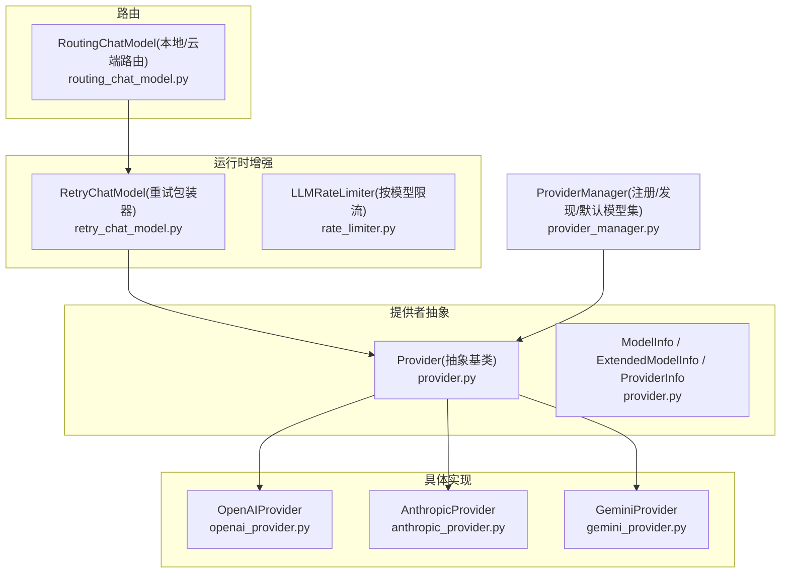
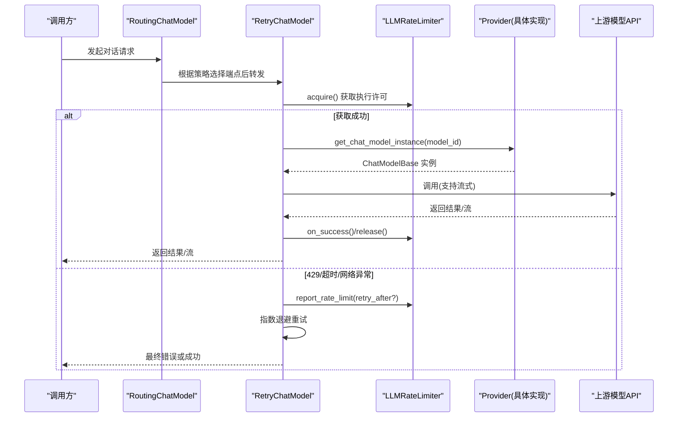
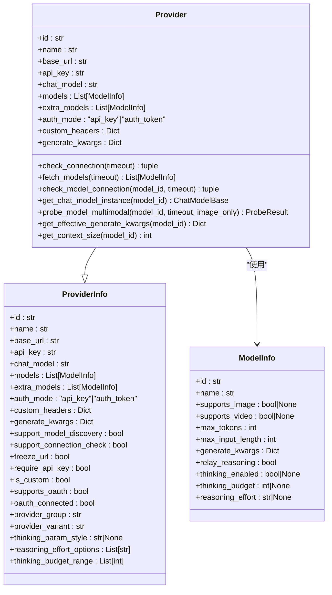
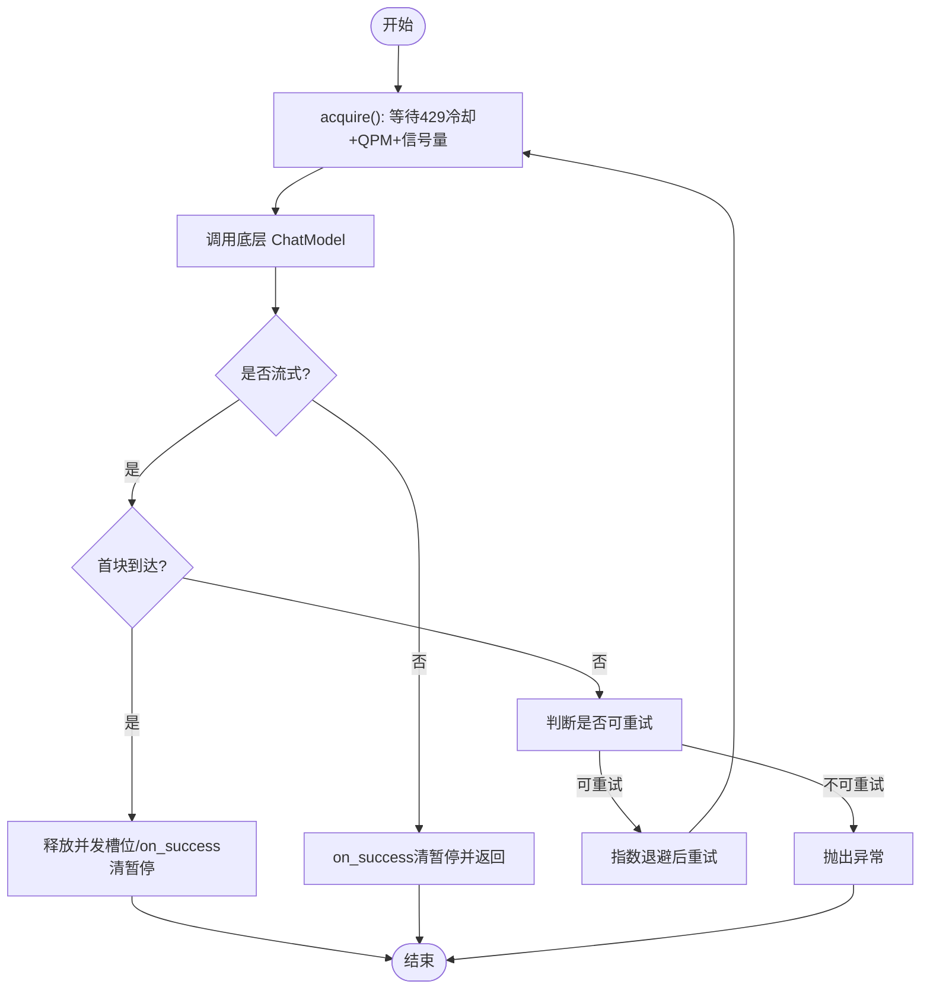
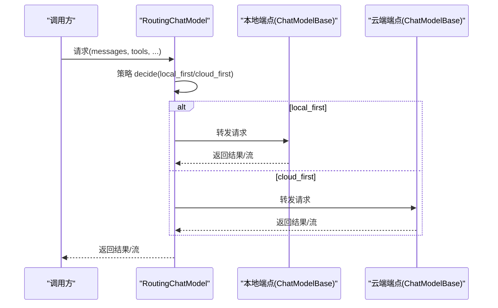
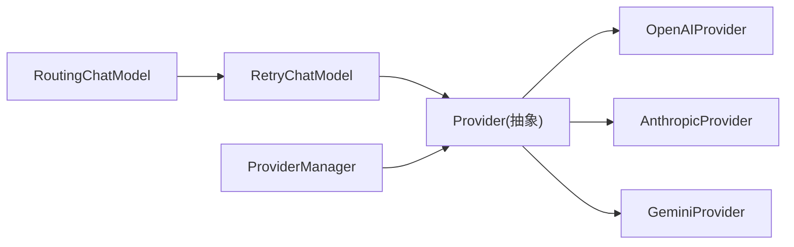

# Provider 插件

<cite>
**本文引用的文件**   
- [provider.py](file://src/qwenpaw/providers/provider.py)
- [provider_manager.py](file://src/qwenpaw/providers/provider_manager.py)
- [openai_provider.py](file://src/qwenpaw/providers/openai_provider.py)
- [anthropic_provider.py](file://src/qwenpaw/providers/anthropic_provider.py)
- [gemini_provider.py](file://src/qwenpaw/providers/gemini_provider.py)
- [rate_limiter.py](file://src/qwenpaw/providers/rate_limiter.py)
- [retry_chat_model.py](file://src/qwenpaw/providers/retry_chat_model.py)
- [routing_chat_model.py](file://src/qwenpaw/agents/routing_chat_model.py)
</cite>

## 目录
1. [简介](#简介)
2. [项目结构](#项目结构)
3. [核心组件](#核心组件)
4. [架构总览](#架构总览)
5. [详细组件分析](#详细组件分析)
6. [依赖关系分析](#依赖关系分析)
7. [性能与可靠性](#性能与可靠性)
8. [故障排查指南](#故障排查指南)
9. [结论](#结论)
10. [附录：开发模板与适配示例](#附录开发模板与适配示例)

## 简介
本文件面向“Provider 插件”类型，系统性阐述如何扩展 AI 模型提供商支持。内容涵盖：
- ProviderPlugin 接口（抽象基类）的实现要求：模型调用、流式响应、错误处理、能力探测等
- Provider 配置模型：API 密钥管理、认证模式、上下文窗口、思考参数、生成参数合并策略等
- 速率限制与重试机制：按模型隔离的 QPM 滑动窗口、并发信号量、429 全局暂停与抖动
- 多 Provider 路由与负载均衡：本地/云端选择、按策略路由到具体 Provider 实例
- 主流提供商适配示例：OpenAI、Anthropic、Google Gemini 的接入要点与差异

## 项目结构
Provider 相关代码集中在 providers 子包中，提供统一的抽象基类与多个具体实现；同时在 agents 层提供路由能力，在 retry 与 rate limiter 模块提供通用横切能力。

图表来源
- [provider.py:274-659](file://src/qwenpaw/providers/provider.py#L274-L659)
- [openai_provider.py:67-248](file://src/qwenpaw/providers/openai_provider.py#L67-L248)
- [anthropic_provider.py:72-303](file://src/qwenpaw/providers/anthropic_provider.py#L72-L303)
- [gemini_provider.py:161-334](file://src/qwenpaw/providers/gemini_provider.py#L161-L334)
- [retry_chat_model.py:318-558](file://src/qwenpaw/providers/retry_chat_model.py#L318-L558)
- [rate_limiter.py:39-264](file://src/qwenpaw/providers/rate_limiter.py#L39-L264)
- [routing_chat_model.py:64-130](file://src/qwenpaw/agents/routing_chat_model.py#L64-L130)
- [provider_manager.py:1-800](file://src/qwenpaw/providers/provider_manager.py#L1-L800)

章节来源
- [provider.py:274-659](file://src/qwenpaw/providers/provider.py#L274-L659)
- [provider_manager.py:1-800](file://src/qwenpaw/providers/provider_manager.py#L1-L800)

## 核心组件
- Provider 抽象基类
  - 定义统一接口：连接检查、模型列表获取、模型连通性检查、模型增删、上下文窗口解析、聊天模型实例化、多模态能力探测等
  - 提供配置合并与序列化能力：generate_kwargs 深度合并、max_tokens 注入、thinking 参数透传、上下文窗口解析
- ModelInfo / ProviderInfo
  - 描述模型元数据（是否多模态、最大输出 token、上下文窗口、推理开关、思考预算/努力等级等）
  - 描述 Provider 元数据（认证模式、OAuth 支持、自定义头、分组/变体、思考 UI 风格等）
- RetryChatModel
  - 对任意 ChatModelBase 进行透明重试包装：指数退避、可重试状态码识别、429 全局暂停协调、流式失败重试
- LLMRateLimiter
  - 按 provider_id:model_name 维度隔离限流：QPM 滑动窗口 + 并发信号量 + 429 暂停 + 抖动
- RoutingChatModel
  - 基于策略在本地/云端之间选择端点并转发请求

章节来源
- [provider.py:20-272](file://src/qwenpaw/providers/provider.py#L20-L272)
- [provider.py:274-659](file://src/qwenpaw/providers/provider.py#L274-L659)
- [retry_chat_model.py:318-558](file://src/qwenpaw/providers/retry_chat_model.py#L318-L558)
- [rate_limiter.py:39-264](file://src/qwenpaw/providers/rate_limiter.py#L39-L264)
- [routing_chat_model.py:64-130](file://src/qwenpaw/agents/routing_chat_model.py#L64-L130)

## 架构总览
Provider 插件通过抽象基类统一对外暴露能力，具体提供商实现各自客户端构造、鉴权方式、模型列表拉取、多模态探测等细节。上层通过 RetryChatModel 获得一致的重试与限流体验，并通过 RoutingChatModel 实现本地/云端的路由决策。

图表来源
- [routing_chat_model.py:90-130](file://src/qwenpaw/agents/routing_chat_model.py#L90-L130)
- [retry_chat_model.py:441-558](file://src/qwenpaw/providers/retry_chat_model.py#L441-L558)
- [rate_limiter.py:91-264](file://src/qwenpaw/providers/rate_limiter.py#L91-L264)
- [openai_provider.py:192-248](file://src/qwenpaw/providers/openai_provider.py#L192-L248)
- [anthropic_provider.py:249-303](file://src/qwenpaw/providers/anthropic_provider.py#L249-L303)
- [gemini_provider.py:302-334](file://src/qwenpaw/providers/gemini_provider.py#L302-L334)

## 详细组件分析

### Provider 抽象与配置模型
- 关键职责
  - 抽象方法：check_connection、fetch_models、check_model_connection、get_chat_model_instance、probe_model_multimodal
  - 配置更新：update_config 支持 name/base_url/api_key/chat_model/custom_headers/auth_mode 等字段
  - 生成参数合并：get_effective_generate_kwargs 将 provider 级 generate_kwargs 与 model 级 merge，并注入 max_tokens
  - 上下文窗口：get_context_size 结合静态目录与显式配置，避免本地服务误判
  - 思考参数：_get_thinking_config/_apply_thinking_config 为子类提供 thinking 映射钩子
- 配置要点
  - api_key_prefix/api_key_prefixes：校验前缀，兼容不同厂商格式
  - auth_mode：api_key 或 auth_token（Anthropic 兼容场景）
  - custom_headers：每请求附加头（如 DashScope 平台标识）
  - support_model_discovery/support_connection_check：控制动态发现与连接检测能力
  - thinking_param_style/reasoning_effort_options/thinking_budget_range：UI 与行为控制

图表来源
- [provider.py:20-272](file://src/qwenpaw/providers/provider.py#L20-L272)
- [provider.py:274-659](file://src/qwenpaw/providers/provider.py#L274-L659)

章节来源
- [provider.py:20-272](file://src/qwenpaw/providers/provider.py#L20-L272)
- [provider.py:274-659](file://src/qwenpaw/providers/provider.py#L274-L659)

### OpenAI 兼容 Provider
- 特性
  - 支持 OpenAI 及兼容端点（含 DashScope 兼容模式），自动注入平台标识头
  - 模型列表拉取与去重，模型连通性探测（最小 ping + 流式消费）
  - 多模态探测：图片语义验证（红图主色）、视频 URL/base64 回退策略
  - 针对 gpt-5/o* 系列使用 max_completion_tokens 而非 max_tokens
- 关键点
  - get_chat_model_instance 构建 OpenAIChatModelCompat，注入 formatter、context_size、headers
  - probe_model_multimodal 分阶段探测，避免误报

章节来源
- [openai_provider.py:67-248](file://src/qwenpaw/providers/openai_provider.py#L67-L248)
- [openai_provider.py:249-587](file://src/qwenpaw/providers/openai_provider.py#L249-L587)

### Anthropic Provider
- 特性
  - 支持 api_key 与 auth_token 两种认证模式；当使用 auth_token 时，通过自定义传输剥离 x-api-key 头以避免冲突
  - 模型列表拉取与连接检测，若 models.list 不可用则回退至 messages.create 轻量探测
  - 多模态探测：仅图片（无视频），采用 base64 图片源与语义判定
- 关键点
  - _client 根据 auth_mode 切换构造参数
  - get_chat_model_instance 返回带自定义头的兼容模型包装

章节来源
- [anthropic_provider.py:72-303](file://src/qwenpaw/providers/anthropic_provider.py#L72-L303)
- [anthropic_provider.py:304-406](file://src/qwenpaw/providers/anthropic_provider.py#L304-L406)

### Google Gemini Provider
- 特性
  - 原生 Gemini SDK 集成，支持异步模型列表与内容生成
  - JSON Schema 兼容处理：扁平化 $ref/$defs、移除 additionalProperties、重写 const/anyOf/null 等
  - 多模态探测：图片 inline_data、视频 file_data URL
- 关键点
  - _adapt_generate_kwargs_for_gemini 将 max_tokens 映射为 max_output_tokens
  - _GeminiChatModelCompat 注入 headers 与 extra config kwargs

章节来源
- [gemini_provider.py:161-334](file://src/qwenpaw/providers/gemini_provider.py#L161-L334)
- [gemini_provider.py:336-511](file://src/qwenpaw/providers/gemini_provider.py#L336-L511)
- [gemini_provider.py:513-625](file://src/qwenpaw/providers/gemini_provider.py#L513-L625)

### 重试与限流（跨 Provider 通用）
- RetryChatModel
  - 可重试状态码集合：429/500/502/503/504/529
  - 自动注入 reasoning_content 以兼容某些需要该字段的模型
  - 流式路径：首次 chunk 到达即释放并发槽位，失败则整体重试
- LLMRateLimiter
  - 按 provider_id:model_name 维度隔离
  - 三阶段：429 冷却等待 → QPM 滑动窗口 → 并发信号量
  - 统计信息便于监控与诊断

图表来源
- [retry_chat_model.py:318-558](file://src/qwenpaw/providers/retry_chat_model.py#L318-L558)
- [retry_chat_model.py:561-671](file://src/qwenpaw/providers/retry_chat_model.py#L561-L671)
- [rate_limiter.py:91-264](file://src/qwenpaw/providers/rate_limiter.py#L91-L264)

章节来源
- [retry_chat_model.py:318-558](file://src/qwenpaw/providers/retry_chat_model.py#L318-L558)
- [retry_chat_model.py:561-671](file://src/qwenpaw/providers/retry_chat_model.py#L561-L671)
- [rate_limiter.py:39-264](file://src/qwenpaw/providers/rate_limiter.py#L39-L264)

### 多 Provider 路由与负载均衡
- RoutingChatModel
  - 基于配置的策略（local_first/cloud_first）决定走本地还是云端端点
  - 将消息转发给对应端点的 ChatModelBase，保持流式一致性
- ProviderManager
  - 集中注册内置 Provider 与默认模型集，提供统一的管理入口
  - 支持用户自定义 Provider 的动态加载与管理

图表来源
- [routing_chat_model.py:64-130](file://src/qwenpaw/agents/routing_chat_model.py#L64-L130)
- [provider_manager.py:1-800](file://src/qwenpaw/providers/provider_manager.py#L1-L800)

章节来源
- [routing_chat_model.py:64-130](file://src/qwenpaw/agents/routing_chat_model.py#L64-L130)
- [provider_manager.py:1-800](file://src/qwenpaw/providers/provider_manager.py#L1-L800)

## 依赖关系分析
- Provider 抽象与具体实现解耦：新增 Provider 只需继承 Provider 并实现必要方法
- 重试与限流作为横切关注点，通过包装器与单例管理器透明生效
- 路由层不关心具体 Provider 实现，只依赖 ChatModelBase 接口
- ProviderManager 聚合所有 Provider 定义与默认模型集，简化初始化流程

图表来源
- [provider.py:274-659](file://src/qwenpaw/providers/provider.py#L274-L659)
- [openai_provider.py:67-248](file://src/qwenpaw/providers/openai_provider.py#L67-L248)
- [anthropic_provider.py:72-303](file://src/qwenpaw/providers/anthropic_provider.py#L72-L303)
- [gemini_provider.py:161-334](file://src/qwenpaw/providers/gemini_provider.py#L161-L334)
- [retry_chat_model.py:318-558](file://src/qwenpaw/providers/retry_chat_model.py#L318-L558)
- [routing_chat_model.py:64-130](file://src/qwenpaw/agents/routing_chat_model.py#L64-L130)
- [provider_manager.py:1-800](file://src/qwenpaw/providers/provider_manager.py#L1-L800)

章节来源
- [provider.py:274-659](file://src/qwenpaw/providers/provider.py#L274-L659)
- [retry_chat_model.py:318-558](file://src/qwenpaw/providers/retry_chat_model.py#L318-L558)
- [routing_chat_model.py:64-130](file://src/qwenpaw/agents/routing_chat_model.py#L64-L130)
- [provider_manager.py:1-800](file://src/qwenpaw/providers/provider_manager.py#L1-L800)

## 性能与可靠性
- 并发控制：每个模型独立限流器，避免跨模型/跨 Provider 的相互影响
- 429 协调：全局暂停 + 抖动，降低“惊群效应”
- 流式优化：首块到达即释放并发槽位，缩短阻塞时间
- 上下文窗口：本地服务需禁用静态目录推断，防止误判导致压缩失效
- 思考参数：按模型/Provider 映射，避免无效参数传递

[本节为通用指导，无需特定文件引用]

## 故障排查指南
- 连接检查失败
  - OpenAI：检查 base_url 与 api_key，查看 models.list 是否可达
  - Anthropic：若 models.list 不可用，会回退 messages.create 探测
  - Gemini：确认 API Key 与网络可达
- 模型连通性检查失败
  - 检查模型 ID 是否存在于 fetch_models 返回列表
  - 观察是否因 429 触发限流，查看 LLMRateLimiter 统计
- 多模态探测异常
  - 图片：确认语义判定逻辑（颜色关键词）与错误分类（媒体关键字）
  - 视频：尝试不同 URL/base64 格式回退
- 思考模式报错
  - 缺少 reasoning_content：系统会自动注入空值并重试，必要时检查缓存学习标记

章节来源
- [openai_provider.py:118-191](file://src/qwenpaw/providers/openai_provider.py#L118-L191)
- [anthropic_provider.py:149-200](file://src/qwenpaw/providers/anthropic_provider.py#L149-L200)
- [gemini_provider.py:221-284](file://src/qwenpaw/providers/gemini_provider.py#L221-L284)
- [retry_chat_model.py:211-254](file://src/qwenpaw/providers/retry_chat_model.py#L211-L254)
- [rate_limiter.py:242-264](file://src/qwenpaw/providers/rate_limiter.py#L242-L264)

## 结论
Provider 插件体系通过清晰的抽象与可扩展的具体实现，统一了多模型供应商的接入方式。配合重试、限流与路由机制，系统在稳定性、可用性与用户体验方面具备良好保障。开发者可按本文档提供的模板与示例快速接入新 Provider。

[本节为总结，无需特定文件引用]

## 附录：开发模板与适配示例
- 新建 Provider 的步骤
  - 继承 Provider，实现 check_connection、fetch_models、check_model_connection、get_chat_model_instance、probe_model_multimodal
  - 在 ProviderManager 中注册并提供默认模型集（可选）
  - 如需自定义认证头或特殊参数映射，覆写 _build_default_headers 与 _apply_thinking_config
- OpenAI 适配要点
  - 使用 AsyncOpenAI 客户端，注意 gpt-5/o* 系列使用 max_completion_tokens
  - 多模态探测包含图片语义验证与视频回退策略
- Anthropic 适配要点
  - 支持 auth_token 模式，需剥离 x-api-key 头
  - 仅图片支持，视频不支持
- Google Gemini 适配要点
  - 使用 google-genai SDK，JSON Schema 需做兼容处理
  - 图片与视频均支持，分别使用 inline_data 与 file_data

章节来源
- [provider.py:274-659](file://src/qwenpaw/providers/provider.py#L274-L659)
- [provider_manager.py:1-800](file://src/qwenpaw/providers/provider_manager.py#L1-L800)
- [openai_provider.py:67-248](file://src/qwenpaw/providers/openai_provider.py#L67-L248)
- [anthropic_provider.py:72-303](file://src/qwenpaw/providers/anthropic_provider.py#L72-L303)
- [gemini_provider.py:161-334](file://src/qwenpaw/providers/gemini_provider.py#L161-L334)