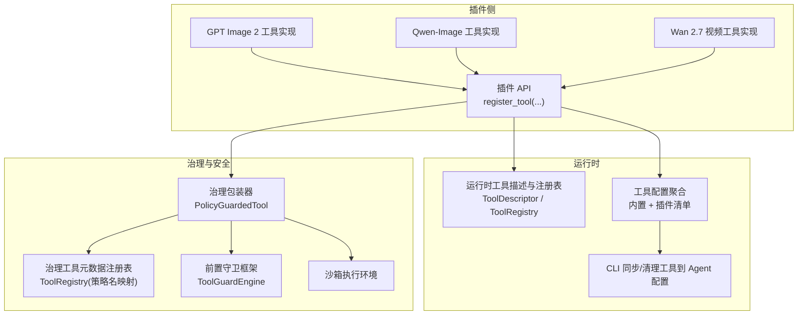
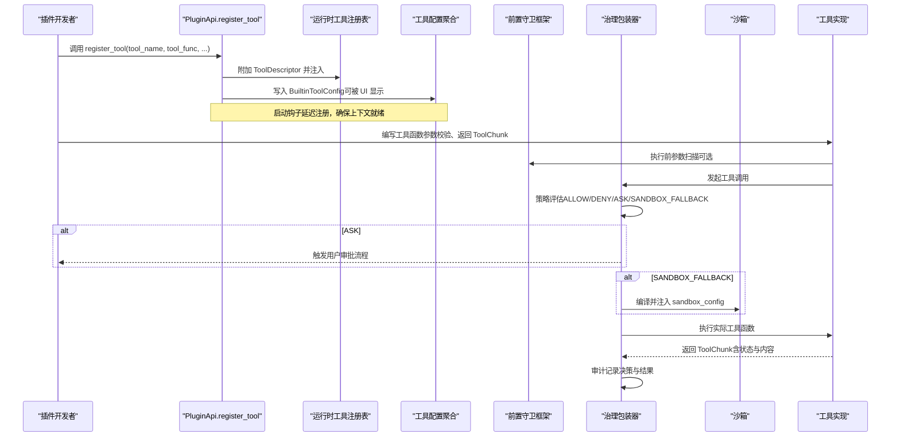
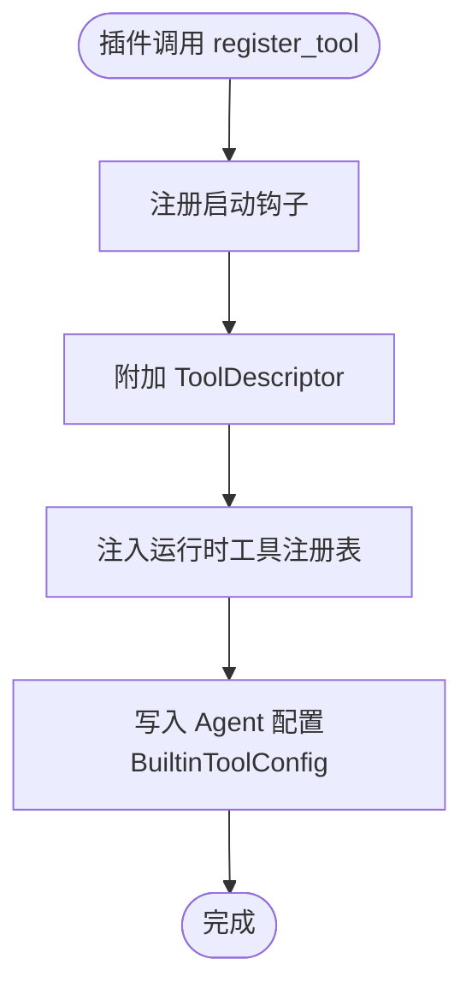
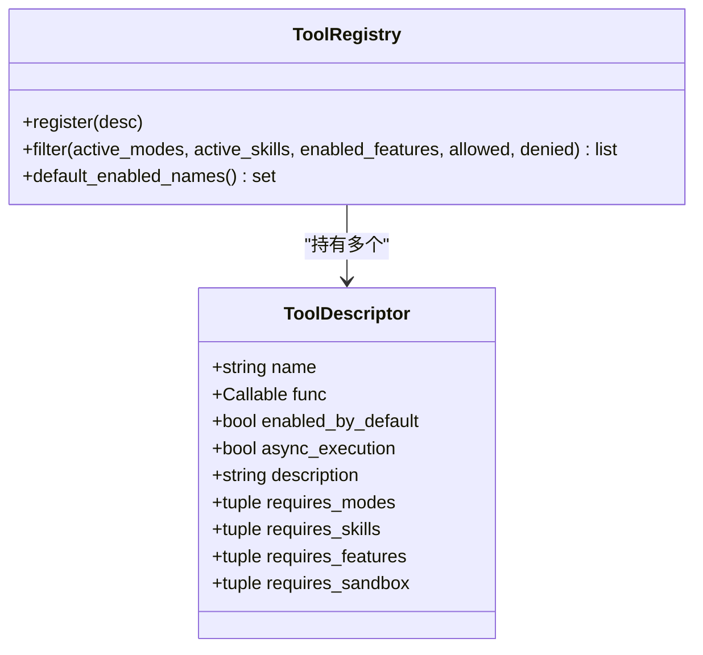
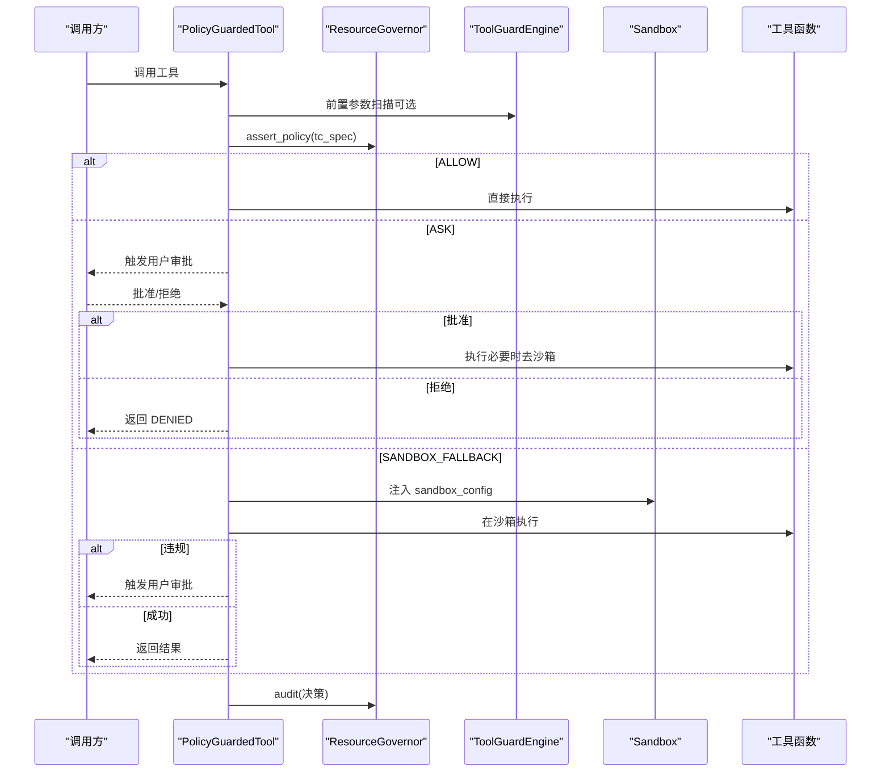
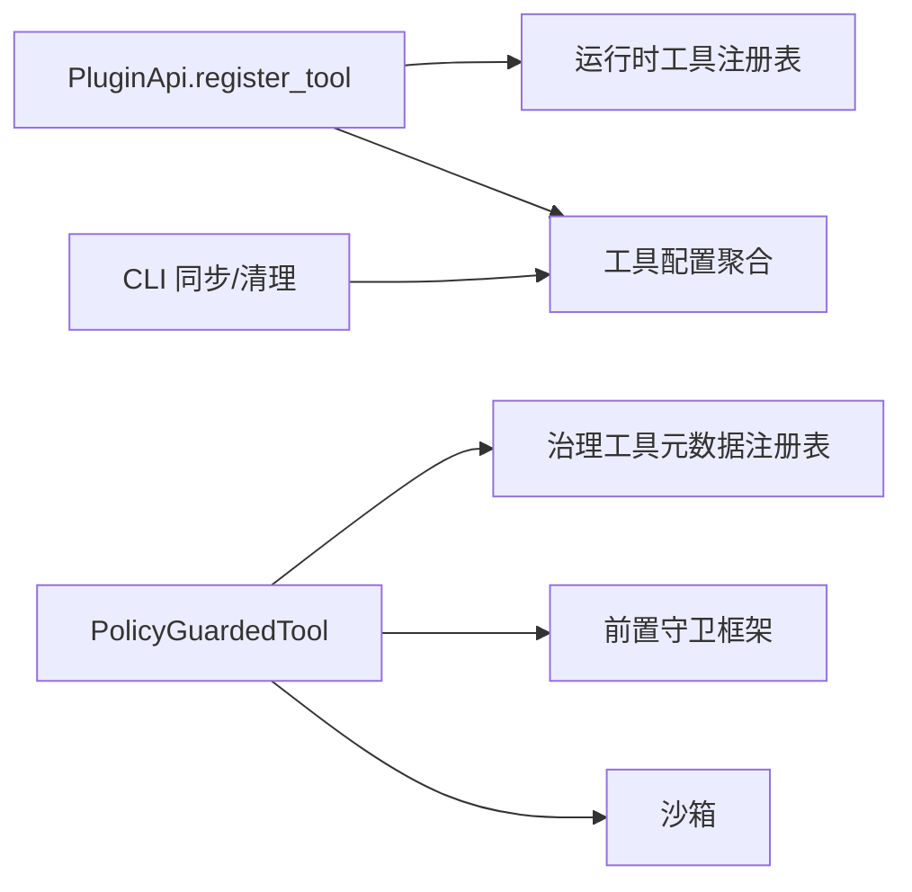

# Tool 插件

<cite>
**本文引用的文件**   
- [src/qwenpaw/plugins/api.py](file://src/qwenpaw/plugins/api.py)
- [src/qwenpaw/runtime/tool_registry.py](file://src/qwenpaw/runtime/tool_registry.py)
- [src/qwenpaw/governance/tool_adapter.py](file://src/qwenpaw/governance/tool_adapter.py)
- [src/qwenpaw/governance/tool_registry.py](file://src/qwenpaw/governance/tool_registry.py)
- [src/qwenpaw/security/tool_guard/__init__.py](file://src/qwenpaw/security/tool_guard/__init__.py)
- [src/qwenpaw/sandbox/__init__.py](file://src/qwenpaw/sandbox/__init__.py)
- [plugins/tool/gpt-image2/gpt_image2_tool.py](file://plugins/tool/gpt-image2/gpt_image2_tool.py)
- [plugins/tool/qwen-image/qwen_image_tool.py](file://plugins/tool/qwen-image/qwen_image_tool.py)
- [plugins/tool/wan27/wan27_tool.py](file://plugins/tool/wan27/wan27_tool.py)
- [plugins/tool/gpt-image2/gpt_image2.py](file://plugins/tool/gpt-image2/gpt_image2.py)
- [plugins/tool/qwen-image/qwen_image.py](file://plugins/tool/qwen-image/qwen_image.py)
- [plugins/tool/wan27/wan27.py](file://plugins/tool/wan27/wan27.py)
- [src/qwenpaw/config/config.py](file://src/qwenpaw/config/config.py)
- [src/qwenpaw/cli/plugin_commands.py](file://src/qwenpaw/cli/plugin_commands.py)
</cite>

## 目录
1. [简介](#简介)
2. [项目结构](#项目结构)
3. [核心组件](#核心组件)
4. [架构总览](#架构总览)
5. [详细组件分析](#详细组件分析)
6. [依赖关系分析](#依赖关系分析)
7. [性能与可扩展性](#性能与可扩展性)
8. [故障排查指南](#故障排查指南)
9. [结论](#结论)
10. [附录：常用工具开发示例](#附录常用工具开发示例)

## 简介
本文件面向“Tool 插件”类型，系统性阐述其如何扩展 Agent 的工具能力。内容覆盖：
- ToolPlugin 接口实现规范（工具函数定义、参数校验、结果格式化）
- 工具注册机制（动态发现、自动文档生成、运行时注入）
- 安全控制（沙箱执行、权限检查、审计日志）
- 典型工具示例（文件操作、网络请求、数据处理等）

## 项目结构
围绕 Tool 插件的关键代码分布在以下模块：
- 插件 API 与注册入口：src/qwenpaw/plugins/api.py
- 运行时工具描述与注册表：src/qwenpaw/runtime/tool_registry.py
- 治理与安全策略包装器：src/qwenpaw/governance/tool_adapter.py
- 治理层工具元数据注册表：src/qwenpaw/governance/tool_registry.py
- 前置守卫框架：src/qwenpaw/security/tool_guard/__init__.py
- 沙箱隔离执行：src/qwenpaw/sandbox/__init__.py
- 内置/插件工具配置聚合：src/qwenpaw/config/config.py
- CLI 同步/清理工具到 Agent 配置：src/qwenpaw/cli/plugin_commands.py
- 示例工具插件实现：plugins/tool/*

图表来源
- [src/qwenpaw/plugins/api.py:614-698](file://src/qwenpaw/plugins/api.py#L614-L698)
- [src/qwenpaw/runtime/tool_registry.py:16-45](file://src/qwenpaw/runtime/tool_registry.py#L16-L45)
- [src/qwenpaw/governance/tool_adapter.py:108-140](file://src/qwenpaw/governance/tool_adapter.py#L108-L140)
- [src/qwenpaw/governance/tool_registry.py:21-70](file://src/qwenpaw/governance/tool_registry.py#L21-L70)
- [src/qwenpaw/security/tool_guard/__init__.py:1-59](file://src/qwenpaw/security/tool_guard/__init__.py#L1-L59)
- [src/qwenpaw/sandbox/__init__.py:1-63](file://src/qwenpaw/sandbox/__init__.py#L1-L63)
- [src/qwenpaw/config/config.py:1706-1895](file://src/qwenpaw/config/config.py#L1706-L1895)
- [src/qwenpaw/cli/plugin_commands.py:341-400](file://src/qwenpaw/cli/plugin_commands.py#L341-L400)

章节来源
- [src/qwenpaw/plugins/api.py:614-698](file://src/qwenpaw/plugins/api.py#L614-L698)
- [src/qwenpaw/runtime/tool_registry.py:16-45](file://src/qwenpaw/runtime/tool_registry.py#L16-L45)
- [src/qwenpaw/governance/tool_adapter.py:108-140](file://src/qwenpaw/governance/tool_adapter.py#L108-L140)
- [src/qwenpaw/governance/tool_registry.py:21-70](file://src/qwenpaw/governance/tool_registry.py#L21-L70)
- [src/qwenpaw/security/tool_guard/__init__.py:1-59](file://src/qwenpaw/security/tool_guard/__init__.py#L1-L59)
- [src/qwenpaw/sandbox/__init__.py:1-63](file://src/qwenpaw/sandbox/__init__.py#L1-L63)
- [src/qwenpaw/config/config.py:1706-1895](file://src/qwenpaw/config/config.py#L1706-L1895)
- [src/qwenpaw/cli/plugin_commands.py:341-400](file://src/qwenpaw/cli/plugin_commands.py#L341-L400)

## 核心组件
- 插件 API（PluginApi.register_tool）
  - 负责将工具函数注册到运行时工具描述与注册表，并持久化到当前 Agent 的配置文件，使其在 UI 中可见并可启用。
- 运行时工具描述与注册表（ToolDescriptor / ToolRegistry）
  - 以声明式方式描述工具（名称、是否默认启用、异步执行、描述等），并按工作区维度进行过滤与装配。
- 治理包装器（PolicyGuardedTool）
  - 对每个工具调用进行策略评估、用户审批、沙箱执行与重试、审计记录。
- 治理工具元数据注册表（governance.ToolRegistry）
  - 维护 Python 函数名到策略工具名的映射、目标参数提取、是否需要沙箱等元信息。
- 前置守卫框架（ToolGuardEngine）
  - 在执行前扫描参数，检测危险模式（命令注入、敏感路径访问等）。
- 沙箱执行（Sandbox）
  - 提供跨平台内核级隔离执行，支持 Linux/macOS/Windows 多种后端。
- 工具配置聚合（config.ToolsConfig）
  - 合并内置工具与插件清单中的工具，供前端展示与开关控制。
- CLI 同步/清理（plugin_commands）
  - 将新安装的工具插件批量同步到所有 Agent 配置，或卸载时清理。

章节来源
- [src/qwenpaw/plugins/api.py:614-698](file://src/qwenpaw/plugins/api.py#L614-L698)
- [src/qwenpaw/runtime/tool_registry.py:16-45](file://src/qwenpaw/runtime/tool_registry.py#L16-L45)
- [src/qwenpaw/governance/tool_adapter.py:108-140](file://src/qwenpaw/governance/tool_adapter.py#L108-L140)
- [src/qwenpaw/governance/tool_registry.py:21-70](file://src/qwenpaw/governance/tool_registry.py#L21-L70)
- [src/qwenpaw/security/tool_guard/__init__.py:1-59](file://src/qwenpaw/security/tool_guard/__init__.py#L1-L59)
- [src/qwenpaw/sandbox/__init__.py:1-63](file://src/qwenpaw/sandbox/__init__.py#L1-L63)
- [src/qwenpaw/config/config.py:1706-1895](file://src/qwenpaw/config/config.py#L1706-L1895)
- [src/qwenpaw/cli/plugin_commands.py:341-400](file://src/qwenpaw/cli/plugin_commands.py#L341-L400)

## 架构总览
下图展示了从插件注册到工具调用的完整链路，包括策略评估、前置守卫、沙箱执行与审计。

图表来源
- [src/qwenpaw/plugins/api.py:614-698](file://src/qwenpaw/plugins/api.py#L614-L698)
- [src/qwenpaw/runtime/tool_registry.py:16-45](file://src/qwenpaw/runtime/tool_registry.py#L16-L45)
- [src/qwenpaw/governance/tool_adapter.py:222-336](file://src/qwenpaw/governance/tool_adapter.py#L222-L336)
- [src/qwenpaw/security/tool_guard/__init__.py:1-59](file://src/qwenpaw/security/tool_guard/__init__.py#L1-L59)
- [src/qwenpaw/sandbox/__init__.py:1-63](file://src/qwenpaw/sandbox/__init__.py#L1-L63)
- [src/qwenpaw/config/config.py:1706-1895](file://src/qwenpaw/config/config.py#L1706-L1895)

## 详细组件分析

### 插件 API 与工具注册
- PluginApi.register_tool
  - 在启动阶段通过内部钩子完成：
    - 将工具函数挂入 qwenpaw.agents.tools 模块，并加入 __all__
    - 为函数附加 ToolDescriptor（若未存在）
    - 注入到工作区维度的运行时工具注册表
    - 向当前 Agent 配置写入 BuiltinToolConfig（默认禁用，便于用户显式启用）
- 工具配置聚合
  - 系统启动时读取已加载插件清单，按 meta.tool_name 或 meta.tools 数组生成工具条目，统一纳入 ToolsConfig，供前端展示与开关。

图表来源
- [src/qwenpaw/plugins/api.py:614-698](file://src/qwenpaw/plugins/api.py#L614-L698)
- [src/qwenpaw/config/config.py:1706-1895](file://src/qwenpaw/config/config.py#L1706-L1895)

章节来源
- [src/qwenpaw/plugins/api.py:614-698](file://src/qwenpaw/plugins/api.py#L614-L698)
- [src/qwenpaw/config/config.py:1706-1895](file://src/qwenpaw/config/config.py#L1706-L1895)

### 运行时工具描述与注册表
- ToolDescriptor
  - 声明式字段：name、func、enabled_by_default、async_execution、description、requires_modes/skills/features、requires_sandbox 等
- ToolRegistry
  - 提供 register/filter 等方法，按 active_modes、active_skills、enabled_features、allowed/denied 集合筛选可用工具集
  - default_enabled_names 用于区分“硬编码工具默认启用”和“插件工具需显式启用”的策略差异

图表来源
- [src/qwenpaw/runtime/tool_registry.py:16-45](file://src/qwenpaw/runtime/tool_registry.py#L16-L45)
- [src/qwenpaw/runtime/tool_registry.py:47-134](file://src/qwenpaw/runtime/tool_registry.py#L47-L134)

章节来源
- [src/qwenpaw/runtime/tool_registry.py:16-45](file://src/qwenpaw/runtime/tool_registry.py#L16-L45)
- [src/qwenpaw/runtime/tool_registry.py:47-134](file://src/qwenpaw/runtime/tool_registry.py#L47-L134)

### 治理包装器与安全控制
- PolicyGuardedTool
  - 在 check_permissions 阶段：
    - 解析 effective approval_level（会话级 > Agent 级）
    - 调用 ResourceGovernor.assert_policy 得到决策（ALLOW/DENY/ASK/SANDBOX_FALLBACK）
    - 审计记录决策
  - 在 __call__ 阶段：
    - 若需要沙箱则注入 sandbox_config
    - 执行后若返回 DENIED（沙箱违规），触发用户审批；批准则去沙箱重试
- 治理工具元数据注册表
  - 维护 Python 函数名到策略工具名映射（如 execute_shell_command → Bash）
  - 提供 extract_target 从输入参数中提取目标（支持路径展开、相对路径与工作区拼接、pattern 组合）
  - 标记某些工具必须沙箱运行（fail-closed）
- 前置守卫框架
  - 在执行前扫描参数，识别危险模式（命令注入、敏感路径等）
- 沙箱执行
  - 提供跨平台隔离执行（Linux bubblewrap、macOS seatbelt、Windows AppContainer 等）

图表来源
- [src/qwenpaw/governance/tool_adapter.py:222-336](file://src/qwenpaw/governance/tool_adapter.py#L222-L336)
- [src/qwenpaw/governance/tool_adapter.py:338-472](file://src/qwenpaw/governance/tool_adapter.py#L338-L472)
- [src/qwenpaw/governance/tool_registry.py:21-70](file://src/qwenpaw/governance/tool_registry.py#L21-L70)
- [src/qwenpaw/security/tool_guard/__init__.py:1-59](file://src/qwenpaw/security/tool_guard/__init__.py#L1-L59)
- [src/qwenpaw/sandbox/__init__.py:1-63](file://src/qwenpaw/sandbox/__init__.py#L1-L63)

章节来源
- [src/qwenpaw/governance/tool_adapter.py:222-336](file://src/qwenpaw/governance/tool_adapter.py#L222-L336)
- [src/qwenpaw/governance/tool_adapter.py:338-472](file://src/qwenpaw/governance/tool_adapter.py#L338-L472)
- [src/qwenpaw/governance/tool_registry.py:21-70](file://src/qwenpaw/governance/tool_registry.py#L21-L70)
- [src/qwenpaw/security/tool_guard/__init__.py:1-59](file://src/qwenpaw/security/tool_guard/__init__.py#L1-L59)
- [src/qwenpaw/sandbox/__init__.py:1-63](file://src/qwenpaw/sandbox/__init__.py#L1-L63)

### 工具插件实现规范
- 工具函数定义
  - 建议采用异步函数签名，便于高并发与 I/O 友好
  - 使用 get_tool_config 获取当前 Agent 的工具配置（如 api_key、endpoint、timeout）
- 参数验证
  - 在函数入口处进行严格校验，返回 ToolChunk(state=ERROR, content=[TextBlock(...)]) 明确错误原因
- 结果格式化
  - 成功时返回 ToolChunk(state=SUCCESS, content=[DataBlock(URLSource(...)), TextBlock(...)])
  - 媒体资源优先保存至 DEFAULT_MEDIA_DIR，并以 file:// URL 暴露给上层
- 插件类约定
  - 实现 register(api: PluginApi) 方法，通过 api.register_tool 注册工具
  - 可在 plugin.json 的 meta 中声明 tool_name 或 tools 数组，以便系统自动发现与配置聚合

章节来源
- [plugins/tool/gpt-image2/gpt_image2_tool.py:22-257](file://plugins/tool/gpt-image2/gpt_image2_tool.py#L22-L257)
- [plugins/tool/qwen-image/qwen_image_tool.py:243-483](file://plugins/tool/qwen-image/qwen_image_tool.py#L243-L483)
- [plugins/tool/wan27/wan27_tool.py:180-387](file://plugins/tool/wan27/wan27_tool.py#L180-L387)
- [plugins/tool/gpt-image2/gpt_image2.py:27-59](file://plugins/tool/gpt-image2/gpt_image2.py#L27-L59)
- [plugins/tool/qwen-image/qwen_image.py:27-58](file://plugins/tool/qwen-image/qwen_image.py#L27-L58)
- [plugins/tool/wan27/wan27.py:27-65](file://plugins/tool/wan27/wan27.py#L27-L65)

## 依赖关系分析
- 插件 API 依赖运行时工具描述与注册表，以及配置聚合
- 治理包装器依赖治理工具元数据注册表、前置守卫框架与沙箱
- CLI 工具依赖配置聚合，用于批量同步/清理 Agent 配置中的工具项

图表来源
- [src/qwenpaw/plugins/api.py:614-698](file://src/qwenpaw/plugins/api.py#L614-L698)
- [src/qwenpaw/runtime/tool_registry.py:16-45](file://src/qwenpaw/runtime/tool_registry.py#L16-L45)
- [src/qwenpaw/governance/tool_adapter.py:108-140](file://src/qwenpaw/governance/tool_adapter.py#L108-L140)
- [src/qwenpaw/governance/tool_registry.py:21-70](file://src/qwenpaw/governance/tool_registry.py#L21-L70)
- [src/qwenpaw/security/tool_guard/__init__.py:1-59](file://src/qwenpaw/security/tool_guard/__init__.py#L1-L59)
- [src/qwenpaw/sandbox/__init__.py:1-63](file://src/qwenpaw/sandbox/__init__.py#L1-L63)
- [src/qwenpaw/cli/plugin_commands.py:341-400](file://src/qwenpaw/cli/plugin_commands.py#L341-L400)

章节来源
- [src/qwenpaw/plugins/api.py:614-698](file://src/qwenpaw/plugins/api.py#L614-L698)
- [src/qwenpaw/runtime/tool_registry.py:16-45](file://src/qwenpaw/runtime/tool_registry.py#L16-L45)
- [src/qwenpaw/governance/tool_adapter.py:108-140](file://src/qwenpaw/governance/tool_adapter.py#L108-L140)
- [src/qwenpaw/governance/tool_registry.py:21-70](file://src/qwenpaw/governance/tool_registry.py#L21-L70)
- [src/qwenpaw/security/tool_guard/__init__.py:1-59](file://src/qwenpaw/security/tool_guard/__init__.py#L1-L59)
- [src/qwenpaw/sandbox/__init__.py:1-63](file://src/qwenpaw/sandbox/__init__.py#L1-L63)
- [src/qwenpaw/cli/plugin_commands.py:341-400](file://src/qwenpaw/cli/plugin_commands.py#L341-L400)

## 性能与可扩展性
- 异步执行
  - 工具函数建议使用 async，减少阻塞；运行时根据函数签名自动检测 async_execution
- 懒加载与延迟注册
  - 工具注册通过启动钩子延迟执行，避免初始化顺序问题
- 沙箱开销
  - 仅在需要时编译与注入 sandbox_config；失败关闭型工具（如 REPL）强制沙箱，提升安全性但带来额外开销
- 前置守卫
  - 轻量规则匹配，执行前快速扫描，降低风险面
- 可扩展点
  - 新增守护器（guardian）、策略规则、沙箱后端均可在不改动主流程的情况下扩展

[本节为通用指导，不直接分析具体文件]

## 故障排查指南
- 工具未出现在 UI 或不可用
  - 确认插件清单 meta 是否正确声明 tool_name 或 tools 数组
  - 检查 CLI 是否已将工具同步到各 Agent 配置
- 工具调用被拒绝
  - 查看治理日志，确认策略决策（ALLOW/DENY/ASK/SANDBOX_FALLBACK）
  - 若为沙箱违规，检查用户审批流程是否超时或被拒绝
- 沙箱执行失败
  - 确认平台沙箱后端可用性（bubblewrap/seatbelt/AppContainer）
  - 检查 sandbox_config 是否正确编译与注入
- 前置守卫误报
  - 调整规则或白名单，避免过度拦截

章节来源
- [src/qwenpaw/governance/tool_adapter.py:222-336](file://src/qwenpaw/governance/tool_adapter.py#L222-L336)
- [src/qwenpaw/governance/tool_adapter.py:338-472](file://src/qwenpaw/governance/tool_adapter.py#L338-L472)
- [src/qwenpaw/cli/plugin_commands.py:341-400](file://src/qwenpaw/cli/plugin_commands.py#L341-L400)
- [src/qwenpaw/config/config.py:1706-1895](file://src/qwenpaw/config/config.py#L1706-L1895)

## 结论
Tool 插件体系通过清晰的接口与分层设计，实现了：
- 灵活的动态注册与自动文档生成
- 强大的治理与安全控制（策略评估、用户审批、沙箱执行、审计日志）
- 良好的可扩展性与用户体验（UI 可见、一键启用/禁用）

遵循本文档的实现规范与最佳实践，可高效构建高质量、安全的工具插件。

[本节为总结，不直接分析具体文件]

## 附录：常用工具开发示例
以下为三类常见工具的开发要点与参考路径（不包含具体代码内容）：

- 文件操作工具
  - 要点：读取/写入/编辑文件，路径校验，权限控制，错误提示
  - 参考路径：
    - [src/qwenpaw/governance/tool_registry.py:161-177](file://src/qwenpaw/governance/tool_registry.py#L161-L177)
    - [src/qwenpaw/governance/tool_registry.py:207-240](file://src/qwenpaw/governance/tool_registry.py#L207-L240)

- 网络请求工具
  - 要点：URL 校验、超时与重试、鉴权头设置、响应体处理
  - 参考路径：
    - [plugins/tool/gpt-image2/gpt_image2_tool.py:134-174](file://plugins/tool/gpt-image2/gpt_image2_tool.py#L134-L174)
    - [plugins/tool/qwen-image/qwen_image_tool.py:173-206](file://plugins/tool/qwen-image/qwen_image_tool.py#L173-L206)

- 数据处理工具（图像/视频生成）
  - 要点：模型选择、参数校验、流式下载、本地落盘、结果封装
  - 参考路径：
    - [plugins/tool/qwen-image/qwen_image_tool.py:243-483](file://plugins/tool/qwen-image/qwen_image_tool.py#L243-L483)
    - [plugins/tool/wan27/wan27_tool.py:180-387](file://plugins/tool/wan27/wan27_tool.py#L180-L387)

章节来源
- [src/qwenpaw/governance/tool_registry.py:161-177](file://src/qwenpaw/governance/tool_registry.py#L161-L177)
- [src/qwenpaw/governance/tool_registry.py:207-240](file://src/qwenpaw/governance/tool_registry.py#L207-L240)
- [plugins/tool/gpt-image2/gpt_image2_tool.py:134-174](file://plugins/tool/gpt-image2/gpt_image2_tool.py#L134-L174)
- [plugins/tool/qwen-image/qwen_image_tool.py:173-206](file://plugins/tool/qwen-image/qwen_image_tool.py#L173-L206)
- [plugins/tool/qwen-image/qwen_image_tool.py:243-483](file://plugins/tool/qwen-image/qwen_image_tool.py#L243-L483)
- [plugins/tool/wan27/wan27_tool.py:180-387](file://plugins/tool/wan27/wan27_tool.py#L180-L387)