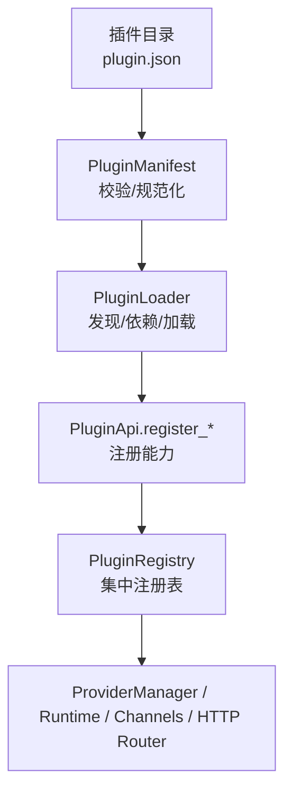
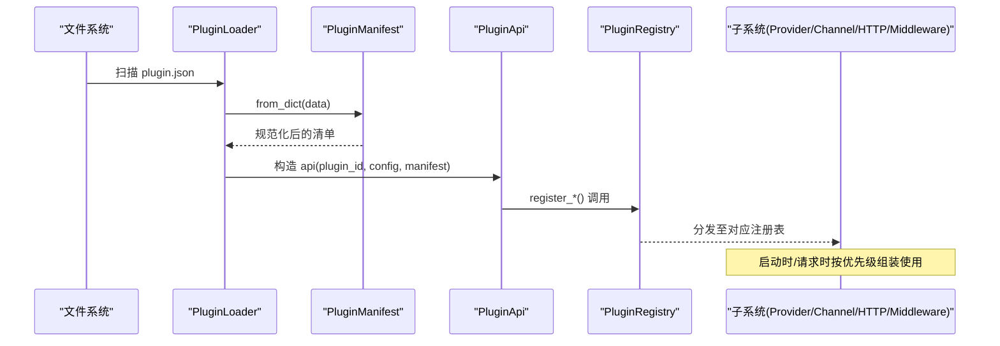
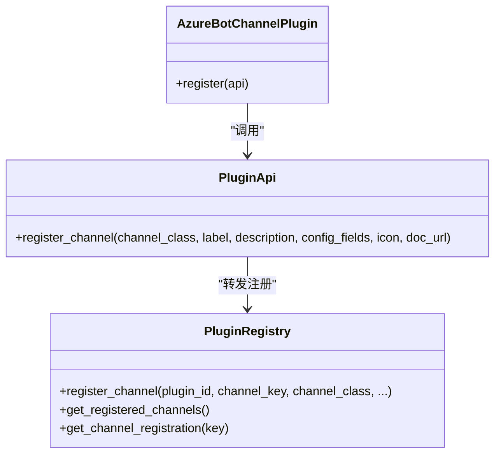
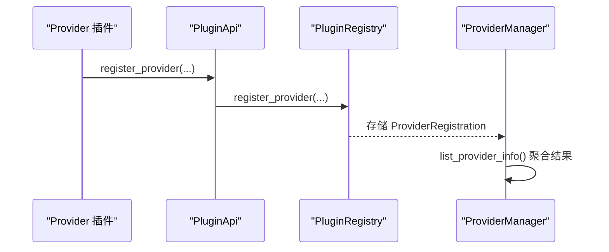
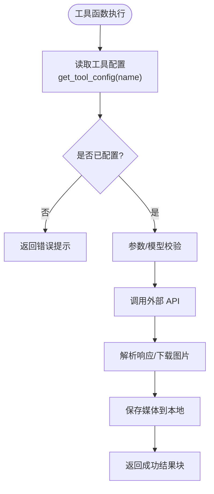
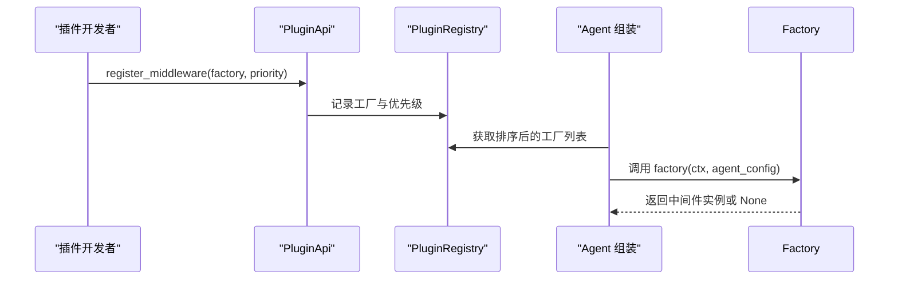
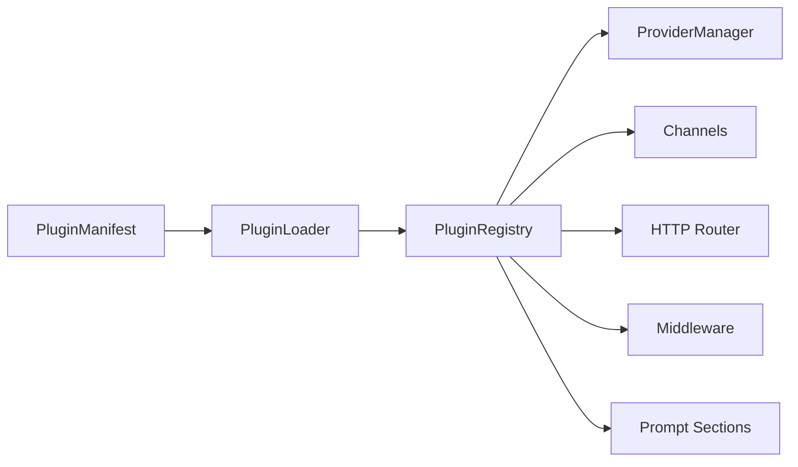

# 插件类型与接口

<cite>
**本文引用的文件**   
- [src/qwenpaw/plugins/architecture.py](file://src/qwenpaw/plugins/architecture.py)
- [src/qwenpaw/plugins/api.py](file://src/qwenpaw/plugins/api.py)
- [src/qwenpaw/plugins/registry.py](file://src/qwenpaw/plugins/registry.py)
- [src/qwenpaw/plugins/loader.py](file://src/qwenpaw/plugins/loader.py)
- [plugins/channel/azure_bot/plugin.py](file://plugins/channel/azure_bot/plugin.py)
- [plugins/tool/qwen-image/qwen_image_tool.py](file://plugins/tool/qwen-image/qwen_image_tool.py)
- [plugins/middleware-demo/README.md](file://plugins/middleware-demo/README.md)
- [src/qwenpaw/providers/provider_manager.py](file://src/qwenpaw/providers/provider_manager.py)
- [src/qwenpaw/config/config.py](file://src/qwenpaw/config/config.py)
</cite>

## 目录
1. [引言](#引言)
2. [项目结构](#项目结构)
3. [核心组件](#核心组件)
4. [架构总览](#架构总览)
5. [详细组件分析](#详细组件分析)
6. [依赖关系分析](#依赖关系分析)
7. [性能考量](#性能考量)
8. [故障排查指南](#故障排查指南)
9. [结论](#结论)
10. [附录](#附录)

## 引言
本文件面向 QwenPaw 插件开发者，系统化阐述四类核心插件类型（Channel、Provider、Tool、Middleware）的设计理念、适用场景与接口规范；并给出 PluginManifest 与 PluginRecord 的数据模型说明、PluginApi 的统一能力清单，以及插件类型选择指导原则与开发模板。文档以源码为依据，确保可追溯与可验证。

## 项目结构
QwenPaw 的插件体系由“声明式清单 + 运行时注册”构成：
- 插件清单：plugin.json 经 PluginManifest 校验与规范化后，决定插件类型与入口。
- 加载器：PluginLoader 负责发现、依赖安装、模块动态加载与生命周期钩子调度。
- 注册中心：PluginRegistry 集中管理 Provider、Hook、Channel、HTTP Router、Prompt Section、Middleware 等注册项。
- 插件 API：PluginApi 为插件提供统一注册与配置访问能力。
- 示例插件：Channel（Azure Bot）、Tool（qwen-image）、Middleware（tracing/thinking-log）。

**图示来源**
- [src/qwenpaw/plugins/architecture.py:114-210](file://src/qwenpaw/plugins/architecture.py#L114-L210)
- [src/qwenpaw/plugins/loader.py:119-173](file://src/qwenpaw/plugins/loader.py#L119-L173)
- [src/qwenpaw/plugins/api.py:172-246](file://src/qwenpaw/plugins/api.py#L172-L246)
- [src/qwenpaw/plugins/registry.py:129-169](file://src/qwenpaw/plugins/registry.py#L129-L169)

**章节来源**
- [src/qwenpaw/plugins/architecture.py:114-210](file://src/qwenpaw/plugins/architecture.py#L114-L210)
- [src/qwenpaw/plugins/loader.py:119-173](file://src/qwenpaw/plugins/loader.py#L119-L173)
- [src/qwenpaw/plugins/api.py:172-246](file://src/qwenpaw/plugins/api.py#L172-L246)
- [src/qwenpaw/plugins/registry.py:129-169](file://src/qwenpaw/plugins/registry.py#L129-L169)

## 核心组件
- PluginType：定义插件类型枚举（tool、provider、hook、command、channel、frontend、general），用于分类与推断。
- PluginManifest：描述插件元数据、版本约束、入口点、meta 信息，支持国际化文本与旧字段兼容。
- PluginRecord：记录已加载插件实例、源路径、启用状态与诊断信息。
- PluginRegistry：单例注册中心，维护 Provider/Hook/Channel/Middleware/HTTP Router/Prompt Section 等注册项并提供查询与卸载清理。
- PluginApi：插件侧统一 API，提供 register_provider/register_channel/register_middleware/register_tool/register_http_router 等能力，以及工具配置读写。

**章节来源**
- [src/qwenpaw/plugins/architecture.py:12-39](file://src/qwenpaw/plugins/architecture.py#L12-L39)
- [src/qwenpaw/plugins/architecture.py:114-210](file://src/qwenpaw/plugins/architecture.py#L114-L210)
- [src/qwenpaw/plugins/architecture.py:212-221](file://src/qwenpaw/plugins/architecture.py#L212-L221)
- [src/qwenpaw/plugins/registry.py:129-169](file://src/qwenpaw/plugins/registry.py#L129-L169)
- [src/qwenpaw/plugins/api.py:172-246](file://src/qwenpaw/plugins/api.py#L172-L246)

## 架构总览
下图展示插件从清单到运行时的关键交互：清单解析 → 加载器装配 → API 注册 → 注册中心持久化 → 各子系统消费。

**图示来源**
- [src/qwenpaw/plugins/loader.py:174-189](file://src/qwenpaw/plugins/loader.py#L174-L189)
- [src/qwenpaw/plugins/architecture.py:192-210](file://src/qwenpaw/plugins/architecture.py#L192-L210)
- [src/qwenpaw/plugins/api.py:205-246](file://src/qwenpaw/plugins/api.py#L205-L246)
- [src/qwenpaw/plugins/registry.py:328-367](file://src/qwenpaw/plugins/registry.py#L328-L367)

## 详细组件分析

### Channel 插件
- 设计理念：通过 BaseChannel 子类扩展消息通道，将外部平台（如 Azure Bot）接入 QwenPaw 会话与路由体系。
- 适用场景：对接第三方 IM/机器人平台，提供统一的会话上下文、消息收发与鉴权能力。
- 接口规范：
  - 在插件 module 中导出 plugin 对象，实现 register(api)。
  - 调用 api.register_channel(channel_class, label, description, config_fields, icon, doc_url)。
  - channel_class 必须包含 class 属性 channel 作为唯一键，且继承自 BaseChannel。
  - config_fields 用于前端表单渲染，需包含 name/label/type 等字段，type 限定为 text/password/number/switch/select。
- 验证规则：
  - channel_key 非空且标准化为小写；禁止覆盖内置 channel key。
  - 重复注册或非法类型会抛出异常。
- 事件与钩子：无专用事件；可通过通用 Hook 机制扩展。

**图示来源**
- [plugins/channel/azure_bot/plugin.py:11-314](file://plugins/channel/azure_bot/plugin.py#L11-L314)
- [src/qwenpaw/plugins/api.py:483-570](file://src/qwenpaw/plugins/api.py#L483-L570)
- [src/qwenpaw/plugins/registry.py:749-854](file://src/qwenpaw/plugins/registry.py#L749-L854)

**章节来源**
- [plugins/channel/azure_bot/plugin.py:11-314](file://plugins/channel/azure_bot/plugin.py#L11-L314)
- [src/qwenpaw/plugins/api.py:483-570](file://src/qwenpaw/plugins/api.py#L483-L570)
- [src/qwenpaw/plugins/registry.py:749-854](file://src/qwenpaw/plugins/registry.py#L749-L854)

### Provider 插件
- 设计理念：以 Provider 抽象封装 LLM 服务提供方，插件可复用内置 Provider 基类快速接入新端点。
- 适用场景：接入新的模型服务（OpenAI 兼容、私有部署等），对外暴露 provider_id 与模型列表。
- 接口规范：
  - 在 register(api) 中调用 api.register_provider(provider_id, provider_class, label, base_url, **metadata)。
  - metadata 可与 manifest.meta 合并，供后续 UI/校验使用。
- 运行时集成：
  - ProviderManager 聚合 builtin/custom/plugin_providers，并在 list_provider_info 中返回 ProviderInfo。
- 验证规则：
  - provider_id 全局唯一，重复注册抛错。

**图示来源**
- [src/qwenpaw/plugins/api.py:205-246](file://src/qwenpaw/plugins/api.py#L205-L246)
- [src/qwenpaw/plugins/registry.py:328-367](file://src/qwenpaw/plugins/registry.py#L328-L367)
- [src/qwenpaw/providers/provider_manager.py:1409-1444](file://src/qwenpaw/providers/provider_manager.py#L1409-L1444)

**章节来源**
- [src/qwenpaw/plugins/api.py:205-246](file://src/qwenpaw/plugins/api.py#L205-L246)
- [src/qwenpaw/plugins/registry.py:328-367](file://src/qwenpaw/plugins/registry.py#L328-L367)
- [src/qwenpaw/providers/provider_manager.py:1409-1444](file://src/qwenpaw/providers/provider_manager.py#L1409-L1444)

### Tool 插件
- 设计理念：将函数注册为 Agent 可调用的工具，自动注入运行时工具注册表与用户配置。
- 适用场景：封装业务逻辑或外部 API 调用，供 Agent 按需执行。
- 接口规范：
  - 在 register(api) 中调用 api.register_tool(tool_name, tool_func, description, icon, enabled)。
  - 内部会在启动阶段将函数挂入 qwenpaw.agents.tools 模块，创建 BuiltinToolConfig 并桥接到运行时 ToolRegistry。
- 配置访问：
  - 工具函数内可使用 get_tool_config(tool_name) 读取当前 Agent 的配置（如 api_key、endpoint、timeout、model 等）。
- 验证与默认行为：
  - 未配置时返回错误提示；enabled 默认 False，建议用户显式开启。

**图示来源**
- [src/qwenpaw/plugins/api.py:614-698](file://src/qwenpaw/plugins/api.py#L614-L698)
- [src/qwenpaw/plugins/api.py:11-46](file://src/qwenpaw/plugins/api.py#L11-L46)
- [plugins/tool/qwen-image/qwen_image_tool.py:243-484](file://plugins/tool/qwen-image/qwen_image_tool.py#L243-L484)
- [src/qwenpaw/config/config.py:1706-1895](file://src/qwenpaw/config/config.py#L1706-L1895)

**章节来源**
- [src/qwenpaw/plugins/api.py:614-698](file://src/qwenpaw/plugins/api.py#L614-L698)
- [src/qwenpaw/plugins/api.py:11-46](file://src/qwenpaw/plugins/api.py#L11-L46)
- [plugins/tool/qwen-image/qwen_image_tool.py:243-484](file://plugins/tool/qwen-image/qwen_image_tool.py#L243-L484)
- [src/qwenpaw/config/config.py:1706-1895](file://src/qwenpaw/config/config.py#L1706-L1895)

### Middleware 插件
- 设计理念：基于 AgentScope 中间件洋葱模型，在推理链路上插入横切关注点（日志、追踪、审计等）。
- 适用场景：全链路追踪、思考流输出、安全策略拦截等。
- 接口规范：
  - 在 register(api) 中调用 api.register_middleware(factory, priority=N)。
  - factory(ctx, agent_config) -> MiddlewareBase | None；返回 None 表示跳过该中间件。
  - 优先级越小越外层。
- 示例：tracing-middleware 与 thinking-log-middleware 演示 on_acting/on_reasoning 钩子用法。

**图示来源**
- [src/qwenpaw/plugins/api.py:448-481](file://src/qwenpaw/plugins/api.py#L448-L481)
- [src/qwenpaw/plugins/registry.py:171-207](file://src/qwenpaw/plugins/registry.py#L171-L207)
- [plugins/middleware-demo/README.md:1-51](file://plugins/middleware-demo/README.md#L1-L51)

**章节来源**
- [src/qwenpaw/plugins/api.py:448-481](file://src/qwenpaw/plugins/api.py#L448-L481)
- [src/qwenpaw/plugins/registry.py:171-207](file://src/qwenpaw/plugins/registry.py#L171-L207)
- [plugins/middleware-demo/README.md:1-51](file://plugins/middleware-demo/README.md#L1-L51)

## 依赖关系分析
- 插件清单与类型推断：
  - PluginManifest 支持显式 type 与基于 meta/entry 的自动推断，兼容旧版清单。
- 加载流程：
  - PluginLoader 解析清单、检查版本兼容性、安装依赖、动态导入后端模块并调用 register(api)。
- 注册中心：
  - PluginRegistry 统一管理各类注册项，支持卸载清理与按插件维度移除。
- Provider 集成：
  - ProviderManager 聚合内置/自定义/插件提供的 Provider，并统一对外暴露模型信息。
- 工具配置：
  - 工具配置写入与读取通过 Agent 配置文件完成，注册时自动生成 BuiltinToolConfig 条目。

**图示来源**
- [src/qwenpaw/plugins/architecture.py:68-98](file://src/qwenpaw/plugins/architecture.py#L68-L98)
- [src/qwenpaw/plugins/loader.py:514-640](file://src/qwenpaw/plugins/loader.py#L514-L640)
- [src/qwenpaw/plugins/registry.py:934-992](file://src/qwenpaw/plugins/registry.py#L934-L992)
- [src/qwenpaw/providers/provider_manager.py:1409-1444](file://src/qwenpaw/providers/provider_manager.py#L1409-L1444)

**章节来源**
- [src/qwenpaw/plugins/architecture.py:68-98](file://src/qwenpaw/plugins/architecture.py#L68-L98)
- [src/qwenpaw/plugins/loader.py:514-640](file://src/qwenpaw/plugins/loader.py#L514-L640)
- [src/qwenpaw/plugins/registry.py:934-992](file://src/qwenpaw/plugins/registry.py#L934-L992)
- [src/qwenpaw/providers/provider_manager.py:1409-1444](file://src/qwenpaw/providers/provider_manager.py#L1409-L1444)

## 性能考量
- 依赖安装：
  - 插件依赖检测采用双探针（importlib.metadata + import 探测），避免误报与重复安装；并发安装通过每插件锁串行化，防止内存耗尽。
- 中间件顺序：
  - 按 priority 升序排列，较小值更外层，便于在请求初期进行鉴权/限流等横切处理。
- HTTP 路由挂载：
  - 插件路由优先于控制台 SPA 捕获路由，避免被吞掉；同时刷新 OpenAPI schema 缓存。
- 工具配置读写：
  - 仅在需要时加载/保存 Agent 配置，避免频繁 I/O。

[本节为通用性能讨论，不直接分析具体文件]

## 故障排查指南
- 清单校验失败：
  - 检查 plugin.json 必填字段 id/version/entry，确认 type 或 meta 能正确推断。
- 入口文件缺失：
  - 若 entry.backend/frontend 指向的文件不存在，加载器会报错。
- Provider 重复注册：
  - provider_id 冲突会抛错，需调整 ID 或卸载已有插件。
- Channel 键冲突或类型错误：
  - channel_key 不能与内置冲突，且 channel_class 必须是 BaseChannel 子类。
- 工具未配置：
  - 工具函数应检查 get_tool_config 返回值，未配置时返回明确错误提示。
- 卸载清理：
  - 使用 PluginRegistry.unregister_plugin 清理内存中的注册项；HTTP 路由与 Channel 注册会被同步移除。

**章节来源**
- [src/qwenpaw/plugins/loader.py:336-374](file://src/qwenpaw/plugins/loader.py#L336-L374)
- [src/qwenpaw/plugins/registry.py:328-367](file://src/qwenpaw/plugins/registry.py#L328-L367)
- [src/qwenpaw/plugins/registry.py:749-854](file://src/qwenpaw/plugins/registry.py#L749-L854)
- [src/qwenpaw/plugins/registry.py:934-992](file://src/qwenpaw/plugins/registry.py#L934-L992)
- [plugins/tool/qwen-image/qwen_image_tool.py:243-484](file://plugins/tool/qwen-image/qwen_image_tool.py#L243-L484)

## 结论
QwenPaw 插件体系通过清晰的类型划分与统一的注册 API，实现了可扩展的消息通道、模型提供者、工具与中间件生态。PluginManifest/PluginRecord 保障清单与运行态一致性，PluginRegistry 提供集中管理能力，PluginApi 简化插件开发。遵循本文规范与最佳实践，可高效构建稳定可靠的插件。

[本节为总结性内容，不直接分析具体文件]

## 附录

### 数据类型与字段说明
- PluginType
  - 取值：tool、provider、hook、command、channel、frontend、general
  - 用途：标识插件类别，支持显式设置与基于 meta/entry 的推断
- PluginManifest
  - 关键字段：id、version、name、description、author、entry、dependencies、min_version/max_version、qwenpaw_version、meta、plugin_type
  - 特性：忽略未知字段；支持国际化文本归一化；兼容旧字段 entry_point
- PluginRecord
  - 关键字段：manifest、source_path、enabled、instance、diagnostics
- PluginRegistry 主要注册项
  - ProviderRegistration、HookRegistration、ControlCommandRegistration、MiddlewareRegistration、ChannelRegistration、HttpRouterRegistration、PromptSectionRegistration

**章节来源**
- [src/qwenpaw/plugins/architecture.py:12-39](file://src/qwenpaw/plugins/architecture.py#L12-L39)
- [src/qwenpaw/plugins/architecture.py:114-210](file://src/qwenpaw/plugins/architecture.py#L114-L210)
- [src/qwenpaw/plugins/architecture.py:212-221](file://src/qwenpaw/plugins/architecture.py#L212-L221)
- [src/qwenpaw/plugins/registry.py:55-127](file://src/qwenpaw/plugins/registry.py#L55-L127)

### PluginApi 统一接口清单
- 注册能力
  - register_provider(provider_id, provider_class, label, base_url, **metadata)
  - register_channel(channel_class, label, description, config_fields, icon, doc_url)
  - register_middleware(factory, priority=100)
  - register_tool(tool_name, tool_func, description="", icon="🔧", enabled=False)
  - register_http_router(router, prefix, tags=None)
  - register_startup_hook/hook_name/callback/priority
  - register_shutdown_hook/hook_name/callback/priority
  - register_uninstall_hook/hook_name/callback/priority
  - register_workspace_created_hook/hook_name/callback/priority
  - register_slash_command/name/handler/aliases/category/help_text/metadata
  - register_mode(mode_cls)
  - register_runtime_hook(hook)
  - register_agent_stop_handler(handler, priority=100, name="")
  - register_prompt_section(name, after, provider, priority=100, condition=None, agent_id=None)
  - register_skill_provider(unregister_skill_provider)
- 配置访问
  - get_tool_config(tool_name, agent_id)
  - set_tool_config(tool_name, agent_id, config)
  - runtime 属性访问运行时辅助

**章节来源**
- [src/qwenpaw/plugins/api.py:205-246](file://src/qwenpaw/plugins/api.py#L205-L246)
- [src/qwenpaw/plugins/api.py:448-481](file://src/qwenpaw/plugins/api.py#L448-L481)
- [src/qwenpaw/plugins/api.py:483-570](file://src/qwenpaw/plugins/api.py#L483-L570)
- [src/qwenpaw/plugins/api.py:614-698](file://src/qwenpaw/plugins/api.py#L614-L698)
- [src/qwenpaw/plugins/api.py:394-424](file://src/qwenpaw/plugins/api.py#L394-L424)
- [src/qwenpaw/plugins/api.py:251-313](file://src/qwenpaw/plugins/api.py#L251-L313)
- [src/qwenpaw/plugins/api.py:315-356](file://src/qwenpaw/plugins/api.py#L315-L356)
- [src/qwenpaw/plugins/api.py:358-392](file://src/qwenpaw/plugins/api.py#L358-L392)
- [src/qwenpaw/plugins/api.py:700-756](file://src/qwenpaw/plugins/api.py#L700-L756)
- [src/qwenpaw/plugins/api.py:758-796](file://src/qwenpaw/plugins/api.py#L758-L796)
- [src/qwenpaw/plugins/api.py:798-836](file://src/qwenpaw/plugins/api.py#L798-L836)
- [src/qwenpaw/plugins/api.py:837-888](file://src/qwenpaw/plugins/api.py#L837-L888)
- [src/qwenpaw/plugins/api.py:890-948](file://src/qwenpaw/plugins/api.py#L890-L948)
- [src/qwenpaw/plugins/api.py:1098-1184](file://src/qwenpaw/plugins/api.py#L1098-L1184)
- [src/qwenpaw/plugins/api.py:1185-1218](file://src/qwenpaw/plugins/api.py#L1185-L1218)
- [src/qwenpaw/plugins/api.py:583-613](file://src/qwenpaw/plugins/api.py#L583-L613)

### 插件类型选择指导原则
- 选择 Channel：需要接入外部聊天平台，统一消息收发与会话上下文。
- 选择 Provider：需要新增或替换 LLM 服务提供方，暴露模型列表与连接能力。
- 选择 Tool：需要将业务逻辑或外部 API 封装为 Agent 可调用的工具。
- 选择 Middleware：需要在推理链路中插入横切逻辑（日志、追踪、审计、策略）。
- 其他类型（hook/command/frontend/general）：根据需求选择系统钩子、控制命令、前端资源或通用插件。

[本节为概念性指导，不直接分析具体文件]

### 开发模板要点
- 清单（plugin.json）
  - 必填：id、version、entry（backend/frontend）
  - 可选：name/description/author、dependencies、qwenpaw_version/min_version/max_version、meta、type
- 后端入口（module.plugin.register(api)）
  - 使用 PluginApi 的 register_* 方法注册能力
  - 如需工具，使用 register_tool 并在函数内通过 get_tool_config 读取配置
- 示例参考
  - Channel：plugins/channel/azure_bot/plugin.py
  - Tool：plugins/tool/qwen-image/qwen_image_tool.py
  - Middleware：plugins/middleware-demo/README.md

**章节来源**
- [src/qwenpaw/plugins/architecture.py:114-210](file://src/qwenpaw/plugins/architecture.py#L114-L210)
- [plugins/channel/azure_bot/plugin.py:11-314](file://plugins/channel/azure_bot/plugin.py#L11-L314)
- [plugins/tool/qwen-image/qwen_image_tool.py:243-484](file://plugins/tool/qwen-image/qwen_image_tool.py#L243-L484)
- [plugins/middleware-demo/README.md:1-51](file://plugins/middleware-demo/README.md#L1-L51)