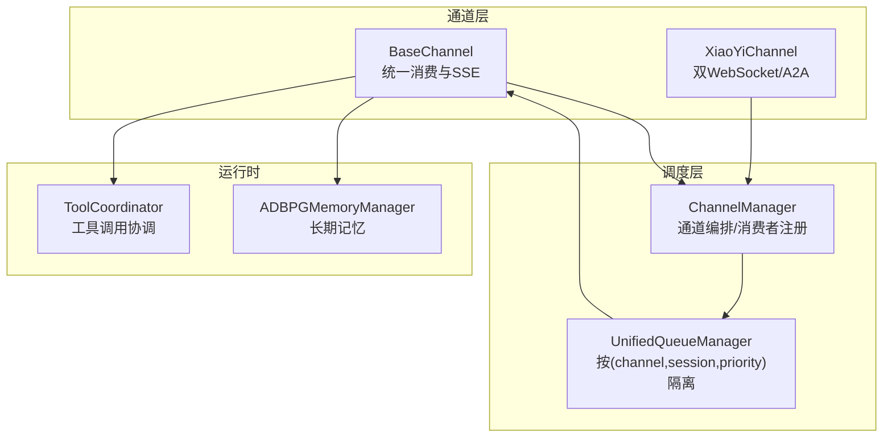
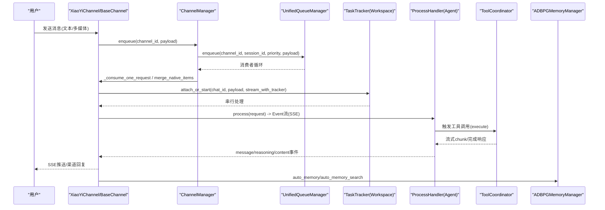
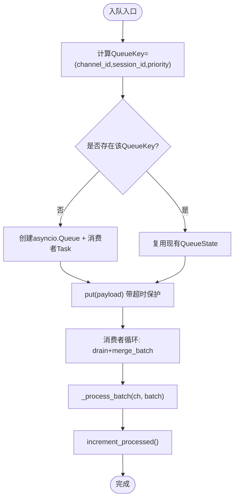
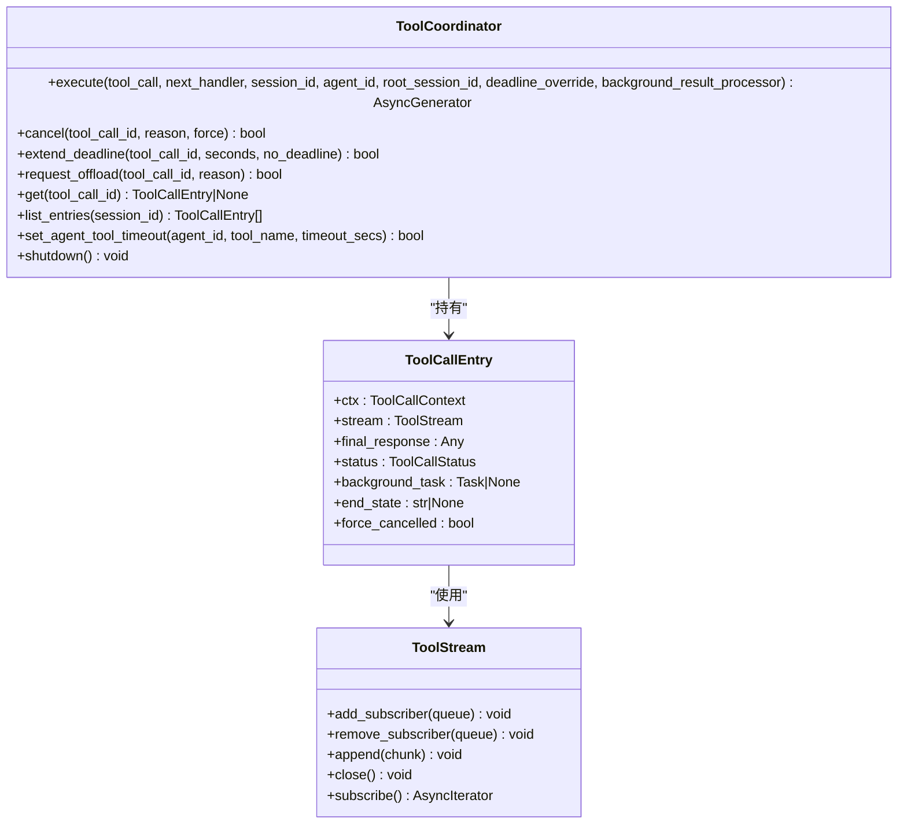
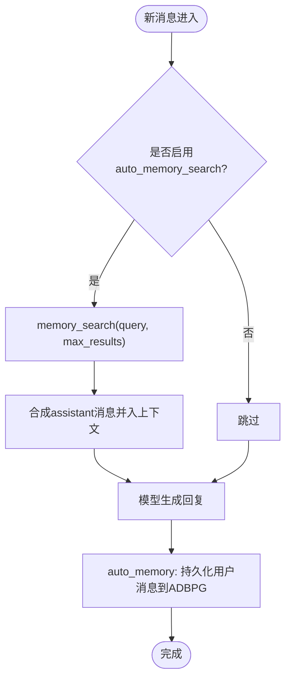
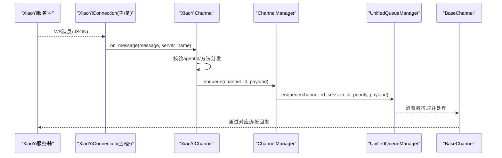
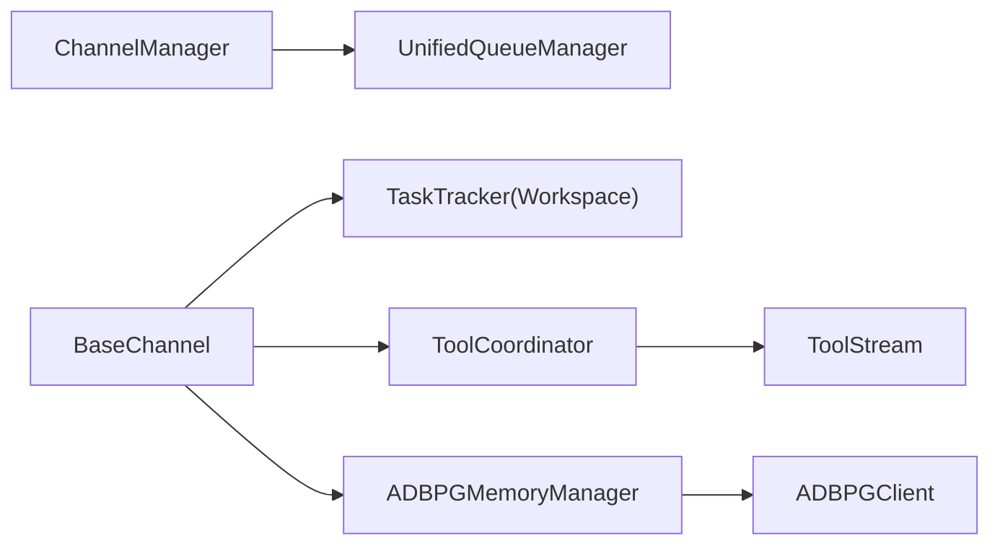

# 数据流设计

<cite>
**本文引用的文件**   
- [unified_queue_manager.py](file://src/qwenpaw/app/channels/unified_queue_manager.py)
- [manager.py](file://src/qwenpaw/app/channels/manager.py)
- [base.py](file://src/qwenpaw/app/channels/base.py)
- [_coordinator.py](file://src/qwenpaw/tool_calls/_coordinator.py)
- [_entry.py](file://src/qwenpaw/tool_calls/_entry.py)
- [_stream.py](file://src/qwenpaw/tool_calls/_stream.py)
- [adbpg_memory_manager.py](file://src/qwenpaw/agents/memory/adbpg_memory_manager.py)
- [base_memory_manager.py](file://src/qwenpaw/agents/memory/base_memory_manager.py)
- [channel.py](file://src/qwenpaw/app/channels/xiaoyi/channel.py)
</cite>

## 目录
1. [引言](#引言)
2. [项目结构](#项目结构)
3. [核心组件](#核心组件)
4. [架构总览](#架构总览)
5. [详细组件分析](#详细组件分析)
6. [依赖关系分析](#依赖关系分析)
7. [性能考量](#性能考量)
8. [故障排查指南](#故障排查指南)
9. [结论](#结论)
10. [附录](#附录)

## 引言
本文件面向 QwenPaw 的数据流设计，聚焦从用户输入到最终响应的完整流转路径，并深入解析以下关键机制：
- 统一队列管理器：消息路由、优先级调度与负载均衡
- 工具调用协调器：异步执行、结果聚合与错误传播
- 上下文管理：短期记忆、历史记录与长期语义记忆的协同
- 实时通信协议：WebSocket 连接管理、事件驱动架构与状态同步
- 数据流监控与调试工具使用指南

## 项目结构
围绕数据流的关键模块分布如下：
- 通道层（Channels）：负责接入不同来源的消息，统一转换为 AgentRequest，并通过统一队列进行调度
- 统一队列管理器（UnifiedQueueManager）：按 (channel_id, session_id, priority_level) 维度隔离并发与序列化
- 通道管理器（ChannelManager）：编排通道生命周期、注入工作区能力、维护队列消费者
- 工具调用协调器（ToolCoordinator）：统一管理运行中的工具调用，提供超时、取消、卸载与流式输出
- 记忆系统（Memory）：提供自动搜索与持久化，支持本地与 ADBPG 后端
- 实时通道（XiaoYi Channel）：基于双 WebSocket 的 A2A 协议实现，具备心跳、重连与消息路由

图表来源
- [unified_queue_manager.py:1-120](file://src/qwenpaw/app/channels/unified_queue_manager.py#L1-L120)
- [manager.py:474-512](file://src/qwenpaw/app/channels/manager.py#L474-L512)
- [base.py:864-983](file://src/qwenpaw/app/channels/base.py#L864-L983)
- [_coordinator.py:38-131](file://src/qwenpaw/tool_calls/_coordinator.py#L38-L131)
- [adbpg_memory_manager.py:155-250](file://src/qwenpaw/agents/memory/adbpg_memory_manager.py#L155-L250)
- [channel.py:531-662](file://src/qwenpaw/app/channels/xiaoyi/channel.py#L531-L662)

章节来源
- [unified_queue_manager.py:1-120](file://src/qwenpaw/app/channels/unified_queue_manager.py#L1-L120)
- [manager.py:474-512](file://src/qwenpaw/app/channels/manager.py#L474-L512)
- [base.py:864-983](file://src/qwenpaw/app/channels/base.py#L864-L983)
- [_coordinator.py:38-131](file://src/qwenpaw/tool_calls/_coordinator.py#L38-L131)
- [adbpg_memory_manager.py:155-250](file://src/qwenpaw/agents/memory/adbpg_memory_manager.py#L155-L250)
- [channel.py:531-662](file://src/qwenpaw/app/channels/xiaoyi/channel.py#L531-L662)

## 核心组件
- 统一队列管理器（UQM）
  - 以三键 QueueKey=(channel_id, session_id, priority_level) 为粒度创建独立 asyncio.Queue 与消费者 Task
  - 按需创建消费者，空闲清理，支持指标采集与手动清队
- 通道管理器（CM）
  - 初始化 UQM，设置各通道的 enqueue 回调
  - 将入站消息分类优先级后投递至 UQM；消费者批量拉取并合并快速到达的消息
- 基础通道（BaseChannel）
  - 统一将 payload 转为 AgentRequest，通过 TaskTracker 串行化同一会话的处理
  - 支持 SSE 流式输出与“思考/工具”过滤、去抖与内容合并
- 工具调用协调器（ToolCoordinator）
  - 单例持有所有运行中工具调用状态，提供 execute、cancel、extend_deadline、request_offload 等接口
  - 内部 ToolStream 做扇出通知，支持 chunk 流与关闭信号
- 记忆管理器（ADBPGMemoryManager）
  - 每轮自动持久化用户消息，支持 auto-memory-search 在模型调用前检索相关记忆
  - 结合本地文件关键词匹配与 ADBPG 向量检索，返回结构化片段

章节来源
- [unified_queue_manager.py:60-120](file://src/qwenpaw/app/channels/unified_queue_manager.py#L60-L120)
- [manager.py:377-473](file://src/qwenpaw/app/channels/manager.py#L377-L473)
- [base.py:864-983](file://src/qwenpaw/app/channels/base.py#L864-L983)
- [_coordinator.py:38-131](file://src/qwenpaw/tool_calls/_coordinator.py#L38-L131)
- [_stream.py:12-71](file://src/qwenpaw/tool_calls/_stream.py#L12-L71)
- [adbpg_memory_manager.py:155-250](file://src/qwenpaw/agents/memory/adbpg_memory_manager.py#L155-L250)

## 架构总览
下图展示从用户输入到最终响应的主数据流，包括通道接入、统一队列、任务追踪、工具调用与记忆写入。

图表来源
- [channel.py:719-768](file://src/qwenpaw/app/channels/xiaoyi/channel.py#L719-L768)
- [manager.py:377-473](file://src/qwenpaw/app/channels/manager.py#L377-L473)
- [unified_queue_manager.py:119-164](file://src/qwenpaw/app/channels/unified_queue_manager.py#L119-L164)
- [base.py:864-983](file://src/qwenpaw/app/channels/base.py#L864-L983)
- [_coordinator.py:71-131](file://src/qwenpaw/tool_calls/_coordinator.py#L71-L131)
- [adbpg_memory_manager.py:219-250](file://src/qwenpaw/agents/memory/adbpg_memory_manager.py#L219-L250)

## 详细组件分析

### 统一队列管理器（消息路由、优先级调度、负载均衡）
- 路由键：QueueKey=(channel_id, session_id, priority_level)
- 并发模型：
  - 不同 QueueKey 之间完全并行
  - 相同 QueueKey 严格串行（保证同一会话内顺序）
- 优先级：由命令注册表根据查询文本判定，优先级别越小越先处理
- 负载均衡：无固定 Worker 池，按 QueueKey 动态创建消费者 Task；空闲清理释放资源
- 指标与运维：
  - get_metrics 返回队列数量、长度、处理计数、年龄与空闲时间
  - clear_queue 可清空指定队列
  - increment_processed 更新统计

图表来源
- [unified_queue_manager.py:119-164](file://src/qwenpaw/app/channels/unified_queue_manager.py#L119-L164)
- [unified_queue_manager.py:165-213](file://src/qwenpaw/app/channels/unified_queue_manager.py#L165-L213)
- [unified_queue_manager.py:214-273](file://src/qwenpaw/app/channels/unified_queue_manager.py#L214-L273)
- [unified_queue_manager.py:376-428](file://src/qwenpaw/app/channels/unified_queue_manager.py#L376-L428)
- [unified_queue_manager.py:430-498](file://src/qwenpaw/app/channels/unified_queue_manager.py#L430-L498)
- [manager.py:377-473](file://src/qwenpaw/app/channels/manager.py#L377-L473)

章节来源
- [unified_queue_manager.py:60-120](file://src/qwenpaw/app/channels/unified_queue_manager.py#L60-L120)
- [manager.py:270-363](file://src/qwenpaw/app/channels/manager.py#L270-L363)

### 工具调用协调器（异步执行、结果聚合、错误传播）
- 单例持有所有 in-flight 工具调用状态（ToolCallEntry），包含上下文、流、最终响应、状态与后台任务
- 执行流程：
  - execute 创建 Entry，注册订阅者，启动后台任务，主协程等待事件（chunk/stream_closed/cancel/deadline_changed/deadline_reached）
  - 流式输出通过 ToolStream 扇出到多个订阅者
  - 完成时聚合 final_response，清理条目并触发 completion/offloaded 钩子
- 控制面：
  - cancel：协作取消或强制取消
  - extend_deadline/no_deadline：按 hook 上限与 per-agent 配置调整截止时间
  - request_offload：请求卸载（当前默认禁用，保留扩展点）
- 错误传播：
  - 捕获异常与中断，封装为标准 ToolResponse 并标记 end_state
  - 超时触发取消与优雅关停，必要时强制取消

图表来源
- [_coordinator.py:38-131](file://src/qwenpaw/tool_calls/_coordinator.py#L38-L131)
- [_entry.py:15-32](file://src/qwenpaw/tool_calls/_entry.py#L15-L32)
- [_stream.py:12-71](file://src/qwenpaw/tool_calls/_stream.py#L12-L71)

章节来源
- [_coordinator.py:71-131](file://src/qwenpaw/tool_calls/_coordinator.py#L71-L131)
- [_coordinator.py:406-463](file://src/qwenpaw/tool_calls/_coordinator.py#L406-L463)
- [_coordinator.py:517-586](file://src/qwenpaw/tool_calls/_coordinator.py#L517-L586)
- [_coordinator.py:668-706](file://src/qwenpaw/tool_calls/_coordinator.py#L668-L706)

### 上下文管理（短期记忆、历史记录、长期语义记忆）
- 短期记忆与历史记录：由上层 Agent 运行时与滚动上下文管理（不在本节源码范围内），通道侧通过 MessageRenderer 与 SSE 路径对显示内容进行清洗与去重
- 长期语义记忆（ADBPG）：
  - 每轮自动持久化用户消息（auto_memory），避免阻塞回复
  - 模型调用前可选自动检索（auto_memory_search），构造合成 assistant 消息注入上下文
  - memory_search 工具同时检索 ADBPG 与本地 MEMORY.md/memory/*.md，拼接结果返回
- 与工具链集成：
  - 记忆中间件暴露 memory_search 工具，供 Agent 主动检索
  - 自动记忆搜索会生成 Thinking/ToolCall/ToolResult 块，便于审计与追踪

图表来源
- [adbpg_memory_manager.py:177-218](file://src/qwenpaw/agents/memory/adbpg_memory_manager.py#L177-L218)
- [adbpg_memory_manager.py:219-250](file://src/qwenpaw/agents/memory/adbpg_memory_manager.py#L219-L250)
- [adbpg_memory_manager.py:255-333](file://src/qwenpaw/agents/memory/adbpg_memory_manager.py#L255-L333)
- [base_memory_manager.py:270-315](file://src/qwenpaw/agents/memory/base_memory_manager.py#L270-L315)

章节来源
- [adbpg_memory_manager.py:155-250](file://src/qwenpaw/agents/memory/adbpg_memory_manager.py#L155-L250)
- [base_memory_manager.py:270-315](file://src/qwenpaw/agents/memory/base_memory_manager.py#L270-L315)

### 实时通信协议（WebSocket、事件驱动、状态同步）
- XiaoYiChannel 采用双 WebSocket 连接（主域名 + 备用IP）提升可用性
- 连接管理：
  - 启动时并行连接主备端点，任一成功即标记已连接
  - 心跳定时发送，接收循环处理文本消息与错误/关闭事件
  - 断线后若两端均不可用则触发重连策略
- 消息路由：
  - 维护 session_id -> server_name 映射，确保后续回发走同一路径
  - 区分 clearContext/tasks/cancel/message/stream 等方法，分别处理上下文清理、任务取消与 A2A 请求
- 与通道框架集成：
  - 作为 BaseChannel 子类，使用统一队列与 TaskTracker 串行化处理
  - 支持 streaming_enabled 时，将 reasoning/message 事件通过 on_streaming_* 钩子推送

图表来源
- [channel.py:99-174](file://src/qwenpaw/app/channels/xiaoyi/channel.py#L99-L174)
- [channel.py:270-316](file://src/qwenpaw/app/channels/xiaoyi/channel.py#L270-L316)
- [channel.py:719-768](file://src/qwenpaw/app/channels/xiaoyi/channel.py#L719-L768)
- [manager.py:377-473](file://src/qwenpaw/app/channels/manager.py#L377-L473)
- [base.py:864-983](file://src/qwenpaw/app/channels/base.py#L864-L983)

章节来源
- [channel.py:531-662](file://src/qwenpaw/app/channels/xiaoyi/channel.py#L531-L662)
- [channel.py:719-768](file://src/qwenpaw/app/channels/xiaoyi/channel.py#L719-L768)
- [base.py:864-983](file://src/qwenpaw/app/channels/base.py#L864-L983)

## 依赖关系分析
- ChannelManager 依赖 UnifiedQueueManager 进行消息路由与消费者管理
- BaseChannel 依赖 TaskTracker（来自 Workspace）保证同一 chat_id 的串行处理
- ToolCoordinator 依赖 ToolStream 做扇出通知，依赖 Hook 注册表进行 before/after 拦截
- ADBPGMemoryManager 依赖 ADBPGClient 与本地文件系统，向 Agent 暴露 memory_search 工具

图表来源
- [manager.py:474-512](file://src/qwenpaw/app/channels/manager.py#L474-L512)
- [base.py:864-983](file://src/qwenpaw/app/channels/base.py#L864-L983)
- [_coordinator.py:38-131](file://src/qwenpaw/tool_calls/_coordinator.py#L38-L131)
- [_stream.py:12-71](file://src/qwenpaw/tool_calls/_stream.py#L12-L71)
- [adbpg_memory_manager.py:155-250](file://src/qwenpaw/agents/memory/adbpg_memory_manager.py#L155-L250)

章节来源
- [manager.py:474-512](file://src/qwenpaw/app/channels/manager.py#L474-L512)
- [base.py:864-983](file://src/qwenpaw/app/channels/base.py#L864-L983)
- [_coordinator.py:38-131](file://src/qwenpaw/tool_calls/_coordinator.py#L38-L131)
- [_stream.py:12-71](file://src/qwenpaw/tool_calls/_stream.py#L12-L71)
- [adbpg_memory_manager.py:155-250](file://src/qwenpaw/agents/memory/adbpg_memory_manager.py#L155-L250)

## 性能考量
- 队列容量与超时：
  - 每个 Queue 有最大容量限制，入队带 30s 超时保护，防止无限阻塞
- 消费者批处理：
  - 消费者循环会 drain 同键消息，合并快速到达的多条负载，减少重复处理开销
- 流式输出节流：
  - BaseChannel 对 delta 推送设置了最小间隔与 flush 超时，避免高频网络抖动
- 工具调用超时与卸载：
  - ToolCoordinator 支持 per-agent/per-tool 超时与扩展点，便于长耗时任务卸载到后台
- 记忆持久化：
  - ADBPG 写入采用 fire-and-forget 异步任务，不阻塞回复路径

[本节为通用指导，无需特定文件引用]

## 故障排查指南
- 队列堆积与超时
  - 现象：enqueue 日志出现超时警告；队列长度持续增长
  - 排查：查看 get_metrics 输出，确认 consumer 是否正常运行；必要时 clear_queue 清理积压
  - 参考：[unified_queue_manager.py:119-164](file://src/qwenpaw/app/channels/unified_queue_manager.py#L119-L164)、[unified_queue_manager.py:430-498](file://src/qwenpaw/app/channels/unified_queue_manager.py#L430-L498)
- 通道连接异常
  - 现象：XiaoYiChannel 健康检查返回 unhealthy；断线重连频繁
  - 排查：检查主备端点可达性与证书；确认心跳与接收循环未崩溃
  - 参考：[channel.py:506-529](file://src/qwenpaw/app/channels/xiaoyi/channel.py#L506-L529)、[channel.py:270-316](file://src/qwenpaw/app/channels/xiaoyi/channel.py#L270-L316)
- 工具调用失败或中断
  - 现象：工具返回 error/interrupted；长时间无响应
  - 排查：查看 ToolCoordinator 的 end_state 与 cancel_reason；必要时 extend_deadline 或 cancel
  - 参考：[_coordinator.py:493-513](file://src/qwenpaw/tool_calls/_coordinator.py#L493-L513)、[_coordinator.py:305-341](file://src/qwenpaw/tool_calls/_coordinator.py#L305-L341)
- 记忆检索为空
  - 现象：auto_memory_search 未返回任何结果
  - 排查：确认 ADBPG 配置与连通性；检查本地 memory 文件是否存在；验证 query 构建逻辑
  - 参考：[adbpg_memory_manager.py:177-218](file://src/qwenpaw/agents/memory/adbpg_memory_manager.py#L177-L218)、[adbpg_memory_manager.py:388-431](file://src/qwenpaw/agents/memory/adbpg_memory_manager.py#L388-L431)

章节来源
- [unified_queue_manager.py:119-164](file://src/qwenpaw/app/channels/unified_queue_manager.py#L119-L164)
- [unified_queue_manager.py:430-498](file://src/qwenpaw/app/channels/unified_queue_manager.py#L430-L498)
- [channel.py:506-529](file://src/qwenpaw/app/channels/xiaoyi/channel.py#L506-L529)
- [channel.py:270-316](file://src/qwenpaw/app/channels/xiaoyi/channel.py#L270-L316)
- [_coordinator.py:493-513](file://src/qwenpaw/tool_calls/_coordinator.py#L493-L513)
- [_coordinator.py:305-341](file://src/qwenpaw/tool_calls/_coordinator.py#L305-L341)
- [adbpg_memory_manager.py:177-218](file://src/qwenpaw/agents/memory/adbpg_memory_manager.py#L177-L218)
- [adbpg_memory_manager.py:388-431](file://src/qwenpaw/agents/memory/adbpg_memory_manager.py#L388-L431)

## 结论
QwenPaw 的数据流以统一队列为核心枢纽，结合通道抽象、任务追踪与工具协调，实现了高吞吐、低延迟且可扩展的端到端处理能力。记忆系统与实时通道进一步增强了系统的智能性与可靠性。通过完善的监控与排障手段，可在生产环境中稳定运行并持续优化。

[本节为总结性内容，无需特定文件引用]

## 附录
- 术语说明
  - QueueKey：(channel_id, session_id, priority_level)，用于隔离并发与序列化
  - ToolCallEntry：单个工具调用的运行时状态容器
  - ToolStream：纯扇出通知器，无存储，仅转发 chunk 与关闭信号
  - auto_memory_search：在模型调用前自动检索长期记忆并注入上下文
- 最佳实践
  - 合理设置队列最大容量与清理间隔，避免内存增长
  - 对长耗时工具设置 per-agent/per-tool 超时，必要时启用卸载
  - 开启 streaming_enabled 以获得更流畅的用户体验
  - 定期查看队列指标与健康检查，及时清理异常会话

[本节为补充信息，无需特定文件引用]