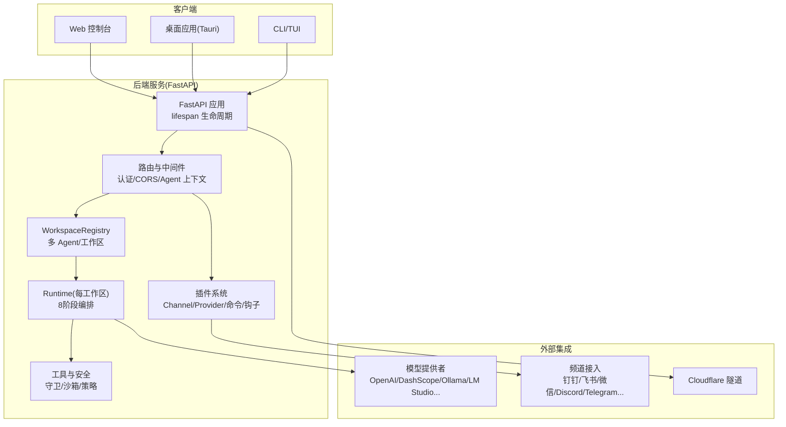
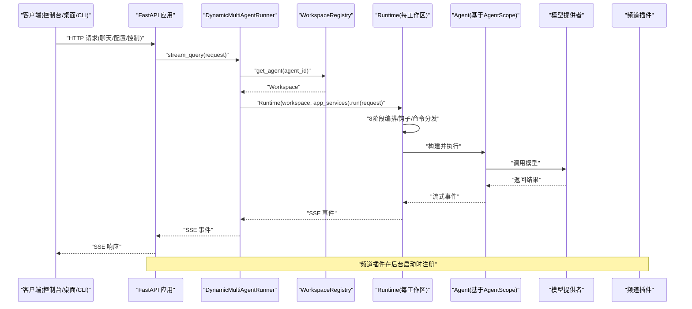
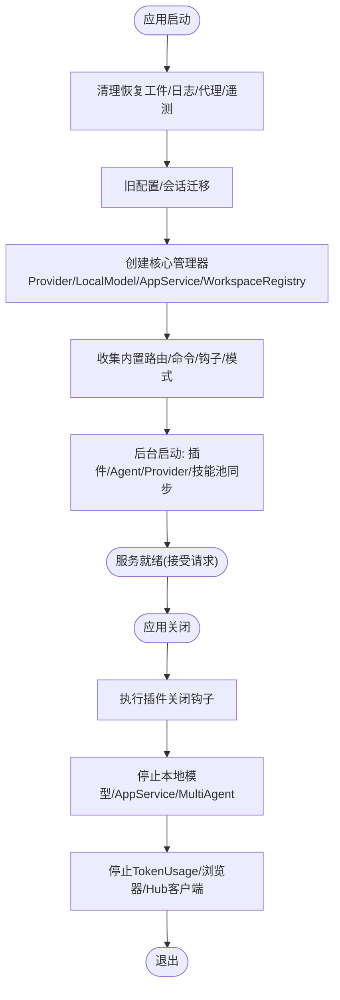
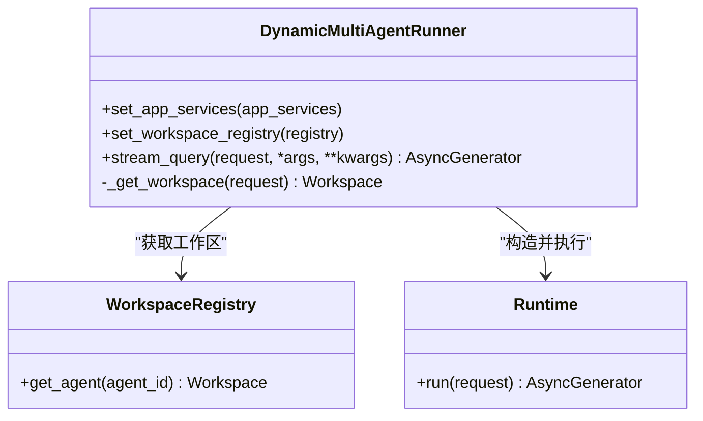
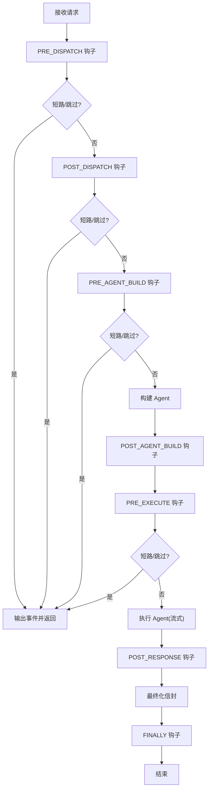
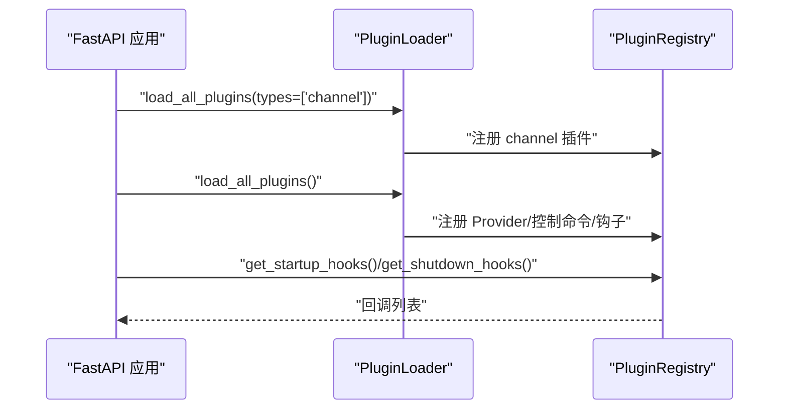
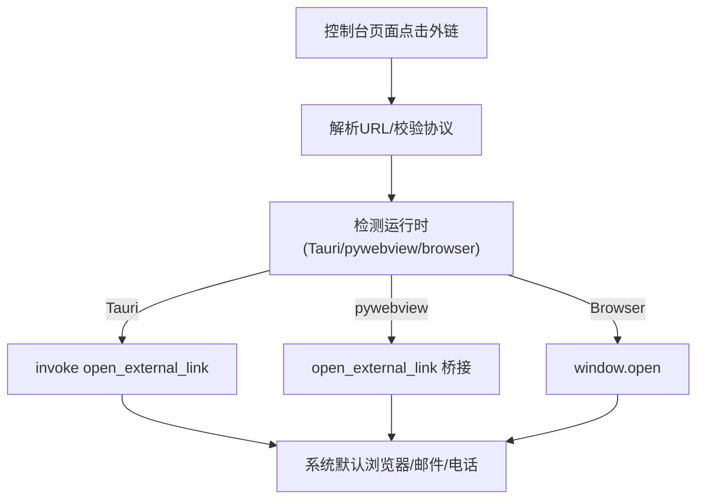
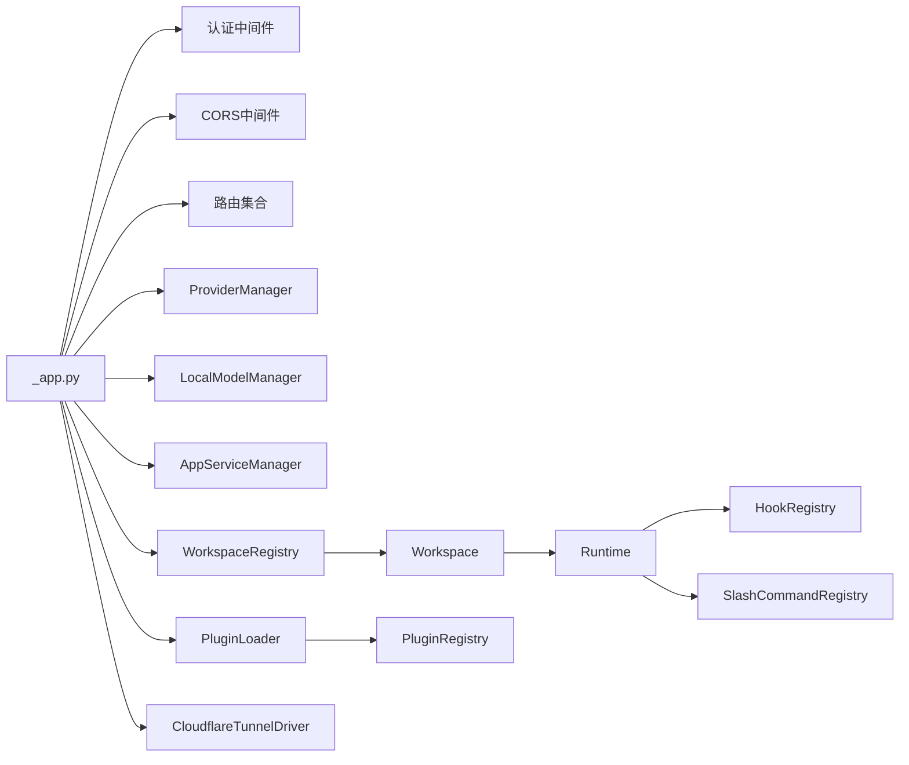

# 整体架构概览

<cite>
**本文引用的文件**   
- [README.md](file://README.md)
- [__main__.py](file://src/qwenpaw/__main__.py)
- [_app.py](file://src/qwenpaw/app/_app.py)
- [workspace_registry.py](file://src/qwenpaw/app/workspace_registry.py)
- [runtime.py](file://src/qwenpaw/runtime/runtime.py)
- [cloudflare.py](file://src/qwenpaw/tunnel/cloudflare.py)
- [openExternalLink.ts](file://console/src/utils/openExternalLink.ts)
</cite>

## 目录
1. [简介](#简介)
2. [项目结构](#项目结构)
3. [核心组件](#核心组件)
4. [架构总览](#架构总览)
5. [详细组件分析](#详细组件分析)
6. [依赖关系分析](#依赖关系分析)
7. [性能与可扩展性](#性能与可扩展性)
8. [部署拓扑与运行形态](#部署拓扑与运行形态)
9. [故障排查指南](#故障排查指南)
10. [结论](#结论)

## 简介
QwenPaw 是基于 AgentScope 2.0 的“Agent OS”个人智能体工作站，提供 Web 控制台、桌面应用（Tauri）、CLI/TUI 以及多通道接入能力。系统以 FastAPI 为后端服务载体，采用“工作区 + 多 Agent + 插件生态”的设计，实现资源透明化、治理策略化、执行沙箱化的 Agent 运行时。通过“滚动上下文 + 长期记忆 + 技能池/市场 + 驱动层（MCP/ACP/A2A）”，形成可插拔、可扩展、可隔离的 Agent 操作系统。

## 项目结构
- 前端控制台：React + TypeScript，支持浏览器、Tauri 和 pywebview 三种宿主环境；统一外链打开策略与跨运行时适配。
- 后端服务：FastAPI 应用，生命周期管理集中在 lifespan，包含认证、CORS、静态资源、路由注册、插件加载、多 Agent 启动等。
- 运行时：按工作区实例化的 Runtime，负责 8 阶段编排、会话信封、构建与执行 Agent、错误与取消保护。
- 多 Agent 与工作区：WorkspaceRegistry 继承 MultiAgentManager，负责创建并引导 Workspace，注入内置钩子、命令、模式等。
- 插件生态：分阶段加载（先 channel 插件，再其余），注册 Provider、控制命令、启动/关闭钩子。
- 安全与治理：工具守卫、文件守卫、Skill 扫描、访问策略、内核级沙箱。
- 外部隧道：Cloudflare Quick Tunnel 驱动用于快速暴露本地服务。

图表来源
- [_app.py:162-792](file://src/qwenpaw/app/_app.py#L162-L792)
- [workspace_registry.py:24-46](file://src/qwenpaw/app/workspace_registry.py#L24-L46)
- [runtime.py:32-140](file://src/qwenpaw/runtime/runtime.py#L32-L140)
- [cloudflare.py:34-130](file://src/qwenpaw/tunnel/cloudflare.py#L34-L130)
- [openExternalLink.ts:1-145](file://console/src/utils/openExternalLink.ts#L1-L145)

章节来源
- [README.md:60-75](file://README.md#L60-L75)
- [__main__.py:1-7](file://src/qwenpaw/__main__.py#L1-L7)

## 核心组件
- FastAPI 应用与生命周期
  - lifespan 中完成轻量同步初始化、后台异步启动（插件、Agent、Provider 等）、优雅关闭（插件钩子、本地模型服务、AppServiceManager、浏览器与 Hub 客户端）。
  - 注册全局状态：ProviderManager、LocalModelManager、PluginLoader/Registry、MultiAgentManager（WorkspaceRegistry）。
- 动态多 Agent 运行器
  - DynamicMultiAgentRunner 根据请求中的 agent_id 选择对应 Workspace，构造 Runtime 并流式执行，注册外部任务以便优雅停机。
- 工作区注册表
  - WorkspaceRegistry 在创建 Workspace 后执行 bootstrap_plugins，注入内置钩子、命令、模式等，并设置 app_services 引用。
- 运行时编排
  - Runtime.run 定义 8 个阶段（PRE_DISPATCH → POST_DISPATCH → PRE_AGENT_BUILD → POST_AGENT_BUILD → PRE_EXECUTE → 构建 Agent → 执行 Agent → POST_RESPONSE → FINALLY），并在取消/异常路径下做部分响应注入与持久化保护。
- 插件系统
  - 分阶段加载：Phase 1 仅加载 channel 插件，随后并行启动所有配置的 Agent；Phase 2 加载其余插件，注册 Provider、控制命令、启动/关闭钩子。
- 安全与治理
  - 工具守卫、文件守卫、Skill 扫描、访问策略、内核级沙箱，贯穿工具调用与文件系统访问。
- 外部隧道
  - Cloudflare Quick Tunnel 驱动管理 cloudflared 子进程，解析公网 URL，健康检查与优雅停止。

章节来源
- [_app.py:162-792](file://src/qwenpaw/app/_app.py#L162-L792)
- [_app.py:77-159](file://src/qwenpaw/app/_app.py#L77-L159)
- [workspace_registry.py:24-46](file://src/qwenpaw/app/workspace_registry.py#L24-L46)
- [runtime.py:32-140](file://src/qwenpaw/runtime/runtime.py#L32-L140)
- [cloudflare.py:34-130](file://src/qwenpaw/tunnel/cloudflare.py#L34-L130)

## 架构总览
下图展示系统上下文与主要交互：前端控制台、桌面应用、CLI/TUI 均通过 HTTP 与 FastAPI 后端通信；后端通过插件系统与频道对接，通过 Provider 与模型服务交互；WorkspaceRegistry 管理多 Agent 工作区；Runtime 负责单次请求的端到端编排。

图表来源
- [_app.py:77-159](file://src/qwenpaw/app/_app.py#L77-L159)
- [_app.py:162-792](file://src/qwenpaw/app/_app.py#L162-L792)
- [workspace_registry.py:24-46](file://src/qwenpaw/app/workspace_registry.py#L24-L46)
- [runtime.py:32-140](file://src/qwenpaw/runtime/runtime.py#L32-L140)

## 详细组件分析

### FastAPI 应用与生命周期
- 启动阶段
  - 清理恢复工件、自动从环境变量注册、代理配置校验、遥测收集、旧配置迁移、会话历史回填。
  - 创建 ProviderManager、LocalModelManager、AppServiceManager、WorkspaceRegistry，并将它们挂到 app.state。
  - 收集内置 @api_action 路由、HITL 工具命令、内置工具函数、内置斜杠命令、内置生命周期钩子、内置提示贡献者、内置模式（Coding/Mission/Goal）。
  - 启动 TokenUsageManager 后台任务，打印就绪横幅。
- 后台启动
  - Phase 1：加载 channel 插件，确保 ChannelManager 首次创建即可发现。
  - 并行启动所有配置的 Agent，恢复本地模型服务。
  - Phase 2：加载其余插件，注册 Provider、控制命令、启动钩子。
  - 设置 Approval Service、技能池自动更新同步。
- 关闭阶段
  - 执行插件关闭钩子、停止本地模型服务、停止 AppServiceManager、停止 MultiAgentManager、并行停止 TokenUsageManager、浏览器、Hub 客户端。

图表来源
- [_app.py:162-792](file://src/qwenpaw/app/_app.py#L162-L792)

章节来源
- [_app.py:162-792](file://src/qwenpaw/app/_app.py#L162-L792)

### 动态多 Agent 运行器与请求路由
- 根据请求头或上下文获取当前 agent_id，从 WorkspaceRegistry 获取对应 Workspace。
- 注册外部任务键，构造 Runtime 并迭代其 run() 生成 SSE 事件。
- 异常捕获与任务注销，保证优雅停机期间不丢失任务追踪。

图表来源
- [_app.py:77-159](file://src/qwenpaw/app/_app.py#L77-L159)
- [workspace_registry.py:24-46](file://src/qwenpaw/app/workspace_registry.py#L24-L46)
- [runtime.py:32-140](file://src/qwenpaw/runtime/runtime.py#L32-L140)

章节来源
- [_app.py:77-159](file://src/qwenpaw/app/_app.py#L77-L159)
- [workspace_registry.py:24-46](file://src/qwenpaw/app/workspace_registry.py#L24-L46)

### 运行时编排（8 阶段）
- 阶段划分：PRE_DISPATCH、POST_DISPATCH、PRE_AGENT_BUILD、POST_AGENT_BUILD、PRE_EXECUTE、构建 Agent、执行 Agent、POST_RESPONSE、FINALLY。
- 短路/跳过机制：钩子可返回 SHORT_CIRCUIT 或 SKIP_AGENT，提前结束或跳过 Agent 执行。
- 取消与异常保护：在取消路径注入部分响应、关闭悬空工具调用、持久化中断会话；ON_ERROR 钩子输出错误信封。
- 上下文注入：将 context_injections 合并为 system 提示，按优先级排序插入输入消息。

图表来源
- [runtime.py:32-140](file://src/qwenpaw/runtime/runtime.py#L32-L140)
- [runtime.py:478-515](file://src/qwenpaw/runtime/runtime.py#L478-L515)

章节来源
- [runtime.py:32-140](file://src/qwenpaw/runtime/runtime.py#L32-L140)
- [runtime.py:478-515](file://src/qwenpaw/runtime/runtime.py#L478-L515)

### 插件生态系统
- 分阶段加载：
  - Phase 1：channel 插件优先加载，确保频道首次创建即可用。
  - Phase 2：其余插件加载，注册 Provider、控制命令、启动/关闭钩子。
- 控制命令注册：将插件提供的控制命令注册到 CommandRegistry，支持优先级。
- 启动/关闭钩子：插件可在应用启动与关闭时执行回调，支持协程。

图表来源
- [_app.py:497-677](file://src/qwenpaw/app/_app.py#L497-L677)

章节来源
- [_app.py:497-677](file://src/qwenpaw/app/_app.py#L497-L677)

### 工作空间隔离机制
- 每个工作区拥有独立 skills/ 副本，实际生效的技能来自工作区目录。
- 技能池作为共享源，支持广播、自动同步、外部路径挂载与冲突处理。
- 工作区创建时由 WorkspaceRegistry 注入内置钩子、命令、模式等，确保各工作区一致的可扩展点。

章节来源
- [workspace_registry.py:24-46](file://src/qwenpaw/app/workspace_registry.py#L24-L46)
- [README.md:60-75](file://README.md#L60-L75)

### 前端控制台与桌面应用交互
- 外链打开策略：统一检测 Tauri/pywebview/browser 运行时，校验协议白名单，委托原生打开器。
- 桌面应用：Tauri 封装后端侧边车，自动打开控制台窗口，支持托盘、权限与更新。

图表来源
- [openExternalLink.ts:1-145](file://console/src/utils/openExternalLink.ts#L1-L145)

章节来源
- [openExternalLink.ts:1-145](file://console/src/utils/openExternalLink.ts#L1-L145)

## 依赖关系分析
- 应用层依赖
  - FastAPI 应用依赖认证中间件、CORS、静态资源、路由模块。
  - 生命周期依赖 ProviderManager、LocalModelManager、AppServiceManager、WorkspaceRegistry。
- 运行时依赖
  - Runtime 依赖 Envelope、AgentBuilder、AgentExecutor、HookRegistry、SlashCommandRegistry。
- 插件依赖
  - PluginLoader 依赖 PluginRegistry，注册 Provider、控制命令、启动/关闭钩子。
- 外部依赖
  - CloudflareTunnelDriver 依赖 BinaryManager 管理 cloudflared 二进制。

图表来源
- [_app.py:162-792](file://src/qwenpaw/app/_app.py#L162-L792)
- [workspace_registry.py:24-46](file://src/qwenpaw/app/workspace_registry.py#L24-L46)
- [runtime.py:32-140](file://src/qwenpaw/runtime/runtime.py#L32-L140)
- [cloudflare.py:34-130](file://src/qwenpaw/tunnel/cloudflare.py#L34-L130)

章节来源
- [_app.py:162-792](file://src/qwenpaw/app/_app.py#L162-L792)
- [workspace_registry.py:24-46](file://src/qwenpaw/app/workspace_registry.py#L24-L46)
- [runtime.py:32-140](file://src/qwenpaw/runtime/runtime.py#L32-L140)
- [cloudflare.py:34-130](file://src/qwenpaw/tunnel/cloudflare.py#L34-L130)

## 性能与可扩展性
- 启动性能
  - 同步初始化目标 < 100ms，重型初始化（插件、Agent、Provider）放入后台任务，尽快接受请求。
  - 遥测与迁移失败不影响启动，容错设计提升可用性。
- 并发与流式
  - 使用异步生成器与 SSE 事件，支持长连接与实时反馈。
  - 外部任务注册与优雅停机保障长时间运行的 Agent 任务不被静默终止。
- 可扩展性
  - 插件体系支持 Provider、频道、控制命令、钩子等多维度扩展。
  - 工作区隔离与技能池/市场机制，使能力可按需装配与共享。
  - 8 阶段编排与 Hook 机制，允许在关键节点插入自定义逻辑。

[本节为通用指导，无需源码引用]

## 部署拓扑与运行形态
- 本地开发/单机部署
  - pip 安装或脚本一键安装，运行 qwenpaw app 启动后端，浏览器访问控制台。
  - Docker 镜像提供数据卷映射（working、secret、backups），支持 host.docker.internal 访问宿主机服务。
- 云端部署
  - 阿里云 ECS 一键部署、AgentScope Platform 托管、ModelScope Studio 部署。
- 桌面应用
  - Tauri 打包，自动拉起后端侧边车，零配置开箱即用。
- 隧道访问
  - Cloudflare Quick Tunnel 驱动提供临时公网地址，便于远程调试与分享。

章节来源
- [README.md:104-280](file://README.md#L104-L280)
- [cloudflare.py:34-130](file://src/qwenpaw/tunnel/cloudflare.py#L34-L130)

## 故障排查指南
- 启动失败
  - 检查恢复工件清理是否成功、代理配置是否合理、遥测是否被禁用。
  - 查看迁移与历史会话回填日志，确认未阻塞启动。
- 插件问题
  - 确认 channel 插件在 Phase 1 已加载，其余插件在 Phase 2 注册成功。
  - 检查控制命令与启动/关闭钩子是否抛出异常。
- 运行时异常
  - 关注 ON_ERROR 钩子输出与错误信封内容，定位中断原因。
  - 取消路径下的部分响应注入与持久化是否生效。
- 外部隧道
  - 检查 cloudflared 子进程健康状态与公网 URL 解析。

章节来源
- [_app.py:162-792](file://src/qwenpaw/app/_app.py#L162-L792)
- [runtime.py:140-206](file://src/qwenpaw/runtime/runtime.py#L140-L206)
- [cloudflare.py:97-130](file://src/qwenpaw/tunnel/cloudflare.py#L97-L130)

## 结论
QwenPaw 以 AgentScope 2.0 为基础，构建了面向个人的 Agent OS：通过 FastAPI 生命周期管理、多 Agent 运行时、插件生态与工作区隔离，实现了高内聚、低耦合、强扩展的系统架构。结合滚动上下文、长期记忆、安全治理与多通道接入，既满足本地隐私与可控性，又具备云端弹性与生态丰富性。未来可在更多渠道、模型、技能与 MCP 集成上持续演进，并通过社区贡献共同完善。