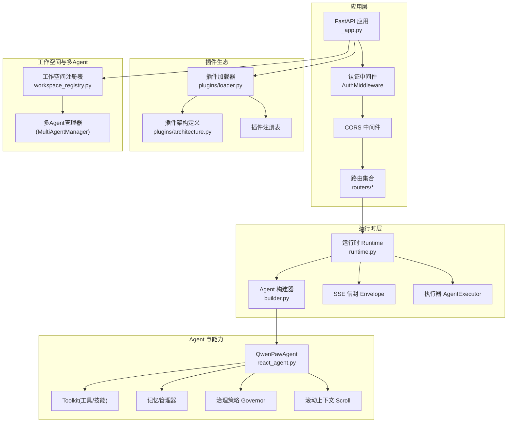
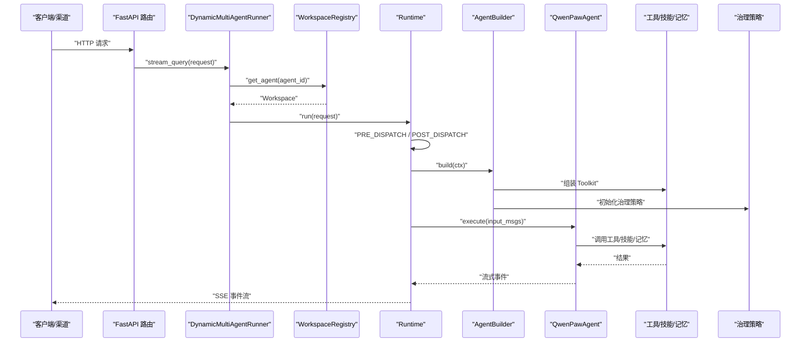
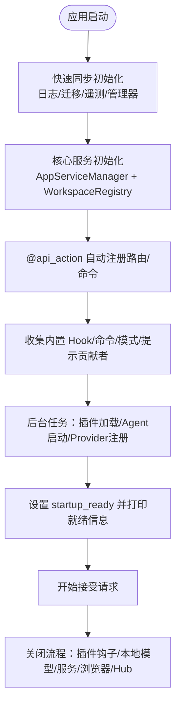
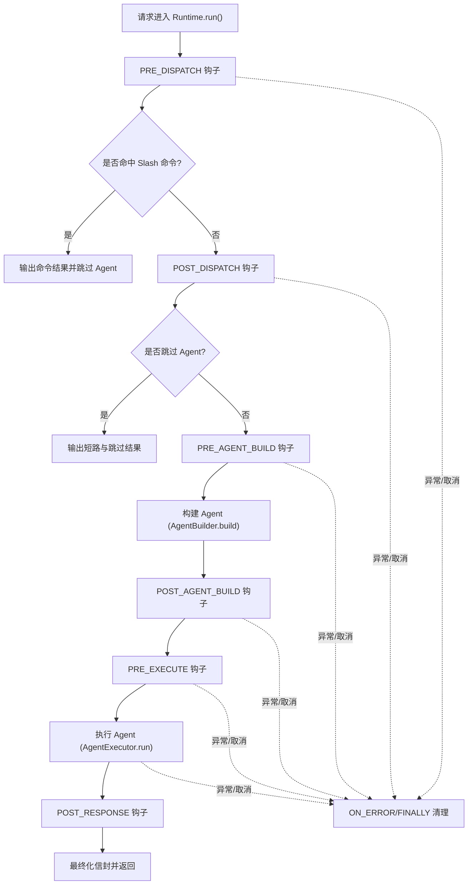
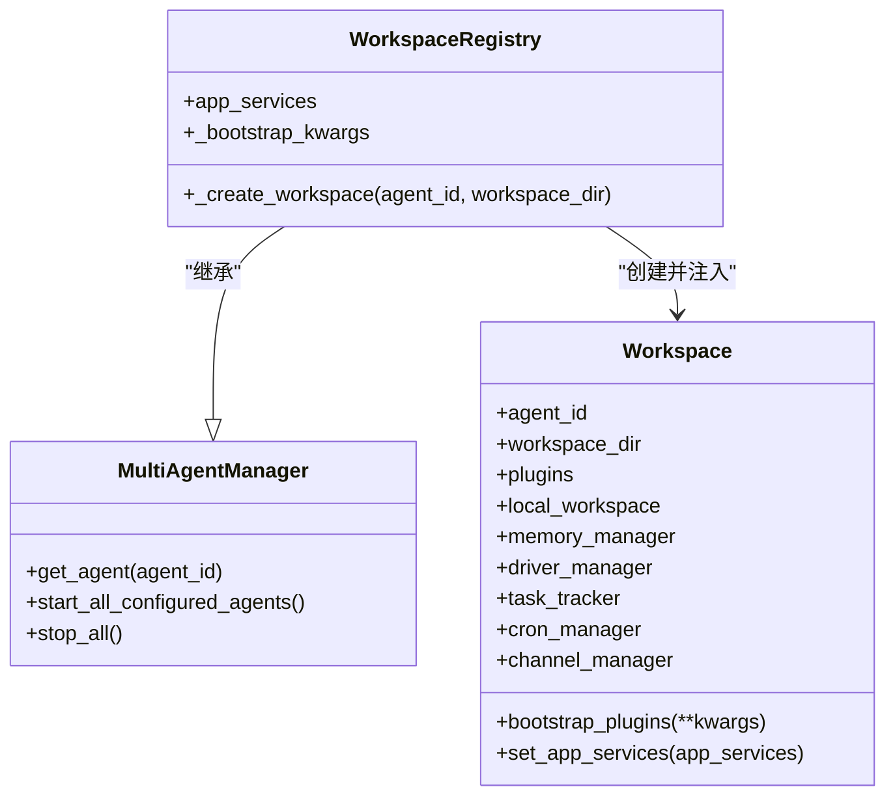
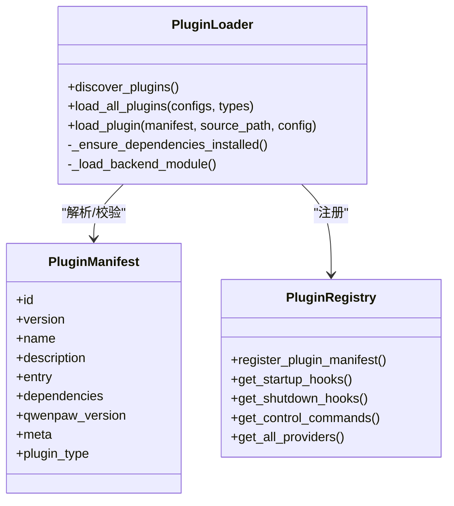
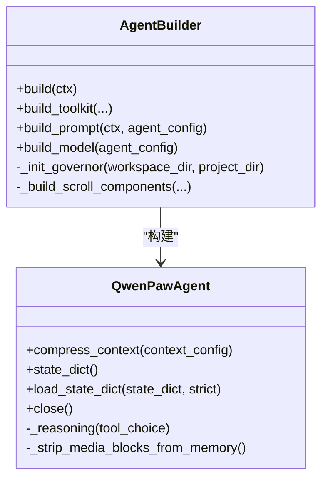
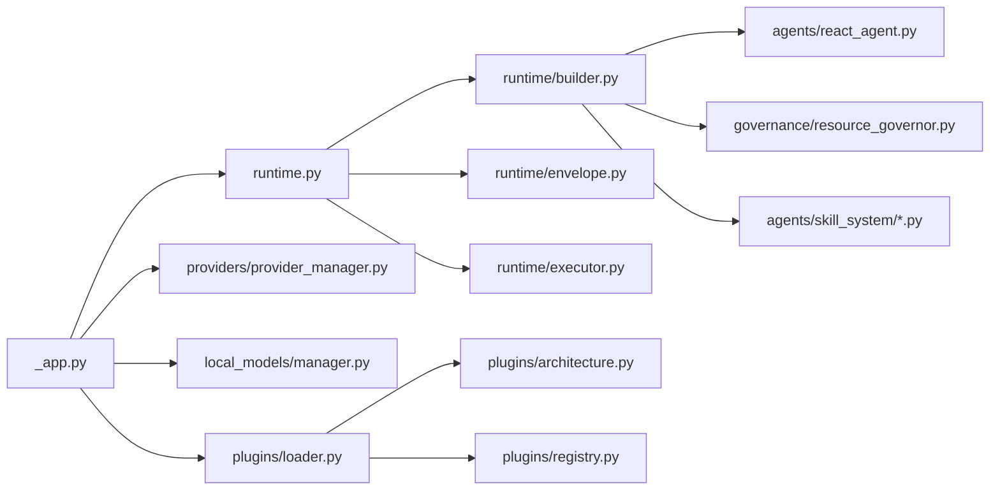

# 核心架构设计

<cite>
**本文引用的文件**   
- [README.md](file://README.md)
- [__init__.py](file://src/qwenpaw/__init__.py)
- [_app.py](file://src/qwenpaw/app/_app.py)
- [workspace_registry.py](file://src/qwenpaw/app/workspace_registry.py)
- [runtime.py](file://src/qwenpaw/runtime/runtime.py)
- [builder.py](file://src/qwenpaw/runtime/builder.py)
- [react_agent.py](file://src/qwenpaw/agents/react_agent.py)
- [architecture.py](file://src/qwenpaw/plugins/architecture.py)
- [loader.py](file://src/qwenpaw/plugins/loader.py)
</cite>

## 目录
1. [引言](#引言)
2. [项目结构](#项目结构)
3. [核心组件](#核心组件)
4. [架构总览](#架构总览)
5. [详细组件分析](#详细组件分析)
6. [依赖关系分析](#依赖关系分析)
7. [性能与可扩展性](#性能与可扩展性)
8. [横切关注点：安全、监控与灾难恢复](#横切关注点安全监控与灾难恢复)
9. [部署拓扑与基础设施要求](#部署拓扑与基础设施要求)
10. [技术栈与兼容性](#技术栈与兼容性)
11. [故障排查指南](#故障排查指南)
12. [结论](#结论)

## 引言
QwenPaw 是基于 AgentScope 2.0 的“Agent OS”个人智能助手平台，提供工作空间隔离、治理策略、沙箱执行、插件生态、多通道接入与长上下文滚动记忆等能力。其核心目标是：以可插拔的运行时与插件体系，将模型、工具、技能、渠道与用户界面统一编排为可配置、可观测、可治理的 Agent 操作系统。

## 项目结构
- 后端服务（FastAPI）负责应用生命周期、路由注册、工作空间与多 Agent 管理、插件加载与启动钩子、后台任务（Token 用量统计、本地模型恢复等）。
- 运行时（Runtime）按 8 阶段编排请求：预处理、命令分发、构建 Agent、执行、后置处理、错误与取消路径、最终清理。
- 工作空间（Workspace）通过 Registry 创建并注入内置 Hook、模式、提示贡献者、Slash 命令与工具集。
- 插件系统支持工具、提供者、Hook、命令、渠道、前端扩展等类型，具备版本兼容检查与依赖安装。
- Agent 基于 AgentScope 2.0 ReAct 框架，集成工具、技能、记忆、滚动上下文与治理策略。

**图表来源** 
- [_app.py:787-800](file://src/qwenpaw/app/_app.py#L787-L800)
- [runtime.py:32-140](file://src/qwenpaw/runtime/runtime.py#L32-L140)
- [builder.py:125-330](file://src/qwenpaw/runtime/builder.py#L125-L330)
- [react_agent.py:47-133](file://src/qwenpaw/agents/react_agent.py#L47-L133)
- [workspace_registry.py:24-46](file://src/qwenpaw/app/workspace_registry.py#L24-L46)
- [loader.py:119-130](file://src/qwenpaw/plugins/loader.py#L119-L130)
- [architecture.py:12-39](file://src/qwenpaw/plugins/architecture.py#L12-L39)

**章节来源**
- [README.md:62-74](file://README.md#L62-L74)
- [_app.py:162-247](file://src/qwenpaw/app/_app.py#L162-L247)
- [workspace_registry.py:24-46](file://src/qwenpaw/app/workspace_registry.py#L24-L46)

## 核心组件
- 应用与服务装配
  - FastAPI 应用通过 lifespan 完成快速同步初始化与后台异步启动；注册中间件、路由、状态对象，并在后台任务中加载插件、启动 Agent、注册控制命令与启动钩子。
- 运行时编排
  - Runtime 实现 8 阶段生命周期，协调 Slash 命令分发、Agent 构建与执行、错误与取消路径、以及最终清理。
- 工作空间与多 Agent
  - WorkspaceRegistry 继承 MultiAgentManager，在创建 Workspace 时注入内置 Hook、模式、提示贡献者与工具集，并提供跨工作空间的 AppService 引用。
- 插件系统
  - 插件架构定义类型、清单与版本约束；加载器负责发现、校验、依赖安装、动态导入与注册，支持前后端入口与多种插件类型。
- Agent 与能力
  - QwenPawAgent 基于 AgentScope 2.0，集成工具、技能、记忆、滚动上下文与治理策略，支持媒体块自适应与中断恢复。

**章节来源**
- [_app.py:497-677](file://src/qwenpaw/app/_app.py#L497-L677)
- [runtime.py:32-140](file://src/qwenpaw/runtime/runtime.py#L32-L140)
- [workspace_registry.py:24-46](file://src/qwenpaw/app/workspace_registry.py#L24-L46)
- [loader.py:119-130](file://src/qwenpaw/plugins/loader.py#L119-L130)
- [architecture.py:12-39](file://src/qwenpaw/plugins/architecture.py#L12-L39)
- [react_agent.py:47-133](file://src/qwenpaw/agents/react_agent.py#L47-L133)

## 架构总览
QwenPaw 采用分层与事件驱动相结合的架构：
- 表现层：Console Web UI、TUI、桌面应用、多渠道（钉钉、飞书、Discord 等）作为客户端接入。
- 应用层：FastAPI 服务暴露 REST API，承载认证、CORS、路由与中间件。
- 运行时层：统一的 8 阶段编排，屏蔽具体 Agent 实现细节，提供可扩展的 Hook 机制。
- 能力层：工具、技能、记忆、滚动上下文、治理策略与沙箱共同构成 Agent 的执行环境。
- 插件层：以声明式清单与动态加载为核心，支撑工具、提供者、Hook、命令、渠道与前端扩展。

**图表来源** 
- [_app.py:77-159](file://src/qwenpaw/app/_app.py#L77-L159)
- [runtime.py:49-140](file://src/qwenpaw/runtime/runtime.py#L49-L140)
- [builder.py:125-330](file://src/qwenpaw/runtime/builder.py#L125-L330)
- [react_agent.py:47-133](file://src/qwenpaw/agents/react_agent.py#L47-L133)

## 详细组件分析

### 应用与服务装配（FastAPI）
- 生命周期管理
  - lifespan 内完成日志、迁移、遥测、Provider/LocalModel 管理器获取、AppServiceManager 与 WorkspaceRegistry 初始化、@api_action 自动注册、内置 Slash 命令与 Hook 收集、TokenUsageManager 后台任务启动。
  - 后台任务并行加载插件（先 channel 类型）、启动所有配置的 Agent、注册 Provider、控制命令与启动钩子，最后设置 startup_ready 事件。
- 中间件与路由
  - 注册 AgentContextMiddleware、AuthMiddleware、CORS 中间件；挂载健康检查、聊天、编码模式、循环、工具调用、语音等路由。
- 资源清理
  - 关闭插件钩子、本地模型服务、AppServiceManager、多 Agent 管理器，并行停止 TokenUsageManager、浏览器与 Skill Hub 客户端。

**图表来源** 
- [_app.py:162-247](file://src/qwenpaw/app/_app.py#L162-L247)
- [_app.py:497-677](file://src/qwenpaw/app/_app.py#L497-L677)
- [_app.py:688-784](file://src/qwenpaw/app/_app.py#L688-L784)

**章节来源**
- [_app.py:162-247](file://src/qwenpaw/app/_app.py#L162-L247)
- [_app.py:497-677](file://src/qwenpaw/app/_app.py#L497-L677)
- [_app.py:688-784](file://src/qwenpaw/app/_app.py#L688-L784)

### 运行时编排（8 阶段）
- 阶段划分
  - PRE_DISPATCH → 固定步骤：Slash 命令分发 → POST_DISPATCH → PRE_AGENT_BUILD → 固定步骤：构建 Agent → POST_AGENT_BUILD → PRE_EXECUTE → 固定步骤：执行 Agent → POST_RESPONSE → ON_ERROR/FINALLY。
- 取消与错误处理
  - 捕获 CancelledError 与 BaseException，持久化中断时的部分响应与未闭合工具调用，确保会话一致性。
- 上下文注入
  - 合并 context_injections 为 system 提示，按优先级插入到输入消息头部。

**图表来源** 
- [runtime.py:49-140](file://src/qwenpaw/runtime/runtime.py#L49-L140)
- [runtime.py:141-206](file://src/qwenpaw/runtime/runtime.py#L141-L206)
- [runtime.py:478-515](file://src/qwenpaw/runtime/runtime.py#L478-L515)

**章节来源**
- [runtime.py:49-140](file://src/qwenpaw/runtime/runtime.py#L49-L140)
- [runtime.py:141-206](file://src/qwenpaw/runtime/runtime.py#L141-L206)
- [runtime.py:478-515](file://src/qwenpaw/runtime/runtime.py#L478-L515)

### 工作空间与多 Agent 管理
- WorkspaceRegistry 在创建 Workspace 后执行 bootstrap_plugins，注入内置 Hook、模式、提示贡献者与工具集，并设置 app_services 引用。
- 继承 MultiAgentManager 的行为：懒加载、热重载、并行启动等。

**图表来源** 
- [workspace_registry.py:24-46](file://src/qwenpaw/app/workspace_registry.py#L24-L46)

**章节来源**
- [workspace_registry.py:24-46](file://src/qwenpaw/app/workspace_registry.py#L24-L46)

### 插件系统与生态
- 插件类型与清单
  - 支持 tool/provider/hook/command/channel/frontend/general 类型；清单包含 id、version、name、description、entry、dependencies、qwenpaw_version 等字段，并支持向后兼容推断。
- 加载流程
  - 发现 plugin.json → 解析清单 → 版本兼容检查 → 依赖安装（requirements.txt）→ 动态导入模块 → 调用 register(api) 注册能力 → 注册到 PluginRegistry。
- 生命周期
  - 启动钩子与关闭钩子在应用生命周期中执行；控制命令注册到 CommandRegistry。

**图表来源** 
- [architecture.py:114-210](file://src/qwenpaw/plugins/architecture.py#L114-L210)
- [loader.py:119-130](file://src/qwenpaw/plugins/loader.py#L119-L130)
- [loader.py:514-607](file://src/qwenpaw/plugins/loader.py#L514-L607)

**章节来源**
- [architecture.py:12-39](file://src/qwenpaw/plugins/architecture.py#L12-L39)
- [architecture.py:114-210](file://src/qwenpaw/plugins/architecture.py#L114-L210)
- [loader.py:119-130](file://src/qwenpaw/plugins/loader.py#L119-L130)
- [loader.py:514-607](file://src/qwenpaw/plugins/loader.py#L514-L607)

### Agent 构建与执行
- AgentBuilder
  - 从工作空间获取工具集，结合 Coding Mode 工具、Driver 工具与提示线索，构建模型与格式化器，选择滚动上下文策略，注入治理策略与记忆管理器，最终构造 QwenPawAgent。
- QwenPawAgent
  - 基于 AgentScope 2.0，集成工具、技能、记忆、滚动上下文与治理策略；支持媒体块自适应、中断恢复、Stop Handler 与 ToolCoordinator 超时配置。

**图表来源** 
- [builder.py:125-330](file://src/qwenpaw/runtime/builder.py#L125-L330)
- [react_agent.py:47-133](file://src/qwenpaw/agents/react_agent.py#L47-L133)
- [react_agent.py:145-184](file://src/qwenpaw/agents/react_agent.py#L145-L184)
- [react_agent.py:288-334](file://src/qwenpaw/agents/react_agent.py#L288-L334)

**章节来源**
- [builder.py:125-330](file://src/qwenpaw/runtime/builder.py#L125-L330)
- [react_agent.py:47-133](file://src/qwenpaw/agents/react_agent.py#L47-L133)
- [react_agent.py:145-184](file://src/qwenpaw/agents/react_agent.py#L145-L184)
- [react_agent.py:288-334](file://src/qwenpaw/agents/react_agent.py#L288-L334)

## 依赖关系分析
- 内部依赖
  - _app.py 依赖 runtime、providers、local_models、plugins、hooks、modes、token_usage 等子系统。
  - runtime.py 依赖 builder、envelope、executor、hooks、phases、message_convert。
  - builder.py 依赖 agentscope、governance、skill_system、config、constant、providers。
  - react_agent.py 依赖 agentscope、loop.gates、modes.coding、providers.model_capability_cache。
  - plugins/loader.py 依赖 architecture、registry、install_lock、importlib.metadata、packaging.requirements。
- 外部依赖
  - FastAPI、AgentScope 2.0、uv/pip、subprocess、asyncio、pathlib、pydantic。

**图表来源** 
- [_app.py:162-247](file://src/qwenpaw/app/_app.py#L162-L247)
- [runtime.py:1-28](file://src/qwenpaw/runtime/runtime.py#L1-L28)
- [builder.py:1-20](file://src/qwenpaw/runtime/builder.py#L1-L20)
- [react_agent.py:1-44](file://src/qwenpaw/agents/react_agent.py#L1-L44)
- [loader.py:1-26](file://src/qwenpaw/plugins/loader.py#L1-L26)
- [architecture.py:1-11](file://src/qwenpaw/plugins/architecture.py#L1-L11)

**章节来源**
- [_app.py:162-247](file://src/qwenpaw/app/_app.py#L162-L247)
- [runtime.py:1-28](file://src/qwenpaw/runtime/runtime.py#L1-L28)
- [builder.py:1-20](file://src/qwenpaw/runtime/builder.py#L1-L20)
- [react_agent.py:1-44](file://src/qwenpaw/agents/react_agent.py#L1-L44)
- [loader.py:1-26](file://src/qwenpaw/plugins/loader.py#L1-L26)
- [architecture.py:1-11](file://src/qwenpaw/plugins/architecture.py#L1-L11)

## 性能与可扩展性
- 启动性能
  - 快速同步初始化目标 < 100ms，后台任务并行加载插件与启动 Agent，避免阻塞首请求。
- 并发与资源
  - 多 Agent 并行启动；TokenUsageManager 后台任务周期性刷新；浏览器与 Skill Hub 客户端并行关闭。
- 可扩展性
  - 插件类型丰富，支持自定义 Provider、Hook、Command、Channel、Frontend；工作空间隔离与治理策略使能力可按 Agent 维度扩展。
- 优化建议
  - 对长耗时初始化进一步异步化；按需懒加载大型插件；缓存模型能力检测结果；合理配置滚动上下文阈值与保留窗口。

[本节为通用指导，不直接分析具体文件]

## 横切关注点：安全、监控与灾难恢复
- 安全性
  - 治理策略（Governor）与 PolicyGuardedTool 对工具调用进行权限控制；沙箱（Seatbelt/Bubblewrap/AppContainer）限制文件系统视图；Skill Scanner 预激活扫描；File Guard 保护敏感路径。
- 监控与可观测性
  - Langfuse Trace Hook 可选启用；TokenUsageManager 统计用量；日志分级与项目文件处理器；遥测采集（匿名、仅一次）。
- 灾难恢复
  - 启动时清理恢复工件；会话中断时持久化部分响应与未闭合工具调用；备份与恢复卷（Docker）；历史滚动上下文保留与回收策略。

**章节来源**
- [README.md:384-393](file://README.md#L384-L393)
- [_app.py:174-184](file://src/qwenpaw/app/_app.py#L174-L184)
- [runtime.py:209-286](file://src/qwenpaw/runtime/runtime.py#L209-L286)
- [react_agent.py:288-334](file://src/qwenpaw/agents/react_agent.py#L288-L334)

## 部署拓扑与基础设施要求
- 部署方式
  - pip 安装、脚本一键安装、Docker、阿里云 ECS 一键部署、AgentScope Platform、ModelScope Studio、桌面应用（Tauri）。
- 容器化
  - Docker 镜像标签 latest/pre；数据卷 qwenpaw-data、qwenpaw-secrets、qwenpaw-backups；支持 host.docker.internal 访问宿主机 Ollama/LM Studio。
- 桌面应用
  - Tauri 打包，Windows/macOS 支持；首次启动需初始化 Python 环境与依赖。
- 网络与安全
  - 默认监听 127.0.0.1:8088；可通过反向代理暴露；CORS 与认证中间件可控。

**章节来源**
- [README.md:104-174](file://README.md#L104-L174)
- [README.md:218-261](file://README.md#L218-L261)
- [README.md:283-324](file://README.md#L283-L324)

## 技术栈与兼容性
- 语言与框架
  - Python 3.11~3.13；FastAPI；AgentScope 2.0；Pydantic；uv/pip。
- 前端与桌面
  - Console Web UI（React/Vite）；Tauri 桌面应用。
- 插件生态
  - 插件清单与类型定义；版本约束（>=min, <max）；依赖安装（pip/uv）。
- 兼容性
  - 插件版本兼容检查；旧版 manifest 字段兼容；向后兼容的会话格式迁移。

**章节来源**
- [README.md:8-14](file://README.md#L8-L14)
- [architecture.py:100-112](file://src/qwenpaw/plugins/architecture.py#L100-L112)
- [loader.py:192-206](file://src/qwenpaw/plugins/loader.py#L192-L206)

## 故障排查指南
- 启动失败
  - 检查恢复工件清理是否成功；查看后台任务日志；确认 Provider 与 LocalModel 管理器初始化。
- 插件加载失败
  - 核对 plugin.json 清单与 entry 路径；检查版本兼容与 requirements.txt；查看依赖安装日志与 uv/pip 可用性。
- 会话中断或丢失
  - 确认 Runtime 的取消保存逻辑是否触发；检查滚动上下文与 offloader 清理策略；验证历史数据库句柄释放。
- 工具调用被拒绝
  - 检查治理策略与沙箱配置；确认 PolicyGuardedTool 包装是否正确；查看 ToolCoordinator 超时与重试策略。

**章节来源**
- [_app.py:174-184](file://src/qwenpaw/app/_app.py#L174-L184)
- [loader.py:514-607](file://src/qwenpaw/plugins/loader.py#L514-L607)
- [runtime.py:209-286](file://src/qwenpaw/runtime/runtime.py#L209-L286)
- [react_agent.py:288-334](file://src/qwenpaw/agents/react_agent.py#L288-L334)

## 结论
QwenPaw 以 AgentScope 2.0 为基础，构建了以工作空间为核心的 Agent OS：通过 8 阶段运行时编排、插件生态与治理策略，实现了高可扩展、强安全、可观测的个人智能助手平台。其分层架构与模块化设计便于横向扩展（更多渠道、模型、技能、MCP），纵向深化（滚动上下文、长期记忆、Loop Engineering），并支持本地与云端多种部署形态。