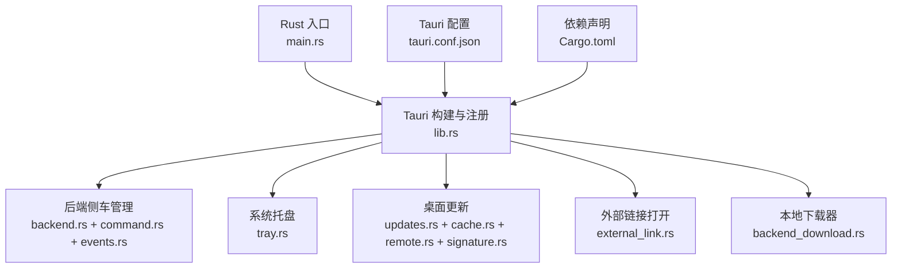
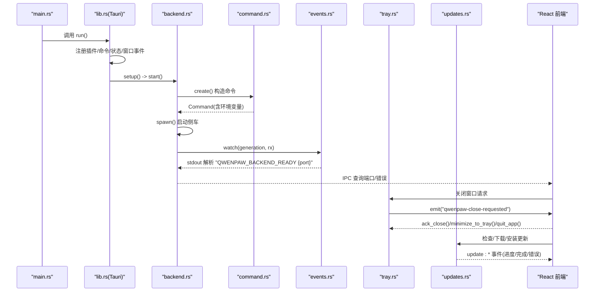
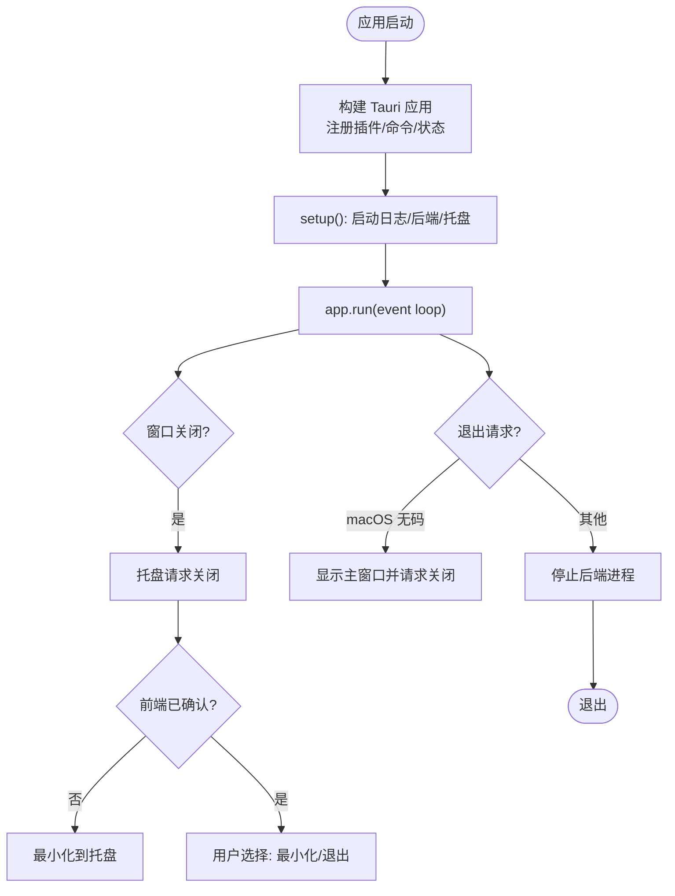
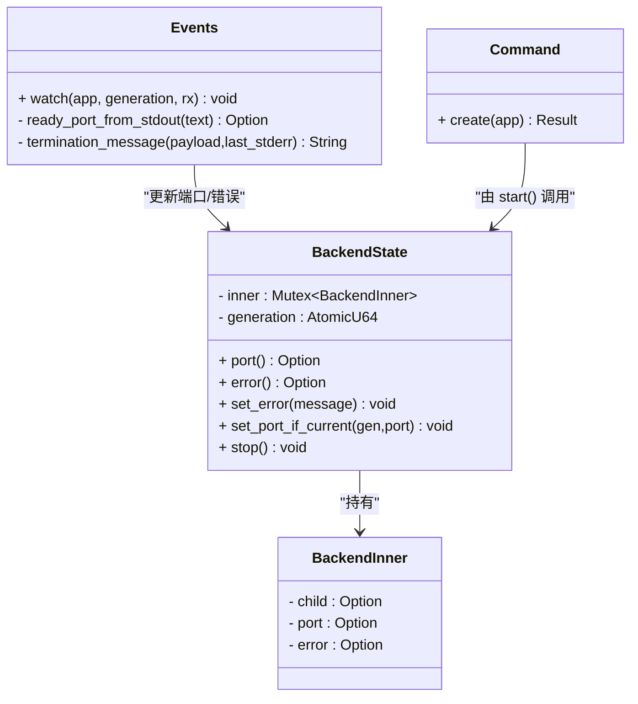
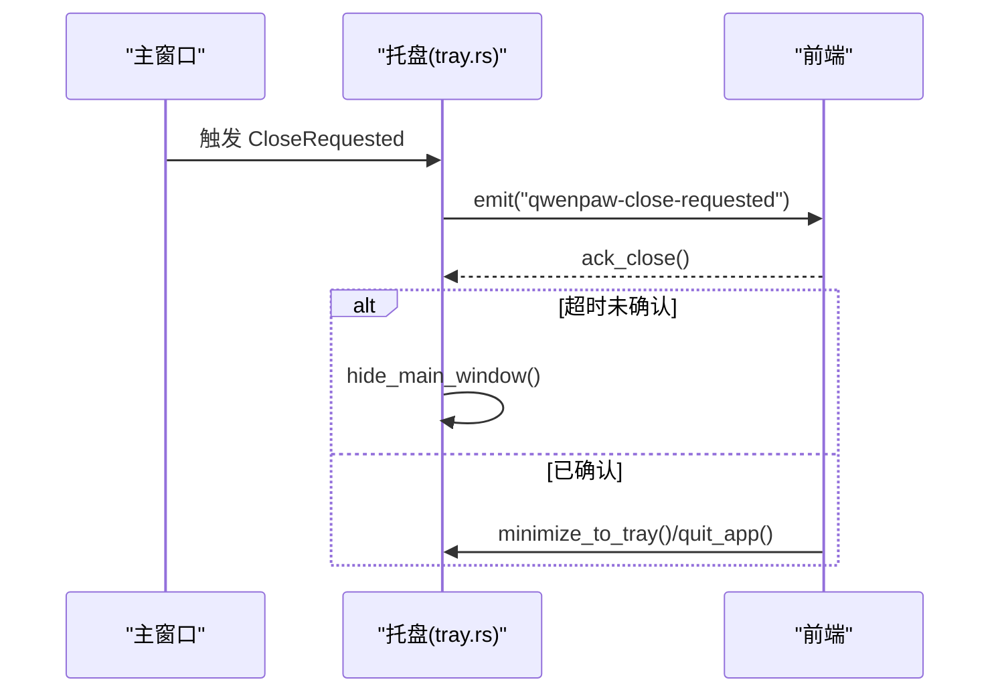
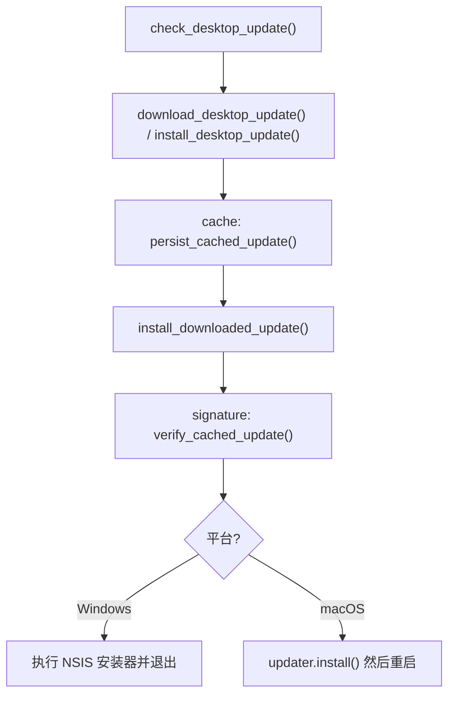
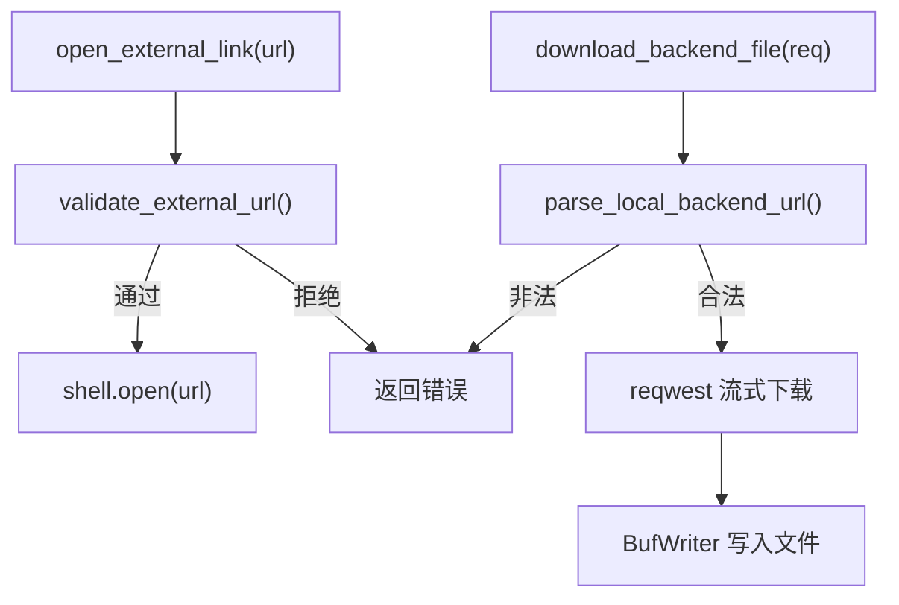
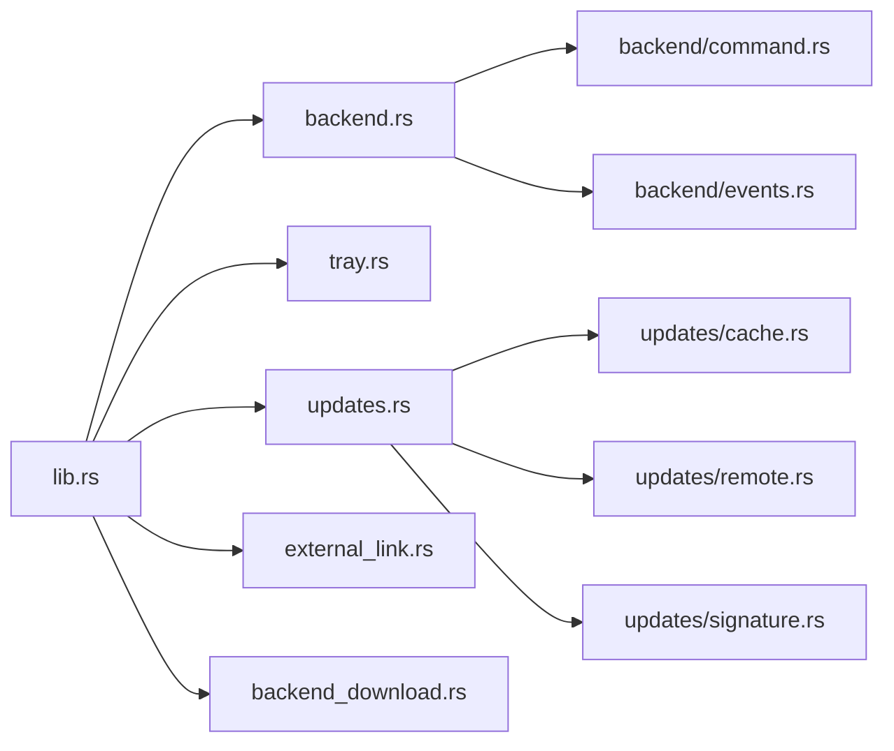

# Tauri 应用架构

<cite>
**本文引用的文件**
- [console/src-tauri/tauri.conf.json](file://console/src-tauri/tauri.conf.json)
- [console/src-tauri/Cargo.toml](file://console/src-tauri/Cargo.toml)
- [console/src-tauri/src/main.rs](file://console/src-tauri/src/main.rs)
- [console/src-tauri/src/lib.rs](file://console/src-tauri/src/lib.rs)
- [console/src-tauri/src/backend.rs](file://console/src-tauri/src/backend.rs)
- [console/src-tauri/src/backend/command.rs](file://console/src-tauri/src/backend/command.rs)
- [console/src-tauri/src/backend/events.rs](file://console/src-tauri/src/backend/events.rs)
- [console/src-tauri/src/tray.rs](file://console/src-tauri/src/tray.rs)
- [console/src-tauri/src/updates.rs](file://console/src-tauri/src/updates.rs)
- [console/src-tauri/src/external_link.rs](file://console/src-tauri/src/external_link.rs)
- [console/src-tauri/src/backend_download.rs](file://console/src-tauri/src/backend_download.rs)
- [console/src-tauri/src/updates/cache.rs](file://console/src-tauri/src/updates/cache.rs)
- [console/src-tauri/src/updates/remote.rs](file://console/src-tauri/src/updates/remote.rs)
- [console/src-tauri/src/updates/signature.rs](file://console/src-tauri/src/updates/signature.rs)
</cite>

## 目录
1. [简介](#简介)
2. [项目结构](#项目结构)
3. [核心组件](#核心组件)
4. [架构总览](#架构总览)
5. [详细组件分析](#详细组件分析)
6. [依赖关系分析](#依赖关系分析)
7. [性能与可靠性考虑](#性能与可靠性考虑)
8. [故障排查指南](#故障排查指南)
9. [结论](#结论)
10. [附录：配置项与接口清单](#附录配置项与接口清单)

## 简介
本文件面向 QwenPaw 桌面端（Tauri）的架构与实现，聚焦以下目标：
- 解释 Tauri 应用的初始化流程、窗口管理、安全策略与插件系统
- 记录 Rust 后端与前端 React 的通信机制（IPC 命令、事件）
- 梳理侧车进程（Python FastAPI 后端）的生命周期管理与错误上报
- 说明托盘集成、外部链接打开、本地下载器与桌面自动更新等能力
- 提供可操作的排障建议与最佳实践

## 项目结构
Tauri 壳工程位于 console/src-tauri，包含：
- 构建与打包配置：tauri.conf.json、Cargo.toml、build.rs
- Rust 源码：main.rs、lib.rs 以及功能模块 backend、tray、updates、external_link、backend_download
- 权限与能力：permissions/*.toml、capabilities/default.json
- 资源与安装器：icons、nsis、nsis-languages

图表来源
- [console/src-tauri/src/main.rs:1-7](file://console/src-tauri/src/main.rs#L1-L7)
- [console/src-tauri/src/lib.rs:1-98](file://console/src-tauri/src/lib.rs#L1-L98)
- [console/src-tauri/tauri.conf.json:1-91](file://console/src-tauri/tauri.conf.json#L1-L91)
- [console/src-tauri/Cargo.toml:1-38](file://console/src-tauri/Cargo.toml#L1-L38)

章节来源
- [console/src-tauri/src/main.rs:1-7](file://console/src-tauri/src/main.rs#L1-L7)
- [console/src-tauri/src/lib.rs:1-98](file://console/src-tauri/src/lib.rs#L1-L98)
- [console/src-tauri/tauri.conf.json:1-91](file://console/src-tauri/tauri.conf.json#L1-L91)
- [console/src-tauri/Cargo.toml:1-38](file://console/src-tauri/Cargo.toml#L1-L38)

## 核心组件
- 应用启动与生命周期
  - main.rs 调用 app_lib::run() 进入 Tauri 运行期
  - lib.rs 中完成插件加载、命令注册、状态管理、窗口事件处理与应用退出钩子
- 后端侧车（Python FastAPI）
  - backend.rs 负责启动/停止、端口发现、错误传播、重启
  - command.rs 构造开发/打包两种启动命令与环境变量
  - events.rs 监听 stdout/stderr，解析“就绪”信号并捕获终止原因
- 系统托盘
  - tray.rs 提供最小化到托盘、退出、显示主窗口、关闭确认与国际化菜单文本
- 桌面更新
  - updates.rs 暴露检查/下载/安装命令，支持后台缓存与二次校验
  - cache.rs 管理缓存目录、元数据、平台校验与产物命名
  - remote.rs 封装 check/download 流程与进度事件
  - signature.rs 复用 minisign 公钥进行签名验证
- 外部链接与安全下载
  - external_link.rs 白名单协议校验后通过 shell.open 打开
  - backend_download.rs 仅允许访问本地回环地址，流式写入用户选择路径

章节来源
- [console/src-tauri/src/lib.rs:1-98](file://console/src-tauri/src/lib.rs#L1-L98)
- [console/src-tauri/src/backend.rs:1-200](file://console/src-tauri/src/backend.rs#L1-L200)
- [console/src-tauri/src/backend/command.rs:1-217](file://console/src-tauri/src/backend/command.rs#L1-L217)
- [console/src-tauri/src/backend/events.rs:1-151](file://console/src-tauri/src/backend/events.rs#L1-L151)
- [console/src-tauri/src/tray.rs:1-197](file://console/src-tauri/src/tray.rs#L1-L197)
- [console/src-tauri/src/updates.rs:1-288](file://console/src-tauri/src/updates.rs#L1-L288)
- [console/src-tauri/src/updates/cache.rs:1-161](file://console/src-tauri/src/updates/cache.rs#L1-L161)
- [console/src-tauri/src/updates/remote.rs:1-104](file://console/src-tauri/src/updates/remote.rs#L1-L104)
- [console/src-tauri/src/updates/signature.rs:1-69](file://console/src-tauri/src/updates/signature.rs#L1-L69)
- [console/src-tauri/src/external_link.rs:1-51](file://console/src-tauri/src/external_link.rs#L1-L51)
- [console/src-tauri/src/backend_download.rs:1-420](file://console/src-tauri/src/backend_download.rs#L1-L420)

## 架构总览
下图展示从应用启动到前端可用的关键路径，包括侧车进程启动、就绪检测、窗口关闭与托盘交互、更新流程。

图表来源
- [console/src-tauri/src/main.rs:1-7](file://console/src-tauri/src/main.rs#L1-L7)
- [console/src-tauri/src/lib.rs:1-98](file://console/src-tauri/src/lib.rs#L1-L98)
- [console/src-tauri/src/backend.rs:1-200](file://console/src-tauri/src/backend.rs#L1-L200)
- [console/src-tauri/src/backend/command.rs:1-217](file://console/src-tauri/src/backend/command.rs#L1-L217)
- [console/src-tauri/src/backend/events.rs:1-151](file://console/src-tauri/src/backend/events.rs#L1-L151)
- [console/src-tauri/src/tray.rs:1-197](file://console/src-tauri/src/tray.rs#L1-L197)
- [console/src-tauri/src/updates.rs:1-288](file://console/src-tauri/src/updates.rs#L1-L288)

## 详细组件分析

### 应用初始化与生命周期
- 入口与构建
  - main.rs 仅做平台子系统开关与调用 app_lib::run()
  - lib.rs 使用 tauri::Builder 注册插件（shell/dialog/updater）、命令、全局状态（BackendState、TrayState），并在 setup 阶段启动后端与托盘
- 窗口与退出
  - 拦截 CloseRequested，阻止默认关闭，转交托盘逻辑；macOS 下 ExitRequested 与 Reopen 有特殊处理
  - 退出时调用 backend::stop 确保侧车进程被清理

图表来源
- [console/src-tauri/src/lib.rs:1-98](file://console/src-tauri/src/lib.rs#L1-L98)
- [console/src-tauri/src/tray.rs:1-197](file://console/src-tauri/src/tray.rs#L1-L197)
- [console/src-tauri/src/backend.rs:1-200](file://console/src-tauri/src/backend.rs#L1-L200)

章节来源
- [console/src-tauri/src/main.rs:1-7](file://console/src-tauri/src/main.rs#L1-L7)
- [console/src-tauri/src/lib.rs:1-98](file://console/src-tauri/src/lib.rs#L1-L98)

### 后端侧车（Python FastAPI）管理
- 启动与命令构造
  - 开发模式：优先 uv，否则 python/python3/py，设置 PYTHONPATH 指向源码根 src
  - 打包模式：定位 resources/binaries/qwenpaw-backend，注入 PATH、QWENPAW_DESKTOP_PY_RUNTIME、QWENPAW_DESKTOP_NODE_RUNTIME
- 进程监控与就绪检测
  - 监听 stdout/stderr，解析以固定前缀开头的 JSON 行获取端口
  - 将错误信息截断保存，避免 OOM；进程异常退出时返回最后 stderr 片段
- 状态与并发安全
  - 使用 generation 序列号保证只更新当前实例的状态，避免竞态
  - 提供 restart_backend 命令用于热重启

图表来源
- [console/src-tauri/src/backend.rs:1-200](file://console/src-tauri/src/backend.rs#L1-L200)
- [console/src-tauri/src/backend/events.rs:1-151](file://console/src-tauri/src/backend/events.rs#L1-L151)
- [console/src-tauri/src/backend/command.rs:1-217](file://console/src-tauri/src/backend/command.rs#L1-L217)

章节来源
- [console/src-tauri/src/backend.rs:1-200](file://console/src-tauri/src/backend.rs#L1-L200)
- [console/src-tauri/src/backend/command.rs:1-217](file://console/src-tauri/src/backend/command.rs#L1-L217)
- [console/src-tauri/src/backend/events.rs:1-151](file://console/src-tauri/src/backend/events.rs#L1-L151)

### 系统托盘与窗口管理
- 托盘菜单与图标
  - 创建“显示窗口/退出”菜单项，绑定点击事件
  - 使用应用默认彩色图标，避免 macOS 模板图导致单色问题
- 关闭流程
  - 收到窗口关闭时广播 CLOSE_REQUESTED_EVENT，等待前端 ack_close
  - 若超时未确认，则降级为最小化到托盘，避免卡死窗口
- 跨平台行为
  - macOS Dock 点击通过 Reopen 事件恢复主窗口

图表来源
- [console/src-tauri/src/lib.rs:1-98](file://console/src-tauri/src/lib.rs#L1-L98)
- [console/src-tauri/src/tray.rs:1-197](file://console/src-tauri/src/tray.rs#L1-L197)

章节来源
- [console/src-tauri/src/tray.rs:1-197](file://console/src-tauri/src/tray.rs#L1-L197)
- [console/src-tauri/src/lib.rs:1-98](file://console/src-tauri/src/lib.rs#L1-L98)

### 桌面自动更新（带缓存与签名校验）
- 检查与下载
  - 通过 tauri-plugin-updater 检查可用更新，下载并发送进度事件
- 后台缓存
  - 在 app_local_data_dir/cached-update 持久化更新包与元数据（版本、平台、target、签名、sha256）
  - 支持后续离线安装
- 安装流程
  - Windows：直接执行 NSIS 安装包并退出当前进程
  - macOS：校验最新元数据一致后调用 updater.install，随后重启应用
- 安全校验
  - 安装前再次读取公钥并验证 minisign 签名，防止缓存被篡改

图表来源
- [console/src-tauri/src/updates.rs:1-288](file://console/src-tauri/src/updates.rs#L1-L288)
- [console/src-tauri/src/updates/cache.rs:1-161](file://console/src-tauri/src/updates/cache.rs#L1-L161)
- [console/src-tauri/src/updates/remote.rs:1-104](file://console/src-tauri/src/updates/remote.rs#L1-L104)
- [console/src-tauri/src/updates/signature.rs:1-69](file://console/src-tauri/src/updates/signature.rs#L1-L69)

章节来源
- [console/src-tauri/src/updates.rs:1-288](file://console/src-tauri/src/updates.rs#L1-L288)
- [console/src-tauri/src/updates/cache.rs:1-161](file://console/src-tauri/src/updates/cache.rs#L1-L161)
- [console/src-tauri/src/updates/remote.rs:1-104](file://console/src-tauri/src/updates/remote.rs#L1-L104)
- [console/src-tauri/src/updates/signature.rs:1-69](file://console/src-tauri/src/updates/signature.rs#L1-L69)

### 外部链接打开与安全下载
- 外部链接
  - 仅允许 http/https/mailto/tel 前缀，拒绝空串、空白、控制字符与不支持协议
  - 通过 shell.open 打开系统浏览器
- 本地下载器
  - 仅允许 http 且主机为回环地址（localhost/127.0.0.1/[::1]）
  - 禁用系统代理，设置连接/总超时，流式写入用户选择的文件路径
  - 二进制预览限制最大 50MB，防止内存溢出

图表来源
- [console/src-tauri/src/external_link.rs:1-51](file://console/src-tauri/src/external_link.rs#L1-L51)
- [console/src-tauri/src/backend_download.rs:1-420](file://console/src-tauri/src/backend_download.rs#L1-L420)

章节来源
- [console/src-tauri/src/external_link.rs:1-51](file://console/src-tauri/src/external_link.rs#L1-L51)
- [console/src-tauri/src/backend_download.rs:1-420](file://console/src-tauri/src/backend_download.rs#L1-L420)

### 安全配置与 CSP
- 内容安全策略（CSP）
  - default-src/self；connect-src 允许本地 HTTP/WS、ipc: 与 ipc.localhost
  - script-src/self；style-src 允许内联与 Google Fonts；img-src 允许 asset:/http/asset.localhost/blob/data/https
- 打包资源
  - 将 qwenpaw-backend、python-runtime、node-runtime 作为资源嵌入
- Webview 安装模式
  - Windows 使用 downloadBootstrapper 静默安装 WebView

章节来源
- [console/src-tauri/tauri.conf.json:1-91](file://console/src-tauri/tauri.conf.json#L1-L91)

### 插件系统与权限
- 已启用插件
  - tauri-plugin-shell：进程/Shell 扩展
  - tauri-plugin-dialog：对话框
  - tauri-plugin-updater：自动更新
  - tauri-plugin-log：日志（stdout 与日志目录）
- 权限文件
  - permissions/*.toml 定义各命令所需权限（如后端、更新、托盘、外链等）
- 能力
  - capabilities/default.json 声明默认能力集

章节来源
- [console/src-tauri/Cargo.toml:1-38](file://console/src-tauri/Cargo.toml#L1-L38)
- [console/src-tauri/src/lib.rs:1-98](file://console/src-tauri/src/lib.rs#L1-L98)

## 依赖关系分析
- 运行时依赖
  - tauri 2.x 及多个官方插件（shell/dialog/updater/log）
  - reqwest（流式下载）、tokio（异步 IO）、serde_json（序列化）、minisign-verify/sha2/base64（签名校验）
- 模块耦合
  - lib.rs 聚合所有模块并通过 state 共享状态
  - updates.rs 依赖 backend::stop 以便更新前停止后端
  - backend.rs 依赖 command.rs 与 events.rs 完成进程生命周期管理

图表来源
- [console/src-tauri/src/lib.rs:1-98](file://console/src-tauri/src/lib.rs#L1-L98)
- [console/src-tauri/src/backend.rs:1-200](file://console/src-tauri/src/backend.rs#L1-L200)
- [console/src-tauri/src/updates.rs:1-288](file://console/src-tauri/src/updates.rs#L1-L288)

章节来源
- [console/src-tauri/Cargo.toml:1-38](file://console/src-tauri/Cargo.toml#L1-L38)
- [console/src-tauri/src/lib.rs:1-98](file://console/src-tauri/src/lib.rs#L1-L98)

## 性能与可靠性考虑
- 侧车进程
  - 使用 generation 序列号避免旧进程回调覆盖新状态
  - stderr 截断上限，防止长时间崩溃日志撑爆内存
- 下载与更新
  - 下载禁用系统代理，减少网络不确定性
  - 更新前后均进行签名校验，保障完整性与真实性
  - 后台缓存避免重复下载，提升用户体验
- 资源与路径
  - 二进制预览限制大小，避免大文件导致 OOM
  - 工作区路径规范化与防穿越校验，确保只访问预期目录

[本节为通用指导，不直接分析具体文件]

## 故障排查指南
- 后端无法启动或频繁退出
  - 查看 Desktop 日志目录中的 qwenpaw-desktop 日志
  - 通过 IPC 查询 backend_startup_error 获取最近一次失败摘要
  - 尝试 restart_backend 命令重新拉起
- 端口不可用或前端无法连接
  - 使用 backend_port 查询当前端口
  - 检查后端是否输出“QWENPAW_BACKEND_READY”就绪消息
- 更新失败
  - 关注 update:* 事件（check-start、download-progress、install-start、error）
  - 若提示签名无效或损坏，请删除 cached-update 目录后重试
- 外部链接/下载被拒绝
  - 确认 URL 协议在白名单内且为本地回环地址（下载场景）
  - 检查是否存在空白或控制字符

章节来源
- [console/src-tauri/src/backend.rs:1-200](file://console/src-tauri/src/backend.rs#L1-L200)
- [console/src-tauri/src/backend/events.rs:1-151](file://console/src-tauri/src/backend/events.rs#L1-L151)
- [console/src-tauri/src/updates.rs:1-288](file://console/src-tauri/src/updates.rs#L1-L288)
- [console/src-tauri/src/external_link.rs:1-51](file://console/src-tauri/src/external_link.rs#L1-L51)
- [console/src-tauri/src/backend_download.rs:1-420](file://console/src-tauri/src/backend_download.rs#L1-L420)

## 结论
QwenPaw 桌面端采用 Tauri 2 作为壳层，结合 Rust 原生能力与 Python FastAPI 侧车，实现了高可靠的后端管理、安全的更新机制与良好的用户体验。通过严格的 CSP、白名单协议与签名校验，系统在安全性与可用性之间取得平衡。开发者可通过 IPC 命令与事件与前端高效协作，快速迭代功能。

[本节为总结性内容，不直接分析具体文件]

## 附录：配置项与接口清单

### Tauri 配置要点（tauri.conf.json）
- 应用标识与名称、构建前后命令、前端资源目录
- 窗口尺寸、最小尺寸、是否可调整大小
- CSP 策略（default/connect/script/style/font/img）
- 打包资源（后端与运行时）、NSIS 语言与压缩
- 更新插件公钥与端点

章节来源
- [console/src-tauri/tauri.conf.json:1-91](file://console/src-tauri/tauri.conf.json#L1-L91)

### Rust 侧 IPC 命令（部分）
- 后端管理
  - backend_port() -> Option<u16>
  - backend_startup_error() -> Option<String>
  - restart_backend() -> Result<(), String>
- 托盘
  - minimize_to_tray() -> Result<(), String>
  - quit_app() -> Result<(), String>
  - set_tray_labels(show_window, quit) -> Result<(), String>
  - ack_close() -> Result<(), String>
- 外部链接
  - open_external_link(url) -> Result<(), String>
- 更新
  - check_desktop_update() -> Result<Option<DesktopUpdate>, String>
  - install_desktop_update() -> Result<(), String>
  - download_desktop_update() -> Result<(), String>
  - install_downloaded_update() -> Result<(), String>
  - check_cached_update() -> Result<Option<String>, String>
- 本地下载与预览
  - download_backend_file({url,file_path,headers}) -> Result<(), String>
  - read_workspace_binary_file(file_path, agent_id?) -> Result<Response, String>

章节来源
- [console/src-tauri/src/lib.rs:1-98](file://console/src-tauri/src/lib.rs#L1-L98)
- [console/src-tauri/src/backend.rs:1-200](file://console/src-tauri/src/backend.rs#L1-L200)
- [console/src-tauri/src/tray.rs:1-197](file://console/src-tauri/src/tray.rs#L1-L197)
- [console/src-tauri/src/external_link.rs:1-51](file://console/src-tauri/src/external_link.rs#L1-L51)
- [console/src-tauri/src/updates.rs:1-288](file://console/src-tauri/src/updates.rs#L1-L288)
- [console/src-tauri/src/backend_download.rs:1-420](file://console/src-tauri/src/backend_download.rs#L1-L420)

### 前端事件（部分）
- qwenpaw-close-requested：托盘发起关闭请求，前端需 ack_close 或调用最小化/退出命令
- update:*：更新相关事件（check-start、download-progress、download-done、install-start、error 等）

章节来源
- [console/src-tauri/src/tray.rs:1-197](file://console/src-tauri/src/tray.rs#L1-L197)
- [console/src-tauri/src/updates.rs:1-288](file://console/src-tauri/src/updates.rs#L1-L288)