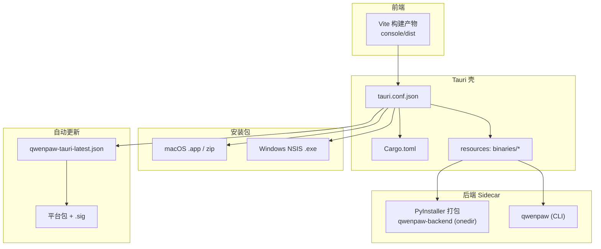
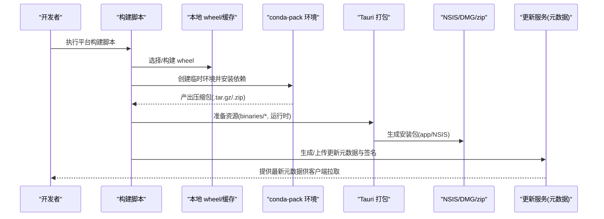
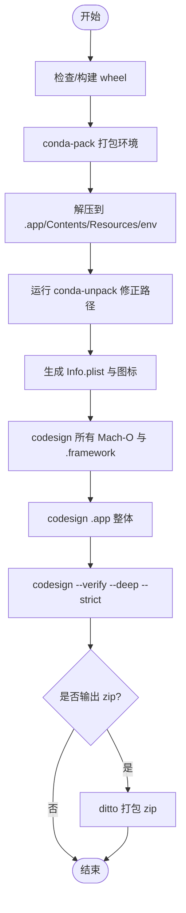
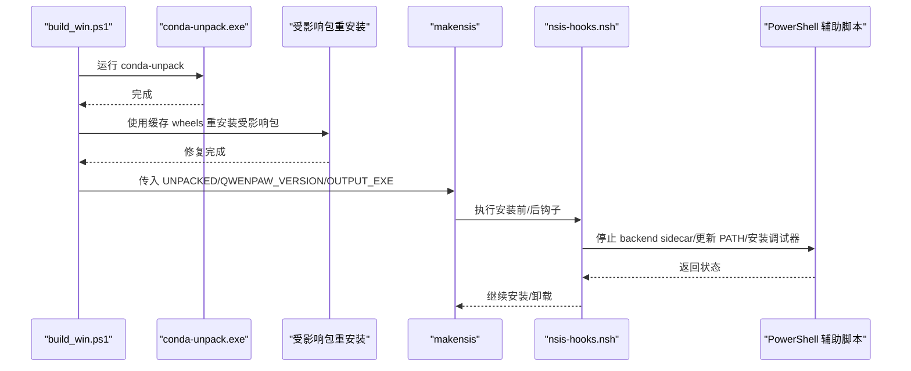
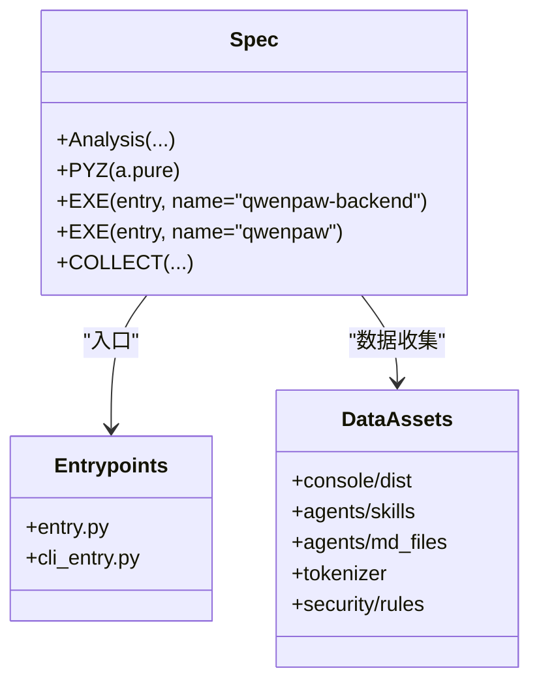
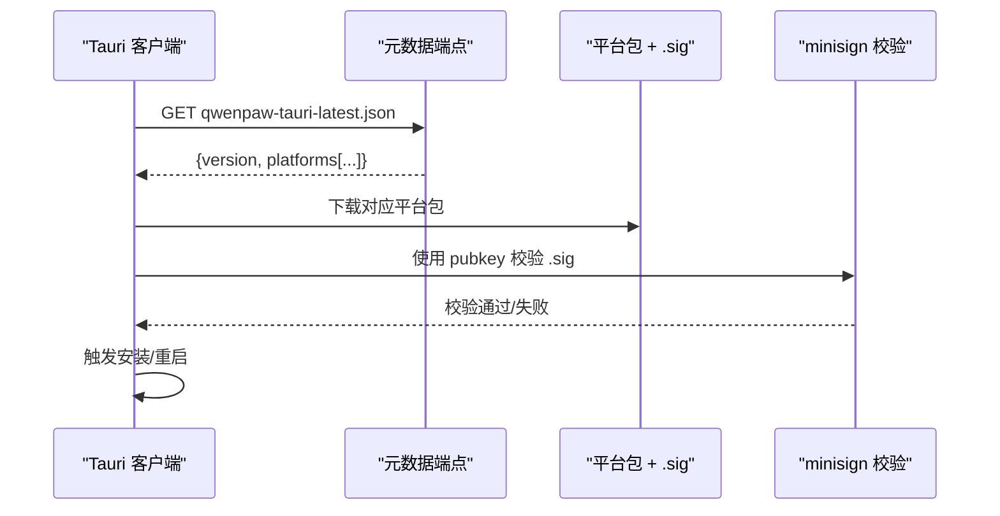
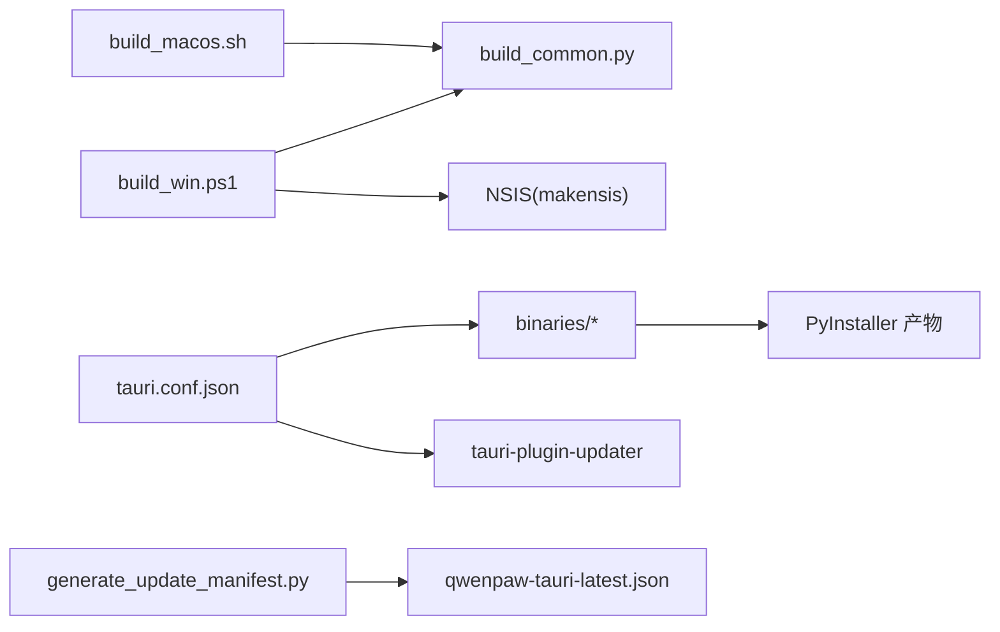

# 打包和分发

<cite>
**本文引用的文件**   
- [tauri.conf.json](file://console/src-tauri/tauri.conf.json)
- [Cargo.toml](file://console/src-tauri/Cargo.toml)
- [build_macos.sh](file://scripts/pack/build_macos.sh)
- [build_win.ps1](file://scripts/pack/build_win.ps1)
- [desktop.nsi](file://scripts/pack/desktop.nsi)
- [nsis-hooks.nsh](file://console/src-tauri/nsis-hooks.nsh)
- [sign_macos_bundle.sh](file://scripts/pack-tauri/sign_macos_bundle.sh)
- [generate_update_manifest.py](file://scripts/pack-tauri/generate_update_manifest.py)
- [qwenpaw.spec](file://scripts/pack-tauri/qwenpaw.spec)
- [build_common.py](file://scripts/pack/build_common.py)
</cite>

## 目录
1. [简介](#简介)
2. [项目结构](#项目结构)
3. [核心组件](#核心组件)
4. [架构总览](#架构总览)
5. [详细组件分析](#详细组件分析)
6. [依赖关系分析](#依赖关系分析)
7. [性能与体积优化](#性能与体积优化)
8. [故障排查指南](#故障排查指南)
9. [结论](#结论)
10. [附录：配置项与参数](#附录：配置项与参数)

## 简介
本文件面向 QwenPaw 桌面端的打包与分发流程，覆盖以下关键主题：
- macOS 应用构建、签名与发布
- Windows NSIS 安装器构建、路径注入与调试启动器
- Tauri 侧的自动更新机制（minisign 校验、多端点元数据）
- PyInstaller 打包后端 sidecar 并嵌入到 Tauri 资源中
- 构建脚本调用关系、接口约定、领域模型与使用模式
- 常见问题与解决方案

## 项目结构
QwenPaw 桌面端采用“Tauri + Python FastAPI sidecar”的架构。前端由 Vite 构建，后端通过 PyInstaller 打包为 onedir 产物，作为 sidecar 随安装包分发。Tauri 负责窗口、托盘、权限与自动更新插件。

图表来源
- [tauri.conf.json:1-91](file://console/src-tauri/tauri.conf.json#L1-L91)
- [Cargo.toml:1-38](file://console/src-tauri/Cargo.toml#L1-L38)
- [qwenpaw.spec:1-223](file://scripts/pack-tauri/qwenpaw.spec#L1-L223)
- [generate_update_manifest.py:1-300](file://scripts/pack-tauri/generate_update_manifest.py#L1-L300)

章节来源
- [tauri.conf.json:1-91](file://console/src-tauri/tauri.conf.json#L1-L91)
- [Cargo.toml:1-38](file://console/src-tauri/Cargo.toml#L1-L38)

## 核心组件
- Tauri 配置与插件
  - 产品名、标识符、窗口与安全策略
  - bundle 目标包含 app 与 nsis；资源包含后端二进制、Python 运行时、Node 运行时
  - NSIS 语言与压缩选项
  - updater 插件公钥与多端点元数据地址
- PyInstaller 打包 spec
  - 将 qwenpaw 后端入口与 CLI 打包为 onedir，收集必要数据与元信息
  - 支持在 macOS 上通过环境变量传入代码签名身份
- 构建脚本
  - macOS：wheel -> conda-pack -> .app -> 可选 zip
  - Windows：wheel -> conda-pack -> 修复 conda-unpack 问题 -> 预编译字节码 -> NSIS 安装器
- 自动更新
  - generate_update_manifest.py 聚合各平台产物与签名，生成 tauri-plugin-updater 所需的 manifest
  - tauri.conf.json 中的 pubkey 与 endpoints 用于客户端校验与拉取

章节来源
- [tauri.conf.json:1-91](file://console/src-tauri/tauri.conf.json#L1-L91)
- [qwenpaw.spec:1-223](file://scripts/pack-tauri/qwenpaw.spec#L1-L223)
- [build_macos.sh:1-185](file://scripts/pack/build_macos.sh#L1-L185)
- [build_win.ps1:1-395](file://scripts/pack/build_win.ps1#L1-L395)
- [generate_update_manifest.py:1-300](file://scripts/pack-tauri/generate_update_manifest.py#L1-L300)

## 架构总览
下图展示从源码到可分发包与自动更新的端到端流程。

图表来源
- [build_macos.sh:1-185](file://scripts/pack/build_macos.sh#L1-L185)
- [build_win.ps1:1-395](file://scripts/pack/build_win.ps1#L1-L395)
- [tauri.conf.json:1-91](file://console/src-tauri/tauri.conf.json#L1-L91)
- [generate_update_manifest.py:1-300](file://scripts/pack-tauri/generate_update_manifest.py#L1-L300)

## 详细组件分析

### macOS 构建与签名
- 构建步骤
  - 检测或构建 wheel，避免重复构建
  - 使用 build_common.py 基于 conda 临时环境打包依赖
  - 解压到 .app/Contents/Resources/env，运行 conda-unpack 修正路径
  - 生成 Info.plist，设置版本、图标与最低系统版本
  - 可选输出 zip 归档
- 签名流程
  - sign_macos_bundle.sh 递归对 Mach-O 文件与 .framework 进行 codesign
  - 支持传入 Apple 签名身份，或跳过时间戳用于本地验证
  - 最后对 .app 整体签名并做严格校验

图表来源
- [build_macos.sh:1-185](file://scripts/pack/build_macos.sh#L1-L185)
- [sign_macos_bundle.sh:1-120](file://scripts/pack-tauri/sign_macos_bundle.sh#L1-L120)

章节来源
- [build_macos.sh:1-185](file://scripts/pack/build_macos.sh#L1-L185)
- [sign_macos_bundle.sh:1-120](file://scripts/pack-tauri/sign_macos_bundle.sh#L1-L120)

### Windows NSIS 安装器
- 构建步骤
  - 构建 wheel，使用 build_common.py 打包环境
  - 解压后定位 env root，运行 conda-unpack
  - 针对 Windows 下 conda-unpack 的已知问题，重新安装受影响包以修复字符串转义损坏
  - 预编译 Python 字节码提升启动速度
  - 生成主启动器、调试启动器与隐藏控制台 vbs 包装
  - 调用 makensis 生成 NSIS 安装器
- NSIS 钩子
  - 安装前尝试停止残留的 backend sidecar，避免文件被占用导致写入失败
  - 可选将 qwenpaw 命令加入 PATH
  - 安装/卸载时管理调试启动器快捷方式

图表来源
- [build_win.ps1:1-395](file://scripts/pack/build_win.ps1#L1-L395)
- [desktop.nsi:1-57](file://scripts/pack/desktop.nsi#L1-L57)
- [nsis-hooks.nsh:1-144](file://console/src-tauri/nsis-hooks.nsh#L1-L144)

章节来源
- [build_win.ps1:1-395](file://scripts/pack/build_win.ps1#L1-L395)
- [desktop.nsi:1-57](file://scripts/pack/desktop.nsi#L1-L57)
- [nsis-hooks.nsh:1-144](file://console/src-tauri/nsis-hooks.nsh#L1-L144)

### PyInstaller 后端打包（Tauri sidecar）
- 打包目标
  - 生成 qwenpaw-backend（无控制台）与 qwenpaw（CLI，带控制台）
  - 收集 console/dist、agents/skills、md_files、tokenizer、安全规则等数据
  - 拷贝多个包的元数据，确保 importlib.metadata 可用
  - 指定 hiddenimports 以覆盖动态导入场景
- 签名集成
  - macOS 可通过环境变量传入 codesign identity，使 EXE 条目参与签名

图表来源
- [qwenpaw.spec:1-223](file://scripts/pack-tauri/qwenpaw.spec#L1-L223)

章节来源
- [qwenpaw.spec:1-223](file://scripts/pack-tauri/qwenpaw.spec#L1-L223)

### 自动更新机制（Tauri updater）
- 客户端配置
  - tauri.conf.json 中定义 updater.pubkey（minisign 公钥）与 endpoints（多端点回退）
  - Windows 安装模式 passive，静默体验更佳
- 服务端产物
  - 每平台产物附带 .sig 签名文件
  - generate_update_manifest.py 将各平台 sidecar JSON 合并为统一 qwenpaw-tauri-latest.json
  - 支持 per-target URL 覆盖，适配不同存储路径
- 校验流程
  - 脚本解析 minisign 文本块，提取 key id，与配置的 pubkey 比对，确保一致性

图表来源
- [tauri.conf.json:78-90](file://console/src-tauri/tauri.conf.json#L78-L90)
- [generate_update_manifest.py:1-300](file://scripts/pack-tauri/generate_update_manifest.py#L1-L300)

章节来源
- [tauri.conf.json:78-90](file://console/src-tauri/tauri.conf.json#L78-L90)
- [generate_update_manifest.py:1-300](file://scripts/pack-tauri/generate_update_manifest.py#L1-L300)

### 通用打包工具 build_common.py
- 功能
  - 创建临时 conda 环境，安装 qwenpaw[full] 与必要依赖
  - 支持缓存受影响包的 wheels，便于后续修复 conda-unpack 问题
  - 强制恢复 pip/setuptools/wheel，保证 conda-pack 正常
  - 输出 tar.gz/zip 格式压缩包
- 关键参数
  - --output/-o：输出路径
  - --format/-f：infer/zip/tar.gz/tgz
  - --python：Python 版本
  - --wheel：指定 wheel 路径
  - --cache-wheels：缓存受影响包 wheels

章节来源
- [build_common.py:1-252](file://scripts/pack/build_common.py#L1-L252)

## 依赖关系分析
- 构建脚本耦合
  - build_macos.sh 与 build_win.ps1 均依赖 build_common.py 与环境变量 DIST
  - Windows 构建额外依赖 NSIS（makensis）与 PowerShell 辅助脚本
- Tauri 与后端
  - tauri.conf.json 的 resources 指向 binaries/*，要求 PyInstaller 产物存在
  - Cargo.toml 引入 tauri-plugin-updater，启用自动更新能力
- 更新流水线
  - generate_update_manifest.py 依赖 packaging.version 与 base64/minisign 文本解析逻辑

图表来源
- [build_macos.sh:1-185](file://scripts/pack/build_macos.sh#L1-L185)
- [build_win.ps1:1-395](file://scripts/pack/build_win.ps1#L1-L395)
- [tauri.conf.json:1-91](file://console/src-tauri/tauri.conf.json#L1-L91)
- [Cargo.toml:1-38](file://console/src-tauri/Cargo.toml#L1-L38)
- [generate_update_manifest.py:1-300](file://scripts/pack-tauri/generate_update_manifest.py#L1-L300)

章节来源
- [build_macos.sh:1-185](file://scripts/pack/build_macos.sh#L1-L185)
- [build_win.ps1:1-395](file://scripts/pack/build_win.ps1#L1-L395)
- [tauri.conf.json:1-91](file://console/src-tauri/tauri.conf.json#L1-L91)
- [Cargo.toml:1-38](file://console/src-tauri/Cargo.toml#L1-L38)
- [generate_update_manifest.py:1-300](file://scripts/pack-tauri/generate_update_manifest.py#L1-L300)

## 性能与体积优化
- 预编译字节码（Windows）
  - 构建阶段对 .py 进行 compileall，减少首次启动开销
- 压缩与资源裁剪
  - NSIS 使用 zlib 压缩；按需收集 PyInstaller datas，避免冗余
- 网络与证书
  - 构建脚本自动探测 certifi CA 路径并设置 SSL 相关环境变量，降低跨平台证书问题

章节来源
- [build_win.ps1:191-216](file://scripts/pack/build_win.ps1#L191-L216)
- [tauri.conf.json:52-76](file://console/src-tauri/tauri.conf.json#L52-L76)
- [qwenpaw.spec:51-108](file://scripts/pack-tauri/qwenpaw.spec#L51-L108)

## 故障排查指南
- Windows 安装时报“无法写入文件”
  - 原因：残留 backend sidecar 进程锁定了 .pyd 模块
  - 解决：安装器已内置停止逻辑；若仍失败，手动关闭相关进程后重试
- Windows 启动报错 SyntaxError 或 huggingface_hub/discord.py 导入失败
  - 原因：conda-unpack 在 Windows 下破坏含反斜杠转义的字符串
  - 解决：构建脚本已自动重安装受影响包；如自行处理，请参照受影响包列表并重新安装
- macOS 签名失败或运行时报“未签名”
  - 原因：未正确传递 APPLE_SIGNING_IDENTITY 或未对框架与 .app 整体签名
  - 解决：使用 sign_macos_bundle.sh 传入身份，并确保对 .framework 与 .app 分别签名与验证
- 自动更新失败或提示签名不匹配
  - 原因：客户端 pubkey 与服务端签名 key id 不一致
  - 解决：使用 generate_update_manifest.py 的 pubkey-config 校验，确保一致后再发布

章节来源
- [nsis-hooks.nsh:100-144](file://console/src-tauri/nsis-hooks.nsh#L100-L144)
- [build_win.ps1:97-186](file://scripts/pack/build_win.ps1#L97-L186)
- [sign_macos_bundle.sh:1-120](file://scripts/pack-tauri/sign_macos_bundle.sh#L1-L120)
- [generate_update_manifest.py:157-174](file://scripts/pack-tauri/generate_update_manifest.py#L157-L174)

## 结论
QwenPaw 桌面端通过 Tauri 统一管理前端与后端 sidecar，结合 PyInstaller 与 NSIS/macOS 原生打包方案，形成跨平台一致的构建与分发体验。自动更新基于 minisign 与多端点元数据，兼顾安全性与可用性。构建脚本覆盖了常见平台差异与已知缺陷修复，适合持续集成与自动化发布。

## 附录：配置项与参数
- Tauri 配置（tauri.conf.json）
  - productName/identifier：产品名称与应用标识
  - build.frontendDist/devUrl/beforeBuildCommand：前端构建与开发入口
  - bundle.targets：打包目标（app、nsis）
  - bundle.resources：嵌入的二进制与运行时
  - bundle.windows.nsis.*：NSIS 语言、图标、压缩、自定义语言文件
  - plugins.updater.pubkey/endpoints/windows.installMode：更新公钥、端点与安装模式
- PyInstaller 打包（qwenpaw.spec）
  - Analysis.datas/binaries/hiddenimports：数据与动态导入集合
  - EXE.name/console/codesign_identity：产物名称、控制台与签名身份
  - COLLECT.name：最终 onedir 目录名
- 构建脚本参数
  - build_common.py：--output/--format/--python/--wheel/--cache-wheels
  - build_macos.sh：DIST、CREATE_ZIP、QWENPAW_LOG_LEVEL
  - build_win.ps1：DIST、QWENPAW_LOG_LEVEL、UNPACKED、OUTPUT_EXE、QWENPAW_VERSION

章节来源
- [tauri.conf.json:1-91](file://console/src-tauri/tauri.conf.json#L1-L91)
- [qwenpaw.spec:1-223](file://scripts/pack-tauri/qwenpaw.spec#L1-L223)
- [build_common.py:75-113](file://scripts/pack/build_common.py#L75-L113)
- [build_macos.sh:1-185](file://scripts/pack/build_macos.sh#L1-L185)
- [build_win.ps1:1-395](file://scripts/pack/build_win.ps1#L1-L395)