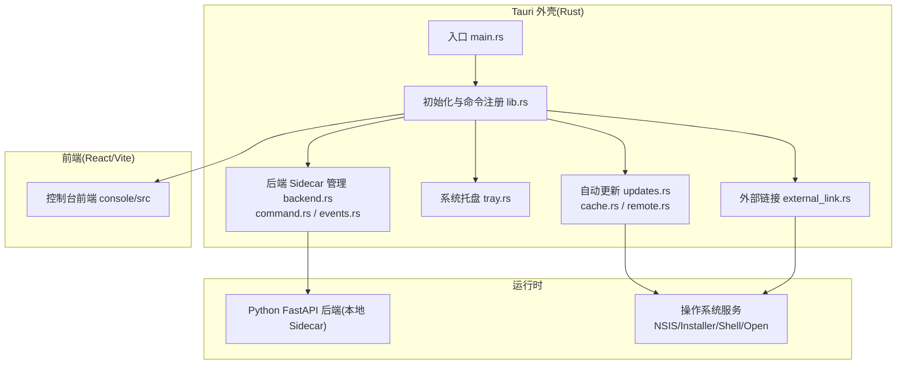
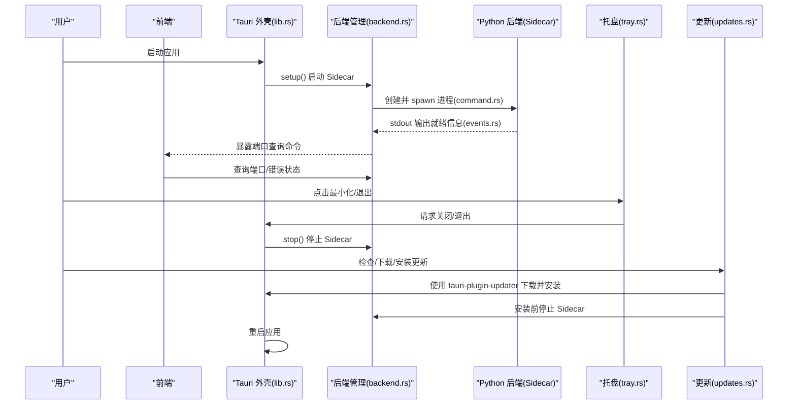
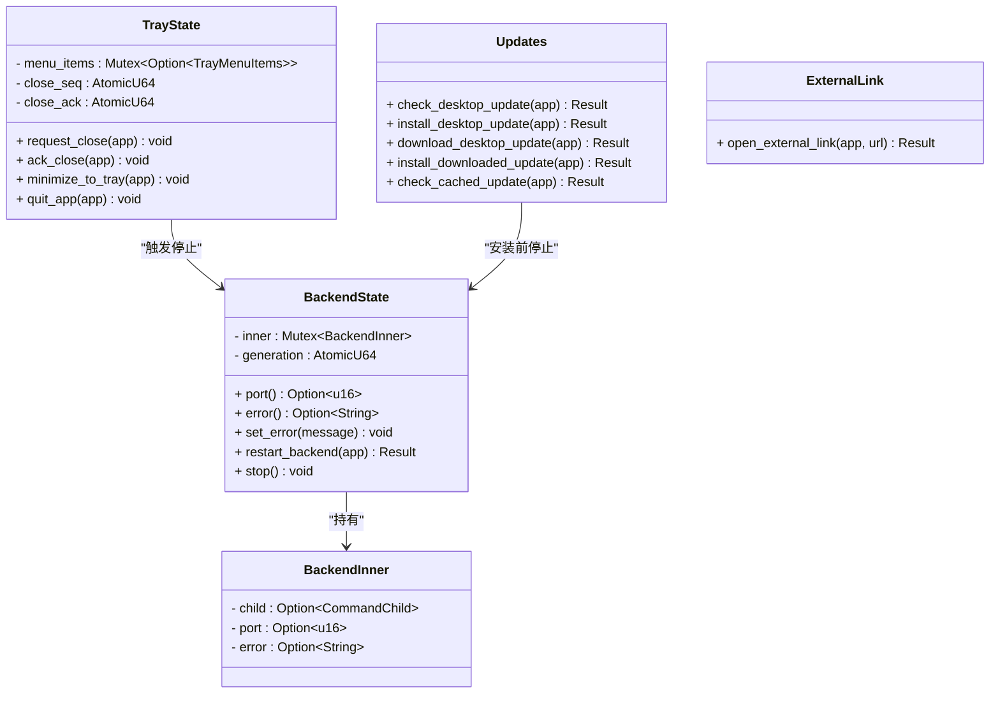
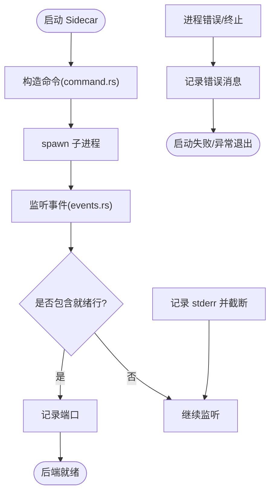
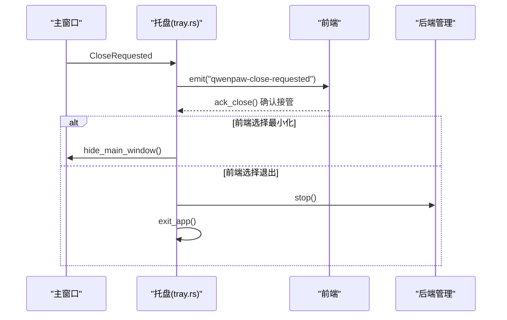
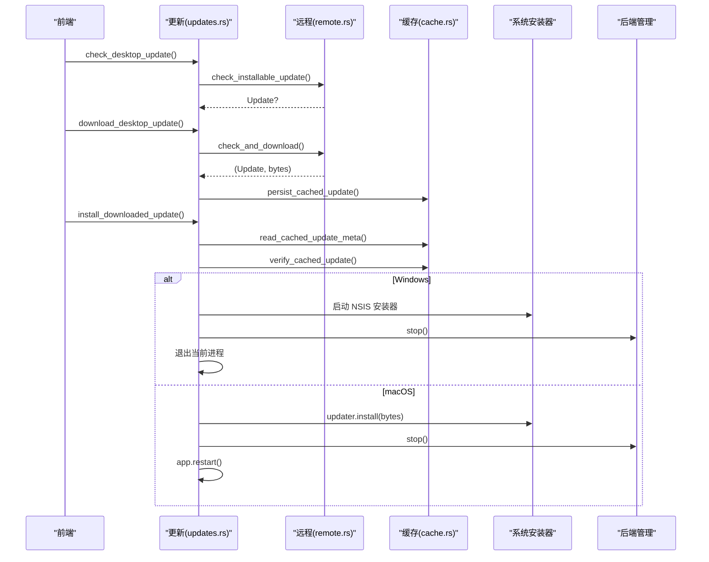
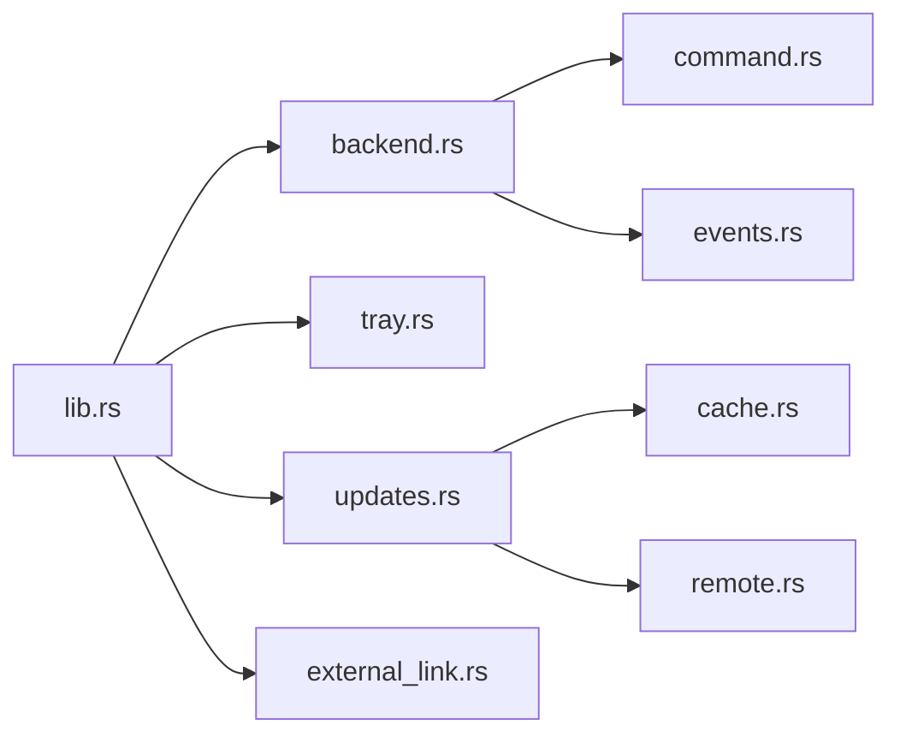

# 桌面应用

<cite>
**本文引用的文件**   
- [tauri.conf.json](file://console/src-tauri/tauri.conf.json)
- [Cargo.toml](file://console/src-tauri/Cargo.toml)
- [main.rs](file://console/src-tauri/src/main.rs)
- [lib.rs](file://console/src-tauri/src/lib.rs)
- [backend.rs](file://console/src-tauri/src/backend.rs)
- [command.rs](file://console/src-tauri/src/backend/command.rs)
- [events.rs](file://console/src-tauri/src/backend/events.rs)
- [updates.rs](file://console/src-tauri/src/updates.rs)
- [cache.rs](file://console/src-tauri/src/updates/cache.rs)
- [remote.rs](file://console/src-tauri/src/updates/remote.rs)
- [tray.rs](file://console/src-tauri/src/tray.rs)
- [external_link.rs](file://console/src-tauri/src/external_link.rs)
</cite>

## 目录
1. [简介](#简介)
2. [项目结构](#项目结构)
3. [核心组件](#核心组件)
4. [架构总览](#架构总览)
5. [详细组件分析](#详细组件分析)
6. [依赖关系分析](#依赖关系分析)
7. [性能与资源特性](#性能与资源特性)
8. [故障排查指南](#故障排查指南)
9. [结论](#结论)
10. [附录：配置项与接口清单](#附录：配置项与接口清单)

## 简介
本章节面向 QwenPaw 的 Tauri 桌面应用，聚焦以下目标：
- 解释 Tauri 应用架构、跨平台适配策略与系统集成能力（托盘、外部链接、更新机制等）
- 记录后端 Sidecar 生命周期管理、事件监听与错误上报
- 梳理打包与分发流程（Windows NSIS、macOS App 归档），以及后台下载与缓存安装
- 提供具体实现细节、调用关系、接口定义、领域模型和使用模式
- 给出常见问题与解决方案，兼顾初学者与资深开发者

## 项目结构
QwenPaw 桌面端采用“前端 + Rust Shell”的 Tauri 架构。Rust 侧负责系统级能力（进程管理、托盘、更新、安全校验等），并通过 IPC 暴露命令给前端；Python FastAPI 后端作为本地 Sidecar 进程运行，由 Rust 启动、监控与终止。

图表来源
- [main.rs:1-7](file://console/src-tauri/src/main.rs#L1-L7)
- [lib.rs:1-98](file://console/src-tauri/src/lib.rs#L1-L98)
- [backend.rs:1-200](file://console/src-tauri/src/backend.rs#L1-L200)
- [command.rs:1-217](file://console/src-tauri/src/backend/command.rs#L1-L217)
- [events.rs:1-151](file://console/src-tauri/src/backend/events.rs#L1-L151)
- [tray.rs:1-197](file://console/src-tauri/src/tray.rs#L1-L197)
- [updates.rs:1-288](file://console/src-tauri/src/updates.rs#L1-L288)
- [cache.rs:1-161](file://console/src-tauri/src/updates/cache.rs#L1-L161)
- [remote.rs:1-104](file://console/src-tauri/src/updates/remote.rs#L1-L104)
- [external_link.rs:1-51](file://console/src-tauri/src/external_link.rs#L1-L51)

章节来源
- [tauri.conf.json:1-91](file://console/src-tauri/tauri.conf.json#L1-L91)
- [Cargo.toml:1-38](file://console/src-tauri/Cargo.toml#L1-L38)

## 核心组件
- 应用入口与插件注册：负责构建 Tauri 应用、注册命令、管理状态、窗口关闭与退出处理
- 后端 Sidecar 管理：构造并启动 Python 后端，捕获 stdout/stderr，解析就绪端口，维护进程生命周期
- 系统托盘：最小化到托盘、显示/隐藏主窗口、退出应用、国际化菜单文本
- 自动更新：检查/下载/安装更新，支持后台下载与缓存安装，含签名校验与平台差异处理
- 外部链接打开：白名单协议校验后通过系统 Shell 打开

章节来源
- [lib.rs:1-98](file://console/src-tauri/src/lib.rs#L1-L98)
- [backend.rs:1-200](file://console/src-tauri/src/backend.rs#L1-L200)
- [tray.rs:1-197](file://console/src-tauri/src/tray.rs#L1-L197)
- [updates.rs:1-288](file://console/src-tauri/src/updates.rs#L1-L288)
- [external_link.rs:1-51](file://console/src-tauri/src/external_link.rs#L1-L51)

## 架构总览
下图展示了从应用启动到后端就绪、用户交互与更新的完整链路。

图表来源
- [lib.rs:21-98](file://console/src-tauri/src/lib.rs#L21-L98)
- [backend.rs:128-200](file://console/src-tauri/src/backend.rs#L128-L200)
- [command.rs:47-87](file://console/src-tauri/src/backend/command.rs#L47-L87)
- [events.rs:19-62](file://console/src-tauri/src/backend/events.rs#L19-L62)
- [tray.rs:106-197](file://console/src-tauri/src/tray.rs#L106-L197)
- [updates.rs:34-73](file://console/src-tauri/src/updates.rs#L34-L73)
- [remote.rs:13-41](file://console/src-tauri/src/updates/remote.rs#L13-L41)

## 详细组件分析

### 应用入口与命令注册
- 入口函数仅调用库层 run()，避免在 Windows 发布版产生额外控制台窗口
- 注册 Shell、Dialog、Updater 插件，集中注册所有 IPC 命令
- 管理 BackendState 与 TrayState 全局状态
- 设置窗口关闭事件：阻止默认关闭，交由托盘逻辑决定最小化或退出
- macOS 特殊处理：Dock 图标重入时恢复主窗口；系统级退出请求统一走关闭提示流程

章节来源
- [main.rs:1-7](file://console/src-tauri/src/main.rs#L1-L7)
- [lib.rs:1-98](file://console/src-tauri/src/lib.rs#L1-L98)

#### 类图（关键状态与模块）

图表来源
- [backend.rs:15-98](file://console/src-tauri/src/backend.rs#L15-L98)
- [tray.rs:28-42](file://console/src-tauri/src/tray.rs#L28-L42)
- [updates.rs:25-44](file://console/src-tauri/src/updates.rs#L25-L44)
- [external_link.rs:9-26](file://console/src-tauri/src/external_link.rs#L9-L26)

### 后端 Sidecar 管理
- 开发模式：优先使用 uv 或直接定位本地 venv/python3/python，设置 PYTHONPATH 指向源码目录
- 打包模式：从资源目录定位 qwenpaw-backend 可执行，注入 PATH 环境变量，并可选注入内置 Python/Node 运行时路径
- 事件监听：捕获 stdout/stderr，解析特定协议行获取后端端口；异常或退出时记录最后 stderr 片段并上报错误
- 生命周期：restart_backend 会先停止当前进程再启动新进程；stop 在应用退出时调用

图表来源
- [command.rs:47-87](file://console/src-tauri/src/backend/command.rs#L47-L87)
- [events.rs:19-62](file://console/src-tauri/src/backend/events.rs#L19-L62)
- [backend.rs:165-200](file://console/src-tauri/src/backend.rs#L165-L200)

章节来源
- [backend.rs:1-200](file://console/src-tauri/src/backend.rs#L1-L200)
- [command.rs:1-217](file://console/src-tauri/src/backend/command.rs#L1-L217)
- [events.rs:1-151](file://console/src-tauri/src/backend/events.rs#L1-L151)

### 系统托盘集成
- 托盘菜单：显示主窗口、退出应用；支持前端传入的国际化文案
- 关闭流程：窗口关闭时发出 CLOSE_REQUESTED_EVENT，前端可选择最小化或退出；若超时未响应则回退为最小化到托盘
- macOS Dock 行为：Reopen 事件用于恢复主窗口，保证 Dock 图标可用

图表来源
- [tray.rs:106-197](file://console/src-tauri/src/tray.rs#L106-L197)
- [lib.rs:51-56](file://console/src-tauri/src/lib.rs#L51-L56)

章节来源
- [tray.rs:1-197](file://console/src-tauri/src/tray.rs#L1-L197)

### 自动更新（后台下载与缓存安装）
- 检查更新：基于 tauri-plugin-updater，返回最新版本信息与是否支持后续安装
- 立即安装：下载并安装，安装前停止后端并重启应用
- 后台下载：将更新包与元数据持久化到本地缓存目录，供稍后安装
- 缓存安装：读取元数据，校验平台匹配与签名，再执行安装
- 平台差异：
  - Windows：直接拉起 NSIS 安装包，随后退出当前进程以释放被占用文件
  - macOS：使用 updater.install(bytes) 完成安装，然后停止后端并重启

图表来源
- [updates.rs:34-288](file://console/src-tauri/src/updates.rs#L34-L288)
- [remote.rs:13-41](file://console/src-tauri/src/updates/remote.rs#L13-L41)
- [cache.rs:71-103](file://console/src-tauri/src/updates/cache.rs#L71-L103)

章节来源
- [updates.rs:1-288](file://console/src-tauri/src/updates.rs#L1-L288)
- [remote.rs:1-104](file://console/src-tauri/src/updates/remote.rs#L1-L104)
- [cache.rs:1-161](file://console/src-tauri/src/updates/cache.rs#L1-L161)

### 外部链接打开
- 白名单协议：http、https、mailto、tel
- 输入校验：拒绝空串、前后空白、控制字符、非白名单协议
- 通过系统 Shell 打开链接，失败时记录警告并返回错误

章节来源
- [external_link.rs:1-51](file://console/src-tauri/src/external_link.rs#L1-L51)

## 依赖关系分析
- 顶层依赖：tauri、tauri-plugin-shell、tauri-plugin-dialog、tauri-plugin-updater、tokio、dirs、minisign-verify 等
- 模块耦合：
  - lib.rs 聚合各模块命令与状态
  - backend.rs 依赖 command.rs 与 events.rs
  - updates.rs 依赖 cache.rs、remote.rs、signature.rs、version.rs 等
  - tray.rs 与 backend.rs 协作进行进程生命周期管理
  - external_link.rs 独立，仅依赖 shell 扩展

图表来源
- [lib.rs:1-98](file://console/src-tauri/src/lib.rs#L1-L98)
- [backend.rs:1-200](file://console/src-tauri/src/backend.rs#L1-L200)
- [updates.rs:1-288](file://console/src-tauri/src/updates.rs#L1-L288)

章节来源
- [Cargo.toml:1-38](file://console/src-tauri/Cargo.toml#L1-L38)

## 性能与资源特性
- 日志级别：可通过环境变量开启调试日志，便于问题定位
- 后端输出：stderr 捕获有上限，避免内存膨胀；stdout 中解析特定协议行以快速发现后端就绪
- 更新下载：分块回调节流上报进度，减少 UI 刷新开销
- 资源目录：打包模式下将后端与运行时资源放入 binaries 目录，按需注入 PATH 与运行时环境变量

章节来源
- [backend.rs:151-162](file://console/src-tauri/src/backend.rs#L151-L162)
- [events.rs:9-11](file://console/src-tauri/src/backend/events.rs#L9-L11)
- [remote.rs:64-103](file://console/src-tauri/src/updates/remote.rs#L64-L103)
- [command.rs:122-168](file://console/src-tauri/src/backend/command.rs#L122-L168)

## 故障排查指南
- 后端无法启动
  - 检查开发环境是否存在 uv 或 python3/python，或打包后 binaries/qwenpaw-backend 是否存在
  - 查看 stderr 最后片段与错误消息，定位环境问题或端口冲突
- 后端启动后无端口
  - 确认后端是否按协议输出就绪信息；观察 events.rs 解析逻辑
- 更新失败
  - 检查网络与签名校验；确认缓存目录权限与平台匹配
  - Windows 安装器需释放被占用文件，确保当前进程已退出
- 托盘无法最小化/退出
  - 确认前端是否正确 ack_close；检查 CLOSE_REQUESTED_EVENT 监听是否生效
- 外部链接打不开
  - 检查 URL 是否符合白名单协议且不含控制字符或多余空白

章节来源
- [events.rs:105-119](file://console/src-tauri/src/backend/events.rs#L105-L119)
- [updates.rs:187-203](file://console/src-tauri/src/updates.rs#L187-L203)
- [tray.rs:106-131](file://console/src-tauri/src/tray.rs#L106-L131)
- [external_link.rs:29-50](file://console/src-tauri/src/external_link.rs#L29-L50)

## 结论
QwenPaw 桌面应用通过 Tauri 将前端与系统能力解耦，Rust 侧专注于进程管理、托盘、更新与安全校验，Python 后端作为 Sidecar 提供业务 API。该设计在 Windows 与 macOS 上具备一致的体验与可靠的升级路径，同时提供了完善的错误诊断与用户体验保障。

## 附录：配置项与接口清单

### Tauri 配置要点（节选）
- 产品名称与标识符、窗口尺寸与最小尺寸、CSP 策略
- 打包目标：app、nsis；资源目录包含后端与运行时
- 更新器公钥与多端点；Windows 安装模式 passive

章节来源
- [tauri.conf.json:1-91](file://console/src-tauri/tauri.conf.json#L1-L91)

### Rust 依赖（节选）
- tauri、tauri-plugin-*、tokio、dirs、minisign-verify、semver、sha2 等

章节来源
- [Cargo.toml:1-38](file://console/src-tauri/Cargo.toml#L1-L38)

### IPC 命令清单（Rust -> 前端）
- 后端相关
  - backend_port(): 返回当前后端端口
  - backend_startup_error(): 返回启动期错误（供引导门控消费）
  - restart_backend(): 重启后端并返回错误（如有）
- 外部链接
  - open_external_link(url): 打开受支持的协议链接
- 更新相关
  - check_desktop_update(): 检查是否有可用更新
  - install_desktop_update(): 立即下载安装并重启
  - download_desktop_update(): 后台下载并缓存
  - install_downloaded_update(): 安装已缓存的更新
  - check_cached_update(): 检测是否存在可用的缓存更新
- 托盘相关
  - minimize_to_tray(): 最小化到托盘
  - quit_app(): 退出应用
  - set_tray_labels(show, quit): 设置托盘菜单文案
  - ack_close(): 确认关闭请求由前端接管

章节来源
- [lib.rs:26-43](file://console/src-tauri/src/lib.rs#L26-L43)
- [backend.rs:100-125](file://console/src-tauri/src/backend.rs#L100-L125)
- [external_link.rs:9-26](file://console/src-tauri/src/external_link.rs#L9-L26)
- [updates.rs:34-121](file://console/src-tauri/src/updates.rs#L34-L121)
- [tray.rs:135-177](file://console/src-tauri/src/tray.rs#L135-L177)

### 领域模型（更新缓存元数据）
- UpdateMeta
  - version: 版本号
  - artifact_file: 缓存文件名
  - platform/target: 平台与目标
  - signature: minisign 签名
  - sha256: 文件哈希

章节来源
- [cache.rs:11-29](file://console/src-tauri/src/updates/cache.rs#L11-L29)