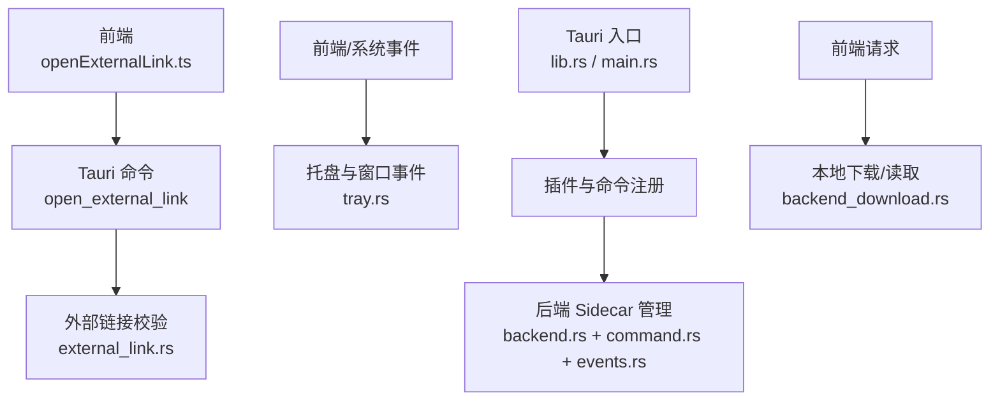
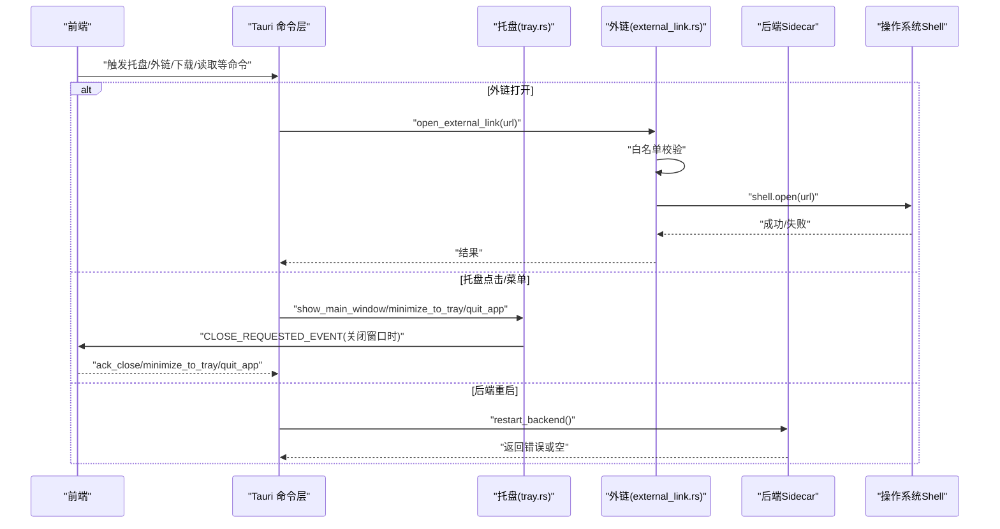
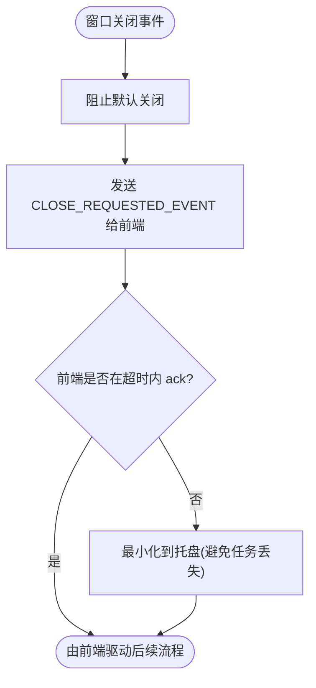
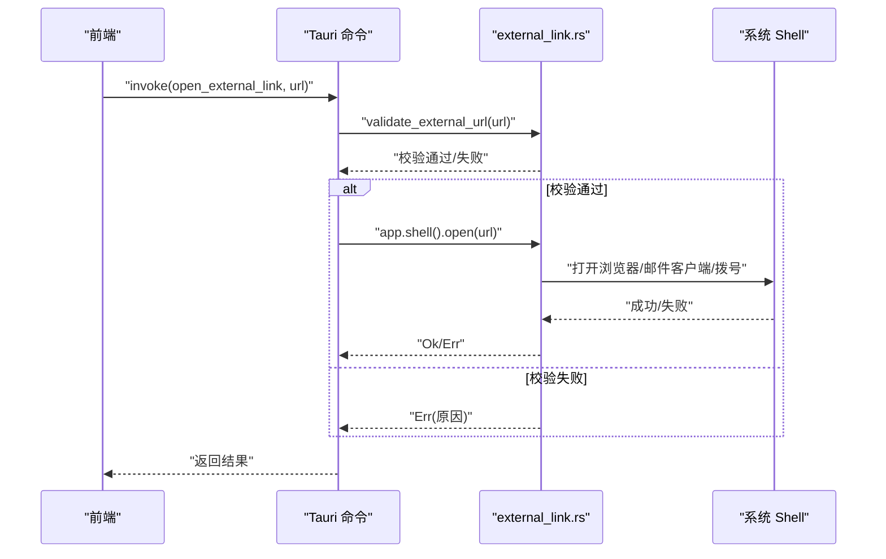
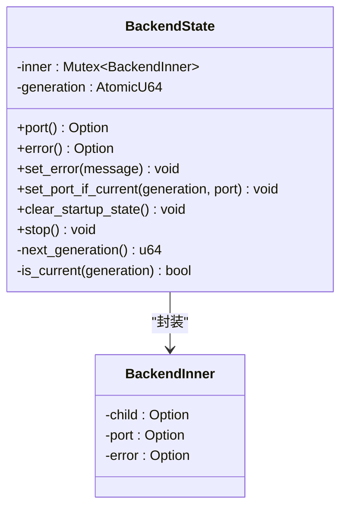
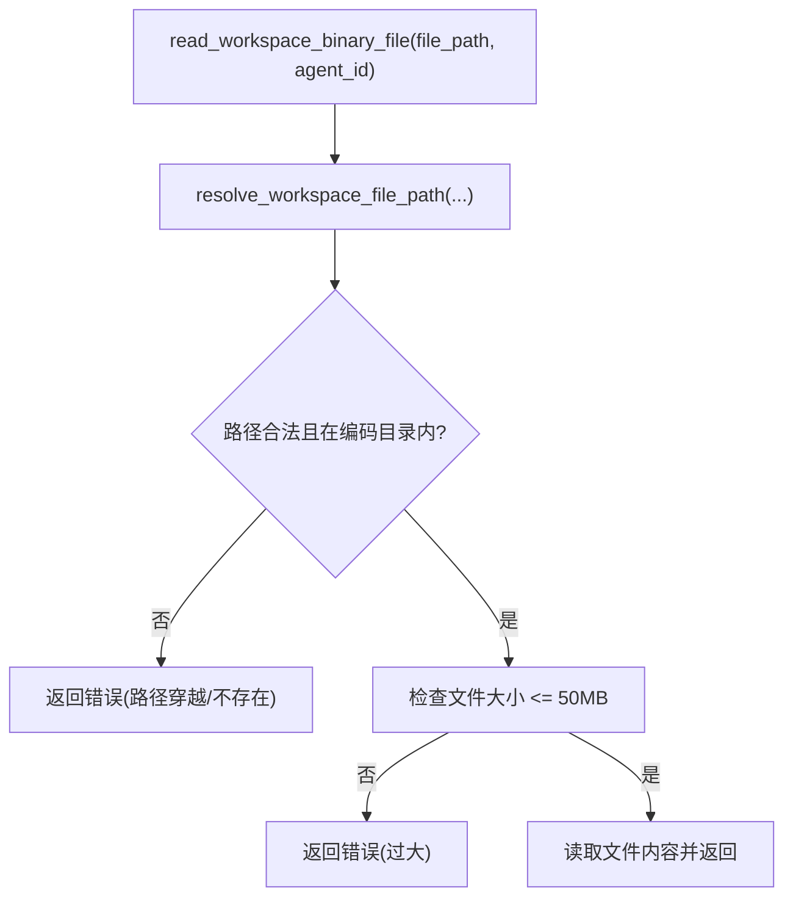
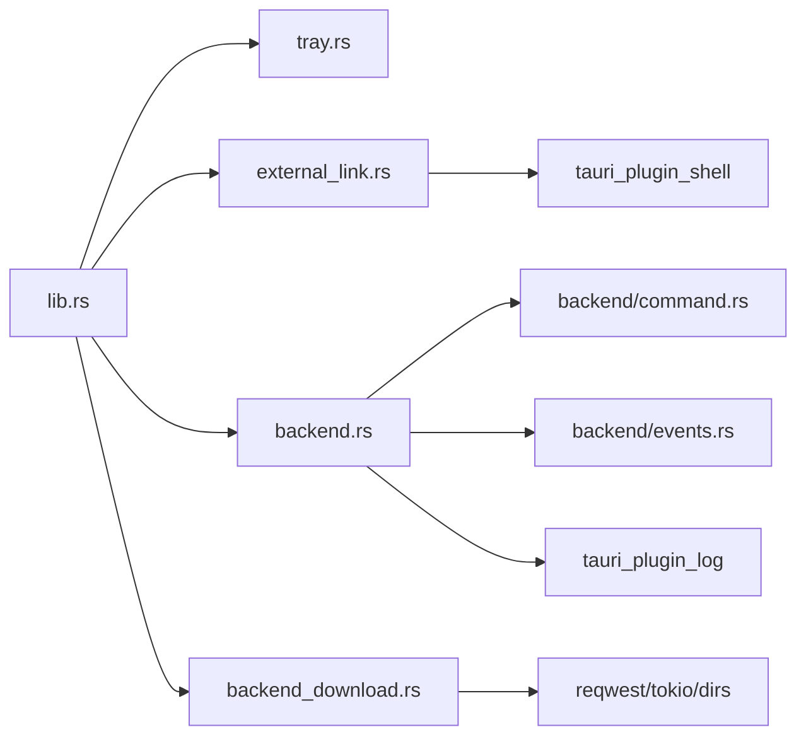

# 系统集成特性

<cite>
**本文引用的文件**
- [console/src-tauri/src/tray.rs](file://console/src-tauri/src/tray.rs)
- [console/src-tauri/src/external_link.rs](file://console/src-tauri/src/external_link.rs)
- [console/src-tauri/src/lib.rs](file://console/src-tauri/src/lib.rs)
- [console/src-tauri/src/main.rs](file://console/src-tauri/src/main.rs)
- [console/src-tauri/src/backend.rs](file://console/src-tauri/src/backend.rs)
- [console/src-tauri/src/backend/command.rs](file://console/src-tauri/src/backend/command.rs)
- [console/src-tauri/src/backend/events.rs](file://console/src-tauri/src/backend/events.rs)
- [console/src-tauri/src/backend_download.rs](file://console/src-tauri/src/backend_download.rs)
- [console/src/utils/openExternalLink.ts](file://console/src/utils/openExternalLink.ts)
</cite>

## 目录
1. [简介](#简介)
2. [项目结构](#项目结构)
3. [核心组件](#核心组件)
4. [架构总览](#架构总览)
5. [详细组件分析](#详细组件分析)
6. [依赖关系分析](#依赖关系分析)
7. [性能与资源管理](#性能与资源管理)
8. [故障排查指南](#故障排查指南)
9. [结论](#结论)
10. [附录：配置项与接口参考](#附录配置项与接口参考)

## 简介
本章节聚焦 QwenPaw 桌面端的系统集成能力，包括托盘菜单、外部链接处理、系统通知（窗口关闭交互）、文件关联（工作区二进制预览）以及进程管理（后端 Sidecar 生命周期）。文档从实现细节、调用关系、接口契约、领域模型到使用模式进行系统化说明，并给出安全机制与常见问题解决方案。面向初学者提供循序渐进的讲解，同时为有经验的开发者提供足够的技术深度。

## 项目结构
QwenPaw 桌面端基于 Tauri 构建，Rust 侧负责原生集成与命令注册，前端通过 Tauri invoke 调用原生能力。关键路径如下：
- Rust 入口与插件/命令注册：lib.rs、main.rs
- 托盘与窗口事件：tray.rs
- 外部链接打开：external_link.rs
- 后端 Sidecar 启动/停止/事件监听：backend.rs、backend/command.rs、backend/events.rs
- 本地下载与工作区二进制读取：backend_download.rs
- 前端跨运行时外链处理：openExternalLink.ts

图表来源
- [console/src-tauri/src/lib.rs:21-56](file://console/src-tauri/src/lib.rs#L21-L56)
- [console/src-tauri/src/tray.rs:45-98](file://console/src-tauri/src/tray.rs#L45-L98)
- [console/src-tauri/src/external_link.rs:9-26](file://console/src-tauri/src/external_link.rs#L9-L26)
- [console/src-tauri/src/backend.rs:128-144](file://console/src-tauri/src/backend.rs#L128-L144)
- [console/src-tauri/src/backend/command.rs:12-43](file://console/src-tauri/src/backend/command.rs#L12-L43)
- [console/src-tauri/src/backend/events.rs:19-62](file://console/src-tauri/src/backend/events.rs#L19-L62)
- [console/src-tauri/src/backend_download.rs:29-75](file://console/src-tauri/src/backend_download.rs#L29-L75)
- [console/src/utils/openExternalLink.ts:1-85](file://console/src/utils/openExternalLink.ts#L1-L85)

章节来源
- [console/src-tauri/src/lib.rs:21-56](file://console/src-tauri/src/lib.rs#L21-L56)
- [console/src-tauri/src/main.rs:4-6](file://console/src-tauri/src/main.rs#L4-L6)

## 核心组件
- 托盘与窗口交互：提供最小化到托盘、退出应用、显示主窗口、关闭确认流程等能力，并通过事件与前端协作完成“记住选择”或弹出提示。
- 外部链接处理：对 URL 进行严格白名单校验后，交由系统 Shell 打开，防止协议滥用。
- 后端 Sidecar 进程管理：在开发/打包两种模式下构造启动命令，监控 stdout/stderr，解析就绪端口，记录错误信息，支持重启与优雅退出。
- 本地下载与工作区二进制读取：限制仅允许访问本地回环地址的后端资源；读取工作区二进制文件用于离线预览，包含大小限制与路径穿越防护。

章节来源
- [console/src-tauri/src/tray.rs:45-98](file://console/src-tauri/src/tray.rs#L45-L98)
- [console/src-tauri/src/external_link.rs:9-26](file://console/src-tauri/src/external_link.rs#L9-L26)
- [console/src-tauri/src/backend.rs:128-144](file://console/src-tauri/src/backend.rs#L128-L144)
- [console/src-tauri/src/backend/command.rs:47-87](file://console/src-tauri/src/backend/command.rs#L47-L87)
- [console/src-tauri/src/backend/events.rs:19-62](file://console/src-tauri/src/backend/events.rs#L19-L62)
- [console/src-tauri/src/backend_download.rs:29-75](file://console/src-tauri/src/backend_download.rs#L29-L75)
- [console/src-tauri/src/backend_download.rs:249-282](file://console/src-tauri/src/backend_download.rs#L249-L282)

## 架构总览
下图展示了桌面端各子系统之间的交互关系，包括前端、Tauri 命令层、原生模块与后端 Sidecar 的关系。

图表来源
- [console/src-tauri/src/lib.rs:21-56](file://console/src-tauri/src/lib.rs#L21-L56)
- [console/src-tauri/src/tray.rs:106-131](file://console/src-tauri/src/tray.rs#L106-L131)
- [console/src-tauri/src/external_link.rs:9-26](file://console/src-tauri/src/external_link.rs#L9-L26)
- [console/src-tauri/src/backend.rs:116-125](file://console/src-tauri/src/backend.rs#L116-L125)

## 详细组件分析

### 托盘菜单与窗口事件
- 功能要点
  - 创建托盘图标与菜单项（显示窗口、退出），响应左键单击/双击显示主窗口。
  - 窗口关闭时拦截默认行为，向用户询问是否最小化到托盘或退出；若前端未响应，则超时后自动最小化到托盘以避免任务丢失。
  - 提供设置托盘文案的命令以支持国际化。
- 关键状态
  - TrayState 维护菜单项引用与关闭序列号，确保竞态下正确的降级策略。
- 安全与可用性
  - 关闭流程采用“前端优先”，Rust 侧作为兜底，避免无监听器时窗口不可关闭。
  - macOS 特殊处理 Dock 图标重开与 Cmd+Q 统一走关闭提示流程。

图表来源
- [console/src-tauri/src/lib.rs:51-56](file://console/src-tauri/src/lib.rs#L51-L56)
- [console/src-tauri/src/tray.rs:106-131](file://console/src-tauri/src/tray.rs#L106-L131)

章节来源
- [console/src-tauri/src/tray.rs:45-98](file://console/src-tauri/src/tray.rs#L45-L98)
- [console/src-tauri/src/tray.rs:106-131](file://console/src-tauri/src/tray.rs#L106-L131)
- [console/src-tauri/src/tray.rs:154-177](file://console/src-tauri/src/tray.rs#L154-L177)
- [console/src-tauri/src/lib.rs:68-88](file://console/src-tauri/src/lib.rs#L68-L88)

### 外部链接处理
- 功能要点
  - 仅允许 http、https、mailto、tel 协议，拒绝空白、含控制字符、前后有空格的输入。
  - 通过系统 Shell 打开链接，失败时返回错误信息供前端展示。
- 安全机制
  - 严格的白名单与输入清洗，避免任意协议执行。
- 前端协同
  - 前端 openExternalLink.ts 与 Rust 侧保持协议白名单一致，确保跨运行时一致性。

图表来源
- [console/src-tauri/src/external_link.rs:9-26](file://console/src-tauri/src/external_link.rs#L9-L26)
- [console/src-tauri/src/external_link.rs:29-50](file://console/src-tauri/src/external_link.rs#L29-L50)
- [console/src/utils/openExternalLink.ts:1-85](file://console/src/utils/openExternalLink.ts#L1-L85)

章节来源
- [console/src-tauri/src/external_link.rs:9-26](file://console/src-tauri/src/external_link.rs#L9-L26)
- [console/src-tauri/src/external_link.rs:29-50](file://console/src-tauri/src/external_link.rs#L29-L50)
- [console/src/utils/openExternalLink.ts:1-85](file://console/src/utils/openExternalLink.ts#L1-L85)

### 后端 Sidecar 进程管理
- 功能要点
  - 开发模式：优先使用 uv 运行 Python 模块，否则回退到本地 Python。
  - 打包模式：定位内置 qwenpaw-backend 可执行文件，注入 PATH、Python/Node 运行时环境变量。
  - 事件监听：捕获 stdout/stderr，解析“就绪”消息中的端口，记录终止原因与最后 stderr 片段。
  - 生命周期：支持查询端口、获取启动错误、重启后端、停止当前进程。
- 领域模型
  - BackendState：线程安全的共享状态，包含子进程句柄、端口、错误信息与代际号 generation。
- 安全与健壮性
  - 代际号避免旧进程事件污染新实例。
  - stderr 截断保护内存占用。
  - 启动失败通过错误字段暴露给前端重试 UI。

图表来源
- [console/src-tauri/src/backend.rs:16-98](file://console/src-tauri/src/backend.rs#L16-L98)

章节来源
- [console/src-tauri/src/backend.rs:128-144](file://console/src-tauri/src/backend.rs#L128-L144)
- [console/src-tauri/src/backend.rs:116-125](file://console/src-tauri/src/backend.rs#L116-L125)
- [console/src-tauri/src/backend.rs:165-199](file://console/src-tauri/src/backend.rs#L165-L199)
- [console/src-tauri/src/backend/command.rs:12-43](file://console/src-tauri/src/backend/command.rs#L12-L43)
- [console/src-tauri/src/backend/command.rs:47-87](file://console/src-tauri/src/backend/command.rs#L47-L87)
- [console/src-tauri/src/backend/events.rs:19-62](file://console/src-tauri/src/backend/events.rs#L19-L62)
- [console/src-tauri/src/backend/events.rs:64-71](file://console/src-tauri/src/backend/events.rs#L64-L71)
- [console/src-tauri/src/backend/events.rs:105-119](file://console/src-tauri/src/backend/events.rs#L105-L119)

### 本地下载与工作区二进制读取
- 本地下载
  - 仅允许 http 且目标为本地回环地址（localhost/127.0.0.1/[::1]），禁止远程与非 http 协议。
  - 禁用系统代理，设置连接与总超时，流式写入文件。
- 工作区二进制读取
  - 根据工作区配置解析编码项目目录，支持 agent_id 指定不同工作区。
  - 路径安全：规范化路径并校验位于编码目录内，防止路径穿越。
  - 大小限制：最大 50MB，避免 OOM。
- 使用场景
  - 离线预览图片/PDF 等二进制文件，无需后端 API 可用。

图表来源
- [console/src-tauri/src/backend_download.rs:249-282](file://console/src-tauri/src/backend_download.rs#L249-L282)
- [console/src-tauri/src/backend_download.rs:292-323](file://console/src-tauri/src/backend_download.rs#L292-L323)
- [console/src-tauri/src/backend_download.rs:339-409](file://console/src-tauri/src/backend_download.rs#L339-L409)

章节来源
- [console/src-tauri/src/backend_download.rs:29-75](file://console/src-tauri/src/backend_download.rs#L29-L75)
- [console/src-tauri/src/backend_download.rs:77-98](file://console/src-tauri/src/backend_download.rs#L77-L98)
- [console/src-tauri/src/backend_download.rs:249-282](file://console/src-tauri/src/backend_download.rs#L249-L282)
- [console/src-tauri/src/backend_download.rs:292-323](file://console/src-tauri/src/backend_download.rs#L292-L323)
- [console/src-tauri/src/backend_download.rs:339-409](file://console/src-tauri/src/backend_download.rs#L339-L409)

## 依赖关系分析
- 组件耦合
  - lib.rs 集中注册所有 Tauri 命令与插件，形成命令分发中心。
  - tray.rs 与 lib.rs 通过事件与命令双向协作，处理窗口关闭与托盘交互。
  - external_link.rs 依赖 tauri_plugin_shell 的 shell.open。
  - backend.rs 组合 command.rs 与 events.rs，分别负责命令构造与事件监听。
  - backend_download.rs 独立于后端，直接操作文件系统与网络。
- 外部依赖
  - tauri_plugin_shell：进程管理与 Shell 打开。
  - tauri_plugin_log：日志输出。
  - reqwest/tokio：异步 HTTP 与文件 IO。
  - dirs：获取用户目录。

图表来源
- [console/src-tauri/src/lib.rs:21-56](file://console/src-tauri/src/lib.rs#L21-L56)
- [console/src-tauri/src/backend.rs:128-144](file://console/src-tauri/src/backend.rs#L128-L144)
- [console/src-tauri/src/backend/command.rs:12-43](file://console/src-tauri/src/backend/command.rs#L12-L43)
- [console/src-tauri/src/backend/events.rs:19-62](file://console/src-tauri/src/backend/events.rs#L19-L62)
- [console/src-tauri/src/backend_download.rs:29-75](file://console/src-tauri/src/backend_download.rs#L29-L75)

章节来源
- [console/src-tauri/src/lib.rs:21-56](file://console/src-tauri/src/lib.rs#L21-L56)

## 性能与资源管理
- 后端 Sidecar
  - 使用代际号避免旧进程事件覆盖新实例状态。
  - stderr 缓冲上限与头尾保留策略，防止大日志导致内存膨胀。
  - 启动失败快速反馈，前端可重试。
- 下载与读取
  - 禁用系统代理减少额外开销。
  - 流式写入避免一次性加载大文件。
  - 二进制读取限制大小，防止 OOM。
- 托盘与窗口
  - 关闭流程超时降级，避免阻塞 UI。

[本节为通用指导，不直接分析具体文件]

## 故障排查指南
- 外链无法打开
  - 检查 URL 是否包含受支持的协议前缀，是否存在空白或控制字符。
  - 查看 Rust 侧日志中 “[external-link]” 警告信息。
- 托盘点击无效
  - 确认托盘菜单已正确初始化，检查 show_main_window 是否能找到 “main” 窗口。
  - 观察 macOS 下 Dock 图标重开事件是否被处理。
- 后端启动失败
  - 查看 startup error 字段与最后 stderr 片段，定位环境问题（Python/uv 路径、权限、端口占用）。
  - 尝试 restart_backend 命令重新拉起。
- 二进制预览失败
  - 确认 file_path 相对路径有效且位于编码目录内。
  - 检查文件大小是否超过 50MB 限制。
  - 核对 agent_id 与工作区配置是否正确。

章节来源
- [console/src-tauri/src/external_link.rs:9-26](file://console/src-tauri/src/external_link.rs#L9-L26)
- [console/src-tauri/src/tray.rs:179-191](file://console/src-tauri/src/tray.rs#L179-L191)
- [console/src-tauri/src/backend.rs:116-125](file://console/src-tauri/src/backend.rs#L116-L125)
- [console/src-tauri/src/backend/events.rs:105-119](file://console/src-tauri/src/backend/events.rs#L105-L119)
- [console/src-tauri/src/backend_download.rs:249-282](file://console/src-tauri/src/backend_download.rs#L249-L282)

## 结论
QwenPaw 桌面端通过 Tauri 将托盘菜单、外链打开、窗口关闭交互、本地下载与二进制预览、后端 Sidecar 管理等系统集成能力有机整合。实现上强调安全性（白名单、路径穿越防护、大小限制）、健壮性（代际号、stderr 截断、超时降级）与用户体验（前端主导的关闭流程、国际化托盘文案）。上述设计既满足初学者的易用性，也为高级用户提供深入的可控性与扩展点。

[本节为总结性内容，不直接分析具体文件]

## 附录：配置项与接口参考

- 托盘相关命令
  - minimize_to_tray(app): 最小化主窗口到托盘。
  - quit_app(app): 退出应用并停止后端。
  - set_tray_labels(app, show_window, quit): 更新托盘菜单文案。
  - ack_close(app): 前端确认关闭流程接管。
  - 事件：CLOSE_REQUESTED_EVENT（窗口关闭时由 Rust 发出）。

- 外链相关命令
  - open_external_link(app, url): 校验并打开外部链接。

- 后端 Sidecar 相关命令
  - backend_port(): 返回当前后端端口。
  - backend_startup_error(): 返回启动期错误（消费一次）。
  - restart_backend(): 重启后端并返回错误（若无错则为空）。

- 本地下载与读取命令
  - download_backend_file(request): 从本地后端下载文件到指定路径。
    - request.url: 必须为 http 且目标为本地回环地址。
    - request.file_path: 目标文件路径。
    - request.headers: 可选请求头。
  - read_workspace_binary_file(file_path, agent_id): 读取工作区二进制文件用于离线预览。
    - file_path: 相对于编码目录的路径。
    - agent_id: 可选，指定工作区。

- 环境变量与路径
  - QWENPAW_DESKTOP_DEBUG: 开启调试日志级别。
  - QWENPAW_WORKING_DIR/COPAW_WORKING_DIR: 工作区根目录优先级最高。
  - 打包模式下：
    - QWENPAW_DESKTOP_PY_RUNTIME: 内置 Python 运行时路径。
    - QWENPAW_DESKTOP_NODE_RUNTIME: 内置 Node 运行时路径。

章节来源
- [console/src-tauri/src/tray.rs:142-177](file://console/src-tauri/src/tray.rs#L142-L177)
- [console/src-tauri/src/tray.rs:106-131](file://console/src-tauri/src/tray.rs#L106-L131)
- [console/src-tauri/src/external_link.rs:9-26](file://console/src-tauri/src/external_link.rs#L9-L26)
- [console/src-tauri/src/backend.rs:100-125](file://console/src-tauri/src/backend.rs#L100-L125)
- [console/src-tauri/src/backend_download.rs:29-75](file://console/src-tauri/src/backend_download.rs#L29-L75)
- [console/src-tauri/src/backend_download.rs:249-282](file://console/src-tauri/src/backend_download.rs#L249-L282)
- [console/src-tauri/src/backend.rs:151-162](file://console/src-tauri/src/backend.rs#L151-L162)
- [console/src-tauri/src/backend/command.rs:65-86](file://console/src-tauri/src/backend/command.rs#L65-L86)