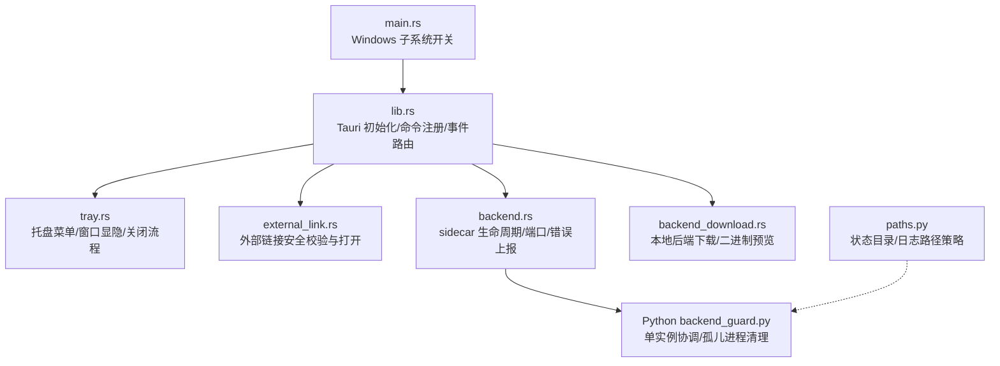
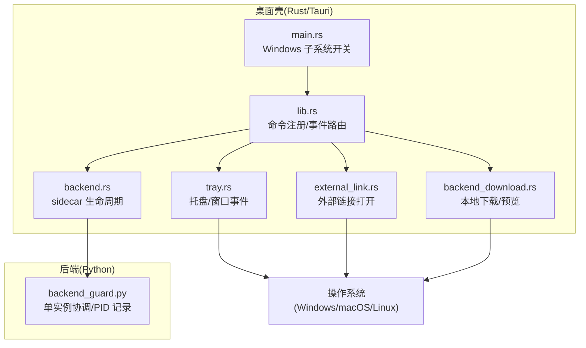
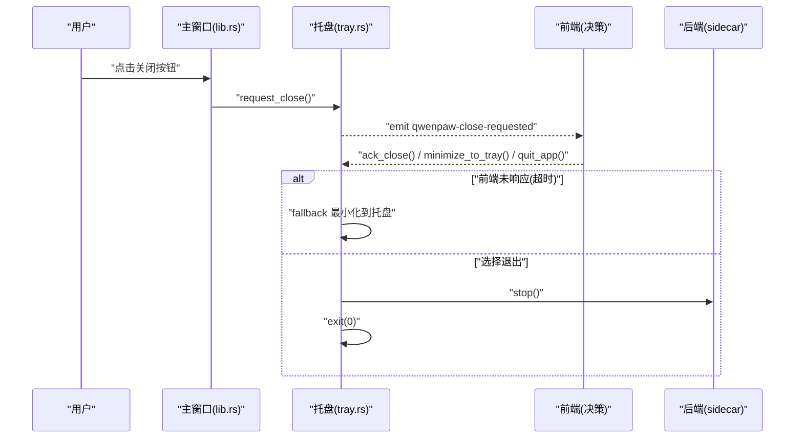
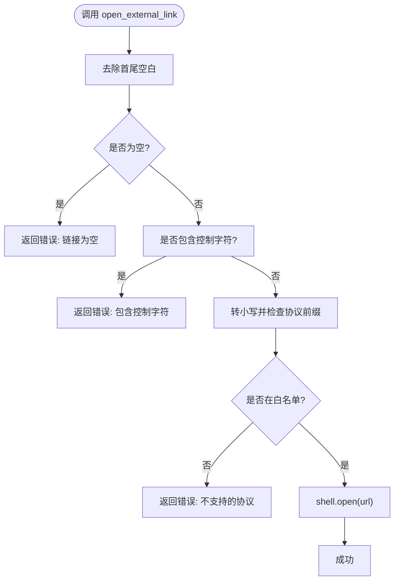
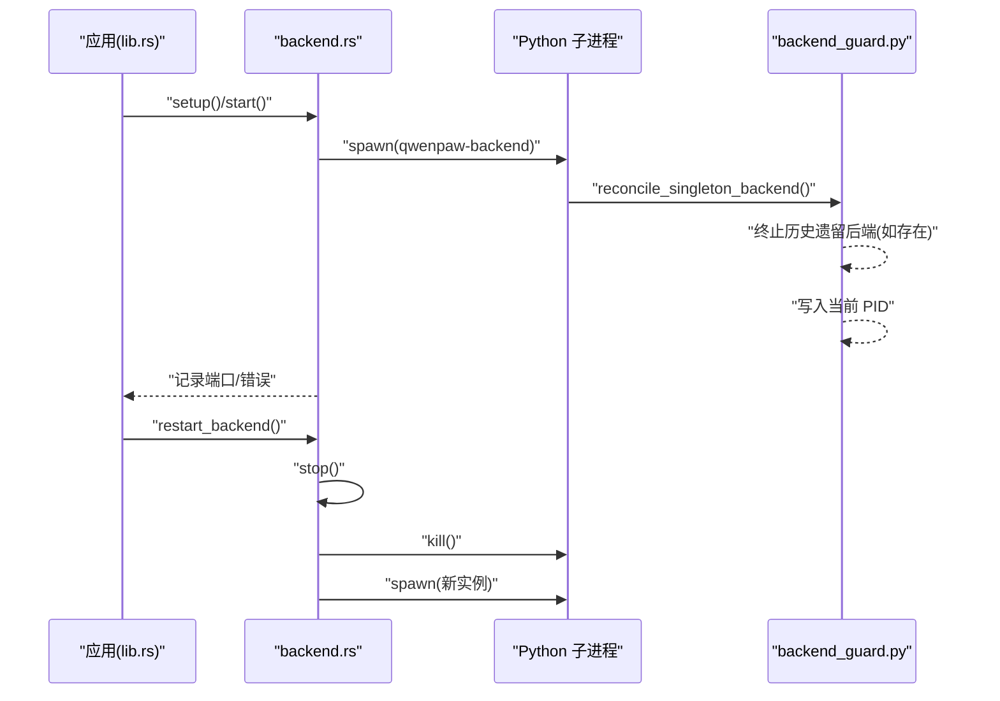
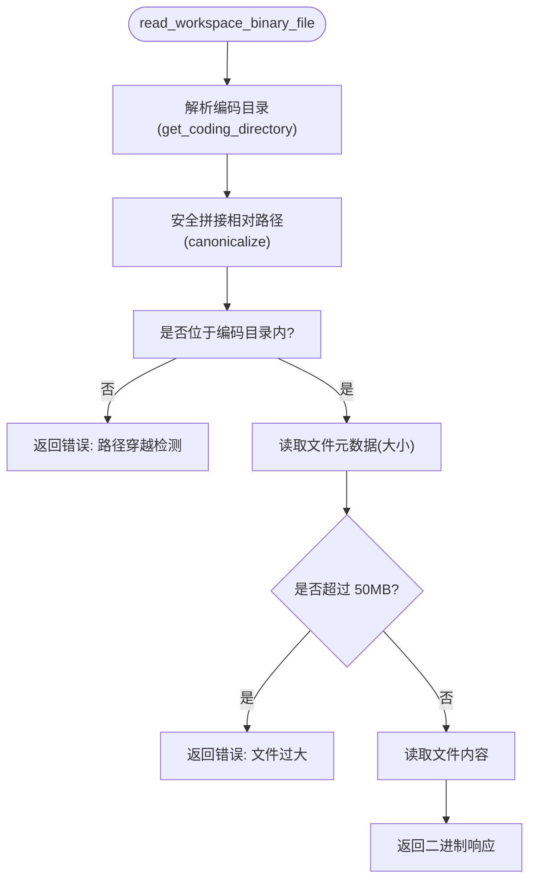
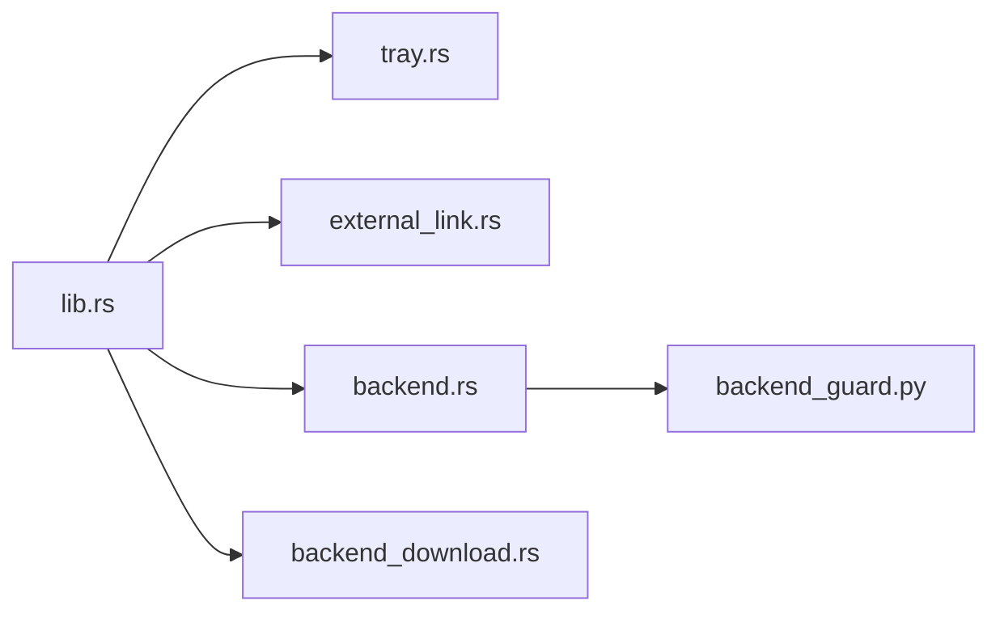

# 跨平台适配

<cite>
**本文引用的文件**   
- [console/src-tauri/src/main.rs](file://console/src-tauri/src/main.rs)
- [console/src-tauri/src/lib.rs](file://console/src-tauri/src/lib.rs)
- [console/src-tauri/src/tray.rs](file://console/src-tauri/src/tray.rs)
- [console/src-tauri/src/external_link.rs](file://console/src-tauri/src/external_link.rs)
- [console/src-tauri/src/backend.rs](file://console/src-tauri/src/backend.rs)
- [console/src-tauri/src/backend_download.rs](file://console/src-tauri/src/backend_download.rs)
- [src/qwenpaw/tauri/backend_guard.py](file://src/qwenpaw/tauri/backend_guard.py)
- [src/qwenpaw/cli/tui/paths.py](file://src/qwenpaw/cli/tui/paths.py)
</cite>

## 目录
1. [简介](#简介)
2. [项目结构](#项目结构)
3. [核心组件](#核心组件)
4. [架构总览](#架构总览)
5. [详细组件分析](#详细组件分析)
6. [依赖关系分析](#依赖关系分析)
7. [性能考量](#性能考量)
8. [故障排查指南](#故障排查指南)
9. [结论](#结论)
10. [附录](#附录)

## 简介
本文件聚焦 QwenPaw 桌面端的跨平台适配能力，围绕 Windows、macOS 与 Linux 的系统集成差异与平台相关功能展开。重点覆盖：
- 托盘图标与窗口关闭行为（含 macOS Dock 交互）
- 外部链接打开的安全校验与系统 Shell 调用
- 后端守护进程（sidecar）生命周期管理与单实例协调
- 本地后端文件下载与二进制预览的跨平台路径解析
- 状态目录与日志路径的平台默认策略

文档同时提供代码级流程图与时序图，帮助初学者快速上手，并为有经验的开发者提供足够的实现细节与优化建议。

## 项目结构
QwenPaw 桌面端基于 Tauri 构建，Rust 侧负责原生系统集成与 sidecar 管理，Python 侧作为后端服务运行于子进程中。关键入口与模块如下：
- Rust 入口与插件注册：main.rs、lib.rs
- 托盘与窗口事件：tray.rs
- 外部链接处理：external_link.rs
- 后端 sidecar 启动/停止/端口查询：backend.rs
- 本地后端文件下载与二进制预览：backend_download.rs
- Python 侧单实例协调：backend_guard.py
- 状态目录与日志路径策略：paths.py

图表来源
- [console/src-tauri/src/main.rs:1-7](file://console/src-tauri/src/main.rs#L1-L7)
- [console/src-tauri/src/lib.rs:1-98](file://console/src-tauri/src/lib.rs#L1-L98)
- [console/src-tauri/src/tray.rs:1-197](file://console/src-tauri/src/tray.rs#L1-L197)
- [console/src-tauri/src/external_link.rs:1-51](file://console/src-tauri/src/external_link.rs#L1-L51)
- [console/src-tauri/src/backend.rs:1-200](file://console/src-tauri/src/backend.rs#L1-L200)
- [console/src-tauri/src/backend_download.rs:1-420](file://console/src-tauri/src/backend_download.rs#L1-L420)
- [src/qwenpaw/tauri/backend_guard.py:1-145](file://src/qwenpaw/tauri/backend_guard.py#L1-L145)
- [src/qwenpaw/cli/tui/paths.py:1-34](file://src/qwenpaw/cli/tui/paths.py#L1-L34)

章节来源
- [console/src-tauri/src/main.rs:1-7](file://console/src-tauri/src/main.rs#L1-L7)
- [console/src-tauri/src/lib.rs:1-98](file://console/src-tauri/src/lib.rs#L1-L98)

## 核心组件
- 托盘与窗口管理
  - 提供“显示窗口”“退出应用”菜单项；支持点击/双击托盘图标显示主窗口；统一窗口关闭请求到前端决策，避免无监听时卡死。
  - 在 macOS 上兼容 Dock 图标重开事件，确保隐藏后仍可恢复。
- 外部链接处理
  - 仅允许 http/https/mailto/tel 协议；拒绝空串、空白字符、控制字符；通过系统 Shell 打开。
- 后端守护进程（sidecar）
  - 启动时注入 UTF-8 与调试环境变量；记录子进程 PID；提供重启、端口查询、启动错误上报；退出时终止 sidecar。
  - Python 侧在绑定端口前执行单实例协调，清理历史遗留进程并写入当前 PID。
- 本地后端文件下载与二进制预览
  - 强制目标为本地回环地址；禁用系统代理；流式写入用户选择路径；限制二进制预览大小；安全拼接工作区路径防止越权访问。
- 状态目录与日志路径
  - 根据平台与环境变量决定状态目录位置；Windows/macOS/Linux 分别采用不同默认路径。

章节来源
- [console/src-tauri/src/tray.rs:1-197](file://console/src-tauri/src/tray.rs#L1-L197)
- [console/src-tauri/src/external_link.rs:1-51](file://console/src-tauri/src/external_link.rs#L1-L51)
- [console/src-tauri/src/backend.rs:1-200](file://console/src-tauri/src/backend.rs#L1-L200)
- [console/src-tauri/src/backend_download.rs:1-420](file://console/src-tauri/src/backend_download.rs#L1-L420)
- [src/qwenpaw/tauri/backend_guard.py:1-145](file://src/qwenpaw/tauri/backend_guard.py#L1-L145)
- [src/qwenpaw/cli/tui/paths.py:1-34](file://src/qwenpaw/cli/tui/paths.py#L1-L34)

## 架构总览
下图展示了桌面端整体架构与跨平台关键点：Rust 层负责 UI 集成与 sidecar 管理，Python 层作为后端服务运行；托盘与外部链接等系统能力由 Tauri 插件暴露给前端。

图表来源
- [console/src-tauri/src/main.rs:1-7](file://console/src-tauri/src/main.rs#L1-L7)
- [console/src-tauri/src/lib.rs:1-98](file://console/src-tauri/src/lib.rs#L1-L98)
- [console/src-tauri/src/tray.rs:1-197](file://console/src-tauri/src/tray.rs#L1-L197)
- [console/src-tauri/src/external_link.rs:1-51](file://console/src-tauri/src/external_link.rs#L1-L51)
- [console/src-tauri/src/backend.rs:1-200](file://console/src-tauri/src/backend.rs#L1-L200)
- [console/src-tauri/src/backend_download.rs:1-420](file://console/src-tauri/src/backend_download.rs#L1-L420)
- [src/qwenpaw/tauri/backend_guard.py:1-145](file://src/qwenpaw/tauri/backend_guard.py#L1-L145)

## 详细组件分析

### 托盘图标与窗口关闭流程（跨平台）
- 功能要点
  - 创建托盘菜单项“显示窗口”“退出应用”，支持左键单击/双击显示主窗口。
  - 窗口关闭请求先阻止默认关闭，交由前端决定是否最小化到托盘或退出；若前端未响应，则超时后安全地最小化到托盘。
  - macOS 特殊处理：Dock 图标重开事件会恢复主窗口；Cmd+Q 走与红按钮一致的关闭提示流程。
- 关键接口
  - 托盘设置：setup(app)
  - 关闭请求：request_close(app_handle)
  - 确认关闭：ack_close(app_handle)
  - 最小化到托盘：minimize_to_tray(app_handle)
  - 退出应用：quit_app(app_handle)
  - 更新托盘文案：set_tray_labels(app_handle, show_window, quit)
  - 显示/隐藏主窗口：show_main_window/hide_main_window
- 平台差异
  - Windows：release 构建隐藏控制台窗口（见 main.rs）。
  - macOS：对 ExitRequested 与 Reopen 事件进行条件编译分支处理，保证 Dock 与菜单栏行为一致。

图表来源
- [console/src-tauri/src/lib.rs:51-90](file://console/src-tauri/src/lib.rs#L51-L90)
- [console/src-tauri/src/tray.rs:100-197](file://console/src-tauri/src/tray.rs#L100-L197)
- [console/src-tauri/src/backend.rs:146-149](file://console/src-tauri/src/backend.rs#L146-L149)

章节来源
- [console/src-tauri/src/main.rs:1-7](file://console/src-tauri/src/main.rs#L1-L7)
- [console/src-tauri/src/lib.rs:51-90](file://console/src-tauri/src/lib.rs#L51-L90)
- [console/src-tauri/src/tray.rs:44-98](file://console/src-tauri/src/tray.rs#L44-L98)
- [console/src-tauri/src/tray.rs:100-197](file://console/src-tauri/src/tray.rs#L100-L197)

### 外部链接处理（安全与跨平台）
- 功能要点
  - 白名单协议：http、https、mailto、tel。
  - 输入校验：禁止空串、前后空白、控制字符；大小写归一化后匹配前缀。
  - 通过 Tauri shell 插件调用系统默认浏览器/邮件客户端/拨号程序。
- 关键接口
  - open_external_link(app_handle, url) -> Result<(), String>

图表来源
- [console/src-tauri/src/external_link.rs:1-51](file://console/src-tauri/src/external_link.rs#L1-L51)

章节来源
- [console/src-tauri/src/external_link.rs:1-51](file://console/src-tauri/src/external_link.rs#L1-L51)

### 后端守护进程（sidecar）生命周期与单实例协调
- Rust 侧（lib.rs/backend.rs）
  - 启动：设置日志目标、注入 Python 环境、spawn 子进程、记录 PID、监听事件。
  - 停止：按代次(generation)原子递增，避免竞态；kill 子进程。
  - 重启：先 stop 再 start，并返回错误信息供前端重试 UI 展示。
  - 端口/错误：提供查询接口，用于引导页面判断后端就绪。
- Python 侧（backend_guard.py）
  - 单实例协调：读取上次记录的 PID，校验是否为 QwenPaw 后端进程，若是则优雅终止（必要时 SIGKILL），然后写入当前 PID。
  - 防御性：即使失败也不应阻塞后端启动。

图表来源
- [console/src-tauri/src/lib.rs:21-57](file://console/src-tauri/src/lib.rs#L21-L57)
- [console/src-tauri/src/backend.rs:127-200](file://console/src-tauri/src/backend.rs#L127-L200)
- [src/qwenpaw/tauri/backend_guard.py:125-145](file://src/qwenpaw/tauri/backend_guard.py#L125-L145)

章节来源
- [console/src-tauri/src/backend.rs:1-200](file://console/src-tauri/src/backend.rs#L1-L200)
- [src/qwenpaw/tauri/backend_guard.py:1-145](file://src/qwenpaw/tauri/backend_guard.py#L1-L145)

### 本地后端文件下载与二进制预览（跨平台路径与安全）
- 下载
  - 仅允许 http 且目标为主机为回环地址（localhost/127.0.0.1/[::1]）。
  - 禁用系统代理；连接与总超时可配置；流式写入用户选择的文件路径。
- 二进制预览
  - 从工作区相对路径读取二进制文件，限制最大 50MB；安全拼接路径并 canonicalize 校验，防止路径穿越。
  - 编码目录解析优先级：环境变量 > 旧安装路径 > 默认 .qwenpaw；优先使用 agent.json 中 coding_mode.project_dir，否则回退 workspace_dir。
- 关键接口
  - download_backend_file(request) -> Result<(), String>
  - read_workspace_binary_file(file_path, agent_id) -> Response

图表来源
- [console/src-tauri/src/backend_download.rs:248-323](file://console/src-tauri/src/backend_download.rs#L248-L323)
- [console/src-tauri/src/backend_download.rs:339-409](file://console/src-tauri/src/backend_download.rs#L339-L409)

章节来源
- [console/src-tauri/src/backend_download.rs:1-420](file://console/src-tauri/src/backend_download.rs#L1-L420)

### 状态目录与日志路径（平台默认策略）
- 策略
  - 支持环境变量覆盖 PAW_STATE_DIR。
  - 平台默认：
    - Windows：LOCALAPPDATA/paw 或 ~\paw
    - macOS：~/Library/Application Support/paw
    - Linux：XDG_STATE_HOME/paw 或 ~/.local/state/paw
- 用途
  - 存放日志等自管状态，避免与工作目录耦合。

章节来源
- [src/qwenpaw/cli/tui/paths.py:1-34](file://src/qwenpaw/cli/tui/paths.py#L1-L34)

## 依赖关系分析
- 组件耦合
  - lib.rs 集中注册命令与管理状态，低耦合地组合 tray、backend、external_link、backend_download。
  - backend.rs 与 backend_guard.py 通过进程 PID 文件与命令行标记协同，形成跨语言单实例约束。
- 外部依赖
  - Tauri 插件：shell、dialog、updater、log。
  - Python 依赖：psutil（进程管理）。
- 潜在循环
  - 无直接循环依赖；Rust 与 Python 通过进程边界解耦。

图表来源
- [console/src-tauri/src/lib.rs:1-98](file://console/src-tauri/src/lib.rs#L1-L98)
- [console/src-tauri/src/backend.rs:1-200](file://console/src-tauri/src/backend.rs#L1-L200)
- [src/qwenpaw/tauri/backend_guard.py:1-145](file://src/qwenpaw/tauri/backend_guard.py#L1-L145)

章节来源
- [console/src-tauri/src/lib.rs:1-98](file://console/src-tauri/src/lib.rs#L1-L98)

## 性能考量
- 托盘与窗口事件
  - 关闭请求采用超时 fallback，避免 UI 线程阻塞；最小化到托盘比退出更利于任务恢复。
- Sidecar 生命周期
  - 使用 generation 原子计数避免并发重启导致的竞态；日志级别可通过环境变量切换至 Debug。
- 下载与预览
  - 流式写入降低内存占用；禁用系统代理减少额外开销；严格限制文件大小避免 OOM。
- 路径解析
  - canonicalize 与 starts_with 校验一次完成，避免多次 I/O。

[本节为通用指导，不直接分析具体文件]

## 故障排查指南
- 无法打开外部链接
  - 检查 URL 是否包含空白或控制字符；确认协议在白名单内。
  - 参考：[console/src-tauri/src/external_link.rs:28-50](file://console/src-tauri/src/external_link.rs#L28-L50)
- 托盘点击无效或窗口无法恢复
  - 确认 macOS 下是否存在 Reopen 事件处理；检查托盘菜单文本是否被正确设置。
  - 参考：[console/src-tauri/src/lib.rs:84-88](file://console/src-tauri/src/lib.rs#L84-L88)、[console/src-tauri/src/tray.rs:152-177](file://console/src-tauri/src/tray.rs#L152-L177)
- 后端无法启动或重复启动导致资源泄漏
  - 查看 Rust 侧 startup error；确认 Python 侧是否成功写入 PID；必要时手动删除 PID 文件。
  - 参考：[console/src-tauri/src/backend.rs:109-125](file://console/src-tauri/src/backend.rs#L109-L125)、[src/qwenpaw/tauri/backend_guard.py:125-145](file://src/qwenpaw/tauri/backend_guard.py#L125-L145)
- 本地下载失败或权限不足
  - 确认目标 URL 为 http 且主机为回环地址；检查用户选择路径的写入权限。
  - 参考：[console/src-tauri/src/backend_download.rs:77-98](file://console/src-tauri/src/backend_download.rs#L77-L98)
- 二进制预览报错“路径穿越”或“文件过大”
  - 检查相对路径是否越界；确认文件大小不超过 50MB。
  - 参考：[console/src-tauri/src/backend_download.rs:302-323](file://console/src-tauri/src/backend_download.rs#L302-L323)、[console/src-tauri/src/backend_download.rs:259-270](file://console/src-tauri/src/backend_download.rs#L259-L270)

章节来源
- [console/src-tauri/src/external_link.rs:28-50](file://console/src-tauri/src/external_link.rs#L28-L50)
- [console/src-tauri/src/lib.rs:84-88](file://console/src-tauri/src/lib.rs#L84-L88)
- [console/src-tauri/src/tray.rs:152-177](file://console/src-tauri/src/tray.rs#L152-L177)
- [console/src-tauri/src/backend.rs:109-125](file://console/src-tauri/src/backend.rs#L109-L125)
- [src/qwenpaw/tauri/backend_guard.py:125-145](file://src/qwenpaw/tauri/backend_guard.py#L125-L145)
- [console/src-tauri/src/backend_download.rs:77-98](file://console/src-tauri/src/backend_download.rs#L77-L98)
- [console/src-tauri/src/backend_download.rs:302-323](file://console/src-tauri/src/backend_download.rs#L302-L323)
- [console/src-tauri/src/backend_download.rs:259-270](file://console/src-tauri/src/backend_download.rs#L259-L270)

## 结论
QwenPaw 桌面端通过 Tauri 将跨平台系统集成能力封装为稳定的命令与事件模型，结合 Python 侧的单实例协调机制，实现了稳健的后端守护进程管理。托盘与外部链接等功能在不同平台上保持一致的用户体验，同时在安全与健壮性方面做了充分防护。建议在后续迭代中继续完善错误上报与诊断工具，进一步提升跨平台稳定性与可维护性。

[本节为总结性内容，不直接分析具体文件]

## 附录
- 关键命令与返回值约定
  - open_external_link(url) -> Result<(), String>
  - download_backend_file({url, file_path, headers}) -> Result<(), String>
  - read_workspace_binary_file(file_path, agent_id) -> Response
  - restart_backend() -> Result<(), String>
  - backend_port() -> Option<u16>
  - backend_startup_error() -> Option<String>
  - minimize_to_tray() -> void
  - quit_app() -> void
  - set_tray_labels(show_window, quit) -> Result<(), String>
  - ack_close() -> void

章节来源
- [console/src-tauri/src/external_link.rs:9-26](file://console/src-tauri/src/external_link.rs#L9-L26)
- [console/src-tauri/src/backend_download.rs:28-75](file://console/src-tauri/src/backend_download.rs#L28-L75)
- [console/src-tauri/src/backend_download.rs:248-282](file://console/src-tauri/src/backend_download.rs#L248-L282)
- [console/src-tauri/src/backend.rs:100-125](file://console/src-tauri/src/backend.rs#L100-L125)
- [console/src-tauri/src/tray.rs:135-177](file://console/src-tauri/src/tray.rs#L135-L177)