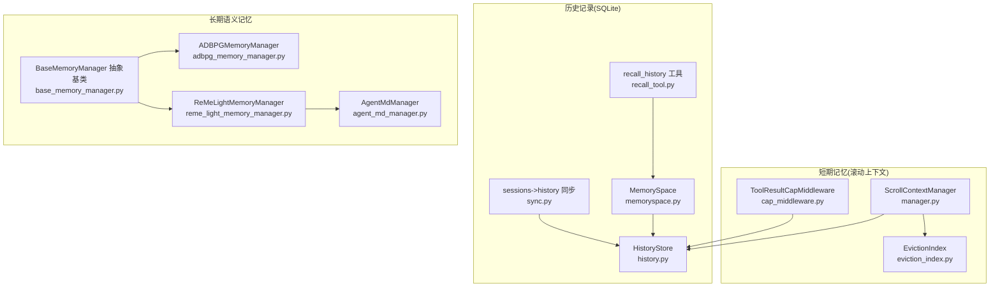
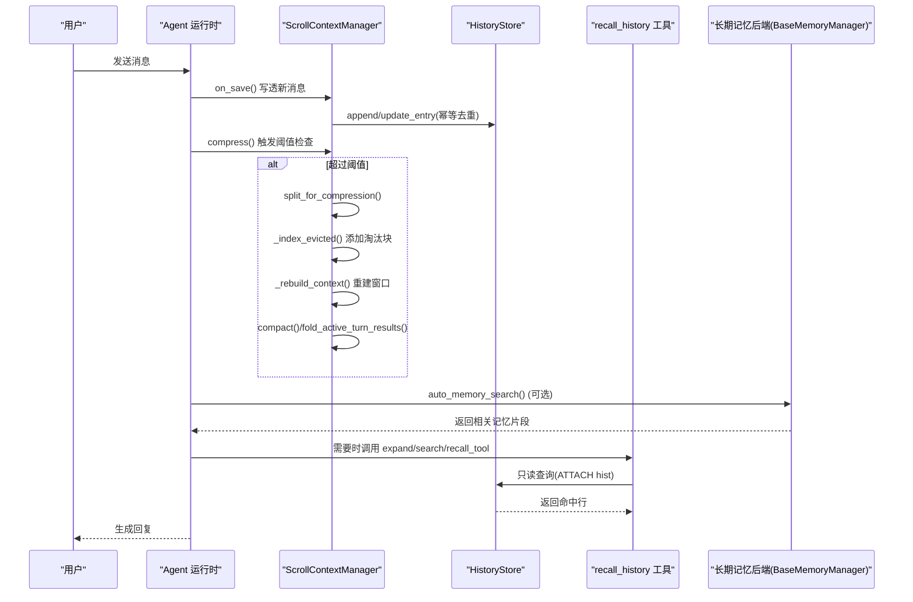
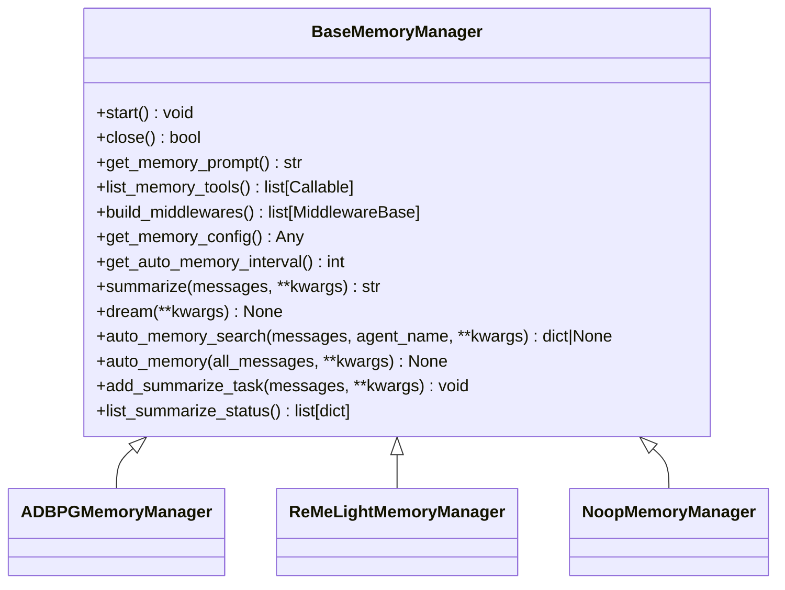
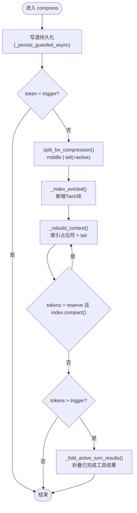
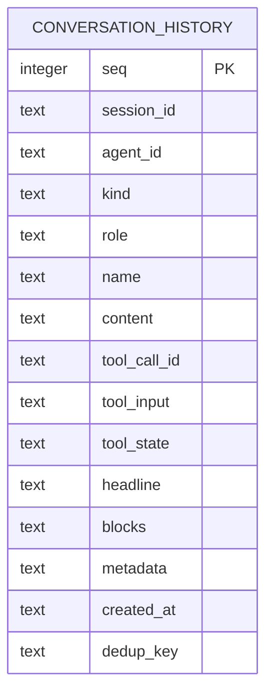
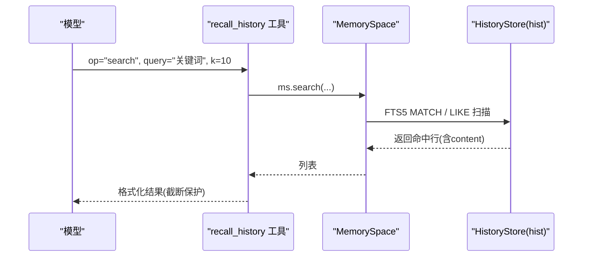
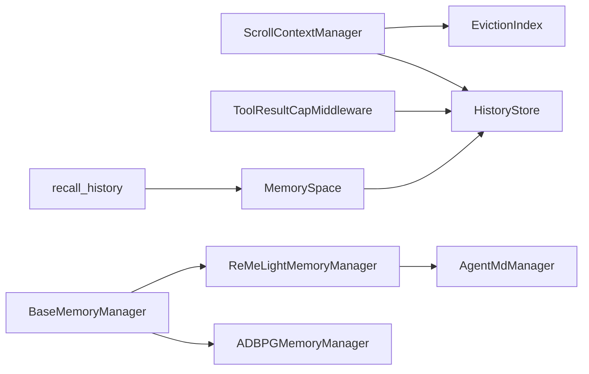

# 三层记忆架构

<cite>
**本文引用的文件**   
- [base_memory_manager.py](file://src/qwenpaw/agents/memory/base_memory_manager.py)
- [adbpg_memory_manager.py](file://src/qwenpaw/agents/memory/adbpg_memory_manager.py)
- [reme_light_memory_manager.py](file://src/qwenpaw/agents/memory/reme_light_memory_manager.py)
- [agent_md_manager.py](file://src/qwenpaw/agents/memory/agent_md_manager.py)
- [manager.py](file://src/qwenpaw/agents/context/scroll/manager.py)
- [history.py](file://src/qwenpaw/agents/context/scroll/history.py)
- [memoryspace.py](file://src/qwenpaw/agents/context/scroll/memoryspace.py)
- [recall_tool.py](file://src/qwenpaw/agents/context/scroll/recall_tool.py)
- [eviction_index.py](file://src/qwenpaw/agents/context/scroll/eviction_index.py)
- [cap_middleware.py](file://src/qwenpaw/agents/context/scroll/cap_middleware.py)
- [sync.py](file://src/qwenpaw/agents/context/scroll/sync.py)
</cite>

## 目录
1. [引言](#引言)
2. [项目结构](#项目结构)
3. [核心组件](#核心组件)
4. [架构总览](#架构总览)
5. [详细组件分析](#详细组件分析)
6. [依赖关系分析](#依赖关系分析)
7. [性能与内存优化](#性能与内存优化)
8. [故障排查指南](#故障排查指南)
9. [结论](#结论)
10. [附录：配置与使用示例](#附录配置与使用示例)

## 引言
本文件系统性阐述 QwenPaw 的“三层记忆架构”：短期记忆（滚动上下文）、历史记录（持久化对话日志）与长期语义记忆（外部存储/文件索引）。文档覆盖各层职责、数据流转、生命周期管理，抽象基类 BaseMemoryManager 的设计模式与扩展点，Scroll Context 机制的工作原理（上下文滚动策略、历史消息管理与内存优化），以及与 Agent 运行时、工具系统、中间件的集成方式。内容兼顾初学者友好与资深开发者的技术深度。

## 项目结构
QwenPaw 的记忆体系由三个层次组成：
- 短期记忆：基于 Scroll Context 的“写透 + 淘汰索引”策略，将超出阈值的中间段折叠为可检索的索引占位符，保留最近尾部与活跃轮次在窗口内。
- 历史记录：以 SQLite 为核心的 conversation_history 表，提供全量结构化持久化、FTS5 全文检索、去重键幂等写入、WAL 并发安全与清理回收能力。
- 长期语义记忆：通过后端实现（如 ADBPG 向量库或 ReMe 轻量记忆）进行跨会话语义检索与自动摘要/梦境任务。

图表来源
- [manager.py:113-392](file://src/qwenpaw/agents/context/scroll/manager.py#L113-L392)
- [eviction_index.py:130-331](file://src/qwenpaw/agents/context/scroll/eviction_index.py#L130-L331)
- [cap_middleware.py:20-119](file://src/qwenpaw/agents/context/scroll/cap_middleware.py#L20-L119)
- [history.py:54-517](file://src/qwenpaw/agents/context/scroll/history.py#L54-L517)
- [memoryspace.py:126-648](file://src/qwenpaw/agents/context/scroll/memoryspace.py#L126-L648)
- [recall_tool.py:102-253](file://src/qwenpaw/agents/context/scroll/recall_tool.py#L102-L253)
- [sync.py:343-586](file://src/qwenpaw/agents/context/scroll/sync.py#L343-L586)
- [base_memory_manager.py:33-509](file://src/qwenpaw/agents/memory/base_memory_manager.py#L33-L509)
- [adbpg_memory_manager.py:32-431](file://src/qwenpaw/agents/memory/adbpg_memory_manager.py#L32-L431)
- [reme_light_memory_manager.py:101-538](file://src/qwenpaw/agents/memory/reme_light_memory_manager.py#L101-L538)
- [agent_md_manager.py:12-252](file://src/qwenpaw/agents/memory/agent_md_manager.py#L12-L252)

章节来源
- [manager.py:113-392](file://src/qwenpaw/agents/context/scroll/manager.py#L113-L392)
- [history.py:54-517](file://src/qwenpaw/agents/context/scroll/history.py#L54-L517)
- [memoryspace.py:126-648](file://src/qwenpaw/agents/context/scroll/memoryspace.py#L126-L648)
- [recall_tool.py:102-253](file://src/qwenpaw/agents/context/scroll/recall_tool.py#L102-L253)
- [eviction_index.py:130-331](file://src/qwenpaw/agents/context/scroll/eviction_index.py#L130-L331)
- [cap_middleware.py:20-119](file://src/qwenpaw/agents/context/scroll/cap_middleware.py#L20-L119)
- [sync.py:343-586](file://src/qwenpaw/agents/context/scroll/sync.py#L343-L586)
- [base_memory_manager.py:33-509](file://src/qwenpaw/agents/memory/base_memory_manager.py#L33-L509)
- [adbpg_memory_manager.py:32-431](file://src/qwenpaw/agents/memory/adbpg_memory_manager.py#L32-L431)
- [reme_light_memory_manager.py:101-538](file://src/qwenpaw/agents/memory/reme_light_memory_manager.py#L101-L538)
- [agent_md_manager.py:12-252](file://src/qwenpaw/agents/memory/agent_md_manager.py#L12-L252)

## 核心组件
- BaseMemoryManager 抽象基类：定义记忆后端的统一接口（启动/关闭、提示注入、工具暴露、自动搜索/自动提取、后台总结任务队列等），并提供注册表与工厂方法用于按名称解析具体后端。
- ScrollContextManager：滚动上下文管理器，负责写透持久化、触发压缩、构建淘汰索引、重建上下文窗口、以及最后手段的“折叠活跃轮结果”。
- HistoryStore：SQLite 持久化存储，支持 FTS5 全文检索、去重键幂等写入、WAL 并发、损坏恢复隔离、清理与 VACUUM。
- MemorySpace：模型侧只读工作区，ATTACH 历史数据库并限制写操作，提供 expand/search/recall_tool 等意图化查询。
- recall_history 工具：面向模型的参数化只读查询入口，封装 MemorySpace 的常用操作。
- EvictionIndex：淘汰索引，分层级压缩展示已淘汰的历史片段，支持压力下的提前压缩。
- ToolResultCapMiddleware：对超大工具输出进行截断并写透完整结果，避免上下文膨胀。
- ADBPGMemoryManager / ReMeLightMemoryManager：长期语义记忆后端，分别对接 AnalyticDB for PostgreSQL 与 ReMe 应用框架，提供自动搜索、自动摘要、梦境任务等。
- AgentMdManager：工作区与 memory/digest 目录的 Markdown 读写管理，配合 ReMe 使用。

章节来源
- [base_memory_manager.py:33-509](file://src/qwenpaw/agents/memory/base_memory_manager.py#L33-L509)
- [manager.py:113-392](file://src/qwenpaw/agents/context/scroll/manager.py#L113-L392)
- [history.py:54-517](file://src/qwenpaw/agents/context/scroll/history.py#L54-L517)
- [memoryspace.py:126-648](file://src/qwenpaw/agents/context/scroll/memoryspace.py#L126-L648)
- [recall_tool.py:102-253](file://src/qwenpaw/agents/context/scroll/recall_tool.py#L102-L253)
- [eviction_index.py:130-331](file://src/qwenpaw/agents/context/scroll/eviction_index.py#L130-L331)
- [cap_middleware.py:20-119](file://src/qwenpaw/agents/context/scroll/cap_middleware.py#L20-L119)
- [adbpg_memory_manager.py:32-431](file://src/qwenpaw/agents/memory/adbpg_memory_manager.py#L32-L431)
- [reme_light_memory_manager.py:101-538](file://src/qwenpaw/agents/memory/reme_light_memory_manager.py#L101-L538)
- [agent_md_manager.py:12-252](file://src/qwenpaw/agents/memory/agent_md_manager.py#L12-L252)

## 架构总览
三层记忆的职责划分与协作关系如下：
- 短期记忆（滚动上下文）：在每次推理前/后执行 on_save 与 compress，保证“写透 + 淘汰”，维持上下文窗口稳定。
- 历史记录（SQLite）：作为唯一事实源，承载所有结构化消息、工具调用与结果；提供 FTS5 全文检索与 seq 范围回放。
- 长期语义记忆：在 pre_reply/post_reply 阶段按需自动搜索/自动摘要，增强跨会话理解与知识沉淀。

图表来源
- [manager.py:186-392](file://src/qwenpaw/agents/context/scroll/manager.py#L186-L392)
- [history.py:235-356](file://src/qwenpaw/agents/context/scroll/history.py#L235-L356)
- [recall_tool.py:128-253](file://src/qwenpaw/agents/context/scroll/recall_tool.py#L128-L253)
- [base_memory_manager.py:270-315](file://src/qwenpaw/agents/memory/base_memory_manager.py#L270-L315)

## 详细组件分析

### BaseMemoryManager 抽象基类
- 设计模式：模板方法与注册表模式。子类必须实现 start/close/get_memory_prompt/list_memory_tools，可选择性重写 summarize/dream/auto_memory/auto_memory_search。
- 生命周期：实例化 → start → 会话中使用 → close。
- 扩展点：
  - build_middlewares：注入 MemoryMiddleware，参与 prompt/model-call/reply 生命周期。
  - get_memory_config/get_auto_memory_interval：供共享中间件读取后端特定配置与周期。
  - 后台总结任务队列：add_summarize_task/list_summarize_status，串行执行 summarize。
  - 自动记忆搜索合成消息：_build_auto_memory_search_msg，便于将搜索结果以工具交互形式注入上下文。

图表来源
- [base_memory_manager.py:33-509](file://src/qwenpaw/agents/memory/base_memory_manager.py#L33-L509)
- [adbpg_memory_manager.py:32-431](file://src/qwenpaw/agents/memory/adbpg_memory_manager.py#L32-L431)
- [reme_light_memory_manager.py:101-538](file://src/qwenpaw/agents/memory/reme_light_memory_manager.py#L101-L538)

章节来源
- [base_memory_manager.py:33-509](file://src/qwenpaw/agents/memory/base_memory_manager.py#L33-L509)

### Scroll Context 机制（短期记忆）
- 写透持久化：on_save 将当前上下文未持久化的条目追加到 HistoryStore，支持更新已有行（如后续追加 tool_call/tool_result 或 headline）。
- 压缩策略：compress 在 token 超阈值时，拆分出“中间段”和“尾部”，将中间段折叠为 EvictionIndex 的新 Tier 0 块，重建上下文为“索引占位符 + 尾部”。若仍超限，则循环 compact 直至满足 reserve 阈值；极端情况下折叠活跃轮已完成工具结果（仅替换输出文本为召回指针）。
- 淘汰索引：EvictionIndex 采用层级栈结构，每层最多固定数量的块；当某层满时，将最老块向上“进位”合并，形成更高层的单块，保持最近历史细节、旧历史端点摘要。
- 内存优化：
  - ToolResultCapMiddleware：对单条工具结果进行 token 估算，超过阈值则写透完整结果并在上下文中保留预览+召回指针。
  - 活跃轮保护：识别并跳过运行时注入的“继续工作”伪用户消息，确保活跃请求不被错误地纳入淘汰。
  - 去重键幂等：append 使用 dedup_key（turn 用 msg.id，tool_result 用 tool_call_id 或匿名位置），避免重复写入。

图表来源
- [manager.py:256-392](file://src/qwenpaw/agents/context/scroll/manager.py#L256-L392)
- [eviction_index.py:130-331](file://src/qwenpaw/agents/context/scroll/eviction_index.py#L130-L331)
- [cap_middleware.py:20-119](file://src/qwenpaw/agents/context/scroll/cap_middleware.py#L20-L119)

章节来源
- [manager.py:186-392](file://src/qwenpaw/agents/context/scroll/manager.py#L186-L392)
- [eviction_index.py:130-331](file://src/qwenpaw/agents/context/scroll/eviction_index.py#L130-L331)
- [cap_middleware.py:20-119](file://src/qwenpaw/agents/context/scroll/cap_middleware.py#L20-L119)

### 历史记录（SQLite）
- 数据结构：conversation_history 表包含 seq、session_id、agent_id、kind、role、name、content、tool_call_id、tool_input、tool_state、headline、blocks、metadata、created_at、dedup_key。
- 并发与健壮性：WAL 模式、busy_timeout、check_same_thread=False + 线程锁序列化访问；首次打开 quick_check 失败则隔离损坏文件并重开新库。
- 全文检索：FTS5 虚拟表（porter unicode61），缺失模块时降级 LIKE 扫描并返回提示行。
- 幂等写入：UNIQUE 索引 ux_dedup(session_id, dedup_key)，冲突时返回已有 seq。
- 清理与回收：estimate_purge/purge(before=..., kinds=...) 支持按时间/类型删除；VACUUM 独立步骤回收空间。
- 只读工作区：MemorySpace ATTACH 历史库为只读 schema，authorizer 禁止 ATTACH/DETACH 及对 hist 的写操作。

图表来源
- [history.py:144-188](file://src/qwenpaw/agents/context/scroll/history.py#L144-L188)

章节来源
- [history.py:54-517](file://src/qwenpaw/agents/context/scroll/history.py#L54-L517)
- [memoryspace.py:126-648](file://src/qwenpaw/agents/context/scroll/memoryspace.py#L126-L648)

### 召回工具与模型侧工作区
- recall_history 工具：提供 op="expand"/"search"/"recall_tool" 三种只读操作，内部创建 MemorySpace 实例，ATTACH 历史库并受 authorizer 保护。
- MemorySpace：
  - expand(lo, hi)：按 seq 范围回放完整对话。
  - search(query, k, kind, all_agents, session_id, agent_id)：FTS5 MATCH 优先，无词元或不可用时回退 LIKE；排除自身回忆工具行与当前活跃轮。
  - recall_tool(tool_call_id)：按工具调用 ID 回放调用与结果。
  - sessions/session/agents：会话与代理发现接口。
  - active turn floor：缓存最新真实用户消息的 MAX(seq)，避免搜索命中自身进行中轮次。

图表来源
- [recall_tool.py:128-253](file://src/qwenpaw/agents/context/scroll/recall_tool.py#L128-L253)
- [memoryspace.py:435-585](file://src/qwenpaw/agents/context/scroll/memoryspace.py#L435-L585)

章节来源
- [recall_tool.py:102-253](file://src/qwenpaw/agents/context/scroll/recall_tool.py#L102-L253)
- [memoryspace.py:126-648](file://src/qwenpaw/agents/context/scroll/memoryspace.py#L126-L648)

### 长期语义记忆后端
- ADBPGMemoryManager：
  - 启动时加载 agent 配置中的 adbpg_memory_config，初始化客户端；支持 isolation 模式（shared/agent-scoped）。
  - 自动搜索：pre_reply 阶段根据最近用户消息构建查询，调用 memory_search 并将结果以合成 assistant 消息注入。
  - 自动摘要：post_reply 阶段异步调度 add_memory（fire-and-forget），不阻塞回复。
  - 本地文件辅助：MEMORY.md 与 memory/*.md 的关键词匹配，与 ADBPG 结果合并返回。
- ReMeLightMemoryManager：
  - 通过 ReMe 应用运行 search/auto_memory/auto_dream 等作业，复用 QwenPaw 的模型组件。
  - 自动搜索与自动摘要：同样以合成 assistant 消息注入搜索结果；支持 inbox 投递作业结果。
  - 与 AgentMdManager 协同：读写 daily/digest 目录的 Markdown 文件。

章节来源
- [adbpg_memory_manager.py:32-431](file://src/qwenpaw/agents/memory/adbpg_memory_manager.py#L32-L431)
- [reme_light_memory_manager.py:101-538](file://src/qwenpaw/agents/memory/reme_light_memory_manager.py#L101-L538)
- [agent_md_manager.py:12-252](file://src/qwenpaw/agents/memory/agent_md_manager.py#L12-L252)

### 历史迁移与一致性
- sessions/*.json → history.db 同步：
  - 非破坏性、幂等（基于相同 dedup_key 与 UNIQUE 索引）、忠实（复用 msg_to_entries 序列化路径）。
  - 清单 .synced.json 记录文件哈希与插入行数，避免重复读取；支持 retention_days 过滤过期消息。
  - 启动时遍历 scroll 策略的 agent，导入历史并执行 purge/vacuum。

章节来源
- [sync.py:343-586](file://src/qwenpaw/agents/context/scroll/sync.py#L343-L586)

## 依赖关系分析
- 组件耦合：
  - ScrollContextManager 强依赖 HistoryStore（写透/更新）与 EvictionIndex（索引构建/压缩）。
  - ToolResultCapMiddleware 与 ScrollContextManager 通过 capped_results 共享“已完整持久化工具结果”的状态，避免重复写入。
  - MemorySpace 通过 ATTACH 只读访问 HistoryStore，authorizer 保障安全边界。
  - BaseMemoryManager 的后端实现（ADBPG/ReMe）通过工具系统与中间件与 Agent 运行时集成。
- 外部依赖：
  - SQLite（WAL、FTS5 可选）、AgentScope 消息与工具模型、ReMe 应用框架、AnalyticDB for PostgreSQL REST API。

图表来源
- [manager.py:186-392](file://src/qwenpaw/agents/context/scroll/manager.py#L186-L392)
- [history.py:54-517](file://src/qwenpaw/agents/context/scroll/history.py#L54-L517)
- [eviction_index.py:130-331](file://src/qwenpaw/agents/context/scroll/eviction_index.py#L130-L331)
- [cap_middleware.py:20-119](file://src/qwenpaw/agents/context/scroll/cap_middleware.py#L20-L119)
- [recall_tool.py:102-253](file://src/qwenpaw/agents/context/scroll/recall_tool.py#L102-L253)
- [memoryspace.py:126-648](file://src/qwenpaw/agents/context/scroll/memoryspace.py#L126-L648)
- [base_memory_manager.py:33-509](file://src/qwenpaw/agents/memory/base_memory_manager.py#L33-L509)
- [adbpg_memory_manager.py:32-431](file://src/qwenpaw/agents/memory/adbpg_memory_manager.py#L32-L431)
- [reme_light_memory_manager.py:101-538](file://src/qwenpaw/agents/memory/reme_light_memory_manager.py#L101-L538)
- [agent_md_manager.py:12-252](file://src/qwenpaw/agents/memory/agent_md_manager.py#L12-L252)

章节来源
- [manager.py:186-392](file://src/qwenpaw/agents/context/scroll/manager.py#L186-L392)
- [history.py:54-517](file://src/qwenpaw/agents/context/scroll/history.py#L54-L517)
- [eviction_index.py:130-331](file://src/qwenpaw/agents/context/scroll/eviction_index.py#L130-L331)
- [cap_middleware.py:20-119](file://src/qwenpaw/agents/context/scroll/cap_middleware.py#L20-L119)
- [recall_tool.py:102-253](file://src/qwenpaw/agents/context/scroll/recall_tool.py#L102-L253)
- [memoryspace.py:126-648](file://src/qwenpaw/agents/context/scroll/memoryspace.py#L126-L648)
- [base_memory_manager.py:33-509](file://src/qwenpaw/agents/memory/base_memory_manager.py#L33-L509)
- [adbpg_memory_manager.py:32-431](file://src/qwenpaw/agents/memory/adbpg_memory_manager.py#L32-L431)
- [reme_light_memory_manager.py:101-538](file://src/qwenpaw/agents/memory/reme_light_memory_manager.py#L101-L538)
- [agent_md_manager.py:12-252](file://src/qwenpaw/agents/memory/agent_md_manager.py#L12-L252)

## 性能与内存优化
- 写透与并发：
  - HistoryStore 使用 WAL 与 busy_timeout，多线程访问通过锁序列化，避免事件循环阻塞。
  - compress 的大规模持久化通过 asyncio.to_thread 离线执行，on_save 增量写入直接在线程上完成。
- 上下文控制：
  - 阈值触发与 reserve 目标分离，先淘汰中间段，再循环 compact，最后才折叠活跃轮结果，最大限度保留近期信息。
  - ToolResultCapMiddleware 在工具结果过大时写透完整输出，上下文仅保留预览与召回指针，显著降低 token 占用。
- 检索优化：
  - FTS5 优先，缺少模块时优雅降级 LIKE；主动排除回忆工具自身行与当前活跃轮，避免自污染与回声。
  - MemorySpace 缓存 active turn floor，减少重复扫描成本。
- 清理与回收：
  - estimate_purge/purge 支持按时间与类型裁剪；VACUUM 独立执行，避免影响热路径。
  - sessions 同步支持 retention_days 过滤，避免导入即将被删除的行。

[本节为通用性能讨论，无需列出具体文件来源]

## 故障排查指南
- 历史库损坏：
  - 现象：启动时报错无法读取 history.db。
  - 处理：HistoryStore 会隔离损坏文件并重建新库，同时标记 degraded；检查 quarantined_to 路径与日志。
- 写透失败：
  - 现象：on_save/compress 捕获 sqlite3.Error/OSError，记录 degraded 状态。
  - 处理：确认磁盘空间与权限；必要时重启服务并观察是否持续失败。
- 全文检索不可用：
  - 现象：search 返回 LIKE 降级提示。
  - 处理：安装带 FTS5 的 SQLite 构建；或使用单关键词搜索提升命中率。
- 活跃轮误判：
  - 现象：搜索命中自身进行中轮次导致回声。
  - 处理：确认 MemorySpace 的 active turn floor 计算逻辑未被绕过；检查运行时注入的伪用户消息标签。
- 长输出丢失：
  - 现象：工具结果被截断但无法召回。
  - 处理：确认 ToolResultCapMiddleware 成功写透完整结果；检查 capped_results 映射与 dedup_key 是否正确。

章节来源
- [history.py:113-139](file://src/qwenpaw/agents/context/scroll/history.py#L113-L139)
- [history.py:479-508](file://src/qwenpaw/agents/context/scroll/history.py#L479-L508)
- [memoryspace.py:435-585](file://src/qwenpaw/agents/context/scroll/memoryspace.py#L435-L585)
- [cap_middleware.py:52-119](file://src/qwenpaw/agents/context/scroll/cap_middleware.py#L52-L119)

## 结论
QwenPaw 的三层记忆架构通过“短期滚动 + 持久历史 + 长期语义”的分层设计，在保证上下文窗口稳定的同时，提供了强大的可回溯性与跨会话理解能力。BaseMemoryManager 的统一抽象使多后端长期记忆易于扩展；Scroll Context 的写透与淘汰索引机制结合 SQLite 的幂等写入与 FTS5 检索，实现了高可靠、高性能的记忆系统。配合 ToolResultCapMiddleware 与自动搜索/摘要，整体方案在复杂长对话与自动化任务中具备良好鲁棒性与可扩展性。

[本节为总结性内容，无需列出具体文件来源]

## 附录：配置与使用示例
- 启用滚动上下文策略：
  - 在 agent 配置中将 light_context_config.strategy 设置为 "scroll"，并指定 db_filename 与 history_retention_days。
- 配置长期语义记忆：
  - ADBPG：设置 adbpg_memory_config.rest_base_url/rest_api_key 等字段；开启 auto_memory_search_config.enabled。
  - ReMe：设置 reme_light_memory_config.daily_dir/digest_dir 与 auto_memory_interval；可通过 rebuild_memory_index_on_start 重建索引。
- 使用 recall_history 工具：
  - expand：按 seq 范围回放完整对话。
  - search：关键词检索，支持 OR 语法与 k 上限。
  - recall_tool：按 tool_call_id 回放工具调用与结果。
- 历史迁移：
  - 启动时自动扫描 sessions/*.json 并导入至 history.db；首次运行会打印一次性迁移提示。

章节来源
- [manager.py:256-392](file://src/qwenpaw/agents/context/scroll/manager.py#L256-L392)
- [adbpg_memory_manager.py:55-115](file://src/qwenpaw/agents/memory/adbpg_memory_manager.py#L55-L115)
- [reme_light_memory_manager.py:139-163](file://src/qwenpaw/agents/memory/reme_light_memory_manager.py#L139-L163)
- [recall_tool.py:128-253](file://src/qwenpaw/agents/context/scroll/recall_tool.py#L128-L253)
- [sync.py:477-586](file://src/qwenpaw/agents/context/scroll/sync.py#L477-L586)