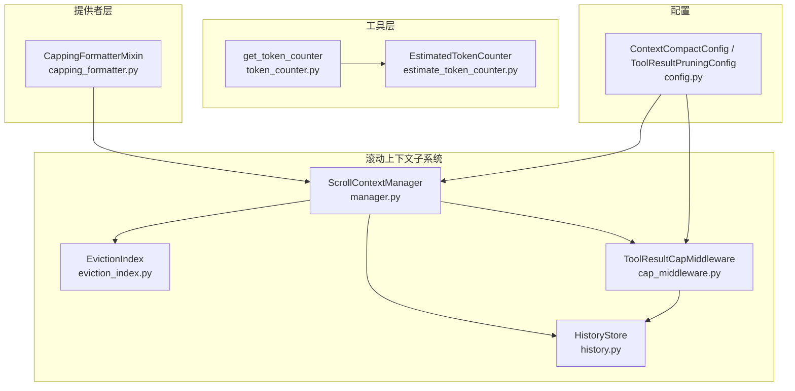
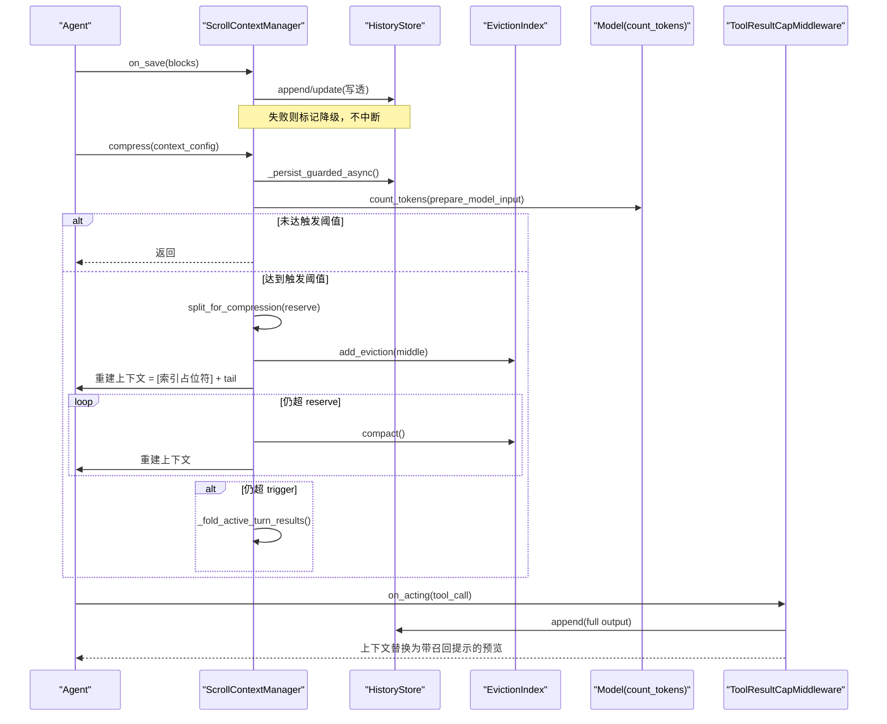
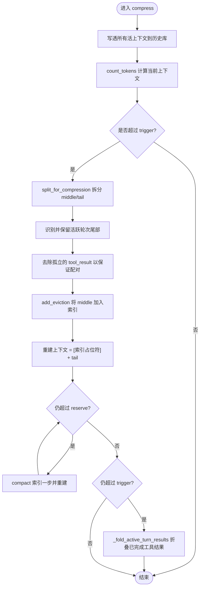
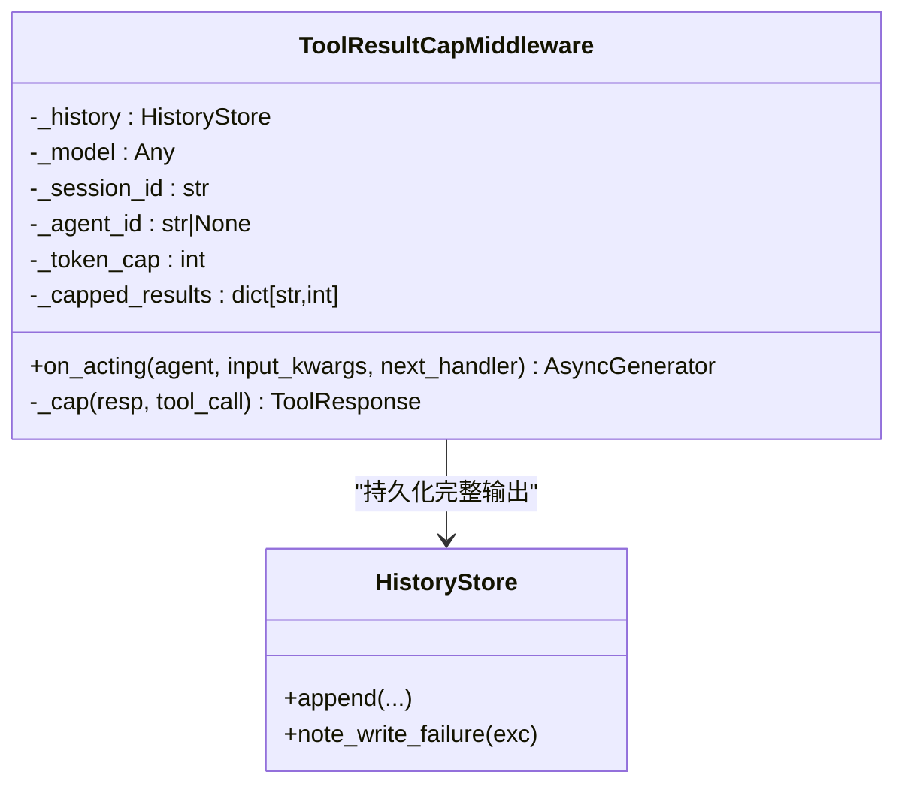
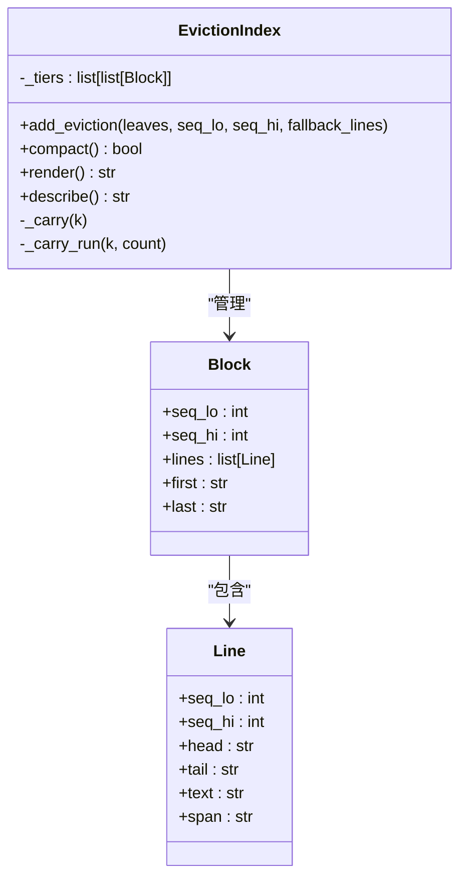
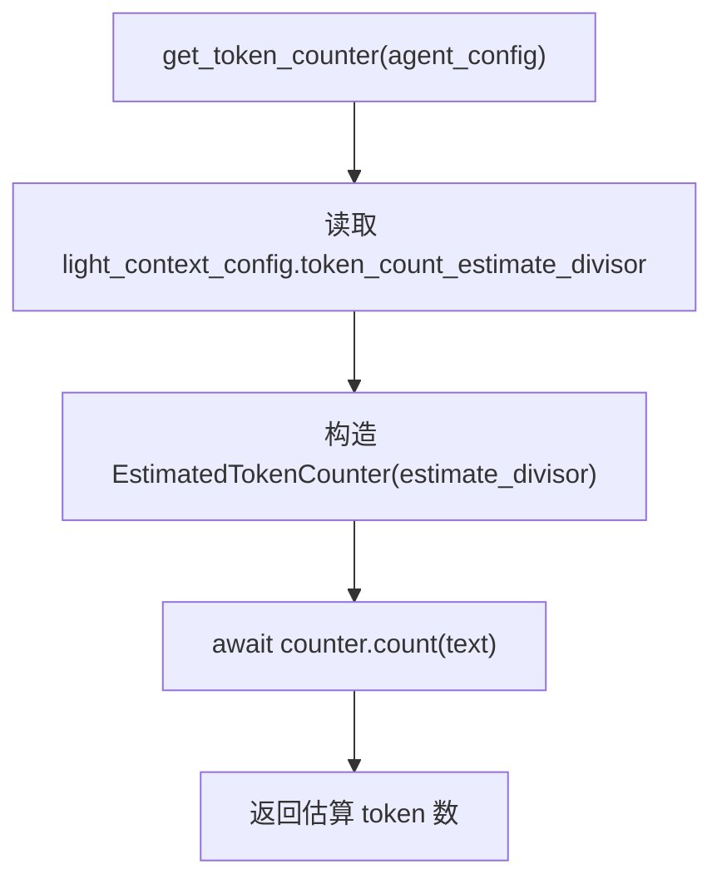
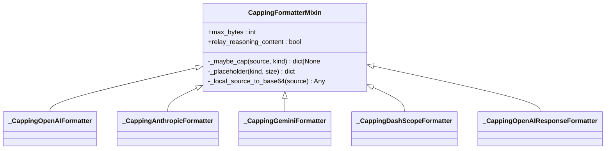
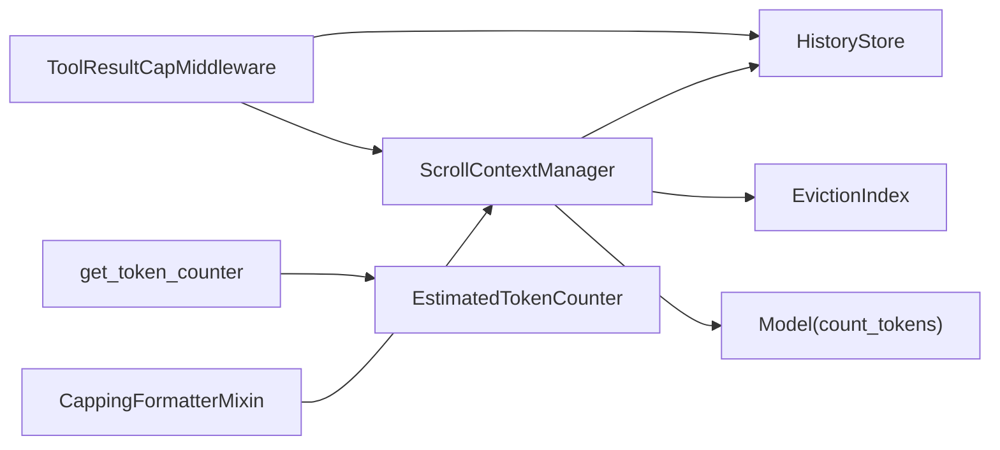

# 上下文压缩策略

<cite>
**本文引用的文件**
- [cap_middleware.py](file://src/qwenpaw/agents/context/scroll/cap_middleware.py)
- [eviction_index.py](file://src/qwenpaw/agents/context/scroll/eviction_index.py)
- [history.py](file://src/qwenpaw/agents/context/scroll/history.py)
- [manager.py](file://src/qwenpaw/agents/context/scroll/manager.py)
- [token_counter.py](file://src/qwenpaw/agents/utils/token_counter.py)
- [estimate_token_counter.py](file://src/qwenpaw/agents/utils/estimate_token_counter.py)
- [capping_formatter.py](file://src/qwenpaw/providers/capping_formatter.py)
- [config.py](file://src/qwenpaw/config/config.py)
</cite>

## 目录
1. [引言](#引言)
2. [项目结构](#项目结构)
3. [核心组件](#核心组件)
4. [架构总览](#架构总览)
5. [详细组件分析](#详细组件分析)
6. [依赖关系分析](#依赖关系分析)
7. [性能考量](#性能考量)
8. [故障排查指南](#故障排查指南)
9. [结论](#结论)
10. [附录：配置与最佳实践](#附录配置与最佳实践)

## 引言
本文件系统性阐述 QwenPaw 的“上下文压缩策略”，围绕以下目标展开：
- 解释上下文窗口限制的处理机制，包括消息裁剪、重要性评估与保留策略。
- 记录 CapMiddleware（工具结果上限中间件）的实现原理：请求拦截、内容分析与动态调整。
- 详解驱逐索引（Eviction Index）的工作机制：优先级计算、淘汰策略与性能监控。
- 说明 Token 计数器的精确计算方法：不同模型适配与估算算法。
- 给出具体配置参数说明，展示如何根据模型限制调整压缩策略。
- 解释与 Prompt 构建器的集成：上下文注入与格式化输出。
- 处理边界情况、异常处理与性能优化，并提供针对不同场景的最佳实践建议。

## 项目结构
上下文压缩相关代码集中在 agents/context/scroll 子模块中，配合 providers 层的媒体内联裁剪与 utils 层的 Token 估算器，形成从“持久化历史 → 上下文重建 → 驱逐索引 → 工具结果裁剪”的完整链路。

图示来源
- [manager.py:1-120](file://src/qwenpaw/agents/context/scroll/manager.py#L1-L120)
- [history.py:1-120](file://src/qwenpaw/agents/context/scroll/history.py#L1-L120)
- [eviction_index.py:1-120](file://src/qwenpaw/agents/context/scroll/eviction_index.py#L1-L120)
- [cap_middleware.py:1-60](file://src/qwenpaw/agents/context/scroll/cap_middleware.py#L1-L60)
- [capping_formatter.py:1-120](file://src/qwenpaw/providers/capping_formatter.py#L1-L120)
- [token_counter.py:1-27](file://src/qwenpaw/agents/utils/token_counter.py#L1-L27)
- [estimate_token_counter.py:1-41](file://src/qwenpaw/agents/utils/estimate_token_counter.py#L1-L41)
- [config.py:729-800](file://src/qwenpaw/config/config.py#L729-L800)

章节来源
- [manager.py:1-120](file://src/qwenpaw/agents/context/scroll/manager.py#L1-L120)
- [history.py:1-120](file://src/qwenpaw/agents/context/scroll/history.py#L1-L120)
- [eviction_index.py:1-120](file://src/qwenpaw/agents/context/scroll/eviction_index.py#L1-L120)
- [cap_middleware.py:1-60](file://src/qwenpaw/agents/context/scroll/cap_middleware.py#L1-L60)
- [capping_formatter.py:1-120](file://src/qwenpaw/providers/capping_formatter.py#L1-L120)
- [token_counter.py:1-27](file://src/qwenpaw/agents/utils/token_counter.py#L1-L27)
- [estimate_token_counter.py:1-41](file://src/qwenpaw/agents/utils/estimate_token_counter.py#L1-L41)
- [config.py:729-800](file://src/qwenpaw/config/config.py#L729-L800)

## 核心组件
- ScrollContextManager：负责写透持久化、触发压缩、拆分上下文、重建上下文、驱逐索引维护与最后手段折叠。
- HistoryStore：基于 SQLite 的对话历史持久化存储，提供追加、更新、检索、清理、FTS 全文索引等能力。
- EvictionIndex：在上下文中以单一占位符呈现的“驱逐索引”，采用多级分层与“进位”压缩，支持按 seq 跨度召回。
- ToolResultCapMiddleware：在工具执行后对超大结果进行“写透 + 上下文预览替换”的中间件。
- CappingFormatterMixin：针对各 Provider 的聊天格式化器，对本地大媒体进行内联字节上限裁剪。
- Token 计数器：通过 get_token_counter 获取 EstimatedTokenCounter，用于轻量估算；实际精确计数由模型侧 count_tokens 完成。
- 配置项：ContextCompactConfig 与 ToolResultPruningConfig 控制压缩阈值、保留比例与工具结果裁剪策略。

章节来源
- [manager.py:113-200](file://src/qwenpaw/agents/context/scroll/manager.py#L113-L200)
- [history.py:54-120](file://src/qwenpaw/agents/context/scroll/history.py#L54-L120)
- [eviction_index.py:130-200](file://src/qwenpaw/agents/context/scroll/eviction_index.py#L130-L200)
- [cap_middleware.py:20-70](file://src/qwenpaw/agents/context/scroll/cap_middleware.py#L20-L70)
- [capping_formatter.py:78-125](file://src/qwenpaw/providers/capping_formatter.py#L78-L125)
- [token_counter.py:12-27](file://src/qwenpaw/agents/utils/token_counter.py#L12-L27)
- [estimate_token_counter.py:8-41](file://src/qwenpaw/agents/utils/estimate_token_counter.py#L8-L41)
- [config.py:729-800](file://src/qwenpaw/config/config.py#L729-L800)

## 架构总览
整体流程分为两条主线：
- 正常路径：on_save 写透 → compress 触发 → 拆分上下文 → 将中间段加入驱逐索引 → 重建上下文为“索引占位符 + 尾部”。
- 压力路径：当重建后仍超过 reserve/trigger 时，先 compact 索引，再折叠活跃轮次中的已完成工具结果。

图示来源
- [manager.py:256-392](file://src/qwenpaw/agents/context/scroll/manager.py#L256-L392)
- [history.py:235-356](file://src/qwenpaw/agents/context/scroll/history.py#L235-L356)
- [eviction_index.py:144-224](file://src/qwenpaw/agents/context/scroll/eviction_index.py#L144-L224)
- [cap_middleware.py:52-119](file://src/qwenpaw/agents/context/scroll/cap_middleware.py#L52-L119)

## 详细组件分析

### 消息裁剪算法、重要性评估与保留策略
- 触发条件：使用模型侧 count_tokens 计算当前上下文 token 数，比较 trigger = context_size × trigger_ratio。
- 拆分策略：split_for_compression 保证消息配对安全，保留最近尾部（含活跃轮次），将中间段作为可驱逐部分。
- 重要性评估：
  - 显式摘要：若模型在 turn 中产出 headline，将其作为 Leaf 加入索引。
  - 隐式摘要：可选地对无 headline 的跨度调用模型生成标题行（受超时与错误保护）。
- 保留策略：
  - 始终保留最近真实用户请求及其后续未完成助手回复，避免误把活跃任务当作旧请求回答。
  - 对边界处可能出现的孤立 tool_result 做配对清洗，防止 API 报错。

图示来源
- [manager.py:256-392](file://src/qwenpaw/agents/context/scroll/manager.py#L256-L392)
- [manager.py:509-553](file://src/qwenpaw/agents/context/scroll/manager.py#L509-L553)
- [manager.py:633-642](file://src/qwenpaw/agents/context/scroll/manager.py#L633-L642)

章节来源
- [manager.py:256-392](file://src/qwenpaw/agents/context/scroll/manager.py#L256-L392)
- [manager.py:509-553](file://src/qwenpaw/agents/context/scroll/manager.py#L509-L553)
- [manager.py:633-642](file://src/qwenpaw/agents/context/scroll/manager.py#L633-L642)

### CapMiddleware（工具结果上限中间件）实现原理
- 拦截点：on_acting 钩子在工具返回最终 ToolResponse 后介入。
- 内容分析：flatten_output 提取文本，调用 model.count_tokens 估算其 token 数。
- 动态调整：
  - 若不超过 token_cap，直接放行。
  - 若超过：将完整输出持久化到 HistoryStore，并在上下文中替换为“前缀预览 + 召回提示”的 stub，同时记录 capped_results 以避免重复持久化。
- 容错：持久化失败时记录降级状态，放弃截断，确保数据不丢失。

图示来源
- [cap_middleware.py:20-119](file://src/qwenpaw/agents/context/scroll/cap_middleware.py#L20-L119)
- [history.py:235-356](file://src/qwenpaw/agents/context/scroll/history.py#L235-L356)

章节来源
- [cap_middleware.py:20-119](file://src/qwenpaw/agents/context/scroll/cap_middleware.py#L20-L119)
- [history.py:235-356](file://src/qwenpaw/agents/context/scroll/history.py#L235-L356)

### 驱逐索引（Eviction Index）工作机制
- 数据结构：多层级（Tier）块（Block）列表，每层最多固定数量的块（_TIER_CAP）。
- 新增驱逐：add_eviction 在 Tier 0 新增一个 Block，随后触发 carry 向上进位。
- 进位策略：当某层满额时，保留最新块，将其余块折叠成一行（Line）上移一层，递归进位。
- 压力压缩：compact 主动提前进位，直到索引能收缩至单块或满足上下文预算。
- 渲染：render 输出单一占位符，包含层级地图与“当前活轮次”分隔横幅，确保模型正确区分归档与请求。

图示来源
- [eviction_index.py:130-224](file://src/qwenpaw/agents/context/scroll/eviction_index.py#L130-L224)
- [eviction_index.py:274-331](file://src/qwenpaw/agents/context/scroll/eviction_index.py#L274-L331)

章节来源
- [eviction_index.py:130-224](file://src/qwenpaw/agents/context/scroll/eviction_index.py#L130-L224)
- [eviction_index.py:274-331](file://src/qwenpaw/agents/context/scroll/eviction_index.py#L274-L331)

### Token 计数器的精确计算方法与估算
- 精确计数：由模型侧 count_tokens 完成，用于触发判断与重建后的实时统计。
- 估算器：EstimatedTokenCounter 基于字符长度与除数估计，适用于轻量场景；通过 get_token_counter 按 agent 配置注入 estimate_divisor。
- 适用性：估算器适合快速预估；关键路径（如触发阈值）应使用模型侧精确计数。

图示来源
- [token_counter.py:12-27](file://src/qwenpaw/agents/utils/token_counter.py#L12-L27)
- [estimate_token_counter.py:8-41](file://src/qwenpaw/agents/utils/estimate_token_counter.py#L8-L41)

章节来源
- [token_counter.py:12-27](file://src/qwenpaw/agents/utils/token_counter.py#L12-L27)
- [estimate_token_counter.py:8-41](file://src/qwenpaw/agents/utils/estimate_token_counter.py#L8-L41)

### 与 Provider 的媒体内联裁剪集成
- 目的：避免本地大媒体被 base64 内联导致请求体膨胀，引发连接断开。
- 机制：在各 Provider 的 ChatFormatter 子类中覆盖媒体源格式化方法，先检查大小，超过 max_bytes 则替换为文本占位符。
- 影响范围：仅影响临时格式化输出，不影响持久化历史与 UI 渲染。

图示来源
- [capping_formatter.py:78-125](file://src/qwenpaw/providers/capping_formatter.py#L78-L125)
- [capping_formatter.py:145-255](file://src/qwenpaw/providers/capping_formatter.py#L145-L255)

章节来源
- [capping_formatter.py:78-125](file://src/qwenpaw/providers/capping_formatter.py#L78-L125)
- [capping_formatter.py:145-255](file://src/qwenpaw/providers/capping_formatter.py#L145-L255)

### 与 Prompt 构建器的集成（上下文注入与格式化输出）
- 上下文注入：compress 完成后，将上下文替换为“索引占位符 + 尾部消息”，占位符由 EvictionIndex.render 生成，包含结构化地图与“当前活轮次”分隔横幅。
- 格式化输出：Provider 层通过 CappingFormatterMixin 对媒体进行内联裁剪，确保请求体可控。
- 召回指引：索引与工具结果 stub 均包含 recall_history 调用提示，便于模型按需扩展。

章节来源
- [manager.py:633-642](file://src/qwenpaw/agents/context/scroll/manager.py#L633-L642)
- [eviction_index.py:274-331](file://src/qwenpaw/agents/context/scroll/eviction_index.py#L274-L331)
- [capping_formatter.py:78-125](file://src/qwenpaw/providers/capping_formatter.py#L78-L125)

## 依赖关系分析
- ScrollContextManager 依赖 HistoryStore 进行持久化，依赖 EvictionIndex 维护索引，依赖模型 count_tokens 进行触发判断。
- ToolResultCapMiddleware 依赖 HistoryStore 持久化完整输出，并通过 capped_results 与 Manager 协作避免重复写入。
- Provider 层 Formatter 独立于上下文子系统，但共同服务于“请求体可控”的目标。
- Token 估算器通过配置注入，供轻量估算场景使用。

图示来源
- [manager.py:113-200](file://src/qwenpaw/agents/context/scroll/manager.py#L113-L200)
- [cap_middleware.py:20-70](file://src/qwenpaw/agents/context/scroll/cap_middleware.py#L20-L70)
- [capping_formatter.py:78-125](file://src/qwenpaw/providers/capping_formatter.py#L78-L125)
- [token_counter.py:12-27](file://src/qwenpaw/agents/utils/token_counter.py#L12-L27)

章节来源
- [manager.py:113-200](file://src/qwenpaw/agents/context/scroll/manager.py#L113-L200)
- [cap_middleware.py:20-70](file://src/qwenpaw/agents/context/scroll/cap_middleware.py#L20-L70)
- [capping_formatter.py:78-125](file://src/qwenpaw/providers/capping_formatter.py#L78-L125)
- [token_counter.py:12-27](file://src/qwenpaw/agents/utils/token_counter.py#L12-L27)

## 性能考量
- 写透路径：on_save 同步写 SQLite，compress 异步线程写全窗口，避免阻塞事件循环。
- 索引进位：仅在必要时触发，compact 逐步推进，保证终止性。
- 媒体内联裁剪：减少请求体体积，降低网络失败概率。
- FTS 全文索引：可用时加速搜索，不可用时回退 LIKE 扫描，不影响核心功能。

## 故障排查指南
- 写透失败：HistoryStore.note_write_failure 会标记 degraded，日志记录首次失败并计数后续失败；此时不应驱逐中间段，以免指针失效。
- 数据库损坏：自动隔离损坏文件并重建新库，保持服务可用。
- 索引渲染异常：确认 EvictionIndex.render 输出的分隔横幅未被篡改，确保模型正确识别“当前活轮次”。
- 工具结果未持久化：检查 ToolResultCapMiddleware 的 capped_results 映射与 dedup_key 一致性。

章节来源
- [history.py:479-506](file://src/qwenpaw/agents/context/scroll/history.py#L479-L506)
- [history.py:113-139](file://src/qwenpaw/agents/context/scroll/history.py#L113-L139)
- [eviction_index.py:274-331](file://src/qwenpaw/agents/context/scroll/eviction_index.py#L274-L331)
- [cap_middleware.py:52-119](file://src/qwenpaw/agents/context/scroll/cap_middleware.py#L52-L119)

## 结论
QwenPaw 的上下文压缩策略通过“写透持久化 + 驱逐索引 + 工具结果上限中间件 + Provider 媒体裁剪”的组合，在保证数据不丢失的前提下，有效应对长会话的上下文窗口限制。其设计强调：
- 可召回：所有被驱逐内容均可通过 seq 或 tool_call_id 召回。
- 可观测：提供 describe_index 与 last_compress 统计，便于运维观察。
- 可扩展：配置项允许按模型限制与业务需求调优触发阈值与保留比例。

## 附录：配置与最佳实践

### 关键配置参数
- ContextCompactConfig
  - enabled：是否启用自动上下文压缩。
  - compact_threshold_ratio：触发压缩的比例（相对于模型最大输入长度）。
  - reserve_threshold_ratio：压缩后保留的最近上下文比例。
- ToolResultPruningConfig
  - enabled：是否启用工具结果裁剪。
  - pruning_recent_n：考虑最近 N 条消息进行裁剪。
  - pruning_old_msg_max_bytes / pruning_recent_msg_max_bytes：旧/新消息的字节阈值。
  - offload_retention_days：工具结果文件的保留天数。
  - tool_results_cache：工具结果缓存目录名。

章节来源
- [config.py:729-800](file://src/qwenpaw/config/config.py#L729-L800)

### 针对不同场景的最佳实践
- 长对话多轮工具链：
  - 提高 compact_threshold_ratio 以降低频繁压缩开销，适当增大 reserve_threshold_ratio 以保持连贯性。
  - 开启 ToolResultPruningConfig 的裁剪，避免工具结果膨胀。
- 单次长请求（如定时任务）：
  - 关注 fold 阶段，确保已完成工具结果被折叠为召回 stub，减少活跃轮次的 token 占用。
- 媒体密集型任务：
  - 调整 CappingFormatterMixin.max_bytes，平衡质量与请求体大小。
- 资源受限环境：
  - 关闭 FTS 仍可工作，但搜索性能下降；可通过 purge/vacuum 定期清理历史。