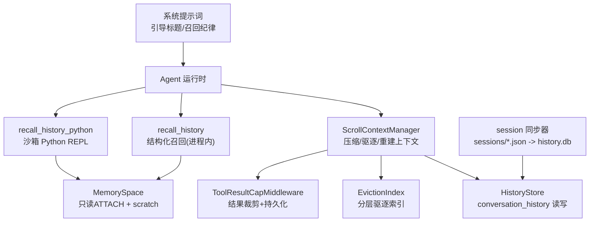
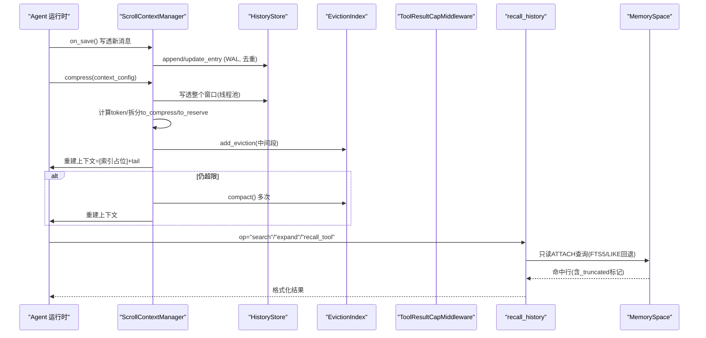
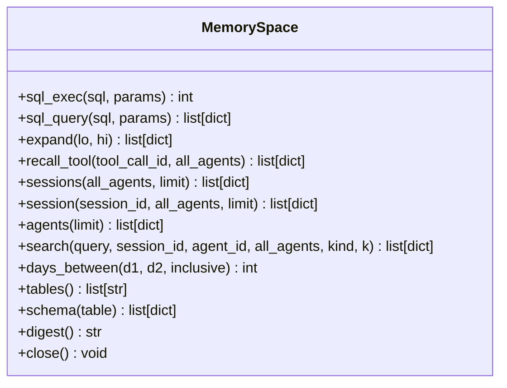
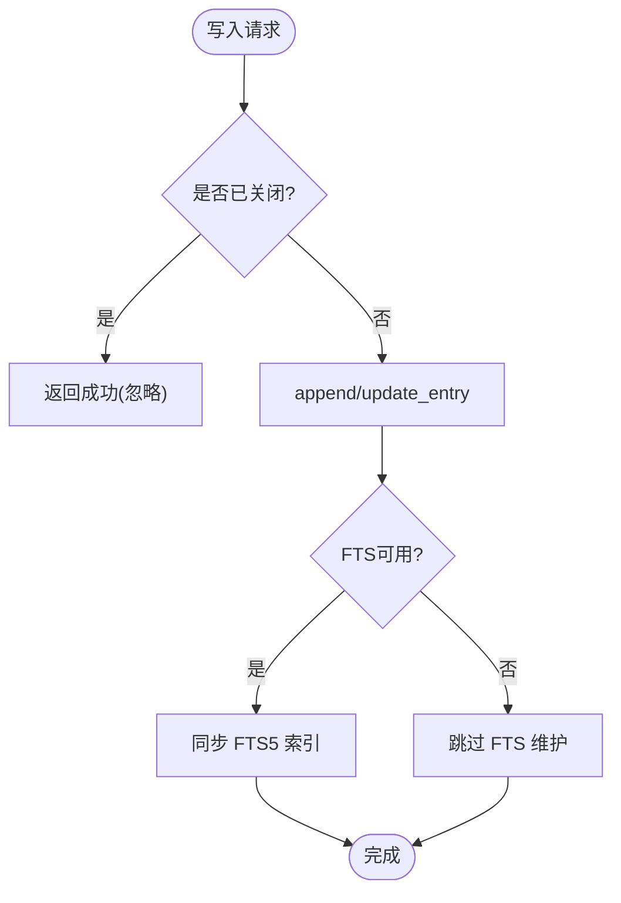
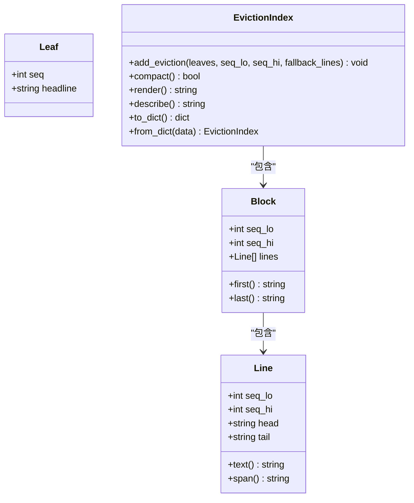
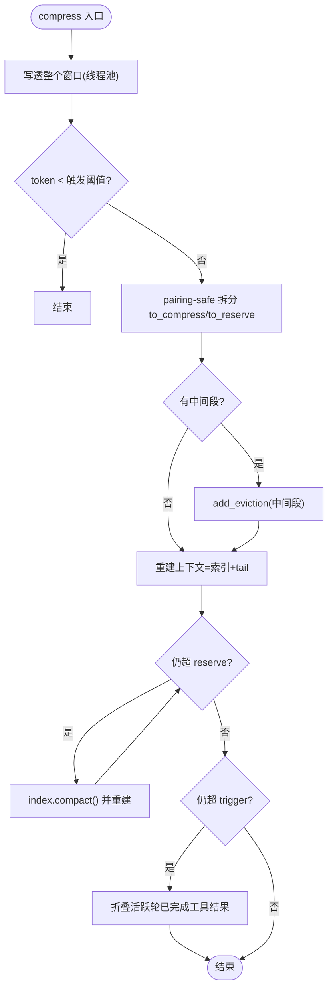
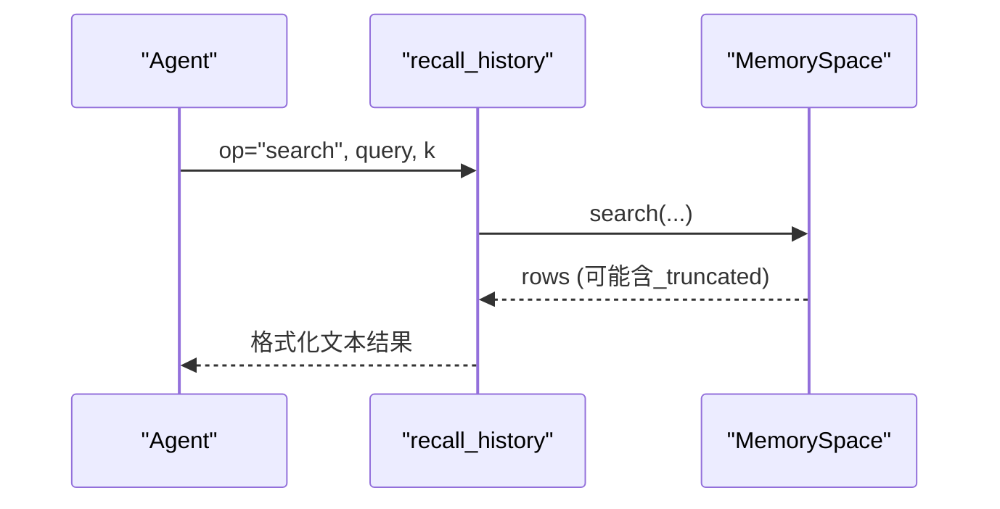
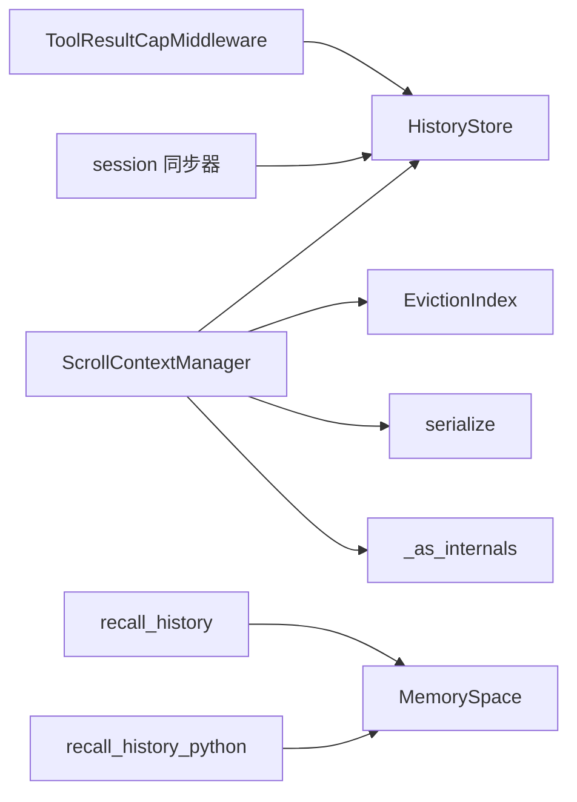

# 短期记忆管理

<cite>
**本文引用的文件**   
- [memoryspace.py](file://src/qwenpaw/agents/context/scroll/memoryspace.py)
- [history.py](file://src/qwenpaw/agents/context/scroll/history.py)
- [eviction_index.py](file://src/qwenpaw/agents/context/scroll/eviction_index.py)
- [manager.py](file://src/qwenpaw/agents/context/scroll/manager.py)
- [recall_tool.py](file://src/qwenpaw/agents/context/scroll/recall_tool.py)
- [repl.py](file://src/qwenpaw/agents/context/scroll/repl.py)
- [cap_middleware.py](file://src/qwenpaw/agents/context/scroll/cap_middleware.py)
- [sync.py](file://src/qwenpaw/agents/context/scroll/sync.py)
- [_as_internals.py](file://src/qwenpaw/agents/context/scroll/_as_internals.py)
- [prompt.py](file://src/qwenpaw/agents/context/scroll/prompt.py)
- [serialize.py](file://src/qwenpaw/agents/context/scroll/serialize.py)
</cite>

## 目录
1. [简介](#简介)
2. [项目结构](#项目结构)
3. [核心组件](#核心组件)
4. [架构总览](#架构总览)
5. [详细组件分析](#详细组件分析)
6. [依赖关系分析](#依赖关系分析)
7. [性能考量](#性能考量)
8. [故障排除指南](#故障排除指南)
9. [结论](#结论)
10. [附录：配置与管理示例](#附录配置与管理示例)

## 简介
本文件系统性阐述 QwenPaw 的“基于 Scroll Context 的短期记忆管理系统”。该方案以“可持久化的对话历史 + 上下文压缩索引 + 结构化召回工具”为核心，实现：
- 消息窗口管理与自动清理（按 token 阈值与保留天数）
- 上下文压缩策略（驱逐中间段、分层索引、压力折叠）
- 内存空间分配（模型侧只读 ATTACH + 进程内 scratch DB）
- 历史消息生命周期管理（写入、去重、更新、检索、清理）
- 与 Agent 运行时的集成（消息传递、状态同步、工具调用）

## 项目结构
Scroll 短期记忆由一组协作模块组成，围绕“写透持久化 → 压缩驱逐 → 索引重建 → 按需召回”的闭环展开。

图表来源
- [manager.py:113-392](file://src/qwenpaw/agents/context/scroll/manager.py#L113-L392)
- [history.py:54-232](file://src/qwenpaw/agents/context/scroll/history.py#L54-L232)
- [eviction_index.py:130-331](file://src/qwenpaw/agents/context/scroll/eviction_index.py#L130-L331)
- [cap_middleware.py:20-119](file://src/qwenpaw/agents/context/scroll/cap_middleware.py#L20-L119)
- [recall_tool.py:102-253](file://src/qwenpaw/agents/context/scroll/recall_tool.py#L102-L253)
- [repl.py:118-253](file://src/qwenpaw/agents/context/scroll/repl.py#L118-L253)
- [memoryspace.py:126-648](file://src/qwenpaw/agents/context/scroll/memoryspace.py#L126-L648)
- [sync.py:343-441](file://src/qwenpaw/agents/context/scroll/sync.py#L343-L441)
- [prompt.py:15-122](file://src/qwenpaw/agents/context/scroll/prompt.py#L15-L122)

章节来源
- [manager.py:113-392](file://src/qwenpaw/agents/context/scroll/manager.py#L113-L392)
- [history.py:54-232](file://src/qwenpaw/agents/context/scroll/history.py#L54-L232)
- [eviction_index.py:130-331](file://src/qwenpaw/agents/context/scroll/eviction_index.py#L130-L331)
- [cap_middleware.py:20-119](file://src/qwenpaw/agents/context/scroll/cap_middleware.py#L20-L119)
- [recall_tool.py:102-253](file://src/qwenpaw/agents/context/scroll/recall_tool.py#L102-L253)
- [repl.py:118-253](file://src/qwenpaw/agents/context/scroll/repl.py#L118-L253)
- [memoryspace.py:126-648](file://src/qwenpaw/agents/context/scroll/memoryspace.py#L126-L648)
- [sync.py:343-441](file://src/qwenpaw/agents/context/scroll/sync.py#L343-L441)
- [prompt.py:15-122](file://src/qwenpaw/agents/context/scroll/prompt.py#L15-L122)

## 核心组件
- HistoryStore：会话历史的持久化层，负责写入、更新、FTS5 索引维护、删除与 VACUUM，提供并发安全与损坏恢复。
- MemorySpace：模型侧的只读工作区，ATTACH 历史库为只读，并提供 expand/search/recall_tool/sessions/session/agents 等意图型接口。
- EvictionIndex：在上下文中呈现的分层驱逐索引，支持 add_eviction、compact 与渲染。
- ScrollContextManager：编排 on_save 写透、compress 触发驱逐与索引重建、活跃轮保护、结果折叠等。
- ToolResultCapMiddleware：对超大工具结果进行裁剪并持久化全文，避免上下文膨胀。
- recall_history / recall_history_python：两类召回入口，前者参数化无沙箱，后者为高级 Python REPL。
- session 同步器：将旧格式 sessions/*.json 导入 history.db，幂等且带清单缓存。
- 序列化与提示词：msg_to_entries 将 Msg 转为行；系统提示词指导模型生成标题与遵循召回纪律。

章节来源
- [history.py:54-232](file://src/qwenpaw/agents/context/scroll/history.py#L54-L232)
- [memoryspace.py:126-648](file://src/qwenpaw/agents/context/scroll/memoryspace.py#L126-L648)
- [eviction_index.py:130-331](file://src/qwenpaw/agents/context/scroll/eviction_index.py#L130-L331)
- [manager.py:113-392](file://src/qwenpaw/agents/context/scroll/manager.py#L113-L392)
- [cap_middleware.py:20-119](file://src/qwenpaw/agents/context/scroll/cap_middleware.py#L20-L119)
- [recall_tool.py:102-253](file://src/qwenpaw/agents/context/scroll/recall_tool.py#L102-L253)
- [repl.py:118-253](file://src/qwenpaw/agents/context/scroll/repl.py#L118-L253)
- [sync.py:343-441](file://src/qwenpaw/agents/context/scroll/sync.py#L343-L441)
- [serialize.py:138-218](file://src/qwenpaw/agents/context/scroll/serialize.py#L138-L218)
- [prompt.py:15-122](file://src/qwenpaw/agents/context/scroll/prompt.py#L15-L122)

## 架构总览
下图展示一次典型“压缩-驱逐-重建-召回”流程，以及各组件间的交互。

图表来源
- [manager.py:256-392](file://src/qwenpaw/agents/context/scroll/manager.py#L256-L392)
- [history.py:235-356](file://src/qwenpaw/agents/context/scroll/history.py#L235-L356)
- [eviction_index.py:144-223](file://src/qwenpaw/agents/context/scroll/eviction_index.py#L144-L223)
- [recall_tool.py:128-194](file://src/qwenpaw/agents/context/scroll/recall_tool.py#L128-L194)
- [memoryspace.py:435-565](file://src/qwenpaw/agents/context/scroll/memoryspace.py#L435-L565)

## 详细组件分析

### MemorySpace 类：模型侧只读工作区
- 设计要点
  - 通过 ATTACH 将历史库以只读模式挂载为 hist，自身 main 为内存或文件-backed scratch。
  - 使用 SQLite authorizer 禁止 ATTACH/DETACH 以及对 hist 的写操作，防止逃逸。
  - 所有 SELECT 返回行数受 row_cap 限制，溢出时追加 _truncated 标记。
  - 主动轮次地板（active turn floor）缓存，避免重复扫描 MAX(seq)。
- 关键能力
  - expand(lo, hi)：按 seq 区间还原完整轮次。
  - search(query, k, kind, scope)：FTS5 优先，无 FTS5 或空查询回退 LIKE。
  - recall_tool(tool_call_id)：按 tool_call_id 重读调用与结果。
  - sessions()/session()/agents()：会话与代理发现。
  - sql_query/sql_exec：高级 SQL 读取/scratch 写入。
- 复杂度与优化
  - search 使用 FTS5 bm25 排序，O(log N) 级别匹配；LIKE 回退为线性扫描。
  - active_turn_floor 每实例仅计算一次，减少大历史下的重复开销。
  - row_cap 控制最大返回行数，避免上下文爆炸。

图表来源
- [memoryspace.py:126-648](file://src/qwenpaw/agents/context/scroll/memoryspace.py#L126-L648)

章节来源
- [memoryspace.py:98-124](file://src/qwenpaw/agents/context/scroll/memoryspace.py#L98-L124)
- [memoryspace.py:230-341](file://src/qwenpaw/agents/context/scroll/memoryspace.py#L230-L341)
- [memoryspace.py:435-565](file://src/qwenpaw/agents/context/scroll/memoryspace.py#L435-L565)
- [memoryspace.py:586-648](file://src/qwenpaw/agents/context/scroll/memoryspace.py#L586-L648)

### HistoryStore：持久化与索引
- 写入路径
  - append：插入一行，若存在相同 dedup_key 则冲突不重复插入，返回已有 seq。
  - update_entry：原地刷新已写入行（内容、headline、blocks、tool_*），保持 FTS5 同步。
- 索引
  - 使用 FTS5 content 外部表，porter unicode61 分词；缺失 FTS5 时降级为 LIKE。
- 清理与空间
  - purge(before, kinds)：按 created_at 删除，并同步删除 FTS5 条目。
  - vacuum：重写数据库以回收磁盘空间。
- 健壮性
  - WAL 模式、busy_timeout、quick_check、损坏隔离与重建。
  - 并发安全：单连接 + 锁，跨线程访问。

图表来源
- [history.py:235-356](file://src/qwenpaw/agents/context/scroll/history.py#L235-L356)
- [history.py:190-232](file://src/qwenpaw/agents/context/scroll/history.py#L190-L232)
- [history.py:417-478](file://src/qwenpaw/agents/context/scroll/history.py#L417-L478)

章节来源
- [history.py:54-232](file://src/qwenpaw/agents/context/scroll/history.py#L54-L232)
- [history.py:235-356](file://src/qwenpaw/agents/context/scroll/history.py#L235-L356)
- [history.py:389-478](file://src/qwenpaw/agents/context/scroll/history.py#L389-L478)

### EvictionIndex：分层驱逐索引
- 数据结构
  - Tier 0 最新驱逐块，越往上越旧；每个 Block 包含若干 Line（seq 跨度与首尾 headline）。
- 操作
  - add_eviction(leaves, seq_lo, seq_hi, fallback_lines)：新增一个 Tier 0 块，必要时向上进位。
  - compact()：在上下文压力下提前进位，直至满足容量。
- 渲染
  - render()：输出“归档地图”，末尾附带“当前活轮”分隔横幅，避免模型误答旧消息。

图表来源
- [eviction_index.py:56-127](file://src/qwenpaw/agents/context/scroll/eviction_index.py#L56-L127)
- [eviction_index.py:130-331](file://src/qwenpaw/agents/context/scroll/eviction_index.py#L130-L331)

章节来源
- [eviction_index.py:130-331](file://src/qwenpaw/agents/context/scroll/eviction_index.py#L130-L331)

### ScrollContextManager：压缩与驱逐编排
- 钩子
  - on_save：增量写透未持久化的消息块。
  - compress：触发阈值后，持久化→拆分→驱逐→重建→压力折叠。
- 活跃轮保护
  - 识别合成用户续写 stub，确保真实用户请求不被驱逐出活窗。
- 结果折叠
  - 当仍超过压缩阈值时，将已完成工具结果替换为“召回指针”，保留最新一条结果原文。
- 统计
  - last_compress 记录本轮驱逐/压缩/折叠数量，便于诊断。

图表来源
- [manager.py:256-392](file://src/qwenpaw/agents/context/scroll/manager.py#L256-L392)
- [manager.py:554-631](file://src/qwenpaw/agents/context/scroll/manager.py#L554-L631)

章节来源
- [manager.py:188-241](file://src/qwenpaw/agents/context/scroll/manager.py#L188-L241)
- [manager.py:256-392](file://src/qwenpaw/agents/context/scroll/manager.py#L256-L392)
- [manager.py:525-631](file://src/qwenpaw/agents/context/scroll/manager.py#L525-L631)

### 工具结果裁剪：ToolResultCapMiddleware
- 作用：检测最终 ToolResponse 的文本大小，超过 token_cap 时将全文持久化，并在上下文中保留预览与 recall 指针。
- 协同：与 Manager 共享 capped_results 映射，避免重复写入截断 stub。

章节来源
- [cap_middleware.py:20-119](file://src/qwenpaw/agents/context/scroll/cap_middleware.py#L20-L119)
- [manager.py:401-506](file://src/qwenpaw/agents/context/scroll/manager.py#L401-L506)

### 召回工具：recall_history 与 recall_history_python
- recall_history（进程内）
  - 三种操作：expand、search、recall_tool；参数化、无需沙箱。
  - 内部创建 MemorySpace 实例，执行只读查询，格式化输出。
- recall_history_python（沙箱）
  - 执行模型编写的 Python 代码，暴露 ms 对象（MemorySpace），支持自定义 SQL、聚合、跨会话分析。
  - 默认拒绝无沙箱执行，需显式授权。

图表来源
- [recall_tool.py:128-194](file://src/qwenpaw/agents/context/scroll/recall_tool.py#L128-L194)
- [memoryspace.py:435-565](file://src/qwenpaw/agents/context/scroll/memoryspace.py#L435-L565)

章节来源
- [recall_tool.py:102-253](file://src/qwenpaw/agents/context/scroll/recall_tool.py#L102-L253)
- [repl.py:118-253](file://src/qwenpaw/agents/context/scroll/repl.py#L118-L253)

### 会话同步：sessions/*.json → history.db
- 特性：非破坏、幂等、忠实（复用 msg_to_entries）、清单缓存（.synced.json）。
- 启动阶段：遍历 scroll 启用 agent 的 sessions 目录，导入并可选按 retention_days 过滤。

章节来源
- [sync.py:343-441](file://src/qwenpaw/agents/context/scroll/sync.py#L343-L441)
- [sync.py:477-586](file://src/qwenpaw/agents/context/scroll/sync.py#L477-L586)

### 序列化与系统提示词
- serialize.msg_to_entries：将 Msg 拆分为 model_turn/context_msg 与 tool_result 行，提取 headline、媒体引用、元数据标签。
- prompt：教导模型如何写标题、如何使用地图与 recall 工具、遵守“先回忆再回答”的纪律。

章节来源
- [serialize.py:138-218](file://src/qwenpaw/agents/context/scroll/serialize.py#L138-L218)
- [prompt.py:15-122](file://src/qwenpaw/agents/context/scroll/prompt.py#L15-L122)

## 依赖关系分析
- 耦合与内聚
  - manager 强依赖 history、eviction_index、serialize、_as_internals；对外暴露 on_save/compress。
  - memoryspace 独立于 qwenpaw 其余部分（标准库 sqlite3），适合沙箱环境。
  - recall 工具与 repl 分别面向“参数化只读”和“Python 任意查询”两种场景。
- 外部依赖
  - SQLite（WAL、FTS5 可选）、AgentScope 2.0 私有方法（通过适配器封装）。
- 潜在循环
  - 无直接循环依赖；管理器通过适配器间接访问 AgentScope 内部方法，降低版本变更风险。

图表来源
- [manager.py:113-186](file://src/qwenpaw/agents/context/scroll/manager.py#L113-L186)
- [_as_internals.py:21-36](file://src/qwenpaw/agents/context/scroll/_as_internals.py#L21-L36)
- [recall_tool.py:102-127](file://src/qwenpaw/agents/context/scroll/recall_tool.py#L102-L127)
- [repl.py:118-172](file://src/qwenpaw/agents/context/scroll/repl.py#L118-L172)
- [cap_middleware.py:20-51](file://src/qwenpaw/agents/context/scroll/cap_middleware.py#L20-L51)
- [sync.py:343-441](file://src/qwenpaw/agents/context/scroll/sync.py#L343-L441)

章节来源
- [_as_internals.py:21-36](file://src/qwenpaw/agents/context/scroll/_as_internals.py#L21-L36)
- [manager.py:113-186](file://src/qwenpaw/agents/context/scroll/manager.py#L113-L186)

## 性能考量
- 写入路径
  - WAL 模式与 busy_timeout 提升并发与稳定性；去重键避免重复写入。
  - FTS5 索引增量维护；缺失 FTS5 时降级为 LIKE，但功能不受影响。
- 查询路径
  - FTS5 bm25 排序优于 LIKE；active_turn_floor 缓存减少重复扫描。
  - row_cap 限制返回行数，避免上下文膨胀。
- 压缩路径
  - 写透在 worker 线程执行，避免阻塞事件循环；仅在需要时重建上下文。
  - 压力折叠作为最后手段，仅替换已完成工具结果，保留最新结果原文。
- 存储回收
  - purge 后需单独 VACUUM 以回收磁盘空间。

[本节为通用性能建议，不直接分析具体文件]

## 故障排除指南
- 历史库损坏
  - 现象：启动时报错或 quick_check 失败。
  - 处理：自动隔离损坏文件并重开新库；检查 quarantined_to 日志定位备份。
- 写入退化
  - 现象：degraded=True，write_failures>0。
  - 处理：检查磁盘/权限；确认 write-through 失败不影响聊天循环，但会失去“完全持久化”保证。
- 搜索退化
  - 现象：FTS5 不可用，search 回退 LIKE。
  - 处理：升级 SQLite 构建以启用 FTS5；临时使用单关键词搜索。
- 结果被截断
  - 现象：结果含 _truncated 标记或 TRUNCATED 提示。
  - 处理：缩小 span/k 或使用更精确的查询；查看完整结果需通过 recall 工具。
- 活跃轮误判
  - 现象：搜索结果包含当前正在进行的轮次。
  - 处理：确认 active_turn_floor 逻辑未被绕过；避免在 search 中匹配到合成续写 stub。

章节来源
- [history.py:113-139](file://src/qwenpaw/agents/context/scroll/history.py#L113-L139)
- [history.py:479-508](file://src/qwenpaw/agents/context/scroll/history.py#L479-L508)
- [memoryspace.py:511-584](file://src/qwenpaw/agents/context/scroll/memoryspace.py#L511-L584)
- [cap_middleware.py:71-119](file://src/qwenpaw/agents/context/scroll/cap_middleware.py#L71-L119)

## 结论
Scroll 短期记忆以“写透持久化 + 分层驱逐索引 + 结构化召回”为核心，兼顾可靠性与可扩展性。通过只读 ATTACH、authorizer 与 row_cap 保障安全与稳定；通过 FTS5 与 active_turn_floor 优化检索性能；通过压力折叠与结果裁剪应对极端长轮次。配合 session 同步与保留策略，形成完整的生命周期管理闭环。

[本节为总结性内容，不直接分析具体文件]

## 附录：配置与管理示例
以下示例用于演示如何配置和管理短期记忆的关键参数（以路径与字段名为主，不包含具体代码片段）：

- 启用 Scroll 策略
  - 在 agent 运行配置的 light_context_config.strategy 设置为 "scroll"。
  - 参考：[manager.py:113-186](file://src/qwenpaw/agents/context/scroll/manager.py#L113-L186)

- 历史数据库与保留策略
  - db_filename：指定 history.db 文件名。
  - history_retention_days：设置保留天数（0 表示永久保留）。
  - 参考：[sync.py:545-555](file://src/qwenpaw/agents/context/scroll/sync.py#L545-L555)

- 压缩阈值与预留比例
  - trigger_ratio：触发压缩的 token 阈值比例。
  - reserve_ratio：保留最近尾部消息的比例。
  - 参考：[manager.py:293-308](file://src/qwenpaw/agents/context/scroll/manager.py#L293-L308)

- 工具结果裁剪
  - token_cap：单个工具结果的最大 token 数，超出则裁剪并持久化全文。
  - 参考：[cap_middleware.py:31-51](file://src/qwenpaw/agents/context/scroll/cap_middleware.py#L31-L51)

- 召回工具
  - recall_history：op="expand"/"search"/"recall_tool"，支持 all_agents、kind、k 等参数。
  - recall_history_python：高级 Python REPL，需沙箱或显式允许。
  - 参考：[recall_tool.py:102-253](file://src/qwenpaw/agents/context/scroll/recall_tool.py#L102-L253)、[repl.py:118-253](file://src/qwenpaw/agents/context/scroll/repl.py#L118-L253)

- 系统提示词语言
  - 选择 zh/en 以适配不同语言的标题与召回纪律。
  - 参考：[prompt.py:109-122](file://src/qwenpaw/agents/context/scroll/prompt.py#L109-L122)