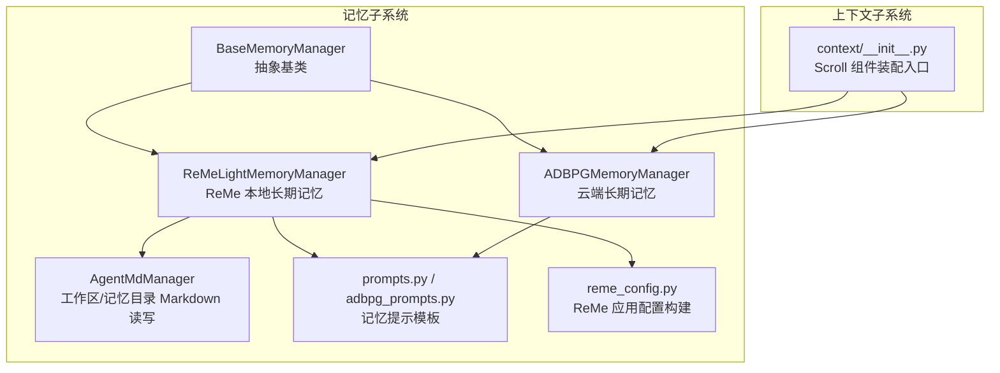
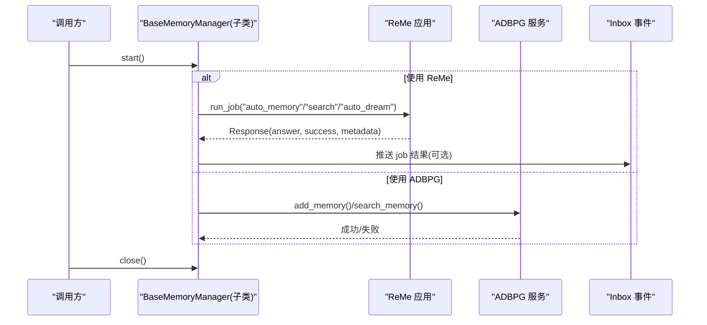
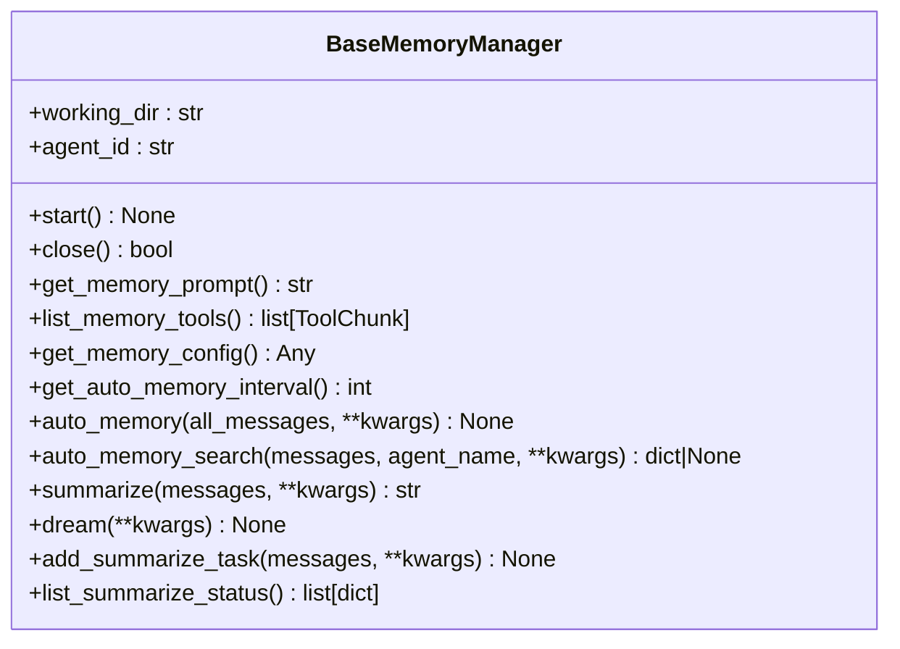
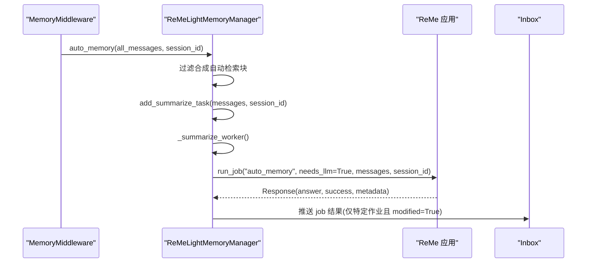
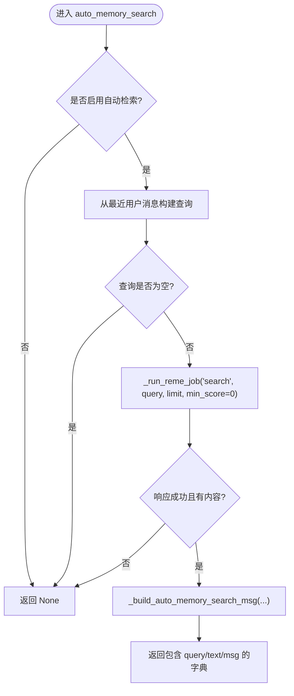
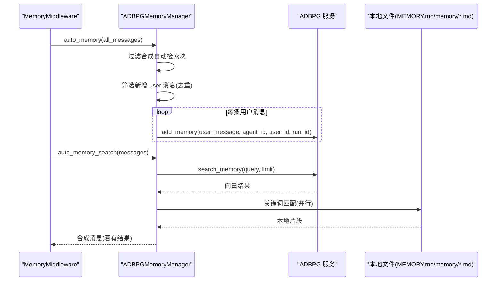
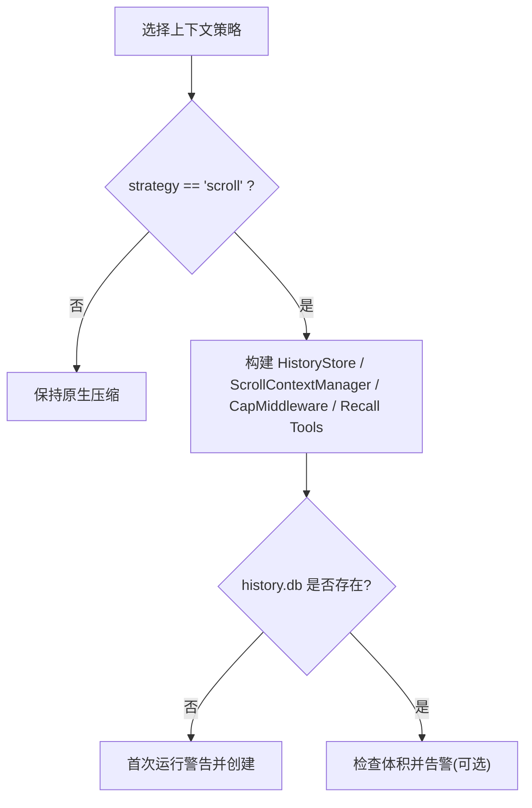
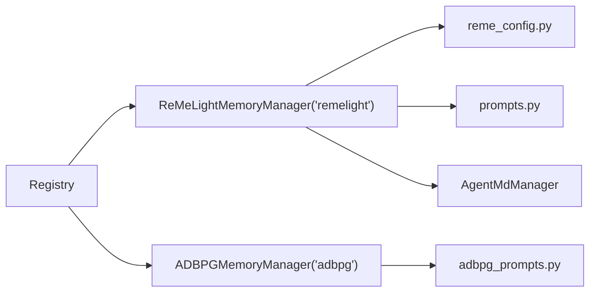

# 记忆与上下文管理

<cite>
**本文引用的文件**   
- [src/qwenpaw/agents/memory/__init__.py](file://src/qwenpaw/agents/memory/__init__.py)
- [src/qwenpaw/agents/memory/base_memory_manager.py](file://src/qwenpaw/agents/memory/base_memory_manager.py)
- [src/qwenpaw/agents/memory/reme_light_memory_manager.py](file://src/qwenpaw/agents/memory/reme_light_memory_manager.py)
- [src/qwenpaw/agents/memory/adbpg_memory_manager.py](file://src/qwenpaw/agents/memory/adbpg_memory_manager.py)
- [src/qwenpaw/agents/memory/agent_md_manager.py](file://src/qwenpaw/agents/memory/agent_md_manager.py)
- [src/qwenpaw/agents/memory/prompts.py](file://src/qwenpaw/agents/memory/prompts.py)
- [src/qwenpaw/agents/memory/adbpg_prompts.py](file://src/qwenpaw/agents/memory/adbpg_prompts.py)
- [src/qwenpaw/agents/memory/reme_config.py](file://src/qwenpaw/agents/memory/reme_config.py)
- [src/qwenpaw/agents/context/__init__.py](file://src/qwenpaw/agents/context/__init__.py)
</cite>

## 目录
1. [简介](#简介)
2. [项目结构](#项目结构)
3. [核心组件](#核心组件)
4. [架构总览](#架构总览)
5. [详细组件分析](#详细组件分析)
6. [依赖关系分析](#依赖关系分析)
7. [性能考量](#性能考量)
8. [故障排查指南](#故障排查指南)
9. [结论](#结论)
10. [附录](#附录)

## 简介
本文件系统性梳理 QwenPaw 的记忆与上下文管理体系，重点覆盖：
- 三层记忆架构：短期会话上下文、长期语义记忆（基于 ReMe v0.4.0）、云端长期记忆（ADBPG）
- 上下文压缩策略：原生压缩与 Scroll Context 机制
- 长期记忆实现：ReMe 本地文件索引 + ADBPG 向量检索
- 记忆优化技巧：自动摘要、自动梦境（dream）、主动检索、结果裁剪
- 具体实现细节、调用关系、接口、领域模型与使用模式
- 配置项、参数与返回值说明
- 与其他组件的关系及常见问题处理

## 项目结构
记忆与上下文相关代码主要分布在两个子模块：
- agents/memory：记忆后端抽象与具体实现（ReMe、ADBPG、Markdown 工具等）
- agents/context：上下文管理策略（默认原生压缩与可选的 Scroll Context）

图表来源
- [src/qwenpaw/agents/memory/base_memory_manager.py:33-116](file://src/qwenpaw/agents/memory/base_memory_manager.py#L33-L116)
- [src/qwenpaw/agents/memory/reme_light_memory_manager.py:101-214](file://src/qwenpaw/agents/memory/reme_light_memory_manager.py#L101-L214)
- [src/qwenpaw/agents/memory/adbpg_memory_manager.py:32-158](file://src/qwenpaw/agents/memory/adbpg_memory_manager.py#L32-L158)
- [src/qwenpaw/agents/memory/agent_md_manager.py:12-46](file://src/qwenpaw/agents/memory/agent_md_manager.py#L12-L46)
- [src/qwenpaw/agents/memory/prompts.py:47-57](file://src/qwenpaw/agents/memory/prompts.py#L47-L57)
- [src/qwenpaw/agents/memory/adbpg_prompts.py:5-36](file://src/qwenpaw/agents/memory/adbpg_prompts.py#L5-L36)
- [src/qwenpaw/agents/memory/reme_config.py:23-52](file://src/qwenpaw/agents/memory/reme_config.py#L23-L52)
- [src/qwenpaw/agents/context/__init__.py:124-155](file://src/qwenpaw/agents/context/__init__.py#L124-L155)

章节来源
- [src/qwenpaw/agents/memory/__init__.py:1-70](file://src/qwenpaw/agents/memory/__init__.py#L1-L70)
- [src/qwenpaw/agents/memory/base_memory_manager.py:33-116](file://src/qwenpaw/agents/memory/base_memory_manager.py#L33-L116)
- [src/qwenpaw/agents/context/__init__.py:124-155](file://src/qwenpaw/agents/context/__init__.py#L124-L155)

## 核心组件
- BaseMemoryManager：定义记忆后端统一生命周期与能力边界（启动/关闭、提示注入、工具暴露、自动摘要/梦境、自动检索、后台任务队列等）。
- ReMeLightMemoryManager：基于 ReMe v0.4.0 的本地长期语义记忆，提供搜索、自动记忆、自动梦境、索引重建、Inbox 事件回写等。
- ADBPGMemoryManager：基于 AnalyticDB for PostgreSQL 的云端长期记忆，提供用户消息持久化与混合检索（云端向量+本地关键词）。
- AgentMdManager：工作区与记忆目录的 Markdown 安全读写与列表工具，供上层或 ReMe 流程使用。
- prompts.py / adbpg_prompts.py：为不同后端生成面向模型的“记忆指导”系统提示。
- reme_config.py：将 QwenPaw 的配置映射为 ReMe Application 所需的组件与作业配置。
- context/__init__.py：上下文策略装配器，默认启用 Scroll Context（可回退到原生压缩）。

章节来源
- [src/qwenpaw/agents/memory/base_memory_manager.py:33-116](file://src/qwenpaw/agents/memory/base_memory_manager.py#L33-L116)
- [src/qwenpaw/agents/memory/reme_light_memory_manager.py:101-214](file://src/qwenpaw/agents/memory/reme_light_memory_manager.py#L101-L214)
- [src/qwenpaw/agents/memory/adbpg_memory_manager.py:32-158](file://src/qwenpaw/agents/memory/adbpg_memory_manager.py#L32-L158)
- [src/qwenpaw/agents/memory/agent_md_manager.py:12-46](file://src/qwenpaw/agents/memory/agent_md_manager.py#L12-L46)
- [src/qwenpaw/agents/memory/prompts.py:47-57](file://src/qwenpaw/agents/memory/prompts.py#L47-L57)
- [src/qwenpaw/agents/memory/adbpg_prompts.py:5-36](file://src/qwenpaw/agents/memory/adbpg_prompts.py#L5-L36)
- [src/qwenpaw/agents/memory/reme_config.py:23-52](file://src/qwenpaw/agents/memory/reme_config.py#L23-L52)
- [src/qwenpaw/agents/context/__init__.py:124-155](file://src/qwenpaw/agents/context/__init__.py#L124-L155)

## 架构总览
QwenPaw 采用“三层记忆 + 双上下文策略”的体系：
- 短期上下文：当前会话窗口内的消息序列，由 AgentScope 原生压缩或 Scroll Context 管理
- 长期语义记忆（本地）：ReMe 维护 daily/digest 文件与向量/BM25 索引，支持 hybrid search 与 auto-dream 整合
- 长期语义记忆（云端）：ADBPG 存储并服务端提取事实，客户端通过 memory_search 检索

图表来源
- [src/qwenpaw/agents/memory/reme_light_memory_manager.py:227-250](file://src/qwenpaw/agents/memory/reme_light_memory_manager.py#L227-L250)
- [src/qwenpaw/agents/memory/adbpg_memory_manager.py:163-176](file://src/qwenpaw/agents/memory/adbpg_memory_manager.py#L163-L176)
- [src/qwenpaw/agents/memory/adbpg_memory_manager.py:255-333](file://src/qwenpaw/agents/memory/adbpg_memory_manager.py#L255-L333)

## 详细组件分析

### 抽象基类：BaseMemoryManager
职责与关键能力
- 生命周期：start/close；构造时持有 working_dir 与 agent_id
- 提示注入：get_memory_prompt 返回面向模型的“记忆指导”
- 工具暴露：list_memory_tools 返回 memory_search 等工具函数
- 自动记忆：auto_memory（post_reply 阶段触发），auto_memory_search（pre_reply 阶段触发）
- 后台摘要：add_summarize_task/_summarize_worker 串行执行 summarize
- 自动状态追踪：get_auto_memory_turn_state 用于按会话跟踪周期性行为
- 合成消息清洗：_messages_without_auto_memory_search 移除自动检索产生的合成块

关键接口与约定
- get_memory_config：返回后端特定配置对象，供中间件读取
- get_auto_memory_interval：返回周期秒数，0 表示禁用
- summarize：可选，返回摘要字符串
- dream：可选，运行一次自动梦境优化

图表来源
- [src/qwenpaw/agents/memory/base_memory_manager.py:33-116](file://src/qwenpaw/agents/memory/base_memory_manager.py#L33-L116)
- [src/qwenpaw/agents/memory/base_memory_manager.py:241-268](file://src/qwenpaw/agents/memory/base_memory_manager.py#L241-L268)
- [src/qwenpaw/agents/memory/base_memory_manager.py:301-315](file://src/qwenpaw/agents/memory/base_memory_manager.py#L301-L315)
- [src/qwenpaw/agents/memory/base_memory_manager.py:385-463](file://src/qwenpaw/agents/memory/base_memory_manager.py#L385-L463)

章节来源
- [src/qwenpaw/agents/memory/base_memory_manager.py:33-116](file://src/qwenpaw/agents/memory/base_memory_manager.py#L33-L116)
- [src/qwenpaw/agents/memory/base_memory_manager.py:241-268](file://src/qwenpaw/agents/memory/base_memory_manager.py#L241-L268)
- [src/qwenpaw/agents/memory/base_memory_manager.py:301-315](file://src/qwenpaw/agents/memory/base_memory_manager.py#L301-L315)
- [src/qwenpaw/agents/memory/base_memory_manager.py:385-463](file://src/qwenpaw/agents/memory/base_memory_manager.py#L385-L463)

### ReMe 长期语义记忆：ReMeLightMemoryManager
设计要点
- 以 ReMe 应用为核心，封装 session_id 到 Windows 安全文件名映射
- 通过 _run_reme_job 调度 ReMe 作业（search/auto_memory/auto_dream/reindex 等）
- 将作业结果推送到 Inbox，便于前端展示与审计
- 自动记忆在 post_reply 阶段排队执行，避免阻塞回复
- 自动检索在 pre_reply 阶段根据最近用户输入构造查询并注入合成消息

关键流程（自动记忆）

图表来源
- [src/qwenpaw/agents/memory/reme_light_memory_manager.py:502-527](file://src/qwenpaw/agents/memory/reme_light_memory_manager.py#L502-L527)
- [src/qwenpaw/agents/memory/reme_light_memory_manager.py:426-454](file://src/qwenpaw/agents/memory/reme_light_memory_manager.py#L426-L454)
- [src/qwenpaw/agents/memory/reme_light_memory_manager.py:278-360](file://src/qwenpaw/agents/memory/reme_light_memory_manager.py#L278-L360)

自动检索（预回复）

图表来源
- [src/qwenpaw/agents/memory/reme_light_memory_manager.py:456-500](file://src/qwenpaw/agents/memory/reme_light_memory_manager.py#L456-L500)
- [src/qwenpaw/agents/memory/base_memory_manager.py:139-209](file://src/qwenpaw/agents/memory/base_memory_manager.py#L139-L209)

章节来源
- [src/qwenpaw/agents/memory/reme_light_memory_manager.py:101-214](file://src/qwenpaw/agents/memory/reme_light_memory_manager.py#L101-L214)
- [src/qwenpaw/agents/memory/reme_light_memory_manager.py:227-250](file://src/qwenpaw/agents/memory/reme_light_memory_manager.py#L227-L250)
- [src/qwenpaw/agents/memory/reme_light_memory_manager.py:278-360](file://src/qwenpaw/agents/memory/reme_light_memory_manager.py#L278-L360)
- [src/qwenpaw/agents/memory/reme_light_memory_manager.py:426-454](file://src/qwenpaw/agents/memory/reme_light_memory_manager.py#L426-L454)
- [src/qwenpaw/agents/memory/reme_light_memory_manager.py:456-500](file://src/qwenpaw/agents/memory/reme_light_memory_manager.py#L456-L500)
- [src/qwenpaw/agents/memory/reme_light_memory_manager.py:502-527](file://src/qwenpaw/agents/memory/reme_light_memory_manager.py#L502-L527)
- [src/qwenpaw/agents/memory/base_memory_manager.py:139-209](file://src/qwenpaw/agents/memory/base_memory_manager.py#L139-L209)

### 云端长期记忆：ADBPGMemoryManager
设计要点
- 启动时加载 agent 配置中的 adbpg_memory_config，校验必填字段
- 每轮自动保存新 user 消息（interval=1），去重已发送消息 ID
- 检索时合并 ADBPG 向量结果与本地 MEMORY.md/memory/*.md 关键词匹配结果
- 自动检索在 pre_reply 阶段触发，若未命中则不注入合成消息

图表来源
- [src/qwenpaw/agents/memory/adbpg_memory_manager.py:219-250](file://src/qwenpaw/agents/memory/adbpg_memory_manager.py#L219-L250)
- [src/qwenpaw/agents/memory/adbpg_memory_manager.py:255-333](file://src/qwenpaw/agents/memory/adbpg_memory_manager.py#L255-L333)
- [src/qwenpaw/agents/memory/adbpg_memory_manager.py:388-431](file://src/qwenpaw/agents/memory/adbpg_memory_manager.py#L388-L431)

章节来源
- [src/qwenpaw/agents/memory/adbpg_memory_manager.py:32-158](file://src/qwenpaw/agents/memory/adbpg_memory_manager.py#L32-L158)
- [src/qwenpaw/agents/memory/adbpg_memory_manager.py:163-176](file://src/qwenpaw/agents/memory/adbpg_memory_manager.py#L163-L176)
- [src/qwenpaw/agents/memory/adbpg_memory_manager.py:219-250](file://src/qwenpaw/agents/memory/adbpg_memory_manager.py#L219-L250)
- [src/qwenpaw/agents/memory/adbpg_memory_manager.py:255-333](file://src/qwenpaw/agents/memory/adbpg_memory_manager.py#L255-L333)
- [src/qwenpaw/agents/memory/adbpg_memory_manager.py:388-431](file://src/qwenpaw/agents/memory/adbpg_memory_manager.py#L388-L431)

### 工作区 Markdown 管理：AgentMdManager
职责
- 初始化 working_dir、memory_dir、digest_dir（可从 agent 配置动态获取 daily_dir/digest_dir）
- 提供安全的文件名与路径校验，防止目录穿越
- 列出/读取/写入工作区与记忆目录下的 Markdown 文件

典型用法
- ReMe 的 daily_write/read/edit 等作业会落盘到 daily_dir/digest_dir
- ADBPG 本地关键词检索会扫描 MEMORY.md 与 memory/*.md

章节来源
- [src/qwenpaw/agents/memory/agent_md_manager.py:12-46](file://src/qwenpaw/agents/memory/agent_md_manager.py#L12-L46)
- [src/qwenpaw/agents/memory/agent_md_manager.py:51-106](file://src/qwenpaw/agents/memory/agent_md_manager.py#L51-L106)
- [src/qwenpaw/agents/memory/agent_md_manager.py:107-168](file://src/qwenpaw/agents/memory/agent_md_manager.py#L107-L168)
- [src/qwenpaw/agents/memory/agent_md_manager.py:169-252](file://src/qwenpaw/agents/memory/agent_md_manager.py#L169-L252)

### 记忆提示模板
- prompts.py：为 ReMe 路径生成“记忆指导”，强调 MEMORY.md 与每日笔记的使用方式与检索建议
- adbpg_prompts.py：为 ADBPG 路径生成“云端长期记忆”指导，强调自动记录与先搜后答原则

章节来源
- [src/qwenpaw/agents/memory/prompts.py:7-44](file://src/qwenpaw/agents/memory/prompts.py#L7-L44)
- [src/qwenpaw/agents/memory/prompts.py:47-57](file://src/qwenpaw/agents/memory/prompts.py#L47-L57)
- [src/qwenpaw/agents/memory/adbpg_prompts.py:5-36](file://src/qwenpaw/agents/memory/adbpg_prompts.py#L5-L36)
- [src/qwenpaw/agents/memory/adbpg_prompts.py:38-71](file://src/qwenpaw/agents/memory/adbpg_prompts.py#L38-L71)

### ReMe 应用配置构建
作用
- 将 QwenPaw 的 agent 配置映射为 ReMe Application 所需配置（jobs/components/workspace 等）
- 注入 embedding 组件与缓存策略，控制是否启用向量索引
- 定义 search/auto_memory/auto_dream/resource_watch 等作业步骤

章节来源
- [src/qwenpaw/agents/memory/reme_config.py:23-52](file://src/qwenpaw/agents/memory/reme_config.py#L23-L52)
- [src/qwenpaw/agents/memory/reme_config.py:55-117](file://src/qwenpaw/agents/memory/reme_config.py#L55-L117)
- [src/qwenpaw/agents/memory/reme_config.py:143-177](file://src/qwenpaw/agents/memory/reme_config.py#L143-L177)
- [src/qwenpaw/agents/memory/reme_config.py:432-470](file://src/qwenpaw/agents/memory/reme_config.py#L432-L470)
- [src/qwenpaw/agents/memory/reme_config.py:486-537](file://src/qwenpaw/agents/memory/reme_config.py#L486-L537)
- [src/qwenpaw/agents/memory/reme_config.py:552-630](file://src/qwenpaw/agents/memory/reme_config.py#L552-L630)
- [src/qwenpaw/agents/memory/reme_config.py:633-696](file://src/qwenpaw/agents/memory/reme_config.py#L633-L696)

### 上下文压缩策略：原生 vs Scroll Context
- 原生压缩：由 AgentScope 负责，默认行为
- Scroll Context：通过 build_scroll_components 装配，具备：
  - 持久化 history.db（自动清理历史保留天数）
  - 工具结果裁剪（ToolResultCapMiddleware）
  - 结构化 recall_history 与沙箱 REPL（recall_history_python）
  - 可选 offload_dialog 归档
  - 首次运行与数据库体积告警

图表来源
- [src/qwenpaw/agents/context/__init__.py:124-155](file://src/qwenpaw/agents/context/__init__.py#L124-L155)
- [src/qwenpaw/agents/context/__init__.py:172-247](file://src/qwenpaw/agents/context/__init__.py#L172-L247)
- [src/qwenpaw/agents/context/__init__.py:76-121](file://src/qwenpaw/agents/context/__init__.py#L76-L121)

章节来源
- [src/qwenpaw/agents/context/__init__.py:124-155](file://src/qwenpaw/agents/context/__init__.py#L124-L155)
- [src/qwenpaw/agents/context/__init__.py:172-247](file://src/qwenpaw/agents/context/__init__.py#L172-L247)
- [src/qwenpaw/agents/context/__init__.py:76-121](file://src/qwenpaw/agents/context/__init__.py#L76-L121)

## 依赖关系分析
- 注册与工厂
  - BaseMemoryManager 提供 Registry 与 get_memory_manager_backend，支持多后端切换
  - ReMeLightMemoryManager 注册键 "remelight"
  - ADBPGMemoryManager 注册键 "adbpg"
- 运行时耦合
  - ReMeLightMemoryManager 依赖 reme 应用与 QwenPaw 模型注入
  - ADBPGMemoryManager 依赖 ADBPG REST 客户端与本地文件系统
  - 两者均依赖 prompts 模板与 agent 配置

图表来源
- [src/qwenpaw/agents/memory/base_memory_manager.py:470-509](file://src/qwenpaw/agents/memory/base_memory_manager.py#L470-L509)
- [src/qwenpaw/agents/memory/reme_light_memory_manager.py:101-102](file://src/qwenpaw/agents/memory/reme_light_memory_manager.py#L101-L102)
- [src/qwenpaw/agents/memory/adbpg_memory_manager.py:32-33](file://src/qwenpaw/agents/memory/adbpg_memory_manager.py#L32-L33)

章节来源
- [src/qwenpaw/agents/memory/base_memory_manager.py:470-509](file://src/qwenpaw/agents/memory/base_memory_manager.py#L470-L509)
- [src/qwenpaw/agents/memory/reme_light_memory_manager.py:101-102](file://src/qwenpaw/agents/memory/reme_light_memory_manager.py#L101-L102)
- [src/qwenpaw/agents/memory/adbpg_memory_manager.py:32-33](file://src/qwenpaw/agents/memory/adbpg_memory_manager.py#L32-L33)

## 性能考量
- 后台摘要与串行执行：BaseMemoryManager 的 _summarize_worker 串行处理 summarize 任务，避免并发竞争与资源争用
- 自动记忆间隔：ReMe 通过配置 auto_memory_interval 控制频率；ADBPG 固定 interval=1（每轮保存）
- 检索成本：ReMe 使用向量+BM25 融合检索，可通过 limit/min_score 控制；ADBPG 同时并行本地关键词匹配
- 上下文大小：Scroll Context 对工具结果进行裁剪，降低上下文膨胀；history.db 有自动清理策略
- 估算 token：BaseMemoryManager 提供轻量字节/token 估算，用于合成消息的用量统计

[本节为通用性能讨论，无需源码引用]

## 故障排查指南
- ReMe 导入失败或启动异常
  - 现象：日志显示 import/start 失败，记忆功能被禁用
  - 排查：确认 reme 可用、模型注入正常、workspace 目录权限
  - 参考：ReMeLightMemoryManager.__init__/start/close
- ADBPG 配置缺失或连接失败
  - 现象：启动时提示配置不完整或连接失败，长记忆禁用
  - 排查：检查 rest_base_url/rest_api_key/search_timeout 等配置
  - 参考：ADBPGMemoryManager.start
- 自动检索未生效
  - 现象：auto_memory_search 返回 None
  - 排查：确认 enabled 开关、query 非空、min_score 阈值、后端是否就绪
  - 参考：ReMeLightMemoryManager.auto_memory_search / ADBPGMemoryManager.auto_memory_search
- 自动记忆未落盘
  - 现象：daily 笔记未更新
  - 排查：确认 session_id 非空、auto_memory 被调用、ReMe 作业成功
  - 参考：ReMeLightMemoryManager.auto_memory/summarize
- Scroll Context 数据库过大
  - 现象：history.db 超过阈值告警
  - 排查：调整 history_retention_days 或清理旧数据
  - 参考：context/__init__ 中 DB 大小告警逻辑

章节来源
- [src/qwenpaw/agents/memory/reme_light_memory_manager.py:139-185](file://src/qwenpaw/agents/memory/reme_light_memory_manager.py#L139-L185)
- [src/qwenpaw/agents/memory/adbpg_memory_manager.py:55-115](file://src/qwenpaw/agents/memory/adbpg_memory_manager.py#L55-L115)
- [src/qwenpaw/agents/memory/reme_light_memory_manager.py:456-500](file://src/qwenpaw/agents/memory/reme_light_memory_manager.py#L456-L500)
- [src/qwenpaw/agents/memory/adbpg_memory_manager.py:177-217](file://src/qwenpaw/agents/memory/adbpg_memory_manager.py#L177-L217)
- [src/qwenpaw/agents/memory/reme_light_memory_manager.py:502-527](file://src/qwenpaw/agents/memory/reme_light_memory_manager.py#L502-L527)
- [src/qwenpaw/agents/context/__init__.py:94-121](file://src/qwenpaw/agents/context/__init__.py#L94-L121)

## 结论
QwenPaw 的记忆与上下文管理以“抽象基类 + 多后端实现 + 可选 Scroll Context”的方式实现了高内聚、低耦合的架构。ReMe 提供强大的本地长期语义记忆与自动化整理能力，ADBPG 提供可扩展的云端长期记忆，二者均可与上下文压缩策略协同工作，兼顾准确性与效率。通过合理的配置与监控，可在不同部署场景下获得稳定可靠的记忆体验。

[本节为总结性内容，无需源码引用]

## 附录

### 配置选项速览（节选）
- ReMe 相关（来自 reme_config.py）
  - workspace_dir/metadata_dir/session_dir/mem_session_dir/resource_dir/daily_dir/digest_dir/language/timezone
  - jobs.search/vector_weight/candidate_multiplier/expand_links/max_links_per_direction
  - jobs.auto_memory/messages/session_id/memory_hint
  - jobs.auto_dream/date/hint/scan_days/max_units/topic_count/topic_diversity_days
  - components.as_embedding/backend/model/dimensions/credential/parameters
  - components.embedding_store/enable_cache/max_cache_size/max_input_length/max_batch_size
- ADBPG 相关（来自 ADBPGMemoryManager）
  - adbpg_memory_config.rest_base_url/rest_api_key/search_timeout
  - adbpg_memory_config.memory_isolation
  - adbpg_memory_config.auto_memory_search_config.enabled/max_results
- 上下文策略（来自 context/__init__.py）
  - running.light_context_config.strategy="native"|"scroll"
  - scroll_config.db_filename/tool_output_token_cap/offload_dialog/summarize_unheadlined_evictions/summarize_eviction_timeout_seconds/repl_timeout_s/allow_unsandboxed

章节来源
- [src/qwenpaw/agents/memory/reme_config.py:23-52](file://src/qwenpaw/agents/memory/reme_config.py#L23-L52)
- [src/qwenpaw/agents/memory/reme_config.py:143-177](file://src/qwenpaw/agents/memory/reme_config.py#L143-L177)
- [src/qwenpaw/agents/memory/reme_config.py:486-537](file://src/qwenpaw/agents/memory/reme_config.py#L486-L537)
- [src/qwenpaw/agents/memory/reme_config.py:552-630](file://src/qwenpaw/agents/memory/reme_config.py#L552-L630)
- [src/qwenpaw/agents/memory/adbpg_memory_manager.py:55-115](file://src/qwenpaw/agents/memory/adbpg_memory_manager.py#L55-L115)
- [src/qwenpaw/agents/memory/adbpg_memory_manager.py:177-217](file://src/qwenpaw/agents/memory/adbpg_memory_manager.py#L177-L217)
- [src/qwenpaw/agents/context/__init__.py:124-155](file://src/qwenpaw/agents/context/__init__.py#L124-L155)